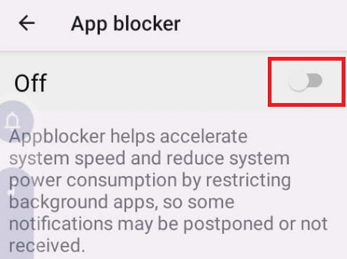

* * *

orphan: true

* * *

# Unihertz Jelly

## Jelly 2

Do not confuse with Jelly Star (below).

**Vorteile**

* Es ist wirklich klein.
* Android 11.
* Selbst wenn Du Leutene erklärst, werden es manche Menschen nicht als normales Smartphone ansehen und vielleicht eher in Bereichen, in denen keine Smartphones erlaubt sind, akzeptieren.

**Nachteile**

* Nur für erfahrene Looper zu empfehlen (Manche Einstellungen sind nicht zu erkennen, man muss aus Erfahrungen mit einem großen Android-AAS-Phone wissen, wie und wo was steht. Manche AAPS Buttons kann man mit viel Gefühl nur schwer antippen, mit Wurstfingern gar nicht.)
* Nur als Loop-Phone zu nutzen. In wessen Hosentasche ein normales Android passt, ist damit besser beraten. 

### Optimierung der Akkulaufzeit

Das Jelly 2 hat sehr leistungsfähige Optimierungsfunktionen, die für AAPS (und andere DIY-Apps wie BYODA, xDrip+, OOP2, Juggluco usw.) **deaktiviert werden müssen** .

Die Funktion "Intelligent Assistance" kann aktiviert bleiben, **muss aber für DIY-Apps deaktiviert werden**.

NFC kann für Nutzung mit Libre Sensoren aktiviert werden.

## Jelly Star Mini

**Funktionalitäten**

* Android 13
* 8 GB RAM

### Optimierung der Akkulaufzeit

To avoid interference with **AAPS**, the Jelly Star 'battery usage' should be disabled by selecting 'unrestricted' (and other **DIY apps** like BYODA, xDrip+, OOP2, Juggluco, etc...).

### Intelligent Assistance and App Blocker

Like with the Jelly 2 (above), the Jelly Star should have 'Intelligent Assistance' disabled for **DIY apps**. Similarly, 'App Blocker' under 'Settings' must also be switched off to avoid disruption with **AAPS**:

### Google Play Protect

Remember to disable Google Play Protect.