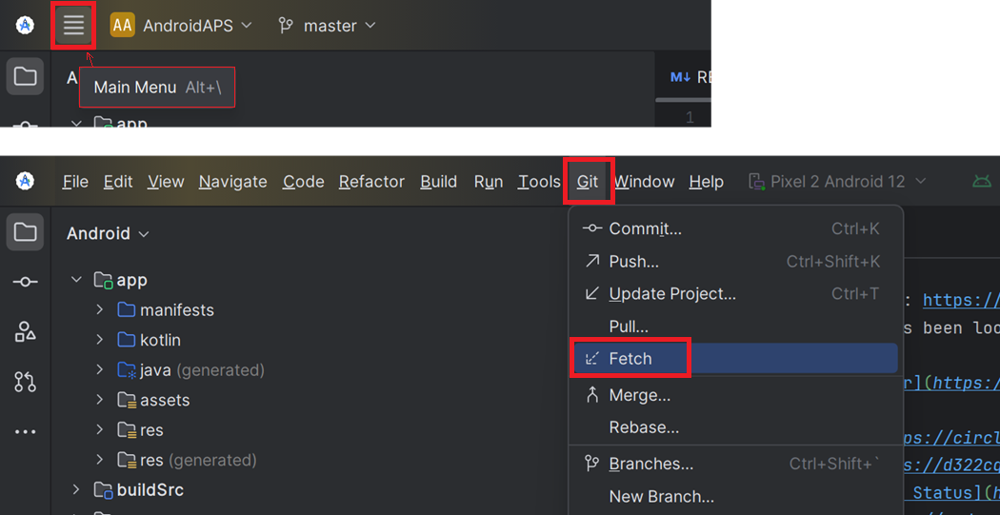

# Update with a computer

## Kein Download möglich - APK muss selbst erstellt werden

**AAPS** is not available to download, due to regulations concerning medical devices. Es ist zulässig, die App für den eigenen Gebrauch zu erstellen, aber du darfst keine Kopie an andere weitergeben! Zu den Details schaue bitte auf die [FAQ-Seite](../UsefulLinks/FAQ.md).

```{note}
Falls Du **AAPS** auf einem neuen Computer erstellen möchtest: Kopiere das Backup Deiner Keystore-Datei auf den neuen Computer. Folge dann dem [Prozess für die erstmalige **AAPS**-Erstellung](../SettingUpAaps/BuildingAaps.md) und nicht dieser Anleitung. Der einzige Unterschied besteht darin, dass Du anstelle einen neuen Keystore zu erstellen, den Keystore auswählst, den Du auf den neuen Computer kopiert hast.
```

## Overview for updating to a new version of AAPS with a computer

```{contents} Steps for updating to a new version of AAPS
:depth: 1
:local: true
```

In case you experience problems, see separate page for [troubleshooting Android Studio](../GettingHelp/TroubleshootingAndroidStudio).

### Export your settings

Exportiere die Einstellungen Deiner aktuellen **AAPS**-Version Deines Smartphones. Vielleicht brauchst Du sie nicht, aber sicher ist sicher.

Wenn Du nicht mehr genau weißt, wie man das macht, schaue auf der Seite [Export & Import der Einstellungen](ExportImportSettings.md) nach.

### Check your Android Studio version

The minimal version required is described in the [Building Instructions](#Building-APK-recommended-specification-of-computer-for-building-apk-file). If your version is older, please [update Android Studio first](#Building-APK-install-android-studio)!

(Update-to-new-version-update-your-local-copy)=
### Update your local copy

```{admonition} WARNING
:class: warning
If you update from versions prior to 2.8.x, please follow the instructions to do a [New clone](../SettingUpAaps/BuildingAaps.md), as this guide will not work for you!
```

* Öffne Dein bestehendes AAPS-Projekt mit Android Studio. Möglicherweise musst Du Dein Projekt wählen. Klicke (doppelt) auf das AAPS-Projekt.

  

* Wähle in der Menüleiste des Android Studios Git -> Fetch

   

* Unten rechts wird Dir eine Meldung angezeigt, sobald der Fetch erfolgreich durchgeführt wurde.

   

* Wähle nun in der Menüleiste Git -> Pull

   

* Lasse alle Optionen wie sie sind (Original/Master) und wähle Pull.

   

* Warte ab, während der Download läuft. Du siehst dazu einen Hinweis in der Fußzeile. Eine Erfolgsmeldung wird angezeigt, so bald erfolgreich heruntergeladen wurde.

  ```{note}
  Die Anzahl der aktualisierten Dateien kann unterschiedlich sein! Dies ist kein Hinweis auf einen Download-Fehler.
  ```

   

* Gradle Sync wird ausgeführt, um einige Abhängigkeiten herunterzuladen. Warte, bis es fertig ist.

  

### JVM-Version prüfen

This check is particularly indicated if you have already built a previous version of **AAPS** on the same computer.

Check in the [Building Instructions](#Building-APK-recommended-specification-of-computer-for-building-apk-file) the required version for JVM, matching the **AAPS** version you are now building. Um sicherzustellen, dass Du die korrekte JVM-Version verwendest, befolge die Schritte, die im Abschnitt [Incompatible Gradle JVM](#incompatible-gradle-jvm) beschriebenen sind.

(Update-to-new-version-build-the-signed-apk)=
### Erstelle die signierte APK

Dein Quellcode entspricht jetzt der zuletzt freigegebenen Version und alle Voraussetzungen sind geprüft. Es ist an der Zeit, die signierte APK wie im Abschnitt[Signierte AAPS APK erstellen](#Building-APK-generate-signed-apk) beschrieben zu erstellen (bauen).

(Update-to-new-version-transfer-and-install)=

### Übertrage und installiere die APK
Du musst die APK-Datei auf Dein Smartphone übertragen, um sie dort installieren zu können.

```{note}
Wenn Du beim Erstellen Deinen bestehenden „Keystore“ im Android Studio genutzt hast, musst Du die bestehende App nicht deinstallieren. Um die APK zu installieren, folge den Anweisungen während des Updatevorgangs.
In allen anderen Fällen (z.B. wenn ein neuer 'key store' für das Signieren der APK genutzt wurde), muss die alte App gelöscht werden, bevor die neue Version installiert werden kann. **Achte darauf, Deine Einstellungen zu exportieren!**
```

Nutze die Anleitung [AAPS auf Dein Smartphone übertragen und installieren](../SettingUpAaps/TransferringAndInstallingAaps.md)

Continue [here](#Update-to-new-version-check-aaps-version-on-phone).

## Problembehandlung

Keine Panik, wenn irgendetwas schiefläuft.

Tief durchatmen!

Danach schaue auf der Seite [Fehlerbehebung für Android Studio](../GettingHelp/TroubleshootingAndroidStudio) nach einer Lösung, sofern Dein Problem bereits bekannt sein sollte!

If you need further help, please reach out to other **AAPS** users on [Facebook](https://www.facebook.com/groups/AndroidAPSUsers) or [Discord](https://discord.gg/4fQUWHZ4Mw).