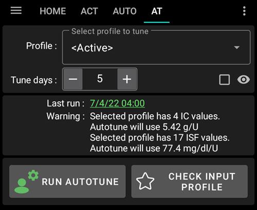
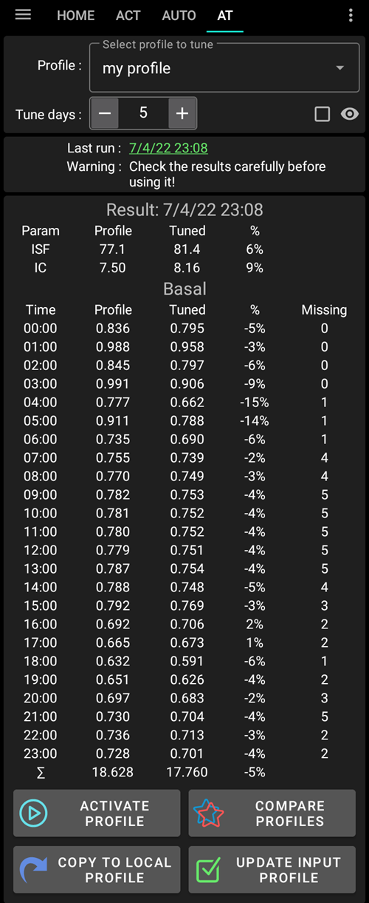
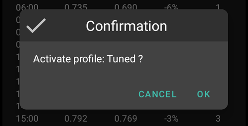
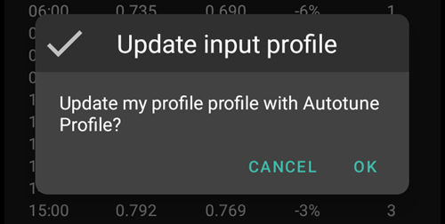
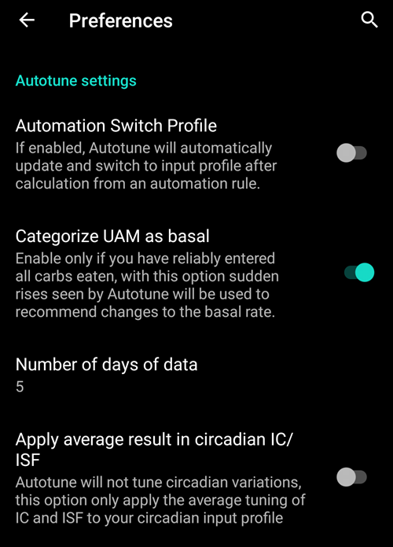
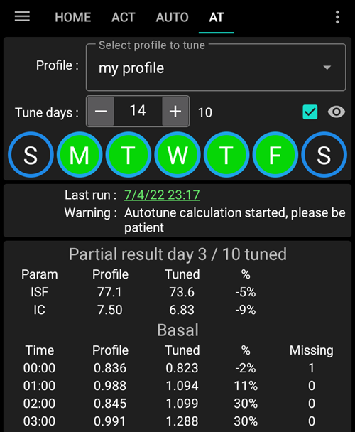
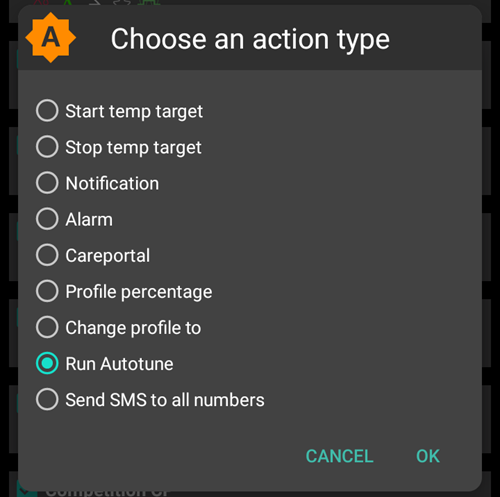
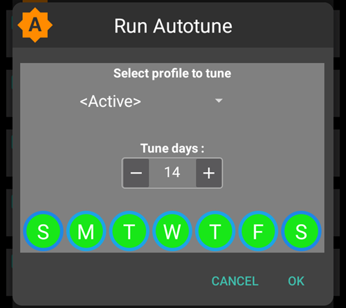

# Come usare il plugin Autotune

La documentazione sull'algoritmo Autotune è disponibile nella [documentazione OpenAPS](https://openaps.readthedocs.io/en/latest/docs/Customize-Iterate/autotune.html).

Il plugin Autotune è un'implementazione dell'algoritmo Autotune di OpenAPS all'interno di AAPS.

Il Plugin Autotune è disponibile nelle versioni di AAPS dalla [3.4](#version3400) ma è nascosto per impostazione predefinita.

## Mostrare il plugin Autotune

Crea un file vuoto denominato `enable_autotune` nella sottocartella `extra` della tua [directory AAPS](#preferences-maintenance-settings) sul telefono.

***NOTA: Assicurati di controllare nelle impostazioni di **AAPS** dove si trova la tua Directory AAPS e di aver messo il file in quella corretta; diversi utenti sono stati colti di sorpresa mettendo il file nella cartella sbagliata.***


Autotune verrà quindi visualizzato nel Costruttore di configurazione dopo aver riavviato AAPS.


***NOTA: Se non riesci a vedere l'opzione `Autotune` dovrai fare clic sulla freccia evidenziata (casella rossa) per espandere e mostrare tutte le impostazioni nella sezione `Generale`.***

## Interfaccia utente Autotune



- È possibile selezionare nel menu a tendina di scelta Profilo, quello che si desidera aggiornare (come impostazione predefinita è selezionato il profilo attivo corrente)
  - Nota: Ogni volta che si seleziona un nuovo profilo, i risultati precedenti verranno rimossi e il parametro Tune Days verrà impostato sul valore predefinito
- Poi Giorni di ottimizzazione serve per selezionare il numero di giorni usati nel calcolo per ottimizzare il profilo. Il valore minimo è 1 giorno e il valore massimo 30 giorni. Questo numero non dovrebbe essere troppo basso per ottenere risultati corretti e regolari (oltre 7 giorni per ogni calcolo)
  - Nota: ogni volta che si cambia il parametro Tune Days, i risultati precedenti verranno rimossi
- Last Run è un link che recupera l'ultimo calcolo valido. Se non hai lanciato Autotune il giorno corrente, o se i risultati precedenti sono stati rimossi con una modifica del parametro di calcolo sopra riportata, allora puoi recuperare i parametri e i risultati dell'ultima esecuzione riuscita.
- Una nota segnala ad esempio, alcune informazioni sul profilo selezionato (se si hanno diversi valori IC o diversi valori ISF)
  - Nota: Il calcolo automatico funziona con un solo IC e un singolo valore ISF. Attualmente non esiste un algoritmo Autotune per ottimizzare un IC circadiano o un ISF circadiano. Se il tuo profilo di input ha diversi valori, puoi vedere nella sezione di avvisi il valore medio preso in considerazione per sintonizzare il tuo profilo.
- Il pulsante Controlla il profilo di Input consente una rapida verifica del profilo (Unità, DIA, IC, ISF, basale e target)
  - Nota: Autotune regola solo il tuo IC (valore singolo), ISF (valore singolo) e basale (con variazione circadiana). Le unità, la DIA e il target rimarranno invariati nel profilo di output.

- "Run Autotune" lancerà il calcolo di Autotune con il profilo selezionato e il numero di giorni di sintonizzazione
  - Nota: il calcolo automatico può richiedere molto tempo. Una volta lanciato, è possibile passare a un'altra schermata (come quella iniziale , ...) e tornare successivamente nel plugin Autotune per vedere i risultati

  

- Poi durante l'esecuzione i risultati intermedi verranno visualizzati nell'area sottostante

  - Nota: Durante l'esecuzione, le impostazioni sono bloccate, quindi non è più possibile modificare il profilo di input selezionato o il numero di giorni. Dovrai aspettare la fine del calcolo corrente se vuoi lanciare un'altra esecuzione con altri parametri.

  

- Quando il calcolo di Autotune è finito, vedrai il risultato (profilo sintonizzato) e quattro pulsanti sotto.

  

- È importante confrontare sempre il profilo di input (colonna "Profilo"), il profilo di output (colonna "Tuned") e la percentuale di variazione per ciascun valore (colonna "%").

- Per i valori della basale, avete anche il numero di "giorni mancanti". Ci sono giorni mancanti in cui Autotune non ha abbastanza dati classificati come "Basal" per regolare la velocità basale per questo periodo (ad esempio dopo ogni pasto quando si ha l'assorbimento di carboidrati). Questo numero dovrebbe essere il più basso possibile, specialmente quando la basale è importante (per esempio durante la notte o alla fine del pomeriggio)

- Il pulsante "Confronta profili" apre la visualizzazione del comparatore del profilo. Il profilo di input è in blu e il profilo di output (chiamato "Tuned") è in rosso.

  - Nota: nell'esempio sottostante il profilo di input ha una variazione circadiana per IC e ISF, ma il profilo calcolato in uscita ha un singolo valore. Se è importante per te ottenere un profilo di output circadiano vedere [Profilo IC o ISF Circadiano](#autotune-circadian-ic-or-isf-profile) di seguito.

  

- Se ti fidi dei risultati (bassa percentuale di variazione tra il profilo di input e il profilo di output), puoi cliccare sul pulsante "Attiva il profilo" e poi cliccare su OK per convalidarlo.

  - Il profilo Activate Tuned creerà automaticamente un nuovo profilo "Tuned" nel plugin del profilo locale.
  - Se hai già un profilo chiamato "Tuned" nel plugin del tuo profilo locale, questo profilo verrà aggiornato con il profilo Autotune calcolato prima dell'attivazione

  

- Se pensi che il profilo Tuned debba essere regolato (ad esempio se pensi che alcune variazioni siano troppo importanti), puoi cliccare sul pulsante "Copia sul profilo locale"

  - Un nuovo profilo con il prefisso "Tuned" e la data e l'ora di esecuzione saranno creati nel plugin del profilo locale

  

- È quindi possibile selezionare il profilo locale per modificare il profilo aggiornato (sarà selezionato come impostazione predefinita quando si apre il plugin del profilo locale)

  - i valori nel profilo locale saranno arrotondati nell'interfaccia utente alle capacità della pompa

  

- Se si desidera sostituire il profilo di input con il risultato Autotune, fare clic sul pulsante "Aggiorna profilo di input" e convalidare con OK

  - Nota: se fai clic su "Attiva il profilo" dopo "Aggiorna il profilo di input", attiverai il tuo profilo aggiornato e non il profilo predefinito "Tuned"?

  

- Se è stato aggiornato il profilo di input, il pulsante "Aggiorna profilo di input" viene sostituito dal pulsante "Revert input profile" (vedere la schermata sottostante). Puoi vedere immediatamente in questo modo se il tuo attuale profilo di input nel plugin del profilo locale include già il risultato dell'ultima esecuzione o meno. Hai anche la possibilità di recuperare il tuo profilo di input senza risultati automatici con questo pulsante

  


## Impostazioni Autotune

(autotune-plugin-settings)=

### Impostazioni plugin Autotune

  

```{admonition} Only DEV
:class: info
La funzionalità Cambio Profilo Automatico è disponibile solo in modalità Dev/Engineering.
```

- Cambio Profilo Automatico (predefinito Off): vedere [Esegui Autotune con una regola di automazione](#autotune-run-autotune-with-an-automation-rule) di seguito. Se si modifica questa impostazione in On, il profilo di input verrà automaticamente aggiornato dal profilo Tuned e verrà attivato.
  - **Fai attenzione, devi fidarti e verificare durante diversi giorni successivi, che dopo un aggiornamento e l'attivazione del profilo Tuned senza modifiche, il tuo loop migliori**

- Categorize UAM as basal (default On): Questa impostazione è per gli utenti che usano AndroidAPS senza alcun carbs inserito (Full UAM). Impedirà (quando disattivato) di classificare l'UAM come basale.
  - Nota: se viene rilevata almeno un'ora di assorbimento dei carboidrati durante un giorno, tutti i dati classificati come "UAM" saranno classificati come basali, indipendentemente da questa impostazione (On o Off)
- Numero di giorni di dati (predefinito 5): è possibile definire il valore predefinito con questa impostazione. Ogni volta che si seleziona un nuovo profilo nel plugin Autotune, il parametro Tune days sarà sostituito da questo valore predefinito
- Applica risultato medio in IC/ISF circadiano (predefinito Off): vedere [Profilo IC o ISF Circadiano](#autotune-circadian-ic-or-isf-profile) di seguito.

### Altre impostazioni

- Autotune usa anche il rapporto max autosens e il rapporto min autosens per limitare la variazione. È possibile vedere e regolare questi valori in Config Builder & #062; Sensitivity detection plugin & #062; Impostazioni & #062; Impostazioni avanzate

  


## Funzioni avanzate

(autotune-circadian-ic-or-isf-profile)=

### IC Circadiano o profilo ISF

- Se hai un'importante variazione di IC e/o di ISF nel tuo profilo, e ti fidi completamente del tuo tempo e della tua variazione circadiana, allora puoi impostare "Applicare il risultato medio in IC/ISF circadiano"

  - . Si noti che il calcolo di Autotune sarà sempre fatto con un singolo valore, e la variazione circadiana non sarà regolata da Autotune. Questa impostazione applica solo la variazione media calcolata per IC e/o ISF sui valori circadiani

- Guarda nella schermata sotto Profilo aggiornato con Applica variazione media Off (a sinistra) e On (a destra)

  


### Aggiorna uno specifico giorno della settimana

- Se fai clic sulla casella di controllo con l'occhio a destra del parametro "Giorni di ottimizzazione", vedrai la selezione del giorno. È possibile specificare quale giorno della settimana deve essere incluso nel calcolo di Autotune (nella schermata sottostante è possibile vedere un esempio di "giorni lavorativi" con sabato e domenica rimossi dal calcolo automatico)
  - Se il numero di giorni inclusi nel calcolo di Autotune è inferiore al numero di giorni di sintonizzazione, vedrai quanti giorni saranno inclusi a destra del selettore di Tune days (10 giorni nell'esempio sottostante)
  - Questa impostazione dà buoni risultati solo se il numero di giorni rimanenti non è troppo piccolo (ad esempio se si sintonizza un profilo specifico per i giorni di fine settimana con solo la domenica e il sabato selezionati, è necessario selezionare un minimo di 21 o 28 giorni di sintonizzazione per avere 6 o 8 giorni inclusi nel calcolo di Autotune)

  

- Durante il calcolo di Autotune, è possibile vedere l'avanzamento dei calcoli ("Risultato parziale giorno 3 / 10 sintonizzato" sull'esempio sotto)

  


(autotune-run-autotune-with-an-automation-rule)=

## Esegui Autotune con una regola di automazione

```{admonition} Only DEV
:class: info
La funzionalità Cambio Profilo Automatico è disponibile solo in modalità Dev/Engineering.
```

Il primo passo è definire il trigger corretto per una regola di automazione con Autotune:

Nota: per ulteriori informazioni su come impostare una regola di automazione, vedi [qui](../DailyLifeWithAaps/Automations.md).

- Dovresti selezionare il trigger di tempo ricorrente: esegui Autotune solo una volta al giorno, e autotune è progettato per essere eseguito quotidianamente (ogni nuova esecuzione sposti un giorno dopo e rapidamente la modifica del profilo dovrebbe essere minima)

  

- È meglio all'inizio eseguire Autotune durante il giorno per essere in grado di controllare i risultati. Se vuoi eseguire Autotune durante la notte, devi selezionare nel trigger le 4:00 o dopo per includere il giorno corrente nel prossimo Calcolo Autotune.

  

- Quindi è possibile selezionare la funzione "Esegui Autotune" dall' elenco

  

- È quindi possibile selezionare la funzione Autotune per regolare i parametri per l'esecuzione. I parametri predefiniti sono "Profilo attivo", il valore di Tune days predefinito definito nelle preferenze di plugin di Autotune e tutti i giorni sono selezionati.

  

- Dopo alcuni giorni, se ti fidi completamente dei risultati di Autotune e la percentuale di modifica è bassa, puoi modificare le [impostazioni di Autotune](#autotune-plugin-settings) "Profilo di commutazione di automazione" per abilitare l'aggiornamento automatico e attivare il profilo sintonizzato dopo il calcolo.

Nota: se vuoi ottimizzare automaticamente i profili per giorni specifici della settimana (ad esempio un profilo per "Giorni del weekend" e un altro per "Giorni lavorativi"), allora crea una regola per ogni profilo, seleziona gli stessi giorni nel Trigger e nell'Azione Autotune, i Giorni di ottimizzazione devono essere abbastanza alti per essere sicuri che l'ottimizzazione venga effettuata con almeno 6 o 8 giorni, e non dimenticare di selezionare l'ora dopo le 4:00 nel trigger...

- Vedere di seguito un esempio di regola per ottimizzare "il mio profilo" in tutti i "Giorni lavorativi" con 14 Giorni di ottimizzazione selezionati (quindi solo 10 giorni inclusi nel calcolo autotune).

  


## Consigli e trucchi

Autotune funziona con le informazioni esistenti nel tuo database, quindi se hai appena installato AAPS su un nuovo telefono, dovrai aspettare diversi giorni prima di essere in grado di lanciare Autotune con abbastanza giorni per ottenere risultati rilevanti.

Autotune è solo un aiuto, è importante controllare regolarmente se sei d'accordo con il profilo calcolato. In caso di dubbi, modificare le impostazioni di Autotune (ad esempio il numero di giorni) o copiare i risultati nel profilo locale e regolare il profilo prima di utilizzarlo.

Usare sempre Autotune per diversi giorni manualmente per controllare i risultati prima di applicarli. Ed è solo quando ti fidi completamente dei risultati di Autotune, e quando la variazione diventa minima tra il profilo precedente e il profilo calcolato, che inizi a usare l'automazione (mai prima)

- Autotune può funzionare molto bene per alcuni utenti e non per altri, quindi se non ti fidi del risultato di Autotune, non usarlo

È anche importante analizzare i risultati di Autotune per capire (o cercare di capire) perché Autotune propone queste modifiche

- puoi avere un aumento o una diminuzione complessiva della forza del tuo profilo (ad esempio aumento della basale totale associato a diminuzione dei valori ISF e IC). Potrebbe essere associato a diversi giorni consecutivi con correzione autosens superiore al 100% (richiesta maggiore aggressività) o inferiore al 100% (sei più sensibile)
- A volte Autotune propone un diverso equilibrio tra velocità basali e IC/ISF (ad es. basale inferiore e IC/ISF più aggressivo)

Si consiglia di non utilizzare Autotune nei seguenti casi:

- Non inserisci tutti i tuoi carboidrati
  - Se non inserisci la correzione con carboidrati per l'ipoglicemia, Autotune vedrà un aumento inaspettato della glicemia e aumenterà le velocità basali 4 ore prima, potrebbe essere l'opposto di ciò che hai bisogno per evitare l'ipo, specialmente se è nel mezzo della notte. Ecco perché è importante inserire tutti i carboidrati, specialmente la correzione per l'ipo.
- Hai molti periodi con UAM rilevati durante il giorno.
  - Hai inserito tutti i tuoi carboidrati e correttamente stimato i tuoi Carboidrati?
  - Tutti i periodi UAM (tranne se non inserisci carboidrati durante un giorno e categorizzare UAM come basale è disabilitato), tutti i tuoi periodi UAM verranno categorizzati come basale, il che può aumentare molto la basale (molto più del necessario)

- L'assorbimento dei carboidrati è molto lento: se la maggior parte dell'assorbimento dei carboidrati viene calcolato con il parametro min_5m_carbimpact (si possono vedere questi periodi con un piccolo punto arancione nella parte superiore della curva COB), il calcolo del COB potrebbe essere sbagliato e portare a risultati sbagliati.
  - Quando fai sport, generalmente sei più sensibile e la glicemia non sale molto, quindi durante o dopo un esercizio è normale vedere alcuni periodi con assorbimento lento dei carboidrati. Ma se hai troppo spesso assorbimento lento inaspettato dei carboidrati, potresti aver bisogno di un aggiustamento del profilo (valore più alto di IC) o di un min_5m_carbimpact un po' troppo alto.
- Hai "giorni molto cattivi", ad esempio bloccato per diverse ore in iperglicemia con una grande quantità di insulina per riuscire a tornare nell'intervallo, o dopo un cambio del sensore hai lunghi periodi di valori di glicemia errati. Se nelle ultime settimane hai solo uno o 2 "giorni cattivi", puoi disabilitare manualmente questi giorni nel calcolo autotune per escluderli dal calcolo, e di nuovo **controlla attentamente se puoi fidarti dei risultati**
- Se la percentuale di modifica è troppo importante
  - Si può provare ad aumentare il numero di giorni per ottenere risultati più agevoli
