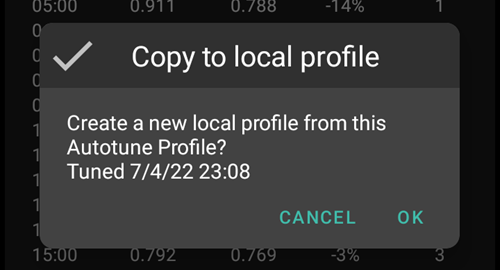
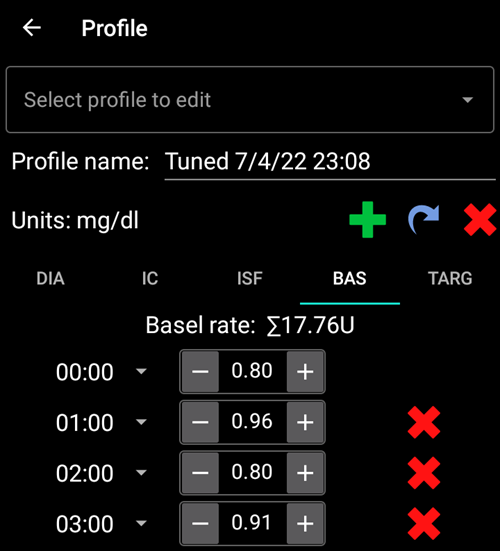
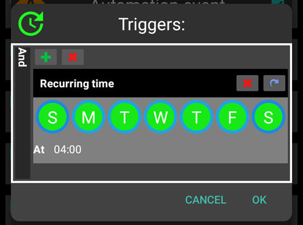

# Come usare il plugin Autotune (solo con versione dev)

La documentazione sull'algoritmo di Autotune è disponibile in [OpenAPS documentation](https://openaps.readthedocs.io/en/latest/docs/Customize-Iterate/autotune.html).

Il plugin Autotune è un'implementazione dell'algoritmo di Autotune di OpenAPS all'interno di AAPS.

**Attualmente Autotune Plugin è disponibile solo in [dev branch](../AdvancedOptions/DevBranch.md) e in modalità Engineering.**

## Interfaccia utente Autotune

- È possibile selezionare nel menu a tendina di scelta Profilo, quello che si desidera aggiornare (come impostazione predefinita è selezionato il profilo attivo corrente)
  - Nota: Ogni volta che si seleziona un nuovo profilo, i risultati precedenti verranno rimossi e il parametro Tune Days verrà impostato sul valore predefinito
- Then Tune days is to select the number of days used in calculation to tune your profile. Il valore minimo è 1 giorno e il valore massimo 30 giorni. Questo numero non dovrebbe essere troppo basso per ottenere risultati corretti e regolari (oltre 7 giorni per ogni calcolo)
  - Nota: ogni volta che si cambia il parametro Tune Days, i risultati precedenti verranno rimossi
- Last Run è un link che recupera l'ultimo calcolo valido. Se non hai lanciato Autotune il giorno corrente, o se i risultati precedenti sono stati rimossi con una modifica del parametro di calcolo sopra riportata, allora puoi recuperare i parametri e i risultati dell'ultima esecuzione riuscita.
- Una nota segnala ad esempio, alcune informazioni sul profilo selezionato (se si hanno diversi valori IC o diversi valori ISF)
  - Nota: Il calcolo automatico funziona con un solo IC e un singolo valore ISF. Attualmente non esiste un algoritmo Autotune per sintonizzare un IC o un ISF circadiani. Se il tuo profilo di input ha diversi valori, puoi vedere nella sezione di avvisi il valore medio preso in considerazione per sintonizzare il tuo profilo.
- Il pulsante Controlla il profilo di Input consente una rapida verifica del profilo (Unità, DIA, IC, ISF, basale e target)
  - Nota: Autotune regola solo il tuo IC (valore singolo), ISF (valore singolo) e basale (con variazione circadiana). Le unità, la DIA e il target rimarranno invariati nel profilo di output.

- "Run Autotune" lancerà il calcolo di Autotune con il profilo selezionato e il numero di giorni di sintonizzazione
  - Nota: il calcolo automatico può richiedere molto tempo. Una volta lanciato, è possibile passare a un'altra schermata (come quella iniziale , ...) e tornare successivamente nel plugin Autotune per vedere i risultati

- Poi durante l'esecuzione i risultati intermedi verranno visualizzati nell'area sottostante

  - Nota: Durante l'esecuzione, le impostazioni sono bloccate, quindi non è più possibile modificare il profilo di input selezionato o il numero di giorni. Dovrai aspettare la fine del calcolo corrente se vuoi lanciare un'altra esecuzione con altri parametri.

  

- Quando il calcolo di Autotune è finito, vedrai il risultato (profilo sintonizzato) e quattro pulsanti sotto.

- It's important to always compare input profile (column "Profile"), output profile (column "Tuned") and the percentage of variation for each value (Column "%").

- Per i valori della basale, avete anche il numero di "giorni mancanti". Ci sono giorni mancanti in cui Autotune non ha abbastanza dati classificati come "Basal" per regolare la velocità basale per questo periodo (ad esempio dopo ogni pasto quando si ha l'assorbimento di carboidrati). Questo numero dovrebbe essere il più basso possibile, specialmente quando la basale è importante (per esempio durante la notte o alla fine del pomeriggio)

- Il pulsante "Confronta profili" apre la visualizzazione del comparatore del profilo. Il profilo di input è in blu e il profilo di output (chiamato "Tuned") è in rosso.

  - Nota: nell'esempio sottostante il profilo di input ha una variazione circadiana per IC e ISF, ma il profilo calcolato in uscita ha un singolo valore. Se è importante per voi ottenere un profilo di output circadiano andate alla sezione [ IC circadiano o profilo ISF ](#circadian-ic-or-isf-profile) qui sotto.

  

- Se ti fidi dei risultati (bassa percentuale di variazione tra il profilo di input e il profilo di output), puoi cliccare sul pulsante "Attiva il profilo" e poi cliccare su OK per convalidarlo.

  - Il profilo Activate Tuned creerà automaticamente un nuovo profilo "Tuned" nel plugin del profilo locale.
  - Se hai già un profilo chiamato "Tuned" nel plugin del tuo profilo locale, questo profilo verrà aggiornato con il profilo Autotune calcolato prima dell'attivazione

  

- Se pensi che il profilo Tuned debba essere regolato (ad esempio se pensi che alcune variazioni siano troppo importanti), puoi cliccare sul pulsante "Copia sul profilo locale"

  - Un nuovo profilo con il prefisso "Tuned" e la data e l'ora di esecuzione saranno creati nel plugin del profilo locale

- È quindi possibile selezionare il profilo locale per modificare il profilo aggiornato (sarà selezionato come impostazione predefinita quando si apre il plugin del profilo locale)

  - the values in local profile will but rounded in the user interface to your pump capabilities

  

- If you want to replace your input profile with Autotune result, click on "Update input profile" button and validate the Popup with OK

  - Note: if you click on "Activate profile" after "Update input profile", then you will activate your updated profile and not the default "Tuned" profile?

  

- If you have updated your input profile, then the "Update input profile" button is replaced by "Revert input profile" button (see screenshot below). You can that way immediately see if your current input profile in Local profile plugin already include the result of last run or not. You also have the possibility to recover you input profile without autotune result with this button

  

## Autotune settings

(autotune-plugin-settings)=

### Autotune plugin settings

- Automation Switch Profile (default Off): see [Run Autotune with an automation rule](#run-autotune-with-an-automation-rule) below. If you change this setting to On, the input profile will automatically be updated by the Tuned profile, and it will be activated.
  - **Be Careful, you must trust and verify during several following days, that after an update and activation of Tuned profile without modification, it improves your loop**

- Categorize UAM as basal (default On): This setting is for the users using AndroidAPS without any carbs entered (Full UAM). It will prevent (when Off) to categorize UAM as basal.
  - Note: if you have at least one hour of Carbs absorption detected during one day, then all data categorized as "UAM" will be categorized as basal, whatever this setting (On or Off)
- Number of days of data (default 5): You can define default value with this setting. Each time your select a new profile in Autotune plugin, Tune days parameter will be replaced by this default value
- Apply average result in circadian IC/ISF (default Off): see [Circadian IC or ISF profile](#circadian-ic-or-isf-profile) below.

### Other settings

- Autotune also uses Max autosens ratio and Min autosens ratio to limit variation. You can see and adjust these values in Config Builder > Sensitivity detection plugin > Settings > Advanced Settings

  

## Advanced feature

(autotune-circadian-ic-or-isf-profile)=

### Circadian IC or ISF profile

- If you have important variation of IC and/or you ISF in your profile, and you fully trust in your circadian time and variation, then you can set "Apply average result in circadian IC/ISF"

  - Note that Autotune calculation will always be done with a single value, and circadian variation will not be tuned by Autotune. This setting only apply average variation calculated for IC and/or ISF on your circadian values

- See on screenshot below Tuned profile with Apply average variation Off (on the left) and On (on the right)

  

### Tune specific days of the week

- If you click on the checkbox with the eye on the right of "Rune days" parameter, you will see the day selection. You can specify which day of the week should be included in Autotune calculation (in screenshot below you can see an example for "working days" with Saturday and Sunday removed from autotune calculation)
  - If the number of day included in Autotune calculation is lower than the number of Tune days, then you will see how many days will be included on the right of Tune days selector (10 days in the example below)
  - This setting gives good results only if the number of remaining days is not to small (for example if you Tune a specific profile for week end days with only Sunday and Saturday selected, you should select a minimum of 21 or 28 Tune days to have 6 or 8 days included in Autotune calculation)

- During Autotune calculation, you can see the progress of the calculations ("Partial result day 3 / 10 tuned" on example below)

  

(autotune-run-autotune-with-an-automation-rule)=

## Run Autotune with an automation rule

First step is to define correct trigger for an automation rule with Autotune:

Note: for more information on how to set an automation rule, see [here](../DailyLifeWithAaps/Automations.md).

- You should select Recurring time trigger: only run Autotune once per day, and autotune is designed to be run daily (each new run you shift one day later and quickly profile modification should be tiny)

  

- It's better at the beginning to run Autotune during the day to be able to check results. If you want to run Autotune during the night, you have to select in the trigger 4AM or later to include current day in next Autotune Calculation.

  

- Then you can select "Run Autotune" Action in the list

  

- You can then select Autotune Action to adjust parameters for your run. Default parameters are "Active Profile", default Tune days value defined in Autotune Plugin preferences, and All days are selected.

  

- After a few days, if you fully trust Autotune results and percentage of modification is low, you can modify [Autotune settings](#autotune-plugin-settings) "Automation Switch Profile" to enabled to automatically update and activate profile tuned after calculation.

Note: if you want to automatically tune profiles for specific days of the week (for example a profile for "Weekend days" and another one for "Working days"), then create one rule for each profile, select the same days in Trigger and in Autotune Action, Tune days must be high enough to be sure tuning will be done with at least 6 or 8 days, and don't forget to select time after 4AM in trigger...

- See below an example of rule to tune "my profile" on all "Working days" with 14 Tune days selected (so only 10 days included in autotune calculation).

## Tips and trick's

Autotune works with information existing in your database, so if you just installed AAPS on a new phone, you will have to wait several days before being able to launch Autotune with enough days to get relevant results.

Autotune is just an help, it's important to regularly check if you agree with calculated profile. If you have any doubt, change Autotune settings (for example the number of days) or copy results in local profile and adjust profile before using it.

Always use Autotune several days manually to check results before applying them. And it's only when you fully trust Autotune results, and when variation becomes tiny between previous profile and calculated profile than you start to use Automation (Never before)

- Autotune can work very well for some users and not for others, so **If you don't trust Autotune result, don't use it**

It's also important to analyse Autotune results to understand (or try to understand) why Autotune propose these modifications

- you can have a whole increase or decrease of the strength of your profile (for example increase of total basal associated to decrease of ISF and IC values). it could be associated to several following days with autosens correction above 100% (more agressivity required) or below 100% (you are more sensitive)
- Sometimes Autotune propose a different balance between basal rates and IC/ISF (for ex lower basal and more aggressive IC/ISF)

We advise to not use Autotune in the following cases:

- You don't enter all your carbs
  - If you don't enter carbs correction for an hypoglycemia, Autotune will see an unexpected increase of your BG value and will increase your basal rates the 4 hours earlier, it could be the opposite of what you need to avoid hypo, especially if it's in the middle of the night. That's why it's important to enter all carbs especially correction for hypo.
- You have a lot of period with UAM detected during the day.
  - Do you have entered all your carbs and correctly estimated your Carbs ?
  - All UAM periods (except if you enter no carbs during a day and categorized UAM as basal is disabled), all your UAM periods will be categorized as basal, this can increase a lot your basal (much more than necessary)

- Your carbs absorption is very slow: if most of your carbs absorption are calculated with min_5m_carbimpact parameter (you can see these periods with a little orange dot in the top of COB curve), the calculation of COB could be wrong and leads to wrong results.
  - When you practice sport, you are generally more sensitive and your BG doesn't rise a lot, so during or after an exercise, it's usual to see some periods with slow carbs. But if you have too often unexpected slow carb absorption, then you may need a profile adjustment (higher value of IC) or a min_5m_carbimpact a bit too high.
- You have a "very bad days", for example stuck several hours in hyperglycemia with a huge amount of insulin to be able to go down within the range, or after a sensor change you got long periods of wrong BG values. If during the pas weeks you only have one or 2 "bad days", you can disable manually these days in autotune calculation to exclude them from calculation, and again **check carefully if you can trust the results**
- If the percentage of modification is too important
  - You can try to increase the number of days to get smoother results