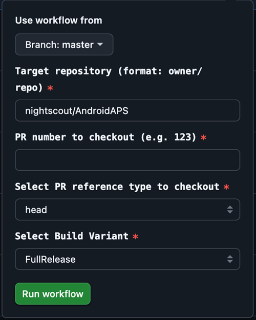

# Ramo sviluppatori (Dev)

<font color="#FF0000">**Attenzione:**</font> Il ramo Dev è solo usato per ulteriori sviluppi di AAPS. Dovrebbe essere usato su un telefono separato per testare <font color="#FF0000">**non per un circuito chiuso reale!**</font>

La versione più stabile di AAPS da usare è quella del ramo [Master](https://github.com/nightscout/AndroidAPS/tree/master).  Si consiglia di rimanere sul ramo Master per il circuito chiuso effettivo.

La versione dev di AAPS è solo per sviluppatori e collaudatori che sono al loro agio con le tracce dello stack, guardando attraverso i file di log e magari attivando il debugger per produrre segnalazioni di bug che sono utili agli sviluppatori (in breve: persone che sanno cosa stanno facendo senza essere assistite!). Quindi molte funzioni incompiute sono disabilitate. Per abilitare queste funzionalità entra in **Modalità Ingegneria** creando un file chiamato `engineering_mode` nella cartella /AAPS/extra . Abilitare la modalità di ingegneria potrebbe rompere completamente il circuito chiuso.

Tuttavia, il ramo Dev è un buon posto per vedere quali funzionalità vengono testate, per aiutare a risolvere i bug e dare un feedback su come le nuove funzionalità saranno implementate in pratica.  Spesso le persone testanno il ramo Dev su un vecchio telefono e micro fino a quando non sono sicuri che sia stabile - qualsiasi uso di esso è a tuo rischio.  Quando provi nuove funzionalità, ricorda che stai scegliendo di testare una funzionalità ancora in fase di sviluppo. Fai così al tuo rischio & con la dovuta diligenza per tenerti al sicuro.

Se trovi un bug o pensi che sia successo qualcosa di sbagliato quando usi il ramo Dev poi verificare nella [scheda Issues](https://github.com/nightscout/AndroidAPS/issues) di GitHub, per verificare se qualcun altro lo ha trovato, o aggiungerlo se nuovo.  Più informazioni puoi condividere qui meglio è (non dimenticare che potrebbe essere necessario condividere i tuoi [file di log](../GettingHelp/AccessingLogFiles.md).  Le nuove funzionalità possono essere discusse anche su [Discord](https://discord.gg/4fQUWHZ4Mw).

Una versione Dev ha una data di scadenza. Questo sembra scomodo quando lo usi in modo soddisfacente, ma serve a uno scopo. Quando una singola versione dev è in giro, è più facile tenere traccia degli errori che le persone segnalano. Gli sviluppatori non vogliono essere in una posizione in cui ci sono tre versioni di dev in giro, dove i bug sono risolti in alcuni e non altri, e la gente continua a segnalare quelli fissi.

(github-pr-test)=

## Test items in a pull request (GitHub CI actions deploy)

Available from 3.3.2.1.dev

 - Suitable for testers or those helping with testing.

```{eval-rst}
.. raw:: html

    <!--crowdin: exclude-->
    <div align="center" style="max-width: 360px; margin: auto; margin-bottom: 2em;">
      <div style="position: relative; width: 100%; aspect-ratio: 9/16;">
        <iframe
          src="https://www.youtube.com/embed/REQ7RqzoUkM"
          style="position: absolute; top: 0; left: 0; width: 100%; height: 100%;"
          frameborder="0"
          allowfullscreen>
        </iframe>
      </div>
    </div>
```



- PR number: Please enter the PR number that you want to test.

- PR reference types: PR reference types include two options:

  - head:
    - Fetches the actual content from the PR author’s branch (i.e., the original commit history without any merge operations).
    - This is equivalent to the original state of the PR branch, as if it were fetched directly from a fork or feature branch.

  - merge:
    - Fetches the result of GitHub’s pre-simulated merge of the PR into the target branch (e.g., dev).
    - This is a virtual merge commit automatically created by GitHub.
    - This commit only exists when the PR has no conflicts and is mergeable.

  - variant:
    - Please refer to [variant](variant)

  (variant)=


  ### variant

    - Select the variant you need:
      - fullRelease: For regular pump usage with full functionality.
      - [aapsclient、aapsclient2](../RemoteFeatures/RemoteControl.md#aapsclient) For caregivers (requires [Nightscout](../SettingUpAaps/Nightscout.md))。
      - pumpcontrol
      - Text ending with “Debug” indicates that the APK will be built in debug mode, which is useful for troubleshooting.
