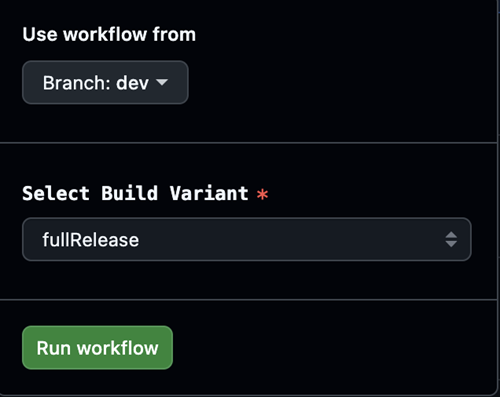

# Ramo sviluppatori (Dev)

```{warning}
Dev branch is for the further development of AAPS only. It should be used on a separate phone for testing <font color="#FF0000">**not for actual looping!**</font>
```

The most stable version of AAPS to use is that in the [Master branch](https://github.com/nightscout/AndroidAPS/tree/master).  It is advised to stay on the Master branch for actual looping.

The dev version of AAPS is only for developers and testers comfortable dealing with stacktraces, looking through log files and maybe firing up the debugger to produce bug reports that are helpful to the developers (in short: people that know what they are doing without being assisted!). Therefore many unfinished features are disabled. To enable these features enter **Engineering Mode** by creating a file named `engineering_mode` in directory /AAPS/extra . Enabling the engineering mode might break the loop entirely.

However, the Dev branch is a good place to see what features are being tested and to help iron out the bugs and give feedback on how the new features work in practice.  Often people will test the Dev branch on an old phone and pump until they are confident it is stable - any use of it is at your own risk.  When testing any new features, remember that you are choosing to test a still-in-development feature. Do so at your own risk & with due diligence to keep yourself safe.

If you find a bug or think something wrong has happened when using the Dev branch, then view the [issues tab](https://github.com/nightscout/AndroidAPS/issues) to check whether anyone else has found it, or add it yourself if not.  The more information you can share here the better (don't forget you may need to share your [log files](../GettingHelp/AccessingLogFiles.md).  The new features can also be discussed on [discord](https://discord.gg/4fQUWHZ4Mw).

A dev version has an expiration date. This seems inconvenient when using it satisfactorily, but serves a purpose. When a single dev version doing the rounds, it is easier to keep track of bugs that people are reporting. The developers do not want to be in a position where there are three versions of dev in the wild where bugs are fixed in some and not others, and people continue to report the fixed ones.

(branch-ci-test)=

## Testare un ramo specifico (branch-ci)

Per compilare un ramo di test, selezionare branch-ci, che consente di scegliere un ramo specifico per la creazione dell'APK. Puoi usare questo metodo quando hai bisogno di testare il ramo dev.




(github-pr-test)=

## Testare elementi in una pull request (azioni CI di GitHub deploy)

Available from 3.3.2.1.dev

 - Adatto per tester o per coloro che aiutano nel testing.

```{eval-rst}
.. raw:: html

    <!--crowdin: exclude-->
    <div align="center" style="max-width: 360px; margin: auto; margin-bottom: 2em;">
      <div style="position: relative; width: 100%; aspect-ratio: 9/16;">
        <iframe
          src="https://www.dailymotion.com/embed/video/x9rdx1q"
          style="position: absolute; top: 0; left: 0; width: 100%; height: 100%;"
          frameborder="0"
          allowfullscreen>
        </iframe>
      </div>
    </div>
```


- Numero PR: Inserire il numero della PR che si vuole testare.

- Tipi di riferimento PR: I tipi di riferimento PR includono due opzioni:

  - head:
    - Recupera il contenuto effettivo dal ramo dell'autore della PR (cioè, la cronologia dei commit originale senza operazioni di merge).
    - Equivale allo stato originale del ramo PR, come se fosse recuperato direttamente da un fork o da un ramo di funzionalità.

  - merge:
    - Recupera il risultato del merge pre-simulato di GitHub della PR nel ramo di destinazione (ad es. dev).
    - Si tratta di un commit di merge virtuale creato automaticamente da GitHub.
    - Questo commit esiste solo quando la PR non ha conflitti e può essere sottoposta a merge.

  - variant:
    - Please refer to [variant](#browserbuild-variant)
