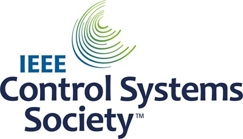
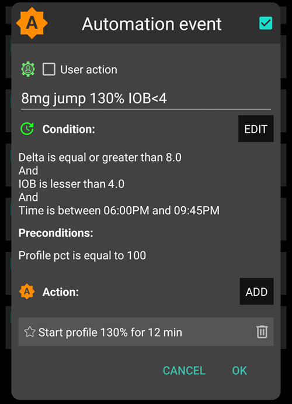
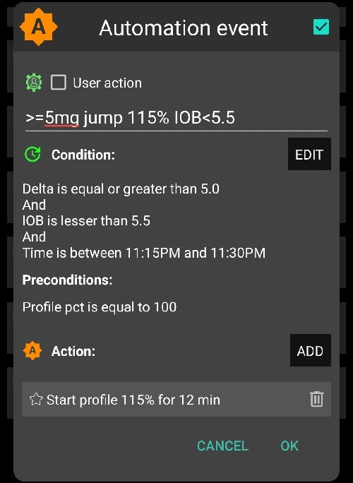
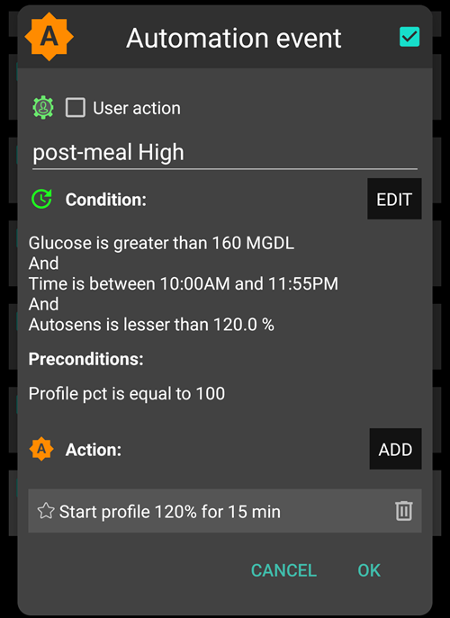

# Circuito Chiuso Completo


Il principale vantaggio del Loop Chiuso Completo **FCL** è che ha il potenziale di simulare un pancreas artificiale e rendere la gestione quotidiana più facile senza dover fare boli per i pasti.

Mentre il **loop chiuso ibrido** ('HCL') è basato su algoritmi, richiede ancora all'utente di somministrare manualmente boli prima dei pasti. Di conseguenza, il loop potrebbe andare in una sospensione temporanea (basale temporanea zero) per prevenire un'erogazione eccessiva di insulina.

In **FCL** i boli relativi alle dimensioni del pasto non sono più necessari: lasciarlo fare all'algoritmo!  **AAPS** può operare senza che l'utente dia alcun bolo e senza inserire i carboidrati, in una modalità chiamata 'pasti non annunciati' **('UAM')**. **UAM** consente ad **AAPS** di tollerare meglio input errati di carboidrati essendo più aggressivo.

## Cosa aspettarsi?

Ci sono molti studi pubblicati sui risultati favorevoli che l'**FCL** può raggiungere. Per ulteriori letture consultare quanto segue:

1)   Biblioteca Nazionale di Medicina, PubMed [Primo uso di AndroidAPS per la somministrazione automatica dell'insulina in Loop Chiuso - scenario: Pancreas4ALL Randomized Pilot Study](https://pubmed.ncbi.nlm.nih.gov/36826996/);

2)  ClinicalTrials.gov National Library of Medicine, Clinical Trial [Studio di fattibilità e sicurezza del sistema automatico di somministrazione di insulina in Loop chiuso Pancreas4ALL (ASAP)](https://www.clinicaltrials.gov/study/NCT04835350?term=Feasibility%20and%20Safety%20Study%20of%20the%20Automated%20Insulin%20Delivery%20Closed%20Loop%20System%20Pancreas4ALL%20(ASAP)&rank=1)

Il successo dell'**FCL** richiede che l'utente:

- verifichi di soddisfare i requisiti dell'**FCL**;
- configuri le **Automazioni** adattate alle proprie esigenze di gestione quotidiana; e
- metta a punto e aggiusti le impostazioni di **AAPS** (in particolare le **Automazioni**).


## Considerazioni generali sul perché (non) passare da HCL a FCL

L'**FCL** non è per tutti:

- Alcuni utenti **FCL** raggiungono un TIR (70-180) intorno al 90% e HbA1c sotto il 6%, tuttavia altri utenti preferiscono un controllo più stretto. In particolare, minimizzare i valori sopra 140 mg/dl con diete con carboidrati a rapido assorbimento richiede probabilmente un pre-bolo.
- La messa a punto di **AAPS** può essere impegnativa. Non è adatta agli utenti che si sentono sopraffatti da AAPS.  Sarà necessario dedicare alcune settimane per regolare e mettere a punto l'**FCL**. Investire tale tempo può portare a risultati migliori e a un miglior controllo della **BG**.
- La gestione dei pasti può diventare più facile, tuttavia l'esercizio fisico può essere ancora difficile nell'**FCL**. La maggior parte di noi vorrebbe limitare gli spuntini sportivi nel tentativo di controllare il peso corporeo.
- Rimangono ancora difficoltà nell'stabilire un **FCL** per i bambini (discusso di seguito).


## Ciclo chiuso ibrido ben sintonizzato

È consigliabile stabilire prima un **HCL** ben sintonizzato prima di considerare la transizione all'**FCL**.  Il successo con l'**FCL** richiede una messa a punto altamente personalizzata delle impostazioni dell'utente in modo che **AAPS** possa somministrare insulina per imitare strettamente la TUA modalità di loop chiuso ibrido di successo.

L'**FCL** richiede che l'utente configuri e metta a punto le proprie **Automazioni**. Tuttavia l'utente deve avere una comprensione sicura delle proprie esigenze di gestione dell'insulina prima di intraprendere l'**FCL**. Gli errori possono essere mascherati da contro-errori. Questo può creare un sistema **FCL** instabile e rendere difficile correggere in seguito. Dovresti aspettarti di raggiungere un %TIR comparabile con il tuo FCL rispetto a quello che vedi oggi nel tuo **HCL**.

**FCL è una configurazione fai-da-te di Automazioni determinate dall'utente analizzando i propri dati sia dall'HCL di successo che dall'esperienza iniziale FCL durante la messa a punto delle impostazioni.**

## Insulina veloce (Lyumjev, Fiasp)

Con l'**FCL**, l'algoritmo è sintonizzato per rilevare **UAM** e somministrare automaticamente insulina per contrastare gli aumenti di **BG**.  Un **Target Temporaneo** alto e una **Percentuale Profilo** più bassa (già efficace intorno all'inizio del pasto) dovrebbero essere impostati ben prima di qualsiasi attività.

Uno studio di modellizzazione (si veda LINK FullLoop V2/marzo23; qui la sezione 2.2) può mostrare in termini quantitativi che le *insuline più veloci*

Fonte:

 


IEEE Control Systems Magazine, ResearchGate [The Artificial Pancreas and Meal Control: An Overview of Postprandial Glucose Regulation in Type 1 Diabetes](https://www.researchgate.net/publication/322866519_The_Artificial_Pancreas_and_Meal_Control_An_Overview_of_Postprandial_Glucose_Regulation_in_Type_1_Diabetes);

- porteranno a picchi di **BG** significativamente più bassi rispetto alle insuline più lente;
- tollerano un bolo anticipato di qualche minuto prima del primo pasto senza incorrere in altezze inaccettabili dei picchi; e
- minimizzano l'effetto sul picco di **BG** da diversi carichi di carboidrati (dimensioni del pasto).

L'**FCL** difficilmente sarà efficace con un'insulina diversa da Lyumjev o Fiasp, a meno che l'utente non segua una dieta a carboidrati molto moderati o bassi.

Tuttavia, Fiasp o Lyumjev possono causare frequenti occlusioni del microinfusore, anche dopo aver ottimizzato elementi come la lunghezza dell'ago. È importante tenere d'occhio il tempo della cannula o del pod. Molti utenti trovano 48 ore come limite di efficacia dell'insulina prima di incorrere in un guasto della cannula/pod.

## Prerequisiti

I valori di **BG** e la connettività Bluetooth stabile sono necessari per garantire che **AAPS** possa operare in modo ottimale senza perdere tempo prezioso. L'**FCL** richiede un sistema tecnicamente stabile 24/7:

- le prestazioni del tuo **CGM**. Il CGM non dovrebbe produrre valori di **BG** irregolari che potrebbero essere interpretati erroneamente dall'**FCL** come segno di un pasto iniziato. Allo stesso modo, le calibrazioni del **CGM** possono produrre risultati irregolari.
- come e dove viene eseguita qualsiasi uniformazione del **CGM**, e cosa questo potrebbe implicare per la tua messa a punto. In particolare come viene definito il delta, e AAPS che lo riconosce come segno di un pasto iniziato.
- stabilità Bluetooth per il microinfusore e il CGM;
- evitare (o almeno il riconoscimento precoce di) occlusioni del microinfusore;
- flusso di dati e app del telefono utilizzate e differenza tra i giorni di utilizzo del sensore;
- mantenere tutti i componenti di **AAPS** ben carichi e con pezzi di ricambio nelle vicinanze; e
- eseguire sempre abbastanza presto i cambi di cannula (o pod) per ridurre il rischio di occlusione;

Quanto sopra varierà a seconda del sistema di componenti **AAPS** e del tuo stile di vita.

## Limitazioni legate ai pasti

- Configurare un **FCL** potrebbe essere più facile per le persone le cui diete non consistono di alimenti con un effetto rapido e alto sulla **BG**, e schemi alimentari che non variano selvaggiamente di giorno in giorno. Questo non significa necessariamente una dieta a bassi carboidrati.

- Le diete ricche di grassi o proteine, o la digestione lenta/gastroparesi, rendono le cose più facili piuttosto che più difficili per l'**FCL** perché i carboidrati tardivi coprono piacevolmente le inevitabili "code" dell'azione tardiva del bolo necessario attorno al momento del picco.

### Glycemic index and effect on blood glucose

La sfida per la modalità **UAM** aumenta con l'aumentare dell'"Effetto sulla Glicemia" ('EBG')

- Inizia con moderato/basso, e metti a punto le impostazioni del tuo **Profilo**. Solo allora, "testa" i pasti con alto **EBG**.
- Considera un bolo iniziale < 50% se consumi un **EBG** molto alto.

1) **Nessun EBG**: ad es. carne fresca, pesce, uova, bacon, oli, formaggi. 2) **EBG basso**: ad es. verdure fresche e bacche, funghi, noci, latte, yogurt, fiocchi di latte. 3) **EBG moderato**: ad es. pane integrale/pasta, patate, riso selvatico, avena, frutta secca. 4) **EBG alto**: ad es. pane di frumento, baguette, toast, waffle, biscotti, purè di patate, pasta, riso. 5) **EBG molto alto**: ad es. zucchero, bevande dolci, succhi di frutta, cornflakes, caramelle, dolci, patatine, salatini.


I pasti più difficili per l'**FCL** sono quelli con componenti esclusivamente ad alto e molto alto **EBG** (vedere il rosso nell'immagine): Non solo la **BG** sale rapidamente, ma c'è anche poco componente di grasso/proteine/fibre per bilanciare l'inevitabile "coda" dell'attività insulinica che verrebbe con i tentativi di controllare il glucosio alto prima.

Il consumo irregolare di spuntini e bevande dolci cariche di carboidrati a rapido assorbimento è problematico per l'**FCL**.


## Preparazione per attività/sportive

Quando si fa esercizio o si è attivi, con un microinfusore o un loop chiuso ibrido si consiglia di ridurre l'**IOB** prima dell'esercizio.

La sezione seguente fornisce una guida su come raggruppare le Condizioni delle **Automazioni** e come affrontare le situazioni in cui **AAPS** dovrebbe aumentare (o diminuire) l'erogazione di insulina.  Poiché l'**ISF** non può essere direttamente sintonizzato, aumentare la **Percentuale Profilo** sopra il 100% farà lo stesso ai nostri scopi.

I livelli di attività fisica insoliti o irregolari presentano difficoltà per l'**FCL**. La pianificazione anticipata è necessaria per l'esercizio (specialmente se si vuole ridurre il bisogno di carboidrati di soccorso/spuntini durante le ipoglicemie sportive). Dopo una giornata attiva si raccomanda di impostare una **Percentuale Profilo** inferiore per la notte dopo che il pasto serale è completamente digerito: impostare nelle **Automazioni** un target di **BG** elevato (>100 mg/dl), con "nessun **SMB** a target elevato" selezionato nelle preferenze di **AAPS**.

## Ostacoli per i bambini

L'**FCL** può presentare sfide aggiuntive per i bambini che includono:

- Lyumjev o Fiasp potrebbero non essere disponibili o ben tollerati.
- La velocità basale oraria potrebbe essere molto bassa, fornendo una base scadente per grandi **SMB**.
- La dieta potrebbe essere ricca di componenti dolci. Con il tipico basso volume di sangue di un corpo piccolo, forte tendenza verso picchi di **BG** molto alti.
- Gli ormoni della crescita e il passaggio attraverso marcati cambiamenti di sensibilità all'insulina rendono difficile mantenere l'**FCL** accuratamente sintonizzato.


## Abilitazione di SMB potenziati: sicurezza

In **HCL** sono implementate restrizioni di sicurezza riguardanti le dimensioni dei boli che possono essere somministrati automaticamente dal loop.

I loopers **FCL** non hanno più bisogno di dare un bolo considerevole all'inizio del pasto. L'impatto di ciò significa che le restrizioni sui limiti di dimensione degli **SMB** devono essere ampliate per rendere il loop in grado di erogare **SMB** abbastanza grandi.

Se stai operando con **AAPS** nella versione Master, si suggerisce che le Preferenze di **AAPS** siano configurate con la dimensione massima **SMB** consentita affinché l'**FCL** possa somministrare (maxUAMSMBBasalMinutes=120, cioè 2 ore di basale in quel momento della giornata).

Se la velocità basale è molto bassa, i limiti **SMB** risultanti potrebbero essere troppo bassi per consentire un controllo sufficiente per affrontare gli aumenti postprandiali di **BG**. Una possibile soluzione è evitare diete che causano forti picchi di **BG** e passare successivamente a una variante dev di **AAPS** che offre un nuovo parametro nelle impostazioni di erogazione **SMB**: smb_max_range_extension. Questo espanderà il massimo standard di 2 ore di basale di un fattore > 1. (Inoltre, il rapporto di erogazione **SMB** predefinito del 50% potrebbe essere aumentato nelle varianti dev). variants).

**Seguire le istruzioni per consentire ad AAPS di simulare i tuoi boli tramite un paio di SMB**.

Controlla periodicamente la scheda **SMB** per vedere se i tuoi **SMB** hanno il permesso di essere sufficientemente grandi da erogare l'insulina necessaria al loop intorno all'inizio dei pasti.

In caso contrario, i vostri sforzi di messa a punto a volte non porteranno a nulla!


```{admonition} Boosting **ISF** can become dangerous
:class: danger

Osserva/analizza attentamente le dimensioni degli **SMB** poco dopo che il pasto inizia. Sintonizzare i passaggi e non variare più di uno o due parametri alla volta.

Le impostazioni di **AAPS** devono essere sufficientemente configurate per far fronte alla (!) varietà dei tuoi pasti.
```

## Rilevamento dei pasti/le vostre automazioni per il potenziamento

Per un **FCL** di successo, l'**ISF** è il parametro chiave di messa a punto. Quando si utilizza **AAPS** Master + **Automazioni**, **un cambio di profilo > 100% deve essere attivato automaticamente al riconoscimento del pasto** (tramite i delta di glucosio), e fornire l'**ISF** potenziato.

Il potenziamento dell'**ISF** viene fatto in 3 passi: **AAPS** Master consente fino al 130% di **Profilo** temporaneo in modalità **HCL**. **AAPS** Master consente fino al 130% di **Profilo** temporaneo in modalità **HCL**.

- Passo 1 - rivedere l'**ISF** applicabile per quest'ora del pasto all'interno del **Profilo**, e vedere se ad esempio Autosens suggerisce una modifica che tiene conto dello stato di sensibilità all'insulina del corpo nelle ultime ore.
- Passo 2 - applicare un fattore (1/Profilo%, come impostato nell'**Automazione**) per potenziare l'**ISF**.
- Passo 3 - verificare che l'**ISF** suggerito rientri nei limiti di sicurezza impostati.

### Modelli di Automazione dell'FCL

Caselle da spuntare in alto. Hai la possibilità:

- Nel tuo elenco **Automazioni**, puoi spuntare il segno di spunta (a sinistra di ogni campo) OFF => Questo disattiva quell'**Automazione**. Ad esempio puoi farlo per tutte le **Automazioni FCL** relative alla colazione per passare all'**HCL** per le colazioni.

- Per ogni regola di **Automazione** puoi spuntare la casella per Azione utente => le Azioni definite non verranno eseguite automaticamente quando si applicano le Condizioni. Invece, la schermata principale di **AAPS** ti avviserà ogni volta che il tuo **FCL** darebbe automaticamente un **SMB**. Hai allora la possibilità di dire 'sì' o 'no'. Questo è estremamente utile nella fase di messa a punto.

Questa funzionalità può essere utile per alcune situazioni come la sindrome "piede a terra" dove c'è un improvviso aumento della **BG** al mattino alzandosi, ma l'utente vuole prevenire una risposta completamente automatica di "colazione iniziata".

Il potenziamento dell'**ISF** viene fatto in 3 passi: **AAPS** Master consente fino al 130% di **Profilo** temporaneo in modalità **HCL**. **AAPS** Master consente fino al 130% di **Profilo** temporaneo in modalità **HCL**.

### SMB grandi automatizzati all'aumento della BG

La chiave per un **FCL** di successo è **all'inizio degli aumenti di BG dai pasti, devono essere dati dal loop il prima possibile SMB automatici molto grandi** "per recuperare" l'**IOB** necessario (paragonare con il tipico bolo somministrato per un pasto simile in **HCL**!)

Per raggiungere questo obiettivo, i dati dall'**HCL** devono essere analizzati per determinare quali **delta** potrebbero non essere correlati al pasto e quelli che potrebbero esserlo.

- Poiché puoi definire l'**Automazione** all'interno di una finestra temporale predefinita, devi analizzare solo lì.
- Se fai tipi di pasti molto diversi (ad es. una colazione abbastanza ricca di carboidrati, ma un pranzo a basso contenuto di carboidrati) puoi scegliere di fare due diversi set di **Automazioni** per ciascuno degli intervalli di tempo.
- Escludi le notti se vedi salti occasionali da bassi da compressione
- Di solito, usare solo il delta degli ultimi 5 minuti è sufficiente.
- Ma puoi anche usare uno dei delta medi. Confrontando i delta nelle condizioni delle tue **Automazioni** potresti persino definire azioni di diversa aggressività a seconda che la **BG** salga in modo accelerato o meno.

> (delta – short avg delta) > n è un termine che potrebbe essere usato per il rilevamento dell'accelerazione, per attivare il primo **SMB** al primo segno di **BG** in aumento. Attenzione: non è possibile usarlo con valori **CGM** scadenti o altamente uniformati!

Un **CGM** con dati irregolari mette l'utente in una brutta posizione perché, per stare al sicuro, devi "sabbiare" la tua definizione di quale delta è certamente un segno di un pasto iniziato. Ciò significa:

- L'**FCL** perde ulteriore tempo, risultando in picchi di **BG** più alti e %**TIR** più bassa;
- non puoi usare un delta precedente o più piccolo che potrebbe attivare, anche senza un pasto, gli **SMB** che dovrebbero compensare un bolo dell'utente in **FCL**.

Inoltre, i primi aumenti dopo un pasto sono caratterizzati da **IOB basso** presente. Tenendo questo a mente, un'Automazione (#1) per una cena potrebbe apparire così:



Automazione #1

Se le Condizioni si applicano, **AAPS** darebbe 1 o 2 **SMB** nei prossimi 12 minuti, usando un **ISF** potenziato secondo la **Percentuale Profilo** elevata impostata (nell'esempio, un potenziamento del 30% dell'insulinReq). Finché queste Condizioni si applicano, la regola **Automazione** si estende di altri 12 minuti. Un pasto a basso contenuto di carboidrati potrebbe avere caratteristiche di aumento della **BG** più lente. Beneficerebbe di un'altra Automazione (#2) che si attiva a un delta più basso e dà un potenziamento insulinico più debole.



La stessa **Automazione** probabilmente si attiverà anche in pasti con più carboidrati, una volta che il forte aumento definito nell'Automazione #1 è terminato.

Devi "mettere in fila" queste due (+ forse una terza) **Automazioni** per adattarle a ciò che vedi nella tua varietà di pasti => impostare dimensioni di salto appropriate, criteri **IOB** e amplificazioni sarà un processo di messa a punto iterativo.  Inoltre, se includi intervalli di tempo appropriati nelle Condizioni, puoi facilmente fare diverse Automazioni per i diversi orari dei pasti giornalieri (colazione, pranzo, cena).

Nota che, ancora nella fase di aumento (!), l'"eccesso" di **IOB** deve essere bloccato affinché gli effetti tardivi dell'**insulina** (la "**coda**" dopo 3-5 ore) non superino la capacità frenante del loop attraverso il zero-temping ("togliendo" la basale, per ridurre il rischio di ipoglicemia).

Con pasti abbondanti c'è **a volte un secondo aumento**. A quel punto, di solito anche l'IOB è sceso un po', e le Automazioni più aggressive diventano nuovamente efficaci. (Controlla che la tua condizione IOB nell'Automazione #2 non sia impostata troppo in basso perché ciò accada).

Subito dopo che vengono dati alcuni **SMB** iniziali arriva una **fase equilibrata** dove un'erogazione moderata di insulina dovrebbe coprire i carboidrati aggiuntivi assorbiti. (Tranne nei pasti a basso contenuto di carboidrati, dove il loop potrebbe vedere un aumento di **BG** troppo debole e passare subito al zero-temping già ora).

La schermata principale di **AAPS** (dove vedi cob=0 nel loop completo **UAM**) potrebbe in questa fase chiedere altri carboidrati necessari. In modalità **UAM** questo significa semplicemente che potresti fare un controllo di plausibilità molto approssimativo: È probabile che quella quantità di carboidrati sia nel tuo corpo, non ancora assorbita dal pasto circa un'ora fa (del quale non hai dato alcuna informazione al loop)?


### iob threshold

Spesso, le **Automazioni** #1 e/o #2 fanno salire l'IOB ad altezze che tipicamente sono sufficienti per i **tuoi** pasti. Per la messa a punto personalizzata, guarda nei tuoi dati **HCL** i valori massimi di IOB che si verificano con pasti ben gestiti (spesso: il tuo bolo pasto), e al di sopra di quale entità si è verificata un'ipoglicemia (o necessità di carboidrati extra) alla fine.

Le **soglie IOB** sensate a cui dovresti ridurre l'aggressività del tuo loop potrebbero non essere le stesse per ogni pasto. Ma specialmente nella prima ora dopo l'inizio di un pasto, che è molto cruciale in modalità **UAM**. Differirà per ogni utente. Per alcuni utenti vengono assorbiti solo circa 30g/ora, e definire un **IOB** significativo indipendente dall'esatto pasto può essere possibile.

Per pasti eccezionali, o per abbassarlo se seguono attività sportive, la soglia **IOB** può essere impostata rapidamente in modo diverso nella tua **Automazione**.

L'Automazione(#3),"sogliaiob raggiunta => **SMB** off", è definita per terminare (o mettere in pausa, finché un'altra ondata di aumento correlato ai carboidrati arriva) il potenziamento aggressivo degli **SMB**.


Automazione #3

Dice al loop che sopra la tua soglia **IOB** impostata è meglio non usare più **SMB**

- L'esempio fornito lo fa impostando TT=111 (che è un po' arbitrario; scegli un numero >100 che riconosci facilmente come il tuo spegnimento automatico degli **SMB**)
- Diventare sempre più mite con l'**ISF** già durante l'aumento del glucosio, come negli esempi di Automazione #1 e #2 forniti.

**Attenzione: l'Automazione #3 funziona solo quando non c'è un TT attivo.** Quindi, nel caso in cui tu abbia lavorato con EatingSoonTT, deve essere terminato entro quel momento, che di solito dovrebbe essere 30-40 minuti dopo l'inizio del pasto.

Un modo per farlo è impostare una Condizione **Automazione** che termina un eventuale EatingSoonTT in esecuzione sotto la Condizione **IOB** > 65% * sogliaiob.
> Modi per lavorare con EatingSoonTT: Alcuni loopers impostano (premendo il pulsante TT, o automatizzato tramite un target **BG** del **Profilo** abbassato se gli orari dei pasti sono abbastanza fissi) un EatingSoonTT circa un'ora o più prima dell'inizio del pasto, solo per garantire una **BG** di partenza bassa e un **IOB** leggermente aumentato. Ma, assumendo che l'**FCL** sia sempre in rotta verso il target, questo potrebbe non dare molto e potresti preferire definire un'**Automazione** che imposta un EatingSoonTT al riconoscimento dell'inizio del pasto (delta di glucosio, o accelerazione = delta > delta medio). Un **TT** basso è importante in questa fase perché qualsiasi **SMB** viene calcolato dal tuo loop usando (glucosio previsto meno TT)/sens, quindi un TT piccolo rende l'insulinReq risultante più grande.

Dopo che i primi **SMB** potenziati sono stati dati, la tua soglia iob impostata e l'**Automazione** #3 dovrebbero raggiungere un buon equilibrio tra limitare il picco di glucosio, ma anche non portare a un'ipoglicemia dopo il pasto.

Se la tua colazione differisce sostanzialmente in contenuto di carboidrati dalla tua cena media, potresti beneficiare della definizione di **Automazioni** che si applicano nei rispettivi orari del giorno, e hanno diverse **sogliaiob** (possibilmente anche diversi delta e diversa **Percentuale Profilo** impostata). Entrambi, tu nel definire lo spettro dei tuoi pasti e le impostazioni (in particolare la **sogliaiob**), e il loop nella gestione della curva **BG** che si sviluppa, devono accettare certe altezze di picco per ridurre il pericolo di ipoglicemia verso la fine delle **DIA** degli **SMB**.

### Stagnazione a valori BG alti

Nel caso in cui, dopo un pasto "abbondante", si veda una lunga stagnazione con **BG** alta, l'**Automazione** #6 (di seguito, a sinistra),"alto post-pasto", aiuta a gestire la resistenza agli acidi grassi: Dopo pasti a più portate, grandi pizze untuose, serate di raclette, la curva del glucosio può formare due gobbe o, molto spesso, un lungo plateau alto.



Automazione #5


Automazione #4

L'Automazione #4, "alto post-pasto", è adatta anche nel loop chiuso ibrido.

Inoltre, è necessaria una Automazione di terminazione #5, "Ferma altoPM", affinché l'aggressività della somministrazione di insulina venga ridotta, non appena il valore del glucosio scende. (Tuttavia, spesso il loop limiterà comunque più insulina per la prevenzione dell'ipoglicemia perché il glucosio previsto scende già).

## Prevenzione dell'ipoglicemia

Il problema centrale è che l'**FCL** **UAM** (senza input di carboidrati) **non può avere alcuna idea di quanti g di carboidrati sono ancora disponibili** per l'assorbimento, e potrebbe usare quella insulina "di coda", senza che tu vada in ipoglicemia da essa.

Il potenziamento dell'**ISF** viene fatto in 3 passi: **AAPS** Master consente fino al 130% di **Profilo** temporaneo in modalità **HCL**. **AAPS** Master consente fino al 130% di **Profilo** temporaneo in modalità **HCL**.

In preparazione per l'**FCL**, l'utente deve esaminare più attentamente il **decorso temporale dell'IOB** per pasti tipici, e giudicare **quando diventa troppo, e come puoi coglierlo sintonizzando le tue Automazioni**. Questo è possibile perché abbiamo diverse viti di regolazione. Può essere una sfida riuscire a farlo bene.

In generale, non ha senso continuare a ottimizzare le impostazioni per un tipo di pasto. Una volta che hai un'impostazione abbastanza buona ad es. per un tipo di pranzo che hai frequentemente, testa come funziona con altri tipi, e come lo "comprometteresti".

Per prevenire l'ipoglicemia nelle ore 3-5 post-pasto, riduci l'aggressività prima che si accumuli troppo IOB. Approcci specifici:

- Become milder and milder with the **ISF** already during the glucose rise, as in Automation examples #1 and #2 given.
- Define the iob threshold, from which **AAPS** is made significantly more cautious (Automation #3, above). Note this **iob** can be exceeded, by the last **SMB** before it went into effect; and then further by TBRs if the loop sees insulinReq Carbs getting absorbed will provide a counter-movement towards lower iob.
- The iob threshold could be differentiated according to meals: By cloning the automations, you could easily differentiate for breakfast, lunch, and dinner time slots (or even for geo-locations, like company cafeteria, or at mother-in-law etc) > You could differentiate within these time slots even further by setting different TTs for low carb vs.
> > > > > > > > fast carb, etc., and thus be able to “code for” different meal classes that may occur at this time of day, and call them up with **Automations** specially tuned for them. This is probably not necessary, unless your diet habits do vary a lot.

Prima di una sfida di pasto speciale, puoi aumentare la tua soglia **IOB**, o apportare un'altra modifica in qualsiasi tua Automazione entro meno di 5 secondi, direttamente dalla tua schermata principale AAPS (hamburger in alto a sinistra; o scheda **Automazioni**, a seconda di come hai configurato il tuo **AAPS**).

Il pericolo di ipoglicemia alcune ore dopo il pasto è essenzialmente una questione di se la composizione del tuo pasto era tale che le **code dell'insulina nel combattere la massa di carboidrati** verranno **consumate dai "carboidrati estesi"** (assorbimento eccessivo/ritardato di carboidrati/proteine/grassi/fibre).

Nel tempo imparerai gli schemi, metti a punto le tue Automazioni – forse persino aggiusta un po' le tue abitudini alimentari, ad es. goditi semplicemente l'occasionale piccolo(!) spuntino tardivo che potrebbe aiutare a mantenere un buon **equilibrio tra attività insulinica e assorbimento di carboidrati** per l'**intero** tempo di pasto (digestione, assorbimento), e così rendere la vita più facile al tuo loop (e a te stesso).

### Ordine delle Automazioni programmate

Possono sorgere problemi con definizioni sovrapposte nelle **Automazioni**. Esempio: Il problema è che delta > 8 è anche delta > 5, cioè potrebbero esserci due **Automazioni** in competizione. Cosa fa il loop? Decide sempre secondo la sequenza in cui le tue **Automazioni** appaiono guardando nel menu hamburger / schermata principale AAPS.  Esempio: La regola delta > +8 deve venire prima (e avviare il potenziamento più forte se si applicano tutte le condizioni); poi viene il controllo per delta > 5 (e una risposta più mite). Se fatto al contrario, la regola delta > 8 non entrerebbe mai in vigore perché il delta > 5 si applica già, caso chiuso.
> Suggerimento per le Automazioni: Le modifiche all'ordine sono molto facili da fare. Premi su una voce dell'elenco in **AAPS/Automazioni** e l'utente può spostare le **Automazioni** in questione in un'altra posizione.

È anche molto facile e veloce regolare qualsiasi condizione o azione in qualsiasi momento, in pochi secondi, direttamente sul tuo smartphone AAPS; ad esempio se ti stai dirigendo verso un evento alimentare molto speciale. (Ma non dimenticare di riportare le impostazioni alla normalità il giorno successivo).

## Risoluzione dei problemi

### Come tornare al Loop Chiuso Ibrido

Puoi deselezionare le caselle in cima alle **Automazioni** relative al tuo **FCL** e tornare a fare boli per i pasti e inserire nuovamente i carboidrati. Potrebbe essere necessario andare in Preferenze di **AAPS**/Panoramica/Pulsanti e ripristinare i Pulsanti "Insulina, Calcolatore…" per la schermata principale di **AAPS**. Tieni presente che ora spetta di nuovo a te fare il bolo per i pasti.

Potrebbe essere saggio fare l'**FCL** solo per i pasti (fasce orarie) in cui le **Automazioni** sono completamente definite e attivate, e deselezionare solo quelle per gli altri orari dei pasti quando vuoi fare **HCL** (o non ne hai ancora definite, nel tuo periodo di transizione).

Ad esempio, è perfettamente possibile, senza nessun passaggio extra dopo che le **Automazioni** per le fasce orarie della cena sono definite, fare l'**FCL** solo per le cene, mentre colazione e pranzo vengono fatti in **HCL** come sei abituato.


### Le pre-condizioni per FCL sono ancora soddisfatte?

- Il **Profilo** di base è ancora corretto?
- La qualità del **CGM** è peggiorata?
- Fare riferimento ai pre-requisiti (sopra).

### La glicemia sale troppo

- I pasti vengono falsamente riconosciuti
    - Controlla la (in)stabilità Bluetooth
    - Controlla se potresti impostare delta più piccoli per attivare il primo **SMB**
    - Sperimenta con un aperitivo, una zuppa qualche minuto prima dell'inizio del pasto
- Gli SMB sono troppo deboli
    - Controlla l'ordine delle **Automazioni** (ad es.: delta grande prima del delta piccolo)
    - Controlla (in tempo reale) nella scheda **SMB** se la **Percentuale Profilo** deve essere impostata più piccola
    - Controlla (in tempo reale) nella scheda **SMB** se il %profilo deve essere impostato più grande
- Se tutte le tue impostazioni sono al limite, potresti dover convivere con il temporaneo alto, o aggiustare la tua dieta.
> Se sei pronto a usare le varianti dev di AAPS, potresti anche impiegarne una che consente dimensioni di SMB ulteriormente espanse. Alcuni utenti ricorrono anche all'uso di un piccolo pre-bolo nel loro "FCL". Tuttavia, questo interferisce con il modo in cui la curva del glucosio e quindi il rilevamento degli aumenti e gli **SMB** attivati si comportano, e pertanto non è facile da implementare con un beneficio complessivo convincente.
- Un'osservazione importante degli utenti pilota è stata che il modo in cui le curve di glucosio e IOB si avvicinano all'inizio del pasto è molto importante riguardo al picco dai carboidrati: Scendere (ad es. verso un EatingSoonTT impostato), costruire un po' di IOB, e curvare già verso una forte accelerazione positiva sembra molto utile per mantenere i picchi bassi.

### La glicemia scende troppo

- I pasti non vengono riconosciuti il prima possibile
    - Controlla se potresti impostare delta più grandi per attivare il primo **SMB**
    - Clicca "Azione utente" nell'Automazione correlata, così in futuro puoi decidere ad hoc di bloccare l'esecuzione dell'Automazione se non correlata al pasto
    - Per evitare che gli spuntini attivino **SMB** come per un pasto, imposta un TT > 100 quando fai uno spuntino (come faresti nello sport e per gli spuntini anti-ipo, comunque)
- Gli SMB erogano complessivamente troppa insulina
    - Controlla (in tempo reale) nella scheda **SMB** se l'estensione della portata **SMB** deve essere impostata più piccola
    - Controlla (in tempo reale) nella scheda **SMB** se la basale profilo oraria e i minuti impostati (max 120) limitano la dimensione consentita degli SMB
    - Il rapporto di erogazione SMB probabilmente può essere impostato più piccolo. Nota che in questo caso, funziona in tutti i sensi per tutti gli **SMB** (tutte le fasce orarie)
- Problemi con la "coda" dell'insulina dopo i pasti
    - Potresti dover fare uno spuntino (vedendo la previsione di ipoglicemia) o compresse di glucosio (se già in zona ipo). Ma nota che la quantità di carboidrati richiesta che il loop potrebbe dirti in un certo momento è molto probabilmente esagerata poiché il loop non ha assolutamente zero informazioni sul tuo apporto di carboidrati (mentre tu potresti essere in grado di stimare quanto altro, incluso da grassi e proteine) è ancora in attesa di essere assorbito.
    - Un'informazione preziosa sarebbe se il problema ha origine principalmente già nella fase di aumento della BG. Allora impostare una sogliaiob più bassa potrebbe essere un rimedio semplice.
    - Se la necessità di carboidrati aggiuntivi accade frequentemente, nota quanti grammi erano necessari (senza contare quello che eventualmente hai preso in eccesso e che ha richiesto insulina extra di nuovo).  Poi usa il valore IC del tuo profilo per stimare quanto meno insulina avrebbe dovuto erogare l'**SMB**, e usa questa informazione nella tua messa a punto (riguardo alla **Percentuale Profilo** nelle **Automazioni**, o forse anche la tua sogliaiob impostata). Questo potrebbe riguardare gli **SMB** dati quando il glucosio era alto, o anche estendersi riguardo agli **SMB** durante l'aumento della **BG**.
    - Potrebbe anche essere che devi semplicemente accettare picchi di **BG** più alti per non andare in basso. O cambiare dieta con qualcosa con quantità inferiori di carboidrati e quantità maggiori di proteine e grassi.


### Ulteriori informazioni

Assicurati di rimanere in contatto con altri utenti **FCL**.

Discussione Loop Chiuso Completo usando Automazioni:

- Inglese:   [Canale Discord](https://discord.gg/ChXj8BaKwA)

- Tedesco:  [German Looper Community](https://de.loopercommunity.org/t/ueber-die-kategorie-full-loop/10107)
