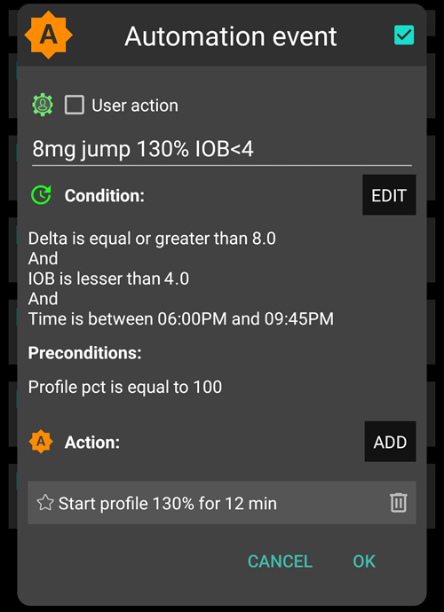
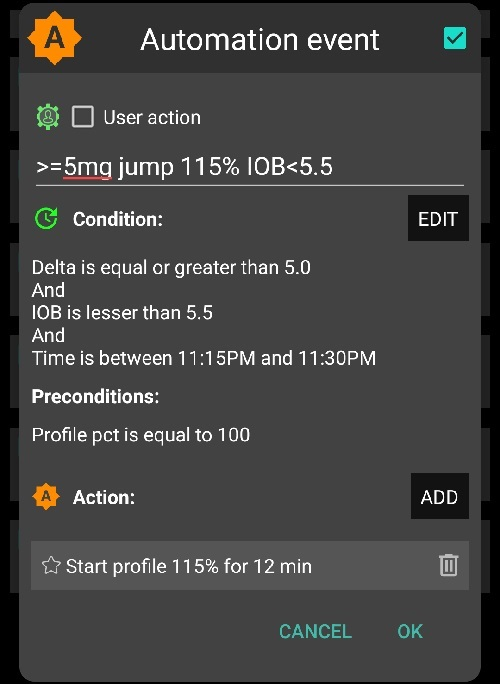

# Circuito Chiuso Completo

## Completo contro Ibrido (FCL, HCL)

### Definizioni

In un **circuito chiuso ibrido**, hai dato almeno un bolo prima dei pasti. Questo fa che il tuo circuito chiuso sospende l'erogazione (basale temporanea zero) e generalmente ha solo in un ruolo di co-gestione, mentre il bolo dato è ancora attivo.

Inoltre, prima di ogni pasto, hai fatto la conta dei CHO, valutato grassi e proteine, e hai anche dato delle indicazioni (generalmente nelle impostazioni, per ogni giorno relativo ad ogni pasto) relative ai tempi stimati di assorbimento dei CHO.

AAPS permette anche il **circuito chiuso completo senza che l'utente debba fare alcun bolo**, e senza digitare i CHO, in una modalità chiamata UAM = pasti non annunciati.

- Nota che **UAM** può anche essere abilitato in circuito chiuso ibrido, in questo caso l'algoritmo tollera meglio gli errori di calcoli nelle quantità di CHO assunti.

- Si dibatte se, per pasti particolarmente ricchi di carboidrati, o per persone con determinate abitudini alimentari o oscillazioni di sensibilità; una modalità con piccoli pre-boli potrebbe essere preferibile o anche necessaria. Sarebbe una variante di un circuito chiuso ibrido: senza informazioni di CHO. Si intende circuito chiuso completo come **senza boli utente**. Una volta sintonizzato, puoi anche rimuovere tutti i pulsanti „inutili” nella parte inferiore della schermata principale AAPS.

### Cosa aspettarsi?

Nel 2022/23 è stato condotto e pubblicato un primo studio medico che ha mostrato che i pazienti possono ottenere risultati relativamente buoni con AAPS in una semplice modalità di ciruito chiuso completo:

> 16 adolescenti con T1D (intervallo HbA1c 43-75) e durata del diabete di 9-15 anni sono stati sottoposti a tre periodi distinti di 3 giorni di vita in campo, mentre utilizzavano una versione modificata e bloccata di AAPS 3.1.0.3 **Risultati: ** La glicemia è stata controllata dal sistema al 95% del tempo dello studio e la percentuale di tempo inferiore a 3,9 mmol/L non ha superato l'1% per l'intero periodo di studio (0,72%). Lo scenario HCL ha raggiunto una percentuale di tempo significativamente più alta al di sotto di 3 mmol/L (HCL 1,05% vs. MA 0,0% vs. FCL 0,0%; P = 0,05) rispetto ad altri scenari. **Nessuna differenza è stata osservata tra gli scenari nella percentuale di tempo tra 3,9 e 10 mmol/L** (HCL 83,3% vs. MA 79,85% vs. **FCL 81,03%**, P = 0,58) corrispondente alla glicemia media (HCL 6,65 mmol/L vs. MA 7,34 mmol/L vs. FCL 7,05 mmol/L, P = 0,28). Non è stata osservata alcuna differenza nella dose media giornaliera di insulina o nell'assunzione giornaliera di carboidrati. Non si sono verificati eventi avversi gravi durante il periodo di studio. Il nostro studio pilota ha mostrato che **FCL potrebbe essere una modalità di trattamento realistica** per le persone con T1D.

Fonte:

1)   Biblioteca Nazionale di Medicina, PubMed [Primo uso di AndroidAPS per la somministrazione automatica dell'insulina in Loop Chiusoa scenario: Pancreas4ALL Randomized Pilot Study](https://pubmed.ncbi.nlm.nih.gov/36826996/);

2)  ClinicalTrials.gov National Library of Medicine, Clinical Trial [ Studio di fattibilità e sicurezza del sistema automatico di somministrazione di insulina in Loop chiusoPancreas4ALL (ASAP) ](https://www.clinicaltrials.gov/study/NCT04835350?term=Feasibility%20and%20Safety%20Study%20of%20the%20Automated%20Insulin%20Delivery%20Closed%20Loop%20System%20Pancreas4ALL%20(ASAP)&rank=1)

Per godervi la promessa di riduzione del fardello quotidiano, dovrete:

- verificare se si hanno tutti i prerequisiti per la FCL
- creare un paio di Automazioni
- passare attraverso una fase di apprendimento e sintonizzazione in cui si regolano le impostazioni, in particolare quelle delle automazioni. I suggerimenti che seguono vi guidano in questo processo.

### Considerazioni generali sul perché (non) passare da un ciclo ibrido a un ciclo chiuso completo

Il sistema a circuito chiuso completo potrebbe **non**essere** per tutti **:

- Mentre alcuni utilizzatori di  loop chiusio che utilizzano le Automazioni raggiungono TIR (70-180) circa il 90% e HbA1c sotto il 6%, si potrebbe preferire un controllo più stretto. In particolare, ** i valori minimizzanti superiori a 140 mg/dl nelle diete con carboidrati rapidi ** probabilmente richiedono un anticipo del bolo.
- Siete pronti per un approccio informato e consapevole verso una calibrazione altamente personalizzata del vostro sistema? La **sintonizzazione personalizzata** può essere**stimolante**. Questo non fa per voi se siete già stati sopraffatti dall'impostazione del tasso basale e degli ISF. Ma bilanciatelo con quello che potreste guadagnare ogni giorno senza contare i carboidrati. Potreste anche apprezzare la conoscenza più profonda acquisita dall'analisi e dalla messa a punto della risposta del vostro ciclo ai vostri pasti.
- Mentre la gestione dei pasti diventa molto semplice, la gestione dell'**attività** potrebbe diventare un po' più difficile, specialmente considerando che alla maggior parte di noi probabilmente piace limitare gli spuntini sportivi, nel tentativo di controllare il peso corporeo.
- Unfortunately, there are additional difficulties to establish a full closed loop for **kids** (see next section, pre-requisites)

## Prerequisiti per il ciclo chiuso completo

L'attrazione principale del ciclo chiuso completo sarebbe che ci si potrebbe avvicinare al sogno di un pancreas artificiale. In effetti, promette un uso quotidiano molto facile. **“Just eat!”**

### Ciclo chiuso ibrido ben sintonizzato

È consigliabile stabilire prima un circuito chiuso ibrido ben sintonizzato prima di considerare il passaggio a FCL. There are two important reasons for this:

- The UAM full closed loop requires a highly personalized (individual) tuning of settings, so the loop will give insulin mimicking YOUR successful hybrid closed loop mode.
- L'UAM full closed loop è dotato di nuovi parametri (nelle automazioni) da impostare e regolare. Sarebbe **problematico impostare e sintonizzare questi parametri aggiuntivi prima che quelli principalii siano sintonizzati "correttamente" **. Gli errori potrebbero essere facilmente bilanciati con i contro-errori. Questo può funzionare in singoli scenari, ma creerebbe un sistema altamente instabile, difficile da ricalibrare meglio in seguito. Inoltre, come visto da molti dei primi tester e anche nello studio sopra citato, dovresti aspettarti di raggiungere una %TIR comparabile con il tuo *FCL * come vedi oggi nel tuo *HCL*. The switch is not about performance, but about convenience, -  after a bit of inconvenience: **The heart of this FCL method is a DIY set up of Automations that you have to do for yourself, analyzing *your data*, both, from *your* successful HCL, and from your initial FCL experience when tuning your settings.** This is no self-adjusting off the shelf wonder-product! I programmatori del software, e gli scrittori di questo wiki, non si assumono alcuna responsabilità. Dovete scoprire da soli se e come volete usare gli strumenti, e i modi consigliati in cui potrebbero essere usati.

### Insulina veloce (Lyumjev, Fiasp)

Se l'utilizzatore non fa bolo per i pasti, è chiaramente necessaria un'insulina molto veloce, quindi, una volta realizzato un aumento di glucosio correlato al pasto, il ciclo ha qualche possibilità di mantenere il glucosio nel range (per definizione comune, sotto 180 mg/dl (10 mmol/l)).

Uno studio di modellizzazione (si veda LINK FullLoop V2/marzo23; qui la sezione 2.2) può mostrare in termini quantitativi che le *insuline più veloci*

Fonte:

 


IEEE Control Systems Magazine, ResearchGate [The Artificial Pancreas and Meal Control: An Overview of Postprandial Glucose Regulation in Type 1 Diabetes](https://www.researchgate.net/publication/322866519_The_Artificial_Pancreas_and_Meal_Control_An_Overview_of_Postprandial_Glucose_Regulation_in_Type_1_Diabetes);

- si tradurrà in **picchi** di glucosio significativamente **inferiori** rispetto alle insuline più lente
- **Tollerare un paio di minuti ** di <0>ritardo** per il bolo del primo pasto senza incorrere in un'altezza inaccettabile dei picchi</li>
- **Riduci al minimo** l'effetto sul picco di glucosio **da un diverso**carico di carboidrati (**quantità dei pasti**).</ul>

In conclusione, non si cerchi di ottenere FCL con insulina diversa da Lyumjev o Fiasp, a meno che, forse, non si stia seguendo una dieta a basso contenuto di carboidrati da moderata a bassa.

Molti utilizzatori di Fiasp o di Lyumjev osservano frequenti **occlusioni**, anche dopo aver ottimizzato cose come la lunghezza dell'ago o la velocità di rilascio del SMB. Sembra molto importante dare un'occhiata al momento in cui una **cannula (o pod) ** è in uso (molti trovano **48 ore** per essere il **limite**), e se gli aumenti di glucosio difficili da spiegare si verificano con un aumento sempre crescente del "falsa" iob.

Un rapporto di incidenza in (LINK, paragrafo 2.2.) illustra questo problema e mostra che per *una *occlusione si perde facilmente il 25% sul TIR quel giorno, o il 5% sul TIR alla settimana, e ancora l'1% sul TIR del mese.

### Excellent CGM

Non si dà più un bolo legato ai pasti; di lascia tutta l'attività di insulinizzazione all'algoritmo </strong> Poiché i valori di glucosio sono la base stessa per questo, si prega di **informarsi bene **su come </0>il vostro CGM</0> 1) funziona principalmente 2) se e come questo può dipendere dal flusso di dati e dalle applicazioni intermedie che si usano, o differire tra i giorni di utilizzo del sensore 3) in particolare, come e dove viene fatto qualsiasi normalizzazione, e cosa questo potrebbe implicare per la vostra sintonizzazione, in particolare per come si definisce un delta che è un vero segno di un pasto iniziale.

Anche intorno ai pasti, una connettività Bluetooth stabile è assolutamente essenziale, quindi CGM, loop e pompa insulinica possono fare il loro lavoro senza perdere tempo più prezioso.

Quindi, ma ancora più importante in tutti gli altri momenti del giorno e della notte, il CGM non dovrebbe produrre alcun artefatto (valori di salto) che il loop potrebbe **interpretare erroneamente** come segno di un pasto iniziale. Note that also calibrations could produce jumps.

Il modo migliore attualmente è usare Dexcom G5 o **G6**, e assicurare tramite ** sovrapposizione**del sensore del braccio destro e sinistro e l'utilizzo del trasmettitore, che i valori di buona qualità possano sempre essere usati dal loop. Altri modi sono possibili, ma comportano sforzi maggiori per il monitoraggio (tramite orologio) e pause occasionali del loop

### Limitazioni legate ai pasti

La creazione di un loop chiuso completo è relativamente facile per le persone la cui dieta non consiste **principalmente** di componenti con **un effetto elevato rapido sulla glicemia **, e i cui modelli di pasto non variano enormemente da un giorno all'altro. Non devono essere a basso contenuto di carboidrati.

Le diete ricche di grassi o proteine, o la digestione lenta/gastroparesi, rendono le cose più facili piuttosto che più difficili per l'intero loop chiuso perché i carboidrati tardivi coprono bene le inevitabili "code" di azione tardiva da parte del boli necessarie durante il picco glicemico

#### Indice glicemico ed effetto sulla glicemia

La sfida per la modalità UAM aumenta con l'aumento dell'EBG (effetto sul glucosio nel sangue)

- Avviare in modalità moderatamente/bassa e regolare le impostazioni. Solo allora, "testare" i pasti con EBG elevato
- Si consideri un < 50% di bolo iniziale se si consuma un EBG molto alto

1) **No EBG**: carne fresca, pesce, uova, pancetta, oli, formaggio. 2) **Basso EBG**: verdure fresche e bacche, funghi, noci, latte, yogurt, ricotta. 3) **Moderate EBG**: whole grain bread/noodles, potatoes, wild rice, oats, dried fruits. 4) {** EBG **: pane di frumento, baguette, toast, cialde, biscotti, purè di patate, tagliatelle, riso. 5) **EBG molto alto**: (zucchero-) bevande dolci, succhi di frutta, cornflakes, caramelle, dolci, patatine fritte, bastoncini di pretzel salati.


The most difficult meals are those with exclusively very high and high EBG components (see red in the picture): Not only does glucose shoot up rapidly, but also there is not much of a fat/protein/fibre component to balance the inevitable “tail” of insulin activity that would come with attempts to control the high glucose earlier on.

**Il consumo errato di snack e bevande dolci**che sono carichi di carboidrati a rapido assorbimento è un problema.


### Limitazioni legate allo stile di vita

#### Sistema tecnicamente stabile

Il loop chiuso completo richiede un sistema tecnicamente stabile 24/7, specialmente per quanto riguarda i segnali affidabili **CGM**, ma anche la **stabilità del collegamento Bluetooth ** con la pompa **, ed evitando (o almeno il riconoscimento tempestivo dell'occlusione). Questo potrebbe richiedere attenzione ai dettagli come mantenere tutti i componenti ben carichi e in stretta prossimità; fare cambiamenti di cannula (o pod) sempre abbastanza presto per ridurre il rischio di occlusione; avere sempre con sé parti potenzialmente necessarie. **A seconda del vostro sistema, della vostra esperienza con esso, ma anche della vostra accettazione e del vostro stile di vita generale, questi aspetti possono o meno limitarvi.**</p>

#### Preparazione per attività/sportive

Per prepararsi all'attività/sport/esercizio fisico, il normale protocollo con una pompa o un loop chiuso

ibrido</strong> è quello di intraprendere azioni che riducano l'insulina a bordo prima dell'esercizio.

Con il **loop chiuso completo**, l'algoritmo è regolato per rilevare i pasti e per darvi insulina per contrastare automaticamente gli aumenti di glucosio. Impostare una basale temporanea elevata. un target glicemico e profilo % immediatamente inferiore (efficace già all'inizio del pasto) sarebbero un problema.

I livelli di attività insoliti richiedono quindi una **preparazione disciplinata** (specialmente ** se si desidera mantenere bassa la necessità di fare uno spuntino durante gli sport**). Nelle notti dopo una giornata attiva può essere intelligente mantenere una % profilo ridotta e impostare, per le ore successive alla completa digestione del pasto serale, un target di glucosio elevato (>100 mg/dl), con "nessun SMB con target elevato" selezionato nelle preferenze AAPS.

#### Hurdles for kids

Stabilire e mantenere una FCL per i bambini comporta alcune sfide aggiuntive se:

- Lyumjev non è disponibile o ben tollerata
- Il tasso basale orario è molto basso, fornendo una base scadente per i grandi SMB
- La dieta è ricca di  dolciumi. Con il tipico basso volume di sangue di un piccolo corpo, forte tendenza verso picchi glicemici molto alti!
- Passare attraverso marcati cambiamenti della sensibilità all'insulina o del pattern circadiano rende difficile mantenere la FCL adeguatamente regolata.

Ci sono anche un paio di genitori e bambini all'avanguardia in quest'area. Questo documento mette in evidenza le aree che richiederebbero una certa conformità minima; alla fine si tratta di stabilire se i risultati ottenuti sono almeno paragonabili a quelli di tutti i soggetti nel proprio loop chiuso ibrido quotidiano.

#### Tempo necessario per l'installazione

Infine, prima di godere di un loop chiuso completo funzionante è necessario avere un periodo di alcune settimane con un po 'di tempo libero e "testa libera" per l'installazione -. Puoi ottenere, nel tempo che sei disposto a investire, un risultato che consideri abbastanza buono è davvero la domanda. A seconda delle vostre "abitudini", - se ce ne sono - e compromessi (come cambiare la cannula/pod più spesso, non iniziare mai i pasti quando la glicemia è alta[...]… ) siete disposti a fare (e ogni giorno in grado di attenersi a), per la facilità di non avere a che fare con la valutazione dei pasti e il calcolo bolo per loro?

## Abilitazione SMB potenziato; sicurezza

Nel loop ibrido chiuso, sono attuate forti restrizioni di sicurezza per quanto riguarda le unità dei boli che possono essere automaticamente fornite dal loop.

Tuttavia, nell'applicazione a loop chiuso, gli stessi utilizzatori non somministrano più un bolo considerevole a inizio del pasto. Quindi i limiti di dimensione degli SMB devono essere ampliati per rendere il loop in grado di dare SMB abbastanza grandi.

As you are operating with AAPS Master release, it is suggested you set in AAPS preferences the largest setting for maximum allowed SMB size the loop can give (maxUAMSMBBasalMinutes=120, i.e. 2 hours worth of basal at that daytime).

> If your basal rate is very low, the resulting SMB limits might be too low to allow good-enough control of your post-prandial glucose rises. In that case the solution might be to avoid diets with strong spikes and later switch to a AAPS dev variant that offers a new parameter in SMB delivery settings: smb_max_range_extension. It expands the standard maximum of 2 h worth of basal by a factor of >1. (Additionally, the default 50% SMB delivery ratio might be elevated in dev variants).

Going to the max. limits on SMB size in AAPS Master will not make the FCL mode inheritantly less safe. In contrary, you replace your big meal bolus by several smaller ones that you enable your loop to give you, and even with some minutes of delay. This virtually eliminates the hypo risk in the first 1-2 hours of any meal. In hour 3 and thereafter, there should not be much difference because in HCL and FCL the loop manages with the same algorithm.

**Follow the instruction** to enable AAPS **to mimick your bolussing via a couple of SMBs**.

Check the SMB tab from time to time to see whether your SMBs are allowed to be large enough to deliver the insulinReq as needed for your full closed loop around meal starts.

If not, your tuning efforts will sometimes come to nothing!

```{admonition} Boosting ISF can become dangerous
:class: danger

Carefully observe/analyze the SMB sizes that, briefly after meal start, result from your settings. Tune in steps, and do not vary more than 1 or 2 parameters at a time.

Setting must work good-enough for your (!) variety of meals.
```

## Meal detection/your Automations for boosting

For successful full closed looping, ISF is the key tuning parameter. When utilizating AAPS Master + Automations, a **> 100% profile change must automatically be triggered upon meal recognition** (via glucose deltas), and provide the sharpened ISF.

AAPS Master allows up to 130% temp. profile in Hybrid Closed Loop mode. Boosting the ISF is done in 3 steps:

- Step 1 is to look up the ISF applicable for this meal time hour in the profile, and see whether e.g. Autosens suggest a modification that takes care of the current (last few hours’) insulin sensitivity status of the body.
- Step 2 applies a factor (1/profile%, as set in your Automation) to boost ISF.
- Step 3 is a check, that the suggested ISF falls within set safety limits.

### FCL Automation templates

Boxes to tick at the top: You always have the options:

- In the list of all your Automations, you can tick the check-mark (to left of each field) OFF => This de-activates that Automation.  For instance you could do this for all breakfast related FCL Automations to go to Hybrid Closed Looping for breakfast(s).
- In each Automation event template, you can tick the box for **User action** => Then the defined Actions will not automatically be executed when Conditions apply. Rather, your AAPS main screen will alert you whenever your FCL would automatically give a SMB. You have the opportunity then to say yes or no. This is **extremely useful in your tuning phase**.                                                                                                                        
  This feature can be very valueable also everyday. An example would be, if you see the “foot to floor” syndrome (suddenly rising glucose when getting up), but want to prevent a fully automatic “breakfast started” response.

The following section shows in detail how you can bundle a whole series of conditions to describe situations in which the AAPS loop should increase (or decrease) insulin delivery.                                                                                                                                      As ISF cannot directly be tuned, raising profile% over 100% will do the same for our purposes.

### Automated big SMBs at bg rise

Key to success in full closed looping: **At the beginning of glucose increases from meals, very large automatic boli (SMBs) must be given by the loop as quickly as possible** “to catch up” with the evidently needed iob. (Compare with your administered bolus for similar meal in hybrid closed loop!)

First of all, **personal data** (from your time in hybrid closed loop) have to be researched to determine which **deltas** might be not meal –related, and which ones surely would be.

- As you can define the Automation to only work in a pre-defined time-window, you need only to analyse there.
- If you do very different kinds of meals (e.g. a rather high carb breakfast, but low carb lunch) you can choose to do two different (sets of) Automations for each of the time slots.
- Exclude the nights if you see occasional jumps from a compression lows
- Usually, just using the delta of the past 5 minutes suffices.
- But you can also make use one of the average deltas. By comparing the deltas in the conditions of your Automations you could even define actions of different aggressiveness depending on whether the glucose rises in an accelerated way or not.

> ( delta – short avg delta )>n   is a term that could be used for acceleration detection , to trigger first SMB at earliest sign of rising glucose. -                                                                             Caution: not possible to use with poor or highly smoothened CGM-values!

A CGM with lots of scatter will put you in a bad spot because, to be on the safe side,  you need to „sandbag“ your definition which delta is surely asign of a started meal. That means:

- your FCL loses additional time, resulting in higher glucose peaks and lower %TIR
- because you cannot use a earlier or smaller delta which could trigger, also without a meal, the SMBs that are supposed to make up for a user bolus in FCL.

Furthermore, first rises after a meal are characterized by **low iob** present. With that in mind, an Automation(#1) for a dinner might look like this:



Automation #1

If conditions apply, the loop would give 1 or 2 SMBs in the next 12 minutes, using a boosted ISF according to the set elevated profile%  (in the example, a 30% boost of insulinReq). As long as these conditions apply, the Automation rule extends by another 12 minutes. A low carb meal might have slower bg rise characteristics. It would benefit from another Automation (#2) that kicks in at lower delta, and gives a weaker insulin boost.



The same Automation probably will kick in also in higher carb meals, once the steep rise as defined in Automation#1 is over.

You need to “stage” these two (+ maybe a third) Automations to fit with what you see in your meal (variety) => Setting appropriate jump sizes, iob citeria, and amplifications will be an iterative tuning process.  Also, if you include appropriate time slots in the Conditions, you can easy do different Automations for your different daily meals times (breakfast, lunch, dinner).

Note that, still in the rise phase (!), the "overflow" of  iob must be blocked so that the late effects of the **insulin** (the "**tail**" after 3-5 hours) will not exceed the braking capacity of the loop through zero-temping (“taking away” basal, to reduce hypo risk).

With large meals there is **sometimes a second increase**. By then, usually also the iob has dropped a bit, and the more aggressive Automations take effect again. (Check that your iob condition in Automation #2 is not set too low to for this to happen).

Soon after a few intial SMBs were given comes a **balanced phase** where moderate addition of insulin should cover the additional carbs absorbed. (Except in low carb meals, where the loop might see too weak of a bg rise, and go into zero-temping right away already now).

The AAPS main screen (where you always see cob=0 in UAM full loop) might in this phase ask for more carbs required. In UAM mode that simply means, you could make a very rough plausibility check: Is that amount of carbs likely in your body, un-absorbed from your meal just about an hour ago (about which you gave your loop no info)?


### iob threshold

Often, Automations #1 and/or #2 make iob rise to heights that typically are enough for **your** meals. For personalized tuning, look in your hybrid closed loop data at the max iob values that occur with well-managed meals (often: your meal bolus), and above which magnitude a hypo (or requirement for extra carbs) occured at the end.

Sensible **iob thresholds** at which you should reduce aggressiveness of your loop, might not be the same for every meal. But especially in the first hour after the start of a meal, which is very crucial in the UAM mode, these data differ little for me: Just about 30g/hour get absorbed, and to define a meaningful iob independent of the exact meal can be possible.

For exceptional meals, or to lower it if sports follow, the iob threshold can rapidly be set differently in your Automation.

Automation(#3),”iobTH reached => SMBs off”, is defined to end (or pause, until another wave of carb-related rise hits) the aggressive SMB boosting.


Automation #3

It tells the loop that above your set **iob threshold** it's better not to use any more SMBs

- The given example does that by setting TT=111 (which is kind of arbitrary; pick a number>100 that you easy recognize as your automated SMB shut-off)
- In AAPS Preferences/ SMB Settings generally do not allow SMB at elevated target).                                                                                                                   
  The insulinReq will then have to be delivered with much more caution through the bottleneck of TBRs

**Caution: Automation #3 only works when there is no active TT.** So, in case you worked with EatingSoonTT, it must be ended by that time, which usually should be 30-40 minutes after meal start.

One idea how to do this automatically would be an Automation that ends an eventually running EatingSoonTT under the condition that iob >65% * iobTH.
> Ways to work with EatingSoonTT Some loopers set (by pressing the TT button, or automated via a lowered profile glucose target if eating time slots are fairly fixed) an EatingSoonTT roughly an hour or more before meal start, just to guarantee a low starting glucose and a bit of positive iob. But, assuming the FCL is anyways always en route towards target, this might not yield much and you might rather just define an Automation that sets an EatingSoonTT at recognition of meal start (glucose delta, or acceleration = delta > avg delta). A low TT is important in this stage because any SMB is calculated by your loop using (predicted glucose minus TT)/sens, so a small TT makes the resulting insulinReq bigger.

After the first boosted SMBs were given, your set iobTH and Automation #3 should strike a good balance of limiting the glucose peak, but also not leading to a hypo after the meal.

In case for instance your breakfast totally deviates in carb content from your average dinner, you may benefit from defining Automations that apply in the respective times of day, and have different iobTH (possibly also different deltas, and different %profile set). Both, you with defining your meal spectrum and settings (notably, iobTH), and the loop managing the unfolding bg curve, must accept certain peak heights for reducing hypo danger towards the end of the DIAs from SMBs.

### Stagnation at high bg values

In case, after a “rich” meal, a long-lasting stagnation with **high glucose** value is seen, Automation #6 (below, left),"post-meal High”, helps deal with fatty acid resistance: After multi-course meals, large greasy pizza, raclette evening, the glucose curve can form two humps or, very often, an elongated high plateau.


Automation #4


Automation #5

Automation #4, “post-meal High”, is also suitable in hybrid closed loop.

In addition, a termination-Automation #5, “Stop pmH”, is needed, so that the aggressiveness of the insulin administration is reduced, as soon as the glucose value is falling. (However, often the loop will limit more insulin anyways for hypo prevention because predicted glucose runs low already).

### Hypo prevention

The core problem here is of course that the UAM full closed loop (without carb inputs) can have **no idea how many g of carbs are still available** for absorption, and might use up that “tail” insulin, without you going into a hypo from it.

Using boosted SMBs, the loop “caught up” with what we formerly did with a meal bolus. But, **at the “tail” end of insulin activity, hypo prevention can become a serious topic**.

In preparation for your full closed loop Automations, you therefore must take a closer look at the **time course of iob** for typical meals, and judge **when it becomes too much, and how you can catch that by tuning your Automations**. That is definitely possible, because we have several adjusting screws. However, it can get a bit tricky to get it “right”, so it reasonably works for your variety of meals.

Generally, it makes no sense to keep optimising settings for one kind of meal. Once you have a good-enough setting e.g. for one kind of lunch you frequently have, test how this works with other kinds, and how you would “compromise”.

In order to prevent hypo in post-meal hours 3 – 5, reduce the aggressiveness before too much iob comes together. Specific approaches:

- Become milder and milder with the ISF already during the glucose rise, as in Automation examples #1 and #2 given.
- Define the iob threshold, from which the loop is made significantly more cautious (Automation #3, above). Note this iob can be exceeded, by the last SMB before it went into effect; and then further by TBRs if the loop sees insulinReq Carbs getting absorbed will provide a counter-movement towards lower iob.
- The iob threshold could be differentiated according to meals: By cloning the automations, you could easily differentiate for breakfast, lunch, and dinner time slots (or even for geo-locations, like company cafeteria, or at mother-in-law etc)  
  >You could differentiate within these time slots even further by setting different TTs for low carb vs. fast carb, etc., and thus be able to “code for” different meal classes that may occur at this time of day, and call them up with Automations specially tuned for them.(That is probably not not necessary, unless your diet habits do vary a lot.).

Before a special meal challenge, you can raise your iob threshold, or make another change in any of your Automations within under 5 seconds, right from your AAPS main screen (burger top left; or Automations tab, depending how you configured your AAPS.).

The hypo danger some hours after the meal is essentially a question of whether your meal composition was such, that the **insulin tails from fighting the bulk of carbs** will be **consumed by “extended carbs”** (excessive/delayed carb absorption/protein/fat/fibre).

Over time you will learn patterns, tune your Automations – maybe even adjust your eating habits a bit, e.g. just enjoy the occasional late little(!) snack that may help maintain a good **balance of insulin activity and carb absorption** for the **entire** meal (digestion, absorption) time, and thus make life for your loop (and for yourself) easier.

### Order of programmed Automations

Problems can arise with overlapping definitions in Automations. Example: The problem is that delta >8 is also delta >5, i.e. there may be two competing Automations. What does the loop do then? It always decides according to the sequence in which your Automations appear when looking into the burger menue / AdAPS main screen.  Example: The delta > +8 rule must come first (and launch the strongest boost if all conditions apply); then comes the check for delta >5 (and a milder response). If done the other way round, the delta>8 rule would never come into effect because the delta>5 already applies, case closed.
> Tip for "house cleaning" in your Automations: Order changes are very easy to make. If you press on a list entry in AAPS/Automations, you can move the Automation in question to another position. So you can quickly (re-)arrange.

Also it is very easy and quick to adjust any conditions or actions at any time, within seconds, just on your AAPS smartphone; for instance if you head into a very special eating event. (But don’t forget to set it back to normal on/for the next day).

## Troubleshooting

### How to get back into Hybrid Closed Loop

You can un-click the top boxes in the Automations related to your FCL, and go back to bolussing for meals and making carb inputs again.  You may have to go to AAPS Preferences/Overview/Buttons and get your Buttons “Insulin, Calculator…”  back for your AAPS HCL main screen. Be aware that now it is again up to you to bolus for meals

It can also be wise to do FCL only for meals (time slots) where Automations are fully defined and clicked on, and un-klick only those for the other meal times when you like to do hybrid looping (or have none defined yet, in your transition period).

For instance, it is perfectly possible, without any extra steps after Automations for dinner time slots are defined, to do FCL only for dinners, while breakfast and lunch are done in hybrid closed loop as you are used to.


### Are the pre-conditions for FCL still given?

- Is the basic profile still correct?
- Has the CGM quality deteriorated
- etc (see section pre-requisites)

### Glucose goes too high

- Meals are not recognized asap
    - Check regarding Bluetooth (in)stability
    - Check whether you could set smaller deltas to trigger first SMB
    - Experiment with an aperetif, soup acouple of minutes before meal start
- SMBs are too weak
    - Check order of Automations (e.g.: big delta before small delta)
    - Check (real-time) in SMB tab whether hourly profile basal and set minutes (max 120) limit allowed SMB size
    - Check (real-time) in SMB tab whether %profile must  be set bigger
- If all your settings are at the limit, you may have to live with the temporary high, or adjust your diet.
> If you are ready to use AAPS dev variants, you could also employ one that allows further expanded SMB sizes. Some users also resort to using a small pre-bolus in their “FCL”. However, this interferes with how glucose curve and hence detection of rises and triggered SMBs behave, and is therefore not easy to implement with convincing overall benefit.
- An important observation by pilot users was, that how your glucose and iob curves approach meal start matters a lot regarding how you peak from carbs: Going down (e.g. towards a set EatingSoonTT), building some iob, and curving already towards strong positive acceleration seems very helpful to keep peaks low.

### Glucose goes too low

- Meals are falsely recognized
    - Check whether you could set bigger deltas to trigger first SMB
    - Click “User action” in the related Automation, so in the futurte you can ad hoc decide to block execution of the Automatiojn if not meal-related
    - To prevent snacks from triggering SMBs as for a meal, set a TT>100 when snacking (as you would do in sports and for anti-hypo snacks, anyways)
- SMBs deliver overall too much insulin
    - Check (real-time) in SMB tab whether SMB range extention must be set smaller
    - Check (real-time) in SMB tab whether %profile must  be set smaller
    - SMB delivery ratio probably can be set smaller. Note in this case, it works across the bord for all SMBs (all time slots),
- Problems with insulin “tail” after meals
    - You may need to take a snack (seeing hypo prediction) or glucose tablets (if already in hypo zone). But note that the carbs required the loop might tell you at some point are very likely exaggerated as the loop has absolutely zero info on your carb intake (while you may be able to guess how much more, incl. from fats and proteins) is still waiting to be absorbed.
    - A valueable information would be whether the problem originates mostly in the bg rise phase already. Then setting a lower iobTH might be an easy remedy.
    - If the need for additional carbs happens frequently, note down how many grams were needed (not counting what you eventually took too much and required extra insulin again).  Then use your profile IC value to estimate how much insulin less the SMBs should have delivered, and go with this info into your tuning (regarding the % profile in the Automations, or maybe also your set iobTH). This may relate to the SMBs given when glucose was high, or also extending regarding also the SMBs during the glucose rise.
    - It could well be that you simply have to accept higher glucose peaks for not going low. Or change diet to something with lower amounts of carbs, and higher amount of proteien and fats.


### More info

Make sure you stay in touch with other FCL users.

Discussion Full Closed Loop using Automations:

- English:   [Discord Channel](https://discord.gg/ChXj8BaKwA)

- German:  [German Looper Community](https://de.loopercommunity.org/t/ueber-die-kategorie-full-loop/10107)
