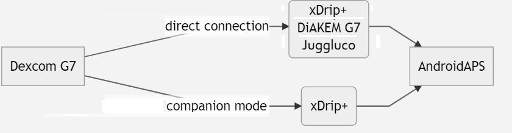

- - -
orphan: true
- - -

# Dexcom G7 e ONE+

## Basi anticipate

È da notare che i sensori G7 e ONE+, contrariamente al G6, non lisciano i valori della glicemia, né nell'app, né con il lettore. Maggiori dettagli [qui](https://www.dexcom.com/en-us/faqs/why-does-past-cgm-data-look-different-from-past-data-on-receiver-and-follow-app).

Immagine obsoleta!!!
`{admonition} [Metodo di smoothing](../CompatibleCgms/SmoothingBloodGlucoseData.md)`

## 1. xDrip+ (collegamento diretto a G7 o ONE+)

- Segui le istruzioni qui: [xDrip+ G7](https://navid200.github.io/xDrip/docs/Dexcom/G7.html)
- Seleziona xDrip+ in [Configuratore strutturale, Origine BG](#Config-Builder-bg-source).

- Regola le impostazioni xDrip+ seguendo le spiegazioni [impostazioni xDrip+](../CompatibleCgms/xDrip.md)

## 2.  App Dexcom G7 Patchata (DiaKEM)

**Nota: è necessario AAPS 3.2.0.0 o superiore! Non è disponibile per ONE+.**

### Installare una nuova app G7 patchata (!) e avviare il sensore

L’app Dexcom G7 patchata (DiaKEM) dà accesso ai dati Dexcom G7. Questa non è l'app BYODA in quanto questa non può ricevere i dati dal G7 al momento.

- Disinstalla l'app Dexcom originale se l'hai utilizzata prima (un sensore già avviato può ancora essere usato dopo - nota il codice del sensore prima di rimuovere l'app!)

- Scarica e installa l'app patchata [qui](https://github.com/authorgambel/g7/releases).

- Inserisci il codice del sensore nell'app patchata.

- Segui le raccomandazioni generali per l'igiene e il posizionamento dei sensori CGM [qui](../CompatibleCgms/GeneralCGMRecommendation.md).

- Dopo la fase di riscaldamento, i valori vengono visualizzati come di consueto nell'app G7.

### Configurazione in AAPS

- Seleziona 'BYODA' nel [Configuratore Strutturale, Origine BG](#Config-Builder-bg-source) - anche se non è l'app BYODA!

- Se AAPS non riceve alcun valore, passa a un altra origine BG e poi torna a 'BYODA' per fare generare la richiesta di scambio di dati tra AAPS e BYODA.

## 3. xDrip+ (modalità app compagno)

-   Scarica e installa xDrip+: [xDrip](https://github.com/NightscoutFoundation/xDrip)
- Come sorgente dati in xDrip+, seleziona "Companion App", nelle Impostazioni avanzate > Impostazioni Bluetooth > abilita "Companion Bluetooth".
-   Seleziona xDrip+ in [Configuratore strutturale, Origine BG](#Config-Builder-bg-source).

-   Regola le impostazioni xDrip+ seguendo le spiegazioni [impostazioni xDrip+](../CompatibleCgms/xDrip.md)

## 4. Juggluco

Versione 9.0+ necessaria

- Disabilita l'applicazione precedentemente collegata al sensore: disinstalla l'applicazione o usa "Arresto forzato". Disabilita l'autorizzazione "Dispositivi vicini" nelle impostazioni dell'app. Limita l'utilizzo della batteria dell'app.

- Dimentica il sensore nelle impostazioni Bluetooth: nelle impostazioni di Android, trova il sensore nei dispositivi collegati e seleziona "Elimina". I nomi dei sensori Dexcom G7 iniziano con DXCM.

- Evita le interferenze da altri sensori: mantieni i vecchi sensori Dexcom fuori portata Bluetooth.

- Collega il sensore G7 a Juggluco: Apri Juggluco → Menu sinistro → Foto. Scansiona il codice QR sull'applicatore del sensore G7. Attendi fino a 5 minuti perché Juggluco trovi il sensore.

- Accoppiamento: Accetta di abbinare il sensore a Juggluco. Assicurati che lo schermo non sia bloccato durante l'accoppiamento. Se l'accoppiamento fallisce, aspetta 5 minuti prima di riprovare.

- Eccezione: gli orologi Wear OS possono collegarsi senza accordo.
