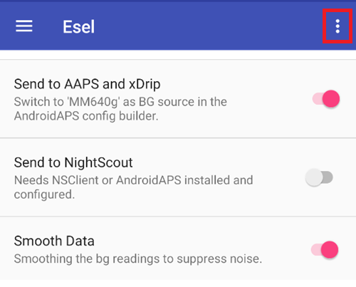

- - -
orphan: true
- - -

# Per gli utilizzatori di Eversense

Ci sono tre metodi diversi per accedere alle letture di Eversense:

- Modalità compagno ESEL
- Modalità ESEL patched
- xDrip+ app compagno

## ESEL

Ottieni e installa l'app [ESEL](https://github.com/BernhardRo/Esel/tree/master/apk), seguendo [queste istruzioni](https://github.com/BernhardRo/Esel?tab=readme-ov-file#esel).

- Abilita "Send to AAPS and xDrip"
- **Disabilita** "Send to Nightscout"
- Poiché i dati di glicemia di Eversense possono essere rumorosi, è consigliato abilitare "Smooth Data" in ESEL.



### Modalità Compagno

Legge i dati dalle notifiche dell'app Eversense (funziona con l'app Eversense standard, disponibile dalla versione ESEL 3.0.1).

1. Usa l'app ufficiale Eversense dal Google Play Store
   - Facoltativo, ma necessario per il recupero dei dati storici: Accedi al tuo account Eversense
   - In Sync, abilita la sincronizzazione automatica
2. Configurazione di ESEL:
   - Disabilita l'impostazione "Get data from patched Eversense App"
   - Per il recupero dei dati storici: Abilita "Fill missing data from eversensedms.com"
   - Fornisci come indirizzo email e password i tuoi dati di accesso Eversense
3. Imposta "MM640g" come sorgente di glicemia in [Configuratore strutturale, Origine BG](#Config-Builder-bg-source).

### App Eversense Patchata

 Richiede una versione patched dell'app Eversense (funziona completamente offline, incluso il backfilling).

1. Disinstalla l'app Eversense (Attenzione: i dati storici locali (più vecchi di 1 settimana) andranno persi!)

2. Installa l'app [patchata Eversense](https://cr4ck3d3v3r53n53.club) e usala come descritto dal fornitore

   - Avvia l'app Eversense, accedi, connettiti al tuo trasmettitore e usala come l'app normale.

3. Configurazione di ESEL:

   - Abilita l'impostazione "Get data from patched Eversense App"


​       Se usi ESEL con una nuova installazione di Eversense per la prima volta, può richiedere fino a 15min fino a quando i primi valori appaiono in xDrip!

4. Imposta "MM640g" come sorgente di glicemia in [Configuratore strutturale, Origine BG](#Config-Builder-bg-source).

## xDrip+

xDrip+ può leggere le notifiche dall'app del fornitore, come ESEL. Nessun recupero dei dati storici/mancanti disponibile.

- Scarica e installa xDrip+: [xDrip](https://github.com/NightscoutFoundation/xDrip)
- Seleziona “Companion App” come sorgente dati in xDrip+.
- Seleziona xDrip+ in [Configuratore strutturale, Origine BG](#Config-Builder-bg-source).
- Regola le impostazioni xDrip+ seguendo le spiegazioni [impostazioni xDrip+](../CompatibleCgms/xDrip.md).
- Abilita [Smoothing esponenziale](../CompatibleCgms/SmoothingBloodGlucoseData.md) in AAPS.

```{warning}
La frequenza di lettura dei valori glicemici non è sempre di 5 minuti e possono verificarsi duplicati.
```