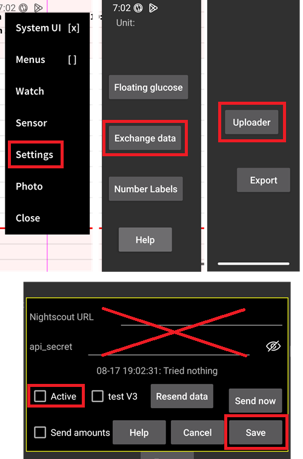
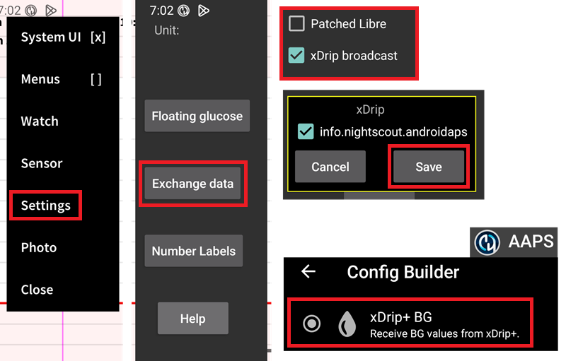

# Impostazioni Juggluco

Se non è già configurato, scarica [Juggluco](https://www.juggluco.nl/Juggluco/download.html).

Segui le [istruzioni](https://www.juggluco.nl/Jugglucohelp/introhelp.html) per connettere il tuo sensore.

## Impostazioni di base per tutti i sistemi CGM

### Disabilita l'uploader di Nightscout

A partire da AAPS 3.2, non dovresti permettere ad altre app di caricare dati (glicemia e trattamenti) su Nightscout.

Disabilita qualsiasi uploader attivo verso Nightscout in Juggluco.

(juggluco-to-aaps)=

## Da Juggluco ad AAPS

Juggluco può inviare la glicemia direttamente ad AAPS, abilitando sempre gli SMB se utilizzi un [sensore affidabile](#GettingStarted-TrustedBGSource).

Quando si utilizza un sensore Libre 2/2+/3/3+, le letture minuto per minuto verranno inviate ad AAPS ma non attiveranno calcoli minuto per minuto in AAPS.

Abilita la trasmissione xDrip in Juggluco (non abilitare Patched Libre), conferma e salva le informazioni del pacchetto AAPS. Seleziona la sorgente dati BG xDrip+ in AAPS.

Applica un [smoothing](#SmoothingBloodGlucoseData) sufficiente in AAPS.

(juggluco-to-xdrip)=

## Da Juggluco a xDrip+

Juggluco può inviare la glicemia a xDrip+ che la invierà poi ad AAPS.

Abilita Patched Libre in Juggluco (non abilitare la trasmissione xDrip), conferma e salva le informazioni del pacchetto dexdrip. Seleziona la sorgente dati BG xDrip+ in AAPS.

Applica un [smoothing](./SmoothingBloodGlucoseData.md) sufficiente in AAPS se necessario: quando si utilizza un sensore Libre 2/2+/3/3+, xDrip+ media le letture minuto per minuto a 5 minuti e le [liscia](#libre2-value-smoothing-raw-values) anch'esse.

