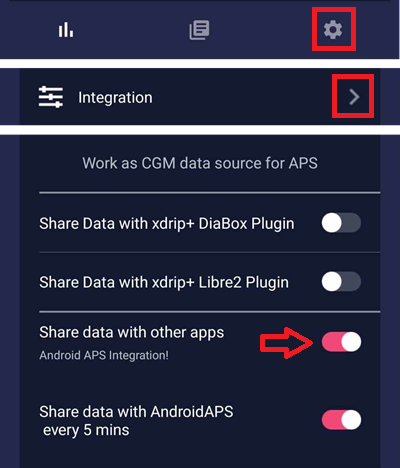
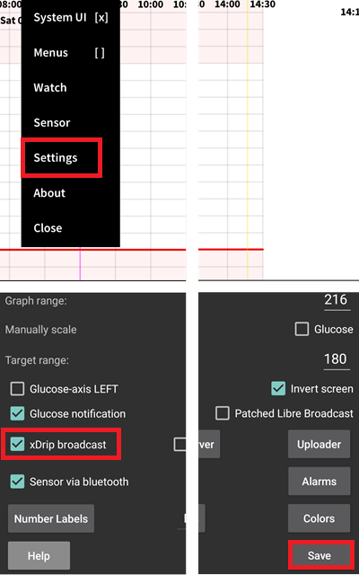
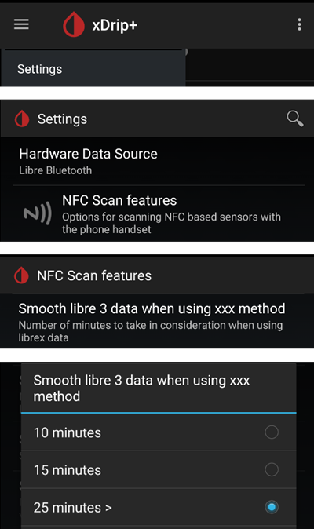

- - -
orphan: true
- - -

# Freestyle Libre 2 e 2+

Il sensore Freestyle Libre 2 è ora un vero e proprio CGM anche con l'app ufficiale. Tuttavia, LibreLink non può inviare dati ad AAPS. Ci sono diverse soluzioni per usarlo con AAPS.

## 1. Usa un trasmettitore Bluetooth e OOP

Bluetooth transmitters can be used with the Libre 2 (EU) or 2+ (EU) and an out of process algorithm app. È possibile ricevere i valori della glicemia ogni 5 minuti come con il [Libre 1](./Libre1.md).

Controlla che il collegamento e l'applicazione che vuoi usare siano compatibili con il tuo sensore e con xDrip+ (i Blucon più vecchi e quelli più recenti non funzionano, Miaomiao 1 richiede il firmware 39 e Miaomiao 2 il firmware 7).

Il Libre2 OOP crea le stesse letture della glicemia del lettore originale o dell'app LibreLink tramite scansione NFC. AAPS con Libre 2 applica uno smussamento da 10 a 25 minuti per ridurre alcuni sbalzi. Vedi sotto [Smussamento dei valori e dati grezzi](#libre2-value-smoothing-raw-values). OOP crea letture ogni 5 minuti utilizzando la media degli ultimi 5 minuti. Di conseguenza, le letture della glicemia non sono molto omogenee, ma coincidono con quelle del dispositivo di lettura originale e ricalcano più rapidamente le letture della glicemia “reale”. Se vuoi provare a utilizzare il loop con OOP, attiva tutte le impostazioni di smussamento dati in xDrip+.

Ci sono alcune buone ragioni per utilizzare un trasmettitore Bluetooth:

-   Puoi scegliere diverse strategie di calibrazione OOP2 (1): avere i valori del lettore utilizzando “nessuna calibrazione”, oppure calibrare il sensore come un Libre 1 utilizzando “calibrazione basata su dati grezzi” o infine calibrare i valori del lettore con “calibrazione basata sul glucosio”.  
  Assicurati di lasciare OOP1 disabilitato (2).

    → Menu → Impostazioni → Impostazioni meno usate → Altre opzioni


-   Il sensore Libre 2 può essere usato per 14,5 giorni come il Libre 1
-   Il recupero dei dati entro le 8 ore è totalmente supportato

Nota: Il trasmettitore può essere utilizzato in contemporanea con l'applicazione LibreLink senza interferire.

## 2. Usa la connessione diretta di xDrip+

```{admonition} Libre 2 EU only
:class: warning
xDrip+ non supporta la connessione diretta a Libre 2 US e AUS.
Solo i modelli Libre 2 e 2+ **EU**.
```

- Follow [these instructions](https://www.minimallooper.com/post/how-to-setup-freestyle-libre-2-and-oop2-to-use-a-native-bluetooth-connection-in-xdrip) to setup xDrip+ but make sure to download [the latest OOP2](https://drive.google.com/file/d/1f1VHW2I8w7Xe3kSQqdaY3kihPLs47ILS/view) as the one in the document is obsolete.
- Segui le istruzioni di configurazione nella [pagina delle impostazioni di xDrip+](../CompatibleCgms/xDrip.md).

-   Seleziona xDrip+ in [Configuratore strutturale, Origine BG](#Config-Builder-bg-source).

## 3. Usa Diabox

- Installa [Diabox](https://www.bubblesmartreader.com/_files/ugd/6afd37_f183eabd4fbd44fcac4b1926a79b094f.pdf). In Settings, Integration, abilita Share data with other apps.



- Seleziona xDrip+ in [Configuratore strutturale, Origine BG](#Config-Builder-bg-source).

## 4. Usa Juggluco

- Scarica e installa l'applicazione Juggluco da [qui](https://www.juggluco.nl/Juggluco/download.html).
- Segui le istruzioni [qui](https://www.juggluco.nl/Juggluco/index.html)
- Nelle impostazioni, abilita la trasmissione verso xDrip+ (che non invia dati a xDrip+ ma ad AAPS).



- Seleziona xDrip+ in [Configuratore strutturale, Origine BG](#Config-Builder-bg-source).

```{admonition} Use with xDrip+
:class: note
Puoi impostare Juggluco per la trasmissione verso xDrip+ con Patched Libre Broadcast (dovrai disabilitare la trasmissione verso xDrip+), in modo da calibrare (vedi qui) ed evitare che le letture vengano inviate ad AAPS ogni minuto.  
  
Sarà quindi necessario impostare l'origine dati di xDrip+ su Libre 2 Patched App per ricevere i dati da Juggluco.  
```

(libre2-patched-librelink-app-with-xdrip)=
## 5. Usa l'app LibreLink modificata con xDrip+

```{admonition} Libre 2 EU only
:class: warning
L'applicazione modificata è una versione vecchia (22/4/2019) e potrebbe non essere compatibile con le versioni recenti di Android.  
```

### Passo 1: Crea l'applicazione modificata

Per motivi legali, la "modifica" deve essere fatta autonomamente. Usa i motori di ricerca per trovare i link corrispondenti. Esistono due varianti: l'app modificata originale e consigliata blocca qualsiasi traffico internet per evitarne il rilevamento. L'altra variante supporta LibreView.

L'app modificata deve essere installata al posto dell'app ufficiale. Il primo sensore che viene avviato trasmetterà i valori della glicemia attuale all'app xDrip+ in esecuzione sullo smartphone tramite Bluetooth.

Importante: per evitare possibili problemi, può essere utile installare e disinstallare prima l'applicazione ufficiale su uno smartphone con funzionalità NFC. L'NFC deve essere abilitato. Questo non consuma energia aggiuntiva. In seguito, installa l'app modificata.

L'app modificata può essere riconosciuta dalla notifica di autorizzazione in primo piano. Il servizio di autorizzazione in primo piano migliora la stabilità della connessione rispetto all'applicazione ufficiale che non lo utilizza.


Altri indicatori sono il logo del pinguino di Linux nel menu con i tre punti -> Informazioni o il font dell'applicazione modificata (2) diverso da quello dell'applicazione ufficiale (1). Questi elementi sono variabili in base alla fonte scelta dell'app.


Controlla che l'NFC sia attivato, attiva i permessi di memoria e di localizzazione per l'app modificata, attiva l'ora e il fuso orario automatici e imposta almeno un allarme nell'app modificata.

### Passo 2: Avvia il sensore con l'applicazione modificata

Ora avvia il sensore Libre2 con l'app modificata effettuando una semplice scansione del sensore. Assicurati di aver configurato tutte le impostazioni.

Impostazioni obbligatorie per l'avvio corretto del sensore:

-   NFC abilitato / Bluetooth abilitato
-   autorizzazioni per la memoria e la localizzazione abilitate
-   servizio di localizzazione abilitato
-   regolazione automatica dell'ora e del fuso orario
-   imposta almeno un allarme nell'app modificata

Tieni presente che il servizio di localizzazione è un'impostazione globale. Non si tratta dell'autorizzazione dell'app per la localizzazione, che deve essere ugualmente attivata!


Una volta avviato il sensore con l'app modificata, non sarà più possibile collegarlo a un'altra app o telefono. Se disinstalli l'app modificata, perderai gli allarmi e le letture continue della glicemia.

La fase di abbinamento con il sensore è cruciale. L'app LibreLink cerca di stabilire una connessione wireless con il sensore ogni 30 secondi. Se mancano una o più impostazioni obbligatorie, è necessario sistemarle. Non ci sono limiti di tempo per farlo. Il sensore tenterà regolarmente di stabilire la connessione. Anche se questo durasse alcune ore. Sii paziente e prova diverse impostazioni prima di considerare l'idea di cambiare il sensore.

Finché compare un punto esclamativo rosso (“!”) nell'angolo superiore sinistro della schermata di avvio di LibreLink, significa che non è presente il collegamento o che qualche altra impostazione impedisce a LibreLink di notificare gli allarmi. Verifica che il volume sia attivo e che qualsiasi impostazione per bloccare le notifiche delle app siano disattivate. Quando il punto esclamativo scompare, la connessione dovrebbe essere riuscita e i valori della glicemia saranno inviati allo smartphone. Questo dovrebbe accadere dopo massimo 5 minuti.


Se il punto esclamativo rimane o viene visualizzato un messaggio di errore, le ragioni possono essere varie:

-   il servizio di localizzazione di Android non è abilitato - attivalo nelle impostazioni di sistema
-   l'ora e il fuso orario automatici non sono configurati - cambia le impostazioni necessarie
-   attiva gli allarmi - almeno uno dei tre allarmi deve essere attivato in LibreLink
-   il Bluetooth è disattivato - attivalo
-   il volume è disattivato
-   le notifiche dell'app sono bloccate
-   le notifiche nella schermata di blocco sono disattivate

Può essere d'aiuto riavviare il telefono, ma è possibile che sia necessario farlo più volte. Non appena la connessione viene stabilita, il punto esclamativo rosso scompare e si passa alla fase più importante. Può accadere che, a seconda delle impostazioni del sistema, il punto esclamativo rimanga, ma che le letture siano comunque visualizzate. In entrambi i casi va bene. Il sensore e il telefono sono ora collegati, e ogni minuto viene trasmesso il valore della glicemia.


In rari casi potrebbe essere utile cancellare la cache del Bluetooth e/o resettare tutte le connessioni di rete tramite il menu di sistema. In questo modo si rimuovono tutti i dispositivi bluetooth collegati, il che può aiutare a impostare una connessione bluetooth corretta. Questa procedura è sicura, in quanto il sensore avviato viene memorizzato dall'app LibreLink modificata. Non è necessario fare nulla di più. Basta attendere che l'app modificata si connetta al sensore.

Dopo che la connessione è andata a buon fine, è possibile modificare le impostazioni dello smartphone, se necessario. Questa procedura non è consigliata, ma potresti voler risparmiare energia. Il servizio di localizzazione può essere disattivato, il volume può essere abbassato a zero o gli allarmi possono essere nuovamente disattivati. I valori della glicemia verranno trasmessi in ogni caso.

Tuttavia, all'avvio del sensore successivo, tutte le impostazioni devono essere nuovamente modificate!

Nota: l'app modificata ha bisogno che le impostazioni obbligatorie siano configurate nell'ora successiva al periodo di attivazione del sensore per consentire la connessione. Per i 14 giorni di utilizzo non sono necessarie. Nella maggior parte dei casi in cui si verificano problemi con l'avvio di un sensore, significa che il servizio di localizzazione è stato disattivato. In Android è indispensabile per il corretto funzionamento del bluetooth(!) per la connessione. Si rimanda alla documentazione di Google su Android.

Durante i 14 giorni è possibile utilizzare in parallelo uno o più smartphone con tecnologia NFC (non il lettore originale!) con l'applicazione ufficiale LibreLink per la scansione tramite NFC. Non ci sono vincoli di tempo per farlo. Si può utilizzare un telefono in parallelo, ad esempio, a partire dal quinto giorno. I telefoni aggiuntivi possono inviare i valori della glicemia al server di Abbott (LibreView). LibreView può generare report per il team diabetologico.

Tieni in considerazione che l'app modificata originale **non ha alcuna connessione a Internet** per evitarne il rilevamento.

Tuttavia, esiste una variante dell'app modificata che supporta LibreView con accesso a Internet attivo. Tieni presente che in questo caso i tuoi dati sono inviati al cloud. Ma la reportistica per il team diabetologico è totalmente disponibile. Con questa variante è anche possibile trasferire gli allarmi di un sensore in funzione su un altro dispositivo che non ha avviato il sensore. Cerca su Google nei forum tedeschi relativi al diabete come si può fare.

### Passo 3: Installa e configura l'app xDrip+

I valori della glicemia vengono ricevuti sullo smartphone dall'app xDrip+.

-   Puoi scaricare tranquillamente l'[ultimo APK (stabile)](https://xdrip-plus-updates.appspot.com/stable/xdrip-plus-latest.apk) a meno che tu non abbia bisogno di funzionalità più recenti, caso in cui dovresti usare l'ultimo [Nightly Snapshot](https://github.com/NightscoutFoundation/xDrip/releases).
-   Configura xDrip+ impostando [ come origine dati l'app modificata](#xdrip-libre2-patched-app).
-   Segui le istruzioni di configurazione nella [pagina delle impostazioni di xDrip+](../CompatibleCgms/xDrip.md).

### Passo 4: Avvia il sensore

- → Menu (1) → Inizializza sensore (2) → Inizializza sensore (3) → Rispondi con "Non oggi" (4).


Questo non avvia alcun sensore Libre2, né vi interagisce in alcun modo. Questo serve semplicemente a dire a xDrip+ che un nuovo sensore sta trasmettendo i valori della glicemia. Se disponibili, inserisci due misurazioni con il glucometro per la calibrazione iniziale. Ora i valori della glicemia dovrebbero essere visibili su xDrip+ ogni 5 minuti. I valori mancanti, ad esempio quando il sensore è distante dal telefono, non verranno reintegrati.

Dopo un cambio di sensore, xDrip+ rileva automaticamente il nuovo sensore ed elimina tutti i parametri di calibrazione vecchi. Dopo l'attivazione è possibile misurare la glicemia con il glucometro ed effettuare una nuova calibrazione iniziale.

### Passo 5: Configura AAPS (solo per il loop)

-   Su AAPS vai in Configuratore strutturale > Origine BG e seleziona 'xDrip+'.


-   Se AAPS non riceve i valori della glicemia quando il telefono è in modalità aereo, usa “Identifica ricevitore” come descritto nella [pagina delle impostazioni di xDrip+](#xdrip-identify-receiver).

(Libre2-experiences-and-troubleshooting)=
### Esperienze e risoluzione dei problemi

#### Connettività

La connettività è buona con la maggior parte dei telefoni, ad eccezione degli smartphone Huawei. La connessione può interrompersi se il cellulare si trova nella tasca opposta al sensore o se si è all'aperto. Tieni il telefono sul lato del corpo dove si trova il sensore. Negli ambienti chiusi, dove il Bluetooth si diffonde rimbalzando sulle superfici, non dovrebbero verificarsi problemi. Se riscontri problemi di connettività, prova con un altro telefono. Può anche essere utile applicare il sensore con l'antenna Bluetooth interna rivolta verso il basso. La tacca sull'applicatore deve essere rivolta verso il basso quando si posiziona il sensore.

(libre2-value-smoothing-raw-values)=
#### Smussamento dei valori e dati grezzi

Dal punto di vista tecnico, il valore della glicemia viene trasmesso a xDrip+ ogni minuto. Di default, viene calcolato un valore “smussato” in base alla media ponderata degli ultimi 25 minuti. Puoi modificare questo periodo nelle impostazioni della scansione NFC.

→ Menu → Impostazioni → Funzionalità scansione NFC → Liscia i dati libre 3 quando si usa il metodo xxx



Questo è obbligatorio per il loop. La curva dei valori diventa omogenea e i risultati del loop saranno migliori. I valori grezzi su cui si basano gli allarmi sono leggermente più discontinui, ma corrispondono ai valori mostrati anche dal lettore. Inoltre, i valori grezzi possono essere visualizzati nel grafico di xDrip+ per poter agire in tempo su variazioni improvvise. È sufficiente attivare Impostazioni meno usate \> Impostazioni avanzate per Libre 2 \> "Mostra i valori grezzi nel grafico" e "Mostra informazioni sensore nello stato". In questo modo i valori grezzi saranno indicati come piccoli punti bianchi e le informazioni aggiuntive sul sensore saranno visibili nello stato del sistema.

I valori grezzi sono molto utili quando la glicemia cambia rapidamente. Anche se i punti sono più irregolari, il trend viene individuato molto meglio se si utilizza la curva smussata per prendere decisioni terapeutiche corrette.

→ Menu → Impostazioni → Impostazioni meno usate → Impostazioni avanzate per Libre 2


#### Durata del sensore

La durata del sensore è di 14 giorni. Le 12 ore supplementari del Libre1 non sono più disponibili. xDrip+ mostra informazioni aggiuntive sul sensore dopo aver attivato in Impostazioni avanzate per Libre 2 → “Mostra informazioni sensore nello stato” nello Stato del sistema, come l'ora di avvio. Il tempo rimanente del sensore può essere visualizzato anche nell'app LibreLink modificata. Sia nella schermata principale come giorni rimanenti, sia come ora di avvio del sensore nel menu a tre punti → Guida → Registro eventi sotto “Nuovo sensore trovato”.


#### Nuovo sensore

Il cambio di sensore è immediato: applica il nuovo sensore poco prima dell'attivazione. Non appena xDrip+ non riceve più dati dal vecchio sensore, avvia il nuovo sensore con l'app modificata. Dopo un'ora i nuovi valori appariranno automaticamente in xDrip+.

In caso contrario, controlla le impostazioni del telefono e ripeti la procedura come per il primo avvio. Non c'è limite di tempo. Cerca di trovare le impostazioni corrette. È inutile sostituire immediatamente il sensore prima di provare diverse configurazioni. I sensori sono affidabili e cercano di stabilire una connessione continuamente. Prenditi tutto il tempo necessario. Nella maggior parte dei casi è stata modificata per errore un'impostazione che ora causa problemi.

Una volta che la connessione è stata stabilita, seleziona “Stop sensore” e “Cancella solo la calibrazione” in xDrip+. Questo segnala a xDrip+ che un nuovo sensore sta trasmettendo i valori della glicemia e che le vecchie calibrazioni non sono più valide e devono quindi essere cancellate. In questo caso non avviene alcuna interazione con il sensore Libre2! Non è necessario avviare il sensore in xDrip+.


#### Calibrazione

Puoi calibrare il Libre2 **con una differenza da -40 mg/dl a +20 mg/dL \[-2,2 mmol/l a +1,1 mmol/l\]** (intercetta). La pendenza non è modificabile. Controlla la glicemia con il glucometro dopo aver impostato un nuovo sensore, tenendo presente che potrebbe non essere preciso nelle prime 12 ore dopo l'inserimento. Visto che possono esserci notevoli differenze rispetto al glucometro, verifica ogni 24 ore e calibra se necessario. Se il sensore è ancora sballato dopo alcuni giorni, è necessario sostituirlo.

### Verifiche di attendibilità

I sensori Libre2 contengono controlli di attendibilità per rilevare i valori errati del sensore. Non appena il sensore si muove sul braccio o viene leggermente sollevato, i valori possono iniziare a oscillare. Il sensore Libre2 si disconnette per motivi di sicurezza. Purtroppo, quando si esegue la scansione con l'app, vengono effettuati ulteriori controlli. L'app può disattivare il sensore anche se è funzionante. Attualmente il controllo interno è troppo stringente. Non scansionare il sensore con un altro telefono per ridurre il rischio di una disattivazione inaspettata del sensore.

(Libre2-best-practices-for-calibrating-a-libre-2-sensor)=
# Migliori prassi per calibrare un sensore Libre 2

To get the best results when calibrating a libre 2 sensor there are some “rules” you should follow. They apply independently of the software combination (e.g. patched libre-app, oop2, …) that is used to handle the libre 2 values.

1.  The most important rule is to only calibrate the sensor when you have a flat bg level for at least 15 minutes. The delta between the last three readings should not exceed 10 mg/dl (over 15min not between each reading). As the libre 2 does not measure your blood glucose level but your flesh glucose level there is some time lag especially when bg level is rising or falling. This time lag can lead to way too large calibration offsets in unfavourable situations even if the bg level rise / fall is not that much. So whenever possible avoid to calibrate on rising or falling edges. -> If you have to add a calibration when you do not have a flat bg level (e.g. when starting a new sensor) it is recommended to remove that calibration(s) as soon as possible and add a new one when in flat bg levels.
2.  Actually this one is automatically taken into account when following rule 1 but to be sure: When doing comparison measurements your bg level should also be flat for about 15min. Do not compare when rising or falling. Important: You still shall do blood glucose measurements whenever you desire, just don’t use the results for calibration when rising or falling!
3.  As calibrating the sensor in flat levels is a very good starting point it is also strongly recommended to calibrate the sensor only within your desired target range like 70 mg/dl to 160 mg/dl. The libre 2 is not optimized to work over a huge range like 50 mg/dl to 350 mg/dl (at least not in a linear manner), so try to only calibrate when within your desired range. -> Simply accept that values outside your calibration range will not perfectly match blood glucose levels.
4.  Non calibrare troppo spesso. Calibrating the sensor very often mostly leads to worse results. When the sensor delivers good results in flat conditions just don’t add any new calibration as it does not have any -useful- effect. It should be sufficient to recheck the status every 3-5 days (of course also in flat conditions).
5.  Evitare la calibrazione quando non è necessario. This might sound silly but it is not recommended to add a new calibration if the blood glucose to flesh glucose level difference is only ±10 mg/dl (e.g. blood glucose level: 95, Libre sensor 100 -> do NOT add the 95, blood glucose level: 95, Libre sensor 115 -> add the 95 to be taken into account for the calibration)

Some general notes: After activating a new sensor and at the sensor’s end of life it does make sense to do comparison measurements more often than 3-5 days as stated in rule nr. 4. For new and old sensors it is more likely that the raw values change and a re-calibration is required. From time to time it happens that a sensor does not provide valid values. Most likely the sensor value is way to low compared to the actual blood glucose level (e.g. sensor: 50 mg/dl, bg: 130 mg/dl) even after calibrating. If this is the case the sensor cannot be calibrated to report useful results. E.g. when using the patched libre app one can add an offset of maximal +20 mg/dl. When it happens to you that the sensor does provides way too low values, don’t hesitate to replace it as it will not get better. Even if it might be a defective sensor, when seeing sensors that do provide way too low values very often, try to use different areas to place your sensor. Even in the official area (upper arm) there might be some locations where the sensors just do not provide valid values. This is some kind of trial end error to find areas that work for you.
