# Come configurare FSL 2 e OOP2 per usare una connessione Bluetooth nativa in xDrip+

Trasferito da [MinimalL00per](https://www.minimallooper.com/post/how-to-setup-freestyle-libre-2-and-oop2-to-use-a-native-bluetooth-connection-in-xdrip) in markdown e **revisionato/aggiornato**: 25 agosto 2025 psonnera

Un elenco di definizioni è disponibile alla fine di questo documento. Se non hai familiarità con alcuni termini o abbreviazioni, *[vai in fondo](#minimallooper-definitions)* per chiarimenti.

 

## Configurazione

### Hardware

- *FSL2 e 2+* **NOTA: le versioni US, CAN, NZ, AUS NON sono supportate**

**(OPZIONALE) Lettore** (non compatibile con FSL2+)

- Lettore 1 (con firmware aggiornato)

- Lettore 2

*NOTA: Se pensi di usare il Lettore in questa soluzione, DEVI AVVIARE il sensore con il LETTORE PER PRIMO. Se non lo fai, non sarai in grado di usare il lettore per ottenere letture dal sensore attivato. Dopo che il sensore si è riscaldato, puoi prendere le letture dall'app LL o da xDrip+.*

### Software

**OOP** - Out of Process Algorithm, un'applicazione APK Android esterna che aiuta a recuperare i dati grezzi del sensore per ottenere i valori di glicemia. xDrip+ invia i dati BT grezzi FSL2 raccolti a OOP e i valori di glicemia vengono restituiti a xDrip+.

- **OOP2**

  - **Funziona solo con i sensori europei FSL2/2+**

  - Codice sorgente chiuso (non disponibile su GitHub)

  - Lo scopo è decrittare i valori grezzi del sensore crittografati e restituirli a xDrip+. Poi xDrip+ può essere usato con i dati grezzi, richiedendo calibrazione, o fornire valori di glucosio simili al Lettore 1.

[***xDrip+***](https://jamorham.github.io/)

- [*Nightly*](https://github.com/NightscoutFoundation/xDrip/releases) ultimo codice sorgente compilato ogni notte. Non testato accuratamente

- [*Stable*](https://xdrip-plus-updates.appspot.com/stable/xdrip-plus-latest.apk) ultima versione stabile testata.

- **NOTA: i nuovi sensori richiedono un'app OOP2 aggiornata; si raccomanda di usare almeno l'ultima versione rilasciata di xDrip+ (Stable), corrispondente all'ultimo OOP2.**

 

## Processo

- *Prima scarica e installa le app qui sotto*
- *Disinstalla le app potenzialmente conflittuali*
- Come avviare un sensore FSL2 in modalità Bluetooth nativa usando LL e xDrip+
  - [*Passo 1: Installazione e configurazione dell'applicazione*](#minimallooper-step1)
  - [*Passo 2: Configurazione delle impostazioni xDrip+*](#minimallooper-step2)
  - [*Passo 3: Inserire fisicamente il sensore*](#minimallooper-step3)
  - [*Passo 4: Avvia l'app LL e avvia il sensore con la prima scansione NFC*](#minimallooper-step4)
  - [*Passo 5: Apri xDrip+ ed esegui la scansione NFC del sensore FSL2*](#minimallooper-step5)
  - [*Passo 6: Avvia il nuovo sensore in xDrip+*](#minimallooper-step6)
  - [*Passo 7: Attendi 60 secondi ed esegui di nuovo la scansione NFC del sensore*](#minimallooper-step7)
  - [*Passo 8: Raccolta dati tra 3 e 15 minuti*](#minimallooper-step8)
  - [*Passo 9: Verifica che il sensore sia connesso e stia trasmettendo dati*](#minimallooper-step9)

- *[Note](#minimallooper-notes)*
- *[Vantaggi](#minimallooper-advantages)*
- *[Svantaggi](#minimallooper-disadvantages)*
- <u>*\[Risoluzione dei problemi\](#minimallooper-troubleshooting)*</u>

## Prima di iniziare

È fortemente raccomandato seguire questo processo con un **nuovo sensore**. Sebbene sia stato segnalato che è possibile stabilire una connessione con un sensore già in esecuzione (***vedi [sotto](#minimallooper-started-sensor)***), è molto probabile che l'app LL o il Lettore creino una nuova chiave privata condivisa per la comunicazione durante la connessione. Ciò significa che dopo il pairing, xDrip+ non è a conoscenza della nuova chiave e non sarà in grado di comunicare con il sensore. Tenta una connessione con un sensore già avviato a tuo rischio, preferibilmente verso la fine della vita del sensore.

### Prima scarica e installa le app qui sotto

(Libre2_OOP2)=

- **OOP2** - Le versioni di OOP2 si trovano a:

  (*Nota: devi essere connesso a Google per accedere al link.*)

*[oop2.apk](https://drive.google.com/file/d/1106h2s12b3Ev9gKCTU2G75q8h9ChHjcz/view?usp=sharing)* - OOP2_21_09_25 (05d1989) **2025.09.21** (ultima versione)

- **xDrip+** - **<u>ultima versione</u>** (versione minima 2025.09.26) si trova a:

[*xDrip+.apk*](https://github.com/NightscoutFoundation/xDrip/releases)

(minimallooper-started-sensor)=

### Cosa succede se il mio sensore è già avviato? Posso ancora ottenere letture in xDrip+? SÌ!

Molte persone hanno chiesto se questo metodo può essere utilizzato con un sensore già attivo e posso rispondere con un deciso **SÌ**, puoi avviare un sensore già in esecuzione.

1.  **PRIMA**, assicurati di aver apportato le modifiche di configurazione e le impostazioni a xDrip+ e di aver installato e configurato OOP2 come mostrato di seguito.

2.  **POI**, procedi al *Passo 5* e **ASSICURATI** di aver chiuso forzatamente LL prima di iniziare. Poi segui il processo fino al completamento.

*NOTA: Non sarai in grado di usare il tuo sensore FSL2 attivato con il FSLReader SE NON è stato avviato prima con il FSLReader. Se è STATO avviato prima con il FSLReader, allora sarai in grado di **scansionare** il sensore e recuperare le letture sia dal sensore che da app come LL e xDrip+.*

## Come avviare un sensore FSL2 in modalità Bluetooth nativa usando LL e xDrip+

*NOTA: Se ci sono impostazioni negli screenshot che non sono indicate specificamente con un RIQUADRO e sono DESELEZIONATE (cioè disabilitate) allora TIENILE DISABILITATE. Gli screenshot riflettono una configurazione funzionante per TUTTE le impostazioni mostrate. Se vuoi sperimentare attivando/disattivando altre funzionalità dopo aver un sensore funzionante, sei libero di farlo a tuo rischio.*

(minimallooper-step1)=

### **Passo 1: Installazione e configurazione dell'applicazione**

**Installa e configura OOP2** e verifica che funzioni semplicemente aprendolo.


**Impostazioni**

- *Usa servizio* **attivo**

- *Usa servizio in foreground* **attivo**

- *Timer Duration* **5 min**

  - Cambia a 1 sec se non stai ottenendo risultati abbastanza velocemente.

**Version 2: 93e5cac-2020.12.08 (ultima versione)**


**Installa xDrip+** versione minima: ultima versione rilasciata. Ulteriore documentazione sull'installazione e la configurazione di xDrip+ si trova [*qui*](https://androidaps.readthedocs.io/en/latest/Configuration/xdrip.html).

(minimallooper-step2)=

### **Passo 2: Configurazione delle impostazioni xDrip+**

**Hardware Data Source**: Libre Bluetooth

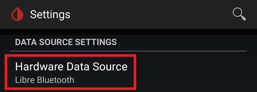

**NFC Scan features**: *le impostazioni non menzionate si assumono disattivate.*

- *Usa funzione NFC*: **attivo**
- *Età o scadenza sensore*: **attivo**
- *Scansiona quando non in xDrip+*: **attivo**
- *Use Any-tag optimized reading method*: **off** ma prova **on** in caso di difficoltà a scansionare


- *Avvio connessione Bluetooth con sensore FSL2*: **Connetti sempre ai sensori libre2**

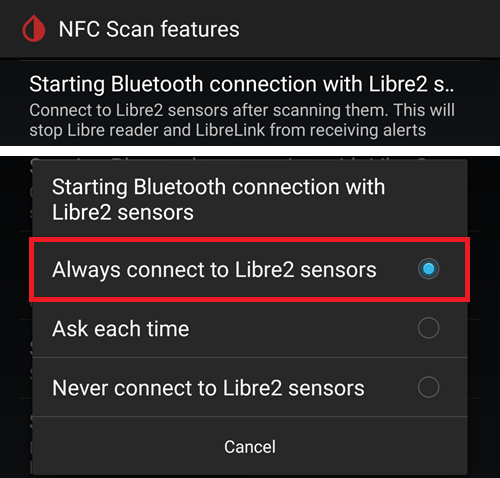

- *Smooth libre 3 data when using xxx method*: lascia il valore predefinito. Aumenta il valore per i sensori rumorosi, riduci quando stabile.


**Less Common Settings -\> Bluetooth Settings** (*queste sono importanti e possono variare con il tuo telefono/configurazione*)

- *Attiva Bluetooth*: **attivo**
- *Fidati della connessione automatica*: **attivo**
- *Usa scansioni in background*: **attivo**
- *Scopri sempre i servizi*: **attivo**

Puoi configurare xDrip+ usando il codice QR qui sotto. Devi scansionarlo (o caricare l'immagine) in xDrip+ -> Auto Configure.

```{admonition} QR Code
:class: dropdown

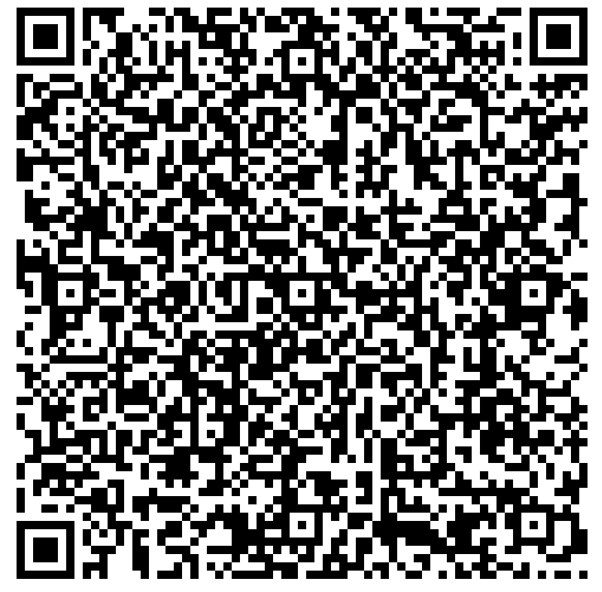
```


Dopo aver scansionato il codice QR sopra, se hai un telefono Samsung (ma questo è utile anche per molti marchi cinesi), scansiona l'altro codice QR qui sotto per cambiare le impostazioni per una connessione più affidabile:

- *Trust Auto-Connect*: **off**
- *Usa scansioni in background*: **disattivo**

```{admonition} QR Code
:class: dropdown


```


**Extra Logging Settings** (*necessario per il debug in caso di malfunzionamento*)

- *Mostra valori grezzi nel grafico*: **attivo**

- *Mostra info sensore nello stato*: **attivo**

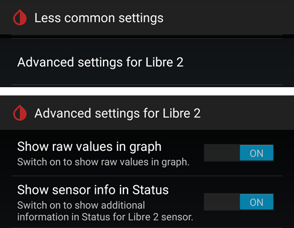

**Advanced settings for FSL2** (*opzionale ma utile*)

- *Extra tags for logging*: inserisci questo valore

`BgReading:d,jamorham librereceiver:v,LibreOOPAlgorithm:v,jamorham nsemulator:v,DexCollectionService:v`


(minimallooper-OOPsettings)=

**Less Common Settings -\> Other misc options**

> **Impostazioni per la configurazione OOP2**

- *Algoritmo Libre out-of-process*: **DISATTIVO**

(*ASSICURATI CHE SIA **OFF** PER OOP2 ALTRIMENTI NON OTTERRAI LETTURE!*)

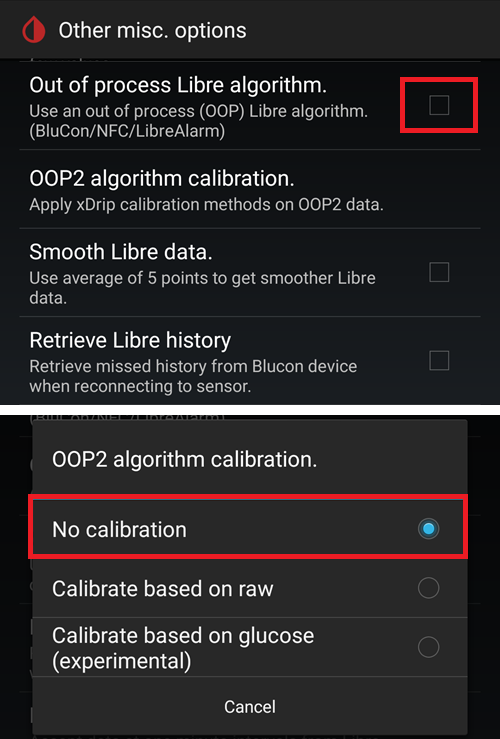

(minimallooper-step3)=

### **Passo 3: Inserire fisicamente il sensore**

(minimallooper-step4)=

### **Passo 4: Avvia l'app LL e avvia il sensore con la prima scansione NFC**

Avvia l'app LL, scansiona il sensore appena inserito, poi chiudi e disabilita o disinstalla l'app LL. **Devi ancora aspettare che il sensore si riscaldi per i 60 minuti completi prima di procedere e avviare il sensore in xDrip+**. Non fare affidamento sulle letture prima poiché il sensore sta ancora eseguendo la calibrazione interna e i valori variano molto.

#### **Passo 4a (OPZIONALE, usa FSLReader):**

**Avvia il sensore FSL2 (non 2+) scansionandolo con il FSLReader con la prima scansione NFC**

Se vuoi poter usare il **FSLReader** così come l'app LL o xDrip+ per leggere i valori dal sensore FSL2, allora **dovrai scansionare il sensore FSL2 appena inserito con il FSL Reader PER PRIMO.** Dopo che il riscaldamento del sensore è completo puoi quindi usare l'app LL o xDrip+ per effettuare scansioni.

*NOTA: L'app LL è necessaria solo per la PRIMA scansione NFC dopo l'inserimento del sensore. Serve per inviare il segnale di inizializzazione del riscaldamento; successivamente l'app DEVE essere disabilitata (impostazioni app -> forza la chiusura) o disinstallata. Puoi usare l'app 2.3 Patchata o le versioni Ufficiali, non importa. La cosa principale è impedire all'app LL di essere in esecuzione quando xDrip+ sta cercando di avviare il processo di binding BT con il sensore poiché l'app LL interferisce con il processo di riconnessione Bluetooth interrompendo la comunicazione.*

*È stato segnalato che semplicemente disattivare il **permesso di localizzazione** nelle impostazioni di sistema Android dell'app LL è sufficiente per impedirle di interferire con la connessione. Questo è stato segnalato da alcuni utenti come riuscito. Di nuovo, **raccomando di disabilitare o disinstallare l'app** ma puoi provare questo se vuoi sperimentare.*

(minimallooper-step5)=

### **Passo 5: Apri xDrip+ ed esegui la scansione NFC del sensore FSL2**

(*Promemoria! Assicurati che LL sia disabilitato (localizzazione disattivata) o disinstallato E che tu abbia aspettato gli interi 60 minuti per il riscaldamento e la calibrazione interna del sensore.*)

**Scansiona con NFC** il sensore FSL2 con xDrip+. Questo invia un segnale al sensore per attivare il pairing Bluetooth al fine di avviare il processo di binding. Una piccola notifica apparirà brevemente nella parte inferiore della schermata principale di xDrip+ con il testo **Scanning** seguito dalla notifica **Scanned OK!** in caso di scansione NFC riuscita del sensore FSL 2.

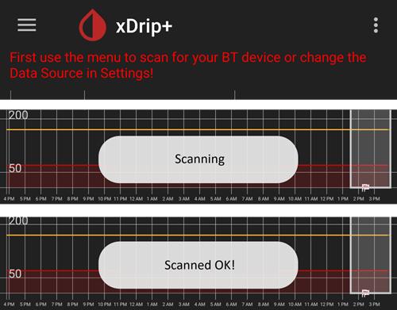

(minimallooper-step6)=

### **Passo 6: Avvia il nuovo sensore in xDrip+**

Nella **schermata principale di xDrip+** premi il **menu hamburger** nell'angolo in alto a sinistra. Poi scegli **Start Sensor**.

Nella schermata **Start New Sensor** premi **Start Sensor**. Una richiesta chiederà **Did you insert it today?** Rispondi premendo **NOT TODAY**.

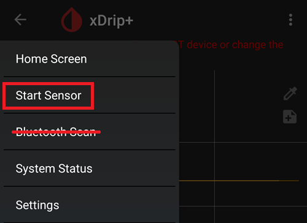

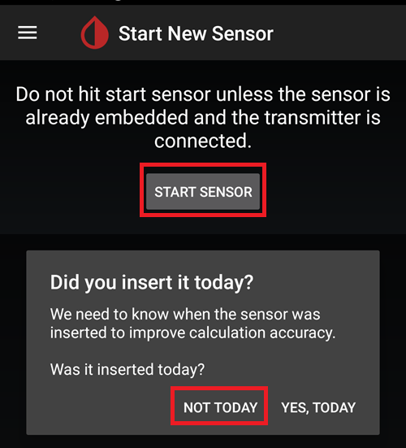

*NOTA: Se hai cliccato accidentalmente "YES, TODAY" allora dovrai "stop sensor" dal menu principale di xDrip+ seguito da "start sensor" procedendo di nuovo con il Passo 5.*

(minimallooper-step7)=

### **Passo 7: Attendi 60 secondi ed esegui di nuovo la scansione NFC del sensore**

È necessaria una seconda scansione NFC per **AGGIUNGERE** il sensore come dispositivo Bluetooth da cui xDrip+ recupererà le letture. Una volta completato vedrai una notifica che indica **NEW SENSOR STARTED**.


Un periodo di attesa di 60 secondi è imposto perché il sensore non può essere scansionato più di una volta al minuto durante questo processo. Se il sensore viene scansionato troppo presto viene visualizzato l'avviso **Not so quickly, wait 60 seconds** nella schermata principale di xDrip.

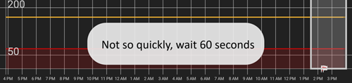

Apri i log degli eventi xDrip+ e verifica che il sensore si sia abbinato correttamente con xDrip+.

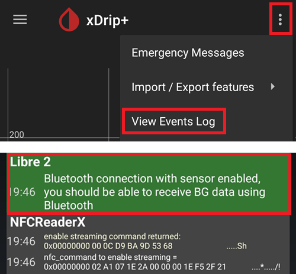

(minimallooper-step8)=

### **Passo 8: Raccolta dati tra 3 e 15 minuti**

Tra 3 e 15 minuti vengono raccolti abbastanza dati per visualizzare i primi valori. *Se non stai ancora ricevendo letture in questo momento, a volte aiuta riavviare il telefono.*

Se usi un Samsung (o molti telefoni di marca cinese) e hai problemi a ricevere dati, scansiona il codice QR qui sotto, in xDrip+ -> Auto Configure.

```{admonition} QR Code
:class: dropdown


```

Cambierà le impostazioni Bluetooth di xDrip+ in:

- *Trust Auto-Connect*: **off**
- *Usa scansioni in background*: **disattivo**

(minimallooper-step9)=

### **Passo 9: Verifica che il sensore sia connesso e stia trasmettendo dati**

Premi il menu Hamburger in alto a sinistra nella schermata principale di xDrip+ e seleziona **System Status**. Nella schermata System Status il campo attivo **Bluetooth Device:** visualizza la convenzione di denominazione Bluetooth FSL2 di **ABB___XXXXXXXXXXX**, dove le XXX rappresentano il numero di serie del sensore. Il campo **Connection Status** visualizza **Connected** e il campo **Sensor Start:** visualizza l'ora di avvio del sensore.

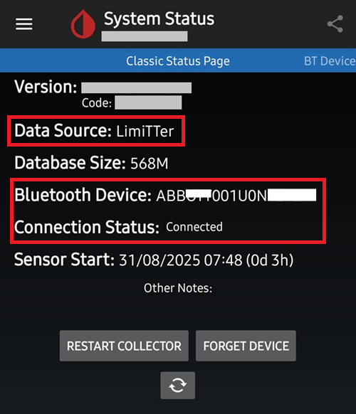

Nella schermata **BT Device** (scorrere a sinistra) puoi verificare ulteriori dettagli di connessione del sensore e usare questa schermata per la risoluzione dei problemi di connessione. Di seguito è riportato un elenco di campi e i loro scopi per aiutare nella risoluzione dei problemi di connessione.

*NOTA: **<u>NON TOCCARE</u> E CAMBIARE Bluetooth Pairing da <u>Disabled</u>** in questa finestra. In tal modo si tenterà un abbinamento diretto, fallirà (Not bonded) e dovrai ricominciare il processo dal Passo 5.*

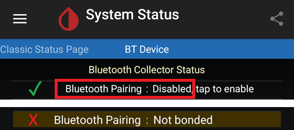

- **Phone Service State:** L'ultima volta che il telefono ha effettuato una connessione BT al sensore (dovrebbe essere meno di 5 minuti fa)
- **Bluetooth Device:** Visualizza lo stato corrente della connessione (either **Connected** or **Disconnected**)
- **Device Mac Address**: Questo è l'ID hardware del sensore
- **Bluetooth Pairing**: Deve essere **<u>Disabled, tap to enable</u>**. Fai attenzione a NON toccarlo. Se lo tocchi per errore, toccalo di nuovo finché non torna a disabilitato.
- **Slowest wake up**: Puoi ignorarlo. xDrip+ non passa il suo tempo ad aspettare le letture: inizierà ad aspettarle dopo un certo tempo (tradizionalmente 5 minuti). Se non arrivano dati in quel momento, vedrai "Woke up early" il che significa che xDrip+ si aspettava che i dati fossero pronti ma non ce ne sono. Il wake up più lento è il ritardo più alto incontrato prima di ricevere i dati normalmente.
- **Next Wake up**: Dovrebbe indicare 5 minuti


(minimallooper-notes)=

### **Note**

- **Usare scansioni NFC LL DOPO che il binding/pairing in xDrip+ è completato**: Puoi effettuare scansioni NFC ma il processo di binding/pairing con xDrip+ deve essere completato prima. Guarda sempre xDrip+ e verifica se è vicino alla lettura dei 5 minuti (cioè 4 minuti fa); se è vicino a 5 min, aspetta che arrivi la nuova lettura BT e poi effettua la scansione NFC. Se la prendi al momento sbagliato disturberà il processo BT in xDrip+ e non riceverà letture BT, il che può richiedere un po' di tempo per riabbinarsi e trasmettere di nuovo; e a volte una connessione BT del sensore può essere "rubata" da LL. Tuttavia tra queste letture BT non ho avuto problemi a eseguire una scansione NFC seguita dalla disabilitazione immediata dell'app. Non sono sicuro se LL debba essere disabilitato ogni volta ma lo disabilito per sicurezza.

- - **Cosa sta succedendo?** Quando viene effettuata una connessione Bluetooth viene creata una chiave privata condivisa necessaria per consentire la comunicazione tra il sensore e l'applicazione/dispositivo chiamante. C'è un'alta probabilità che l'app LL o il Lettore creino una nuova chiave privata condivisa per la comunicazione durante la connessione. Ciò significa che dopo il binding, xDrip+ non è a conoscenza della nuova chiave e non sarà in grado di comunicare con il sensore.

  - Diversi utenti hanno segnalato che l'app LL può essere riavviata dopo aver avviato correttamente il sensore e ricevuto letture in xDrip+. Nelle autorizzazioni Android dell'app LL devi semplicemente disattivare l'impostazione **Allow Location**. Una volta fatto questo dovresti essere in grado di usare l'app LL e xDrip+ contemporaneamente. Ti consiglio di non selezionare un'app predefinita per la scansione NFC e di scegliere quale app vuoi usare per leggere il sensore con una scansione NFC. Inoltre, NON DIMENTICARE, al tuo prossimo cambio di sensore di chiudere forzatamente l'app LL dopo la scansione NFC di riscaldamento iniziale sul nuovo sensore. Dopo che il sensore è configurato e riceve letture in xDrip+ puoi riavviare l'app LL.

&nbsp;

- **Riavvio del telefono**: Dopo il riavvio e dopo aver disabilitato o chiuso forzatamente l'app, RICORDA di verificare che l'app LL NON sia in esecuzione. Suggerisco di testare un riavvio per vedere se LL si avvia di nuovo automaticamente. Puoi guardare nelle impostazioni dell'app LL nelle impostazioni dell'applicazione Android sul tuo telefono. Se è ancora abilitata, disabilita di nuovo l'app LL; potrebbe essere necessario disinstallare l'app LL per evitarlo. Questo serve a impedire a LL di rubare accidentalmente il binding BT. Inoltre, dopo il riavvio ci vorranno gli stessi 3-15 minuti per ottenere letture BT dal sensore, quindi sii paziente e pianifica questo se stai riavviando in prossimità di momenti in cui hai bisogno di una lettura glicemia per effettuare boli, pasti, ecc.

&nbsp;

- **Impostazioni di ottimizzazione della batteria**: Assicurati di ESCLUDERE queste app dalle impostazioni di ottimizzazione della batteria del tuo telefono

  - xDrip+

  - OOP 2

  - LL

  - AndroidAPS

&nbsp;

- **Uso della modalità aereo:** Ci sono alcune situazioni che richiedono di attivare la modalità aereo (quando si prende un volo ;-), dormire di notte e non si desidera avere segnali WIFI o connessione Mobile operativi con il telefono vicino alla testa) e questo può causare problemi con la comunicazione Bluetooth durante l'attivazione della modalità aereo. Quando si attiva la modalità aereo sul telefono seguita dall'attivazione del Bluetooth, le letture di glicemia vengono perse. L'unica soluzione è riavviare il collettore in xdrip+ -> System Status -> Classic Status Page. Dopo aver riavviato il collettore le letture di glicemia sono riapparse.

 

(minimallooper-advantages)=

### **Vantaggi**

- **App LL patchata non più richiesta** Non hai più bisogno di una versione patchata dell'app LL per recuperare i valori dal sensore FSL2. Sebbene tu possa usare l'app LL patchata, le versioni ufficiali dell'app LL possono avviare la prima scansione NFC di inizializzazione allo stesso modo dell'app patchata. Non c'è differenza per quanto riguarda la scansione NFC di inizializzazione per avviare il sensore.

&nbsp;

- **Dispositivo di scansione NFC di terze parti non più richiesto** I dispositivi di scansione NFC di terze parti come (Miaomiao, Bubble o Blucon) non sono più necessari *(ma possono ancora essere usati)* per raccogliere le letture poiché il sensore da solo può ora consegnarle via Bluetooth. Meno hardware significa meno cose che possono andare storte, meno dispositivi da caricare e una configurazione più minimalista.

&nbsp;

- **Potrai ancora effettuare scansioni NFC con il FSL2 Reader (versione 1 con FW aggiornato o versione 2) QUANDO il sensore FSL2 è stato avviato con il FSL Reader PER PRIMO.** Il lettore standalone FSL2 può ancora essere usato per scansionare le letture sul sensore attivo una volta che è abbinato via Bluetooth a xDrip+.

  - Devi **avviare** il sensore con la prima scansione NFC per inizializzare il riscaldamento **con il FSL Reader PER PRIMO**. Dopo questo punto altre applicazioni software saranno in grado di prendere anche letture NFC dal sensore ora attivato.
- È mia comprensione che il sensore FSL2 (finché non ha stabilito o non sta cercando di stabilire una connessione) pubblicizzerà sempre la sua presenza (e disponibilità) via BLE esattamente ogni 2 minuti (visibile su qualsiasi dispositivo Bluetooth che ha la capacità di scansionare dispositivi Bluetooth). Qualsiasi dispositivo risponda per primo a questa pubblicità vince la gara ed è il *solo* dispositivo autorizzato a connettersi e leggere il sensore poiché viene creata una chiave privata condivisa durante il processo di connessione alla scansione NFC che viene usata per decrittare la comunicazione FSL 2. Il sensore è quindi non disponibile per altri dispositivi che non hanno questa chiave privata condivisa e che potrebbero anche tentare di connettersi. Sembra che il lettore FSL 2 vinca sempre questa gara qualunque sia l'"avversario".

&nbsp;

- **Configurazione hardware minimale** Il mio obiettivo è sempre stato di mantenere al minimo i dispositivi medici attaccati al mio corpo. L'FSL2 in combinazione con il sistema Omnipod ha raggiunto questo obiettivo. Questo punto è ancora più cruciale quando viaggio (sia brevi che lunghe distanze) perché il numero di elementi e i cambi di set per quegli elementi diventano meno, il che significa che ho più spazio per altri elementi nel mio bagaglio. Speriamo che in futuro ci sarà un patch pump che ha solo un serbatoio intercambiabile e il sistema di chip e motore può essere confezionato come un pezzo conservabile/riutilizzabile. Ciò ridurrebbe gli sprechi e diminuirebbe l'imballaggio per i cambi del sito che di nuovo porta a più spazio nella mia valigia per altre cose.

&nbsp;

- **Non più gap di un'ora quando si cambiano i sensori** Perché puoi avviare un altro sensore con l'app LL usando una scansione NFC iniziale, il sensore corrente può continuare a funzionare e a consegnare letture via Bluetooth allo stesso tempo. Dopo 20 minuti puoi ottenere letture dal nuovo sensore ma è meglio aspettare 1 ora per il corretto calibrazione interna del sensore. Ciò significa che puoi fermare il sensore corrente e avviare quello nuovo (dopo che è stato impostato e riscaldato con la scansione NFC LL un'ora prima) e entro 3-15 minuti avrai le tue calibrazioni iniziali e le letture.

&nbsp;

(minimallooper-disadvantages)=

### **Svantaggi**

- **Riavvio del telefono:** Poiché il processo Bluetooth deve ricominciare quando il telefono si riavvia, devi prima assicurarti di disabilitare manualmente l'app LL (se non l'hai disinstallata) e essere paziente per le prime letture da ricevere (3-15 minuti). Ciò significa che devi calcolare i tempi dei riavvii del telefono in modo che non si verifichino nei momenti critici come boli di correzione o orari dei pasti e spuntini.

&nbsp;

- **Non puoi eseguire LL e xDrip+ in parallelo insieme per le letture Bluetooth.** LL cercherà sempre di "rubare" la connessione Bluetooth al sensore e abbinarsi. LL cercherà sempre di "rubare" la connessione Bluetooth al sensore e di abbinarsi. Se ciò accade, sei bloccato con LL per il resto della vita del sensore. Quindi eseguire le app contemporaneamente non funziona sempre. Come menziono di seguito, puoi abilitare l'app LL e fare una scansione NFC per ottenere la lettura LL (se hai bisogno di confrontare, vuoi recuperare la cronologia per te stesso o per le relazioni dell'endocrinologo) tuttavia dovresti disabilitarla non appena hai la tua lettura e non cercare di farlo entro un minuto da quando xDrip+ recupererà la sua lettura Bluetooth. Non sono sicuro di come funziona l'uso del lettore FSL2 mentre si fa questo ma lo testerò in un secondo momento.
- Diversi utenti hanno segnalato che l'app LL può essere riavviata dopo aver avviato correttamente il sensore e ricevuto letture in xDrip+. Nelle autorizzazioni Android dell'app LL devi semplicemente disattivare l'impostazione **Allow Location**. Una volta fatto questo dovresti essere in grado di usare l'app LL e xDrip+ contemporaneamente. Ti consiglio di non selezionare un'app predefinita per la scansione NFC e di scegliere quale app vuoi usare per leggere il sensore con una scansione NFC. Inoltre, NON DIMENTICARE, al tuo prossimo cambio di sensore di chiudere forzatamente l'app LL dopo la scansione NFC di riscaldamento iniziale sul nuovo sensore. Dopo che il sensore è configurato e riceve letture in xDrip+ puoi riavviare l'app LL.

&nbsp;

- **I dispositivi di scansione NFC di terze parti possono ancora essere usati.** Sì, l'ho elencato come svantaggio ma volevo anche sottolineare che se qualcosa va storto con il sensore e LL cattura il controllo di esso, puoi sempre ripiegare sull'utilizzo di un dispositivo di scansione NFC sul sensore per ottenere letture in xDrip+. Sì, l'ho elencato come svantaggio, ma volevo anche sottolineare che se qualcosa va storto con il sensore e LL ne prende il controllo, puoi sempre ripiegare sul posizionamento di un dispositivo di scansione NFC vicino al sensore. Puoi anche usare questo dispositivo invece di una connessione Bluetooth diretta se sei più a tuo agio con una configurazione che consiste in un dispositivo di scansione NFC di terze parti (Miaomiao, Bubble, Blucon). A volte certi telefoni non funzionano bene con il binding nativo del sensore Bluetooth e il recupero dei dati. Puoi usare questi dispositivi come backup o come utilizzo normale, in ogni caso hai ancora questa opzione.
- Se hai intenzione di usare il **FSL Reader** come dispositivo di scansione NFC per prendere letture, DEVI avviare il sensore FSL2 con la **PRIMA scansione NFC** per riscaldare il sensore con il **READER PER PRIMO**.

&nbsp;

- **I dati LV non verranno caricati automaticamente** Poiché l'app LL non ha una connessione Bluetooth costante (perché LL non dovrebbe essere in esecuzione contemporaneamente a xDrip+ una volta che il sensore sta attivamente inviando letture Bluetooth) non sta ricevendo letture automaticamente dal sensore. Ciò significa che i dati di glicemia non vengono caricati automaticamente su LV e per estensione altri telefoni con LL. Segno questo come svantaggio poiché so che molti genitori si affidano a questa funzionalità così come quelli che sono costretti a usare il reporting LV per il loro medico curante. Puoi comunque aprire l'app LL e scansionare ogni 8 ore per ottenere i dati retroattivi dal sensore in LL (3 volte al giorno, almeno ogni 8 ore, ma probabilmente sarebbero necessarie più scansioni per catturare tutte le 24 ore di dati) ma di nuovo questo è un processo manuale.

&nbsp;

(minimallooper-definitions)=

### **Definizioni**

- **BT** - Bluetooth

- **BLE** - Bluetooth Low Energy

- **FSL** - FreeStyle Libre
  - **Libre 1 (FSL1)** - Solo NFC. Prima versione del sensore

  - **FSL2 (FSL2)** - Bluetooth e NFC. Seconda versione del sensore.

  - **Libre 3 (FSL3)** - Bluetooth e NFC. Terza versione più piccola del sensore. Non supportato da OOP2 (vedi Juggluco).

- **LL** - LibreLink, **applicazione** usata per avviare il sensore con la scansione NFC iniziale

- **LV** - LibreView, servizio cloud per la condivisione dei dati con il team medico (considera l'utilizzo di Tidepool o Nightscout)

- **MM** - MiaoMiao, nome e produttore di un dispositivo di scansione NFC di terze parti che consegna letture via Bluetooth a xDrip+.

- **NFC** - Near Field Communication, un'operazione fisica in cui porti il sensore NFC del tuo telefono vicino al sensore per avviare una lettura. Questo è spesso indicato come "scansionare il sensore", una "scansione del sensore" o "scansione NFC". Questo processo in nessun modo usa il Bluetooth.

- **OOP1** - Out of Process Algorithm versione 1, l'app di terze parti che riceve valori grezzi (consegnati a xDrip+ dal sensore via Bluetooth o scansione NFC) e poi usa un algoritmo (molto simile all'algoritmo hardware sul chip del sensore) per elaborare i valori grezzi e restituisce una glicemia calibrata (dall'algoritmo OOP1, non dalle calibrazioni native di xDrip+) a xDrip+ per visualizzarla o per essere ulteriormente elaborata con la calibrazione di xDrip+ (con una calibrazione di glicemia da puntura del dito) se necessario.

- **OOP2** - Out of Process Algorithm versione 2, l'app di terze parti che riceve dati crittografati consegnati dal sensore FSL 2 (via Bluetooth o scansione NFC) e poi decrittografa i dati crittografati. Una volta decrittografati, i dati vengono inviati a xDrip+.

 

(minimallooper-troubleshooting)=

### Risoluzione dei problemi

#### Impossibile scansionare il sensore con NFC

- Assicurati che il lettore NFC del tuo telefono sia abilitato nelle impostazioni Android.
- Il lettore NFC deve essere compatibile con i tag **ISO 15693**. Alcuni telefoni Cubot sono molto difficili da usare.
- Consulta la documentazione del tuo telefono per identificare la posizione dell'antenna NFC. Avvicinala al sensore e rimani su di esso per 10 secondi: la lettura NFC di xDrip+ richiede più tempo rispetto all'app del fornitore o al lettore.
- Prova a chiudere xDrip+ prima di scansionare il sensore.
- Assicurati che nessun'altra app voglia leggere il sensore (potresti vedere una selezione con diverse scelte di app durante la scansione: seleziona xDrip+ ma non muovere il telefono).
- Prova tutte le combinazioni delle impostazioni NFC di xDrip+ *Use faster multi-block reading method* e *Use Any-tag optimized reading method* sapendo che le scansioni NFC sono di solito più affidabili con entrambe queste opzioni **off**.

#### Bloccato nella raccolta delle letture iniziali

*Nota: FSL 2 non è riconosciuto come sorgente dati affidabile quando calibrato manualmente.*

Imposta la strategia di [calibrazione OOP2](#minimallooper-OOPsettings) su "No calibration" finché tutto non funziona.

Poi puoi decidere se calibrare o meno.


#### Il sensore viene segnalato come FSL1

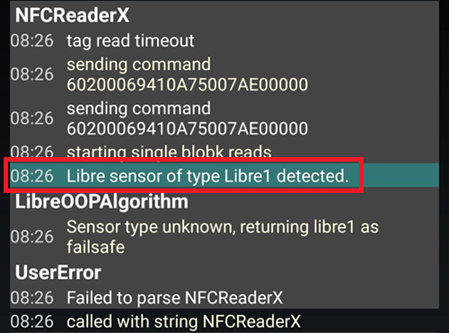

Assicurati di eseguire le versioni più recenti di xDrip+ e OOP2.

#### La connessione al sensore fallisce

- Verifica che OOP1 sia disabilitato (vedi [qui](#minimallooper-OOPsettings))


- Verifica che OOP2 non venga messo in sleep dalle app e dalle impostazioni di risparmio batteria del telefono
- Verifica che Google Play Protect sia disabilitato poiché eliminerà OOP2
- Hai cambiato Bluetooth Pairing in System Status? Toccalo di nuovo per riportarlo a **<u>Disabled</u>**


#### Letture mancanti

Assicurati che OOP2 mostri valori che non siano 0 o -1; potrebbe essere un segnale che il sensore sta fallendo (esempio sotto in mmol/l).

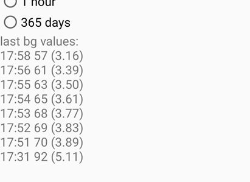

Anche il mancato avanzamento dell'età del sensore potrebbe essere un segnale che il sensore ha problemi. Ciò significa che xDrip+ ha ricevuto un valore, ma lo ha scartato poiché non era accettabile (errore del sensore).


#### Ricominciare dall'inizio il pairing del sensore

1. xDrip+ menu -> Stop sensor (non fermerà l'FSL2, cambierà solo lo stato di xDrip+ a non avviato)
2. xDrip+ menu -> System status -> Forget device
3. Scansiona il sensore con NFC xDrip+. Attendi almeno un minuto
4. xDrip+ menu -> Start sensor. Attendi almeno un minuto
5. Scansiona il sensore con NFC xDrip+, alcune volte, aspettando sempre almeno un minuto tra due scansioni
