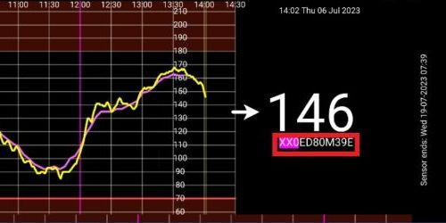

- - -
orphan: true
- - -

# **Libre Freestyle 3** e 3+

Freestyle Libre 3 (FSL3) richiede una configurazione unica per ricevere i valori di glicemia in AAPS. Ci sono due possibili modi per ottenere i valori Freestyle Libre 3 (FSL3) in AAPS.

I metodi elencati sotto, chiedono l'uso dell'app separata Juggluco. Utilizza Juggluco per ricevere dati grezzi con intervallo di 1 minuto dal sensore che viene poi passato a xDrip+ o AAPS. I nuovi sensori possono essere avviati con l'App Libre 3 o direttamente in Juggluco. La guida qui sotto indica il processo per avviare un sensore con l'app Juggluco. Se il sensore è stato avviato con l'account Libreview collegato, è anche possibile passare da Juggluco all'app Libre 3 come ricevitore.

Juggluco può anche mandare i dati a LibreView per la condivisione con il diabetologo quando il sensore viene avviato con l'app Libre 3.

All'interno di xDrip+ il sensore può essere calibrato nell'intervallo da -40 mg/dl a +20 mg/dl (da -2,2 mmol/l a +1,1 mmol/l) per compensare le differenze tra la lettura manuale con il gluometro e le letture del sensore.

## Method 1: use 1-minute readings directly
AndroidAPS is taylored for 5-minute readings. Therefore processing 1-minute values has occasional limitations.

## Method 2: convert 1-minute readings into 5-minute values via xDrip
Questo metodo utilizza Juggluco per ricevere i dati grezzi dal sensore ogni minuto, vengono poi passati a xDrip+ che ne fa la media ogni 5 minuti, e sono quindi inoltrati ad AAPS.

### Passo 1: Impostare Juggluco
Scarica e installa l'applicazione Juggluco da [qui](https://www.juggluco.nl/Juggluco/download.html). Segui le istruzioni [qui](https://www.juggluco.nl/Juggluco/libre3/)

Assicurati di inviare i valori di glucosio a xDrip+: Nelle sue impostazioni, puoi configurare Juggluco per inviare il valore di glucosio ad altre applicazioni. Juggluco può usare tre tipi di trasmissioni: La **Patched Libre broadcast** è stata utilizzata originariamente dall'app Librelink patchata e può essere utilizzata per inviare valori di glucosio a xDrip+

### Passo 2: Impostare xDrip

I valori di glicemia vengono ricevuti dall'app xDrip+ sullo smartphone.

- Se non lo hai già installato, scarica [xDrip+](https://github.com/NightscoutFoundation/xDrip) e segui le istruzioni sulla pagina [Impostazioni xDrip+](../CompatibleCgms/xDrip.md).
- In xDrip+ seleziona "Libre2 (patched app)" come sorgente dati.
- Se necessario, inserisci "BgReading:d,xdrip libre_receiver:v" sotto Impostazioni meno usate → Impostazioni di log supplementari → Tag aggiuntivi per la registrazione. Questo registrerà ulteriori messaggi di errore per la risoluzione dei problemi.

- Dal punto di vista tecnico, il valore della glicemia viene trasmesso a xDrip+ ogni minuto. Di default, viene calcolato un valore “smussato” in base alla media ponderata degli ultimi 25 minuti. Puoi modificare questo periodo nel menu Funzionalità scansione NFC.

  → Menu → Impostazioni → Funzionalità scansione NFC → Liscia i dati libre 3 quando si usa il metodo xxx

  

### Passo 3: Avviare il sensore all'interno di xDrip

In xDrip+ avvia il sensore con "Avvia Sensore" e "non oggi". Non è necessario tenere il telefono cellulare sul sensore. Questo non avvia alcun sensore Libre 3, né vi interagisce in alcun modo. Questo serve semplicemente a dire a xDrip+ che un nuovo sensore sta trasmettendo i valori della glicemia. Se disponibili, inserisci due misurazioni con il glucometro per la calibrazione iniziale. Ora i valori della glicemia dovrebbero essere visibili su xDrip+ ogni 5 minuti. I valori mancanti, ad esempio quando il sensore è distante dal telefono, non verranno reintegrati.

Aspetta almeno 15-20 minuti se non ci sono ancora dati.

Dopo un cambio di sensore, xDrip+ rileva automaticamente il nuovo sensore ed elimina tutti i parametri di calibrazione vecchi. Dopo l'attivazione è possibile misurare la glicemia con il glucometro ed effettuare una nuova calibrazione iniziale.

### Passo 4: Configurare AndroidAPS

- Seleziona xDrip+ in [Configuratore strutturale, Origine BG](#Config-Builder-bg-source).

- Se AndroidAPS non riceve i valori di glicemia quando il telefono è in modalità aereo, usa "Identifica ricevitore"
- Disabilita lo smoothing (già fatto in xDrip+)

## Cambiamenti successivi del sensore

1. Apri Juggluco e nota il numero di serie del sensore esistente

2. Ora basta eseguire la scansione del nuovo sensore con il lettore NFC del telefono. Juggluco mostrerà un avviso se il processo è stato avviato correttamente.
3. Quando sei pronto a disattivare il vecchio sensore, poi aprire il menu Juggluco cliccando ovunque nello spazio vuoto nell'angolo in alto a sinistra dello schermo.
4. Select the expired sensor and tap "Terminate"

Nota: Quando due sensori sono attivi, Juggluco invierà il valore più recente da entrambi i sensori a xDrip+. Se i sensori non sono calibrati e leggono la glicemia simultaneamente, xDrip+ potrebbe mandare dei valori molto instabili a AAPS. Se fermi il sensore sbagliato, è possibile riattivarlo semplicemente scansionando il sensore.

## Passa il sensore dall'app Libre 3 a Juggluco

Se il sensore è stato avviato con un account Libreview collegato, è anche possibile passare da Juggluco all'app Libre 3 come ricevitore. Ciò richiede i passaggi seguenti:

1. Installa l'app Libre 3 da Google Playstore
2. Configura l'app Libre 3 con l'account Libreview con il quale è stato attivato il sensore.
3. Forza l'arresto dell'app Juggluco nelle impostazioni Android.
4. Nel menu Libre 3, fai clic su "Avvia Sensore", seleziona "Sì", "successivo" e scansiona il sensore.
5. Dopo alcuni minuti, i valori glicemici dovrebbero essere visibili all'interno dell'app Libre 3.

Per passare dall'app Libre 3 a Juggluco, è necessario forzare l'arresto dell'app Libre 3 tramite le impostazioni di Android e procedere con i passaggi 1 & 2.

(libre3-experiences-and-troubleshooting)=
## Esperienze e Risoluzione dei Problemi

### Risoluzione Dei Problemi Libre3 -> Connessione Juggluco

- Assicurati di utilizzare una versione recente dell'app Juggluco
- Controlla le impostazioni in base a questa guida
- A volte potresti dover forzare l'arresto dell'app Libre 3 e Juggluco e riavviarla.
- Disabilita il Bluetooth e riattivalo
- Aspetta un po' di tempo o prova a chiudere Juggluco
- Le versioni più vecchie di Juggluco (inferiore a 2.9.6) non inviano dati dal sensore Libre 3 a dispositivi connessi (ad esempio Juggluco su WearOS). Potrebbe essere necessario fare clic su "Reinvia dati" nell'app Libre3 patchata (menu Juggluco).

### Ulteriore aiuto

Istruzioni originali: [sito di jkaltes](https://www.juggluco.nl/Juggluco/libre3/)

Github repo: [link Github](https://github.com/maheini/FreeStyle-Libre-3-patch)
