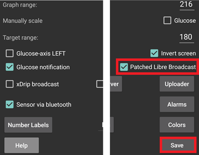

- - -
orphan: true
- - -

# **Libre Freestyle 3** e 3+

Freestyle Libre 3 (FSL3) richiede una configurazione unica per ricevere i valori di glicemia in AAPS. Ci sono due possibili modi per ottenere i valori Freestyle Libre 3 (FSL3) in AAPS.

**La versione 3.2.0.1 di AndroidAPS non supporta i valori ogni minuto. Accelerazione e smoothing non funzionano con i valori ogni minuto.**

I metodi elencati sotto, chiedono l'uso dell'app separata Juggluco. Utilizza Juggluco per ricevere dati grezzi con intervallo di 1 minuto dal sensore che viene poi passato a xDrip+ o AAPS. I nuovi sensori possono essere avviati con l'App Libre 3 o direttamente in Juggluco. La guida qui sotto indica il processo per avviare un sensore con l'app Juggluco. Se il sensore è stato avviato con l'account Libreview collegato, è anche possibile passare da Juggluco all'app Libre 3 come ricevitore.

Juggluco può anche mandare i dati a LibreView per la condivisione con il diabetologo quando il sensore viene avviato con l'app Libre 3.

All'interno di xDrip+ il sensore può essere calibrato nell'intervallo da -40 mg/dl a +20 mg/dl (da -2,2 mmol/l a +1,1 mmol/l) per compensare le differenze tra la lettura manuale con il gluometro e le letture del sensore.

## Metodo 1: letture ogni minuto
La versione 3.2.0.1 di AndroidAPS non supporta i valori ogni minuto. Accelerazione e smoothing non funzionano con i valori ogni minuto.

## Metodo 2: letture ogni 5 minuti
Questo metodo utilizza Juggluco per ricevere i dati grezzi dal sensore ogni minuto, vengono poi passati a xDrip+ che ne fa la media ogni 5 minuti, e sono quindi inoltrati ad AAPS.

### Passo 1: Impostare Juggluco
Scarica e installa l'applicazione Juggluco da [qui](https://www.juggluco.nl/Juggluco/download.html). Segui le istruzioni [qui](https://www.juggluco.nl/Juggluco/libre3/)

Assicurati di inviare i valori di glucosio a xDrip+: Nelle sue impostazioni, puoi configurare Juggluco per inviare il valore di glucosio ad altre applicazioni. Juggluco può usare tre tipi di trasmissioni: La **Patched Libre broadcast** è stata utilizzata originariamente dall'app Librelink patchata e può essere utilizzata per inviare valori di glucosio a xDrip+

### Passo 2: Impostare xDrip

I valori di glicemia vengono ricevuti dall'app xDrip+ sullo smartphone.

- Se non lo hai già installato, scarica [xDrip+](https://github.com/NightscoutFoundation/xDrip) e segui le istruzioni sulla pagina [Impostazioni xDrip+](../CompatibleCgms/xDrip.md).
- In xDrip+ seleziona "Libre2 (patched app)" come sorgente dati.
- Se necessario, inserisci "BgReading:d,xdrip libre_receiver:v" sotto Impostazioni meno usate → Impostazioni di log supplementari → Tag aggiuntivi per la registrazione. Questo registrerà ulteriori messaggi di errore per la risoluzione dei problemi.

- Dal punto di vista tecnico, il valore della glicemia viene trasmesso a xDrip+ ogni minuto. Di default, viene calcolato un valore “smussato” in base alla media ponderata degli ultimi 25 minuti. Puoi modificare questo periodo nel menu Funzionalità scansione NFC.

  → Menu → Impostazioni → Funzionalità scansione NFC → Liscia i dati libre 3 quando si usa il metodo xxx

  

### Passo 3: Avviare il sensore all'interno di xDrip

In xDrip+ avvia il sensore con "Avvia Sensore" e "non oggi". Non è necessario tenere il telefono cellulare sul sensore. Questo non avvia alcun sensore Libre 3, né vi interagisce in alcun modo. Questo serve semplicemente a dire a xDrip+ che un nuovo sensore sta trasmettendo i valori della glicemia. Se disponibili, inserisci due misurazioni con il glucometro per la calibrazione iniziale. Ora i valori della glicemia dovrebbero essere visibili su xDrip+ ogni 5 minuti. I valori mancanti, ad esempio quando il sensore è distante dal telefono, non verranno reintegrati.

Aspetta almeno 15-20 minuti se non ci sono ancora dati.

Dopo un cambio di sensore, xDrip+ rileva automaticamente il nuovo sensore ed elimina tutti i parametri di calibrazione vecchi. Dopo l'attivazione è possibile misurare la glicemia con il glucometro ed effettuare una nuova calibrazione iniziale.

### Passo 4: Configurare AndroidAPS

- Seleziona xDrip+ in [Configuratore strutturale, Origine BG](#Config-Builder-bg-source).

- Se AndroidAPS non riceve i valori di glicemia quando il telefono è in modalità aereo, usa "Identifica ricevitore"
- Disabilita lo smoothing (già fatto in xDrip+)

Per ora, quando si utilizza il Libre 3 come sorgente di glicemia, le opzioni "Abilita SMB sempre" e "Abilita SMB con COB" non possono essere abilitate nell'algoritmo SMB. I valori della glicemia del Libre 3 non sono abbastanza omogenei per poterli usare in modo sicuro.

## Cambiamenti successivi del sensore

1. Apri Juggluco e nota il numero di serie del sensore esistente

2. Ora basta eseguire la scansione del nuovo sensore con il lettore NFC del telefono. Juggluco mostrerà un avviso se il processo è stato avviato correttamente.
3. Quando sei pronto a disattivare il vecchio sensore, poi aprire il menu Juggluco cliccando ovunque nello spazio vuoto nell'angolo in alto a sinistra dello schermo.
4. Seleziona il sensore scaduto e tocca "Termina"

Nota: Quando due sensori sono attivi, Juggluco invierà il valore più recente da entrambi i sensori a xDrip+. If the sensors are not calibrated and reading BG similarly, this may result in jumpy BG values being reported to xDrip+. If you terminate the wrong sensor, you can reactivate it by simply scanning the sensor.

## Switch sensor between Libre 3 and Juggluco app

If the sensor has been started with a Libreview account logged in, it is also possible to switch between Juggluco and the Libre 3 app as receiver. This requires the following steps:

1. Install the Libre 3 app from Google Playstore
2. Set up the Libre 3 app with the Libreview account with which the sensor was activated.
3. Force stop the Juggluco app in the Android settings.
4. In the Libre 3 menu, click "Start Sensor", select "Yes", "Next" and scan your sensor.
5. After some minutes, the BG-Values should be visible within Libre 3 App.

In order to switch from the Libre 3 app to Juggluco, you need to force-stop Libre 3 app via Android settings and proceed with Step 1 & 2.

(libre3-experiences-and-troubleshooting)=
## Experiences and Troubleshooting

### Troubleshooting Libre3 -> Juggluco Connection

- Make sure you are using a current version of the Juggluco app
- Check your settings according to this guide
- You may sometimes have to force stop the Libre 3 app and Juggluco and restart it.
- Disable Bluetooth and enable it again
- Wait some time or try to close Juggluco
- Older versions of Juggluco (below 2.9.6) do not send subsequent data from the Libre3 sensor to connected devices (e.g. Juggluco on WearOS). You may need to click "Resend data" in the patched Libre3 app (Juggluco menu).

### Further help

Original instructions: [jkaltes website](https://www.juggluco.nl/Juggluco/libre3/)

Additional Github repo: [Github link](https://github.com/maheini/FreeStyle-Libre-3-patch)
