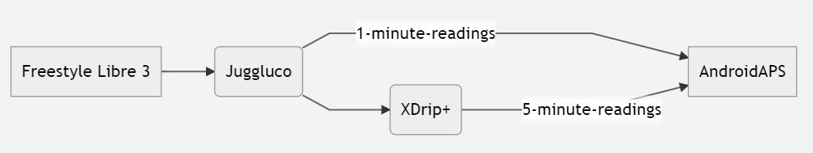

- - -
orphan: true
- - -

# **Libre Freestyle 3** e 3+

Freestyle Libre 3 (FSL3) richiede una configurazione unica per ricevere i valori di glicemia in AAPS. Ci sono due possibili modi per ottenere i valori Freestyle Libre 3 (FSL3) in AAPS.

**La versione 3.2.0.1 di AndroidAPS non supporta i valori ogni minuto. Accelerazione e smoothing non funzionano con i valori ogni minuto.**

I metodi elencati sotto, chiedono l'uso dell'app separata Juggluco. Utilizza Juggluco per ricevere dati grezzi con intervallo di 1 minuto dal sensore che viene poi passato a xDrip+ o AAPS. I nuovi sensori possono essere avviati con l'App Libre 3 o direttamente in Juggluco. La guida qui sotto indica il processo per avviare un sensore con l'app Juggluco. Se il sensore è stato avviato con l'account Libreview collegato, è anche possibile passare da Juggluco all'app Libre 3 come ricevitore.

Juggluco può anche mandare i dati a LibreView per la condivisione con il diabetologo quando il sensore viene avviato con l'app Libre 3.

All'interno di xDrip+ il sensore può essere calibrato nell'intervallo da -40 mg/dl a +20 mg/dl (da -2,2 mmol/l a +1,1 mmol/l) per compensare le differenze tra la lettura manuale con il gluometro e le letture del sensore.

## Metodo 1: letture ogni minuto
La versione 3.2.0.1 di AndroidAPS non supporta i valori ogni minuto. Accelerazione e smoothing non funzionano con i valori ogni minuto.

## Metodo 2: letture ogni 5 minuti
Questo metodo utilizza Juggluco per ricevere i dati grezzi dal sensore ogni minuto, vengono poi passati a xDrip+ che ne fa la media ogni 5 minuti, e sono quindi inoltrati ad AAPS.

### Passo 1: Impostare Juggluco
Scarica e installa l'applicazione Juggluco da [qui](https://www.juggluco.nl/Juggluco/download.html). Segui le istruzioni [qui](https://www.juggluco.nl/Juggluco/libre3/)

Assicurati di inviare i valori di glucosio a xDrip+: Nelle sue impostazioni, puoi configurare Juggluco per inviare il valore di glucosio ad altre applicazioni. Juggluco può usare tre tipi di trasmissioni: La **Patched Libre broadcast** è stata utilizzata originariamente dall'app Librelink patchata e può essere utilizzata per inviare valori di glucosio a xDrip+

### Passo 2: Impostare xDrip

I valori di glicemia vengono ricevuti dall'app xDrip+ sullo smartphone.

- Se non lo hai già installato, scarica [xDrip+](https://github.com/NightscoutFoundation/xDrip) e segui le istruzioni sulla pagina [Impostazioni xDrip+](../CompatibleCgms/xDrip.md).
- In xDrip+ seleziona "Libre2 (patched app)" come sorgente dati.
- Se necessario, inserisci "BgReading:d,xdrip libre_receiver:v" sotto Impostazioni meno usate → Impostazioni di log supplementari → Tag aggiuntivi per la registrazione. Questo registrerà ulteriori messaggi di errore per la risoluzione dei problemi.

- Dal punto di vista tecnico, il valore della glicemia viene trasmesso a xDrip+ ogni minuto. Di default, viene calcolato un valore “smussato” in base alla media ponderata degli ultimi 25 minuti. Puoi modificare questo periodo nel menu Funzionalità scansione NFC.

  → Menu → Impostazioni → Funzionalità scansione NFC → Liscia i dati libre 3 quando si usa il metodo xxx

  

### Passo 3: Avviare il sensore all'interno di xDrip

In xDrip+ start the sensor with "Start Sensor" and "not today". It is not necessary to hold the mobile phone onto the sensor. In fact "Start Sensor" will not physically start any Libre 3 sensor or interact with them in any case. This is simply to indicate xDrip+ that a new sensor is delivering blood sugar levels. If available, enter two bloody measured values for the initial calibration. Now the blood glucose values should be displayed in xDrip+ every 5 minutes. Skipped values, e.g. because you were too far away from your phone, will not be backfilled.

Wait at least 15-20 minutes if there is still no data.

After a sensor change xDrip+ will automatically detect the new sensor and will delete all calibration data. You may check you bloody BG after activation and make a new initial calibration.

### Step 4: Configure AndroidAPS

- Select xDrip+ in [ConfigBuilder, BG Source](#Config-Builder-bg-source).

- If AndroidAPS does not receive BG values when phone is in airplane mode, use "Identify receiver"
- Turn of Smoothing (done in xDrip+ already)

As of now, when using Libre 3 as a BG source, the "Always enable SMB" and "Enable SMB by Carbs" options cannot be enabled in the SMB algorithm. The BG values from Libre 3 are not smooth enough to use safely.

## Subsequent sensor changes

1. Open Juggluco and note the serial number of the existing sensor

2. Now simply scan your new sensor with your phone’s NFC reader. Juggluco will display a notice if the process had been started successfully.
3. When you are ready to deactivate the old sensor, then open the Juggluco menu by clicking anywhere in the empty space in the upper left hand corner of the screen.
4. Select the exired sensor and tap "Terminate"

Note: When two sensors are active Juggluco will send the most recent value from either sensor to xDrip+. If the sensors are not calibrated and reading BG similarly, this may result in jumpy BG values being reported to xDrip+. If you terminate the wrong sensor, you can reactivate it by simply scanning the sensor.

## Switch sensor between Libre 3 and Juggluco app

If the sensor has been started with a Libreview account logged in, it is also possible to switch between Juggluco and the Libre 3 app as receiver. This requires the following steps:

1. Install the Libre 3 app from Google Playstore
2. Set up the Libre 3 app with the Libreview account with which the sensor was activated.
3. Force stop the Juggluco app in the Android settings.
4. In the Libre 3 menu, click "Start Sensor", select "Yes", "Next" and scan your sensor.
5. After some minutes, the BG-Values should be visible within Libre 3 App.

In order to switch from the Libre 3 app to Juggluco, you need to force-stop Libre 3 app via Android settings and proceed with Step 1 & 2.

(libre3-experiences-and-troubleshooting)=
## Experiences and Troubleshooting

### Troubleshooting Libre3 -> Juggluco Connection

- Make sure you are using a current version of the Juggluco app
- Check your settings according to this guide
- You may sometimes have to force stop the Libre 3 app and Juggluco and restart it.
- Disable Bluetooth and enable it again
- Wait some time or try to close Juggluco
- Older versions of Juggluco (below 2.9.6) do not send subsequent data from the Libre3 sensor to connected devices (e.g. Juggluco on WearOS). You may need to click "Resend data" in the patched Libre3 app (Juggluco menu).

### Further help

Original instructions: [jkaltes website](https://www.juggluco.nl/Juggluco/libre3/)

Additional Github repo: [Github link](https://github.com/maheini/FreeStyle-Libre-3-patch)
