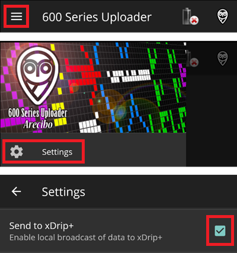

- - -
orphan: true
- - -

# Per gli utenti di MM640g o MM630g

-   Se non già configurato, scarica [600SeriesAndroidUploader](https://pazaan.github.io/600SeriesAndroidUploader/) e segui le istruzioni su [Nightscout](https://nightscout.github.io/uploader/setup/?h=uploader#medtronic-600-series-with-uploader).
-   In 600 Series Uploader vai in Impostazioni > Invia a xDrip+ e abilita l'opzione (selezionata).

-   Seleziona MM640g in [Configuratore strutturale, Origine BG](#Config-Builder-bg-source).

