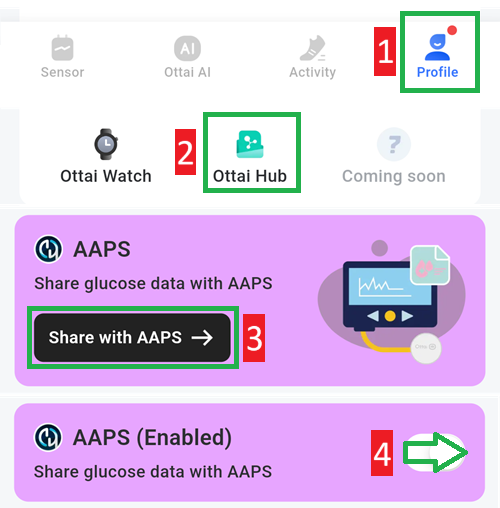

- - -
orphan: true
- - -

# Ottai M8

## Utilizzo di M8 con l'app Ottai

-   Scarica e installa l'apk da <https://play.google.com/store/apps/details?id=com.ottai.seas>.

-   Inizializza il sensore

- Seleziona Ottai in [Configuratore strutturale, Origine BG](#Config-Builder-bg-source).

Enable broadcast in the Ottai app:

1. Select Profile
2. Ottai hub
3. Tap Share with AAPS, accept the third party data transfer agreement
4. Enable Share glucose data with AAPS

