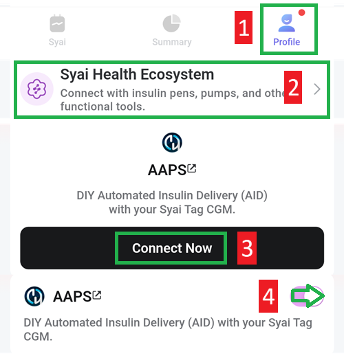

- - -
orphan: true
- - -

# Syai X1

## Utilizzo di X1 e dell'app Syai Tag

-   Scarica e installa l'apk da <https://play.google.com/store/apps/details?id=com.syai.tag>.

-   Inizializza il sensore

- Seleziona Syai Tag in [Configuratore strutturale, Origine BG](#Config-Builder-bg-source).

Abilita la trasmissione nell'app Syai:

1. Seleziona Profilo
2. Ecosistema Salute Syai
3. Tocca Condividi con AAPS, accetta il contratto di trasferimento dati a terze parti
4. Abilita Condividi i dati di glucosio con AAPS

