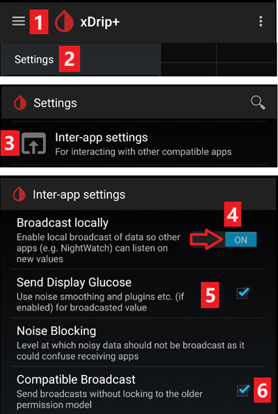

- - -
orphan: true
- - -

# Impostazioni xDrip+

Se non è già installato, scarica [xDrip+](https://jamorham.github.io/#xdrip-plus).

Disabilita l'ottimizzazione della batteria e abilita l'attività in background per l'app xDrip+.

Puoi scaricare di modo sicuro l'ultima [APK (stabile)](https://xdrip-plus-updates.appspot.com/stable/xdrip-plus-latest.apk) a meno che non hai bisogno di funzionalità recenti o se usi sensori che sono attivamente integrati (come G7), in questo caso dovresti utilizzare l'ultimo [Nightly Snapshot](https://github.com/NightscoutFoundation/xDrip/releases).

## Impostazioni di base per tutti i sistemi CGM & FGM

### Disabilita il caricamento verso Nightscout

A partire da AAPS 3.2, non dovresti permettere ad altre app di caricare i dati (glicemia e trattamenti) su Nightscout.

→ Hamburger Menu (1) → Impostazioni (2) → Caricamento nel Cloud (3) -> API Upload (REST) (4) → Metti a **OFF** `Abilitato` (5)


#### Disabilita calibrazione automatica e trattamenti

Se usi una versione precedente di AAPS (prima di 3.2), assicurati di disattivare la `calibrazione automatica` (7) Se la casella per la calibrazione `automatica` è selezionata, attiva `Accetta trattamenti` (6) una volta, quindi deseleziona `Calibrazione automatica` e disattiva di nuovo `Accetta trattamenti`.


Tocca `Altre Opzioni`(8)

```{admonition} Safety warning
:class: warning
Devi disattivare "Carica trattamenti" da xDrip+, altrimenti i trattamenti possono essere raddoppiati in AAPS portando a falsi COB e IOB. 
```

Disattiva i `Carica trattamenti`(9) e assicurati di **NON** utilizzare `Ricupera dati storici` (11).

Anche l'opzione `Allarmi in caso di errori` dovrebbe essere disattivata (10). Altrimenti riceverai un allarme ogni 5 minuti in caso di problemi di rete Wi-Fi/mobile o se il server non è disponibile.


### **Impostazioni Inter-App** (Broadcast)

Se vuoi utilizzare AAPS e i dati devono essere inoltrati ad  AAPS, è necessario attivare la trasmissione in xDrip+ nelle impostazioni Inter-App.

→ Menu (1) → Impostazioni (2) → Impostazioni Inter-app (3) → Trasmetti localmente **ON** (4)

Affinché i valori siano identici in AAPS rispetto a xDrip+, è necessario attivare `Invia glicemia visualizzata` (5).

Abilita Broadcast Compatibile (6).



Se hai anche attivato `Accetta trattamenti` in xDrip+ e `Abilita trasmissioni a xDrip+` nel plugin AAPS xDrip+, xDrip+ riceverà insulina, CHO e informazioni sulla basale da AAPS.

Se abiliti `Accetta calibrazioni`, xDrip+ userà le calibrazioni da AAPS. Fai attenzione quando usi questa funzionalità con i sensori Dexcom: leggi prima [questo](https://navid200.github.io/xDrip/docs/Calibrate-G6.html).

Ricordati di disabilitare Importa suoni per evitare che xDrip+ faccia una suoneria ogni volta che AAPS invia un cambiamento basale/profilo.


(xdrip-identify-receiver)=

#### Identifica il destinatario

* Se riscontri problemi con la trasmissione locale (AAPS che non riceve i valori di glicemia da xDrip+) vai a → Menu (1) Impostazioni (2) → Impostazioni Inter-app (3) → Identifica ricevitore (7) e inserisci`info.nightscout.androidaps` per AAPS (se stai usando la build PumpControl invece, inserisci `info.nightscout.aapspumpcontrol`).
* Attenzione: la correzione automatica a volte tende a cambiare i in maiuscolo. Devi **usare solo lettere minuscole** quando digiti `info.nightscout.androidaps` (o `info.nightscout.aapspumpcontrol` per PumpControl). Una I maiuscola impedisce a l'app di ricevere i valori di glicemia da xDrip+.

   

## Usa AAPS per calibrare in xDrip+

-   Se desideri avere la possibilità di calibrare direttamente da AAPS in xDrip+, vai nelle Impostazioni → Impostazioni Inter-app → Accetta calibrazioni e seleziona ON.
-   Puoi anche verificare le opzioni in Impostazioni → Impostazioni meno usate → Calibrazione avanzata.

## Dexcom G6

* Il trasmettitore Dexcom G6 può essere collegato contemporaneamente al ricevitore Dexcom (o in alternativa al micro t:slim) e a un’app sul telefono.
* Quando utilizzi xDrip+ collegato al sensore, disinstalla prima l'app Dexcom. **Non è possibile collegare le app xDrip+ e Dexcom al trasmettitore contemporaneamente!**
* Se hai bisogno di Clarity e vuoi approfittare delle funzionalità di xDrip+, usa [Build Your Own Dexcom App](#DexcomG6-if-using-g6-with-build-your-own-dexcom-app) con trasmissione locale a xDrip+, o usa xDrip+ come app Compagno che riceve le notifiche dall'app ufficiale Dexcom.

### Versione xDrip+ a secondo del numero di serie del trasmettitore G6.

* Tutti i trasmettitori G6 prodotti dopo l'autunno/fine 2018 sono chiamati "Firefly". Non consentono il riavvio del sensore senza [rimuovere il trasmettitore](https://navid200.github.io/xDrip/docs/Remove-transmitter.html), non inviano dati grezzi. Si consiglia di utilizzare l'ultimo [Nightly Snapshot](https://github.com/NightscoutFoundation/xDrip/releases).
* Old rebatteried transmitters and modified transmitters allow sensor life extension and restarts, they also send raw data. È possibile utilizzare l'[ultima APK (stabile)](https://xdrip-plus-updates.appspot.com/stable/xdrip-plus-latest.apk).


### Impostazioni specifiche Dexcom

* Segui [queste istruzioni](https://navid200.github.io/xDrip/docs/G6-Recommended-Settings.html) per configurare xDrip+.


### Riavvio preventivo sconsigliato

**Solo trasmettitori Dexcom con batteria sostituibile o modificati. Il [riavvio preventivo](https://navid200.github.io/xDrip/docs/Preemptive-Restart.html) non funziona con trasmettitori standard e fermerà completamente il sensore: è necessario [rimuovere il trasmettitore](https://navid200.github.io/xDrip/docs/Remove-transmitter.html) per riavviare il sensore.**

L’estensione automatica dei sensori Dexcom (`riavvio preventivo`) non è raccomandata in quanto ciò potrebbe portare a “salti” nei valori di glicemia il giorno 9 dopo il riavvio.


Per utilizzarlo in modo sicuro, ci sono alcuni punti di cui essere a conoscenza:

* Se utilizzi i dati nativi con il codice di calibrazione in xDrip+ o Spike, la cosa più sicura da fare è di non consentire il riavvio preventivo del sensore.
* Se è necessario riavviare preventivamente, assicurati di effettuarlo in un momento della giornata in cui è possibile osservare il cambiamento e tarare se necessario.
* Se stai riavviando i sensori, fallo senza usare la calibrazione di fabbrica per risultati più sicuri nei giorni 11 e 12, o assicurati di essere pronto a calibrare e tieni d'occhio le variazioni.
* È probabile che l'inserimento anticipato dei sensori G6/ONE crei variazioni nei risultati. Quando inserisci il sensore in anticipo, è meglio calibrarlo per ottenere risultati migliori.
* Se non sei pronto ad osservare tutte le circostanze in cui il G6 potrebbe fornire informazioni sbagliate, sarebbe meglio non usare la calibrazione di fabbrica e quindi utilizzare il sistema come se fosse un G5.

Per saperne di più sui dettagli e i motivi di questi consigli,leggi [l'articolo completo](https://www.diabettech.com/artificial-pancreas/diy-looping-and-cgm/) pubblicato da Tim Street in [www.diabettech.com](https://www.diabettech.com).

(xdrip-connect-g6-transmitter-for-the-first-time)=

### Collegare il trasmettitore G6 per la prima volta

**Per i trasmettitori successivi, vedi [Estendere la vita del trasmettitore](#xdrip-extend-transmitter-life) sotto.**

Segui [queste istruzioni](https://navid200.github.io/xDrip/docs/Starting-G6.html).

(xdrip-transmitter-battery-status)=

### Stato della batteria del trasmettitore

* Lo stato della batteria può essere controllato nello stato del sistema  
  → Menu (1) → Stato del sistema (2) → Se sei nella pagina Classic Status Page (3) scorri lo schermo (4) per raggiungere → Dex Status.


* Vedi [qui](https://navid200.github.io/xDrip/docs/Battery-condition.html) per maggiori informazioni.


(xdrip-extend-transmitter-life)=

### Estendere la vita del trasmettitore

* [Il tempo di vita](https://navid200.github.io/xDrip/docs/Transmitter-lifetime.html) non può essere esteso per i trasmettitori Firefly: solo trasmettitori con batteria sostituibile o modificati.
* Segui [queste istruzioni](https://navid200.github.io/xDrip/docs/Hard-Reset.html) per i trasmettitori non-Firefly.

(xdrip-replace-transmitter)=

### Sostituire il trasmettitore

* Spegni il ricevitore Dexcom originale (se lo stai utilizzando).
* [Stop sensore](https://navid200.github.io/xDrip/docs/Dexcom/StartG6Sensor.html) (solo se vuoi sostituire il sensore).


* Dimentica questo dispositivo nello Stato del sistema di xDrip+ E ANCHE nelle impostazioni Bluetooth dello smartphone (Sarà visualizzato come Dexcom?? dove ?? sono le ultime due cifre del numero di serie del trasmettitore)  
  → Menu (1) → Stato del sistema (2) → Se non sei sulla pagina Classic Status Page (3) scorri lo schermo (4) per raggiungerla → Quindi tocca Dimentica Questo Dispositivo (5).


* Togli il trasmettitore (e il sensore se lo devi sostituire). Per rimuovere il trasmettitore senza rimuovere il sensore vedi [questo](https://navid200.github.io/xDrip/docs/Remove-transmitter.html) o questo video [https://youtu.be/AAhBVsc6NZo](https://youtu.be/AAhBVsc6NZo).
* Metti il vecchio trasmettitore lontano per evitare la riconnessione. Un forno a microonde è un gabbia di Faraday perfetta per questo - ma scollega il cavo di alimentazione per essere 100% sicuro che nessuno accenderà il forno.
* Segui [queste istruzioni](https://navid200.github.io/xDrip/docs/Starting-G6.html).
* Non accendere il ricevitore Dexcom originale (se lo stai utilizzando) prima che xDrip+ mostri le prime letture.


### Nuovo sensore

* Spegni il ricevitore Dexcom originale (se lo stai utilizzando).
* Ferma il sensore seguendo [queste istruzioni](https://navid200.github.io/xDrip/docs/Dexcom/StartG6Sensor.html).

* Inserisci e quindi avvia un nuovo sensore seguendo [queste istruzioni](https://navid200.github.io/xDrip/docs/Starting-G6.html).


(xdrip-retrieve-sensor-code)=

### Recupera il codice del sensore

→ Menu (1) → Stato del sistema (2) → Se sei sulla pagina Classic Status Page (3) scorri lo schermo (4) per raggiungere → Dex Status → Calibration Code.


(xdrip-troubleshooting-dexcom-g5-g6-and-xdrip)=

### Risoluzione dei problemi con Dexcom G5/G6 e xDrip+

#### Problemi di collegamento al trasmettitore

Segui [queste istruzioni](https://navid200.github.io/xDrip/docs/Connectivity-troubleshoot.html).

#### Problemi all'avvio del nuovo sensore

Segui [queste istruzioni](https://navid200.github.io/xDrip/docs/Dexcom/SensorFailedStart.html).

## Libre 1

* Configura il tuo dispositivo trasmettitore ponte NFC a Bluetooth in xDrip+

  → Menu (1) → Impostazioni (2) → Impostazioni meno usate (3) → Impostazioni Bluetooth (4)

* Nelle Impostazioni Bluetooth metti le caselle esattamente come nelle schermate sotto (5)

  - Disabilita il watchdog in quanto resetterà il Bluetooth del telefono e interromperà la connessione del microinfusore.

  

* Puoi provare ad abilitare le impostazioni seguente (7)

  - Usa scansione
  - Trust Auto-Connect
  - Usa Scansione In Background

* Se perdi facilmente la connessione al trasmettitore o hai difficoltà a recuperare la connessione, **DISABILITALI** (8).

  

- Lascia tutte le altre opzioni disabilitate a meno che sai perché le vuoi abilitare.

  

### Livello batteria del ponte Libre

* Il livello della batteria di trasmettitori come MiaoMiao e Bubble può essere visualizzato in AAPS (non Blucon).
* I dettagli possono essere trovati nella [pagina delle schermate](#screens-sensor-level-battery).

### Connetti il trasmettitore Libre & avvia il sensore

- Se il tuo sensore lo richiede (Libre 2 EU e Libre 1 US) installa l'ultimo [algoritmo fuori di processo OOP](https://drive.google.com/file/d/1f1VHW2I8w7Xe3kSQqdaY3kihPLs47ILS/view).

- Il sensore deve essere già avviato utilizzando l'app del fornitore oppure il lettore (xDrip+ non può avviare o fermare i sensori Libre).

- Imposta la sorgente dati su Libre Bluetooth.

  → Menu (1) → Impostazioni (2) → Seleziona Libre Bluetooth nei Dati hardware di origine (3)

  

- Scansiona il Bluetooth e collega il trasmettitore.

  → Menu (1) → Scansione Bluetooth (2) → Scansiona (3)

  - Se xDrip+ non riesce a trovare il trasmettitore, assicurati di non essere connesso all'app del fornitore. Mettilo in carica e resettalo.

  

- Avvia il sensore in xDrip+.

  ```{admonition} Safety warning
  :class: warning
  Non utilizzare i dati del sensore prima che il riscaldamento di un'ora sia finito: i valori possono essere estremamente alti e causare decisioni sbagliate in AAPS.  
  ```

  → Menu (1) → Avvia sensore (2) → Avvia sensore (3) → Imposta l'orario esatto al quale lo hai avviato con il lettore o l'app del fornitore. Se non lo hai avviato oggi, rispondi "Non oggi" (4).


(xdrip-libre2-patched-app)=
## App modificata Libre 2

* Imposta la sorgente dati su Libre (patched app).

  → Menu (1) → Impostazioni (2) → Seleziona Libre (patch App) in Sorgente dati hardware (3)

  

-   Puoi aggiungere `BgReading:d,xdrip libre_receiver:v` sotto Impostazioni meno usate->Impostazioni di log supplementari->Tag aggiuntivi per la registrazione. Questo registrerà ulteriori messaggi di errore per la risoluzione dei problemi.


