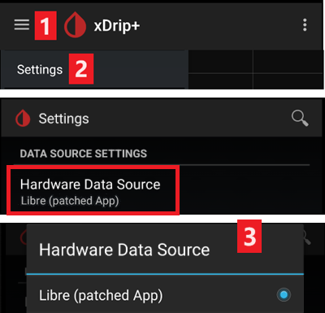

- - -
orphan: true
- - -

# Impostazioni xDrip+

Se non è già installato, scarica [xDrip+](https://jamorham.github.io/#xdrip-plus).

Disabilita l'ottimizzazione della batteria e abilita l'attività in background per l'app xDrip+.

Puoi scaricare di modo sicuro l'ultima [APK (stabile)](https://xdrip-plus-updates.appspot.com/stable/xdrip-plus-latest.apk) a meno che non hai bisogno di funzionalità recenti o se usi sensori che sono attivamente integrati (come G7), in questo caso dovresti utilizzare l'ultimo [Nightly Snapshot](https://github.com/NightscoutFoundation/xDrip/releases).

## Impostazioni di base per tutti i sistemi CGM & FGM

### Disabilita il caricamento verso Nightscout

A partire da AAPS 3.2, non dovresti permettere ad altre app di caricare i dati (glicemia e trattamenti) su Nightscout.

→ Hamburger Menu (1) → Impostazioni (2) → Caricamento nel Cloud (3) -> API Upload (REST) (4) → Metti a **OFF** `Abilitato` (5)


#### Disabilita calibrazione automatica e trattamenti

Se usi una versione precedente di AAPS (prima di 3.2), assicurati di disattivare la `calibrazione automatica` (7) Se la casella per la calibrazione `automatica` è selezionata, attiva `Accetta trattamenti` (6) una volta, quindi deseleziona `Calibrazione automatica` e disattiva di nuovo `Accetta trattamenti`.


Tocca `Altre Opzioni`(8)

```{admonition} Safety warning
:class: warning
Devi disattivare "Carica trattamenti" da xDrip+, altrimenti i trattamenti possono essere raddoppiati in AAPS portando a falsi COB e IOB. 
```

Disattiva i `Carica trattamenti`(9) e assicurati di **NON** utilizzare `Ricupera dati storici` (11).

Anche l'opzione `Allarmi in caso di errori` dovrebbe essere disattivata (10). Altrimenti riceverai un allarme ogni 5 minuti in caso di problemi di rete Wi-Fi/mobile o se il server non è disponibile.


### **Impostazioni Inter-App** (Broadcast)

Se vuoi utilizzare AAPS e i dati devono essere inoltrati ad  AAPS, è necessario attivare la trasmissione in xDrip+ nelle impostazioni Inter-App.

→ Menu (1) → Impostazioni (2) → Impostazioni Inter-app (3) → Trasmetti localmente **ON** (4)

Affinché i valori siano identici in AAPS rispetto a xDrip+, è necessario attivare `Invia glicemia visualizzata` (5).

Abilita Broadcast Compatibile (6).


Se hai anche attivato `Accetta trattamenti` in xDrip+ e `Abilita trasmissioni a xDrip+` nel plugin AAPS xDrip+, xDrip+ riceverà insulina, CHO e informazioni sulla basale da AAPS.

Se abiliti `Accetta calibrazioni`, xDrip+ userà le calibrazioni da AAPS. Fai attenzione quando usi questa funzionalità con i sensori Dexcom: leggi prima [questo](https://navid200.github.io/xDrip/docs/Calibrate-G6.html).

Ricordati di disabilitare Importa suoni per evitare che xDrip+ faccia una suoneria ogni volta che AAPS invia un cambiamento basale/profilo.


(xdrip-identify-receiver)=

#### Identifica il destinatario

* Se riscontri problemi con la trasmissione locale (AAPS che non riceve i valori di glicemia da xDrip+) vai a → Menu (1) Impostazioni (2) → Impostazioni Inter-app (3) → Identifica ricevitore (7) e inserisci`info.nightscout.androidaps` per AAPS (se stai usando la build PumpControl invece, inserisci `info.nightscout.aapspumpcontrol`).
* Attenzione: la correzione automatica a volte tende a cambiare i in maiuscolo. Devi **usare solo lettere minuscole** quando digiti `info.nightscout.androidaps` (o `info.nightscout.aapspumpcontrol` per PumpControl). Una I maiuscola impedisce a l'app di ricevere i valori di glicemia da xDrip+.

   

## Usa AAPS per calibrare in xDrip+

-   Se desideri avere la possibilità di calibrare direttamente da AAPS in xDrip+, vai nelle Impostazioni → Impostazioni Inter-app → Accetta calibrazioni e seleziona ON.
-   Puoi anche verificare le opzioni in Impostazioni → Impostazioni meno usate → Calibrazione avanzata.

## Dexcom G6

* Il trasmettitore Dexcom G6 può essere collegato contemporaneamente al ricevitore Dexcom (o in alternativa al micro t:slim) e a un’app sul telefono.
* Quando utilizzi xDrip+ collegato al sensore, disinstalla prima l'app Dexcom. **Non è possibile collegare le app xDrip+ e Dexcom al trasmettitore contemporaneamente!**
* Se hai bisogno di Clarity e vuoi approfittare delle funzionalità di xDrip+, usa [Build Your Own Dexcom App](#DexcomG6-if-using-g6-with-build-your-own-dexcom-app) con trasmissione locale a xDrip+, o usa xDrip+ come app Compagno che riceve le notifiche dall'app ufficiale Dexcom.

### Versione xDrip+ a secondo del numero di serie del trasmettitore G6.

* Tutti i trasmettitori G6 prodotti dopo l'autunno/fine 2018 sono chiamati "Firefly". Non consentono il riavvio del sensore senza [rimuovere il trasmettitore](https://navid200.github.io/xDrip/docs/Remove-transmitter.html), non inviano dati grezzi. Si consiglia di utilizzare l'ultimo [Nightly Snapshot](https://github.com/NightscoutFoundation/xDrip/releases).
* I vecchi trasmettitori rinnovati e trasmettitori modificati consentono l'estensione e il riavvio del sensore, inviano anche dati grezzi. È possibile utilizzare l'[ultima APK (stabile)](https://xdrip-plus-updates.appspot.com/stable/xdrip-plus-latest.apk).


### Impostazioni specifiche Dexcom

* Segui [queste istruzioni](https://navid200.github.io/xDrip/docs/G6-Recommended-Settings.html) per configurare xDrip+.


### Riavvio preventivo sconsigliato

**Solo trasmettitori Dexcom con batteria sostituibile o modificati. Il [riavvio preventivo](https://navid200.github.io/xDrip/docs/Preemptive-Restart.html) non funziona con trasmettitori standard e fermerà completamente il sensore: è necessario [rimuovere il trasmettitore](https://navid200.github.io/xDrip/docs/Remove-transmitter.html) per riavviare il sensore.**

L’estensione automatica dei sensori Dexcom (`riavvio preventivo`) non è raccomandata in quanto ciò potrebbe portare a “salti” nei valori di glicemia il giorno 9 dopo il riavvio.


Per utilizzarlo in modo sicuro, ci sono alcuni punti di cui essere a conoscenza:

* Se utilizzi i dati nativi con il codice di calibrazione in xDrip+ o Spike, la cosa più sicura da fare è di non consentire il riavvio preventivo del sensore.
* Se è necessario riavviare preventivamente, assicurati di effettuarlo in un momento della giornata in cui è possibile osservare il cambiamento e tarare se necessario.
* Se stai riavviando i sensori, fallo senza usare la calibrazione di fabbrica per risultati più sicuri nei giorni 11 e 12, o assicurati di essere pronto a calibrare e tieni d'occhio le variazioni.
* È probabile che l'inserimento anticipato dei sensori G6/ONE crei variazioni nei risultati. Quando inserisci il sensore in anticipo, è meglio calibrarlo per ottenere risultati migliori.
* Se non sei pronto ad osservare tutte le circostanze in cui il G6 potrebbe fornire informazioni sbagliate, sarebbe meglio non usare la calibrazione di fabbrica e quindi utilizzare il sistema come se fosse un G5.

Per saperne di più sui dettagli e i motivi di questi consigli,leggi [l'articolo completo](https://www.diabettech.com/artificial-pancreas/diy-looping-and-cgm/) pubblicato da Tim Street in [www.diabettech.com](https://www.diabettech.com).

(xdrip-connect-g6-transmitter-for-the-first-time)=

### Collegare il trasmettitore G6 per la prima volta

**Per i trasmettitori successivi, vedi [Estendere la vita del trasmettitore](#xdrip-extend-transmitter-life) sotto.**

Segui [queste istruzioni](https://navid200.github.io/xDrip/docs/Starting-G6.html).

(xdrip-transmitter-battery-status)=

### Stato della batteria del trasmettitore

* Lo stato della batteria può essere controllato nello stato del sistema  
  → Menu (1) → Stato del sistema (2) → Se sei nella pagina Classic Status Page (3) scorri lo schermo (4) per raggiungere → Dex Status.


* Vedi [qui](https://navid200.github.io/xDrip/docs/Battery-condition.html) per maggiori informazioni.


(xdrip-extend-transmitter-life)=

### Estendere la vita del trasmettitore

* [Il tempo di vita](https://navid200.github.io/xDrip/docs/Transmitter-lifetime.html) non può essere esteso per i trasmettitori Firefly: solo trasmettitori con batteria sostituibile o modificati.
* Segui [queste istruzioni](https://navid200.github.io/xDrip/docs/Hard-Reset.html) per i trasmettitori non-Firefly.

(xdrip-replace-transmitter)=

### Sostituire il trasmettitore

* Spegni il ricevitore Dexcom originale (se lo stai utilizzando).
* [Stop sensore](https://navid200.github.io/xDrip/docs/Dexcom/StartG6Sensor.html) (solo se vuoi sostituire il sensore).


* Dimentica questo dispositivo nello Stato del sistema di xDrip+ E ANCHE nelle impostazioni Bluetooth dello smartphone (Sarà visualizzato come Dexcom?? dove ?? are the last two digits of the transmitter serial no.)  
  → Hamburger Menu (1) → System Status (2) → If you are on the Classic Status Page (3) swipe the screen (4) to reach → G5/G6/G7 Status screen → Forget Device (5).


* Remove transmitter (and sensor if replacing sensor). To remove transmitter without removing sensor see [this](https://navid200.github.io/xDrip/docs/Remove-transmitter.html), or this video [https://youtu.be/AAhBVsc6NZo](https://youtu.be/AAhBVsc6NZo).
* Put the old transmitter far away to prevent reconnection. A microwave is a perfect Faraday shield for this - but unplug power cord to be 100% sure no one is turning the microwave on.
* Follow [these instructions](https://navid200.github.io/xDrip/docs/Starting-G6.html).
* Do not turn original Dexcom receiver (if used) back on before xDrip+ shows first readings.


### New Sensor

* Turn original Dexcom receiver off (if used).
* Stop sensor following [these instructions](https://navid200.github.io/xDrip/docs/Dexcom/StartG6Sensor.html).

* Insert and then start a new sensor following [these instructions](https://navid200.github.io/xDrip/docs/Starting-G6.html).


(xdrip-retrieve-sensor-code)=

### Retrieve sensor code

→ Hamburger Menu (1) → System Status (2) → If you are on the Classic Status Page (3) swipe the screen (4) to reach → G5/G6/G7 Status screen → Calibration Code.


(xdrip-troubleshooting-dexcom-g5-g6-and-xdrip)=

### Troubleshooting Dexcom G5/G6 and xDrip+

#### Problem connecting transmitter

Follow [these instructions](https://navid200.github.io/xDrip/docs/Connectivity-troubleshoot.html).

#### Problem when starting new sensor

Follow [these instructions](https://navid200.github.io/xDrip/docs/Dexcom/SensorFailedStart.html).

## Libre 1

* Setup your NFC to Bluetooth bridge in xDrip+

  → Hamburger Menu (1) → Settings (2) → Less common settings (3) → Bluetooth Settings (4)

* In Bluetooth Settings set the checkboxes exactly as in the screenshots below (5)

  - Disable watchdogs as they will reset the phone Bluetooth and interrupt your pump connection.

  

* You can try to enable the following settings (7)

  - Use scanning
  - Trust Auto-Connect
  - Use Background Scans

* If you easily lose connection to the bridge or have difficulties recovering connection, **DISABLE THEM** (8).

  

- Leave all other options disabled unless you know why you want to enable them.

  

### Libre smart reader battery level

* Battery level of bridges such as MiaoMiao and Bubble can be displayed in AAPS (not Blucon).
* Details can be found on [screenshots page](#screens-sensor-level-battery).

### Connect Libre Transmitter & start sensor

- If your sensor requires it (Libre 2 EU and Libre 1 US) install the [latest out of process algorithm](https://drive.google.com/file/d/1f1VHW2I8w7Xe3kSQqdaY3kihPLs47ILS/view).

- Your sensor must be already started using the vendor app or the reader (xDrip+ cannot start or stop Libre sensors).

- Set the data source to Libre Bluetooth.

  → Hamburger Menu (1) → Settings (2) → Select Libre Bluetooth in Hardware Data source (3)

  

- Scan Bluetooth and connect the bridge.

  → Hamburger Menu (1) → Scan Bluetooth (2) → Scan (3)

  - If xDrip+ can't find the bridge, make sure it's not connected to the vendor app. Put it in charge and reset it.

  

- Start the sensor in xDrip+.

  ```{admonition} Safety warning
  :class: warning
  Do not use sensor data before the one hour warm-up is over: the values can be extremely high and cause wrong decisions in AAPS.  
  ```

  → Hamburger Menu (1) → Start sensor (2) → Start sensor (3) → Set the exact time you started it with the reader or the vendor app. If you didn't start it today, answer "Not Today" (4).


(xdrip-libre2-patched-app)=
## Libre 2 patched app

* Set the data source to Libre patched app.

  → Hamburger Menu (1) → Settings (2) → Select Libre (patched App) in Hardware Data source (3)

  

-   You can add `BgReading:d,xdrip libre_receiver:v` under Less Common Settings->Extra Logging Settings->Extra tags for logging. This will log additional error messages for trouble shooting.


