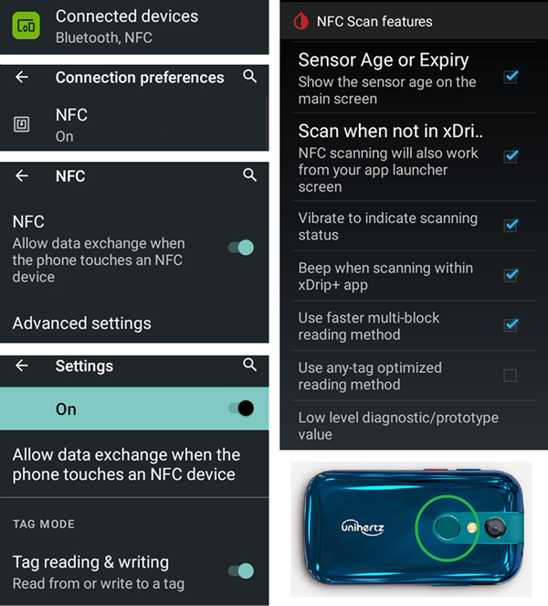
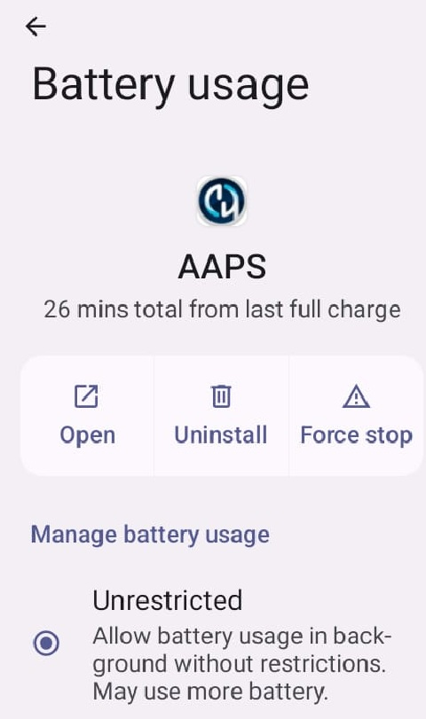
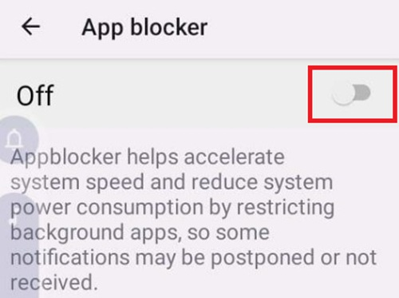

# Jelly

## Jelly 2

Do not confuse with Jelly Star (below).

**Vantaggi**

* È davvero piccolo.
* Android 11.
* Anche se lo dici alla gente, potrebbero non considerarlo come uno telefonino normale e sarà più facile chiedere un'eccezione dove i telefoni non sono normalmente ammessi.

**Svantaggi**

* Consigliato solo per utenti esperti (alcune impostazioni non sono riconoscibili, devi sapere dall'esperienza con un telefono Android AAPS normale, come e dove si trovano. Alcuni pulsanti AAPS sono difficili da centrare senza concentrazione, non per dita spesse.)
* Può essere usato solo come telefonino per il circuito chiuso. È meglio avere uno smartphone normale in tasca.

### Ottimizzazione della durata della batteria

Jelly 2 è dotato di funzionalità di ottimizzazione aggressive che **devono** essere disabilitate per AAPS (e altre applicazioni fai da te come BYODA, xDrip+, OOP2, Juggluco, ecc...).

Puoi lasciare l'assistenza intelligente attiva, ma **deve essere disabilitata per le app DIY**.

Puoi abilitare NFC per i sensori Libre.

## Jelly Star Mini

**Features**

* Android 13
* 8 GB RAM

### Battery life optimization

To avoid interference with **AAPS**, the Jelly Star 'battery usage' should be disabled by selecting 'unrestricted' (and other **DIY apps** like BYODA, xDrip+, OOP2, Juggluco, etc...).

### Intelligent Assistance and App Blocker

Like with the Jelly 2 (above), the Jelly Star should have 'Intelligent Assistance' disabled for **DIY apps**. Similarly, 'App Blocker' under 'Settings' must also be switched off to avoid disruption with **AAPS**:

### Google Play Protect

Remember to disable Google Play Protect.

