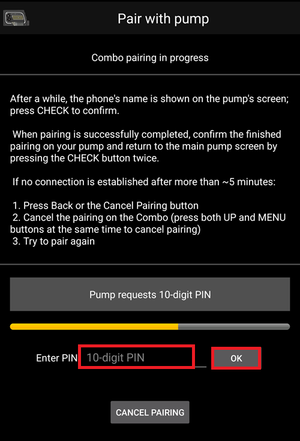
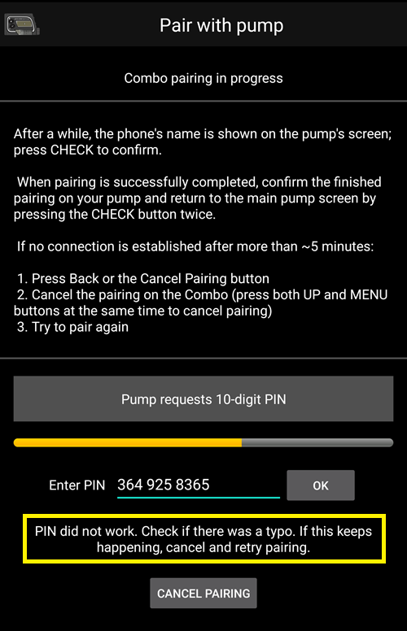
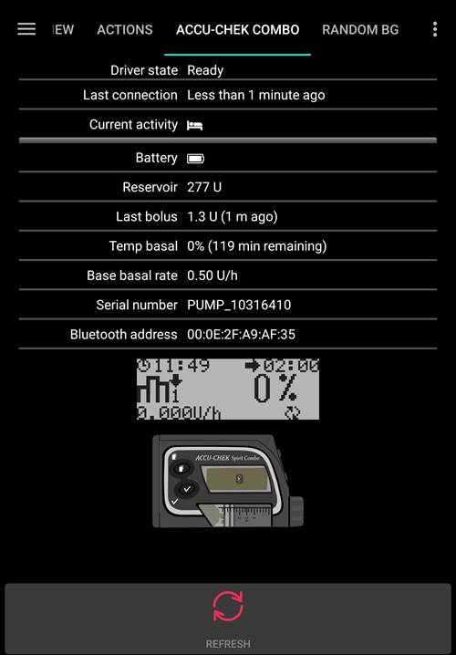

# Accu Chek Combo

**Questo software è parte di una soluzione fai-da-te e non è un prodotto finito, ma richiede che sia TU a leggere, imparare e comprendere il sistema, incluso come utilizzarlo. Non è qualcosa che gestisce tutta la tua terapia del diabete al posto tuo, ma ti permette di migliorare il tuo diabete e la tua qualità di vita se sei disposto a dedicarvi il tempo necessario. Non affrettarti, ma concediti il tempo di imparare. Sei tu solo il responsabile di ciò che ne fai.**

## Requisiti hardware e software

* Un Roche Accu-Chek Combo (qualsiasi firmware, tutti funzionano).
* Un dispositivo Smartpix o Realtyme insieme al Software di Configurazione 360 per configurare il microinfusore. (Roche invia i dispositivi Smartpix e il software di configurazione gratuitamente ai propri clienti su richiesta.)
* Un telefono compatibile. Android 9 (Pie) o versioni successive è obbligatorio. Se si utilizza LineageOS, la versione minima supportata è 16.1. Vedere le [note di rilascio](#maintenance-android-version-aaps-version) per i dettagli.
* L'app AndroidAPS installata sul telefono.

Alcuni telefoni potrebbero funzionare meglio di altri, a seconda della qualità del supporto Bluetooth e del fatto che abbiano o meno una logica di risparmio energetico particolarmente aggressiva. Un elenco di telefoni è disponibile nel documento [Telefoni AAPS](#Phones-list-of-tested-phones). Tieni presente che non si tratta di un elenco completo e riflette l'esperienza personale degli utenti. Sei incoraggiato a inserire anche la tua esperienza e in questo modo aiutare gli altri (questi progetti si basano sul dare e ricevere aiuto).

(combov2-before-you-begin)=
## Prima di iniziare

**LA SICUREZZA PRIMA DI TUTTO** - non tentare questo processo in un ambiente in cui non è possibile recuperare da un errore. Tieni a portata di mano il dispositivo Smartpix / Realtyme insieme al Software di Configurazione 360. Prevedi di dedicare circa un'ora per configurare tutto e verificare che funzioni correttamente.

Tieni presente le seguenti limitazioni:

* Il bolo esteso e il bolo multionda non sono attualmente supportati (è possibile usare i [Carboidrati estesi](../DailyLifeWithAaps/ExtendedCarbs.md) in alternativa).
* È supportato un solo profilo basale (il primo).
* Il loop viene disabilitato se il profilo attualmente attivo sul microinfusore non è il profilo n. 1. Questa situazione continua finché il profilo n. 1 non viene reso attivo; quando ciò accade, la volta successiva che AAPS si connette (da solo dopo un po' o perché l'utente preme il pulsante Aggiorna nell'interfaccia combov2), rileverà che il profilo n. 1 è quello corrente e abiliterà nuovamente il loop.
* Se il loop richiede l'annullamento di una TBR in corso, il Combo imposterà invece una TBR al 90% o al 110% per 15 minuti. Questo perché l'annullamento effettivo di una TBR causa un avviso sul microinfusore che produce molte vibrazioni, e queste non possono essere disabilitate.
* La stabilità della connessione Bluetooth varia con i diversi telefoni, causando avvisi "microinfusore non raggiungibile" in cui non viene più stabilita nessuna connessione con il microinfusore. Se si verifica tale errore, assicurarsi che il Bluetooth sia abilitato, premere il pulsante Aggiorna nella scheda Combo per vedere se l'errore era intermittente e, se la connessione non viene ancora stabilita, riavviare il telefono, il che di solito risolve il problema.
* Esiste un altro problema in cui un riavvio non è sufficiente, ma è necessario premere un pulsante sul microinfusore (che ripristina lo stack Bluetooth del microinfusore) prima che il microinfusore accetti di nuovo connessioni dal telefono.
* È preferibile non impostare una TBR direttamente sul microinfusore poiché il loop assume il controllo delle TBR. Il rilevamento di una nuova TBR sul microinfusore può richiedere fino a 20 minuti e l'effetto della TBR verrà considerato solo dal momento in cui viene rilevata, quindi nel caso peggiore ci potrebbero essere 20 minuti di TBR non riflessa nell'IOB.

Se hai utilizzato il vecchio driver Combo che dipende dall'app Ruffy separata e vuoi passare a questo nuovo, tieni presente che l'associazione deve essere rifatta - Ruffy e il nuovo driver Combo non sono in grado di condividere le informazioni di associazione. Inoltre, assicurati che Ruffy _non_ sia in esecuzione. In caso di dubbio, tieni premuta l'icona dell'app Ruffy per visualizzare un menu contestuale. In quel menu, premi su "Informazioni app". Nell'interfaccia che si apre, premi "Forza arresto". In questo modo si garantisce che un'istanza attiva di Ruffy non possa interferire con il nuovo driver.

Inoltre, se stai migrando dal vecchio driver, tieni presente che il nuovo driver comunica un comando bolo in modo completamente diverso al Combo ed è molto più veloce, quindi non sorprenderti se un bolo inizia immediatamente indipendentemente dal dosaggio. Inoltre, i suggerimenti generali, trucchi ecc. relativi alla gestione dei problemi di associazione e connessione con Ruffy non si applicano qui, poiché questo è un driver completamente nuovo che non condivide codice con quello vecchio.

Questo nuovo driver è attualmente scritto per supportare le seguenti lingue sul Combo. (Questo non è correlato alla lingua in AAPS - è la lingua mostrata sull'LCD del Combo stesso.)

* Inglese
* Spagnolo
* Francese
* Italiano
* Russo
* Turco
* Polacco
* Ceco
* Ungherese
* Slovacco
* Rumeno
* Croato
* Olandese
* Greco
* Finlandese
* Norvegese
* Portoghese
* Svedese
* Danese
* Tedesco
* Sloveno
* Lituano

**Importante**: Se il microinfusore è impostato in una lingua non inclusa in questo elenco, contattare gli sviluppatori e impostare la lingua del microinfusore su una di quelle presenti nell'elenco. Altrimenti, il driver non funzionerà correttamente.

## Configurazione del telefono

È molto importante assicurarsi che le ottimizzazioni della batteria siano disattivate. AAPS rileva già automaticamente quando è soggetto a queste ottimizzazioni e richiede nell'interfaccia che vengano disattivate. Ma sui moderni telefoni Android, il Bluetooth _stesso_ è un'app (un'app di sistema). E, di solito, quella "app Bluetooth" viene eseguita _con le ottimizzazioni della batteria attive per impostazione predefinita_. Di conseguenza, il Bluetooth può rifiutarsi di rispondere quando il telefono cerca di risparmiare energia perché termina il processo dell'app Bluetooth. Ciò significa che nelle impostazioni dell'app di sistema Bluetooth, le ottimizzazioni della batteria devono essere disattivate. Sfortunatamente, il modo per trovare quell'app di sistema Bluetooth varia tra i telefoni. In Android standard, vai in Impostazioni -> App -> Visualizza tutte le N app (N = numero di app sul telefono). Poi apri il menu in alto a destra e tocca "Mostra sistema" o "Mostra app di sistema" o "Tutte le app". Ora, nell'elenco di app ampliato, cerca un'app "Bluetooth". Selezionala e nell'interfaccia "Informazioni app", tocca "Batteria". Lì, disabilita le ottimizzazioni della batteria (a volte chiamate "utilizzo batteria").

## Configurazione del Combo

* Configura il microinfusore usando il Software di Configurazione Accu-Chek 360. Se non hai il software, contatta il numero verde Accu-Chek. Di solito inviano agli utenti registrati un CD con il "Software di Configurazione 360° Microinfusore" e un dispositivo di connessione USB infrarossi SmartPix (il dispositivo Realtyme funziona anch'esso se lo hai).

  - **Impostazioni obbligatorie** (evidenziate in verde negli screenshot):

     * Impostare/lasciare la configurazione del menu come "Standard", in modo che vengano mostrati solo i menu/azioni supportati sul microinfusore e nascosti quelli non supportati (bolo esteso/multionda, velocità basali multiple), che causano limitazioni alle funzionalità del loop quando vengono usati perché non è possibile eseguire il loop in modo sicuro.
     * Verificare che il _Testo Info Rapida_ sia impostato su "QUICK INFO" (senza virgolette, si trova in _Opzioni Microinfusore di Insulina_).
     * Impostare la _Regolazione Massima_ TBR al 500%
     * Disabilitare _Segnale Fine Basale Temporanea_
     * Impostare l'_Incremento Durata_ TBR a 15 min
     * Abilitare Bluetooth

  - **Impostazioni consigliate** (evidenziate in blu negli screenshot)

     * Impostare l'allarme cartuccia quasi vuota secondo le proprie preferenze
     * Configurare un bolo massimo adeguato alla propria terapia per proteggersi da eventuali bug del software
     * Analogamente, configurare la durata massima TBR come misura di sicurezza. Consentire almeno 3 ore, poiché l'opzione di disconnettere il microinfusore per 3 ore imposta uno 0% per 3 ore.
     * Abilita il blocco dei tasti sul microinfusore per evitare che si possa effettuare un bolo dal micro, in particolare se usavi abitualmente la modalità bolo veloce.
     * Impostare il timeout del display e il timeout del menu al minimo, rispettivamente 5,5 e 5. Ciò consente ad AAPS di recuperare più rapidamente dalle situazioni di errore e riduce la quantità di vibrazioni che possono verificarsi durante tali errori.

  

  

  

  

## Attivazione del driver e associazione con il Combo

* Selezionare il driver "Accu-Chek Combo" in [Costruttore di configurazione > Microinfusore](../SettingUpAaps/ConfigBuilder.md). **Importante**: In quell'elenco è presente anche il vecchio driver, chiamato "Accu-Chek Combo (Ruffy)". _Non_ selezionare quello.

  

* Toccare l'ingranaggio per aprire le impostazioni del driver.

* Nell'interfaccia delle impostazioni, toccare il pulsante 'Associa con microinfusore' nella parte superiore dello schermo. Si apre l'interfaccia di associazione Combo. Seguire le istruzioni mostrate sullo schermo per avviare l'associazione. Quando Android chiede il permesso di rendere il telefono visibile ad altri dispositivi Bluetooth, premere "consenti". Alla fine, il Combo mostrerà sul suo schermo un PIN di associazione personalizzato a 10 cifre, e il driver lo richiederà. Inserire quel PIN nel campo corrispondente.

  

  

  

  

  

* Quando il driver chiede il PIN a 10 cifre mostrato sul Combo e il codice viene inserito in modo errato, viene visualizzato questo: 

* Una volta completata l'associazione, l'interfaccia di associazione viene chiusa premendo il pulsante OK nella schermata che indica il successo dell'associazione. Dopo la chiusura, si torna all'interfaccia delle impostazioni del driver. Il pulsante 'Associa con microinfusore' dovrebbe ora essere disabilitato e in grigio.

  La scheda Accu-Chek Combo ha questo aspetto dopo un'associazione riuscita:

  

  Se invece non c'è associazione con il Combo, la scheda ha invece questo aspetto:

  

* Per verificare la configurazione (con il microinfusore **disconnesso** da qualsiasi cannula per sicurezza!) usa AAPS per impostare una TBR al 500% per 15 min ed erogare un bolo. Il micro dovrebbe ora avere un TBR in esecuzione e il bolo nella storia. Anche AAPS dovrebbe mostrare la TBR attiva e il bolo erogato.

* Sul Combo, si consiglia di abilitare il blocco tasti per evitare boli accidentali dal microinfusore, specialmente se il microinfusore è stato usato in precedenza e l'uso della funzione "bolo rapido" era un'abitudine.

## Note sull'associazione

L'Accu-Chek Combo è stato sviluppato prima del rilascio di Bluetooth 4.0, e solo un anno dopo il rilascio della primissima versione Android. Questo è il motivo per cui il suo modo di associarsi con altri dispositivi non è compatibile al 100% con come avviene in Android oggi. Per superare completamente questo problema, AAPS avrebbe bisogno di permessi a livello di sistema, disponibili solo per le app di sistema, che vengono installate dai produttori nel telefono e non possono essere installate dagli utenti. Queste sono installate dai produttori di telefono nel telefono - gli utenti non possono installare applicazioni di sistema.

La conseguenza è che l'associazione non sarà mai senza problemi al 100%, anche se è notevolmente migliorata in questo nuovo driver. In particolare, durante l'associazione, il dialogo PIN Bluetooth di Android può apparire brevemente e scomparire automaticamente. Ma a volte rimane sullo schermo e chiede un PIN a 4 cifre. (Da non confondere con il PIN di associazione Combo a 10 cifre.) Non inserire nulla, premi semplicemente annulla. Se l'associazione non continua, seguire le istruzioni sullo schermo per riprovare l'associazione.

(combov2-tab-contents)=
## Contenuto della scheda Accu-Chek Combo

La scheda mostra le seguenti informazioni quando un microinfusore è associato (gli elementi sono elencati dall'alto verso il basso):

1. _Stato driver_: Il driver può trovarsi in uno dei seguenti stati:
   - "Disconnesso": Non c'è connessione Bluetooth; il driver si trova in questo stato per la maggior parte del tempo e si connette al microinfusore solo quando necessario - risparmia energia
   - "Connessione in corso"
   - "Controllo microinfusore": il microinfusore è connesso, ma il driver sta eseguendo controlli di sicurezza per assicurarsi che tutto sia OK e aggiornato
   - "Pronto": il driver è pronto ad accettare comandi da AAPS
   - "Sospeso": il microinfusore è sospeso (mostrato come "fermato" nel Combo)
   - "Esecuzione comando": un comando AAPS è in esecuzione
   - "Errore": si è verificato un errore; la connessione è stata interrotta, qualsiasi comando in corso è stato annullato
2. _Ultima connessione_: Quanti minuti fa il driver si è connesso correttamente al Combo; se supera i 30 minuti, questo elemento viene mostrato in rosso
3. _Attività corrente_: Dettaglio aggiuntivo su cosa sta facendo attualmente il microinfusore; qui può anche apparire una barra di avanzamento che mostra il progresso dell'esecuzione di un comando, come l'impostazione di un profilo basale
4. _Batteria_: Livello batteria; il Combo indica solo "piena", "scarica", "esaurita" e non offre nulla di più preciso (come una percentuale), quindi vengono mostrati solo questi tre livelli
5. _Serbatoio_: Quante UI sono attualmente nel serbatoio del Combo
6. _Ultimo bolo_: Quanti minuti fa è stato erogato l'ultimo bolo; se nessuno è stato erogato dopo l'avvio di AAPS, questo è vuoto
7. _Basale temporanea_: Dettagli sulla basale temporanea attualmente attiva; se nessuna è attualmente attiva, questo è vuoto
8. _Velocità basale di base_: Velocità basale di base attualmente attiva ("base" significa la velocità basale senza alcuna TBR attiva che influenzi il fattore di velocità basale)
9. _Numero di serie_: Numero di serie del Combo come indicato dal microinfusore (corrisponde al numero di serie mostrato sul retro del Combo)
10. _Indirizzo Bluetooth_: L'indirizzo Bluetooth a 6 byte del Combo, mostrato nel formato `XX:XX:XX:XX:XX:XX`

Il Combo può essere operato tramite Bluetooth in modalità _terminale remoto_ o in modalità _comando_. La modalità terminale remoto corrisponde alla "modalità telecomando" sul glucometro del Combo, che simula l'LCD e i quattro pulsanti del microinfusore. Alcuni comandi devono essere eseguiti in questa modalità dal driver, poiché non hanno equivalenti nella modalità comando. Quest'ultima modalità è molto più veloce, ma, come detto, limitata nell'ambito. Quando la modalità terminale remoto è attiva, la schermata del terminale remoto corrente viene mostrata nel campo situato sopra il disegno del Combo in basso. Quando il driver passa alla modalità comando, quel campo viene lasciato vuoto.

(L'utente non influenza questo; il driver decide autonomamente quale modalità usare. Questa è semplicemente una nota per gli utenti per spiegare perché a volte possono vedere schermate Combo in quel campo.)

In fondo, c'è il pulsante "Aggiorna". Questo attiva un aggiornamento immediato dello stato del microinfusore. Viene usato anche per comunicare ad AAPS che un errore precedentemente rilevato è ora risolto e che AAPS può verificare di nuovo che tutto sia OK (maggiori dettagli nella [sezione sugli avvisi](#combov2-alerts)).

## Preferenze

Queste preferenze sono disponibili per il driver combo (gli elementi sono elencati dall'alto verso il basso):

1. _Associa con microinfusore_: Questo è un pulsante che può essere premuto per associare un Combo. È disabilitato se un microinfusore è già associato.
2. _Disassocia microinfusore_: Disassocia un Combo associato; il contrario esatto dell'elemento n. 1. È disabilitato se nessun microinfusore è associato.
3. _Durata discovery (in secondi)_: Durante l'associazione, il driver rende il telefono rilevabile dal microinfusore. Questo controlla per quanto tempo dura quella rilevabilità. Per impostazione predefinita, viene selezionato il massimo (300 secondi = 5 minuti). Android non consente che la rilevabilità duri indefinitamente, quindi è necessario scegliere una durata.
4. _Rileva automaticamente e registra il cambio serbatoio insulina_: Se abilitata, l'azione "cambio serbatoio" normalmente eseguita dall'utente tramite il pulsante "riempimento/innesco" nella scheda Azioni. Questo è spiegato [in maggiore dettaglio di seguito](#combov2-autodetections).
5. _Rileva automaticamente e registra il cambio batteria_: Se abilitata, l'azione "cambio batteria" normalmente eseguita dall'utente tramite il pulsante "cambio batteria microinfusore" nella scheda Azioni. Questo è spiegato [in maggiore dettaglio di seguito](#combov2-autodetections).
6. _Abilita logging dettagliato Combo_: Questo aumenta notevolmente la quantità di log prodotti dal driver. **ATTENZIONE**: Non abilitarlo a meno che non venga richiesto da uno sviluppatore. Altrimenti, può aggiungere molto rumore ai log di AndroidAPS e ridurne l'utilità.

La maggior parte degli utenti usa solo i primi due elementi, i pulsanti _Associa con microinfusore_ e _Disassocia microinfusore_.

(combov2-autodetections)=
## Rilevamento automatico e registrazione dei cambi di batteria e serbatoio

Il driver è in grado di rilevare i cambi di batteria e serbatoio tenendo traccia dei livelli di batteria e serbatoio. Se il livello della batteria è stato riportato dal Combo come scarico l'ultima volta che lo stato del microinfusore è stato aggiornato, e ora, durante il nuovo aggiornamento dello stato del microinfusore, il livello della batteria risulta normale, il driver conclude che l'utente deve aver sostituito la batteria. La stessa logica viene usata per il livello del serbatoio: se ora è più alto di prima, viene interpretato come un cambio serbatoio.

Questo funziona solo se la batteria e il serbatoio vengono sostituiti quando questi livelli vengono riportati come bassi _e_ la batteria e il serbatoio vengono sufficientemente riempiti.

Questi rilevamenti automatici possono essere disattivati nell'interfaccia delle Preferenze.

(combov2-alerts)=
## Avvisi (avvertenze ed errori) e come vengono gestiti

Il Combo mostra gli avvisi come schermate di terminale remoto. Le avvertenze vengono mostrate con un codice "Wx" (x è una cifra), insieme a una breve descrizione. Un esempio è "W7", "TBR OVER". Gli errori sono simili, ma vengono mostrati con un codice "Ex".

Certe avvertenze vengono automaticamente respinte dal driver. Queste sono:

- W1 "serbatoio basso": il driver la converte in un avviso "serbatoio basso" mostrato nella scheda principale di AAPS
- W2 "batteria scarica": il driver la converte in un avviso "batteria scarica" mostrato nella scheda principale di AAPS
- W3, W6, W7, W8: queste sono tutte puramente informative per l'utente, quindi è sicuro per il driver respingerle automaticamente

Altre avvertenze _non_ vengono respinte automaticamente. Inoltre, gli errori _non_ vengono mai respinti automaticamente. Entrambi vengono gestiti allo stesso modo: causano la visualizzazione da parte del driver di un dialogo di avviso nell'interfaccia AAPS e causano anche l'interruzione di qualsiasi esecuzione di comando in corso. Il driver passa quindi allo stato "errore" (vedere [la descrizione del contenuto della scheda Accu-Chek Combo sopra](#combov2-tab-contents)). Questo stato non consente l'esecuzione di alcun comando. L'utente deve gestire l'errore sul microinfusore; ad esempio, un errore di occlusione potrebbe richiedere la sostituzione della cannula. Una volta che l'utente si è occupato dell'errore, il normale funzionamento può essere ripreso premendo il pulsante "Aggiorna" sulla scheda Accu-Chek Combo. Il driver si connette quindi al Combo e aggiorna il suo stato, verificando se un errore è ancora mostrato sullo schermo ecc. Inoltre, il driver aggiorna automaticamente lo stato del microinfusore dopo un po', quindi premere manualmente quel pulsante non è obbligatorio. Inoltre, il driver aggiorna automaticamente lo stato del microinfusore dopo un po ', quindi premere manualmente quel pulsante non è obbligatorio.

L'erogazione del bolo è un caso speciale. Viene effettuata nella modalità comando del Combo, che non segnala durante un bolo che è comparso un avviso. Di conseguenza, il driver non può respingere automaticamente le avvertenze _durante_ un bolo. Ciò significa che purtroppo il microinfusore continuerà a emettere un segnale acustico fino al termine del bolo. L'avviso di bolo più comune è di solito W1 "serbatoio basso". **Non** respingere manualmente le avvertenze Combo sul microinfusore stesso durante un bolo. Si rischia di interrompere il bolo. Il driver si occuperà dell'avviso una volta terminato il bolo.

Gli avvisi che si verificano mentre il driver non è connesso al Combo non verranno notati dal driver. Il Combo non ha modo di inviare automaticamente quell'avviso al telefono; è sempre il telefono che deve avviare la connessione. Di conseguenza, l'avviso persisterà finché il driver non si connetterà al microinfusore. Gli utenti possono premere il pulsante "Aggiorna" per attivare una connessione e consentire al driver di gestire l'avviso subito (invece di aspettare che AAPS decida autonomamente di avviare una connessione).

**IMPORTANTE**: Se si verifica un errore o compare un'avvertenza che non è tra quelle respinte automaticamente, il driver entra nello stato di errore. In quello stato, il loop **SARÀ BLOCCATO** finché lo stato del microinfusore non viene aggiornato! Viene sbloccato dopo che lo stato del microinfusore viene aggiornato (sia premendo manualmente "Aggiorna" sia tramite l'auto-aggiornamento automatico del driver) e nessun errore viene più mostrato.

## Cose a cui prestare attenzione quando si usa il Combo

* Tieni presente che questo non è un prodotto, specialmente all'inizio l'utente deve monitorare e comprendere il sistema, le sue limitazioni e come può fallire. È fortemente consigliato NON utilizzare questo sistema quando la persona che lo usa non è in grado di comprenderlo completamente.
* A causa del modo in cui funziona la funzionalità di telecomando del Combo, alcune operazioni (in particolare l'impostazione di un profilo basale) sono lente rispetto ad altri microinfusori. Questa è una limitazione del Combo che non può essere superata.
* Non impostare o annullare una TBR sul microinfusore. Il loop assume il controllo delle TBR e non può funzionare in modo affidabile altrimenti, poiché non è possibile determinare l'ora di inizio di una TBR impostata dall'utente sul microinfusore.
* Non premere nessun pulsante sul microinfusore mentre AAPS comunica con il microinfusore (il logo Bluetooth viene mostrato sul microinfusore mentre è connesso ad AAPS). In questo modo si interromperebbe la connessione Bluetooth. Farlo solo se ci sono problemi nello stabilire una connessione (vedere [la sezione "Prima di iniziare" sopra](#combov2-before-you-begin)).
* Non premere nessun pulsante mentre il microinfusore sta erogando un bolo. In particolare, non cercare di respingere gli avvisi premendo i pulsanti. Vedere [la sezione sugli avvisi](#combov2-alerts) per una spiegazione più dettagliata.

## Lista di controllo per quando non è possibile stabilire una connessione con il Combo

Il driver fa del suo meglio per connettersi al Combo e usa alcuni trucchi per massimizzare l'affidabilità. A volte però le connessioni non vengono stabilite. Ecco alcuni passaggi da seguire per cercare di rimediare a questa situazione.

1. Premere un pulsante sul Combo. A volte, lo stack Bluetooth del Combo diventa non responsivo e non accetta più connessioni. Premendo un pulsante sul Combo e facendo mostrare qualcosa all'LCD, lo stack Bluetooth viene ripristinato. La maggior parte delle volte, questo è l'unico passaggio necessario per risolvere i problemi di connessione.
2. Riavviare il telefono. Potrebbe essere necessario se c'è un problema con lo stack Bluetooth del telefono stesso.
3. Se il cappuccio della batteria del Combo è vecchio, considerare di sostituirlo. I cappucci vecchi possono causare problemi con l'alimentazione del Combo, che influiscono sul Bluetooth.
4. Se i tentativi di connessione continuano a fallire, considerare di disassociare e poi riassociare il microinfusore.
