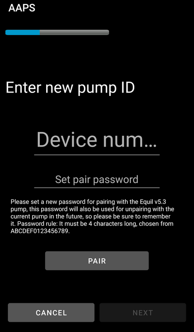

# Equil

Queste istruzioni riguardano la configurazione del microinfusore Equil.

## Funzionalità del microinfusore con AAPS

§todo

## Requisiti Hardware e Software
* **Hardware Equil compatibile**

  Attualmente sono supportati Equil 5.3 e 5.4

* [Versione 3.3.0.0](#version3300) o più recente di AAPS

### Seleziona il micro Equil

In [Costruttore di configurazione > Microinfusore](#Config-Builder-pump), passare a **Equil 5.3**.

### Impostazioni

### Attivare il patch

Navigare alla scheda Equil e premere **Associa Equil Patch Pump**.

Se si imposta una password diversa da quella predefinita 0000 (consigliato per la propria sicurezza), non dimenticare di conservare questa password in un posto sicuro. Questa password viene memorizzata nel microinfusore. La password viene richiesta a ogni successivo tentativo di associazione finché non si esegue una corretta dissociazione in AAPS. Questo rende il microinfusore inutilizzabile anche con il PDA originale finché non viene dissociato da AAPS.
