# Medtrum Nano / 300U

Queste istruzioni riguardano la configurazione del microinfusore di insulina Medtrum.

Questo software è parte di una soluzione fai-da-te per pancreas artificiale e non è un prodotto finito, ma richiede che sia TU a leggere, imparare e comprendere il sistema, incluso come utilizzarlo. Sei tu solo il responsabile di ciò che ne fai.

```{contents} Table of contents
:depth: 1
:local: true
```

## Funzionalità del microinfusore con AAPS
* Tutte le funzionalità del loop supportate (SMB, TBR ecc.)
* Gestione automatica dell'ora legale e del fuso orario
* Il bolo esteso non è supportato dal driver AAPS

## Requisiti hardware e software
* **Base microinfusore e patch serbatoio Medtrum compatibili**
    - Attualmente supportati:
        - Medtrum TouchCare Nano con base microinfusore riferimenti: **MD0201** e **MD8201**.
        - Medtrum TouchCare 300U con base microinfusore riferimento: **MD8301**.
        - Se hai un modello non supportato e sei disposto a donare hardware o ad aiutare con i test, contattaci tramite discord [qui](https://discordapp.com/channels/629952586895851530/1076120802476441641).
* **Versione 3.2.0.0 o successiva di AAPS compilata e installata** seguendo le istruzioni [Compilazione APK](../SettingUpAaps/BuildingAaps.md).
* **Smartphone Android compatibile** con connessione Bluetooth BLE
    - Vedere le [Note di rilascio](../Maintenance/ReleaseNotes.md) di AAPS
* [**Monitor continuo del glucosio (CGM)**](../Getting-Started/CompatiblesCgms.md)

## Prima di iniziare

**LA SICUREZZA PRIMA DI TUTTO** Non tentare questo processo in un ambiente in cui non è possibile recuperare da un errore (patch aggiuntive, insulina e dispositivi di controllo del microinfusore sono indispensabili).

**Il PDM e l'app Medtrum non funzioneranno con una patch attivata da AAPS.** In precedenza potresti aver usato il PDM o l'app Medtrum per inviare comandi al microinfusore. Per ragioni di sicurezza è possibile utilizzare la patch attivata solo con il dispositivo o l'app che è stato usato per attivarla.

*Questo NON significa che devi buttare via il tuo PDM. Si consiglia di tenerlo in un posto sicuro come backup in caso di emergenze, ad esempio se il telefono viene perso o AAPS non funziona correttamente.*

**Il microinfusore non smetterà di erogare insulina quando non è connesso ad AAPS** Le velocità basali predefinite sono programmate sul microinfusore come definite nel profilo attivo corrente. Finché AAPS è operativo, invierà comandi di basale temporanea che durano al massimo 120 minuti. Se per qualche motivo il microinfusore non riceve nuovi comandi (ad esempio perché la comunicazione è stata persa a causa della distanza microinfusore - telefono), il microinfusore tornerà alla velocità basale predefinita programmata al termine della Basale Temporanea.

**I Profili di Velocità Basale a 30 min NON sono supportati in AAPS.** **Il Profilo AAPS non supporta un intervallo di tempo basale di 30 minuti** Se sei nuovo ad AAPS e stai configurando il tuo profilo di velocità basale per la prima volta, tieni presente che le velocità basali che iniziano a mezz'ora non sono supportate e dovrai adattare il profilo di velocità basale in modo che inizi all'ora intera. Ad esempio, se hai una velocità basale di 1,1 unità che inizia alle 09:30 e ha una durata di 2 ore terminando alle 11:30, questo non funzionerà. Dovrai cambiare questa velocità basale di 1,1 unità in un intervallo di tempo di 9:00-11:00 o 10:00-12:00. Anche se l'hardware del microinfusore Medtrum stesso supporta gli incrementi del profilo di velocità basale a 30 min, AAPS attualmente non è in grado di tenerne conto nei suoi algoritmi.

**Le velocità basali del profilo a 0U/h NON sono supportate in AAPS** Sebbene il microinfusore Medtrum supporti una velocità basale zero, AAPS usa multipli della velocità basale del profilo per determinare il trattamento automatico e pertanto non può funzionare con una velocità basale zero. Una velocità basale temporanea zero può essere ottenuta tramite la funzione "Disconnetti microinfusore" o tramite una combinazione di Disabilita Loop/Basale Temporanea o Sospendi Loop/Basale Temporanea.

## Configurazione

ATTENZIONE: Quando si attiva una patch con AAPS **DEVI** disabilitare tutti gli altri dispositivi che possono comunicare con la base del microinfusore Medtrum, ad es. PDM attivo e app Medtrum. e.g. active PDM and Medtrum app. Assicurati di avere la base del microinfusore e il SN della base pronte per l'attivazione di una nuova patch.

### Passaggio 1: Seleziona il microinfusore Medtrum

#### Opzione 1: Nuove installazioni

Se stai installando AAPS per la prima volta, la **Procedura guidata di configurazione** ti guiderà attraverso l'installazione di AAPS. Seleziona "Medtrum" quando arrivi alla selezione del Microinfusore.

In caso di dubbi puoi anche selezionare "Microinfusore virtuale" e selezionare "Medtrum" in seguito, dopo aver configurato AAPS (vedere opzione 2).

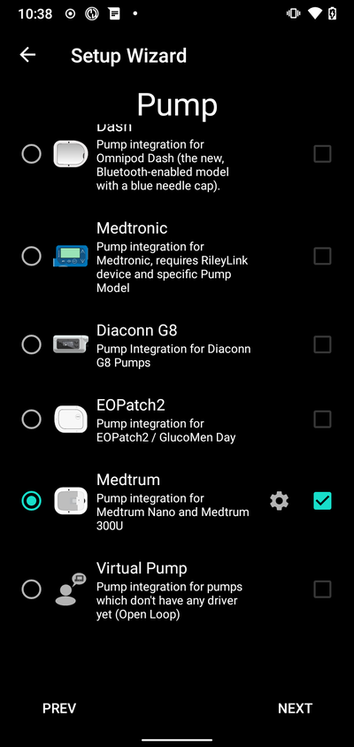

#### Opzione 2: Il Costruttore di configurazione

Su un'installazione esistente puoi selezionare il microinfusore **Medtrum** in [Costruttore di configurazione > Microinfusore](#Config-Builder-pump):

Nel **menu hamburger** in alto a sinistra seleziona **Costruttore di configurazione**\ ➜\ **Microinfusore**\ ➜\ **Medtrum**\ selezionando il **pulsante Abilita** intitolato **Medtrum**.

Selezionando la **casella di controllo** accanto all'**Ingranaggio Impostazioni** si consente la visualizzazione della panoramica Medtrum come scheda nell'interfaccia AAPS con il titolo **Medtrum**. Selezionare questa casella faciliterà l'accesso ai comandi Medtrum durante l'utilizzo di AAPS ed è fortemente consigliato.

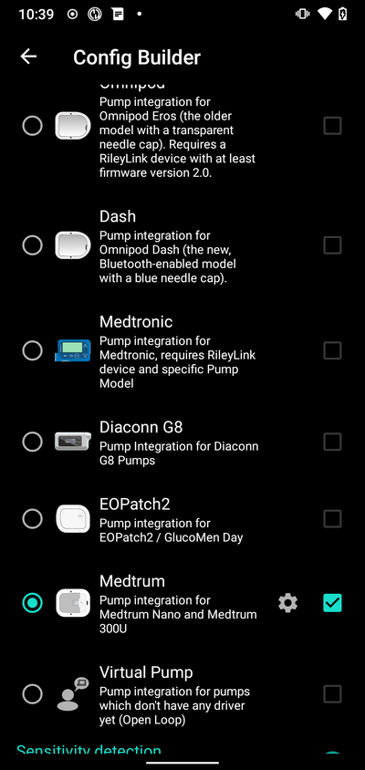

### Passaggio 2: Modifica le impostazioni Medtrum

Accedere alle impostazioni Medtrum toccando l'**Ingranaggio Impostazioni** del modulo Medtrum nel Costruttore di configurazione.

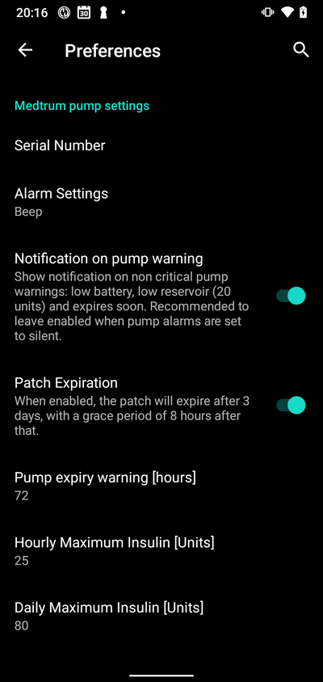

#### Numero di serie:

Inserire qui il numero di serie della base del microinfusore come indicato sulla base stessa. Assicurarsi che il numero di serie sia corretto e che non siano stati aggiunti spazi (è possibile usare maiuscole o minuscole).

NOTA: Questa impostazione può essere modificata solo quando non è attiva nessuna patch.

#### Impostazioni allarme

***Predefinito: Segnale acustico.***

Questa impostazione cambia il modo in cui il microinfusore ti avviserà in caso di avviso o errore.

- Segnale acustico > La patch emetterà un segnale acustico in caso di allarmi e avvisi
- Silenzioso > La patch non ti avviserà in caso di allarmi e avvisi

Nota: In modalità silenziosa AAPS emetterà comunque l'allarme in base alle impostazioni del volume del telefono. Se non si risponde all'allarme, la patch alla fine emetterà un segnale acustico.

#### Notification on pump warning

***Predefinito: Abilitato.***

Questa impostazione cambia il modo in cui AAPS mostrerà le notifiche sugli avvisi non critici del microinfusore. Quando abilitata, verrà mostrata una Notifica sul telefono quando si verifica un avviso del microinfusore, inclusi:
    - Batteria scarica
    - Serbatoio quasi vuoto (20 unità)
    - Avviso di scadenza patch

In entrambi i casi questi avvisi sono mostrati anche nella schermata di panoramica Medtrum sotto [Allarmi attivi](#medtrum-active-alarms).

(medtrum-patch-expiration)=
#### Scadenza patch

***Predefinito: Abilitato.***

Questa impostazione cambia il comportamento della patch. Quando abilitata, la patch scadrà dopo 3 giorni e darà un avviso acustico se il suono è abilitato. Dopo 3 giorni e 8 ore la patch smetterà di funzionare.

Se questa impostazione è disabilitata, la patch non avviserà e continuerà a funzionare fino all'esaurimento della batteria o del serbatoio della patch.

#### Pump expiry warning

***Predefinito: 72 ore.***

Questa impostazione cambia l'ora dell'avviso di scadenza; quando la [Scadenza patch](#medtrum-patch-expiration) è abilitata, AAPS darà una notifica nell'ora impostata dopo l'attivazione.

#### Insulina massima oraria

***Predefinito: 25U.***

Questa impostazione cambia la quantità massima di insulina che può essere erogata in un'ora. Se questo limite viene superato, la patch si sospenderà e darà un allarme. L'allarme può essere ripristinato premendo il pulsante di ripristino nel menu di panoramica, vedere [Ripristino allarmi](#nano-reset-alarms).

Impostare su un valore ragionevole per le proprie esigenze di insulina.

#### Insulina massima giornaliera

***Predefinito: 80U.***

Questa impostazione cambia la quantità massima di insulina che può essere erogata in un giorno. Se questo limite viene superato, la patch si sospenderà e darà un allarme. L'allarme può essere ripristinato premendo il pulsante di ripristino nel menu di panoramica, vedere [Ripristino allarmi](#nano-reset-alarms).

Impostare su un valore ragionevole per le proprie esigenze di insulina.

#### Scansione in caso di errore di connessione

***Predefinito: Off.***

Disponibile nelle **Impostazioni avanzate**.

Abilitare solo in caso di problemi di connessione. Se abilitato, il driver esegue nuovamente la scansione del microinfusore prima di tentare di riconnettersi. Assicurarsi di aver impostato il permesso di localizzazione su "Consenti sempre".

### Passaggio 2b: Impostazioni avvisi AAPS

Vai alle preferenze

#### Pump:

##### BT Watchdog

Vai alle preferenze e seleziona **Microinfusore**:

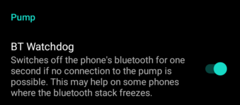

##### BT Watchdog

Questa impostazione tenterà di risolvere eventuali problemi BLE. Tenterà di riconnettersi al microinfusore quando la connessione viene persa. Tenterà anche di riconnettersi al microinfusore quando il microinfusore non è raggiungibile per un certo periodo di tempo.

Abilitare questa impostazione se si riscontrano frequenti problemi di connessione con il microinfusore.

#### Avvisi locali:

Vai alle preferenze e seleziona **Avvisi locali**:

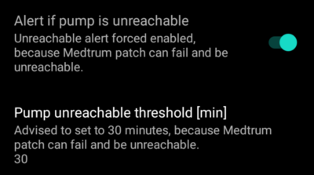

##### Alert if pump is unreachable

***Predefinito: Abilitato.***

Questa impostazione è forzata all'abilitazione quando il driver Medtrum è abilitato. Avviserà quando il microinfusore non è raggiungibile. Ciò può accadere quando il microinfusore è fuori portata o quando non risponde a causa di un difetto della patch o della base del microinfusore, ad esempio quando l'acqua si infiltra tra la base e la patch.

Per ragioni di sicurezza questa impostazione non può essere disabilitata.

##### Soglia microinfusore non raggiungibile [min]

***Predefinito: 30 min.***

Questa impostazione cambia il tempo dopo il quale AAPS ti avviserà quando il microinfusore non è raggiungibile. Ciò può accadere quando il microinfusore è fuori portata o quando non risponde a causa di un difetto della patch o della base del microinfusore, ad esempio quando l'acqua si infiltra tra la base e la patch.

Questa impostazione può essere modificata quando si usa il microinfusore Medtrum, ma si consiglia di impostarla a 30 minuti per ragioni di sicurezza.

### Passaggio 3: Attiva patch

**Prima di continuare:**
- Avere pronte la base del microinfusore Medtrum Nano e una patch serbatoio.
- Assicurarsi che AAPS sia correttamente configurato e che un [profilo sia attivato](../DailyLifeWithAaps/ProfileSwitch-ProfilePercentage.md).
- Gli altri dispositivi che possono comunicare con il microinfusore Medtrum sono disabilitati (PDM e app Medtrum)

#### Attivazione della patch dalla scheda di panoramica Medtrum

Passare alla [SCHEDA Medtrum](#nano-overview) nell'interfaccia AAPS e premere il pulsante **Cambia patch** in basso a destra.

Se una patch è già attiva, verrà richiesto di disattivarla prima. vedere [Disattivazione patch](#nano-deactivate-patch).

Seguire le indicazioni per riempire e attivare una nuova patch. Si noti che è importante collegare la base del microinfusore alla patch serbatoio solo quando viene richiesto di farlo. **È necessario applicare il microinfusore sul corpo e inserire la cannula solo quando viene richiesto durante il processo di attivazione (dopo che il riempimento è completo).**

##### Start Activation

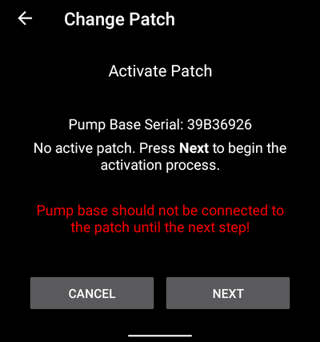

In questo passaggio, verificare il numero di serie e assicurarsi che la base del microinfusore non sia ancora connessa alla patch.

Premere **Avanti** per continuare.

##### Fill the patch

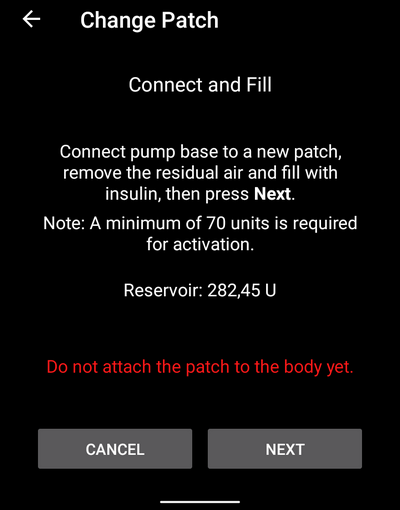

Una volta che la patch viene rilevata e riempita con un minimo di 70 unità di insulina, apparirà il pulsante **Avanti**.

##### Spurgo della patch

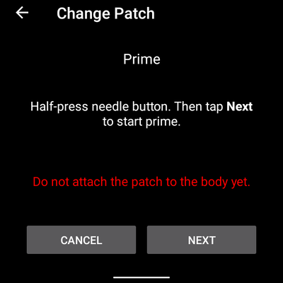

Non rimuovere il blocco di sicurezza e premere il pulsante ago sulla patch.

Premere **Avanti** per avviare lo spurgo

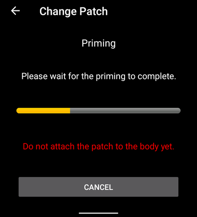

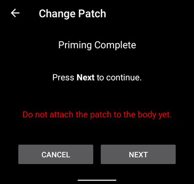

Una volta completato lo spurgo, premere **Avanti** per continuare.

##### Applicazione della patch

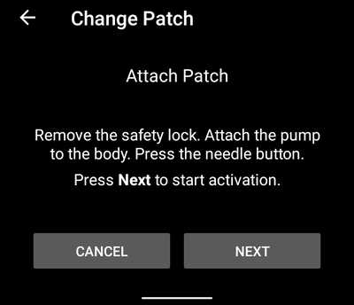

Pulire la pelle, rimuovere gli adesivi e applicare la patch sul corpo. Rimuovere il blocco di sicurezza e premere il pulsante ago sulla patch per inserire la cannula.

Premere **Avanti** per attivare la patch.

(medtrum-activate-patch)=
##### Attivazione patch

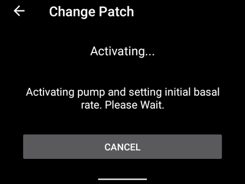

Quando l'attivazione è completa, apparirà la seguente schermata

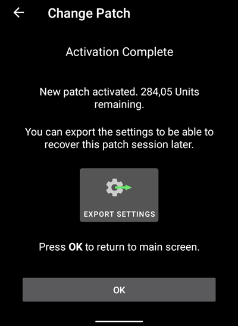

Premere **OK** per tornare alla schermata principale.

(nano-deactivate-patch)=

### Deactivate patch

Per disattivare una patch attualmente attiva, andare alla [SCHEDA Medtrum](#nano-overview) nell'interfaccia AAPS e premere il pulsante **Cambia patch**.

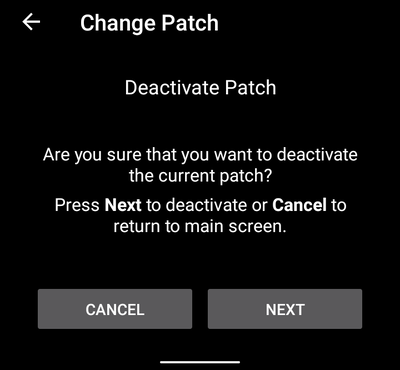

Verrà richiesta la conferma della disattivazione della patch corrente. **Si noti che questa azione non è reversibile.** Una volta completata la disattivazione, è possibile premere **Avanti** per continuare il processo di attivazione di una nuova patch. Se non si è pronti ad attivare una nuova patch, premere **Annulla** per tornare alla schermata principale.

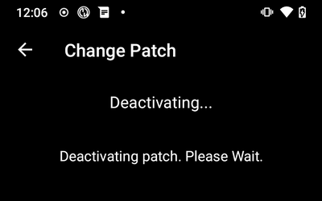

Se Android APS non riesce a disattivare la patch (ad esempio perché la base del microinfusore è già stata rimossa dalla patch serbatoio), è possibile premere **Scarta** per dimenticare la sessione patch corrente e rendere possibile l'attivazione di una nuova patch.

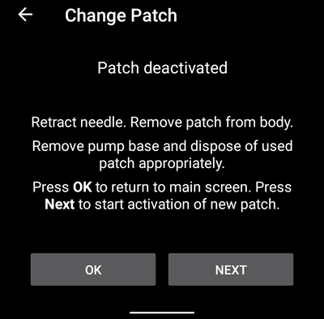

Una volta completata la disattivazione, premere **OK** per tornare alla schermata principale o premere **Avanti** per continuare il processo di attivazione di una nuova patch.

(nano-resume-interrupted-activation)=

### Resume interrupted activation

Se un'attivazione della patch viene interrotta, ad esempio perché la batteria del telefono si esaurisce, è possibile riprendere il processo di attivazione andando alla [SCHEDA Medtrum](#nano-overview) nell'interfaccia AAPS e premendo il pulsante **Cambia patch**.

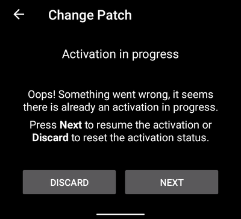

Premere **Avanti** per continuare il processo di attivazione. Premere **Scarta** per scartare la sessione patch corrente e rendere possibile l'attivazione di una nuova patch.

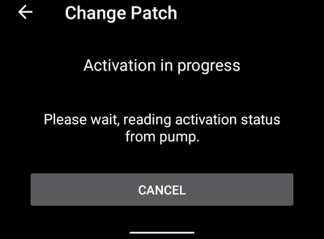

Il driver tenterà di determinare lo stato corrente dell'attivazione della patch. Se questo ha successo, entrerà nel progresso dell'attivazione al passaggio corrente.

(nano-overview)=

## Panoramica

La panoramica contiene lo stato corrente della patch Medtrum. Contiene anche pulsanti per cambiare la patch, ripristinare gli allarmi e aggiornare lo stato.

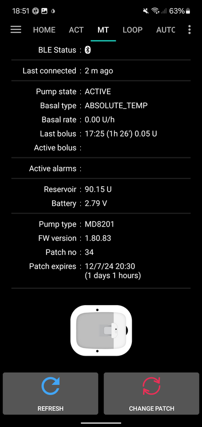

### Stato BLE:

Mostra lo stato corrente della connessione Bluetooth alla base del microinfusore.

### Ultima connessione:

Mostra l'ultima volta che il microinfusore è stato connesso ad AAPS.

### Pump state:

Mostra lo stato corrente del microinfusore. Ad esempio:
    - ATTIVO: Il microinfusore è attivato e funziona normalmente
    - FERMATO: La patch non è attivata

### Tipo basale:

Mostra il tipo di basale corrente.

### Velocità basale:

Mostra la velocità basale corrente.

### Ultimo bolo:

This shows the last bolus that was delivered.

### Bolo attivo:

Mostra il bolo attivo attualmente in erogazione.

(medtrum-active-alarms)=
### Allarmi attivi:

Mostra tutti gli allarmi attivi attualmente presenti.

### Serbatoio:

Mostra il livello corrente del serbatoio.

### Batteria:

Mostra la tensione corrente della batteria della patch.

### Pump type:

Mostra il numero del tipo di microinfusore corrente.

### Versione FW:

Mostra la versione corrente del firmware della patch.

### patch:

Mostra il numero di sequenza della patch attivata. Questo numero viene incrementato ogni volta che una nuova patch viene attivata.

### Scadenza patch:

Mostra la data e l'ora in cui la patch scadrà.

### Aggiorna:

Questo pulsante aggiorna lo stato della patch.

### Cambia patch:

Questo pulsante avvierà il processo di cambio della patch. Vedere [Attiva patch](#medtrum-activate-patch) per maggiori informazioni.

(nano-reset-alarms)=

### Reset alarms

Il pulsante allarme apparirà nella schermata di panoramica quando è presente un allarme attivo che può essere ripristinato. Premendo questo pulsante si ripristineranno gli allarmi e si riprenderà l'erogazione di insulina se la patch è stata sospesa a causa dell'allarme. E.g. E.g. E.g. E.g. E.g. Ad esempio, quando sospesa a causa di un allarme di erogazione massima giornaliera di insulina.

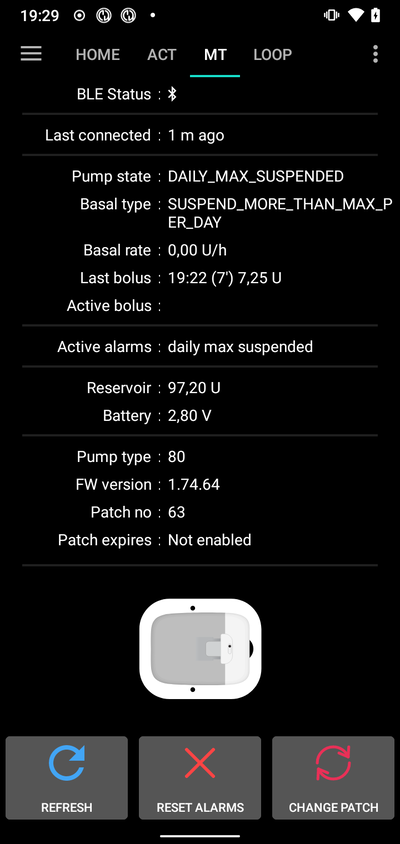

Premere il pulsante **Ripristina allarmi** per ripristinare gli allarmi e riprendere il normale funzionamento.

## Cambio telefono, esportazione/importazione impostazioni

Quando si passa a un nuovo telefono, i seguenti passaggi sono necessari:
* [Esportare le impostazioni](../Maintenance/ExportImportSettings.md) sul vecchio telefono
* Trasferire le impostazioni dal vecchio al nuovo telefono e importarle in AAPS

Il file delle impostazioni importato deve appartenere alla stessa sessione patch attualmente in uso, altrimenti la patch non si connetterà.

Dopo l'importazione delle impostazioni, il driver sincronizzerà la cronologia con il microinfusore; questo potrebbe richiedere del tempo a seconda dell'età del file delle impostazioni.

Dalla versione AAPS 3.3.0.0 in poi, il progresso della sincronizzazione è mostrato nella schermata principale: 

## Risoluzione dei problemi

### Problemi di connessione

Se si riscontrano timeout di connessione o altri problemi di connessione:
- Nelle impostazioni dell'applicazione Android per AAPS: impostare il permesso di localizzazione su "Consenti sempre".

### Problemi Bluetooth
Per problemi noti con le connessioni Bluetooth, disconnessioni di microinfusori/pod, o problemi di attivazione e connessione vedere [Risoluzione dei problemi Bluetooth](../GettingHelp/BluetoothTroubleshooting.md)

### Attivazione interrotta

If the activation process is interrupted for example by and empty phone battery or phone crash. Se il processo di attivazione viene interrotto, ad esempio da una batteria del telefono scarica o un crash del telefono, il processo di attivazione può essere ripreso andando alla schermata di cambio patch e seguendo i passaggi per riprendere l'attivazione come descritto qui: [Ripresa di un'attivazione interrotta](#nano-resume-interrupted-activation)

### Prevenzione dei guasti della patch

La patch può dare una varietà di errori. Per prevenire errori frequenti:
- Assicurarsi che la base del microinfusore sia correttamente inserita nella patch e che non siano visibili spazi.
- Quando si riempie la patch non applicare una forza eccessiva al pistone. Non cercare di riempire la patch oltre il massimo applicabile al proprio modello.

## Dove trovare aiuto

Tutto il lavoro di sviluppo per il driver Medtrum viene fatto dalla comunità su base **volontaria**; chiediamo di ricordare questo fatto e di utilizzare le seguenti linee guida prima di richiedere assistenza:

-  **Livello 0:** Leggere la sezione pertinente di questa documentazione per assicurarsi di capire come dovrebbe funzionare la funzionalità con cui si hanno difficoltà.
-  **Livello 1:** Se si riscontrano ancora problemi che non si riesce a risolvere usando questo documento, andare nel canale *#Medtrum* su **Discord** usando [questo link d'invito](https://discord.gg/4fQUWHZ4Mw).
-  **Livello 2:** Cercare nei problemi esistenti per vedere se il problema è già stato segnalato in [Issues](https://github.com/nightscout/AAPS/issues). Se esiste, confermare/commentare/aggiungere informazioni sul problema. Se non esiste, creare un [nuovo problema](https://github.com/nightscout/AndroidAPS/issues) e allegare [i file di log](../GettingHelp/AccessingLogFiles.md).
-  **Sii paziente - la maggior parte dei membri della nostra comunità è composta da volontari di buona volontà, e risolvere i problemi richiede spesso tempo e pazienza sia dagli utenti che dagli sviluppatori.**