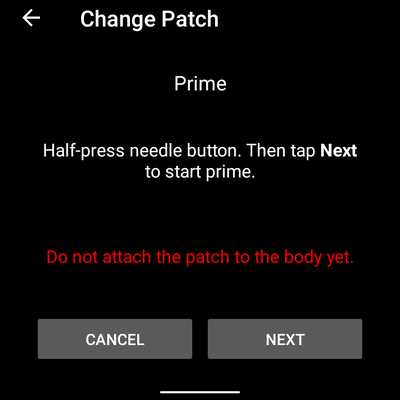
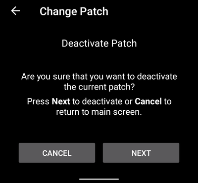
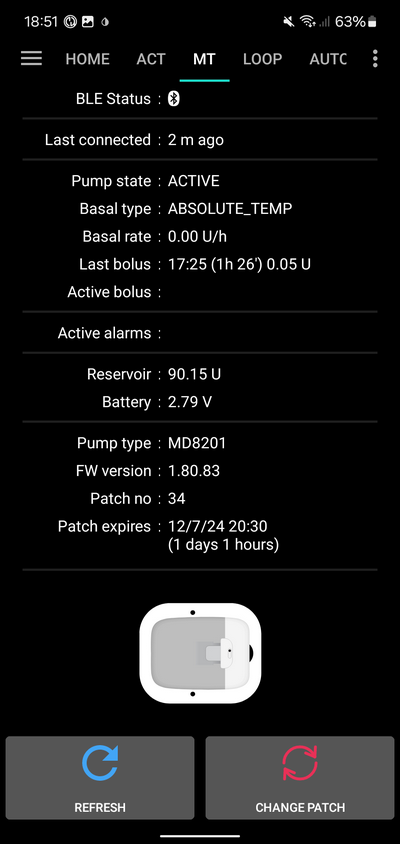
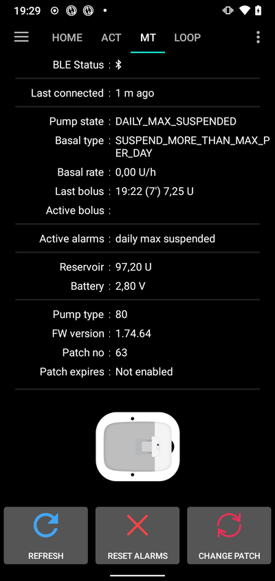

- - -
orphan: true
- - -

# Medtrum Nano / 300U

These instructions are for configuring the Medtrum insulin pump.

This software is part of a DIY artificial pancreas solution and is not a product but requires YOU to read, learn, and understand the system, including how to use it. You alone are responsible for what you do with it.

```{contents} Table of contents
:depth: 1
:local: true
```

## Pump capabilities with AAPS
* All loop functionality supported (SMB, TBR etc)
* Automatic DST and timezone handling
* Extended bolus is not supported by AAPS driver

## Hardware and Software Requirements
* **Compatible Medtrum pumpbase and reservoir patches**
    - Currently supported:
        - Medtrum TouchCare Nano with pumpbase refs: **MD0201** and **MD8201**.
        - Medtrum TouchCare 300U with pumpbase ref: **MD8301**.
        - If you have an unsupported model and are willing to donate hardware or assist with testing, please contact us via discord [here](https://discordapp.com/channels/629952586895851530/1076120802476441641).
* **Version 3.2.0.0 or newer of AAPS built and installed** using the [Build APK](../SettingUpAaps/BuildingAaps.md) instructions.
* **Compatible Android phone** with a BLE Bluetooth connection
    - See AAPS [Release Notes](../Maintenance/ReleaseNotes.md)
* [**Continuous Glucose Monitor (CGM)**](../Getting-Started/CompatiblesCgms.md)

## Before you begin

**SAFETY FIRST** Do not attempt this process in an environment where you cannot recover from an error (extra patches, insulin, and pump control devices are must-haves).

**The PDM and Medtrum App will not work with a patch that is activated by AAPS.** Previously you may have used your PDM or Medtrum app to send commands to your pump. For security reasons you can only use the activated patch with the device or app that was used to activate it.

*This does NOT mean that you should throw away your PDM. It is recommended to keep it somewhere safe as a backup in case of emergencies, for instance if your phone gets lost or AAPS is not working correctly.*

**Your pump will not stop delivering insulin when it is not connected to AAPS** Default basal rates are programmed on the pump as defined in the current active profile. As long as AAPS is operational, it will send temporary basal rate commands that run for a maximum of 120 minutes. If for some reason the pump does not receive any new commands (for instance because communication was lost due to pump - phone distance) the pump will fall back to the default basal rate programmed on the pump once the Temporary Basal Rate ends.

**30 min Basal Rate Profiles are NOT supported in AAPS.** **The AAPS Profile does not support a 30 minute basal rate time frame** If you are new to AAPS and are setting up your basal rate profile for the first time, please be aware that basal rates starting on a half-hour basis are not supported, and you will need to adjust your basal rate profile to start on the hour. For example, if you have a basal rate of 1.1 units which starts at 09:30 and has a duration of 2 hours ending at 11:30, this will not work. You will need to change this 1.1 unit basal rate to a time range of either 9:00-11:00 or 10:00-12:00. Even though the Medtrum pump hardware itself supports the 30 min basal rate profile increments, AAPS is not able to take them into account with its algorithms currently.

**0U/h profile basal rates are NOT supported in AAPS** While the Medtrum pump does support a zero basal rate, AAPS uses multiples of the profile basal rate to determine automated treatment and therefore cannot function with a zero basal rate. A temporary zero basal rate can be achieved through the "Disconnect pump" function or through a combination of Disable Loop/Temp Basal Rate or Suspend Loop/Temp Basal Rate.

## Setup

CAUTION: When activating a patch with AAPS you **MUST** disable all other devices that can talk to the Medtrum pumpbase. e.g. active PDM and Medtrum app. Make sure you have your pumpbase and pumpbase SN ready for activation of a new patch.

### Step 1: Select Medtrum pump

#### Option 1: New installations

If you are installing AAPS for the first time, the **Setup Wizard** will guide you through installing AAPS. Select “Medtrum” when you reach Pump selection.

If in doubt you can also select “Virtual Pump” and select “Medtrum” later, after setting up AAPS (see option 2).


#### Option 2: The Config Builder

On an existing installation you can select the **Medtrum** pump in [Config Builder > Pump](#Config-Builder-pump):

On the top-left hand corner **hamburger menu** select **Config Builder**\ ➜\ **Pump**\ ➜\ **Medtrum**\ by selecting the **Enable button** titled **Medtrum**.

Selecting the **checkbox** next to the **Settings Gear** will allow the Medtrum overview to be displayed as a tab in the AAPS interface titled **Medtrum**. Checking this box will facilitate your access to the Medtrum commands when using AAPS and is highly recommended.


### Step 2: Change Medtrum settings

Enter the Medtrum settings by tapping the **Settings Gear** of the Medtrum module in the Config Builder .


#### Serial Number:

Enter the serial number of your pumpbase here as noted on the pumpbase. Make sure the serial number is correct and there are no spaces added (You can either use capital or lowercase).

NOTE: This setting can only be changed when there is no patch active.

#### Alarm settings

***Default: Beep.***

This setting changes the way that the pump will alert you when there is a warning or error.

- Beep > The patch will beep on alarms and warnings
- Silent > The patch will not alert you on alarms and warnings

Note: In silent mode AAPS will still sound the alarm depending on your phone's volume settings. If you do not respond to the alarm, the patch will eventually beep.

#### Notification on pump warning

***Default: Enabled.***

This settings changes the way AAPS will show notification on non ciritical pump warnings. When enabled a Notification will be shown on the phone when a pump warning occurs, including:
    - Low battery
    - Low reservoir (20 Units)
    - Patch expiration warning

In either case these warnings are also shown on the Medtrum overview screen under [Active alarms](#medtrum-active-alarms).

(medtrum-patch-expiration)=
#### Patch Expiration

***Default: Enabled.***

This setting changes the behavior of the patch. When enabled the patch will expire after 3 days and give an audible warning if you have sound enabled. After 3 days and 8 hours the patch will stop working.

If this setting is disabled, the patch will not warn you and will continue running until the patch battery or reservoir runs out.

#### Pump expiry warning

***Default: 72 hours.***

This setting changes the time of the expiration warning, when [Patch Expiration](#medtrum-patch-expiration) is enabled, AAPS will give a notification on the set hour after activation.

#### Hourly Maximum Insulin

***Default: 25U.***

This setting changes the maximum amount of insulin that can be delivered in one hour. If this limit is exceeded the patch will suspend and give an alarm. The alarm can be reset by pressing the reset button on in the overview menu see [Reset alarms](#reset-alarms).

Set this to a sensible value for your insulin requirements.

#### Daily Maximum Insulin

***Default: 80U.***

This setting changes the maximum amount of insulin that can be delivered in one day. If this limit is exceeded the patch will suspend and give an alarm. The alarm can be reset by pressing the reset button on in the overview menu see [Reset alarms](#reset-alarms).

Set this to a sensible value for your insulin requirements.

#### Scan on Connection error

***Default: Off.***

Located under **Advanced Settings**.

Only enable if you have connection problems. If enabled the driver scans for the pump again before trying to reconnect to the pump. Make sure you have Location permission set to "Always allow".

### Step 2b: AAPS Alerts settings

Go to preferences

#### Pump:

##### BT Watchdog

Go to preferences and select **Pump**:


##### BT Watchdog

This setting will try to work around any BLE issues. It will try to reconnect to the pump when the connection is lost. It will also try to reconnect to the pump when the pump is unreachable for a certain amount of time.

Enable this setting if you experience frequent connection issues with your pump.

#### Local Alerts:

Go to preferences and select **Local Alerts**:


##### Alert if pump is unreachable

***Default: Enabled.***

This setting is forced to enabled when the Medtrum driver is enabled. It will alert you when the pump is unreachable. This can happen when the pump is out of range or when the pump is not responding due to a defective patch or pumpbase, for example when water leaks between the pumpbase and the patch.

For safety reasons this setting cannot be disabled.

##### Pump unreachable threshold [min]

***Default: 30 min.***

This setting changes the time after which AAPS will alert you when the pump is unreachable. This can happen when the pump is out of range or when the pump is not responding due to a defective patch or pumpbase, for example when water leaks between the pumpbase and the patch.

This setting can be changed when using Medtrum pump but it is recommended to set it at 30 minutes for safety reasons.

### Step 3: Activate patch

**Before you continue:**
- Have your Medtrum Nano pumpbase and a reservoir patch ready.
- Make sure that AAPS is properly set up and a [profile is activated](../DailyLifeWithAaps/ProfileSwitch-ProfilePercentage.md).
- Other devices that can talk to the Medtrum pump are disabled (PDM and Medtrum app)

#### Activate patch from the Medtrum overview Tab

Navigate to the [Medtrum TAB](#overview) in the AAPS interface and press the **Change Patch** button in the bottom right corner.

If a patch is already active, you will be prompted to deactivate this patch first. see [Deactivate Patch](#deactivate-patch).

Follow the prompts to fill and activate a new patch. Please note - it is important to only connect the pumpbase to the reservoir patch at the step when you are prompted to do so. **You must only put the pump on your body and insert the cannula when prompted to during the activation process (after priming is complete).**

##### Start Activation


At this step, double check your serial number and make sure the pumpbase is not connected to the patch yet.

Press **Next** to continue.

##### Fill the patch


Once the patch is detected and filled with a minimum of 70Units of insulin, press **Next** will appear.

##### Prime the patch



Do not remove the safety lock and press the needle button on the patch.

Press **Next** to start prime


Once the prime is complete, press **Next** to continue.

##### Attach Patch


Clean the skin, remove stickers and attach the patch to your body. Remove safety lock and press the needle button on the patch to insert the cannula.

Press **Next** to activate the patch.

(medtrum-activate-patch)=
##### Activate Patch


When activation is complete, the following screen will appear


Press **OK** to return to main screen.

### Deactivate patch

To deactivate a currently active patch, go to the [Medtrum TAB](#overview) in the AAPS interface and press the **Change Patch** button.



You will be asked to confirm that you wish to deactivate the current patch. **Please note that this action is not reversable.** When deactivation is completed, you can press **Next** to continue the process to activate a new patch. If you are not ready to activate a new patch, press **Cancel** to return to the main screen.


If Android APS in unable to deactivate the patch (For instance because the pumpbase has already been removed from the reservoir patch), you may press **Discard** to forget the current patch session and make it possible to activate a new patch.


Once deactivation is complete, press **OK** to return to main screen or press **Next** to continue the process to activate a new patch.

### Resume interrupted activation

If a patch activation is interrupted, for instance because the phone battery runs out, you can resume the activation process by going to the [Medtrum TAB](#overview) in the AAPS interface and press the **Change Patch** button.


Press **Next** to continue the activation process. Press **Discard** to discard the current patch session and make it possible to activate a new patch.


The driver will try to determine the current status of the patch activation. If this was successful it will go into the activation progress at the current step.

## Overview

The overview contains the current status of the Medtrum patch. It also contains buttons to change the patch, reset alarms and refresh the status.



### BLE Status:

This shows the current status of the Bluetooth connection to the pumpbase.

### Last connected:

This shows the last time the pump was connected to AAPS.

### Pump state:

This shows the current state of the pump. For example:
    - ACTIVE : The pump is activated and running normally
    - STOPPED: The patch is not activated

### Basal type:

This shows the current basal type.

### Basal rate:

This shows the current basal rate.

### Last bolus:

This shows the last bolus that was delivered.

### Active bolus:

This shows the active bolus that is currently being delivered.

(medtrum-active-alarms)=
### Active alarms:

This shows any active alarms that are currently active.

### Reservoir:

This shows the current reservoir level.

### Battery:

This shows the current battery voltage of the patch.

### Pump type:

This shows the current pump type number.

### FW version:

This shows the current firmware version of the patch.

### Patch no:

This shows the sequence number of the activated patch. This number is incremented every time a new patch is activated.

### Patch expires:

This shows the date and time when the patch will expire.

### Refresh:

This button will refresh the status of the patch.

### Change patch:

This button will start the process to change the patch. See [Activate patch](#medtrum-activate-patch) for more information.

### Reset alarms

The alarm button will appear on the overview screen when there is an active alarm that can be reset. Pressing this button will reset the alarms and resume insulin delivery if the patch has been suspended due to the alarm. E.g. E.g. when suspended due to a maximum daily insulin delivery alarm.



Press the **Reset Alarms** button to reset the alarms and resume normal operation.

## Switching phone, export/import settings

When switching to a new phone the following steps are necessary:
* [Export settings](../Maintenance/ExportImportSettings.md) on your old phone
* Transfer settings from old to new phone, and import them into AAPS

The imported settings file has to be of the same patch session that you are currently using, otherwise the patch will not connect.

After a settings import the driver will sync history with the pump, this can take a while depending on the age of the settings file.

From AAPS version 3.3.0.0 onwards, the sync progress is shown in the the home screen: 

## Troubleshooting

### Connection issues

If you are experiencing connection timeouts or other connection issues:
- In Android application settings for AAPS: Set location permission to "Allow all the time".

### Activation interrupted

If the activation process is interrupted for example by and empty phone battery or phone crash. The activation process can be resumed by going to the change patch screen and follow the steps to resume the activation as outlined here: [Resume interrupted activation](#resume-interrupted-activation)

### Preventing patch faults

The patch can give a variety of errors. To prevent frequent errors:
- Make sure the pumpbase is properly seated in the patch and no gaps are visible.
- When filling the patch do not apply excessive force to the plunger. Do not try to fill the patch beyond the maximum that applies to your model.

## Where to get help

All of the development work for the Medtrum driver is done by the community on a **volunteer** basis; we ask that you to remember that fact and use the following guidelines before requesting assistance:

-  **Level 0:** Read the relevant section of this documentation to ensure you understand how the functionality with which you are experiencing difficulty is supposed to work.
-  **Level 1:** If you are still encountering problems that you are not able to resolve by using this document, then please go to the *#Medtrum* channel on **Discord** by using [this invite link](https://discord.gg/4fQUWHZ4Mw).
-  **Level 2:** Search existing issues to see if your issue has already been reported at [Issues](https://github.com/nightscout/AAPS/issues) if it exists, please confirm/comment/add information on your problem. If not, please create a [new issue](https://github.com/nightscout/AndroidAPS/issues) and attach [your log files](../GettingHelp/AccessingLogFiles.md).
-  **Be patient - most of the members of our community consist of good-natured volunteers, and solving issues often requires time and patience from both users and developers.**