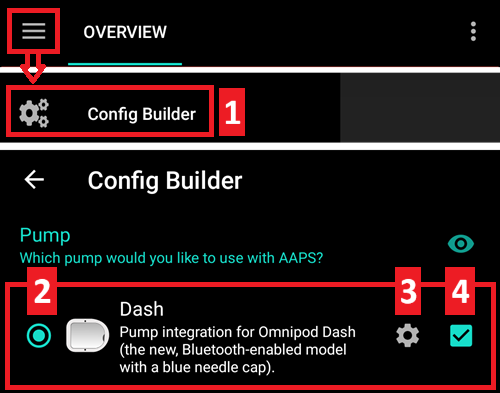
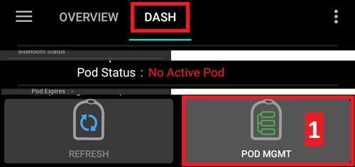
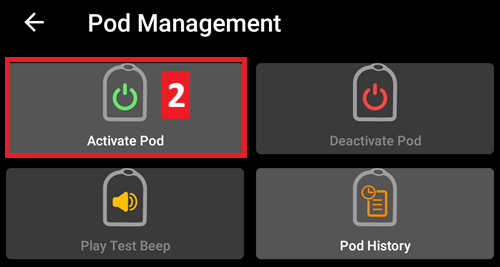
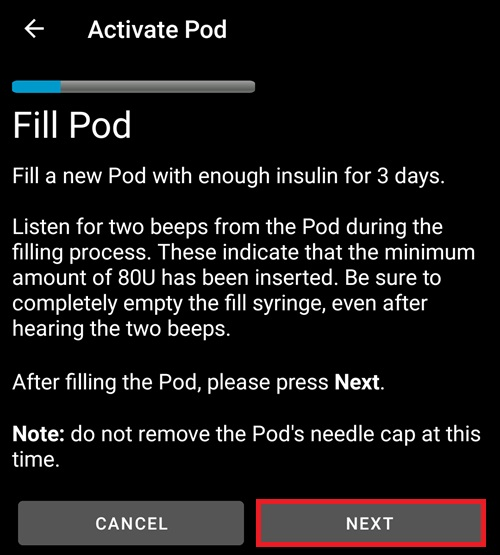
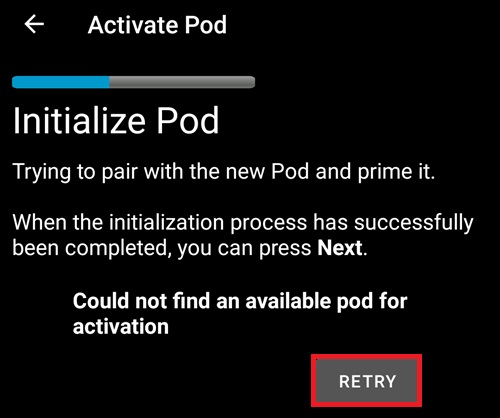
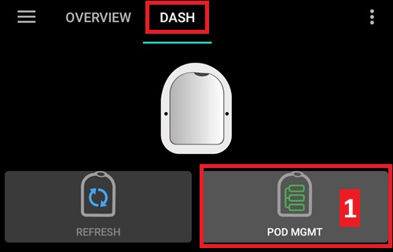
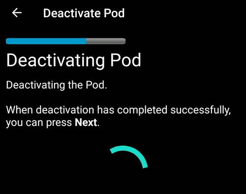
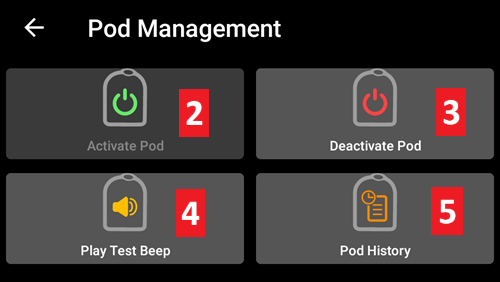
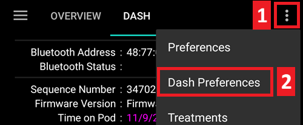
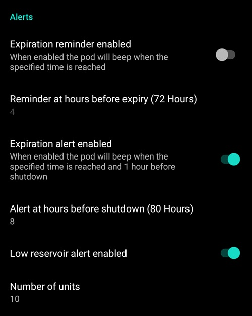

# Omnipod DASH

Queste istruzioni riguardano la configurazione del microinfusore **Omnipod DASH** di nuova generazione **(NON Omnipod Eros)**, disponibile in **AAPS** dalla versione 3.0.

## Specifiche Omnipod DASH

Queste sono le specifiche dell' **Omnipod DASH** ('DASH') e ciò che lo differenzia dall'**Omnipod EROS** ('EROS'):

- I pod DASH sono identificati da un **cappuccio ago blu** (EROS ha un cappuccio ago trasparente). I pod sono altrimenti identici in termini di dimensioni fisiche.
- Non c'è bisogno di un dispositivo separato per fare da ponte da Omnipod a Bluetooth (NO RileyLink, OrangeLink o EmaLink necessari).
- La connessione Bluetooth del DASH viene usata solo quando si invia un comando (ad es. un Bolo) e si disconnette subito dopo l'invio del comando.
- Non ci saranno più errori "nessuna connessione dal dispositivo al pod" con DASH.
- **AAPS** attenderà che il pod sia accessibile per inviare i comandi.
- Al momento dell'attivazione, **AAPS** troverà e connetterà il nuovo pod DASH.
- Portata prevista dal telefono: 5-10 metri (i risultati possono variare).

(omnipod-dash-constraints)=

## Limitazioni/problemi noti di AAPS con Omnipod DASH
- Android 16 richiede **AAPS** versione 3.3.2.1 o successiva.
- Il consiglio generale è di usare **AAPS** su Android 14 o 16. Android 15 ha molti [problemi](https://github.com/nightscout/AndroidAPS/issues/3471) segnalati dalla comunità. Tuttavia, se si utilizza Android 15 sarà probabilmente necessario abilitare il Bluetooth Bonding per attivare e usare i Pod con successo, vedere [Risoluzione generale dei problemi](../GettingHelp/GeneralTroubleshooting.md) per maggiori informazioni sulle impostazioni di Bonding.
- Aggiornamenti basali troppo frequenti possono causare [problemi](https://github.com/nightscout/AndroidAPS/issues/4158) di erogazione dell'insulina basale con Omnipod Dash. Quando si usa **SMB**, limitare l'intervallo a un minimo di 5 minuti per evitare questo problema.
- Dash supporta solo la velocità basale in step di 0,05 U/h. Se si tenta di impostare la basale con step di 0,01 nel **profilo AAPS**, AAPS non darà un avviso anche se il pod arrotonderà la velocità a step di 0,05. Se si visualizza GESTIONE POD/Cronologia pod, mostrerà che è stata impostata una basale di 0,05. Ciò significa anche che la velocità basale minima consentita dal DASH in **AAPS** è 0,05 U/h.
- Lo stato di attivazione di un Pod viene memorizzato nel file delle impostazioni. Se si esporta un file di impostazioni con un pod attivo, poi si passa a un nuovo pod e si ripristinano le impostazioni dall'esportazione precedente, si avrà ripristinato l'attivazione del vecchio pod e rimosso quella del nuovo. Per questo motivo si consiglia di esportare le impostazioni dopo ogni attivazione del pod per consentire il ripristino dello stato di attivazione del pod in caso di problemi.
- Quando si imposta un nuovo profilo basale, DASH sospenderà l'erogazione prima di impostare il nuovo **Profilo** basale. Se c'è un'interruzione della comunicazione o un errore, il profilo basale non ripartirà automaticamente. Vedere la sezione [Ripresa dell'erogazione di insulina](#omnipod-dash-resuming-insulin-delivery) per i dettagli.
- Se gli avvisi sono configurati e il pod sta per scadere, il pod continuerà a emettere segnali acustici finché gli avvisi non vengono silenziati; vedere [Silenziamento avvisi pod](#omnipod-dash-silencing-pod-alerts) per i dettagli.
- Ci sono diversi problemi noti con il Bluetooth che possono causare problemi di attivazione del pod. Vedere [Risoluzione problemi Bluetooth](../GettingHelp/BluetoothTroubleshooting.md) per i problemi noti e le soluzioni.

(hardware-software-requirements)=

(omnipod-dash-hardware-software-requirements)=
## Requisiti Hardware/Software

- Omnipod DASH è identificato dal cappuccio ago blu.

- **Uno smartphone Android compatibile** con Bluetooth Low Energy (BLE) (vedere [Telefoni](../Getting-Started/Phones.md) per maggiori informazioni); le seguenti informazioni aiuteranno anche a orientarsi su altre considerazioni chiave per attivare e usare con successo il DASH su un telefono compatibile:
    -  Il driver Omnipod Dash di **AAPS** si connette al Pod DASH tramite Bluetooth. **AAPS** stabilirà automaticamente una nuova connessione Bluetooth al Pod ogni volta che ha bisogno di inviare un comando (ad es. un Bolo); dopo l'invio del comando la connessione Bluetooth viene immediatamente disconnessa.
       - **NOTA:**
         - La connessione Bluetooth può essere interrotta/disturbata da altri dispositivi Bluetooth collegati al telefono che esegue **AAPS**, come auricolari ecc. Dispositivi di questo tipo possono causare errori di connessione o problemi di attivazione del pod su alcuni modelli di telefono. Devices like this can cause connection errors or pod activation issues on some models of phones. È buona idea rivedere l'elenco delle [configurazioni hardware testate](https://docs.google.com/spreadsheets/u/1/d/e/2PACX-1vScCNaIguEZVTVFAgpv1kXHdsHl3fs6xT6RB2Z1CeVJ561AvvqGwxMhlmSHk4J056gMCAQE02sAWJvT/pubhtml?gid=683363241&single=true) prima di impegnarsi con una nuova configurazione basata su Omnipod DASH.
         - Ci sono diversi problemi noti con il Bluetooth che possono causare problemi di attivazione del pod (vedere [Risoluzione dei problemi](#troubleshooting) per consigli su altri problemi Bluetooth), in particolare la sezione [Problemi relativi al Bluetooth](#omnipod-dash-bluetooth-related-issues).
    - Per **Android 15** o versioni precedenti: **DEVI** usare la **Versione 3.0 o successiva di AAPS** seguendo le istruzioni [**Compilazione APK**](../SettingUpAaps/BuildingAaps.md); tuttavia è consigliabile usare l'ultima versione rilasciata.
    - Per **Android 16**: **DEVI** usare la **Versione 3.3.2.1 o successiva di AAPS** seguendo le istruzioni [**Compilazione APK**](../SettingUpAaps/BuildingAaps.md), poiché Android 16 ha cambiato il funzionamento del Bluetooth. Qualsiasi versione precedente alla 3.3.2.1 potrebbe causare guasti del pod e/o [problemi](https://github.com/nightscout/AndroidAPS/issues/3471) di attivazione.
- Un [**Monitor continuo del glucosio (CGM)**](../Getting-Started/CompatiblesCgms.md) supportato

Le istruzioni seguenti spiegano come attivare una nuova sessione pod usando **AAPS**. È consigliabile attendere che il Pod corrente si avvicini alla scadenza, poiché sarà necessario attivare un nuovo Pod con **AAPS**. Una volta disattivato, un pod non può essere riutilizzato/riattivato; la disattivazione è definitiva.

## Prima Di Iniziare

Assicurarsi di aver letto e compreso questa intera guida, di aver letto e compreso la sezione **Prima Di Iniziare** e le **[Limitazioni e Problemi di Omnipod e AAPS](#omnipod-dash-constraints)** per evitare di incorrere in problemi noti.

### **LA SICUREZZA PRIMA DI TUTTO** - **NON** tentare di connettere **AAPS** a un pod per la prima volta senza avere accesso a tutti i seguenti elementi:
1. Pod extra (3 o più di riserva)
2. Insulina di riserva e attrezzatura per iniezioni con siringa
3. Un PDM Omnipod funzionante (nel caso in cui **AAPS** si guasti)
4. I telefoni supportati sono indispensabili! (vedere [Requisiti Hardware/Software](#hardware-software-requirements))
5. Versione corretta di AAPS compilata e installata

### **Il PDM Omnipod Dash diventerà ridondante dopo che il driver AAPS Dash attiva il pod.**
- Prima di usare **AAPS** tu o chi si prende cura di te avrebbe dovuto gestire il Pod usando il PDM Omnipod (o in alcune regioni un'app per telefono) per inviare comandi al DASH (ad es. un Bolo).
- Il DASH può facilitare una sola connessione Bluetooth (ad es. PDM o Telefono) per gestire e inviare comandi.
- Il dispositivo che attiva con successo il pod è l'unico dispositivo autorizzato a comunicare con quel Pod da quel momento in poi. Ciò significa che una volta attivato un DASH con il tuo smartphone Android usando **AAPS**, **non sarà più possibile usare il PDM con quel pod!** Per il periodo in cui quel Pod è attivo, il driver AAPS Dash in esecuzione sullo smartphone Android è il nuovo PDM del tuo pod.
- **NON buttare via il PDM!** Si consiglia di tenerlo a portata di mano come backup e per le emergenze, ad esempio quando il telefono viene perso o **AAPS** non funziona correttamente.

### Il pod **NON** si fermerà nell'erogare insulina quando non è connesso ad AAPS.
Le velocità basali predefinite sono programmate sul pod all'attivazione come definite nel [**Profilo**](../SettingUpAaps/YourAapsProfile.md) attivo corrente. Finché **AAPS** è operativo, invierà comandi di regolazione della velocità basale che durano al massimo 120 minuti. Quando per qualche motivo il pod non riceve nuovi comandi (ad esempio perché la comunicazione è stata persa a causa della distanza Pod ➜ telefono), il pod tornerà automaticamente alle velocità basali predefinite definite nel tuo [**Profilo**](../SettingUpAaps/YourAapsProfile.md).

### **I Profili AAPS non supportano intervalli di tempo basali di 30 minuti**
Se sei nuovo ad **AAPS** e stai configurando il tuo [**Profilo**](../SettingUpAaps/YourAapsProfile.md) di velocità basale per la prima volta, tieni presente che le velocità basali che iniziano a mezz'ora non sono supportate. Ad esempio, se sul tuo PDM Omnipod hai una velocità basale di 1,1 unità che inizia alle 09:30 e ha una durata di 2 ore fino alle 11:30, non è possibile replicare questo esatto **Profilo** basale in **AAPS**. Dovrai cambiare questa velocità basale di 1,1 unità in un intervallo di tempo di 9:00-11:00 o 10:00-12:00. Anche se l'hardware DASH stesso supporta gli incrementi di 30 minuti del **Profilo** di velocità basale, **AAPS** NON supporta questa funzione.

### **Le velocità basali del Profilo a 0 U/h NON sono supportate in AAPS**
Sebbene il DASH supporti una velocità basale zero, **AAPS** usa multipli della velocità basale del **Profilo** dell'utente per determinare il trattamento automatico; non può funzionare con una velocità basale zero. In alternativa, una velocità basale temporanea zero può essere ottenuta tramite la funzione "Disconnetti microinfusore", o tramite una combinazione di Disabilita Loop/Basale Temporanea o Sospendi Loop/Basale Temporanea. **NOTA:** La velocità basale minima consentita dal DASH in **AAPS** è 0,05 U/h.

## Selezione di Dash in AAPS

Ci sono **due** opzioni disponibili per configurare Omnipod in **AAPS**:

### Opzione 1: Nuove installazioni

Quando si installa **AAPS** per la prima volta, la **Procedura guidata di configurazione** guiderà i nuovi utenti attraverso le funzionalità chiave e i requisiti di installazione di **AAPS**. Selezionare "DASH" quando si arriva alla selezione del Microinfusore.

In caso di dubbio, è anche possibile selezionare "Microinfusore Virtuale" e selezionare "DASH" in seguito, dopo aver configurato **AAPS** (vedere Opzione 2).

(omnipod-dash-option-2-config-builder)=
### Opzione 2: Il Costruttore di configurazione

Su un'installazione esistente è possibile selezionare il microinfusore **DASH** dal Costruttore di configurazione:

Nel **menu hamburger** in alto a sinistra selezionare **Costruttore di configurazione (1)** ➜ **Microinfusore** ➜ **Dash** ➜ **Ingranaggio Impostazioni (3)** selezionando il **pulsante radio (2)** intitolato **Dash**.

Selezionando la **casella di controllo (4)** accanto all'**Ingranaggio Impostazioni (3)** si consente la visualizzazione del menu DASH come scheda nell'interfaccia **AAPS** con il titolo **DASH**. Selezionare questa casella faciliterà l'accesso ai comandi DASH durante l'utilizzo di **AAPS**.

**NOTA:** Un modo più veloce per accedere alle [**impostazioni Dash**](#omnipod-dash-settings) è disponibile nella sezione impostazioni DASH di questo documento.

### Verifica della selezione del driver Omnipod

Selecting the **checkbox (4)** next to the **Settings Gear (3)** will allow the Dash menu to be displayed as a tab in the **AAPS** interface titled **DASH**. The Dash driver settings are configurable from the top-left hand corner **hamburger menu** under **Config Builder (1)** ➜ **Pump**  **Dash** ➜ **Settings Gear (3)** by selecting the **radio button (2)** titled **Dash**.

## Configurazione Dash

**Scorri verso sinistra** fino alla [**scheda DASH**](#omnipod-dash-tab) dove potrai gestire tutte le funzioni del pod (alcune di queste funzioni non sono abilitate o visibili senza una sessione pod attiva):

 'Aggiorna' la connettività e lo stato del pod, possibilità di silenziare gli avvisi del pod quando suona

   'Gestione Pod' (Attiva, Disattiva, Suona segnale acustico di test e Cronologia pod)

(omnipod-dash-activate-pod)=

### Attiva Pod

1. Passare alla scheda **DASH** e fare clic sul pulsante **GESTIONE POD (1)**, quindi fare clic su **Attiva Pod (2)**.

   

   

2. Viene visualizzata la schermata **Riempi Pod**. Riempire un nuovo pod con **almeno 80 unità** di insulina e aspettare due segnali acustici che indicano che il pod è pronto per l'innesco.

   ***NOTA:** Quando si calcola la quantità totale di insulina necessaria per 3 giorni, tenere presente che l'innesco del pod userà circa 3-10 unità.*

   

   

   Assicurarsi che il nuovo pod e il telefono che esegue **AAPS** siano nelle immediate vicinanze l'uno dell'altro e fare clic sul pulsante **Avanti**.

   ***NOTA**: Se appare il messaggio di errore seguente _'Impossibile trovare un pod disponibile per l'attivazione'_ (questo può accadere), non fatevi prendere dal panico. Fare clic sul pulsante **Riprova**. Nella maggior parte dei casi l'attivazione continuerà con successo.*

   

3. Click on the **Next** button to complete the pod priming initialization and display the **Attach Pod** screen. On the **Initialize Pod** screen, the pod will begin priming (you will hear a click followed by a series of ticking sounds as the pod primes itself).  
   A green checkmark will be shown upon successful priming, and the **Next** button will become enabled.

       

4. Preparare il sito di infusione per ricevere il nuovo pod. Lavarsi le mani per evitare qualsiasi rischio di infezione. Pulire il sito di infusione con acqua e sapone o un tampone di alcol per disinfettare e lasciare asciugare completamente la pelle prima di procedere. Se si ha irritazione della pelle dall'adesivo, considerare l'uso di una Barriera protettiva.

   Rimuovere il cappuccio ago blu di plastica del pod. Se si vede qualcosa che sporge dal pod o se ha un aspetto insolito, **INTERROMPERE** il processo e iniziare con un nuovo pod. Se tutto sembra **a posto**, procedere a rimuovere il supporto di carta bianco dall'adesivo e applicare il pod sul sito selezionato sul corpo.

   Al termine, fare clic sul pulsante **Avanti**.

   

6. Apparirà la finestra di dialogo **Applica Pod**. **Fare clic sul pulsante OK SOLO se si è pronti a dispiegare la cannula!**

   

7. Dopo aver premuto **OK**, potrebbe volerci del tempo prima che il DASH risponda e inserisca la cannula (massimo 1-2 minuti). **Sii paziente!**

   ***NOTA:** Prima che la cannula venga inserita, è buona pratica pizzicare la pelle vicino al punto di inserimento della cannula. Ciò garantisce un inserimento fluido dell'ago e ridurrà le possibilità di occlusioni.*

       

8. Sullo schermo apparirà un segno di spunta verde e il pulsante **Avanti** diventerà disponibile dopo un inserimento riuscito della cannula. Fare clic sul pulsante **Avanti**.

   

1. Viene visualizzata la schermata **Pod attivato**.

   Fare clic sul pulsante verde **Fine**.

   Congratulazioni! Hai avviato una nuova sessione pod.

   

2. La schermata del menu **Gestione pod** dovrebbe ora mostrare il pulsante **Attiva Pod (1)** *disabilitato* e il pulsante **Disattiva Pod (2)** *abilitato*. Questo perché un pod è ora attivo e non è possibile attivare un pod aggiuntivo senza prima disattivare quello attualmente attivo.

    Fare clic sul pulsante Indietro sul telefono per tornare alla schermata della scheda **DASH** che mostrerà le informazioni sul pod per la sessione pod attiva, inclusa la velocità basale corrente, il livello del serbatoio del pod, l'insulina erogata, gli errori e gli avvisi del pod.

    ***NOTA:** Per maggiori dettagli sulle informazioni visualizzate, vedere la sezione [**Scheda DASH**](#omnipod-dash-tab) di questo documento.*

   

   

   ***NOTA:** È buona pratica esportare le impostazioni DOPO l'attivazione del pod. Le impostazioni dovrebbero essere esportate dopo ogni cambio pod e una volta al mese; assicurarsi di copiare il file delle impostazioni esportate in un cloud storage (ad es. Google Drive) o in un posto fuori dal telefono nel caso in cui si perda il telefono (vedere [**Esporta impostazioni**](../Maintenance/ExportImportSettings.md)).*

(omnipod-dash-deactivate-pod)=

### Disattiva Pod

In circostanze normali, la durata prevista di un pod è di tre giorni (72 ore) e altre 8 ore dopo l'avviso di scadenza del pod, per un totale di 80 ore di utilizzo.

Per disattivare un pod (sia per scadenza che per guasto del pod):

1. Andare alla scheda **DASH**, fare clic sul pulsante **GESTIONE POD (1)**, nella schermata **Gestione pod** fare clic sul pulsante **Disattiva Pod (2)**.

   

   

2. Nella schermata **Disattiva Pod**, fare clic sul pulsante **Avanti** per iniziare il processo di disattivazione del pod.

   Dal pod si riceverà un segnale acustico di conferma che la disattivazione è riuscita.

   

   

3. Sullo schermo apparirà un segno di spunta verde e il pulsante **Avanti** diventerà disponibile dopo un inserimento riuscito della cannula. Fare clic sul pulsante **Avanti**.

   È ora possibile rimuovere il pod poiché la sessione attiva è stata disattivata.

   

4. Fare clic sul pulsante verde per tornare alla schermata **Gestione pod**.

   

5. Ora ci si trova nel menu **Gestione pod**; premere il pulsante Indietro sul telefono per tornare alla scheda **DASH**.

   Verificare che il campo **Stato pod:** mostri il messaggio **Nessun pod attivo**.

   

   

(omnipod-dash-resuming-insulin-delivery)=

### Ripresa dell'erogazione di insulina

**NOTA**: Durante i **Cambi Profilo**, come quando si usa il PDM, AAPS deve sospendere l'erogazione sul Pod prima di impostare il nuovo **Profilo** basale. Se la comunicazione fallisce tra i comandi di sospensione e ripresa, l'erogazione può rimanere sospesa. Vedere [**Erogazione sospesa**](#omnipod-dash-delivery-suspended) nella sezione risoluzione dei problemi per maggiori dettagli.

Quando l'erogazione di insulina è sospesa, è necessario inviare un comando per istruire il pod attivo e attualmente sospeso a riprendere l'erogazione di insulina. Dopo che il comando viene elaborato con successo, l'insulina riprenderà l'erogazione normale usando la velocità basale corrente basata sull'ora corrente del **Profilo** basale attivo. Il pod accetterà nuovamente comandi per bolo, **TBR** e **SMB**.

1. Andare alla scheda **DASH** e assicurarsi che il campo **Stato pod (1)** mostri **SOSPESO**, quindi premere il pulsante **RIPRENDI EROGAZIONE (2)** per avviare il processo di istruzione al pod corrente di riprendere la normale erogazione di insulina. Nella scheda **Stato pod (3)** verrà visualizzato il messaggio **RIPRENDI EROGAZIONE**.

      

2. Quando il comando di ripresa dell'erogazione ha successo, una finestra di dialogo di conferma mostrerà il messaggio **L'erogazione di insulina è stata ripresa**. Fare clic su **OK** per confermare e procedere.

   

3. La scheda **DASH** aggiornerà il campo **Stato pod (1)** mostrando **IN ESECUZIONE** e il pulsante **Riprendi Erogazione** non sarà più visualizzato.

   

(omnipod-dash-silencing-pod-alerts)=

### Silenziamento avvisi pod

Il processo seguente mostrerà come confermare e ignorare i segnali acustici del pod quando il tempo del pod attivo raggiunge il limite di avviso prima della scadenza del pod a 72 ore (3 giorni). Questo limite di tempo di avviso è definito nell'impostazione degli avvisi Dash **Ore prima dello spegnimento**. La durata massima di un pod è 80 ore (3 giorni e 8 ore), tuttavia Insulet raccomanda di non superare il limite di 72 ore (3 giorni).

***NOTA**: Il pulsante **SILENZIA AVVISI (3)** è disponibile solo nella scheda **DASH** quando è stato attivato l'avviso di scadenza del pod o di serbatoio basso. Se il pulsante **SILENZIA AVVISI** non è visibile e si sentono segnali acustici dal pod, provare ad 'Aggiornare lo stato del pod'.*

1. **AAPS** sends the command to the pod to deactivate the pod expiration warning beeps and updates the **Pod status (1)** field with **ACKNOWLEDGE ALERTS**. Go to the **DASH** tab and press the **SILENCE ALERTS (2)** button.

   

2. This also will trigger displaying the **SILENCE ALERTS (3)** button. When the defined **Hours before shutdown** warning time limit is reached, the pod will issue warning beeps to inform you that it is approaching its expiration time and a pod change will be required soon.  
   You can verify this on the **DASH** tab, the **Pod expires: (1)** field will show the exact time the pod will expire (72 hours after activation), and the text will turn **red** after this time has passed.  
   Under the **Active Pod alerts (2)** field the status message **Pod will expire soon** is displayed.

   

3. Alla **disattivazione riuscita** degli avvisi, il pod attivo emetterà **2 segnali acustici** e una finestra di dialogo di conferma mostrerà il messaggio **Gli avvisi attivi sono stati Silenziati**. Fare clic sul pulsante **OK** per confermare e chiudere la finestra di dialogo.

   

4. Andare alla scheda **DASH**. Nel campo **Avvisi pod attivi**, il messaggio di avviso non è più visualizzato e il pod attivo non emetterà più segnali acustici di avviso di scadenza.

(omnipod-dash-view-pod-history)=

### Visualizza Cronologia Pod

Questa sezione spiega come rivedere la cronologia del pod attivo e filtrare per diverse categorie di azioni. Lo strumento di cronologia del pod consente di visualizzare le azioni e i risultati inviati al pod attivo durante i suoi tre giorni (72-80 ore) di vita.

Questa funzionalità è utile per verificare boli, TBR e comandi basali inviati al pod. Le categorie rimanenti sono utili per la risoluzione dei problemi e per determinare l'ordine degli eventi che hanno portato a un guasto.

***NOTA:** **Solo l'ultimo comando può essere incerto**. I nuovi comandi *non verranno inviati* finché **l'ultimo comando 'incerto' non diventa 'confermato' o 'negato'**. Il modo per 'risolvere' i comandi incerti è 'aggiornare lo stato del pod'.*

1. Andare alla scheda **DASH** e premere il pulsante **GESTIONE POD (1)** per accedere al menu **Gestione pod**, quindi premere il pulsante **Cronologia pod (2)** per accedere alla schermata della cronologia del pod.

     
   

2. Nella schermata **Cronologia pod**, la categoria predefinita **Tutto (1)** è visualizzata, mostrando la **Data e Ora (2)** di tutte le **Azioni (3)** e i **Risultati (4)** del pod in ordine cronologico inverso. Utilizzare il **tasto Indietro del telefono 2 volte** per tornare alla scheda **DASH** nell'interfaccia principale di **AAPS**.

    

(omnipod-dash-tab)=

## Scheda DASH

Di seguito è riportata una spiegazione del layout e del significato delle icone e dei campi di stato nella scheda **DASH** nell'interfaccia principale di AAPS.

***NOTA:** Se qualsiasi messaggio nei campi di stato della scheda **DASH** riporta (incerto), sarà necessario premere il pulsante Aggiorna per cancellarlo e aggiornare lo stato del pod.*

### Campi

- **Indirizzo Bluetooth:** Mostra l'indirizzo Bluetooth corrente del Pod connesso.

- **Stato Bluetooth:** Mostra lo stato di connessione corrente.

- **Numero sequenza:** Mostra il numero di sequenza del POD attivo.

- **Versione Firmware:** Mostra la versione del firmware per la connessione attiva.

- **Ora nel Pod:** Mostra l'ora corrente nel Pod.

- **Stato pod:** Mostra lo stato del Pod.

- **Ultima connessione:** Mostra l'ora dell'ultima comunicazione con il Pod.

  - *Pochi istanti fa* - meno di 20 secondi fa.

  - *Meno di un minuto fa* - più di 20 secondi ma meno di 60 secondi fa.

  - *1 minuto fa* - più di 60 secondi ma meno di 120 secondi (2 min)

  - *XX minuti fa* - più di 2 minuti fa come definito dal valore di XX

- **Ultimo bolo:** Mostra la quantità dell'ultimo bolo inviato al pod attivo e quanto tempo fa è stato erogato tra parentesi.

- **Velocità basale di base:** Mostra la velocità basale programmata per l'ora corrente dal profilo di velocità basale.

- **Velocità basale temporanea:** Mostra la Basale Temporanea attualmente in esecuzione nel formato seguente
  - {Unità per ora} @{ora di inizio TBR} ({minuti trascorsi}/{minuti totali di durata della TBR})

  - Esempio: *0,00 U/h @18:25 (90/120 minuti)*

- **Serbatoio:** Mostra "più di 50 U rimaste" quando ci sono più di 50 unità nel serbatoio. Al di sotto di 50 U, vengono mostrate le unità esatte.

- **Totale erogato:** Mostra il numero totale di unità di insulina erogate dal serbatoio. Questo include l'insulina usata per l'attivazione e l'innesco.

- **Errori:** Mostra l'ultimo errore riscontrato. Rivedere la [Cronologia pod](#omnipod-dash-view-pod-history) e i file di log per gli errori passati e informazioni più dettagliate.

- **Avvisi pod attivi:** Riservato per gli avvisi attualmente in corso sul pod attivo.

### Pulsanti

 Invia un comando di aggiornamento al pod attivo per aggiornare la comunicazione.

  - *Usare per aggiornare lo stato del pod e ignorare i campi di stato che contengono il testo (incerto).*

  - *Vedere la sezione [Risoluzione dei problemi](#omnipod-dash-troubleshooting) di seguito per informazioni aggiuntive.*

   Naviga al menu di Gestione pod.

 Quando premuto, disabiliterà i segnali acustici e le notifiche di avviso del pod (scadenza, serbatoio basso...).

  - *Il pulsante viene visualizzato solo quando il tempo del pod ha superato il tempo di avviso di scadenza.*
  -  *Dopo l'eliminazione riuscita, questa icona non apparirà più.*

    Riprende l'erogazione di insulina attualmente sospesa nel pod attivo.

### Menu Gestione Pod

Di seguito è descritta la funzione di ogni icona nel menu **Gestione Pod**, accessibile premendo il pulsante **GESTIONE POD (1)** dalla scheda **DASH**.

**La tabella seguente descrive ogni pulsante e la sua funzione:**

| Pulsante | Funzione                                                                                                  |
| -------- | --------------------------------------------------------------------------------------------------------- |
| 1        | Accede alle impostazioni di Gestione Pod                                                                  |
| 2        | [**Attiva Pod**](#omnipod-dash-activate-pod): Innescare e attiva un nuovo pod.                            |
| 3        | [**Disattiva Pod**](#omnipod-dash-deactivate-pod): Disattiva il pod attualmente attivo.                   |
| 4        | **Suona segnale acustico di test**: Suona un singolo segnale acustico di test sul pod quando premuto.     |
| 5        | [**Cronologia pod**](#omnipod-dash-view-pod-history): Mostra la cronologia delle attività del pod attivo. |

(omnipod-dash-settings)=

## Impostazioni Dash

If this box is left unchecked, you’ll find the DASH tab in the hamburger menu upper left. To verify that you have selected the DASH in **AAPS**, if you have **checked the box (4)**, **swipe to the left** from the **Overview** tab, where you will now see a **DASH** tab on **AAPS**.

***NOTA:** Un modo più veloce per accedere alle **impostazioni Dash** è accedere al **menu a 3 punti (1)** nell'angolo in alto a destra della scheda **DASH** e selezionare **Preferenze Dash (2)** dal menu a discesa.*

I gruppi di impostazioni sono elencati di seguito; la maggior parte delle voci descritte di seguito può essere abilitata o disabilitata tramite un interruttore:

***NOTA:** Un asterisco (\*) indica che l'impostazione predefinita è abilitata.*

### Segnali acustici di conferma

Fornisce segnali acustici di conferma dal pod per l'erogazione e le modifiche di bolo, basale, SMB e TBR.

**Segnali acustici bolo abilitati:** Abilitare o disabilitare i segnali acustici di conferma quando viene erogato un bolo.

**Segnali acustici basale abilitati:** Abilitare o disabilitare i segnali acustici di conferma quando viene impostata una nuova velocità basale, la velocità basale attiva viene annullata o la velocità basale corrente viene modificata.

**Segnali acustici SMB abilitati:** Abilitare o disabilitare i segnali acustici di conferma quando viene erogato un SMB.

**Segnali acustici TBR abilitati:** Abilitare o disabilitare i segnali acustici di conferma quando viene impostata o annullata una TBR.

### Avvisi

Fornisce avvisi **AAPS** per la scadenza del pod, lo spegnimento, il serbatoio basso in base alle unità di soglia definite.

***NOTA:** Una notifica AAPS verrà SEMPRE emessa per qualsiasi avviso dopo la comunicazione iniziale con il pod dall'attivazione dell'avviso. Ignorare la notifica NON ignorerà l'avviso A MENO CHE non sia abilitata la conferma automatica degli avvisi del pod. Per ignorare MANUALMENTE l'avviso è necessario visitare la scheda **DASH** e premere il **pulsante Silenzia AVVISI**.*

**Promemoria scadenza abilitato:** Abilitare o disabilitare il promemoria di scadenza del pod impostato per attivarsi quando viene raggiunto il numero definito di ore prima dello spegnimento.

**Ore prima dello spegnimento:** Definisce il numero di ore prima dello spegnimento del pod attivo che attiverà l'avviso di promemoria di scadenza.

**Avviso serbatoio basso abilitato:** Abilitare o disabilitare un avviso quando viene raggiunto il limite di unità basse del serbatoio del pod come definito nel campo Numero di unità.

**Numero di unità:** Il numero di unità a cui attivare l'avviso di serbatoio basso del pod.

### Notifiche

La sezione Notifiche consente all'utente di selezionare le notifiche preferite e gli avvisi acustici del telefono quando AAPS è incerto sullo stato di TBR, SMB o bolo, e quando gli eventi di sospensione dell'erogazione sono riusciti.

***NOTA:** Queste sono solo notifiche, non vengono emessi segnali acustici di avviso.*

**Suono per notifiche TBR incerte abilitato:** Abilitare o disabilitare questa impostazione per attivare un avviso acustico e una notifica visiva quando **AAPS** è incerto se una TBR è stata impostata con successo.

**Suono per notifiche SMB incerte abilitato:** Abilitare o disabilitare questa impostazione per attivare un avviso acustico e una notifica visiva quando **AAPS** è incerto se un SMB è stato erogato con successo.

**Suono per notifiche bolo incerto abilitato:** Abilitare o disabilitare questa impostazione per attivare un avviso acustico e una notifica visiva quando **AAPS** è incerto se un bolo è stato erogato con successo.

**Suono quando la sospensione dell'erogazione viene notificata come riuscita:** Abilitare o disabilitare questa impostazione per attivare un avviso acustico e una notifica visiva quando la sospensione dell'erogazione è stata eseguita con successo.

## Scheda Azioni (ACT)

Questa scheda è ben documentata nella documentazione principale di **AAPS**, ma ci sono alcuni elementi in questa scheda specifici per il modo in cui il DASH differisce dai microinfusori con tubo, specialmente dopo i processi di applicazione di un nuovo pod.

1. Andare alla scheda **Azioni (ACT)** nell'interfaccia principale di **AAPS**.

2. Nella sezione **Careportal (1)**, i campi **Insulina** e **Cannula** avranno il loro **contatore azzerato** a 0 giorni e 0 ore **dopo ogni cambio pod**. Questo viene fatto per via del modo in cui il microinfusore Omnipod è costruito e funziona. Poiché il pod inserisce la cannula direttamente nella pelle nel sito di applicazione del pod, non viene usato un tubo tradizionale nei microinfusori Omnipod. *Pertanto, dopo un cambio pod il contatore di ciascuno di questi valori si azzererà automaticamente.* Il **contatore della batteria del microinfusore** non viene segnalato poiché la batteria nel pod sarà sempre superiore alla vita del pod (massimo 80 ore). La **batteria del microinfusore** e il **serbatoio di insulina** sono contenuti all'interno di ogni pod.

   

### Livello

**Livello Insulina**

Il livello di insulina visualizzato è la quantità segnalata da DASH. Tuttavia, il pod riporta il livello effettivo del serbatoio di insulina solo quando è inferiore a 50 unità. Fino ad allora verrà visualizzato "Oltre 50 unità". La quantità segnalata non è esatta: quando il pod segnala 'vuoto', nella maggior parte dei casi nel serbatoio rimarranno ancora alcune unità aggiuntive di insulina.

La scheda panoramica DASH verrà visualizzata come descritto di seguito:

  * **Oltre 50 Unità** - Il pod segnala più di 50 unità attualmente nel serbatoio.
  * **Sotto 50 Unità** - La quantità di insulina rimanente nel serbatoio come segnalata dal Pod.

Nota aggiuntiva:
  * **SMS** - Restituisce il valore o 50+ U per le risposte SMS
  * **Nightscout** - Carica il valore di 50 quando supera le 50 unità su Nightscout (versione 14.07 e precedenti).  Le versioni più recenti segnaleranno un valore di 50+ quando supera le 50 unità.

(omnipod-dash-troubleshooting)=

## Risoluzione dei problemi

(omnipod-dash-delivery-suspended)=

Questa sezione copre i problemi noti comuni e le soluzioni per l'uso di Omnipod DASH con AAPS. È disponibile anche la sezione [Risoluzione generale dei problemi](../GettingHelp/GeneralTroubleshooting.md) nella documentazione che dovrebbe essere consultata poiché copre argomenti rilevanti anche per alcuni problemi del Pod.

---

(omnipod-dash-bluetooth-related-issues)=

## **Problemi relativi al Bluetooth**

Per problemi noti con le connessioni Bluetooth, disconnessioni di microinfusori/pod, o problemi di attivazione e connessione vedere [Risoluzione problemi Bluetooth](../GettingHelp/BluetoothTroubleshooting.md)

---
### Delivery suspended

  - Non c'è più un pulsante di sospensione. Se si vuole "sospendere" il pod, è possibile impostare una **TBR** zero per x minuti.
  - Durante i **Cambi Profilo**, il DASH deve sospendere l'erogazione prima di impostare il nuovo **Profilo** basale. Se la comunicazione fallisce tra i due comandi, l'erogazione può rimanere sospesa. Quando ciò accade:
     - Non ci sarà erogazione di insulina, inclusa Basale, SMB, Bolo manuale ecc.
     - Potrebbe esserci una notifica che uno dei comandi non è confermato: dipende da quando si è verificato il fallimento.
     - **AAPS** tenterà di impostare il nuovo profilo basale ogni 15 minuti.
     - **AAPS** mostrerà una notifica che informa che l'erogazione è sospesa ogni 15 minuti, se l'erogazione è ancora sospesa (la ripresa dell'erogazione è fallita).
     - Il pulsante [**Riprendi erogazione**](#omnipod-dash-resuming-insulin-delivery) sarà attivo se l'utente sceglie di riprendere l'erogazione manualmente.
     - Se **AAPS** non riesce a riprendere l'erogazione da solo (questo accade se il pod non è raggiungibile, il suono è disattivato ecc.), il pod inizierà a emettere 4 segnali acustici ogni minuto per 3 minuti, poi ripetuti ogni 15 minuti se l'erogazione è ancora sospesa per più di 20 minuti.
  - Per i comandi non confermati, "aggiorna stato pod" dovrebbe confermarli/negarli.

***********************************************************NOTE:** When you hear beeps from the pod, do not assume that delivery will continue without checking the phone, delivery might stay suspended, ***so you need to check !************************************************************

---
### Pod Failures

- I pod si guastano occasionalmente a causa di vari problemi, inclusi problemi hardware del Pod stesso.
- È buona pratica non aprire casi di supporto/sostituzione con Insulet, poiché AAPS non è un metodo approvato per l'utilizzo dei Pod.
- Un elenco di codici di errore può essere [**trovato qui**](https://github.com/openaps/openomni/wiki/Fault-event-codes) per aiutare a determinare la causa.

---
### Prevenzione degli errori pod 49

Questo guasto è correlato a uno stato del pod errato per un comando o a un errore durante un comando di erogazione di insulina. Questo si verifica quando il driver e il Pod non sono d'accordo sullo stato effettivo. Il Pod (per una misura di sicurezza incorporata) reagisce con un codice di errore non recuperabile 49 (0x31) che porta a quello che è noto come "screamer": il lungo fastidioso segnale acustico che può essere fermato solo perforando un foro nel punto appropriato sul retro del Pod. L'origine esatta di un "guasto pod 49" è spesso difficile da tracciare. In situazioni in cui si sospetta che si verifichi questo guasto (ad esempio in caso di crash dell'app, esecuzione di una versione di sviluppo o reinstallazione).

---

### Pump Unreachable Alerts

Quando non è possibile stabilire comunicazione con il pod per un tempo preconfigurato, verrà generato un avviso "Microinfusore non raggiungibile". Gli avvisi di microinfusore non raggiungibile possono essere configurati andando al menu a tre punti in alto a destra, selezionando **Preferenze** ➜ **Avvisi locali** ➜ **Soglia microinfusore non raggiungibile [min]**. Il valore consigliato è un avviso dopo **120** minuti.

---
### Esporta Impostazioni

L'esportazione delle impostazioni di **AAPS** consente di ripristinare tutte le impostazioni e, cosa più importante, tutti gli Obiettivi. Potrebbe essere necessario ripristinare le impostazioni all'"ultima situazione funzionante nota" o dopo la disinstallazione/reinstallazione di **AAPS** o in caso di perdita del telefono, reinstallando sul nuovo telefono.

***NOTA:** Le informazioni sul pod attivo sono incluse nelle impostazioni esportate. Se si importa un file esportato "vecchio", il pod attuale "morirà". Non ci sono alternative. In alcuni casi (come un cambio di telefono _programmato_), potrebbe essere necessario utilizzare il file esportato per ripristinare le impostazioni di **AAPS** **mantenendo il Pod attivo corrente**. In questo caso è importante utilizzare solo il file delle impostazioni esportato di recente contenente il pod attualmente attivo.*

**È buona pratica effettuare un'esportazione immediatamente dopo l'attivazione di un pod**. In questo modo sarà sempre possibile ripristinare il pod attivo corrente in caso di problema. Ad esempio quando si passa a un altro telefono di backup.

Copiare regolarmente (dopo ogni esportazione preferibilmente) le impostazioni esportate in un posto sicuro (un'unità cloud, ad es. Google Drive) accessibile da qualsiasi telefono quando necessario. Ciò consente di ripristinare su un telefono da qualsiasi luogo in caso di perdita del telefono o reset di fabbrica mentre non si è a casa.

---
### Importa Impostazioni

**AVVISO**: Si noti che l'importazione delle impostazioni potrebbe importare uno stato del Pod obsoleto (a seconda di quando è stata effettuata l'ultima esportazione/backup). Di conseguenza, c'è il **rischio di perdere il Pod attivo!** (vedere **Esportazione Impostazioni**).
1. Tentare l'importazione solo quando non sono disponibili altre opzioni.
2. Quando si importano impostazioni con un Pod attivo, assicurarsi che l'esportazione sia stata effettuata con il pod attualmente attivo.

**Importazione con un Pod attivo:** (si rischia di perdere il Pod!)

1. **Assicurarsi di importare impostazioni che sono state esportate di recente con il Pod attualmente attivo!**
2. Importare le impostazioni.
3. Controllare tutte le preferenze.

**Importazione (nessuna sessione pod attiva)**

1. L'importazione di qualsiasi esportazione recente dovrebbe funzionare (vedere sopra)
2. Importare le impostazioni.
3. Controllare tutte le preferenze.
4. Potrebbe essere necessario **Disattivare** il pod "non esistente" se le impostazioni importate includono dati di pod attivi.

---
### Importazione di impostazioni che contengono lo stato del Pod da un Pod inattivo

Quando si importano impostazioni contenenti dati per un Pod che non è più attivo, AAPS tenterà di connettersi ad esso, il che fallirà ovviamente. Non è possibile attivare un nuovo Pod in questa situazione.

Per rimuovere la vecchia sessione pod:
1. "Tentare" di disattivare il Pod. La disattivazione probabilmente fallirà.
2. Selezionare "Riprova".
3. Dopo il secondo o terzo tentativo si otterrà l'opzione di rimuovere il pod.
4. Una volta rimosso il vecchio pod sarà possibile attivare un nuovo pod.

### Errore generico: java.lan.illegalStateException: Tentativo di impostare un Indirizzo Bluetooth su ***, ma è già impostato su ***.

Se si riceve questo errore quando si tenta di Inizializzare un nuovo pod, **AAPS** fallisce perché ha ancora le impostazioni per un vecchio pod memorizzate nella configurazione.

Questo può accadere se si ripristina da un backup o se la disattivazione di un pod fallisce.

Per risolvere, continuare a fare clic su `RIPROVA` finché non viene mostrata l'opzione `Scarta`, quindi scartare. Questa procedura dovrebbe funzionare anche per la Disattivazione di un pod.

Ora dovrebbe essere possibile Attivare un nuovo pod.

---
### Reinstallazione di AAPS

Quando si disinstalla **AAPS** si perderanno tutte le impostazioni, gli Obiettivi e la sessione Pod corrente. **Per ripristinarli assicurarsi di avere un file delle impostazioni esportato recentemente disponibile!**

Con un Pod attivo, assicurarsi di avere un'esportazione per la sessione pod corrente altrimenti si perderà il pod attualmente attivo quando si importano impostazioni precedenti.

1. Esportare le impostazioni e conservarne una copia in un posto sicuro (ad es. Google Drive).
2. Disinstallare **AAPS** e riavviare il telefono.
3. Installare la nuova versione di **AAPS**.
4. Importare le impostazioni.
5. Verificare tutte le preferenze (opzionalmente importare di nuovo le impostazioni).
6. Attivare un nuovo pod.
7. Al termine: esportare le impostazioni correnti.

---
### Aggiornamento di AAPS a una versione più recente

Nella maggior parte dei casi non è necessario disinstallare. È possibile eseguire un'installazione "in-place" avviando l'installazione per la nuova versione. Questo è possibile anche durante una sessione Pod attiva.

1. Esportare le impostazioni.
2. Installare la nuova versione di **AAPS**.
3. Verificare che l'installazione sia riuscita
4. RIPRENDERE il Pod o attivare un nuovo pod.
5. Al termine: esportare le impostazioni correnti.

---
### Avvisi del driver Omnipod

Il driver Omnipod Dash presenta una varietà di avvisi unici nella **scheda Panoramica**, la maggior parte dei quali sono informativi e possono essere ignorati mentre alcuni forniscono all'utente un'azione che richiede il loro input per risolvere la causa dell'avviso attivato.

Un riepilogo degli avvisi principali che si potrebbero incontrare è elencato di seguito:

- Nessuna sessione pod attiva rilevata. Questo avviso può essere temporaneamente ignorato premendo **POSTICIPA** ma continuerà ad attivarsi finché un nuovo pod non è stato attivato. Una volta attivato questo avviso viene automaticamente silenziato.
- Pod sospeso - Avviso informativo che il pod è stato sospeso.
- Impostazione del **Profilo** basale fallita: l'erogazione potrebbe essere sospesa! Aggiornare manualmente lo stato del Pod dalla scheda Omnipod e riprendere l'erogazione se necessario. Avviso informativo che l'impostazione del **Profilo** basale del Pod è fallita e sarà necessario premere *Aggiorna* nella scheda Omnipod.
- If you are sure that the Bolus didn't succeed, you should manually delete the SMB entry from Treatments. Unable to verify whether **SMB** bolus succeeded. Avviso che il successo del comando bolo **SMB** non può essere verificato; sarà necessario verificare il campo *Ultimo bolo* nella scheda DASH per vedere se il bolo **SMB** è riuscito e, in caso contrario, rimuovere la voce dalla scheda Trattamenti.
- Incerto se "bolo attività/TBR/SMB" è stato completato, verificare manualmente se è riuscito.

(omnipod-dash-where-to-get-help-for-dash)=

## Dove trovare aiuto per DASH

Tutto il lavoro di sviluppo per il DASH viene fatto dalla comunità su base **volontaria**; tenerlo a mente e usare le seguenti linee guida prima di richiedere assistenza:

-  **Livello 0:** Leggere la sezione pertinente di questa documentazione per assicurarsi di capire come dovrebbe funzionare la funzionalità con cui si hanno difficoltà.
-  **Livello 1:** Se si riscontrano ancora problemi che non si riesce a risolvere usando questo documento, andare nel canale *#AAPS* su **Discord** usando [questo link d'invito](https://discord.gg/4fQUWHZ4Mw). Ci sono anche numerosi gruppi Facebook e altri in cui si può chiedere aiuto (vedere [**Come ottenere aiuto**](../GettingHelp/WhereCanIGetHelp.md))
-  **Livello 2:** Cercare nei problemi esistenti per vedere se il problema è già stato segnalato in [Issues](https://github.com/nightscout/AndroidAPS/issues). Se esiste, confermare/commentare/aggiungere informazioni sul problema. Se non esiste, creare un [nuovo problema](https://github.com/nightscout/AndroidAPS/issues) e allegare [i file di log](../GettingHelp/AccessingLogFiles.md).
-  **Sii paziente - la maggior parte dei membri della nostra comunità è composta da volontari di buona volontà, e risolvere i problemi richiede spesso tempo e pazienza sia dagli utenti che dagli sviluppatori.**

Quando si richiede aiuto, prepararsi con le seguenti informazioni per aiutare chi è nella comunità con le domande e i problemi specifici:
- Marca e modello dello smartphone Android
- Versione del sistema operativo Android (ad es. 15 o 16)
  - Hai aggiornato di recente la versione del sistema operativo Android?
- La versione di **AAPS** in uso
- Descrizione in linguaggio semplice del problema riscontrato considerando alcune delle seguenti cose
   - Funzionava prima?
   - Quando funzionava o non funzionava?
   - Hai apportato modifiche alle impostazioni di configurazione o di profilo?
   - Hai associato un nuovo dispositivo Bluetooth?
   - Hai aggiornato o installato una nuova app?
   - Per quanto tempo ha funzionato prima di smettere di funzionare?
