# Schermate AAPS

```{contents}
:backlinks: entry
:depth: 2
```

(AapsScreens-the-homescreen)=
## Panoramica

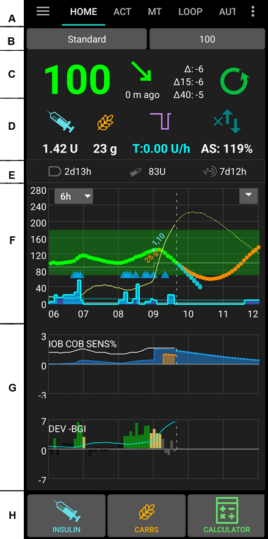

Questa è la prima schermata che si incontra quando si apre **AAPS**, e contiene la maggior parte delle informazioni di cui si avrà bisogno di giorno in giorno.

### Sezione A - Schede

* Navigare tra i vari moduli **AAPS**.
* In alternativa è possibile cambiare schermata scorrendo a sinistra o a destra.
* Le schede visualizzate possono essere selezionate nel configuratore strutturale [](#Config-Builder-tab-or-hamburger-menu).

(aaps-screens-profile--target)=

### Sezione B - Profilo e target

#### Profilo corrente

Il profilo corrente è visualizzato nella barra sinistra.

Premere brevemente sulla barra del profilo per visualizzare i dettagli del profilo. Tenere premuto sulla barra del profilo per [passare tra i diversi profili](../DailyLifeWithAaps/ProfileSwitch-ProfilePercentage.md).

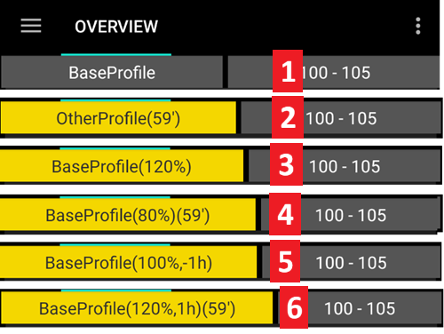

1. Visualizzazione normale con attivazione del profilo standard.
2. Cambio profilo con durata residua di 59 minuti.
3. Cambio profilo con una percentuale specifica del 120%.
4. Cambio profilo con una percentuale specifica dell'80% e una durata residua di 59 minuti.
5. Cambio profilo con uno sfasamento temporale di -1 ora.
6. Cambio profilo con una percentuale specifica del 120%, sfasamento temporale di 1 ora e una durata residua di 59 minuti.

#### Target

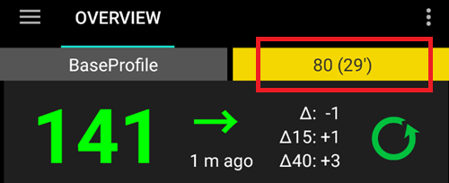

Il livello target corrente di glicemia è visualizzato nella barra destra.

Premere brevemente sulla barra del target per impostare un **[Target Temporaneo](../DailyLifeWithAaps/TempTargets.md)**.

Se è impostato un target temporaneo, la barra diventa gialla e il tempo rimanente in minuti è mostrato tra parentesi.

(AapsScreens-visualization-of-dynamic-target-adjustment)=
#### Visualizzazione della regolazione dinamica del target


Quando si utilizza l'algoritmo [SMB](#Config-Builder-aps) e la funzionalità [Autosens](#Open-APS-features-autosens), **AAPS** può regolare dinamicamente il target in base alla sensibilità.

Abilitare una o entrambe le seguenti opzioni in [Preferenze > Impostazioni OpenAPS SMB](#Preferences-openaps-smb-settings):
   * "la sensibilità aumenta il target" e/o
   * "la resistenza abbassa il target"

Se **AAPS** rileva resistenza o sensibilità, il target cambierà rispetto a quello impostato nel profilo. Quando modifica il target glicemico, lo sfondo diventerà verde.

(AapsScreens-section-c-bg-loop-status)=
### Sezione C - Glicemia e stato del loop

#### Glicemia corrente
La lettura più recente della glicemia dal CGM è mostrata sul lato sinistro.

Il colore del valore della glicemia riflette lo stato rispetto al [range](#Preferences-range-for-visualization) definito.
   * verde = nel range
   * rosso = sotto il range
   * giallo = sopra il range

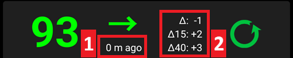

I blocchi al centro mostrano:

1.  quanti minuti sono passati dall'ultima lettura **CGM**
2.  differenze con l'ultima lettura: Δ, e con la media degli ultimi 15 e 40 minuti (Δ15 e Δ40).  
   I delta lunghi sono calcolati come valore medio dei delta passati, indicando il cambiamento medio.

(AapsScreens-loop-status)=
#### Loop status


Sul lato destro, un'icona mostra lo stato del loop:
1. Cerchio verde = [loop chiuso](#KeyAapsFeatures-ClosedLoop), loop in esecuzione
2. Cerchio viola con linea tratteggiata = [sospensione per glucosio basso (LGS)](#KeyAapsFeatures-LGS)
3. Cerchio rosso = loop disabilitato (non funzionante in modo permanente)
4. Cerchio rosso = loop sospeso (temporaneamente in pausa ma l'insulina basale verrà somministrata) - il tempo rimanente è mostrato sotto l'icona
5. Cerchio grigio = microinfusore disconnesso (temporaneamente nessun dosaggio di insulina) - il tempo rimanente è mostrato sotto l'icona
6. Cerchio arancione = super bolo in esecuzione - il tempo rimanente è mostrato sotto l'icona
7. Cerchio blu con linea tratteggiata = [loop aperto](#KeyAapsFeatures-OpenLoop)

Premere brevemente o tenere premuto sull'icona per aprire la finestra di dialogo del loop per cambiare modalità (Chiuso, Sospensione per glucosio basso, Aperto o Disabilitato), sospendere/riabilitare il loop o disconnettere/riconnettere il microinfusore.

   * Se si preme brevemente sull'icona del loop, è richiesta una conferma dopo la selezione nella finestra di dialogo del loop

   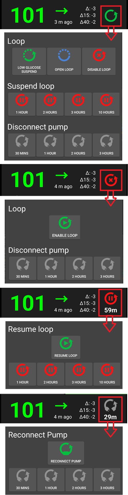

(aaps-screens-bg-warning-sign)=
#### BG warning sign

Se per qualsiasi motivo ci sono problemi nelle letture della glicemia che **AAPS** riceve, si otterrà un segnale di avviso sotto il numero della glicemia nella schermata principale.

##### Avviso rosso: Dati glicemici duplicati

Il segnale di avviso rosso segnala che è necessario intervenire immediatamente: si stanno ricevendo **dati glicemici duplicati**, che impediscono al loop di funzionare correttamente. Di conseguenza, il loop verrà disabilitato finché il problema non viene risolto.

```{admonition} Your loop is not running
:class: note
Il loop non è in esecuzione finché non si risolve questo problema!
```

  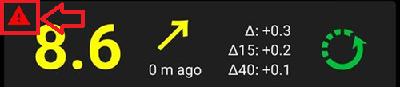

È necessario scoprire perché si ricevono glicemie duplicate:
* Il bridge Dexcom è abilitato sul sito Nightscout? Disabilitare il bridge andando nel pannello di amministrazione dell'istanza Nightscout, modificare la variabile "enable" e rimuovere la parte "bridge". (Per heroku [i dettagli sono disponibili qui](https://nightscout.github.io/troubleshoot/troublehoot/#heroku-settings).)
* Più fonti caricano la glicemia su Nightscout? Se si utilizza l'app BYODA, abilitare il caricamento in **AAPS** ma non abilitarlo in xDrip+, se lo si usa.
* Ci sono follower che potrebbero ricevere la glicemia e caricarla nuovamente sul sito Nightscout?
* Ultima risorsa: in **AAPS**, andare in [Preferenze > NSClient](#Preferences-nsclient), selezionare le impostazioni di sincronizzazione e disabilitare l'opzione "Accetta dati CGM da NS".

Per rimuovere immediatamente l'avviso e far riprendere il loop, è necessario eliminare manualmente alcune voci dalla scheda Dexcom/xDrip+.

Tuttavia, quando ci sono molti duplicati, potrebbe essere più semplice:
* [eseguire il backup delle impostazioni](../Maintenance/ExportImportSettings.md),
* reimpostare il database nel menu di manutenzione e
* ../Maintenance/ExportImportSettings.md

##### Avviso giallo

Il segnale di avviso giallo indica che la glicemia è arrivata a intervalli di tempo irregolari o che alcune letture mancano. Premendo il segnale, il messaggio indica "Utilizzati dati ricalcolati".

  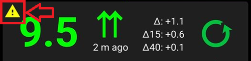

Di solito non è necessario intraprendere alcuna azione. Il loop chiuso continuerà a funzionare!

Poiché la sostituzione del sensore interrompe il flusso costante di dati glicemici, un avviso giallo dopo la sostituzione del sensore è normale e non deve preoccupare.

Nota speciale per gli utenti di Libre:

* Ogni Libre accumula un ritardo di uno o due minuti ogni poche ore, il che significa che non si ottiene mai un flusso perfetto di intervalli glicemici regolari.
* Inoltre, le letture irregolari interrompono il flusso continuo.
* Pertanto, il segnale di avviso giallo sarà "sempre attivo" per gli utenti di Libre.

*Nota*: Fino a 30 ore vengono prese in considerazione per i calcoli di **AAPS**. Quindi, anche dopo aver risolto il problema originale, potrebbero volerci circa 30 ore affinché il triangolo giallo scompaia dopo l'ultimo intervallo irregolare verificatosi.

#### Modalità semplice

Un'icona con il viso di un bambino in alto a destra di questa sezione indica che si è in [Modalità semplice](#preferences-simple-mode).

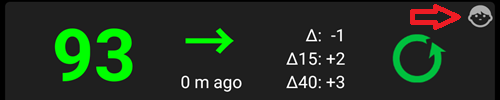

### Sezione D - IOB, COB, BR e AS

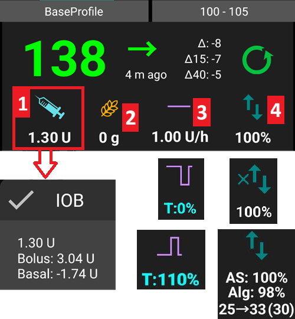

1. **Siringa**: insulina attiva (IOB) - quantità di insulina attiva nel corpo<br/> Il valore IOB sarebbe zero se solo la basale standard fosse in esecuzione e non ci fosse insulina residua da boli precedenti.
   - L'IOB può essere negativo se ci sono stati periodi recenti di basale ridotta.
   - Premere l'icona per vedere la suddivisione tra insulina da bolo e basale

2. Carboidrati necessari
3. **Linea viola**: basale corrente. L'icona cambia per riflettere le variazioni temporanee della basale (piatta al 100%)
   * Premere l'icona per vedere la basale di base e i dettagli di eventuali basali temporanee (inclusa la durata residua)
4. **Frecce su e giù**: indica lo stato delle funzionalità di sensibilità dinamica ([Autosens](#Open-APS-features-autosens) o [DynamicISF](#Open-APS-features-DynamicISF)): abilitato o disabilitato. In questa sezione possono essere mostrati diversi valori:
  - AS: valore Autosens. Mostrato anche se Autosens è disabilitato (solo a scopo informativo). Mostrato anche quando DynISF è attivato, sebbene non abbia effetto.
  - Alg: valore DynamicISF (basato su TDD). Ulteriori informazioni nell'ultima riga della pagina [DynamicISF](#Open-APS-features-DynamicISF).

(aaps-screens-carbs-required)=
#### Carbs required

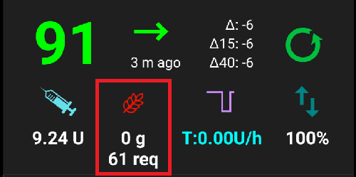

I suggerimenti di carboidrati vengono dati quando il sistema di riferimento rileva che sono necessari carboidrati.

Questo accade quando l'algoritmo oref ritiene di non poter rimediare con una basale temporanea a zero e sarà necessario assumere carboidrati per correggere.

Le notifiche di carboidrati sono molto più sofisticate di quelle del calcolatore del bolo. Si potrebbe vedere un suggerimento di carboidrati mentre il calcolatore del bolo non mostra carboidrati mancanti.

Le notifiche di carboidrati necessari possono essere inviate a Nightscout, nel qual caso un annuncio verrà mostrato e trasmesso.

### Sezione E - Luci di stato

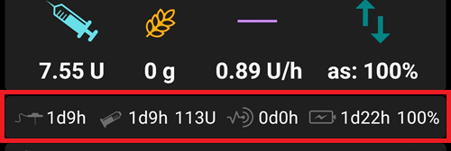

Le luci di stato forniscono un avviso visivo per:
* età della cannula
* età dell'insulina (giorni di utilizzo del serbatoio)
* livello del serbatoio (unità)
* età del sensore
* età e livello della batteria (%)

Se viene superata la soglia di avviso, i valori verranno mostrati in giallo.

Se viene superata la soglia critica, i valori verranno mostrati in rosso.

Le impostazioni possono essere modificate in [Preferenze > Panoramica > Luci di stato](#Preferences-status-lights).

Depending on the pump you use, you may not have all of these icons.

(aaps-screens-main-graph)=
### Sezione F - Grafico principale

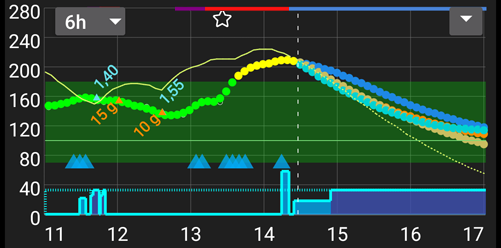

Il grafico mostra la glicemia come letta dal monitor del glucosio (CGM).

Utilizzare il menu in alto a sinistra del grafico o tenere premuto in qualsiasi punto del grafico per modificare la scala temporale. È possibile scegliere tra 6, 12, 18 o 24 ore.

L'area verde riflette il range target.

Sul grafico sono mostrate anche le seguenti informazioni:
* Boli: triangolo blu sulla curva della glicemia e quantità di insulina
* Voci dei carboidrati: triangolo arancione sulla curva della glicemia e quantità di carboidrati
* Target come definito nel profilo o modificato da un target temporaneo: linea verde
* Cambi di profilo: stella in cima al grafico
* Stato del loop: linea colorata in cima al grafico quando lo stato è diverso dal loop chiuso - vedere [Stato del loop](#AapsScreens-loop-status) per i colori
* [SMB](#Open-APS-features-super-micro-bolus-smb) - se abilitato in [Preferenze > OpenAPS SMB](#Preferences-openaps-smb-settings): triangoli blu in fondo al grafico

(AapsScreens-activate-optional-information)=
#### Attivare informazioni opzionali

Utilizzando la freccia in alto a destra, è possibile attivare queste informazioni opzionali:
* Previsioni (vedere sotto)
* Trattamenti: note inserite nella scheda azioni: punto grigio, arancione o rosso a seconda della gravità, nonché calibrazioni con pungidito: punto rosso
* Basali
  * Come definito nel profilo: linea blu tratteggiata in fondo al grafico
  * Basale effettivamente erogata: linea blu continua con sfondo blu
* Attività - curva di attività dell'insulina: linea gialla

Per visualizzare queste informazioni, fare clic sul triangolo sul lato destro del grafico principale. Per il grafico principale sono disponibili solo le quattro opzioni sopra la riga "Grafico   1 2 3 4".

   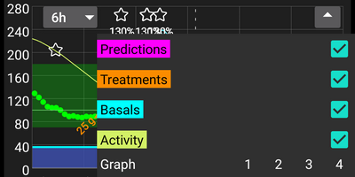

(aaps-screens-prediction-lines)=
#### Linee di previsione

* Linea **arancione**: [COB](CobCalculation) (il colore è generalmente usato per rappresentare COB e carboidrati)

  Questa linea di previsione mostra dove andrà la glicemia (non il COB stesso!) in base alle impostazioni del **Profilo** corrente, assumendo che le deviazioni dovute all'assorbimento dei carboidrati rimangano costanti. Questa linea appare solo se ci sono COB noti.
* Linea **blu scuro**: IOB (il colore è generalmente usato per rappresentare IOB e insulina)

  Questa linea di previsione mostra cosa accadrebbe sotto l'influenza della sola insulina. Ad esempio se si è somministrata dell'insulina e poi non si è mangiato nessun carboidrato.
* Linea **blu chiaro**: zero-temp (glicemia prevista se si impostasse una basale temporanea allo 0%)

  Questa linea di previsione mostra come cambierebbe la traiettoria della glicemia se il microinfusore interrompesse tutta l'erogazione di insulina (TBR 0%).

   *Questa linea appare solo quando si utilizza l'algoritmo [SMB](#Config-Builder-aps).*
* Linea **giallo scuro**: [UAM](#SensitivityDetectionAndCob-sensitivity-oref1) (pasti non annunciati)

  I pasti non annunciati significano che viene rilevato un aumento significativo dei livelli di glucosio dovuto a pasti, adrenalina o altre influenze. La linea di previsione è simile alla **linea COB arancione**, ma assume che le deviazioni si attenueranno a una velocità costante (estendendo il tasso di riduzione corrente).

   *Questa linea appare solo quando si utilizza l'algoritmo [SMB](#Config-Builder-aps).*

* Linea **arancione scuro**: aCOB (assorbimento accelerato dei carboidrati)

   Simile al COB, ma assumendo un tasso di assorbimento dei carboidrati statico di 10 mg/dL/5m (-0,555 mmol/l/5m). Deprecata e di utilità limitata.

   *Questa linea appare solo quando si utilizza il vecchio algoritmo [AMA](#Config-Builder-aps).*


Di solito la curva glicemica reale finisce nel mezzo di queste linee, o vicino a quella che fa le ipotesi più simili alla propria situazione.

#### Basali

Una linea **blu continua** mostra l'erogazione basale del microinfusore e riflette l'erogazione effettiva nel tempo.

La linea **blu tratteggiata** è quella che sarebbe la basale se non ci fossero regolazioni basali temporanee (TBR).

Quando viene erogata la basale standard, l'area sotto la curva è mostrata in blu scuro. Quando la basale viene temporaneamente regolata (aumentata o diminuita), l'area sotto la curva è mostrata in blu chiaro.

#### Attività

La linea **gialla sottile** mostra l'attività dell'insulina.

Si basa sulla caduta attesa della glicemia dell'insulina nel sistema se non fossero presenti altri fattori (come i carboidrati).

(AapsScreens-section-g-additional-graphs)=
### Sezione G - Grafici aggiuntivi

È possibile attivare fino a quattro grafici aggiuntivi sotto il grafico principale. In [Modalità semplice](#preferences-simple-mode), i grafici aggiuntivi sono preimpostati e non possono essere modificati. Disattivare la **Modalità semplice** se si desidera impostare la propria configurazione di grafici aggiuntivi.

Per aprire le impostazioni per i grafici aggiuntivi, fare clic sul triangolo sul lato destro del [grafico principale](#aaps-screens-main-graph) e scorrere verso il basso.

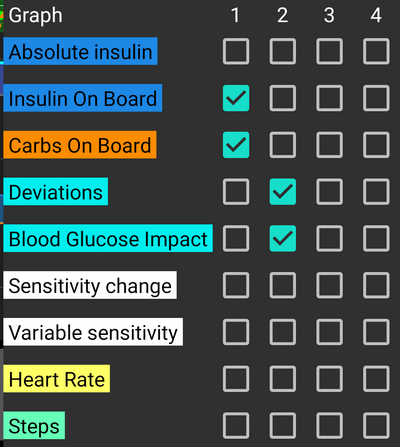

Per configurare i grafici aggiuntivi, selezionare le caselle corrispondenti ai dati che si desidera vedere su ciascun grafico.

La maggior parte degli utenti trova adeguata la seguente configurazione di grafici aggiuntivi:
* Grafico 1 con IOB, COB, variazione della sensibilità
* Grafico 2 con Deviazioni e BGI.

#### Insulina assoluta

Insulina attiva inclusi boli **e basale**.

#### Insulina attiva (IOB)

Mostra l'insulina attiva nel corpo (= insulina attiva nel corpo). Include l'insulina da bolo e la basale temporanea (**ma esclude le basali impostate nel profilo**).

Se non ci fossero [SMB](#Open-APS-features-super-micro-bolus-smb), nessun bolo e nessun TBR durante il tempo DIA, questo valore sarebbe zero.

L'IOB può essere negativo se non si hanno boli residui e una basale temporanea zero/bassa per un periodo più lungo.

Il decadimento dipende dalle impostazioni del [DIA e del profilo insulinico](../SettingUpAaps/YourAapsProfile.md).

#### Carbs On Board

Mostra i carboidrati attivi nel corpo (= carboidrati attivi, non ancora decaduti nel corpo).

Il decadimento dipende dalle [deviazioni rilevate dall'algoritmo](../DailyLifeWithAaps/CobCalculation.md).

Se rileva un assorbimento di carboidrati superiore al previsto, verrà somministrata insulina e questo aumenterà l'IOB (più o meno, a seconda delle impostazioni di sicurezza).

#### Variazione della sensibilità

Mostra la sensibilità rilevata da [Autosens](#Open-APS-features-autosens).

La sensibilità è un calcolo della sensibilità all'insulina come risultato di esercizio fisico, ormoni ecc.

Nota: è necessario essere all'[Obiettivo 8](#objectives-objective8) affinché il Rilevamento della sensibilità/[Autosens](#Open-APS-features-autosens) regoli automaticamente la quantità di insulina erogata. Prima di raggiungere tale obiettivo, la linea nel grafico viene visualizzata solo a scopo informativo.

### Sensibilità variabile

Mostra la sensibilità calcolata da [DynamicISF](../DailyLifeWithAaps/DynamicISF.md). Popolata solo se si utilizza questa funzione.

(screen-heart-rate-steps)=
#### Frequenza cardiaca e Passi

Questi dati possono essere disponibili quando si utilizza uno [smartwatch Wear](../WearOS/WearOsSmartwatch.md). Abilitarli nell'app Wear di **AAPS** e concedere il permesso per i dati sanitari.

#### Deviazioni
* Le barre **grigie** mostrano una deviazione dovuta ai carboidrati.
* Le barre **verdi** mostrano che la glicemia è più alta di quanto previsto dall'algoritmo. Le barre verdi vengono utilizzate per aumentare la resistenza in [Autosens](#Open-APS-features-autosens).
* Le barre **rosse** mostrano che la glicemia è più bassa di quanto previsto dall'algoritmo. Le barre rosse vengono utilizzate per aumentare la sensibilità in [Autosens](#Open-APS-features-autosens).
* Le barre **gialle** mostrano una deviazione dovuta a UAM.
* Le barre **nere** mostrano piccole deviazioni non prese in considerazione per la sensibilità

#### Impatto sulla glicemia (BGI)

Questa linea mostra il grado in cui la glicemia "dovrebbe" salire o scendere basandosi solo sull'attività dell'insulina.

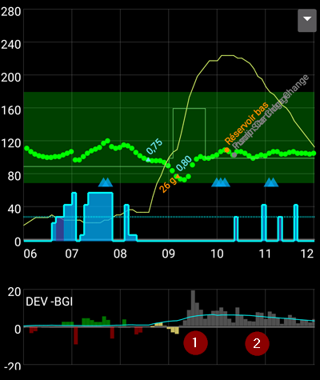

È una buona combinazione visualizzare questa linea insieme alle barre delle Deviazioni. Condividono la stessa scala, ma è diversa da quella degli altri dati opzionali, quindi è una buona idea visualizzarle su un grafico separato, come mostrato sopra. Confrontare la linea BGI e le barre delle Deviazioni è un altro modo per capire come fluttua la **glicemia**. In questo caso, al momento contrassegnato con **1**, le barre delle Deviazioni sono maggiori della linea BGI, indicando che la glicemia sta salendo. Successivamente, durante le ore contrassegnate con **2**, BGI e DEV sono praticamente allineati, indicando che la glicemia è stabile.

### Sezione H - Pulsanti

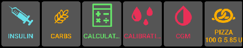

I pulsanti Insulina e Carboidrati sono quasi sempre visibili. Se la connessione al microinfusore viene persa, il pulsante Calcolatore non sarà visibile.

Altri pulsanti possono essere configurati in [Preferenze > Panoramica > Pulsanti](#Preferences-buttons).

Informazioni sull'uso dei pulsanti Insulina, Carboidrati e Calcolatore: se abilitato in [Preferenze > Panoramica](#Preferences-show-notes-field-in-treatments-dialogs), il campo **Note** consente di inserire testo che verrà visualizzato sul grafico principale e potrà essere caricato su Nightscout, a seconda delle impostazioni del client NS.

(aaps-screens-buttons-insulin)=
#### Insulina

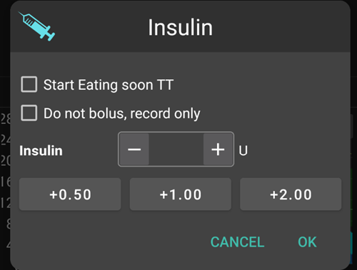

Per somministrare una certa quantità di insulina senza utilizzare il [calcolatore del bolo](#aaps-screens-bolus-wizard).

Selezionando la casella **Avvia TT presto pasto**, è possibile avviare automaticamente il [target temporaneo "presto pasto"](#TempTargets-eating-soon-temp-target).

Se non si desidera somministrare un bolo attraverso il microinfusore ma registrare una quantità di insulina (ad es. insulina somministrata con penna), selezionare la casella corrispondente. Selezionando questa casella, si ottiene un campo aggiuntivo "Sfasamento temporale", che può essere utilizzato per registrare un'iniezione di insulina effettuata nel passato.

È possibile usare i pulsanti per aumentare rapidamente la quantità di insulina. I valori di incremento possono essere modificati in [Preferenze > Panoramica > Pulsanti](#Preferences-buttons).

Il pulsante insulina può essere utilizzato anche quando il microinfusore è sospeso, ad es. per registrare l'insulina iniettata con una penna. In questo caso, l'intestazione verrà mostrata in giallo e la casella "Non effettuare il bolo, registra solo" non potrà essere deselezionata.

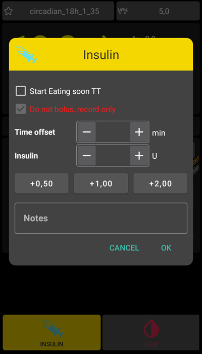

#### Carboidrati

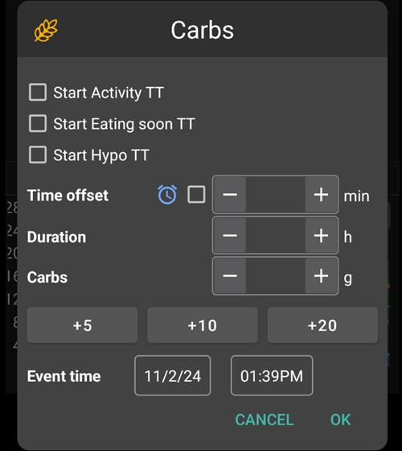

Per registrare i carboidrati senza somministrare un bolo.

Alcuni [target temporanei preimpostati](#TempTargets-hypo-temp-target) possono essere impostati direttamente selezionando la casella.

**Sfasamento temporale**: Quando si mangeranno/si sono mangiati i carboidrati (in minuti).

**Durata**: Da utilizzare per i ["carboidrati estesi"](ExtendedCarbs)

È possibile usare i pulsanti per aumentare rapidamente la quantità di carboidrati. I valori di incremento possono essere modificati in [Preferenze > Panoramica > Pulsanti](#Preferences-buttons).


#### Calcolatore
Vedere la sezione Assistente bolo [qui sotto](#aaps-screens-bolus-wizard).

#### Calibrazioni
Invia una calibrazione a xDrip+ o apre la finestra di dialogo di calibrazione Dexcom.

Deve essere attivato in [Preferenze > Panoramica > Pulsanti](#Preferences-buttons).

#### CGM
Apre xDrip+.

Il pulsante Indietro torna ad **AAPS**.

Deve essere attivato in [Preferenze > Panoramica > Pulsanti](#Preferences-buttons).

#### Procedura guidata rapida

Inserire facilmente la quantità di carboidrati e impostare le basi del calcolo.

I dettagli vengono impostati in [Preferenze > Panoramica > Impostazioni Procedura guidata rapida](#Preferences-quick-wizard).

(aaps-screens-bolus-wizard)=
## Assistente bolo

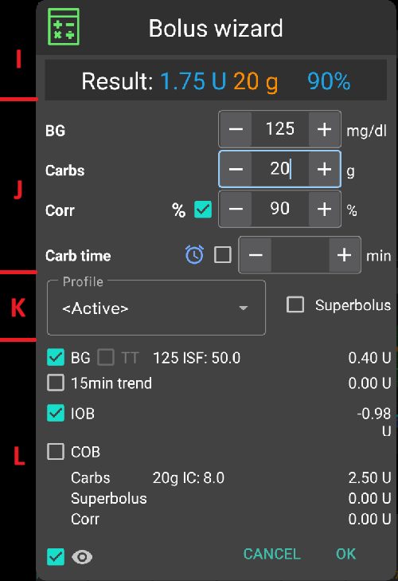

Quando si desidera effettuare un bolo pasto, questo è il luogo da cui normalmente lo si effettua.

### Sezione I

Mostra il bolo calcolato.

Se la quantità di insulina attiva supera già il bolo calcolato, verrà visualizzata solo la quantità di carboidrati ancora necessari.

(AapsScreens-section-j)=
### Sezione J

Il campo glicemia è normalmente già compilato con l'ultima lettura del CGM. Se non si ha un CGM funzionante, sarà vuoto.

Nel campo **Carboidrati**, si aggiunge la stima della quantità di carboidrati - o equivalente - per cui si desidera somministrare il bolo.

Il campo **Corr** è per quando si desidera modificare il dosaggio finale per qualche motivo.

Il campo **Orario carboidrati** è per il pre-bolo, in modo da poter comunicare al sistema che ci sarà un ritardo prima che i carboidrati siano attesi. È possibile inserire un numero negativo in questo campo se si effettua il bolo per carboidrati già assunti.

**Promemoria pasto**: Per i carboidrati futuri, la casella di allarme può essere selezionata (ed è selezionata per impostazione predefinita quando viene inserito un orario futuro) in modo da poter essere ricordati all'orario indicato quando mangiare i carboidrati inseriti in **AAPS**.

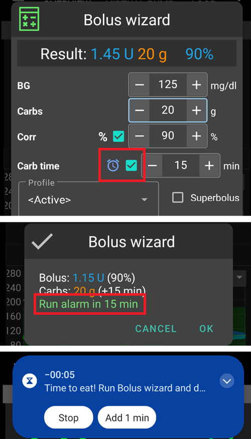

### Sezione K

**Profilo** consente di selezionare un profilo diverso da quello corrente, per effettuare il calcolo dell'insulina necessaria. Questa selezione del profilo si applica solo per il bolo corrente, non è un cambio di profilo.

**Super bolo** è dove l'insulina basale per le prossime due ore viene aggiunta al bolo immediato e viene emessa una TBR zero per le due ore successive per recuperare l'insulina extra. L'opzione viene mostrata solo quando "Abilita Super bolo nell'assistente" è impostato in [Preferenze > Panoramica > Impostazioni avanzate](#Preferences-advanced-settings-overview). L'idea è di erogare l'insulina prima e sperabilmente ridurre i picchi.

Per i dettagli visitare [diabetesnet.com](https://www.diabetesnet.com/diabetes-technology/blue-skying/super-bolus/).

### Sezione L

Dettagli del calcolo del bolo dell'assistente.

È possibile deselezionare qualsiasi elemento che non si desidera includere, ma normalmente non si vorrà farlo.

Per ragioni di sicurezza, la **casella TT deve essere selezionata manualmente** se si desidera che l'assistente bolo calcoli in base a un target temporaneo esistente.

#### Combinazioni di COB e IOB e il loro significato
* Per ragioni di sicurezza, la casella IOB non può essere deselezionata quando la casella COB è selezionata, poiché si potrebbe correre il rischio di troppa insulina in quanto **AAPS** non tiene conto di quella già somministrata.
* Se si seleziona COB e IOB, verranno presi in considerazione i carboidrati non assorbiti non ancora coperti dall'insulina + tutta l'insulina erogata come TBR o SMB.
* Se si seleziona IOB senza COB, **AAPS** tiene conto dell'insulina già erogata ma non la compenserà con i carboidrati ancora da assorbire. Questo porta a un avviso di "carboidrati mancanti".
* Se si effettua un bolo per **cibo aggiuntivo** poco dopo un bolo pasto (ad es. dolce aggiuntivo), può essere utile **deselezionare tutte le caselle**. In questo modo vengono aggiunti solo i nuovi carboidrati poiché il pasto principale potrebbe non essere stato assorbito, quindi IOB non corrisponderà accuratamente al COB poco dopo un bolo pasto.

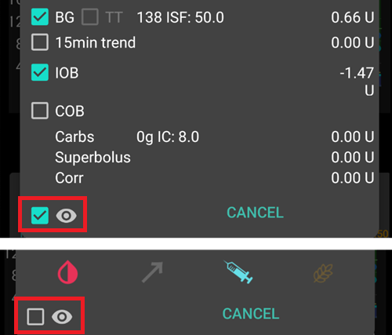

La casella vicino all'occhio consente di scegliere tra la vista dettagliata, con i numeri che entrano nel calcolo per ogni elemento, o la vista semplice con le icone. Premendo su un'icona si abilita/disabilita questa voce dal calcolo.

(AapsScreens-wrong-cob-detection)=
#### Rilevamento COB errato


Se si vede l'avviso sopra dopo aver utilizzato l'assistente bolo, **AAPS** ha rilevato che il valore COB calcolato potrebbe essere errato. Quindi, se si desidera effettuare di nuovo il bolo dopo un pasto precedente con COB, si dovrebbe essere consapevoli del rischio di sovradosaggio!

Per i dettagli, vedere i suggerimenti nella [pagina di calcolo del COB](#CobCalculation-detection-of-wrong-cob-values).

(screens-action-tab)=
## Scheda Azioni

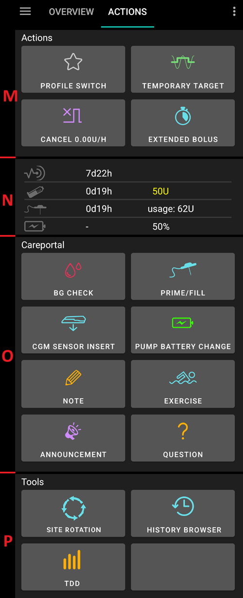

### Azioni - sezione M

Pulsante **[Cambio profilo](../DailyLifeWithAaps/ProfileSwitch-ProfilePercentage.md)** come alternativa alla pressione del [profilo corrente](#aaps-screens-profile--target) nella schermata principale.

Pulsante **[Target temporaneo](../DailyLifeWithAaps/TempTargets.md)** come alternativa alla pressione del [target corrente](#aaps-screens-profile--target) nella schermata principale.

Pulsante per avviare o annullare una basale temporanea. Si noti che il pulsante cambia da "BASALETEMP" a "ANNULLA x%" quando è impostata una basale temporanea.

Sebbene i [boli estesi](#extended-bolus-and-why-they-wont-work-in-closed-loop-environment) non funzionino davvero in un ambiente con loop chiuso, alcune persone chiedono comunque un'opzione per usare il bolo esteso.

 * Questa opzione è disponibile solo per i microinfusori Dana RS e Insight.
   * Il loop chiuso verrà automaticamente interrotto e cambiato in modalità loop aperto per la durata del bolo esteso.
   * Assicurarsi di leggere i [dettagli](../DailyLifeWithAaps/ExtendedCarbs.md) prima di utilizzare questa opzione.

(aaps-screens-careportal)=

### Careportal - sezione N

Visualizza informazioni su:

   * età e livello del sensore (percentuale batteria)
   * età e livello dell'insulina (unità)
   * età della cannula
   * età e livello della batteria del microinfusore (percentuale)

Verranno mostrate meno informazioni se viene utilizzato il **skin a bassa risoluzione** ([Preferenze > Generali > Skin](#Preferences-skin)).

(screens-sensor-level-battery)=
#### Livello sensore (batteria)

Funziona per i CGM con un trasmettitore aggiuntivo come MiaoMiao 2. (Tecnicamente il sensore deve inviare le informazioni sul livello a xDrip+.)

Le soglie possono essere impostate in [Preferenze > Panoramica > Luci di stato](#Preferences-status-lights).

### Careportal - sezione O

Controllo glicemia, preparazione/riempimento, inserimento sensore e sostituzione batteria del microinfusore sono la base dei dati visualizzati nella [sezione N](#aaps-screens-careportal).

Preparazione/Riempimento consente di registrare il cambio del sito del microinfusore e della cartuccia di insulina.

La sezione O riflette il careportal di Nightscout. Quindi esercizio, annuncio e domanda sono forme speciali di note.

### Strumenti - sezione P

(Aapsscreens-site-rotation)=

#### Rotazione del sito

Il pulsante Rotazione del sito apre la finestra di dialogo Rotazione del sito in modalità Visualizza:

- È possibile selezionare se si desidera vedere solo i siti della cannula, solo i siti del sensore, o entrambi con le caselle di controllo superiori
- Tutti gli eventi di cambio cannula e cambio sensore degli ultimi 45 giorni sono disponibili.
- Fare clic su un'area del sito, o su una voce nell'elenco sottostante per filtrare l'elenco con solo le voci nell'area selezionata. L'area selezionata verrà evidenziata in verde chiaro.
- È possibile aprire la vista Modifica per aggiornare la posizione del sito, la freccia o il commento associato a ciascuna voce

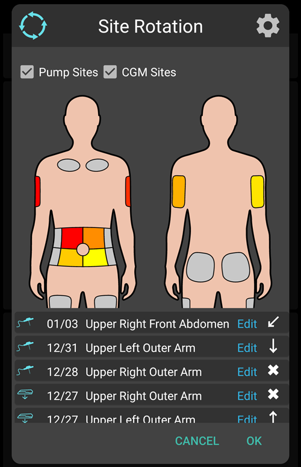

- La scheda Impostazioni (ingranaggio in alto a destra) consente di regolare la visualizzazione del paziente (Uomo, Donna o Bambino) e di selezionare se si desidera gestire solo i siti del microinfusore, solo i siti del sensore o entrambi.

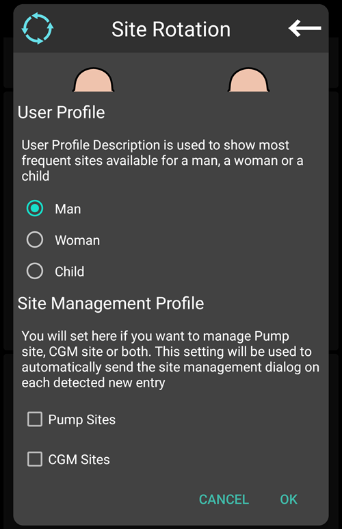

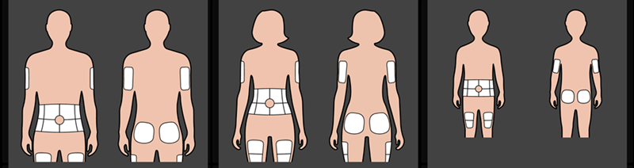

*Nota: questa impostazione verrà utilizzata per aprire automaticamente o meno la finestra di dialogo Rotazione del sito (modalità Modifica) quando viene effettuata una nuova voce dal "pulsante Preparazione/Riempimento" o dal "pulsante Inserimento sensore CGM"*

- Per il cambio del sito effettuato direttamente dal microinfusore, è necessario aprire la modalità Visualizza e modificare la nuova voce per selezionare Posizione e Freccia

La modalità Modifica consente di selezionare Posizione, Freccia e Nota associata alla voce selezionata:

- Il tipo di voce è visibile nella parte superiore della modalità Modifica (icona cannula o icona sensore)
- È necessario selezionare la scheda Fronte o Retro e poi l'area
- Una volta selezionato un sito (evidenziato in verde), si vedrà nell'elenco sottostante la lista di tutte le voci degli ultimi 45 giorni in questo sito

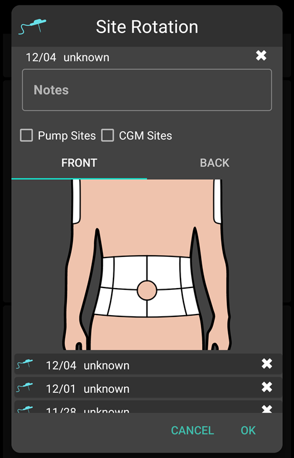

- È possibile regolare una freccia opzionale con un clic sull'icona della freccia piccola in alto (la freccia consente di specificare la sotto-posizione, da 2 a 9, o l'orientamento del Pod)

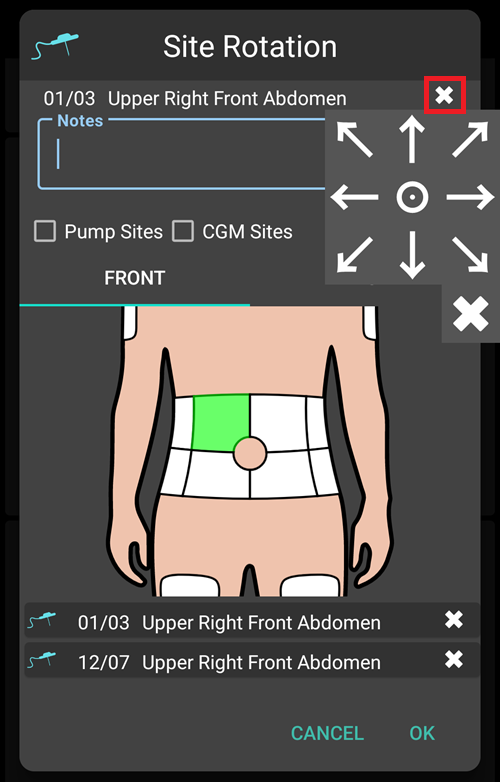

- È possibile anche regolare i commenti relativi al sito selezionato
- Dopo la conferma, il sito viene registrato

Il filtraggio può essere effettuato graficamente sull'immagine, o facendo clic su un evento terapeutico nell'elenco. Per rimuovere il filtro, fare clic sull'immagine fuori da qualsiasi sito

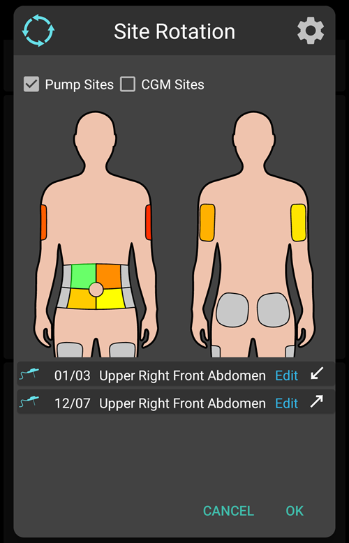

#### Visualizzatore cronologia

Consente di scorrere la [cronologia](../Maintenance/Reviewing.md) di **AAPS**.

#### TDD

Dose giornaliera totale = bolo + basale al giorno

Alcuni medici usano - specialmente per chi inizia con il microinfusore - un rapporto basale-bolo di 50:50.

Pertanto, il rapporto viene calcolato come TDD / 2 * TBB (Basale base totale = somma della basale nell'arco di 24 ore).

Altri preferiscono un intervallo dal 32% al 37% del TDD per il TBB.

Come la maggior parte di queste regole empiriche, ha una validità reale limitata. Nota: il diabete di ciascuno può variare!

(AapsScreens-insulin-profile)=
## Insulin Profile


Mostra il profilo di attività dell'insulina scelta nel [Costruttore di configurazione > Insulina](#Config-Builder-insulin). Le curve varieranno in base al [DIA](#your-aaps-profile-duration-of-insulin-action) e al tempo al picco.

La linea **viola** mostra quanta insulina rimane dopo che è stata iniettata mentre decade nel tempo e la linea **blu** mostra quanto è attiva.

Vedere [Profilo AAPS > Durata dell'azione dell'insulina](#your-aaps-profile-duration-of-insulin-action) per saperne di più su cos'è e come impostarla.

## Pump Status
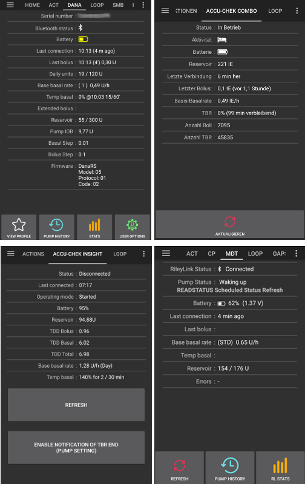

* Varie informazioni sullo stato del microinfusore. Le informazioni visualizzate dipendono dal modello del microinfusore.
* Vedere la [pagina dei microinfusori](../Getting-Started/CompatiblePumps.md) per i dettagli.

## Loop, AMA / SMB

Queste schede mostrano i dettagli sui calcoli dell'algoritmo e il motivo per cui **AAPS** agisce nel modo in cui lo fa.

I calcoli vengono eseguiti ogni volta che il sistema riceve una nuova lettura dal CGM.

Per ulteriori dettagli vedere la [sezione APS nella pagina del costruttore di configurazione](#Config-Builder-aps).

(aaps-screens-profile)=
## Profile
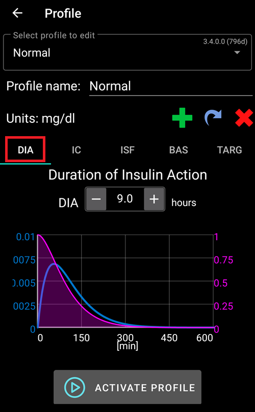

Il profilo contiene informazioni sulle impostazioni individuali del diabete, vedere la pagina dettagliata **[Profilo](../SettingUpAaps/YourAapsProfile.md)** per ulteriori informazioni.

## Automazione

Vedere la pagina dedicata [qui](../DailyLifeWithAaps/Automations.md).

## NSClient
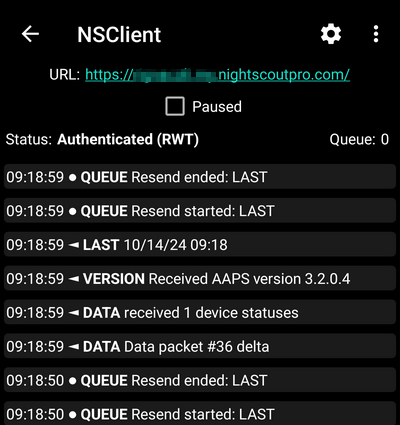

Questa pagina visualizza lo stato della connessione con il sito Nightscout.

Le impostazioni possono essere modificate in [Preferenze > Client NS](#Preferences-nsclient).

Per la risoluzione dei problemi vedere questa [pagina](../GettingHelp/TroubleshootingNsClient.md).

## Fonte BG - xDrip+, BYODA...
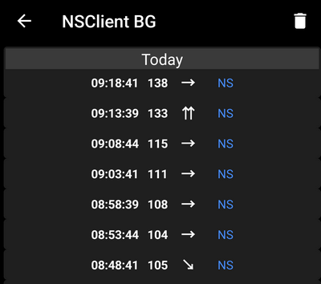

A seconda delle impostazioni dell'origine BG, questa scheda ha un nome diverso.

Mostra la cronologia delle letture CGM e offre l'opzione di rimuovere una lettura in caso di errore (ad es. bassa per compressione) o letture duplicate.

(aaps-screens-treatments)=
## Trattamenti

Questa vista è accessibile premendo i 3 punti a destra del menu, quindi Trattamenti. Non è possibile visualizzarla nel menu principale tramite il Costruttore di configurazione. In questa vista, è possibile visualizzare e modificare la cronologia dei seguenti trattamenti:

* Bolo e carboidrati
* [Extended bolus](#Extended-Carbs-extended-bolus-and-switch-to-open-loop-dana-and-insight-pump-only)
* Basale temporanea
* [Temporary target](../DailyLifeWithAaps/TempTargets.md)
* [Cambio profilo](../DailyLifeWithAaps/ProfileSwitch-ProfilePercentage.md)
* Careportal: note inserite tramite la scheda azioni e note nelle finestre di dialogo
* Modalità in esecuzione: cronologia dello stato del loop
* Voce utente: altre note non inviate a Nightscout

Nell'ultima colonna, la fonte dei dati per ciascuna riga è visualizzata in blu. Può essere:
* NS per Nightscout: i dati provengono da o sono stati registrati su Nightscout
* PH per Cronologia microinfusore: i dati sono stati elaborati dal microinfusore

(screens-bolus-carbs)=
### Bolo e carboidrati

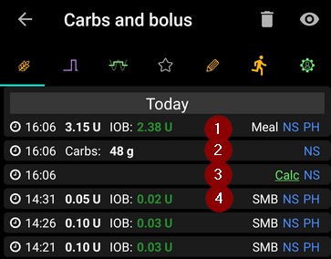

In questa scheda è possibile visualizzare il registro di boli e carboidrati. Ogni bolo (riga **1** e **4**) mostra l'IOB residuo associato accanto alla quantità di insulina. L'origine del bolo può essere:
* Pasto (inserito manualmente tramite i pulsanti Insulina, Procedura guidata rapida o Assistente bolo)
* SMB, quando si utilizza la funzionalità SMB

I carboidrati (riga **2**) sono memorizzati solo in Nightscout. Se si è utilizzato l'[Assistente bolo](#aaps-screens-bolus-wizard) per calcolare il dosaggio di insulina, è possibile premere il testo "Calc" (riga **3**) per vedere i dettagli su come è stato calcolato il bolo.

A seconda del microinfusore utilizzato, insulina e carboidrati possono essere mostrati in una singola riga, o risulteranno in più righe: una per il dettaglio del calcolo, una per i carboidrati, una per il bolo stesso.

La scheda trattamenti può essere utilizzata per correggere voci di carboidrati errate (_cioè_ si sono sovra- o sottostimati i carboidrati). Si noti che non è possibile modificare una voce esistente, è necessario seguire il seguente procedimento:

1. Verificare e annotare il COB e IOB effettivi nella schermata principale.
2. A seconda del microinfusore, nella scheda trattamenti i carboidrati potrebbero essere mostrati insieme all'insulina in una riga o come voce separata (ad es. con Dana RS).
3. Rimuovere la voce con la quantità di carboidrati errata. (Le versioni più recenti hanno un'icona cestino nella schermata trattamenti.  Premere l'icona cestino, selezionare le righe da rimuovere, quindi premere di nuovo l'icona cestino per finalizzare.)
4. Assicurarsi che i carboidrati siano stati rimossi correttamente controllando di nuovo il COB nella schermata principale.
5. Fare lo stesso per l'IOB se c'è solo una riga nella scheda trattamenti che include carboidrati e insulina.

   → Se i carboidrati non vengono rimossi come previsto e si aggiungono carboidrati aggiuntivi come spiegato qui (6.), il COB sarà troppo alto e ciò potrebbe portare a una somministrazione di insulina troppo elevata.

6. Inserire la quantità corretta di carboidrati tramite il pulsante carboidrati nella schermata principale e assicurarsi di impostare l'orario corretto dell'evento.
7. Se c'è solo una riga nella scheda trattamenti che include carboidrati e insulina, è necessario aggiungere anche la quantità di insulina. Assicurarsi di impostare l'orario corretto dell'evento e verificare l'IOB nella schermata principale dopo aver confermato la nuova voce.

### Temp Basal

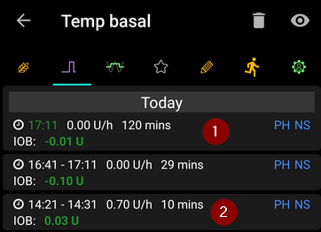

Le **basali temporanee** applicate dal loop sono mostrate qui. Quando c'è ancora un impatto sull'IOB per una voce, le informazioni vengono mostrate in verde. Può essere:
* IOB positivo se la basale temporanea era superiore a quella impostata nel Profilo (riga **2**)
* IOB negativo per una zero-temp o se la basale temporanea era inferiore a quella impostata nel Profilo (riga **1**)

L'eliminazione delle voci influisce solo sui rapporti in Nightscout e probabilmente altererà l'IOB reale - non è raccomandato.

A sinistra di una riga, una S rossa significa "Sospeso": accade quando la basale non è attualmente erogata. Questa è una situazione normale durante il processo di cambio del pod, ad esempio.

### Temporary target

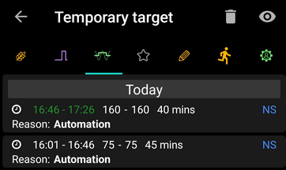

La cronologia dei target temporanei può essere vista qui.

### Profile Switch


La cronologia dei cambi di profilo può essere vista qui. Si potrebbe vedere più voci ogni volta che si cambia profilo: la riga **1**, memorizzata in Nightscout ma non nella Cronologia microinfusore, corrisponde alla richiesta di cambio di profilo effettuata dall'utente. La riga **2**, memorizzata sia in NS che in PH, corrisponde al cambio effettivo.

L'eliminazione delle voci influisce solo sui rapporti in Nightscout e non cambierà mai effettivamente il profilo corrente.

È possibile utilizzare il pulsante **Clona** mostrato nella riga **1** per fare una copia di un **Cambio profilo**. Vedere [Profilo AAPS > Gestire i profili](#your-aaps-profile-clone-profile-switch) per ulteriori informazioni.

(AapsScreens-running-mode)=
### Running mode

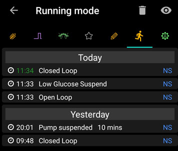

Questa scheda mostra la cronologia delle modifiche dello [stato del loop](#AapsScreens-loop-status): loop aperto, chiuso, sospeso.

### Care portal

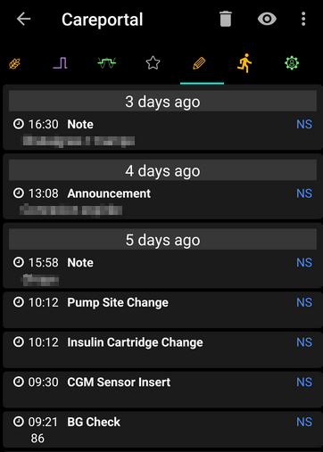

Questa scheda mostra tutte le note e gli avvisi registrati in Nightscout.

(aaps-screens-running-mode)=

## Visualizzatore cronologia

Questa vista è accessibile premendo i 3 punti a destra del menu, quindi Cronologia. Non è possibile inserirla nel menu principale tramite il Costruttore di configurazione. È anche accessibile tramite un pulsante in fondo alla [scheda Azioni](#screens-action-tab).

Consente di scorrere la cronologia di **AAPS**. Vedere la pagina dedicata [Revisione dei dati > Visualizzatore cronologia](../Maintenance/Reviewing.md).

## Statistiche

Questa vista è accessibile premendo i 3 punti a destra del menu, quindi Statistiche. Non è possibile inserirla nel menu principale tramite il Costruttore di configurazione.

Fornisce statistiche su Tempo nel range e Dose giornaliera totale. Vedere la pagina dedicata [Revisione dei dati > Statistiche](#reviewing-statistics).

(aaps-screens-profile-helper)=
## Assistente profilo

Questa vista è accessibile premendo i 3 punti a destra del menu, quindi Assistente profilo. Non è possibile inserirla nel menu principale tramite il Costruttore di configurazione. L'Assistente profilo può aiutarti a:
* [creare un profilo da zero per un bambino](#your-aaps-profile-profile-from-scratch-for-a-kid)
* [confrontare due profili](#your-aaps-profile-compare-profiles)