# Automation

## Cos'è un'Automazione?

L'"**Automazione**" è una funzionalità che consente di automatizzare le attività in AAPS.

Le Automazioni eseguono azioni specifiche in base a una o più condizioni o trigger. I trigger possono includere eventi irregolari come livelli di glicemia bassi o alti, o una quantità impostata di insulina attiva negativa (IOB). Le Automazioni possono gestire anche eventi ricorrenti, come i pasti o l'esercizio fisico a determinate ore del giorno, o quando l'utente si trova a una distanza specifica da una posizione GPS o da un'area WiFi SSID. L'Automazione può eseguire backup delle impostazioni di AAPS in base a una pianificazione o ad ogni cambio di Pod.

Le regole di Automazione vengono create e modificate dalla scheda Automazioni. Ogni regola è definita da due proprietà:

- Una o più condizioni o "trigger" che avviano un'azione.

    Ad esempio una determinata pianificazione temporale, un evento o il valore di una proprietà in AAPS.

- Una o più azioni da eseguire.

    Come un allarme, l'impostazione di una percentuale del profilo o l'esportazione delle impostazioni di AAPS ad ogni cambio di Pod.


Esiste un'ampia gamma di opzioni di Automazione; gli utenti sono incoraggiati a studiarle nell'app AAPS, nella sezione Automazione. Puoi anche cercare nei gruppi utenti AAPS su  e  esempi di Automazione di altri utenti.

## Come può aiutare l'Automazione

1. **Automatizzare le attività ricorrenti:** Eseguire automaticamente azioni programmate senza interazione dell'utente.

1. **Ridurre l'affaticamento decisionale:** Il principale vantaggio delle **Automazioni** è sollevare l'utente dall'onere di dover effettuare interventi manuali in **AAPS**. Una [ricerca](https://www.ncbi.nlm.nih.gov/pmc/articles/PMC6286423/#ref4) stima che chi vive con il diabete di tipo 1 deve prendere in media 180 decisioni aggiuntive al giorno. Le **Automazioni** possono alleggerire il carico mentale, liberando l'energia mentale dell'utente per altri aspetti della vita.

1. **Migliorare potenzialmente il controllo glicemico:** ad esempio, le **Automazioni** possono contribuire a garantire che i **Target Temporanei** vengano sempre impostati quando necessario, anche durante le giornate frenetiche o i periodi di dimenticanza. Ad esempio, se un bambino con diabete ha lo sport a scuola ogni martedì alle 10:00 e giovedì alle 14:00 e necessita di un Target Temporaneo alto ("TT") attivato 30 minuti prima dell'attività sportiva, il **Target Temporaneo** può essere abilitato tramite un'**Automazione**.

1. **Consentire ad AAPS di essere altamente personalizzato** per essere più o meno aggressivo in situazioni specifiche, in base alle preferenze dell'utente. Ad esempio, attivare un **Profilo** % temporaneamente ridotto per un periodo di tempo impostato se si sviluppa un **IOB** negativo nel mezzo della notte, indicando che il **Profilo** esistente potrebbe essere troppo forte.

L'esempio seguente illustra come un'**Automazione** può eliminare alcuni passaggi manuali.

L'utente si esercita ogni mattina alle 6:00: deve ricordare di impostare manualmente un "Target Temporaneo-Attività" in AAPS alle 5:00, prima di esercitarsi.

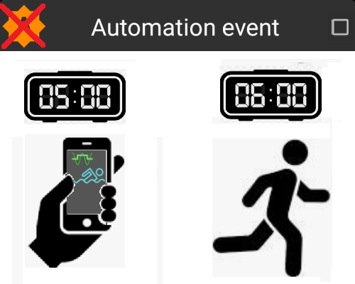

L'utente ha impostato un'**Automazione** per attivare un "Target Temporaneo-Attività" alle 5:00, per garantire che la **glicemia** e l'**IOB** siano ottimali in preparazione all'esercizio delle 6:00:

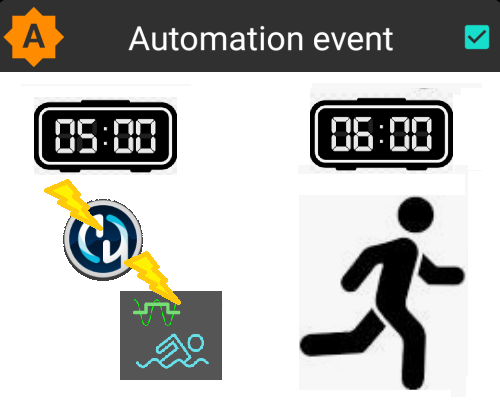

## Considerazioni chiave prima di iniziare con le Automazioni

1. Prima di impostare determinate Automazioni, dovresti avere un ragionevole controllo della **glicemia** con **AAPS**. Le Automazioni non devono essere usate per compensare impostazioni non ottimali di basale, **ISF** o **I:C** (discusse più avanti). Evitare di impostare un **Cambio Profilo** automatico per compensare gli aumenti di **glicemia** dovuti _es._ al cibo; questi sono gestiti meglio tramite altre strategie (SMB, ecc.).

1. Come con qualsiasi tecnologia, i **CGM**, i **Microinfusori** e i telefoni possono malfunzionare: i problemi tecnici o gli errori del sensore possono interrompere le azioni dell'**Automazione** e potrebbe essere necessario un intervento manuale.

1. **I requisiti per le **Automazioni** cambieranno probabilmente al cambiare delle routine**. Quando si cambia tra periodi di lavoro/scuola/vacanza, impostare un promemoria nel calendario per verificare quali **Automazioni** sono attualmente attive (è facile attivarle e disattivarle). Ad esempio, se si va in vacanza e non si ha più bisogno di un'Automazione impostata per lo sport scolastico o l'esercizio quotidiano, o se è necessario regolare i tempi.

1. Le **Automazioni** possono conflittare tra loro, ed è opportuno esaminare attentamente qualsiasi nuova impostazione di **Automazione** in un ambiente sicuro, e capire perché un'**Automazione** potrebbe o non potrebbe essersi attivata nel modo previsto.

1. Se si utilizza Autosens, cercare di usare i **Target Temporanei** invece dei **Cambi Profilo**. I **Target Temporanei** non azzerano Autosens a 0. I **Cambi Profilo** azzerano Autosens.

1. La maggior parte delle **Automazioni** dovrebbe essere impostata solo per una **durata di tempo limitata**, dopo di che **AAPS** può rivalutare e ripetere l'**Automazione**, se necessario, e se la condizione è ancora soddisfatta. Ad esempio, "avvia target temporaneo di 7,0 mmol/l per 30 min" o "avvia **Profilo** 110% per 10 min" _e_ "avvia target temporaneo di 5,0 mmol/l per 10 min". Usare le **Automazioni** per creare cambiamenti permanenti (es. profilo % più forte) rischia di causare ipoglicemia.

## Quando posso iniziare a usare l'Automazione?

Le **Automazioni** possono essere avviate nell'**obiettivo 10**.

## Dove si trovano le Automazioni in AAPS?

A seconda delle impostazioni di [Config Builder > Generale](../SettingUpAaps/ConfigBuilder.md), l'**Automazione** si trova nel menu "hamburger" o come scheda in **AAPS**.

## Come posso impostare un'Automazione?

Per impostare un'**Automazione** creare una "regola" in **AAPS** come segue:


* assegnare un titolo alla "regola";
* selezionare almeno una "Condizione";


* selezionare un'"Azione";

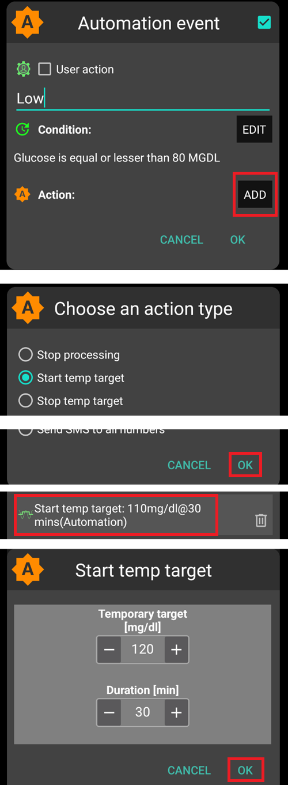

* spuntare la casella a destra dell'evento **Automazione** per "attivare" l'**Automazione**:

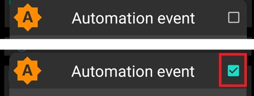


Per disattivare una regola **Automazione**, deselezionare la casella a sinistra del nome dell'**Automazione**. L'esempio seguente mostra un'**Automazione** intitolata "Target Temporaneo Glicemia Bassa" come attivata ("spuntata") o disattivata ("non spuntata").

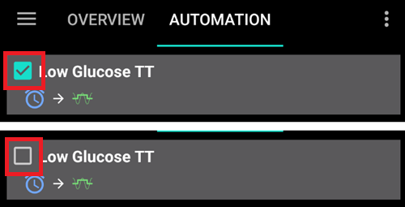


Quando si imposta un'**Automazione**, è possibile testarla prima attivando l'opzione "notifica" sotto "Azioni". Questo fa sì che **AAPS** mostri prima una notifica invece di automatizzare effettivamente un'azione. Quando si è certi che la notifica sia stata attivata al momento/nelle condizioni corrette, la regola **Automazione** può essere aggiornata per sostituire la "Notifica" con un'"Azione".

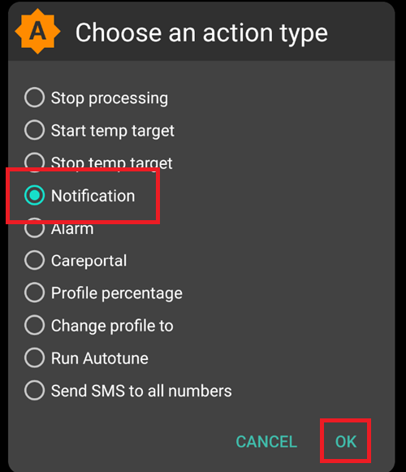

```{admonition} Important note
:class: note

Le **Automazioni** sono ancora attive quando il Loop è disabilitato!
```


## Limiti di sicurezza

Sono impostati limiti di sicurezza per le **Automazioni**:

* Il valore di **glicemia** deve essere compreso tra 72 e 270 mg/dl (o 4 e 15 mmol/l).
* La **Percentuale del Profilo** deve essere compresa tra il 70% e il 130%.
* C'è un limite di 5 minuti tra le esecuzioni dell'**Automazione** (e la prima esecuzione).

## Uso corretto dei valori negativi

```{admonition} Warning
:class: warning

Prestare attenzione quando si seleziona un valore negativo nell'**Automazione**
```

È necessaria cautela quando si seleziona un "valore negativo" nella "Condizione" come "minore di" nelle **Automazioni**. Ad esempio:

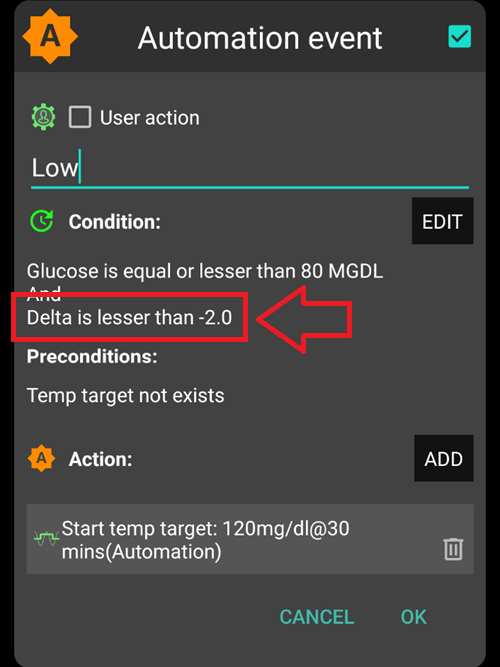

**Esempio 1:** Creare una Condizione **"è minore di"** "-0,1 mmol/l" (o "-2 mg/dl") attiverà:

Un'**Automazione** per qualsiasi numero **strettamente minore di** -0,1 (-2). Questo include numeri come -0,2, -0,3, -0,4 (-4, -6, -8) e così via. Ricordare che -0,1 (-2) stesso **non** è incluso in questa condizione. (La condizione "è uguale o minore di -0,1 mmol/l (-2 mg/dl)" _includerebbe_ -0,1 mmol/l o -2 mg/dl).

**Esempio 2:** Creare una Condizione "è maggiore di" -0,1 mmol/l (-2 mg/dl) attiverà:

Un'**Automazione** per qualsiasi numero **maggiore di** -0,1 mmol/l (-2 mg/dl). Questo include numeri come 0, 0,2, 0,4 mmol/l, (0, 4, 8 mg/dl) e qualsiasi altro numero positivo.

È importante considerare attentamente l'intenzione precisa dell'**Automazione** quando si scelgono queste condizioni e valori.

(automations-automation-triggers)=
## Automation Triggers

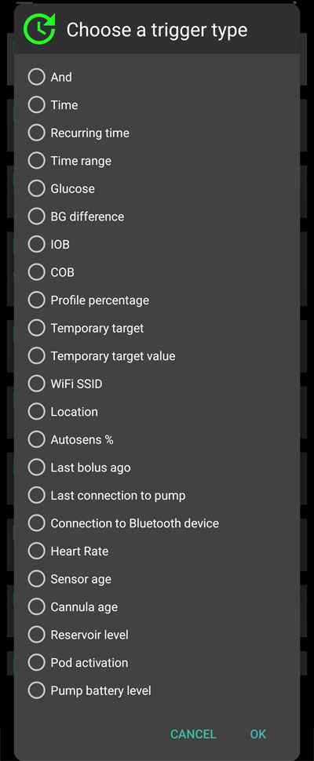

Ci sono vari "Trigger" che possono essere selezionati dall'utente. I trigger sono le condizioni che devono essere soddisfatte affinché l'automazione venga eseguita. L'elenco seguente non è esaustivo:

**Trigger:** connessione di condizioni

**Opzioni:**

È possibile collegare più condizioni con
* "E"
* "O"
* "O esclusivo" (che significa che se una - e solo una delle - condizioni si applica, verrà eseguita/i l'azione/i)

**Trigger:** ora vs.

**Opzioni:**

* ora = evento una tantum
* ora ricorrente = qualcosa che accade regolarmente (es. una volta alla settimana, ogni giorno feriale, ecc.)

**Trigger:** posizione

**Opzioni:**

* nel **config builder** (Automazione), l'utente può selezionare il servizio di posizione richiesto.

**Trigger:** servizio di posizione

**Opzioni:**

* Usa posizione passiva: **AAPS** acquisisce la posizione solo quando altre app la richiedono.
* Usa posizione di rete: Posizione del WiFi.
* Usa posizione GPS (Attenzione! Può causare un eccessivo consumo della batteria!)

**Trigger:** dati del microinfusore e del sensore

* Trigger età cannula: Disponibile per tutti i microinfusori
* Trigger età insulina: Disponibile per i microinfusori supportati
* Trigger età batteria: Disponibile per i microinfusori supportati
* Trigger età sensore: sempre disponibile
* Trigger attivazione Pod: Disponibile per i microinfusori patch

Si noti che per tutti i trigger relativi all'età, il confronto di uguaglianza difficilmente si attiva; in quel caso sono necessari due trigger per creare un intervallo.

* Trigger livello serbatoio: Disponibile per tutti i microinfusori, il confronto "NON_DISPONIBILE" non funziona per questo trigger poiché il valore è sempre compilato in **AAPS**
* Trigger livello batteria microinfusore: Disponibile per i microinfusori supportati, il confronto "NON_DISPONIBILE" non funziona per questo trigger poiché il valore è sempre compilato in **AAPS**

(automations-automation-action)=
## Azione

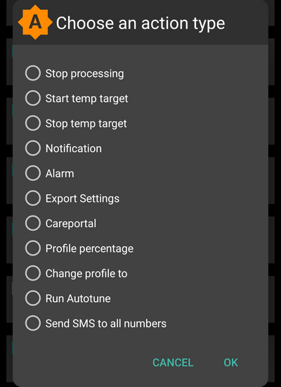

**Azioni:** avvia **Target Temporaneo**

**Opzioni:**

* La **glicemia** deve essere compresa tra 72 mg/dl e 270 mg/dl (4 mmol/l e 15 mmol/l)
* Il **TT** funziona solo se non c'è un Target Temporaneo precedente

**Azioni:** interrompi **Target Temporaneo**

**Opzioni:**

nessuna

**Azioni:** **Percentuale Profilo**

**Opzioni:**

* Il **Profilo** deve essere compreso tra il 70% e il 130%
* funziona solo se la Percentuale precedente è 100%

Una volta aggiunta l'"Azione", i valori predefiniti devono essere modificati con il numero desiderato facendo clic e regolando i valori predefiniti.

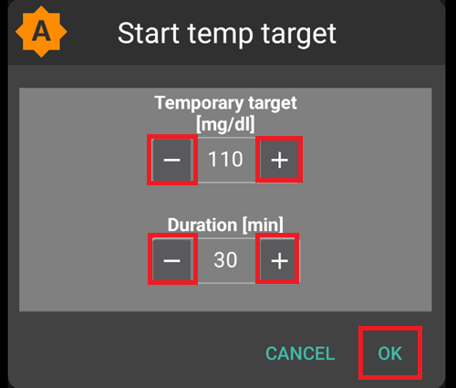

(Automations-the-order-of-the-automations-in-the-list-matters)=
## L'ordine delle **Automazioni** nell'elenco è importante
 **AAPS** automatizzerà le regole create nell'ordine di preferenza, a partire dall'inizio dell'elenco **Automazioni**. Ad esempio, se l'**Automazione** "Bassa" è l'**Automazione** più importante, al di sopra di tutte le altre regole, questa **Automazione** dovrebbe apparire in cima all'elenco **Automazioni** dell'utente come mostrato di seguito:


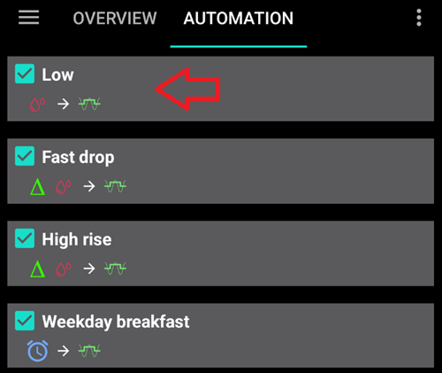

Per riordinare le regole di **Automazione**, fare clic e tenere premuto il pulsante con quattro linee sul lato destro dello schermo. Riordinare le **Automazioni** spostando le regole su o giù.

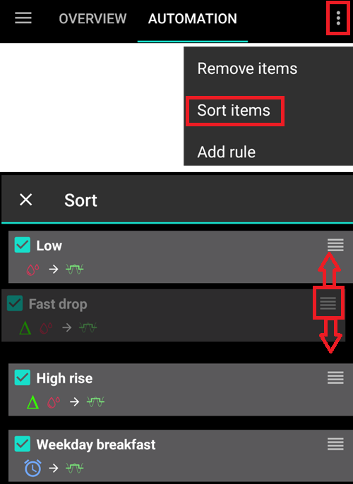

## Come eliminare le regole di Automazione

Per eliminare una regola **Automazione** fare clic sull'icona del cestino.

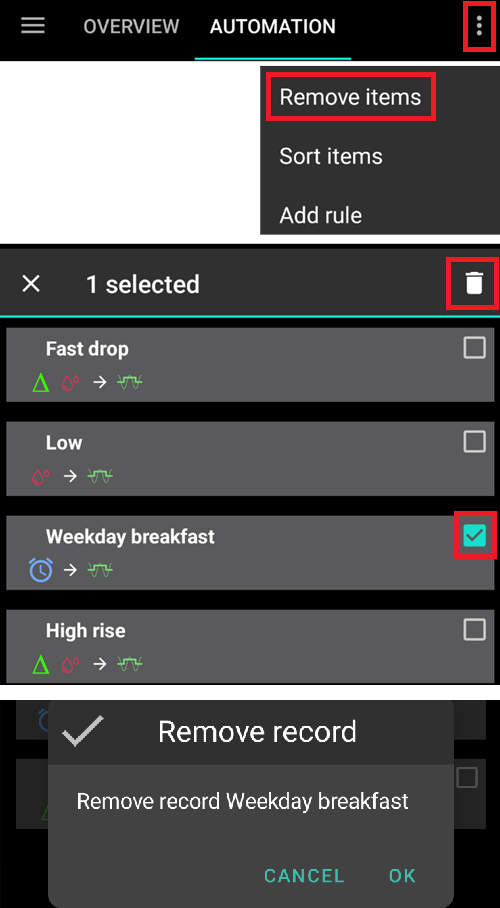

## Esempi di Automazioni

Di seguito sono riportati esempi di **Automazioni**. Ulteriori discussioni sulle **Automazioni** e su come gli utenti le hanno personalizzate si trovano nei gruppi di discussione Facebook o su Discord. Gli esempi seguenti non devono essere replicati senza che l'utente abbia una buona comprensione di come funzionerà l'**Automazione**.

### Target Temporaneo Glicemia Bassa

Questa **Automazione** attiva automaticamente un "Target Temporaneo Ipo" quando la **glicemia** è bassa a una certa soglia.

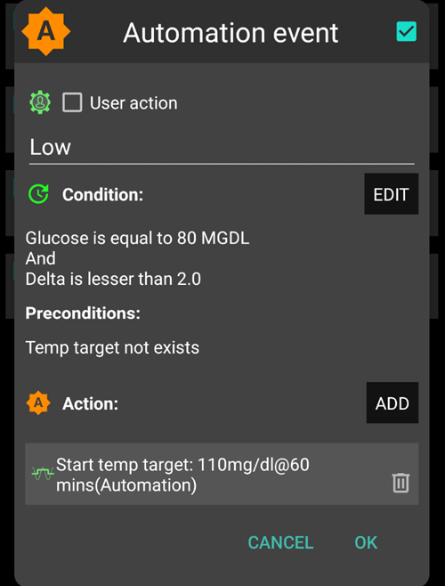

### Target Temporaneo ora di pranzo (con "Posizione")

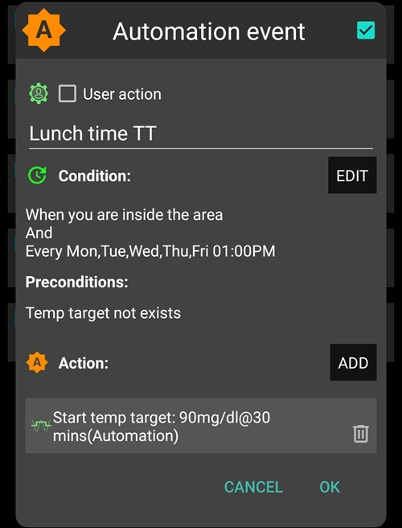

Questa **Automazione** è stata creata per un utente che mangia il pranzo al lavoro all'incirca alla stessa ora ogni giorno feriale, ma si attiva solo se l'utente si trova in una "posizione" impostata.  Quindi se l'utente non è al lavoro un giorno, questa **Automazione** verrà attivata.

Questa **Automazione** imposta un basso **Target Temporaneo** (Presto pasto) alle 13:00 per portare la "glicemia" a 90 mg (o 5 mmol/l) in preparazione al pranzo.

La "posizione" del Trigger viene impostata inserendo le coordinate GPS di latitudine e longitudine come segue:

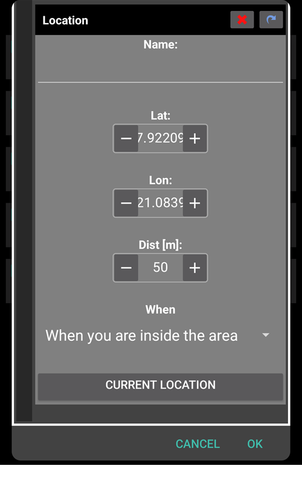

A causa della connessione "E", l'**Automazione** avviene solo durante l'"ora scelta" e se l'utente si trova nella posizione selezionata.

L'**Automazione** non verrà attivata in nessun altro momento in questa posizione o in questo momento al di fuori delle coordinate GPS impostate a 50 metri.

### Automazione Posizione WiFi SSID

Utilizzare il WiFi SSID è una buona opzione per attivare un'**Automazione** mentre ci si trova nel raggio di una rete WiFi specifica (rispetto al GPS), è abbastanza preciso, usa meno batteria e funziona in spazi chiusi dove il GPS e altri servizi di posizione potrebbero non essere disponibili.

Ecco un altro esempio di impostazione di un **Target Temporaneo** solo per i giorni lavorativi prima della colazione (1).


L'**Automazione** si attiverà alle 05:30 solo dal lunedì al venerdì (2)  
e mentre si è connessi a una rete WiFi di casa (3).


Imposterà quindi un **Target Temporaneo** di 75 mg/dl per 30 minuti (4). Uno dei vantaggi dell'inclusione della posizione è che non si attiverà se l'utente è in viaggio per le vacanze, ad esempio.

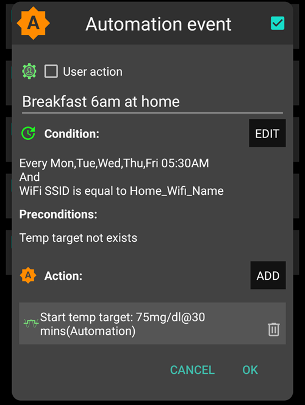

Ecco lo screenshot che mostra in dettaglio i trigger dell'**Automazione**:

1) Nell'"E" principale (entrambe le condizioni devono essere soddisfatte per attivarsi): 1) Ora ricorrente = L,M,M,G,V alle 5:30  
1) WiFi SSID = My_Home_WiFi_Name

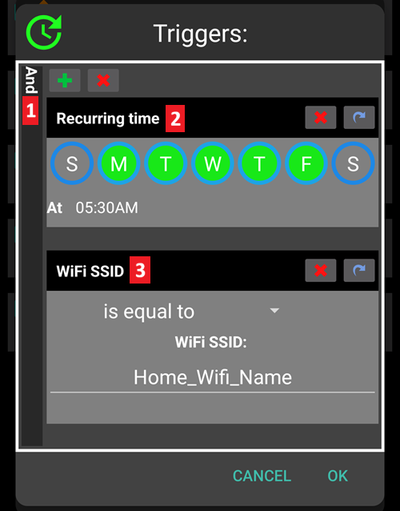

(automating-preference-settings-export)=

## Automazione dell'esportazione delle impostazioni delle Preferenze

### Esportazioni automatiche: pianificate (giornaliere)

Screenshot con i dettagli dei trigger dell'Automazione:

1) Condizione: Ora ricorrente = L,M,M,G,V alle 8:00 1) Azione: Esporta impostazioni (Per "Testo nei trattamenti" inserire "Giornaliero")


Nota: L'esecuzione dell'esportazione verrà registrata nel Careportal.

### Esportazioni automatiche: Attivazione Pod (solo microinfusore patch)

Screenshot con i dettagli dei trigger dell'Automazione:

1) Condizione: Attivazione Pod 1) Azione: Esporta impostazioni (Per "Testo nei trattamenti" inserire "Attivazione Pod: esportazione impostazioni")


Nota: L'esecuzione dell'esportazione verrà registrata nel Careportal. Nota: L'Automazione **non** si attiverà affatto se non è stata eseguita un'esportazione manuale delle impostazioni in precedenza. Vedere [Preferenze > Manutenzione](#preferences-maintenance-settings) per la corretta attivazione dell'esportazione automatica delle impostazioni.


## Log delle Automazioni

**AAPS** ha un registro delle **Automazioni** più recenti attivate nella parte inferiore dello schermo sotto la scheda **Automazioni**.

Nell'esempio seguente i log indicano:

(1) alle 01:58, è attivata la "Glicemia bassa attiva profilo ipo temporaneo"
* il valore glicemico è inferiore a 75 mg/dl;
* il delta è negativo (cioè la glicemia sta scendendo);
* l'ora è compresa tra le 01:00 e le 06:00.

L'**Automazione** eseguirà:
* imposta un **Target Temporaneo** a 110 mg/dl per 40 minuti;
* avvia un **Profilo** temporaneo al 50% per 40 minuti.

(2) alle 03:38, si attiva "Carboidrati alti dopo ipoglicemia notturna"
* l'ora è compresa tra le 01:05 e le 06:00;
* il valore glicemico è superiore a 110 mg/dl.

L'**Automazione** eseguirà:
* cambia **Profilo** in LocalProfile1 (cioè annulla il profilo temporaneo se presente)
* interrompe il **Target Temporaneo** (se presente)

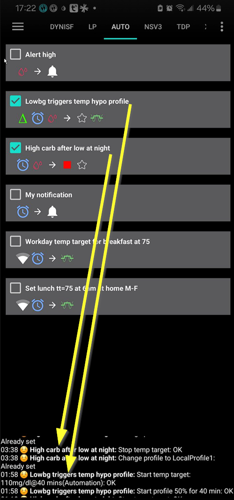

## Risoluzione dei problemi

* Problema: __Le mie automazioni non vengono attivate da AAPS?__

Verificare che la casella a destra dell'evento **Automazione** sia "spuntata" per assicurarsi che la regola sia attivata.

## Risoluzione dei problemi

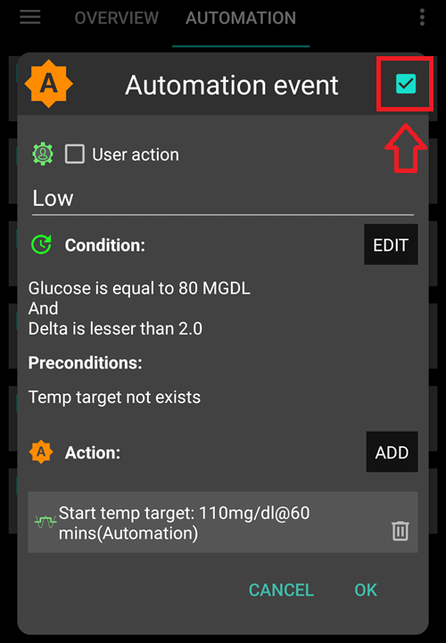

* Problema: __Le mie automazioni vengono attivate nell'ordine sbagliato.__

Verificare l'ordine di priorità delle regole come discusso sopra.

## Alternative alle Automazioni

Per gli utenti avanzati, esistono altre possibilità per automatizzare le attività utilizzando IFTTT o un'app Android di terze parti chiamata Automate. 
