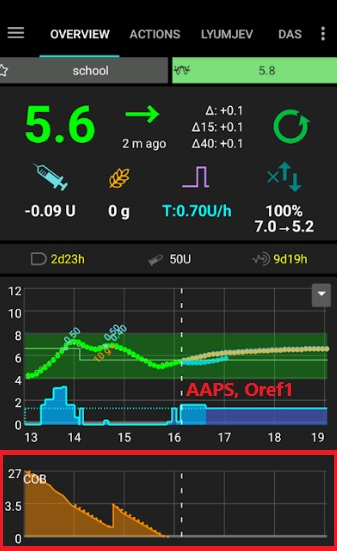
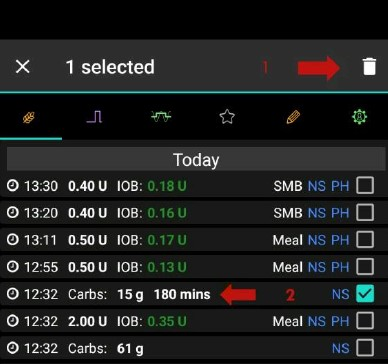

# Calcolo COB

## Come calcola AAPS il valore COB?

Quando i carboidrati vengono inseriti dall'utente come parte di un pasto o di una correzione di carboidrati, **AAPS** aggiungerà questo calcolo ai carboidrati attivi correnti (**COB**). **AAPS** calcola quindi l'assorbimento dei carboidrati dell'utente in base alle deviazioni osservate rispetto ai valori di **glicemia** dell'utente. La velocità di assorbimento dipende dal fattore di sensibilità ai carboidrati (**'CSF**"). Questa non è una funzionalità all'interno del **Profilo** dell'utente, ma viene calcolata da **AAPS** in base alla configurazione di **ISF/I:C**, ed è determinata da quanti mg/dl 1g di carboidrati farà aumentare la **glicemia** dell'utente.

## Fattore di sensibilità ai carboidrati

La formula adottata da **AAPS** è:

- carboidrati_assorbiti = deviazione * ic / isf.

L'effetto sul **Profilo** dell'utente sarà:

- _aumentare_ **IC** - aumentando i carboidrati assorbiti ogni 5 minuti, abbreviando così il tempo totale di assorbimento;

- _aumentare_ **ISF** - diminuendo i carboidrati assorbiti ogni 5 minuti, prolungando così il tempo totale di assorbimento; e

- _cambiare_ **la percentuale del Profilo** - aumentare/diminuire entrambi i valori non ha quindi impatto sul tempo di assorbimento dei carboidrati.

Ad esempio, se l'**ISF** del **Profilo** dell'utente è 100 e il **I:C** è 5, il Fattore di sensibilità ai carboidrati dell'utente sarebbe 20. Per ogni 20 mg/dl di aumento della **glicemia** dell'utente, 1g di carboidrati verrà calcolato come assorbito da **AAPS**. L'**IOB** positivo influisce anche sul calcolo del **COB**. Quindi, se **AAPS** prevede che la **glicemia** dell'utente scenda di 20 mg/dl a causa dell'**IOB** ma invece è rimasta invariata, **AAPS** calcolerebbe anche 1g di carboidrati come assorbiti.

I carboidrati verranno assorbiti anche tramite i metodi descritti di seguito in base all'algoritmo di sensibilità selezionato in **AAPS** dell'utente.

## Sensibilità ai carboidrati - Oref1

I carboidrati non assorbiti vengono eliminati dopo il tempo specificato:

## Sensibilità ai carboidrati - WeightedAverage

L'assorbimento viene calcolato in modo che il COB = 0 dopo il tempo specificato:

Se viene utilizzato l'assorbimento minimo di carboidrati (min_5m_carbimpact) invece del valore calcolato dalle deviazioni di **glicemia**, appare un punto arancione sul grafico **COB**.

(CobCalculation-detection-of-wrong-cob-values)=
## Rilevamento di valori COB errati

**AAPS** avviserà l'utente se sta per effettuare un bolo con **COB** da un pasto precedente se l'algoritmo rileva che il calcolo corrente del **COB** è errato. In questo caso fornirà all'utente un suggerimento aggiuntivo nella schermata di conferma dopo l'utilizzo del calcolatore del bolo.

### Come fa AAPS a rilevare valori COB errati?

Normalmente **AAPS** rileva l'assorbimento dei carboidrati tramite le deviazioni di **glicemia**. As this method calculates only the minimal carb absorption without considering **BG** deviations, it might lead to incorrect COB values. In case the user has entered carbs but **AAPS** cannot detect their estimated absorption through **BG** deviations, it will use the [min_5m_carbimpact](#Preferences-min_5m_carbimpact) method to calculate the absorption instead (so called ‘fallback’).

Nello screenshot sopra, il 58% del tempo l'assorbimento dei carboidrati è stato calcolato da min_5m_carbimpact invece del valore rilevato dalle deviazioni. Ciò indica che l'utente potrebbe aver avuto meno **COB** di quanto calcolato dall'algoritmo.

### Come gestire questo avviso?

- Considera di annullare il trattamento - premi 'Annulla' invece di OK.
- Ricalcola il tuo pasto imminente con il calcolatore del bolo lasciando il **COB** deselezionato.
- Se hai bisogno di un bolo di correzione, inseriscilo manualmente.
- Fai attenzione a non fare un overdose o a impilare l'insulina!

### Perché l'algoritmo non rileva correttamente il COB?

Questo potrebbe essere perché:
- Potenzialmente l'utente ha sovrastimato i carboidrati durante l'inserimento.
- Attività fisica / esercizio dopo il pasto precedente.
- Il rapporto I:C necessita di aggiustamento.
- Il valore per min_5m_carbimpact è errato (raccomandato è 8 con SMB, 3 con AMA).

## Correzione manuale dei carboidrati inseriti

Se i carboidrati sono stati sovrastimati o sottostimati, questo può essere corretto tramite la scheda Trattamenti e la scheda/menu azioni come descritto [qui](#screens-bolus-carbs).

## Correzione carboidrati - come eliminare una voce di carboidrati dai Trattamenti

La scheda 'Trattamenti' può essere utilizzata per correggere una voce di carboidrati errata eliminando la voce nei Trattamenti. Questo può essere perché l'utente ha sovrastimato o sottostimato la voce dei carboidrati:

1. Controlla e ricorda il **COB** e l'**IOB** attuali nella schermata principale di **AAPS**.
2. A seconda del microinfusore, i carboidrati nella scheda Trattamenti potrebbero essere mostrati insieme all'insulina in una riga o come voce separata (cioè con Dana RS).
3. Rimuovi la voce prima 'spuntando' il cestino in alto a destra (vedi foto sopra, passo 1). Poi 'spunta' la quantità di carboidrati errata (vedi foto sopra, passo 2). Poi 'spunta' il 'cestino' in alto a destra (passo 1 di nuovo).
4. Assicurati che i carboidrati siano stati rimossi con successo controllando di nuovo il **COB** nella schermata principale di **AAPS**.
5. Fai lo stesso per l'**IOB** se c'è solo una riga nella scheda Trattamenti che include carboidrati e insulina.
6. Se i carboidrati non vengono rimossi come previsto e vengono aggiunti ulteriori carboidrati come spiegato in questa sezione, la voce **COB** sarà troppo alta e questo potrebbe portare **AAPS** a somministrare troppa insulina.
7. Inserisci la quantità corretta di carboidrati tramite il pulsante carboidrati nella schermata principale di **AAPS** e imposta l'ora dell'evento corretto.
8. Se c'è solo una riga nella scheda Trattamenti che include carboidrati e insulina, l'utente deve aggiungere anche la quantità di insulina. Assicurati di impostare l'ora dell'evento corretto e controlla l'**IOB** nella schermata principale dopo aver confermato la nuova voce.

