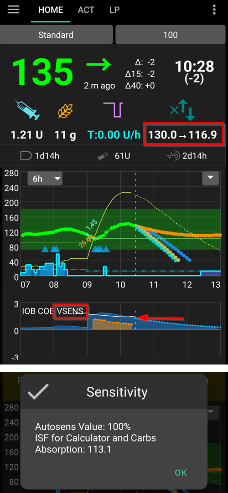
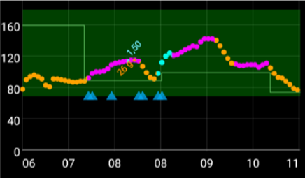

(Open-APS-features-DynamicISF)=
# ISF Dinamico (DynISF)

Fino ad ora, con **AMA** e **SMB**, l'**ISF** era definito nel **Profilo** ed era statico per ogni periodo definito della giornata. Ma in realtà l'**ISF** di una persona non è così statico e varia in base al livello di **glicemia**: a una glicemia elevata l'utente avrà bisogno di più insulina per abbassare la **glicemia** di 50 mg/dL / 3 mmol/L rispetto a una glicemia più bassa. [Autosens](#Open-APS-features-autosens) è stato il primo algoritmo a cercare di affrontare questo problema, regolando l'**ISF** al di fuori dei periodi dei pasti.

L'**ISF Dinamico** (chiamato anche **DynISF**) serve allo stesso scopo ma è più avanzato poiché può essere utilizzato in qualsiasi momento. È consigliato solo agli utenti avanzati che hanno una buona padronanza dei controlli e del monitoraggio di **AAPS**. Leggere [Cose da considerare prima di attivare l'ISF Dinamico](#dyn-isf-things-to-consider-when-activating-dynamicisf) di seguito prima di provarlo.

```{admonition} CAUTION - Automations or Profile Percentage change
:class: warning

Gli **Automatismi** devono essere sempre usati con cautela. Ciò vale in modo particolare per l'**ISF Dinamico**.

Quando si utilizza l'**ISF Dinamico**, disabilitare qualsiasi cambio temporaneo del **Profilo** come regola di **Automazione**, poiché causerebbe un comportamento eccessivamente aggressivo dell'**ISF Dinamico** nella correzione dei boli, con rischio di ipoglicemia. Questo è esattamente lo scopo dell'**ISF Dinamico**, quindi non è necessario indicare ad **AAPS** di somministrare insulina aggiuntiva tramite Automazione in caso di **glicemie** elevate.

```

Per utilizzare l'**ISF Dinamico**, il database di **AAPS** richiede un minimo di 7 giorni di dati dell'utente.

## Cosa fa l'ISF Dinamico?

L'**ISF Dinamico** adatta dinamicamente il fattore di sensibilità insulinica (**ISF**) in base a:

- Dose giornaliera totale di insulina (**TDD**); e
- valori di glicemia attuali e previsti.

Quando si utilizza l'**ISF Dinamico**, i valori di **ISF** inseriti nel **Profilo** non vengono più utilizzati, tranne come fallback in caso di dati TDD insufficienti nel database di **AAPS** (_es._ nuova installazione dell'app).

**SMB/AMA** - esempio di **Profilo** dell'utente con **ISF** statico impostato dall'utente e utilizzato da **SMB** e **AMA**.


**ISF Dinamico** - esempio di **ISF** dell'utente soggetto a variazioni determinate dall'**ISF Dinamico**.



La sezione cerchiata in rosso mostra: `ISF del profilo` -> `ISF calcolato da DynISF`. <br/> Toccando questa sezione si apre una finestra di dialogo con informazioni aggiuntive, come l'**ISF** usato per il calcolatore e l'assorbimento dei carboidrati (vedere [Altri utilizzi dell'ISF](#dynisf-other-usages-of-isf) di seguito).

Il valore **DynISF** può essere mostrato anche in un grafico aggiuntivo abilitando i dati "Sensibilità variabile". Appare come una linea bianca (vedere la freccia rossa nell'immagine sopra).

## Come viene calcolato l'ISF Dinamico?

L'**ISF Dinamico** utilizza il modello di Chris Wilson per determinare l'**ISF** al posto del valore statico dell'**ISF** impostato nel **Profilo**. Una spiegazione dettagliata si trova qui: [Chris Wilson su Sensibilità Insulinica (Fattore di correzione) con Loop and Learn, 6/2/2022](https://www.youtube.com/watch?v=oL49FhOts3c).

L'equazione implementata per l'**ISF Dinamico** è: `ISF = 1800 / ((TDD * Fattore di aggiustamento DynISF) * Ln((glicemia attuale / divisore insulina) + 1))`

Le variabili utilizzate in questa equazione sono descritte di seguito.<br/> Nota: `Ln` indica il logaritmo naturale, una funzione matematica.

L'implementazione usa l'equazione sopra per calcolare l'**ISF** attuale e nelle previsioni oref1 per **IOB**, **ZT** (zero-temping) e **UAM](#aaps-screens-prediction-lines). Viene utilizzato anche per il **COB** e nel calcolatore del bolo (vedere [Altri utilizzi dell'ISF](#dynisf-other-usages-of-isf) di seguito).

### TDD (Dose giornaliera totale)
Il TDD utilizzerà una combinazione dei seguenti valori:
1.  Media TDD degli ultimi 7 giorni;
2.  TDD del giorno precedente; e
3.  media ponderata delle ultime 8 ore di utilizzo dell'insulina, estrapolata su 24 ore.

Il **TDD** utilizzato nell'equazione sopra è pesato per un terzo di ciascuno dei valori sopra indicati.

### Fattore di aggiustamento ISF Dinamico

Questo viene impostato nelle **Preferenze** dell'utente e serve a rendere l'**ISF Dinamico** più o meno aggressivo. Vedere la sezione [Preferenze](#dyn-isf-preferences) di seguito.

### Divisore insulina
Il divisore insulina dipende dal picco dell'insulina utilizzata ed è inversamente proporzionale al tempo del picco. Per Lyumjev questo valore è 75, per Fiasp 65 e per l'insulina rapida standard 55.

### ISF basato sulla glicemia prevista per le decisioni di dosaggio

La sensibilità dinamica viene calcolata con il valore di **glicemia corrente** e visualizzata come ISF corrente in **AAPS**. Ma quando si effettuano i calcoli di dosaggio, l'algoritmo oref1 calcola e utilizza invece l'**ISF Futuro**.

Ciò viene fatto per evitare di somministrare troppa insulina quando la **glicemia** è bassa o si prevede che scenda.

L'**ISF Futuro** utilizza la stessa formula descritta sopra, tranne per il fatto che può utilizzare la **glicemia minima prevista** al posto della **glicemia corrente**. La **glicemia minima prevista**, [calcolata in oref1](https://openaps.readthedocs.io/en/latest/docs/While%20You%20Wait%20For%20Gear/Understand-determine-basal.html), è il valore minimo che si prevede raggiunga la glicemia durante tutte le previsioni.

* Se la **glicemia** corrente è sopra il target  <br/> **e** se i valori di **glicemia** sono stabili, entro +/- 3 mg/dL:<br/>nella formula si usa: `media(glicemia minima prevista, glicemia corrente)`.
* Se la **glicemia** finale è sopra il target e i valori di glicemia stanno aumentando,<br/>  
  **o** la **glicemia** finale è sopra la **glicemia** corrente:<br/>nella formula si usa: `glicemia corrente`.
* Altrimenti:<br/>nella formula si usa: `glicemia minima prevista`.

Per una spiegazione semplificata, fare riferimento allo screenshot sotto, che illustra la situazione sopra descritta. I punti arancioni usano la **glicemia prevista**, i punti viola usano la **media(glicemia prevista, glicemia corrente)**, e i punti blu usano la **glicemia corrente**.



(dynisf-other-usages-of-isf)=
## Altri utilizzi dell'ISF

### ISF e assorbimento COB

Come descritto nella pagina [Calcolo del COB](../DailyLifeWithAaps/CobCalculation.md), in genere l'assorbimento del COB viene calcolato con questa formula:   
`carboidrati_assorbiti = deviazione * ic / isf`  
Quando si utilizza l'**ISF Dinamico**, l'**ISF** usato qui è la media dei valori di ISF Dinamico delle ultime 24 ore.

### ISF in Bolus Wizard

Quando si usa il [Calcolatore del bolo](#aaps-screens-bolus-wizard), l'**ISF** viene utilizzato se la **glicemia** è sopra il target per aggiungere una correzione.

Quando si utilizza l'**ISF Dinamico**, l'**ISF** usato qui è la media dei valori di ISF Dinamico delle ultime 24 ore.

(dyn-isf-preferences)=
## Preferenze

Abilitare **Sensibilità dinamica** in [Preferenze > Impostazioni OpenAPS SMB](#Preferences-openaps-smb-settings) per attivare la funzione. Nuove impostazioni diventano disponibili una volta selezionata.


(dyn-isf-adjustment-factor)=
### Fattore di aggiustamento ISF Dinamico
L'**ISF Dinamico** si basa su una singola regola che dovrebbe applicarsi a tutti, il che implica che persone con la stessa **TDD** avrebbero la stessa sensibilità. Poiché ogni utente ha la propria sensibilità personale, il **Fattore di aggiustamento** consente all'utente di definire se è più o meno sensibile all'insulina rispetto alla persona "standard".

Il **Fattore di aggiustamento** è un valore compreso tra 1% e 300%. Agisce come moltiplicatore del valore **TDD**.

* Aumentare questo valore sopra il 100% rende **DynISF** più aggressivo: i valori di **ISF** diventano *più piccoli* (_es._ è necessaria più insulina per abbassare di poco i livelli di **glicemia**).
* Abbassare questo valore sotto il 100% rende **DynISF** meno aggressivo: i valori di **ISF** diventano più grandi (_es._ è necessaria meno insulina per abbassare di poco i livelli di **glicemia**).

Il **Fattore di aggiustamento** viene modificato anche quando si attiva un [**Cambio Profilo** con percentuale](../DailyLifeWithAaps/ProfileSwitch-ProfilePercentage.md). Una **Percentuale del Profilo** più bassa ridurrà il **Fattore di aggiustamento**, e viceversa per una **Percentuale del Profilo** più alta.

Ad esempio, se il **Fattore di aggiustamento** è 80% e si attiva un **Cambio Profilo** all'80%, il **Fattore di aggiustamento** risultante sarà `0.8*0.8=0.64`.

Ciò significa che, quando si utilizza **DynISF**, è possibile usare la **Percentuale del Profilo** per regolare temporaneamente la sensibilità in modo manuale. Questo può essere utile per l'attività fisica (percentuale più bassa), le malattie (percentuale più alta), ecc.

### Valore di glicemia al di sotto del quale si verifica la sospensione per glucosio basso

Valore di **glicemia** al di sotto del quale l'insulina viene sospesa. Il valore predefinito utilizza il modello target standard. Un utente può impostare questo valore tra 60 mg/dl (3,3 mmol/l) e 100 mg/dl (5,5 mmol/l). I valori inferiori a 65/3,6 determinano l'utilizzo del modello predefinito.

### Abilita il rapporto di sensibilità basato su TDD per la modifica della basale e del target glicemico

Questa impostazione sostituisce Autosens e utilizza il **TDD** delle ultime 24 ore / **TDD** dei 7 giorni come base per aumentare e diminuire la basale, nello stesso modo in cui fa il normale Autosens. Questo valore calcolato viene utilizzato anche per regolare il target, se sono abilitate le opzioni per la regolazione del target con la sensibilità. A differenza di Autosens, questa opzione non regola i valori di **ISF**.

(dyn-isf-things-to-consider-when-activating-dynamicisf)=
## Cose da considerare prima di attivare l'ISF Dinamico

* L'**ISF Dinamico** è consigliato solo agli utenti avanzati che hanno una buona padronanza dei controlli e del monitoraggio di **AAPS**. Gli utenti dovrebbero idealmente aver raggiunto un buon controllo con **SMB** prima di passare all'**ISF Dinamico**.
* Come menzionato sopra, disattivare tutti gli [**Automatismi**](../DailyLifeWithAaps/Automations.md) che attivano una **Percentuale del Profilo** in relazione alla **glicemia**, perché sarebbe troppo aggressivo e potrebbe somministrare troppa insulina! Questo è già parte dell'algoritmo dell'**ISF Dinamico**.
* La [Percentuale del Profilo](../DailyLifeWithAaps/ProfileSwitch-ProfilePercentage.md) viene presa in considerazione nel calcolo dell'ISF Dinamico (vedere [Fattore di aggiustamento ISF Dinamico](#dyn-isf-adjustment-factor) sopra). È una cattiva pratica usare una **Percentuale del Profilo** diversa dal 100% per un lungo periodo. Se si determina che il **Profilo** è cambiato, è necessario creare un nuovo **Profilo** con i valori aggiornati per replicare il **Profilo** con una percentuale specifica.
* L'**ISF Dinamico** potrebbe non funzionare per tutti. In particolare, potrebbero verificarsi risultati inaspettati se si verifica una delle seguenti situazioni:
  * Stile di vita variabile (abitudini alimentari o di attività fisica non costanti).
  * TDD o sensibilità non costanti da un giorno all'altro.
* Non esiste una guida precisa per impostare il valore iniziale del **Fattore di aggiustamento**. Tuttavia, come punto di partenza: supponendo che i valori del **Profilo** siano corretti, quando si è nel range e i valori di **glicemia** sono stabili, il valore **DynISF** dovrebbe essere circa uguale a quello precedentemente nel **Profilo**.<br/>Se si nota che l'**ISF Dinamico** è troppo aggressivo, abbassare il **Fattore di aggiustamento**, e viceversa.
* Anche se **DynISF** non utilizza affatto l'**ISF del Profilo**, se si nota che la propria sensibilità è molto diversa da quella precedentemente memorizzata nel **Profilo**, si dovrebbe considerare di mantenerla aggiornata. Questo potrebbe essere utile in caso di perdita dei dati di **AAPS** (_es._ nuovo telefono, nuova versione di **AAPS**...), poiché l'**ISF del Profilo** verrà utilizzato come fallback per i successivi 7 giorni.