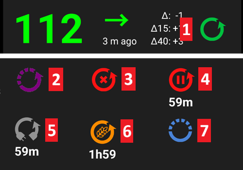
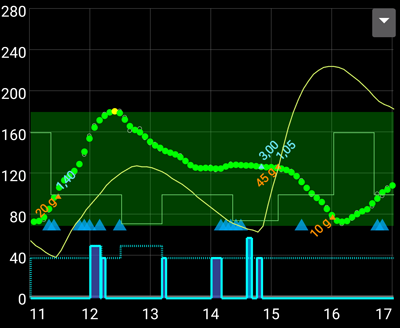
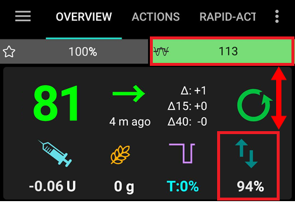
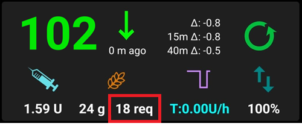

# Funzionalità chiave di AAPS

## Modalità loop

Lo stato del loop viene mostrato nella schermata principale con una delle icone seguenti.

**AAPS** offre diverse modalità loop, come Loop Aperto (7), Loop Chiuso (1) e Sospensione per Glucosio Basso (LGS - 2).

Vedere [Schermate AAPS > La schermata principale > Stato del loop](#AapsScreens-loop-status) per informazioni su come selezionare la modalità loop.

(KeyAapsFeatures-OpenLoop)=
### Loop Aperto
**AAPS** valuta continuamente tutti i dati disponibili (IOB, COB, glicemia...) e fornisce suggerimenti di trattamento (basali temporanee) su come regolare la terapia se necessario.

I suggerimenti non verranno eseguiti automaticamente (come nel loop chiuso). I suggerimenti devono essere attuati manualmente dall'utente nel microinfusore (se si utilizza un microinfusore virtuale) o tramite un pulsante se **AAPS** è connesso a un microinfusore reale.

Questa opzione serve per conoscere come funziona **AAPS** o se si utilizza un microinfusore non supportato. Sarai in Loop Aperto, indipendentemente dalla scelta effettuata, fino alla fine dell'**[Obiettivo 5](#objectives-objective5)**.

(KeyAapsFeatures-LGS)=
### Sospensione per Glucosio Basso (LGS)

In questa modalità, il [maxIOB](#Open-APS-features-maximum-total-iob-openaps-cant-go-over) è impostato a zero.

Ciò significa che se la glicemia sta scendendo, **AAPS** può ridurre la basale. Ma se la glicemia sta salendo, non verrà effettuata alcuna correzione automatica. Le basali rimarranno invariate rispetto a quelle definite nel **Profilo** corrente. Solo se l'IOB è negativo (da una precedente Sospensione per Glucosio Basso) verrà somministrata insulina aggiuntiva per abbassare la **glicemia**.

Questa modalità è disponibile a partire dall'**[Obiettivo 6](#objectives-objective6)**.

(KeyAapsFeatures-ClosedLoop)=
### Loop Chiuso

**AAPS** valuta continuamente tutti i dati disponibili (IOB, COB, glicemia...) e regola automaticamente il trattamento se necessario (_es._ senza ulteriori interventi da parte tua) per raggiungere l'[intervallo o valore target](#profile-glucose-targets) impostato (somministrazione di boli, basale temporanea, sospensione insulina per evitare l'ipo, ecc.).

Il Loop Chiuso funziona entro numerosi limiti di sicurezza, che possono essere impostati individualmente.

Il Loop Chiuso è possibile solo se si è all'**[Obiettivo 7](#objectives-objective7)** o superiore e si utilizza un microinfusore supportato.

(Open-APS-features-autosens)=
## Autosens
* Autosens è un algoritmo che analizza le deviazioni della glicemia (positive/negative/neutre).
* Tenterà di determinare quanto sei sensibile/resistente basandosi su queste deviazioni.
* L'implementazione oref in **OpenAPS** utilizza una combinazione di 24 e 8 ore di dati. Usa quello che risulta più sensibile.
* Nelle versioni precedenti ad **AAPS 2.7**, l'utente doveva scegliere manualmente tra 8 o 24 ore.
* A partire da **AAPS 2.7**, Autosens in **AAPS** passerà tra una finestra temporale di 24 e 8 ore per calcolare la sensibilità. Sceglierà quella più sensibile.
* Se gli utenti provengono da oref1, probabilmente noteranno che il sistema potrebbe essere meno dinamico ai cambiamenti, a causa della variazione tra 24 o 8 ore di sensibilità.
* Il cambio di una cannula o di un profilo reimposta il rapporto Autosens al 100% (un cambio di profilo percentuale con durata non reimposta autosens).
* Autosens regola la basale e l'ISF (es.: simulando ciò che fa uno spostamento del Profilo).
* Se si mangiano carboidrati continuamente per un periodo prolungato, Autosens sarà meno efficace durante quel periodo poiché i carboidrati sono esclusi dai calcoli del delta di **glicemia**.

(Open-APS-features-super-micro-bolus-smb)=
## Super Micro Bolus (SMB)
**SMB**, abbreviazione di **Super micro bolus**, è una funzionalità di OpenAPS introdotta dal 2018 in poi, nell'algoritmo Oref1. A differenza dell'**AMA**, l'**SMB** non utilizza le basali temporanee per controllare i livelli glicemici, ma principalmente **piccoli super micro bolus**. Nelle situazioni in cui l'**AMA** aggiungerebbe 1,0 UI di insulina tramite una basale temporanea, l'**SMB** eroga diversi super micro bolus in piccole dosi a **intervalli di 5 minuti**, ad esempio 0,4 UI, 0,3 UI, 0,2 UI e 0,1 UI. Allo stesso tempo (per ragioni di sicurezza) la basale effettiva viene impostata a 0 UI/h per un determinato periodo per prevenire un sovradosaggio (**'zero-temping'**). Ciò consente al sistema di regolare la glicemia più rapidamente rispetto all'aumento della basale temporanea dell'**AMA**.

Grazie agli SMB, per i pasti contenenti solo carboidrati "lenti" potrebbe essere sufficiente informare il sistema della quantità pianificata di carboidrati e lasciare il resto ad **AAPS**. Tuttavia, questo potrebbe portare a picchi postprandiali (post-pasto) più elevati perché il pre-bolo non è possibile. Oppure si può somministrare, se necessario con il pre-bolo, un **bolo iniziale** che copre **solo in parte** i carboidrati (ad es. 2/3 della quantità stimata) e lasciare che l'**SMB** somministri il resto dell'insulina.

Gli SMB vengono mostrati nel grafico principale con triangoli blu. Tocca il triangolo per vedere quanta insulina è stata somministrata, o usa la [scheda Trattamenti](#aaps-screens-treatments).

Le funzionalità degli **SMB** contengono alcuni meccanismi di sicurezza:

1. **Dose SMB singola massima**  La dose SMB singola massima può essere solo il valore più piccolo tra:

      * il valore corrispondente alla basale attuale (come regolata da autosens) per la durata impostata in "Max minuti di basale per limitare SMB a", es. quantità di basale per i successivi 30 minuti, oppure
      * metà della quantità di insulina attualmente necessaria, oppure
      * la porzione rimanente del valore maxIOB nelle impostazioni.

2. **Basali temporanee basse**  Le basali temporanee basse (chiamate "low temps") o le basali temporanee a 0 U/h (chiamate "zero-temps") vengono attivate più frequentemente negli **SMB**. Questo è by design per ragioni di sicurezza e non ha effetti negativi se il **Profilo** è impostato correttamente. Nel grafico principale, la curva IOB (linea gialla sottile) è più significativa del corso delle basali temporanee.

3. **Pasti non Annunciati**  Calcoli aggiuntivi per prevedere il corso della glicemia, es. tramite **UAM** (pasti non annunciati). Anche senza l'inserimento manuale di carboidrati da parte dell'utente, l'**UAM** può rilevare automaticamente un aumento significativo dei livelli glicemici dovuto a pasti, adrenalina o altre influenze e tentare di regolarlo con l'**SMB**. Per sicurezza questo funziona anche in senso inverso e può interrompere l'SMB prima se si verifica un'inattesa rapida discesa della glicemia. Ecco perché l'UAM dovrebbe essere sempre attivo con SMB.

**È necessario aver avviato l'[obiettivo 9](#objectives-objective9) per utilizzare SMB.**

Vedere anche:
* [Documentazione OpenAPS per SMB](https://openaps.readthedocs.io/en/latest/docs/Customize-Iterate/oref1.html#understanding-super-micro-bolus-smb).
* [Documentazione OpenAPS per oref1 SMB](https://openaps.readthedocs.io/en/latest/docs/Customize-Iterate/oref1.html)
* [Informazioni di Tim sugli SMB](https://www.diabettech.com/artificial-pancreas/understanding-smb-and-oref1/).

Le impostazioni per OpenAPS SMB sono descritte di seguito.

(Open-APS-features-max-u-h-a-temp-basal-can-be-set-to)=
### Max U/h impostabili per una basale temporanea

Questa impostazione di sicurezza determina la basale temporanea massima che il microinfusore può erogare. È anche nota come **max-basal**.

Il valore viene misurato in unità per ora (U/h). Si consiglia di impostarlo a un valore ragionevole. Una buona raccomandazione per questo parametro è:

**MAX-BASAL = BASALE PIÙ ALTA x 4**

Ad esempio, se la basale più alta nel profilo era 0,5 U/h, si potrebbe moltiplicarla per 4 per ottenere un valore di 2 U/h.

**AAPS** limita questo valore come "limite fisso" in base a [Preferenze > Sicurezza trattamenti > Tipo di paziente](#preferences-patient-type). I limiti fissi sono i seguenti:

* Bambino: 2
* Adolescente: 5
* Adulto: 10
* Adulto resistente all'insulina: 12
* Gravidanza: 25

*Vedere anche [panoramica dei limiti fissi](#Open-APS-features-overview-of-hard-coded-limits).*

(Open-APS-features-maximum-total-iob-openaps-cant-go-over)=
### IOB totale massimo oltre cui OpenAPS non può andare

Questo valore determina il massimo **Insulina Attiva** (IOB di basale e bolo) al di sotto del quale **AAPS** rimarrà durante il funzionamento in modalità loop chiuso. È anche noto come **maxIOB**.

Se l'IOB corrente (es. dopo un bolo pasto) è superiore al valore definito, il loop smette di somministrare insulina finché l'IOB non scende al di sotto del valore dato.

Un buon punto di partenza per questo parametro è:

    maxIOB = bolo pasto medio + 3x basale giornaliera massima

Essere cauti e pazienti quando si regola il **max-IOB**. È diverso per ogni persona e può dipendere anche dalla dose totale giornaliera media (TDD).

**AAPS** limita questo valore come "limite fisso" in base a [Preferenze > Sicurezza trattamenti > Tipo di paziente](#preferences-patient-type). I limiti fissi sono i seguenti:

* Bambino: 3
* Adolescente: 7
* Adulto: 12
* Adulto resistente all'insulina: 25
* Gravidanza: 40

*Vedere anche [panoramica dei limiti fissi](#Open-APS-features-overview-of-hard-coded-limits).*

Nota: Quando si utilizza **SMB**, il **max-IOB** viene calcolato diversamente rispetto all'AMA. Nell'**AMA**, maxIOB è un parametro di sicurezza per l'**IOB** di basale, mentre nella modalità SMB include anche l'IOB del bolo.

Vedere anche la [documentazione OpenAPS per SMB](https://openaps.readthedocs.io/en/latest/docs/Customize-Iterate/oref1.html#understanding-super-micro-bolus-smb).

### Abilita sensibilità dinamica

Questa è la funzionalità [ISF Dinamico](../DailyLifeWithAaps/DynamicISF.md). Quando abilitata, diventano disponibili nuove impostazioni. Le impostazioni sono spiegate nella pagina [ISF Dinamico](#dyn-isf-preferences).

### Usa la funzionalità Autosens

Questa è la funzionalità [Autosens](#Open-APS-features-autosens). Quando si utilizza l'ISF Dinamico, Autosens non può essere utilizzato, poiché sono due algoritmi diversi che modificano la stessa variabile (sensibilità).

Autosens analizza le deviazioni della glicemia (positive/negative/neutre). Tenterà di determinare quanto sei sensibile/resistente basandosi su queste deviazioni e regolerà la basale e l'ISF in base ad esse.

Quando abilitata, diventano disponibili nuove impostazioni.

#### La sensibilità aumenta il target
Se questa opzione è abilitata, il rilevamento della sensibilità (autosens) può aumentare il target quando viene rilevata sensibilità (sotto il 100%). In questo caso il target verrà aumentato della percentuale della sensibilità rilevata.

Se il target viene modificato a causa del rilevamento della sensibilità, verrà visualizzato con uno sfondo verde nella schermata principale.

Questa impostazione è disponibile quando è abilitato "Abilita sensibilità dinamica" o "Abilita la funzionalità Autosens".

#### La resistenza abbassa il target
Se questa opzione è abilitata, il rilevamento della sensibilità (autosens) può abbassare il target quando viene rilevata resistenza (sopra il 100%). In questo caso il target verrà abbassato della percentuale della resistenza rilevata.

Questa impostazione è disponibile quando è abilitato "Abilita sensibilità dinamica" o "Abilita la funzionalità Autosens".

### Abilita SMB
Abilitare per usare la funzionalità SMB. Se disabilitato, non verranno somministrati **SMB**.

Quando abilitata, diventano disponibili nuove impostazioni.

(Open-APS-features-enable-smb-with-high-temp-targets)=
#### Abilita SMB con target temporaneo alto

Se questa impostazione è abilitata, gli **SMB** verranno comunque somministrati anche se l'utente ha selezionato un **Target Temporaneo** alto (definito come qualsiasi valore superiore a 100 mg/dL o 5,6 mmol/l, indipendentemente dal target del **Profilo**). Questa opzione è pensata per disabilitare gli SMB quando l'impostazione è disabilitata. Ad esempio, se questa opzione è disabilitata, gli **SMB** possono essere disabilitati impostando un **Target Temporaneo** superiore a 100 mg/dL o 5,6 mmol/l. Questa opzione disabiliterà anche gli **SMB** indipendentemente da qualsiasi altra condizione che tenti di abilitare SMB.

Se questa impostazione è abilitata, l'**SMB** sarà abilitato con un target temporaneo alto solo se è abilitato anche **Abilita SMB con target temporanei**.

(Open-APS-features-enable-smb-always)=
#### Abilita SMB sempre
Se questa impostazione è abilitata, SMB è sempre abilitato (indipendentemente da COB, target temporanei o boli). Se questa impostazione è abilitata, le restanti impostazioni di abilitazione sottostanti non avranno effetto. Tuttavia, se **Abilita SMB con target temporaneo alto** è disabilitato e viene impostato un target temporaneo alto, gli SMB saranno disabilitati.

Questa impostazione è disponibile solo se **AAPS** rileva che si sta utilizzando una [fonte di glicemia affidabile](#GettingStarted-TrustedBGSource), con filtro avanzato. FreeStyle Libre 1 non è considerata una fonte affidabile a causa del rischio di ripetizione infinita di dati glicemici vecchi in caso di guasto del sensore.

I dati rumorosi potrebbero far credere ad **AAPS** che la glicemia stia salendo molto rapidamente, con conseguente somministrazione di SMB non necessari. Per ulteriori informazioni sul rumore e l'attenuazione dei dati, vedere [qui](../CompatibleCgms/SmoothingBloodGlucoseData.md).

#### Abilita SMB con COB
Se questa impostazione è abilitata, SMB è abilitato quando il COB è maggiore di 0.

Questa impostazione non è visibile se è attivato "Abilita SMB sempre".

#### Abilita SMB con target temporanei
Se questa impostazione è abilitata, SMB è abilitato quando è impostato qualsiasi target temporaneo (presto pasto, attività, ipo, personalizzato). Se questa impostazione è abilitata ma **Abilita SMB con target temporaneo alto** è disabilitato, SMB sarà abilitato quando è impostato un target temporaneo basso (inferiore a 100 mg/dL o 5,6 mmol/l) ma disabilitato quando è impostato un target temporaneo alto.

Questa impostazione non è visibile se è attivato "Abilita SMB sempre".

#### Abilita SMB dopo carboidrati

Se abilitato, SMB è abilitato per 6 ore dopo che i carboidrati sono stati comunicati, anche se il COB ha raggiunto 0.

Per ragioni di sicurezza, questa impostazione è disponibile solo se **AAPS** rileva che si sta utilizzando una fonte di glicemia affidabile. Non è visibile se è attivato "Abilita SMB sempre".

Questa impostazione è disponibile solo se **AAPS** rileva che si sta utilizzando una [fonte di glicemia affidabile](#GettingStarted-TrustedBGSource), con filtro avanzato. FreeStyle Libre 1 non è considerata una fonte affidabile a causa del rischio di ripetizione infinita di dati glicemici vecchi in caso di guasto del sensore.

I dati rumorosi potrebbero far credere ad **AAPS** che la glicemia stia salendo molto rapidamente, con conseguente somministrazione di SMB non necessari. Per ulteriori informazioni sul rumore e l'attenuazione dei dati, vedere [qui](../CompatibleCgms/SmoothingBloodGlucoseData.md).  Questa impostazione non è visibile se è attivato "Abilita SMB sempre".

#### Con quale frequenza verranno somministrati gli SMB in minuti
Questa funzionalità limita la frequenza degli SMB. Questo valore determina il tempo minimo tra gli SMB. Si noti che il loop viene eseguito ogni volta che arriva un valore glicemico (generalmente ogni 5 minuti). Sottrarre 2 minuti per dare al loop tempo aggiuntivo per completare. Es. E.g. if you want SMB to be given every loop run, set this to 3 minutes.

Valore predefinito: 3 min.

(Open-APS-features-max-minutes-of-basal-to-limit-smb-to)=
#### Max minuti di basale per limitare SMB a
Questa è un'impostazione di sicurezza importante. Questo valore determina quanta insulina SMB può essere somministrata in base alla quantità di insulina basale in un dato tempo, quando è coperta dai COB.

Aumentare questo valore rende l'SMB più aggressivo. Si dovrebbe iniziare con il valore predefinito di 30 minuti. Dopo un po' di esperienza, aumentare il valore di 15 minuti alla volta e osservare gli effetti su più pasti.

Si raccomanda di non impostare il valore superiore a 90 minuti, poiché ciò potrebbe portare a un punto in cui l'algoritmo potrebbe non essere in grado di gestire una glicemia in calo con una basale di 0 U/h ("zero-temp"). Si dovrebbero anche impostare allarmi, specialmente se si stanno ancora testando nuove impostazioni, che avviseranno molto prima di un'ipoglicemia.

Valore predefinito: 30 min.

#### Max minuti di basale per limitare SMB a per UAM

Questa impostazione consente di regolare la forza dell'SMB durante UAM, quando non ci sono più carboidrati.

Valore predefinito: uguale a **Max minuti di basale per limitare SMB a**.

Questa impostazione è visibile solo se sono attivati "Abilita SMB" e "Abilita UAM".

### Abilita UAM
Con questa opzione abilitata, l'algoritmo SMB può riconoscere i pasti non annunciati. Questo è utile se ci si dimentica di comunicare i carboidrati ad **AAPS**, si stima erroneamente la quantità di carboidrati o se un pasto ricco di grassi e proteine ha una durata più lunga del previsto. Senza alcun inserimento di carboidrati, l'UAM può riconoscere un rapido aumento della glicemia causato da carboidrati, adrenalina, ecc. e tenta di regolarlo con gli SMB. Funziona anche in senso inverso: se si verifica una rapida diminuzione della glicemia, può interrompere gli SMB prima.

**Pertanto, l'UAM dovrebbe essere sempre attivato quando si usa SMB.**

(key-aaps-features-minimal-carbs-required-for-suggestion)=
### Carboidrati minimi richiesti per il suggerimento

Grammi minimi di carboidrati per visualizzare un avviso di suggerimento carboidrati. L'assunzione di carboidrati aggiuntivi verrà suggerita quando il riferimento rileva che sono necessari carboidrati. In questo caso riceverai una notifica che può essere posticipata di 5, 15 o 30 minuti.

Le notifiche di carboidrati necessari possono essere inviate a Nightscout se lo si desidera; in tal caso verrà mostrato e trasmesso un annuncio.

In ogni caso, i carboidrati necessari verranno visualizzati nella sezione COB della schermata principale.

### Impostazioni avanzate

Puoi leggere di più qui: [documentazione OpenAPS](https://openaps.readthedocs.io/en/latest/docs/While%20You%20Wait%20For%20Gear/preferences-and-safety-settings.html).

**Usa sempre la media delta breve invece dei dati semplici** Se abiliti questa funzionalità, **AAPS** usa la media delta/glicemia breve degli ultimi 15 minuti, che di solito è la media degli ultimi tre valori. Questo aiuta **AAPS** a essere più stabile con sorgenti dati rumorose come xDrip+ e Libre.

**Moltiplicatore di sicurezza basale giornaliero massimo** Questo è un limite di sicurezza importante. L'impostazione predefinita (che è improbabile che necessiti di regolazione) è 3. Ciò significa che **AAPS** non sarà mai in grado di impostare una basale temporanea superiore a 3 volte la basale oraria più alta programmata nel microinfusore e/o nel profilo dell'utente. Esempio: se la basale più alta è 1,0 U/h e il moltiplicatore di sicurezza basale giornaliero massimo è 3, allora **AAPS** può impostare una basale temporanea massima di 3,0 U/h (= 3 x 1,0 U/h).

Valore predefinito: 3 (non deve essere modificato a meno che non sia strettamente necessario e si sappia cosa si sta facendo)

**Moltiplicatore di sicurezza basale corrente** Questo è un altro limite di sicurezza importante. L'impostazione predefinita (che è anche improbabile che necessiti di regolazione) è 4. Ciò significa che **AAPS** non sarà mai in grado di impostare una basale temporanea superiore a 4 volte la basale oraria corrente programmata nel microinfusore e/o nel profilo dell'utente.

Valore predefinito: 4 (non deve essere modificato a meno che non sia strettamente necessario e si sappia cosa si sta facendo)

***

(Open-APS-features-advanced-meal-assist-ama)=
## Assistenza Pasto Avanzata (AMA)
AMA, abbreviazione di "advanced meal assist", è una funzionalità di OpenAPS del 2017 (oref0). OpenAPS Advanced Meal Assist (AMA) consente al sistema di passare più rapidamente a una basale alta dopo un bolo pasto se si inseriscono i carboidrati in modo affidabile.

Puoi trovare ulteriori informazioni nella [documentazione OpenAPS](https://newer-docs.readthedocs.io/en/latest/docs/walkthrough/phase-4/advanced-features.html#advanced-meal-assist-or-ama).

### Max U/h impostabili per una Basale Temporanea (OpenAPS "max-basal")
Questa impostazione di sicurezza aiuta **AAPS** a non essere mai in grado di somministrare una basale pericolosamente alta e limita la basale temporanea a x U/h. Si consiglia di impostarlo a un valore ragionevole. Una buona raccomandazione è prendere la basale più alta nel profilo e moltiplicarla per 4, e almeno per 3. Ad esempio, se la basale più alta nel profilo è 1,0 U/h, si potrebbe moltiplicarla per 4 per ottenere un valore di 4 U/h e impostare 4 come parametro di sicurezza.

Non è possibile scegliere qualsiasi valore: per ragioni di sicurezza, esiste un "limite fisso" che dipende dall'età del paziente. Il "limite fisso" per maxIOB è inferiore nell'AMA rispetto all'SMB. Per i bambini, il valore è il più basso, mentre per gli adulti resistenti all'insulina è il più alto.

I parametri fissi in **AAPS** sono:

* Bambino: 2
* Adolescente: 5
* Adulto: 10
* Adulto resistente all'insulina: 12
* Gravidanza: 25

*Vedere anche [panoramica dei limiti fissi](#Open-APS-features-overview-of-hard-coded-limits).*

### IOB basale massimo che OpenAPS può erogare \[U\] (OpenAPS "max-iob")
Questo parametro limita l'IOB basale massimo entro il quale **AAPS** funziona ancora. Se l'IOB è superiore, il loop smette di somministrare insulina basale aggiuntiva finché l'IOB basale non scende sotto il limite.

Il valore predefinito è 2, ma si dovrebbe aumentare questo parametro lentamente per vedere quanto influisce e quale valore si adatta meglio. È diverso per ogni persona e dipende anche dalla dose totale giornaliera media (TDD). Per ragioni di sicurezza, esiste un limite che dipende dall'età del paziente. Il "limite fisso" per maxIOB è inferiore nell'AMA rispetto all'SMB.

* Bambino: 3
* Adolescente: 5
* Adulto: 7
* Adulto resistente all'insulina: 12
* Gravidanza: 25

*Vedere anche [panoramica dei limiti fissi](#Open-APS-features-overview-of-hard-coded-limits).*

### Abilita AMA Autosens
Qui è possibile scegliere se utilizzare o meno il [rilevamento della sensibilità](../DailyLifeWithAaps/SensitivityDetectionAndCob.md) autosens.

### Autosens regola anche i target temporanei
Se questa opzione è abilitata, autosens può regolare anche i target (oltre alla basale e all'ISF). Ciò consente ad **AAPS** di lavorare in modo più "aggressivo" o no. Il target effettivo potrebbe essere raggiunto più velocemente con questo.

### Impostazioni avanzate

- Normalmente non è necessario modificare le impostazioni in questa finestra di dialogo!
- Se si vuole comunque modificarle, assicurarsi di leggere i dettagli nella [documentazione OpenAPS](https://openaps.readthedocs.io/en/latest/docs/While%20You%20Wait%20For%20Gear/preferences-and-safety-settings.html#) e di capire cosa si sta facendo.

**Usa sempre la media delta breve invece dei dati semplici** Se abiliti questa funzionalità, **AAPS** usa la media delta/glicemia breve degli ultimi 15 minuti, che di solito è la media degli ultimi tre valori. Questo aiuta **AAPS** a lavorare in modo più stabile con sorgenti dati rumorose come xDrip+ e Libre.

**Moltiplicatore di sicurezza basale giornaliero massimo** Questo è un limite di sicurezza importante. L'impostazione predefinita (che è improbabile che necessiti di regolazione) è 3. Ciò significa che **AAPS** non sarà mai in grado di impostare una basale temporanea superiore a 3 volte la basale oraria più alta programmata nel microinfusore. Esempio: se la basale più alta è 1,0 U/h e il moltiplicatore di sicurezza basale giornaliero massimo è 3, allora **AAPS** può impostare una basale temporanea massima di 3,0 U/h (= 3 x 1,0 U/h).

Valore predefinito: 3 (non deve essere modificato a meno che non sia strettamente necessario e si sappia cosa si sta facendo)

**Moltiplicatore di sicurezza basale corrente** Questo è un altro limite di sicurezza importante. L'impostazione predefinita (che è anche improbabile che necessiti di regolazione) è 4. Ciò significa che **AAPS** non sarà mai in grado di impostare una basale temporanea superiore a 4 volte la basale oraria corrente programmata nel microinfusore.

Valore predefinito: 4 (non deve essere modificato a meno che non sia strettamente necessario e si sappia cosa si sta facendo)

**Divisore snooze bolo** La funzionalità "snooze bolo" funziona dopo un bolo pasto. **AAPS** non imposta basali temporanee basse dopo un pasto nel periodo del DIA diviso per il parametro "bolus snooze". Il valore predefinito è 2. Ciò significa che con un DIA di 5 ore, lo "snooze bolo" durerà 5h : 2 = 2,5 ore.

Valore predefinito: 2

***

(Open-APS-features-overview-of-hard-coded-limits)=
## Panoramica dei limiti fissi

|            | Bambino | Adolescente | Adulto | Adulto resistente insulina | Gravidanza |
| ---------- | ------- | ----------- | ------ | -------------------------- | ---------- |
| MAXBOLUS   | 5       | 10          | 17     | 25                         | 60         |
| MINDIA     | 5       | 5           | 5      | 5                          | 5          |
| MAXDIA     | 9       | 9           | 9      | 9                          | 10         |
| MINIC      | 2       | 2           | 2      | 2                          | 0.3        |
| MAXIC      | 100     | 100         | 100    | 100                        | 100        |
| MAXIOB_AMA | 3       | 5           | 7      | 12                         | 25         |
| MAXIOB_SMB | 7       | 13          | 22     | 30                         | 70         |
| MAXBASAL   | 2       | 5           | 10     | 12                         | 25         |
