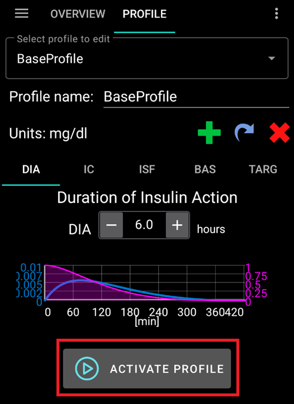
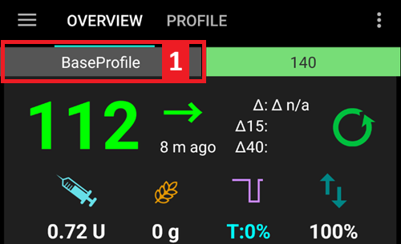
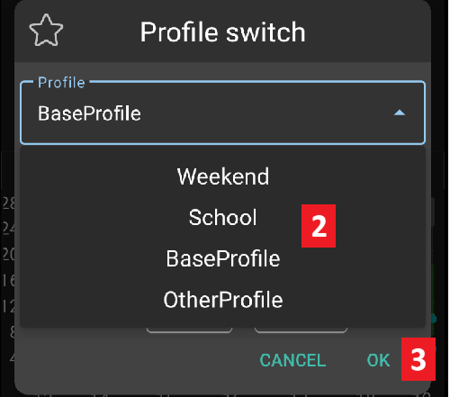
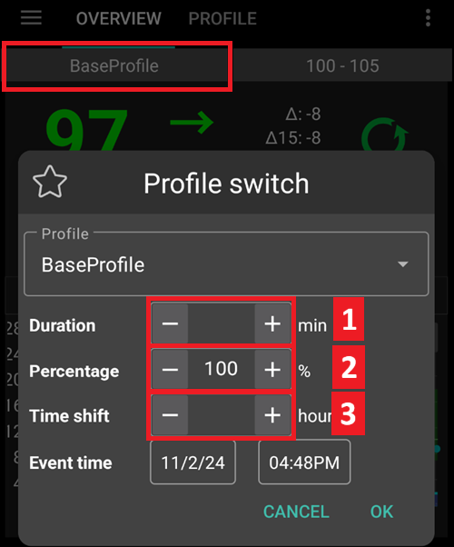

# Cambio Profilo e Percentuale del Profilo

Questa sezione spiega cos'è un **Cambio Profilo** e una **Percentuale del Profilo**. Per informazioni su come creare un **Profilo**, consultare [Config Builder > Profilo](#setup-wizard-profile).

Quando si inizia il percorso con **AAPS**, sarà necessario creare un **Profilo**, capire come eseguire un **Cambio Profilo** e comprendere l'impatto di una **Percentuale del Profilo** in **AAPS**. Le funzionalità del **Cambio Profilo** o della **Percentuale del Profilo** possono essere particolarmente utili per:

- il Ciclo mestruale - una regolazione percentuale all'interno di un **Profilo** può essere impostata negli **Automatismi** per consentire ad **AAPS** di adattarsi alle diverse fasi del ciclo ormonale e alla prevista resistenza insulinica.

- L'esercizio fisico - una regolazione percentuale all'interno di un **Profilo** può essere impostata negli **Automatismi** per l'esercizio fisico allo scopo di ridurre l'assunzione di basale.

- I lavoratori su turni notturni o a rotazione - uno sfasamento temporale nel **Profilo** può essere impostato per i lavoratori a turni modificando il numero di ore nel **Profilo** in base a quanto più tardi/prima andrà a letto o si sveglierà l'utente.

Perché usare una **Percentuale del Profilo** invece di una regolazione temporanea della basale?  Per essere più efficace nella sua applicazione, una **Percentuale del Profilo** applica una riduzione o un aumento proporzionale su: basale, ISF e I:C. Ciò garantisce un approccio equilibrato calcolato da **AAPS** quando somministra l'insulina dell'utente. Si trae poco beneficio dal **Profilo** in **AAPS** riducendo solo la basale se l'algoritmo continua a erogare gli stessi rapporti per ISF e I:C.

## Come attivare un Cambio Profilo?

Ogni **Profilo** selezionato dall'utente richiede un "Cambio Profilo". A tal fine, l'utente deve modificare il proprio **Profilo** o impostarne uno nuovo nella scheda "Profilo locale". Una volta applicate le impostazioni desiderate, l'utente deve salvare le modifiche e attivare il **Profilo** selezionando "Attiva Profilo" come mostrato di seguito:

Una volta creato e salvato un nuovo **Profilo**, **AAPS** manterrà una libreria dei **Profili** dell'utente.

## Come attivare un Cambio Profilo?

A. Per utilizzare questa funzionalità l'utente deve avere più di un **Profilo** salvato in **AAPS**. Per attivare un **Cambio Profilo**:

- __tenere premuto__ sul nome del **Profilo** (nell'esempio seguente viene adottato un 'Profilo' salvato come: "Scuola" nella schermata principale di **AAPS**) e selezionare il **Profilo** desiderato dal menu a discesa:

1. Tenere premuto su **Profilo**;
2. Selezionare il **Profilo** desiderato; e
3. premere 'ok'.

## Per attivare una Percentuale del Profilo nel Cambio Profilo:

B. Per attivare una **Percentuale del Profilo**:
- Seguire i passaggi descritti al punto A sopra.
- Regolare i campi "Durata" e "Percentuale" come necessario, tenendo presente quanto segue. Se il campo "Durata" (mostrato nell'icona 2 di seguito) è:
  * lasciato a "zero", rimarrà attivo nel **Profilo** per un tempo illimitato. Il **Profilo** resterà attivo finché l'utente non seleziona e attiva un nuovo "Cambio Profilo".
  * inserito con il numero di [x] minuti, questo sarà il periodo di tempo desiderato per il **Profilo**.  Alla scadenza del periodo selezionato, il **Profilo** standard tornerà attivo in **AAPS**.

Come applicare una "Percentuale" al **Profilo**:

2. Inserire il campo "Durata".

3. Inserire il campo "Percentuale".

4. Inserire lo "Sfasamento temporale".

## Percentuale del Profilo

È importante che l'utente comprenda le caratteristiche essenziali di una **Percentuale del Profilo**. Applicando un aumento o una diminuzione percentuale a un **Cambio Profilo**, questa verrà applicata nella stessa percentuale per aumentare o diminuire i parametri delle impostazioni dell'utente come definiti nel **Profilo**.

Ad esempio: un **Cambio Profilo** al 130% (indica che l'utente è il 30% più resistente all'insulina) istruirà **AAPS** a:
- __aumentare__ la basale del 30%;
- __abbassare__ l'**ISF**: dividendo per 1.3;
- __abbassare__ l'**I:C** dividendo per 1.3.

Ricordare che abbassare l'**ISF** o l'**I:C** significa un rapporto più forte e una maggiore somministrazione di insulina. Questo fatto può essere facilmente trascurato dai nuovi utenti di **AAPS**.

Una volta selezionato, **AAPS** ricalcola la basale predefinita e **AAPS** (aperto o chiuso) continuerà a funzionare in base alla **Percentuale del Profilo** selezionata.

L'effetto di una Percentuale del **Profilo** è riassunto nella tabella seguente:

| Cambio Profilo Percentuale |   Effetto    |    I:C g/UI     | esempio 15g |               ISF mmol/l/UI mg/dl/UI                | UI per abbassare 2mmol/l 40mg/dl |
|:-----------------------------------:|:------------:|:------------------------:|:--------------------:|:----------------------------------------------------------------------:|:----------------------------------------------------:|
|                 90%                 |    Weaker    | 5/0.9 =**5.55** |        2.7 UI        | 2.2/0.9 =**2.4**  40/0.9 =**44.4** |                        0.8 UI                        |
|              **100%**               | **Standard** |          **5**           |       **3 UI**       |                          **2.2 40**                           |                      **0.9** UI                      |
|                130%                 |  Più forte   | 5/1.3 =**3.85** |        3.9 UI        | 2.2/1.3 =**1.7**  40/1.3 =**30.8** |                        1.2 UI                        |

(ProfileSwitch-ProfilePercentage-time-shift-of-the-circadian-percentage-profile)=
## Sfasamento temporale del Profilo Percentuale Circadiano

Uno "sfasamento temporale" nella funzionalità del **Profilo** dell'utente sposterà le impostazioni del **Profilo** lungo l'orologio giornaliero ("circadiano") al numero di ore desiderato. Questo può essere utile per:

- __lavoratori su turni notturni o a rotazione__: lavoro su turni notturni modificando il numero di ore di quanto più tardi/prima nel **Profilo** l'utente andrà a letto o si sveglierà;
- __utenti che cambiano fuso orario durante i viaggi__; o
- __utenti di tipo 1 bambini__: con una routine fissa di ora di andare a letto e una resistenza insulinica gestita nel **Profilo**. Se per qualsiasi motivo si prevede un'ora di andare a letto più tarda per il bambino, il caregiver può applicare uno "sfasamento temporale" al **Profilo** del bambino per consentire ad **AAPS** di reagire alla resistenza insulinica nel periodo di tempo desiderato come impostato dall'utente.

È sempre una questione di quale ora del **Profilo** dovrebbe sostituire le impostazioni dell'ora corrente. Questo tempo deve essere spostato di x ore. Prestare quindi attenzione alle direzioni come descritto nell'esempio seguente:
  * Ora corrente: 12:00
  * Sfasamento temporale **negativo**
    * 2:00 **+10 h** -> 12:00
    * Verranno utilizzate le impostazioni delle 2:00 al posto di quelle normalmente usate alle 12:00, a causa dello sfasamento temporale positivo.
  * Sfasamento temporale **positivo**
    * 22:00 **-10 h** -> 12:00
    * Verranno utilizzate le impostazioni delle 22:00 (10 pm) al posto di quelle normalmente usate alle 12:00, a causa dello sfasamento temporale negativo.

Questo meccanismo di acquisizione di istantanee del **Profilo** consente un calcolo molto più preciso del passato e la possibilità di monitorare le modifiche al **Profilo**.

## Conservare un cambio profilo per uso futuro

Una volta eseguito un cambio profilo con percentuale e/o sfasamento temporale, è possibile copiare questo profilo temporaneo in un nuovo profilo.

Per farlo, andare alla scheda [Trattamenti > Cambio Profilo](#your-aaps-profile-clone-profile-switch).
