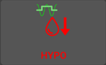
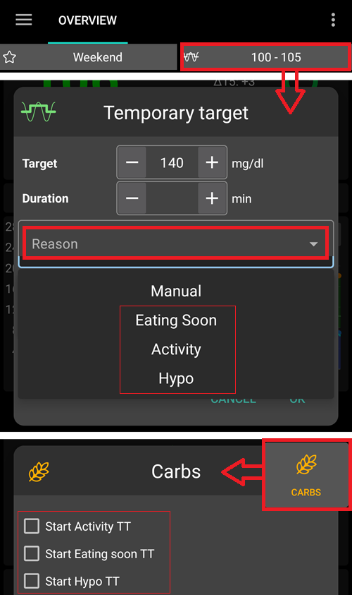
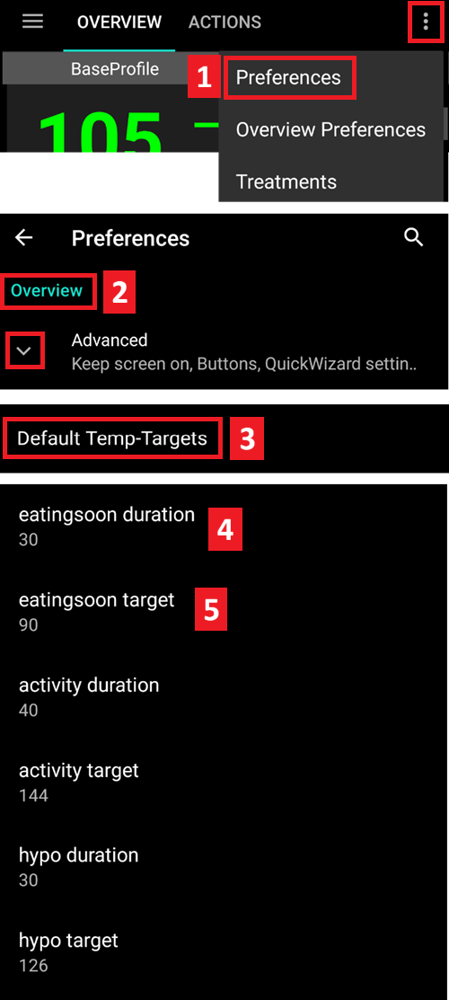
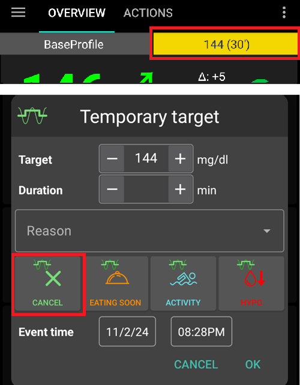
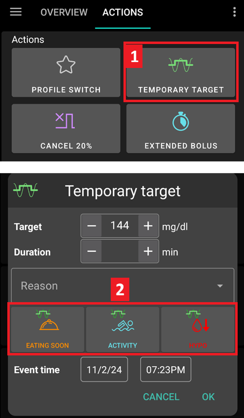
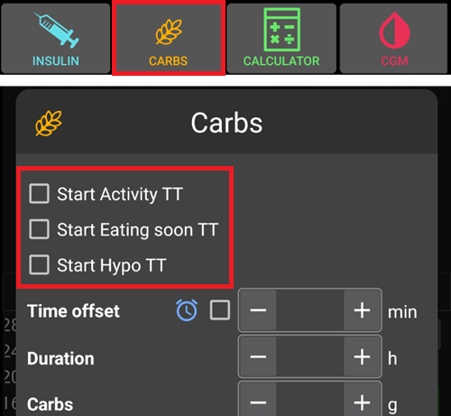

# Target Temporanei

## Cosa sono i Target Temporanei e dove posso impostarli e configurarli?
Un **Target Temporaneo** (o abbreviato **TT**) è una funzionalità di **AAPS** che consente all'utente di modificare il proprio [intervallo target di **glicemia**](#profile-glucose-targets) per attività pianificate. Ciò viene ottenuto da **AAPS** modificando l'utilizzo dell'insulina dell'utente.

Un target glicemico, in particolare se è solo a breve termine (meno di 4 ore), non deve essere il *valore effettivo* che ci si aspetta o si desidera raggiungere, ma è un buon modo per indicare ad **AAPS** di essere più o meno aggressivo, mantenendo comunque la glicemia nel range.

I target temporanei possono essere definiti entro questi limiti:

|         | Target Temporaneo     |
| ------- | --------------------- |
| Minimo  | 4 mmol/l o 72 mg/dL   |
| Massimo | 15 mmol/l o 225 mg/dL |

**AAPS** prevede tre opzioni di **Target Temporaneo** adatte per l'esercizio fisico (**TT-Attività**), i pasti (**TT-Presto pasto**) e l'ipoglicemia prevista (**TT-Ipo**). I **Target Temporanei** si trovano nella **scheda Azioni**.

Gli utenti devono avere aspettative realistiche sui risultati ottenibili quando selezionano un **Target Temporaneo** in **AAPS**. Il successo nel raggiungere un target di **glicemia** desiderato dipenderà da numerosi fattori, tra cui: l'affidabilità delle impostazioni di **AAPS** dell'utente, il controllo complessivo della **glicemia**, l'**IOB**, la sensibilità insulinica, la resistenza insulinica, il livello di sforzo durante l'esercizio e così via.

Un **Target Temporaneo** può richiedere circa 30 minuti o più per raggiungere il target di **glicemia** desiderato. È impossibile per **AAPS** raggiungere un target di **glicemia** con effetto immediato e gli utenti devono tenerne conto quando selezionano un **Target Temporaneo**.

La tabella seguente riassume le caratteristiche di **TT-Attività**, **TT-Presto pasto** e **TT-Ipo**.

### TT - Attività

**Target glicemico (in base alle impostazioni dell'utente)**

AAPS punta a raggiungere 8 mmol/l o 144 mg/dl per 40 minuti

**Altre considerazioni che gli utenti potrebbero voler prendere in considerazione quando lo selezionano**:

Questo può essere uno strumento importante per quegli utenti che non eseguono un pre-bolo; tuttavia l'efficacia del **TT-Presto pasto** dipenderà da una serie di fattori, tra cui: le impostazioni dell'utente, se segue una dieta a basso contenuto di carboidrati e se utilizza un'insulina ad azione rapida (come Fiasp o Lyjumjev) per eliminare la necessità del pre-bolo. A seconda del livello di **glicemia**, **AAPS** "ridurrà" l'utilizzo dell'insulina per raggiungere il target di **glicemia**.

In modalità loop chiuso, **SMB**:

- *potrebbe essere* disattivato (discusso più avanti); e/o
- la basale potrebbe essere attivata se **AAPS** è in **IOB** negativo o < 0.

Gli utenti potrebbero anche voler considerare:

- *selezionare* questo **TT** 1-2 ore prima dell'esercizio pianificato per garantire una riduzione dell'IOB (la tempistica corretta per questo TT varia da persona a persona); e
- *selezionare* un Profilo temporaneo (riduzione) per la durata dell'attività pianificata per garantire la riduzione dell'**IOB**;
- *assicurarsi* che il **TT** sia programmato per essere *disattivato* poco prima dell'esercizio, poiché alcuni utenti sperimentano un rapido aumento della **glicemia** dopo l'esercizio.

### TT - Presto pasto

**Target glicemico (in base alle impostazioni dell'utente)**

AAPS punta a raggiungere 5 mmol/l o 90 mg/dl per 30 minuti

**Altre considerazioni che gli utenti potrebbero voler prendere in considerazione quando lo selezionano**:

In modalità loop chiuso, **SMB**:

- rimarrà attivato; e/o
- la basale potrebbe essere attivata anche in base alle impostazioni del **Profilo** dell'utente.

A seconda del livello di **glicemia**, **AAPS** "aumenterà" l'utilizzo dell'insulina nei parametri delle impostazioni di **AAPS** dell'utente per raggiungere il target di **glicemia** desiderato.

### TT - Ipo

**Target glicemico (in base alle impostazioni dell'utente)**

AAPS punta a raggiungere 7 mmol/l o 126 mg/dl per 30 minuti

**Altre considerazioni che gli utenti potrebbero voler prendere in considerazione quando lo selezionano**:

In modalità loop chiuso, **SMB**:

- *potrebbe essere* disattivato (discusso più avanti); e/o
- la basale potrebbe essere attivata se **AAPS** è in **IOB** negativo o < 0.

(TempTargets-where-can-i-select-a-temp-target)=
## Dove posso selezionare un Target Temporaneo?
Nella scheda **Azioni** in **AAPS**.

1. selezionare il pulsante **Target Temporaneo**; e poi
2. selezionare il **Target Temporaneo** desiderato

Oppure facendo clic sul "**Target glicemico**" situato nell'angolo in alto a destra di **AAPS**.

- Premere a lungo sul target nell'angolo in alto a destra della schermata principale o usare i collegamenti nel pulsante arancione "Carboidrati" in basso.

## Dove posso modificare il Target Temporaneo predefinito e sostituirlo con le mie preferenze?

Per riconfigurare l'"intervallo target glicemico" e la "durata" allocati alle impostazioni di **Target Temporaneo** predefinite dell'utente, andare al menu in **AAPS** nell'angolo in alto a destra e:
1. selezionare **Preferenze**
2. scorrere verso il basso fino a "Panoramica"
3. selezionare "Target Temporanei predefiniti"
4. il passo 4 indica (sotto) dove modificare il periodo di tempo **TT-Presto pasto**
5. il passo 5 indica (sotto) dove modificare l'intervallo target di **glicemia** **TT-Presto pasto** (e gli stessi passaggi possono essere ripetuti per **TT-Attività** e **TT-Ipo**).

## Come annullo un Target Temporaneo?

Per annullare un **Target Temporaneo** in esecuzione:

Selezionare il pulsante "Annulla" in **Target Temporaneo** nella scheda **Azioni** come mostrato di seguito.

Oppure fare clic breve sul "Target glicemico" nella casella gialla/verde nell'angolo in alto a destra di **AAPS** e selezionare "annulla" come mostrato di seguito:

## Come seleziono un "Target Temporaneo predefinito"

Nella scheda **Azioni** in **AAPS**.

1. selezionare il pulsante **Target Temporaneo**; e poi
2. selezionare il **Target Temporaneo** desiderato

Oppure facendo clic sul "**Target glicemico**" nell'angolo in alto a destra di **AAPS**.

Oppure nel pulsante **Carboidrati**:

1. selezionando il **Target Temporaneo** desiderato nei collegamenti rapidi

(TempTargets-hypo-temp-target)=
## Target Temporaneo Ipo

Il **Target Temporaneo Ipo** consente ad **AAPS** di prevenire ipoglicemie nell'utente riducendo l'apporto insulinico. Se l'utente prevede che la propria **glicemia** scenda: di solito **AAPS** dovrebbe gestirlo, ma molto dipenderà dalla stabilità delle impostazioni di **AAPS**. Un **Target Temporaneo Ipo** consente all'utente di anticipare l'ipoglicemia prevista e aggiornare **AAPS** per ridurre l'insulina.

A volte, quando si assumono carboidrati per trattare un'ipoglicemia, la **glicemia** dell'utente può salire rapidamente, e **AAPS** correggerà la rapida salita abilitando gli **SMB**.

Alcuni utenti desiderano evitare che gli **SMB** vengano somministrati durante il **Target Temporaneo Ipo**. Ciò si ottiene disattivando _"Abilita SMB con Target Temporaneo alto"_ nelle **Preferenze** (vedere più avanti):

- In (Avanzato, obiettivo 9): l'utente può abilitare _"Target Temporaneo alto aumenta la sensibilità"_ per **Target Temporanei** di 100 mg/dl o 5,5 mmol/l o superiori in OpenAPS SMB; **AAPS** sarà più sensibile.

- In (Avanzato, obiettivo 9): l'utente può disattivare _"SMB con target temporaneo alto"_, in modo che anche se **AAPS** ha COB > 0, "SMB con Target Temporaneo" o "SMB sempre" è abilitato e OpenAPS SMB è attivo, **AAPS** non somministrerà SMB mentre i target temporanei alti sono attivi.

Nota: se l'utente inserisce carboidrati tramite il pulsante carboidrati e la glicemia è inferiore a 72 mg/dl o 4 mmol/l, il **Target Temporaneo Ipo** viene abilitato automaticamente da **AAPS**.

(TempTargets-activity-temp-target)=
## Target Temporaneo Attività

Prima e durante l'esercizio, l'utente potrebbe aver bisogno di un target più alto per prevenire l'ipoglicemia durante l'attività.

Per semplificare il **Target Temporaneo Attività**, l'utente può configurare un **TT-Attività** predefinito per aumentare i livelli di **glicemia** riducendo l'utilizzo dell'insulina in modo da rallentare la caduta della **glicemia** e prevenire l'ipoglicemia.

I nuovi utenti di **AAPS** potrebbero dover sperimentare e personalizzare le impostazioni predefinite del **Target Temporaneo Attività** per ottimizzare questa funzionalità. Ognuno è diverso quando si tratta di raggiungere un controllo stabile della glicemia durante l'esercizio. Vedere anche la [sezione sport nelle FAQ](#FAQ-sports). in FAQ.

Alcuni utenti preferiscono attivare anche un **Cambio Profilo** (una riduzione del Profilo < 100% per ridurre la somministrazione di insulina da parte di **AAPS**) prima e mentre il **Target Temporaneo Attività** è attivo.

Avanzato, obiettivo 9: gli utenti possono abilitare _"Target Temporaneo alto aumenta la sensibilità"_ per **Target Temporanei** superiori o uguali a 100 mg/dl o 5,5 mmol/l in OpenAPS **SMB**. Quindi **AAPS** sarà più sensibile.

Inoltre, se _"SMB con Target Temporaneo alto"_ è disattivato, **AAPS** non somministrerà **SMB**, anche con COB > 0, _"SMB con Target Temporaneo"_ o _"SMB sempre"_ abilitati e OpenAPS **SMB** attivo.

(TempTargets-eating-soon-temp-target)=
## Eating soon Temp-Target

Il **TT-Presto pasto** può aiutare a ottenere una graduale discesa della **glicemia** e garantire un adeguato **IOB** prima del pasto.

Questo può essere uno strumento importante per quegli utenti che non eseguono un pre-bolo; tuttavia l'efficacia del **TT-Presto pasto** dipenderà da una serie di fattori, tra cui: le impostazioni dell'utente, se segue una dieta a basso contenuto di carboidrati e se utilizza un'insulina ad azione rapida (come Fiasp o Lyjumjev) per eliminare la necessità del pre-bolo. Di norma, fino a quando gli utenti non acquisiscono esperienza con **AAPS**, dovrebbero prevedere di fare un pre-bolo quando usano **TT-Presto pasto**, in particolare quando si mangia una dieta ad alto contenuto di carboidrati.

Puoi leggere di più sulla "modalità Presto pasto" nell'articolo ['Come eseguire la modalità "eating soon"'](https://diyps.org/2015/03/26/how-to-do-eating-soon-mode-diyps-lessons-learned/) o [qui](https://diyps.org/tag/eating-soon-mode/).

Avanzato, [obiettivo 9](#objectives-objective9): se si utilizza OpenAPS SMB e si ha _"Target Temporaneo basso riduce la sensibilità"_, **AAPS** funziona in modo leggermente più aggressivo. Per questa opzione è necessario che il **Target Temporaneo** sia inferiore a 100 mg/dl o 5,5 mmol/l.

## Come disattivo gli SMB durante i Target Temporanei?

Per farlo, selezionare in **Preferenze** > e disattivare _"Abilita SMB con Target Temporaneo alto"_.

Questo garantirà che **AAPS** non somministri **SMB**, anche con COB > 0, _"SMB con Target Temporaneo"_ o _"SMB sempre"_ abilitati e OpenAPS SMB attivo.
