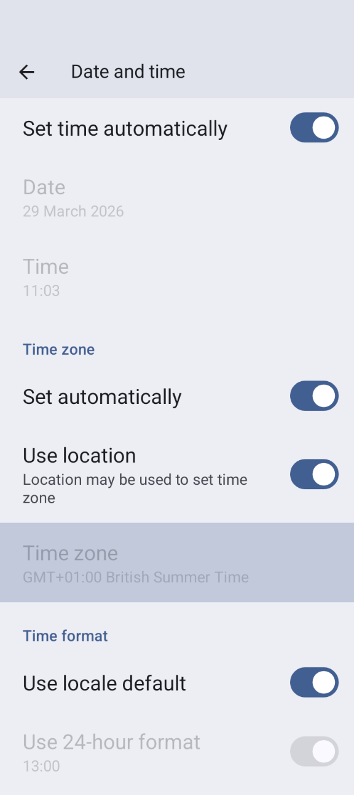

# Cambio fuso orario e ora legale

## Timezone traveling with pumps

## Cambio fuso orario per Omnipod Dash

* Aggiornare la scheda Dash
* Selezionare temporaneamente un **Profilo** diverso e poi tornare al **Profilo** originale o desiderato

## Cambio fuso orario per DanaR, Korean DanaR

Non ci sono problemi nel cambiare il fuso orario nel telefono perché il microinfusore non usa la cronologia.

## Cambio fuso orario per DanaRv2, DanaRS

Questi microinfusori richiedono attenzione particolare perché **AAPS** usa la cronologia del microinfusore, ma le registrazioni nel microinfusore non hanno il timestamp del fuso orario. **Ciò significa che se si cambia il fuso orario nel telefono, le registrazioni verranno lette con un fuso orario diverso e verranno duplicate.**

Per evitare ciò esistono due possibilità:

### Opzione 1: Mantenere l'ora di casa e sfasamento temporale del Profilo

* Disattivare "Data e ora automatiche" nelle impostazioni del telefono (cambio manuale del fuso orario).

* Il telefono deve mantenere l'ora standard di casa per l'intero periodo di viaggio.

* Sfasare temporalmente il **Profilo** in base alla differenza di orario tra l'ora di casa e l'ora di destinazione.
   * Tenere premuto sul nome del **Profilo** (al centro della sezione superiore nella schermata principale)
   * Selezionare "**Cambio Profilo**"
   * Impostare lo "Sfasamento temporale" in base alla destinazione.

   

   * Es. Vienna -> New York: **Cambio Profilo** +6 ore
   * Es. Vienna -> Sydney: **Cambio Profilo** -8 ore

### Opzione 2: Eliminare la cronologia del microinfusore

* Disattivare "Data e ora automatiche" nelle impostazioni del telefono (cambio manuale del fuso orario)

All'uscita dall'aereo:

* turn off pump
* cambiare il fuso orario nel telefono
* spegnere il telefono, accendere il microinfusore
* clear history in pump
* change time in pump
* accendere il telefono
* lasciare che il telefono si connetta al microinfusore e regoli l'ora con precisione

## Cambio fuso orario per Insight

Il driver regola automaticamente l'ora del microinfusore all'ora del telefono.

L'Insight registra anche le voci di cronologia in cui l'ora è stata cambiata e da quale (vecchia) ora a quale (nuova) ora. Quindi in **AAPS** è possibile determinare l'ora corretta nonostante il cambio dell'ora.

Potrebbe causare imprecisioni nei **TDD**. Ma non dovrebbe essere un problema.

Quindi l'utente dell'Insight non deve preoccuparsi dei cambi di fuso orario e dell'ora. C'è un'eccezione a questa regola: il microinfusore Insight ha una piccola batteria interna per alimentare l'orologio, ecc. mentre si sostituisce la batteria "reale". Se la sostituzione della batteria richiede troppo tempo, questa batteria interna si scarica, l'orologio si azzera e viene richiesto di inserire data e ora dopo l'inserimento della nuova batteria. In questo caso, tutte le voci precedenti alla sostituzione della batteria vengono ignorate nel calcolo di AAPS perché l'ora corretta non può essere identificata correttamente.

## Cambio fuso orario per Accu-Chek Combo

Il [nuovo driver Combo](../CompatiblePumps/Accu-Chek-Combo-Pump-v2.md) regola automaticamente l'ora del microinfusore all'ora del telefono. Il Combo non può memorizzare i fusi orari, solo l'ora locale, che è esattamente ciò che il nuovo driver programma nel microinfusore. Inoltre, memorizza il fuso orario nelle preferenze locali di AAPS per poter convertire l'ora locale del microinfusore in un timestamp completo con offset di fuso orario. L'utente non deve fare nulla; se l'ora del Combo si discosta troppo dall'ora corrente del telefono, l'ora del microinfusore viene regolata automaticamente.

Si noti che ciò richiede un po' di tempo, poiché può essere eseguito solo in modalità terminal remoto, che è generalmente lenta. Questa è una limitazione del Combo che non può essere superata.

Il vecchio driver basato su Ruffy non regola l'ora automaticamente. L'utente deve farlo manualmente. Vedere i passaggi necessari di seguito per farlo in sicurezza nel caso in cui il fuso orario / l'ora legale sia la causa del cambiamento.

## Cambio fuso orario per Medtrum

Il driver regola automaticamente l'ora del microinfusore all'ora del telefono.

I cambi di fuso orario mantengono intatta la cronologia; solo il TDD potrebbe essere influenzato. Modificare manualmente l'ora nel telefono può causare problemi con la cronologia e l'**IOB**. Se si cambia l'ora manualmente, verificare l'**IOB**.

Quando il fuso orario o l'ora cambiano, i **TBR** in esecuzione vengono interrotti.

## ORA LEGALE (DST)
Regolazione dell'ora per l'ora legale

A seconda della configurazione del microinfusore e del CGM, i salti di orario possono causare problemi nel corretto funzionamento di **AAPS**. Ad esempio, con il microinfusore Combo, la cronologia del microinfusore viene letta due volte, dando luogo a voci duplicate. Per alcuni microinfusori è preferibile apportare le modifiche al fuso orario mentre si è svegli e non di notte.

### DST automatic adjustment for most pumps

* Questa funzionalità di regolazione è disponibile a partire dalla versione 2.2 di **AAPS**.
* Tuttavia, il Loop completamente chiuso verrà disattivato per 3 ore DOPO il cambio dell'ora legale (di solito dall'1:00 in poi) e **AAPS** tornerà alla basale in background selezionata nel **Profilo**. Ciò viene fatto per ragioni di sicurezza: l'**IOB** potrebbe essere troppo alto a causa di un bolo duplicato prima del cambio dell'ora legale.
* Dopo il cambio dell'ora legale, selezionare **Cambio Profilo** per il **Profilo** desiderato dall'utente per abilitare il Loop completamente chiuso.
* Riceverai anche una notifica sulla schermata principale di **AAPS** prima del cambio dell'ora legale che indica che il Loop completamente chiuso è stato temporaneamente disabilitato. Questo messaggio apparirà senza segnale acustico, vibrazione o altro.**

Se esegui un bolo con il calcolatore di **AAPS**, non utilizzare i dati **COB** e **IOB** a meno che tu non sia sicuro che siano assolutamente corretti. Prestare attenzione e non utilizzare questa funzionalità per un paio di ore dopo il cambio dell'ora legale.

### Ora legale per Accu-Chek Insight

* Il cambio all'ora legale viene effettuato automaticamente. Non è richiesta alcuna azione.

### Ora legale per Medtrum

* Il cambio all'ora legale viene effettuato automaticamente. Non è richiesta alcuna azione.

### Ora legale per Omnipod Dash

* Consentire ad **AAPS** di tornare temporaneamente alla basale in background dopo il cambio dell'ora legale come spiegato sopra.
* In alternativa, se non si desidera che **AAPS** torni temporaneamente alla basale in background durante la notte, è possibile cambiare il fuso orario il giorno prima del cambio dell'ora legale per evitare interruzioni notturne. NOTA: QUESTA OPZIONE POTREBBE CAUSARE LA SCADENZA ANTICIPATA DEL POD. SI PREGA DI AVERE FORNITURE A DISPOSIZIONE SE SI SCEGLIE QUESTA OPZIONE.

#### Azioni da intraprendere prima del cambio dell'ora
1. Disattivare qualsiasi impostazione del telefono che imposta automaticamente il fuso orario del telefono, in modo da poter cambiare in un fuso orario che non utilizza l'ora legale. Come abilitarlo dipende dallo smartphone e dalla versione Android.

   * Alcuni telefoni hanno due impostazioni, una per l'impostazione automatica dell'ora (che idealmente dovrebbe rimanere attiva) e una per l'impostazione automatica del fuso orario (che bisogna DISATTIVARE).
   * Purtroppo alcune versioni di Android hanno un unico interruttore per abilitare l'impostazione automatica sia dell'ora che del fuso orario. Sarà necessario disattivarlo per ora.

2. Find a timezone that has the same time as your current location but doesn't use DST.

   * A list of these countries is available [https://greenwichmeantime.com/countries](https://greenwichmeantime.com/countries/)
   * Per il Fuso Orario dell'Europa Centrale (CET) potrebbe essere "Brazzaville" (Congo). Cambiare il fuso orario del telefono in Congo.

3. Aggiornare il microinfusore in **AAPS** e passare al **Profilo** desiderato.

3. Controllare l'**IOB** e il **COB** di **AAPS** e, se non sono accurati, disabilitare il Loop completamente chiuso per almeno un DIA e il Tempo massimo dei carboidrati, quello che è maggiore.

4. Actions to take after the clock change. A good time to make this switch would be with low **IOB**. 4. E.g. E.g. an hour before a meal such as breakfast. Your **COB** and **IOB** should both be close to zero.)

### Ora legale per Accu-Chek Combo

Questa sezione è valida solo per il vecchio driver basato su Ruffy. Il nuovo driver regola automaticamente data, ora e ora legale.

**AAPS** emetterà un allarme se l'ora tra il microinfusore e il telefono differisce troppo. In caso di regolazione dell'ora legale, ciò avverrebbe nel cuore della notte. Per prevenire questo problema e dormire tranquillamente, seguire questi passaggi per poter forzare il cambio dell'ora in un momento conveniente:

#### Azioni da intraprendere prima del cambio dell'ora
1. Disattivare qualsiasi impostazione che imposta automaticamente il fuso orario, in modo da poter forzare il cambio dell'ora quando si vuole. Come farlo dipenderà dallo smartphone e dalla versione Android.

   * Alcuni hanno due impostazioni, una per l'impostazione automatica dell'ora (che idealmente dovrebbe rimanere attiva) e una per l'impostazione automatica del fuso orario (che bisogna DISATTIVARE).
   * Purtroppo, alcune versioni di Android hanno un unico interruttore per abilitare l'impostazione automatica sia dell'ora che del fuso orario. Sarà necessario disattivarlo per ora.

   Screenshot_20260329-110315 (1)

2. Find a timezone that has the same time as your current location but doesn't use DST.

   * A list of these countries is available [https://greenwichmeantime.com/countries](https://greenwichmeantime.com/countries/)
   * Per il Fuso Orario dell'Europa Centrale (CET) potrebbe essere "Brazzaville" (Congo). Cambiare il fuso orario del telefono in Congo.

3. In **AAPS** refresh your pump.

4. Check the Treatments tab... If you see any duplicate treatments:

   * DON'T press "delete treatments in the future"
   * Hit "remove" on all future treatments and duplicate ones. This should invalidate the treatments rather than removing them so they will not be considered for IOB anymore.

5. If the situation on how much IOB/COB is unclear - for safety please disable the loop for at least one DIA and Max-Carb-Time - whatever is bigger.*

#### Actions to take after the clock change
Un buon momento per effettuare questo passaggio sarebbe con un **IOB** basso. E.g. E.g. an hour before a meal such as breakfast. Ad esempio, un'ora prima di un pasto come la colazione (tutti i boli recenti nella cronologia del microinfusore saranno state piccole correzioni SMB. Ideally your **COB** and **IOB** should both be close to zero.

1. Change the Android timezone back to your current location and re-enable automatic timezone.
2. **AAPS** will soon start alerting you that the Combo’s clock doesn’t match. So update the pump’s clock manually via the pump’s screen and buttons.
3. On the **AAPS** “Combo” screen, press Refresh.
4. Then go to the Treatments screen, and look for any events in the future. There shouldn’t be many.

   * DON'T press "delete treatments in the future"
   * Hit "remove" on all future treatments and duplicate ones. This should invalidate the treatments rather than removing them so they will not be considered for IOB anymore.

5. If the situation on how much IOB/COB is unclear - for safety please disable the loop for at least one DIA and Max-Carb-Time - whatever is bigger.*
6. Continuare normalmente.

