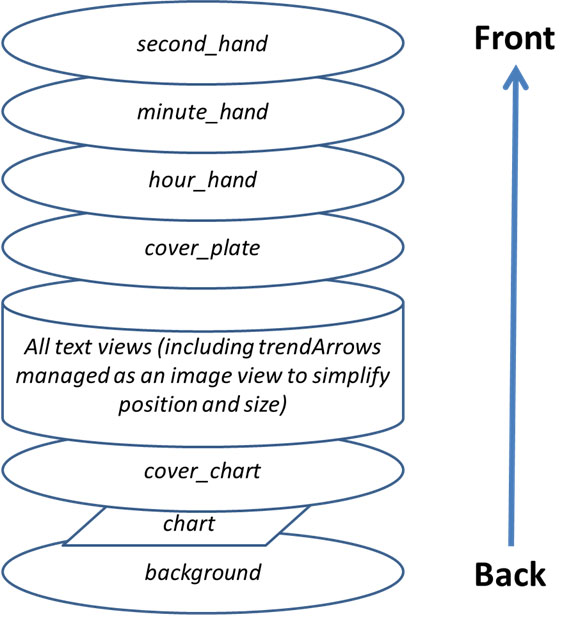
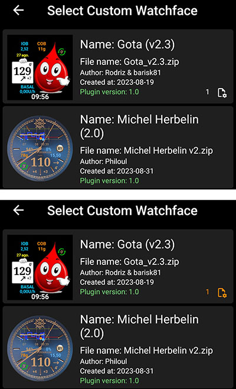
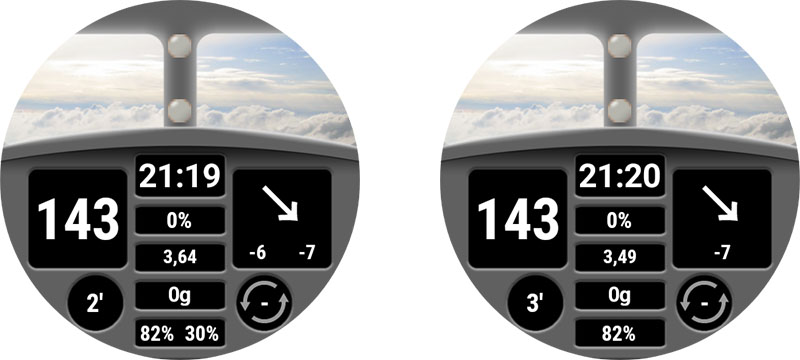
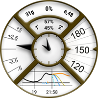
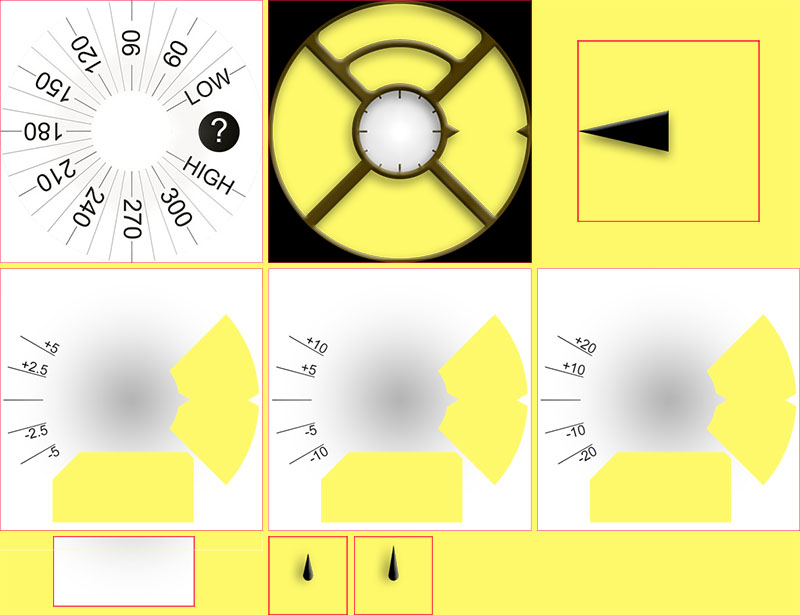
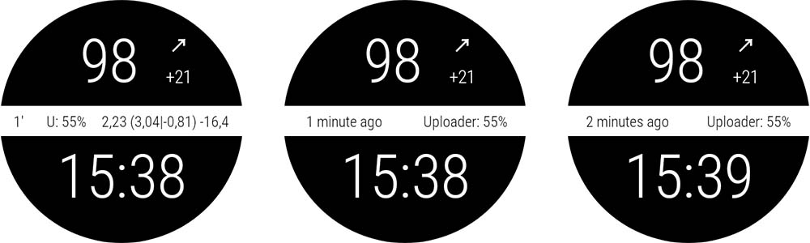
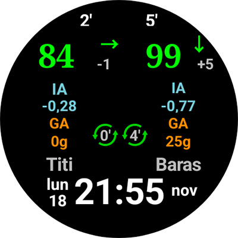

# Documento di riferimento Custom Watchface

Questa pagina è destinata ai designer di nuovi quadranti. Elenca tutte le parole chiave e le funzionalità disponibili per creare o animare un nuovo quadrante.

- Le nuove funzionalità e chiavi disponibili in Custom Watchface V2 (Wear apk 3.3.0 o superiore) sono disponibili [qui](#cwf-reference-new-v2-features)

## Formato Custom Watchface

Custom Watchface è un formato aperto progettato per AAPS, associato al nuovo quadrante "AAPS (Custom)" disponibile sull'orologio.

Il file del quadrante è un semplice file zip, ma per essere riconosciuto come file di quadrante, il file zip deve contenere i seguenti file:

- One image file named CustomWatchface (can be bitmap files `CustomWatchface.jpg`, `CustomWatchface.png` or a vector `CustomWatchface.svg`). This file is the little icon used to select the watchface when you click on "Load Watchface" button, and also the image visible within AAPS Wear plugin.
- Un file denominato `CustomWatchface.json` (vedi [struttura JSON](#cwf-reference-json-structure) sotto). Questo secondo file è il file principale che contiene tutte le informazioni necessarie per progettare il quadrante. Il file json deve essere valido (questo è probabilmente il punto più delicato quando si modifica manualmente il file con un editor di testo, perché una virgola mancante o in più è sufficiente a invalidare il formato json). Il file JSON deve anche includere un blocco `"metadata"` con una chiave `"name"` non vuota. Questo sarà il nome del tuo quadrante personalizzato (vedi [Impostazioni Metadata](#cwf-reference-metadata-settings) sotto).
- - the size of this zip should be as small as possible (less than about 500kb). If this file is too big, it will just be blocked and not transmitted to the watch.

Il file zip può contenere anche alcuni file di risorse aggiuntivi:

- Nomi di file predefiniti per le immagini che verranno utilizzate nelle viste standard incluse nel quadrante (come `Background`, `CoverChart`... vedi [Elenco dei file di risorse predefiniti](#cwf-reference-list-of-hardcoded-resource-files) sotto). Tutti questi file possono essere in formato `jpg`, `png` o `svg`, ma per la maggior parte di essi sarà necessario usare `png` o `svg` che gestiscono la trasparenza (i jpg sono più leggeri dei png, ma senza trasparenza). La migliore qualità con la dimensione minore si ottiene generalmente con i file svg (formato vettoriale).
- File di risorse aggiuntivi con nomi liberi. Questi file aggiuntivi possono essere immagini o font (`ttf` e `otf` sono i formati accettati per i font). Il `filename` (senza estensione) verrà usato come keyValue nel file JSON per specificare dove o quando questi file devono essere usati.
  - I file immagine vengono spesso usati come sfondo di viste di testo o per animazioni dinamiche (come il livello della batteria da 0% a 100%)
  - I file font consentono di usare font dedicati nel quadrante

(cwf-reference-json-structure)=

## Struttura JSON

I file JSON possono essere modificati con un editor di testo come Notepad (o notepad++) (preferire notepad++ che riconosce il JSON e usa la formattazione a colori).

- Contiene chiavi stringa `"string_key":` e valori che possono essere stringhe come `"key value"`, numeri interi, booleani come `true` o `false`, oppure blocchi di dati.
- Ogni valore è separato da una virgola `,`
- Un blocco di dati inizia con `{` e termina con `}`
- Il file json è un unico blocco che inizia con `{` e termina con `}`, e al suo interno tutti i blocchi annidati sono associati a una `"key"` che deve essere univoca all'interno del blocco
- Per migliorare la leggibilità del file json, è solitamente indentato (ogni nuova chiave è su una nuova riga, ogni nuovo blocco è sfalsato a destra di 4 spazi)

(cwf-reference-metadata-settings)=

### Impostazioni Metadata

Questo blocco è il primo blocco incluso nel file json ed è obbligatorio. Contiene tutte le informazioni associate al quadrante, come il nome, l'autore, la data di creazione o aggiornamento, la versione dell'autore o la versione del plugin.

Di seguito un esempio di blocco metadata:

```text
"metadata": {
    "name": "Default Watchface",
    "author": "myName",
    "created_at": "07\/10\/2023",
    "author_version": "1.0",
    "cwf_version": "1.0",
    "comment": "Default watchface, you can click on EXPORT WATCHFACE button to generate a template"
},
```

Nota: il carattere `/` usato per la data è un carattere speciale; per essere riconosciuto correttamente nel file json, deve essere preceduto dal carattere di "escape" `\`

In alcuni file json è presente una chiave aggiuntiva `"filename"`: questa chiave viene creata o aggiornata automaticamente quando il quadrante personalizzato viene caricato in AAPS (viene usata per mostrare all'utente il nome del file zip nella cartella exports), quindi può essere rimossa dal blocco metadata.

(cwf-reference-general-parameter-settings)=

### Impostazioni dei parametri generali

Ricordare che i soli valori dinamici disponibili sono quelli elencati [qui](#cwf-reference-dyndata-key-values)

Di seguito un esempio di parametri generali

```text
"highColor": "#FFFF00",
"midColor": "#00FF00",
"lowColor": "#FF0000",
"lowBatColor": "#E53935",
"carbColor": "#FB8C00",
"basalBackgroundColor": "#0000FF",
"basalCenterColor": "#64B5F6",
"gridColor": "#FFFFFF",
"pointSize": 2,
"enableSecond": true,
```
(cwf-reference-imageview-settings)=

### Impostazioni ImageView

L'immagine personalizzata si configura usando il nome file corretto associato a ciascuna ImageView inclusa nel layout del quadrante; il blocco json serve solo a definire posizione, dimensione, visibilità e, opzionalmente, il colore:

Di seguito un esempio di blocco Image per second_hand (in questo caso non è inclusa nessuna immagine nel file zip, quindi verrà usata l'immagine predefinita della lancetta dei secondi, colorata con un colore personalizzato).

```text
"second_hand": {
    "width": 400,
    "height": 400,
    "topmargin": 0,
    "leftmargin": 0,
    "visibility": "visible",
    "color": "#BC906A"
}
```
Per colorare la lancetta dei secondi con il colore predefinito della glicemia (lowRange, midRange o highRange), basta modificare l'ultima riga con il keyValue `bgColor`

```json
    "color": "bgColor"
```

(cwf-reference-textview-settings)=

### Impostazioni TextView

La TextView ha più parametri disponibili rispetto alla ImageView: è possibile regolare la rotazione (valore intero in gradi), la dimensione del testo (valore intero in pixel), la gravity (per definire se il testo è centrato — valore predefinito — o allineato a sinistra o a destra), il font, lo fontStyle e il fontColor, nonché il colore di sfondo della TextView.

```text
"basalRate": {
    "width": 91,
    "height": 32,
    "topmargin": 133,
    "leftmargin": 249,
    "rotation": 0,
    "visibility": "visible",
    "textsize": 23,
    "gravity": "center",
    "font": "default",
    "fontStyle": "bold",
    "fontColor": "#BDBDBD"
},
```
Se non si vuole gestire una vista nel quadrante, impostare la chiave `"visibility"` a `"gone"` e anche dimensione e posizione fuori dall'area visibile, in questo modo:

```text
"second": {
    "width": 0,
    "height": 0,
    "topmargin": 0,
    "leftmargin": 0,
    "rotation": 0,
    "visibility": "gone",
    "textsize": 46,
    "gravity": "center",
    "font": "default",
    "fontStyle": "bold",
    "fontColor": "#BDBDBD"
},
```
Se dimensione e posizione sono nell'area visibile, si potrebbe vedere un "lampeggio" del valore nascosto durante l'aggiornamento del quadrante.

Per personalizzare l'immagine di sfondo di una text view, usare la chiave `"background":` e inserire come keyValue il nome del file immagine incluso nel file zip; è anche possibile cambiare solo il colore di sfondo con la chiave `"color:"` .

```json
"background": "fileName"
```

Sono disponibili anche 4 textView specifiche (denominate freetext1 a freetext4) che hanno il parametro specifico `"textvalue":` utilizzabile per impostare ad esempio un'etichetta.

(cwf-reference-chartview-settings)=

### Impostazioni ChartView

La Chart view è una vista molto specifica che può condividere alcuni parametri con ImageView o con TextView.

Le impostazioni standard per questa vista sono molto semplici:

```text
"chart": {
    "width": 400,
    "height": 170,
    "topmargin": 230,
    "leftmargin": 0,
    "visibility": "visible"
},
```
I 2 parametri aggiuntivi per la Chart view sono: il colore di sfondo (predefinito trasparente) tramite la chiave `"color"`, o un'immagine di sfondo tramite la chiave `"background"`.

(cwf-reference-how-to-build-watchface)=

## Come costruire/progettare il tuo primo quadrante

### Strumenti necessari

- Editor di testo: si consiglia NotePad++ (o equivalente), un semplice editor di testo con il vantaggio di mostrare il testo formattato con codice colore, rendendo più facile individuare gli errori. Qualsiasi editor di testo semplice va comunque bene, poiché lo scopo è modificare le informazioni json. Since the purpose is to tune json information.
- Editor di immagini (bitmap e/o vettoriale)
  - Se usi Bitmap
    - L'editor deve essere in grado di gestire la trasparenza (necessaria per tutte le immagini sopra lo sfondo) e il formato png (se si usano immagini bitmap)
    - L'immagine di sfondo può essere in formato jpg (più piccolo del png)
    - L'editor deve consentire di misurare in pixel gli oggetti grafici (può essere un semplice rettangolo) (top, left, width, height)
    - L'editor deve essere in grado di mostrare i colori con codice RRGGBB in esadecimale
    - L'editor deve poter ridimensionare le immagini a 400px x 400px (molto importante lavorare con questa risoluzione)
  - Se usi Vettoriale
    - L'immagine vettoriale deve essere esportata in formato svg

### Ottenere il template per non partire da zero

Quando si vuole progettare il proprio primo quadrante, il modo migliore è partire dal quadrante predefinito (questo garantisce di avere l'ultima versione con tutte le viste disponibili correttamente ordinate).

- Il file zip si ottiene cliccando sul pulsante "Esporta template" nel plugin Wear e recuperando il file zip dalla cartella AAPS/exports
- Nota: per vedere i pulsanti Custom Watchface è necessario avere un orologio connesso ad AAPS (l'orologio è comunque necessario per controllare, testare e mettere a punto il quadrante personalizzato)

Il quadrante predefinito è molto semplice e il file zip contiene solo 2 file:

- CustomWatchface.png (immagine del quadrante predefinito per la selezione del quadrante)
- CustomWatchface.json

### Organizzare i file sul computer

Il modo più comodo di lavorare è avere il telefono collegato al computer e lavorare con due cartelle specifiche:

- Un explorer aperto su una cartella specifica che contiene tutti i file (json, immagini bitmap, immagini vettoriali, font) e il file CustomWatchface.zip
- Un altro explorer (o albero di navigazione) aperto sulla cartella Phone/AAPS/exports del telefono

In questo modo il lavoro è molto semplice: ogni volta che si modifica il file json con l'editor di testo o un'immagine con l'editor di immagini (bitmap o vettoriale), basta:

1. Salvare le modifiche in ogni app
2. Trascinare tutti i file nel file CustomWatchface.zip
3. Trascinare CustomWatchface.zip nella cartella AAPS/exports del telefono
4. Inviare CustomWatchface all'orologio per verificare i risultati

### Inizializzare la personalizzazione del quadrante

Il primo passo è definire un nome per il quadrante (necessario per selezionarlo facilmente durante i test) e iniziare a configurare le chiavi metadata all'inizio del file json.

Occorre poi definire quali informazioni visualizzare, ovvero quali viste devono essere visibili o nascoste.

- Si vuole gestire i secondi o no?
- Si vuole progettare un orologio analogico o digitale (o entrambi...)?

A questo punto si può iniziare a modificare il file json impostando la chiave `"visibility":` di ciascuna vista su `"visible"` o `"gone"` (a seconda che si voglia mantenere o meno la vista).

È anche possibile iniziare a regolare approssimativamente i valori di margine superiore, sinistro, larghezza e altezza per organizzare il quadrante (questi valori verranno affinati in seguito con l'editor di immagini).

Nota: tutto viene progettato in un **rettangolo 400px x 400px**. Tutto sarà quindi posizionato in coordinate assolute all'interno di questa dimensione.

Quando si progetta il primo quadrante, è importante sapere che tutto è organizzato a livelli dal basso verso l'alto, quindi ogni vista (ImageView o TextView) può nascondere qualcosa che si trova dietro...





Nel file json tutte le viste sono ordinate dal basso verso l'alto (questo aiuta a ricordare cosa si trova dietro cosa...).

Se si sta progettando o modificando il primo quadrante personalizzato, iniziare con cose semplici: cambiare la visibilità di alcune viste, includere un'immagine di sfondo dedicata senza modificare il file json...

### Gestire i colori

nome del dato dinamico da usare (generalmente uguale alla chiave della vista associata).<br />Se non specificato, verrà usato il valore predefinito per la vista che usa questo blocco.<br />Ad esempio, è possibile definire un blocco per personalizzare la percentuale della batteria senza specificare valueKey, e poi usare lo stesso blocco per uploader_battery e rig_battery

I colori sono specificati con un campo di testo che inizia con `#` seguito dai valori RRGGBB (Rosso, Verde, Blu) in formato esadecimale:

- `"#00000000"` è completamente trasparente, e `"#FF000000"` è completamente opaco (quindi `"#FF000000"` è equivalente a `"#000000"`)

È anche possibile includere 2 valori aggiuntivi per il livello alpha e specificare un livello di trasparenza (AARRGGBB):

- `"#FFFFFF"` è bianco, `"#000000"` è nero, `"#FF0000"` è rosso...

È anche possibile usare il keyvalue specifico `"bgColor"` per usare automaticamente `"highColor"`, `"midColor"`, `"lowColor"` specificati nei parametri generali in base al valore glicemia:

- `"fontColor": "bgColor",` imposterà automaticamente il colore del font della vista in base al valore glicemia
- Nota che le viste `sgv` (per il valore glicemia) e `direction` (per la freccia di tendenza) applicano automaticamente i colori glicemici impostati nei parametri generali (per queste 2 viste, se si vogliono colori diversi, occorre usare la funzionalità avanzata [dynData](#cwf-reference-dyndata-feature) con un colore a passo singolo...)

Per maggiori informazioni sulle ImageView e sulla chiave `"color":`, vedere il capitolo dedicato [Regolare il colore dell'immagine](#cwf-reference-tune-image-color) sotto.

### Includere immagini predefinite

Il modo più semplice per iniziare a personalizzare il quadrante è includere nel file zip alcune immagini con nomi specifici (vedi [Elenco dei file di risorse predefiniti](#cwf-reference-list-of-hardcoded-resource-files)).

- Le immagini devono essere in formato `.jpg`, `.png` o `.svg`. Attenzione: il formato jpg non gestisce la trasparenza, quindi deve essere usato solo per il livello di sfondo. Per tutti i livelli intermedi (cover_chart, cover_plate, hands) usare `.png` o `.svg`.

- Se si dispone di un editor di immagini vettoriali (come ad esempio Illustrator), preferire questo formato che produce file di testo piccoli con estensione `.svg` e della migliore qualità.
- Occorre fare attenzione a usare il nome file esatto (incluse maiuscole/minuscole).

Per aggiungere un'immagine di sfondo dedicata, è sufficiente includere nel file zip un file denominato `Background.jpg` (senza modificare nient'altro, inviare il file zip all'orologio e verificare il risultato). send zip file into the watch and check result!.

Per personalizzare hour_hand, minute_hand o second_hand di un orologio analogico, includere semplicemente `HourHand.png` (o `HourHand.svg`), `MinuteHand.png` e `SecondHand.png`.

- Queste immagini ruoteranno automaticamente attorno al centro dell'immagine, quindi devono essere impostate alle 00:00:00 (per un orologio analogico a "frame completo", usare una dimensione di 400 x 400 px posizionata a top 0 left 0).

Come si può notare nell'[Elenco dei file di risorse predefiniti](#cwf-reference-list-of-hardcoded-resource-files), per ogni image view sono disponibili due nomi file predefiniti aggiuntivi `High` e `Low` (ad esempio è possibile includere nel file zip altre immagini denominate `BackgroundHigh.jpg` e `BackgroundLow.jpg`). L'immagine cambierà automaticamente in base al livello glicemia (in range, iper o ipo). Vedere il quadrante AIMICO come esempio.

(cwf-reference-tune-image-color)=

### Regolare il colore dell'immagine

La chiave `"color"` può essere usata per regolare il colore predefinito dell'immagine:

- Applicata alla vista background, imposta il colore di sfondo (predefinito nero)
- Applicata a cover_plate (quadrante semplice) o alle lancette, cambia l'immagine predefinita (bianca) con il colore specificato (incluso `"bgColor"`)

Quando si applica la chiave `"color"` a un'immagine bitmap (`.jpg` o `.png`), il colore produce un interessante effetto sulla saturazione del colore. L'immagine bitmap risulterà comunque riconoscibile.

Infine, sui file di immagine `.svg`, la chiave `"color"` non ha alcun effetto: il colore dei file vettoriali è da considerarsi fisso nell'immagine. Per cambiare i colori occorre includere più file `svg` e usare la funzionalità avanzata [dynData](#cwf-reference-dyndata-feature).

### Usare font aggiuntivi per le TextView

Diversi font predefiniti sono già disponibili nell'apk wear (vedi le chiavi font nel capitolo [valori chiave](#cwf-reference-key-values)). Per usare font aggiuntivi non disponibili come predefiniti, è possibile includerli nel file zip:

- I 2 formati font accettati sono `.ttf` e `.otf`
- Se si include un font personalizzato nel file zip, ad esempio con un file denominato `myCustomFont.ttf`, occorre usare il nome del file nel file json per una TextView:

```
"font": "myCustomFont",
```

Tenere presente che alcuni font possono essere inclusi in file di grandi dimensioni (e c'è un limite massimo per la dimensione del file zip). Se si usano pochissimi caratteri (numeri, `.`, `,`), è possibile usare strumenti gratuiti per rimuovere i caratteri inutilizzati (ad esempio [qui](https://products.aspose.app/font/generator/ttf-to-ttf)) e ridurre così la dimensione del font.

(cwf-reference-advanced-features)=

## Funzionalità avanzate

(cwf-reference-preference-feature)=

### Funzionalità Preferenze

CustomWatchface può regolare automaticamente alcune preferenze dell'orologio per avere la corretta visualizzazione del quadrante (se l'autorizzazione è concessa dall'utente nelle preferenze Wear).

Questa funzionalità deve però essere usata con attenzione. Le preferenze sono comuni a tutti gli altri quadranti. Ecco quindi alcune regole da rispettare:

- Non impostare mai preferenze relative a viste nascoste
- Cercare di massimizzare le viste visibili
- Sentirsi liberi di sovradimensionare la larghezza di alcune viste:
  - La TBR può essere mostrata come percentuale (larghezza ridotta, ma anche come valori assoluti molto più ampi)
  - Delta o avg delta con informazioni dettagliate possono essere larghi
  - Lo stesso vale per iob2: questa vista può avere il totale iob, ma se è selezionato l'iob dettagliato, la dimensione del testo può essere molto lunga

Se si hanno ancora bisogno di impostazioni molto specifiche per una visualizzazione corretta (nell'esempio seguente, se non c'è abbastanza spazio per l'iob dettagliato, si può "forzare" questo parametro a `false` sull'orologio), è possibile includere nel blocco metadata alcuni vincoli di impostazione come questo:

```text
"metadata": {
    "name": "Default Watchface",
    "author": "myName",
    "created_at": "07\/10\/2023",
    "author_version": "1.0",
    "cwf_version": "1.0",
    "comment": "Default watchface, you can click on EXPORT WATCHFACE button to generate a template",
    "key_show_detailed_iob": false
},
```

Se l'utente autorizza il quadrante personalizzato a modificare i parametri dell'orologio (impostazione nel plugin wear), "Mostra iob dettagliato" verrà impostato su "disabilitato" e bloccato in questa modalità (nessuna modifica di questo parametro è possibile finché l'autorizzazione non viene disabilitata nelle impostazioni del plugin wear o non viene selezionato un altro quadrante).

- Nota: quando un utente seleziona un quadrante, può vedere il numero di "parametri richiesti" durante la selezione del quadrante.

Nell'esempio seguente il quadrante Gota ha un parametro richiesto. Se l'autorizzazione non è concessa, viene mostrato in bianco; se l'autorizzazione è concessa, il parametro verrà impostato e bloccato sull'orologio (in questo caso il numero è in arancione).




(cwf-reference-twinview-feature)=

### Funzionalità TwinView

Le twin view (viste gemelle) forniscono un modo semplice per regolare la posizione delle viste in base alle viste visibili. Non hanno la potenza di un layout interamente composto da LinearLayout, ma possono gestire molti casi comuni.

Nell'esempio seguente si può vedere il quadrante AAPS (Cockpit) con tutte le viste visibili nelle impostazioni, e lo stesso quadrante con "Mostra batteria rig" disabilitato e "Mostra avg delta" disabilitato.



Si può vedere che quando una delle viste gemelle è nascosta, l'altra si sposta per rimanere centrata.

In questo esempio si vede che nel blocco `"uploader_battery"` la chiave `"twinView":` è aggiunta per definire la vista `"rig_battery"`, e nel blocco `"rig_battery"` la chiave `"twinView":` definisce `"uploader_battery"` come gemella. La chiave aggiuntiva `"leftOffsetTwinHidden":` definisce il numero di pixel di cui spostare la vista quando la gemella è nascosta.

Per calcolare questo valore, si nota che la differenza tra il leftMargin di ciascuna delle viste gemelle è 50 pixel, quindi l'offset per rimanere centrati è la metà in una direzione o nell'altra.

Se le viste gemelle sono posizionate verticalmente, in questo caso occorre usare la chiave `"topOffsetTwinHidden":`

```text
"uploader_battery": {
    "width": 49,
    "height": 30,
    "topmargin": 354,
    "leftmargin": 150,
    "rotation": 0,
    "visibility": "visible",
    "textsize": 23,
    "gravity": "center",
    "font": "roboto_condensed_bold",
    "fontStyle": "bold",
    "fontColor": "#FFFFFF",
    "twinView": "rig_battery",
    "leftOffsetTwinHidden": 25
},
"rig_battery": {
    "width": 49,
    "height": 30,
    "topmargin": 354,
    "leftmargin": 200,
    "rotation": 0,
    "visibility": "visible",
    "textsize": 23,
    "gravity": "center",
    "font": "roboto_condensed_bold",
    "fontStyle": "bold",
    "fontColor": "#FFFFFF",
    "twinView": "uploader_battery",
    "leftOffsetTwinHidden": -25
},
```
(cwf-reference-dyndata-feature)=

### Funzionalità DynData

DynData è la funzionalità più potente per includere animazioni nel quadrante, in base a valori interni (come il valore glicemia, il livello glicemia, il delta, la % di batteria... vedi l'elenco dei dati disponibili [qui](#cwf-reference-dyndata-key-values)).

Per illustrare questa funzionalità, prendiamo come esempio il quadrante AAPS (SteamPunk):



In questo quadrante occorre gestire la [rotazione del valore glicemia](#cwf-reference-background-management) (da 30 a 330 gradi) sulla destra, il [range dinamico di avg_delta](#cwf-reference-avg-delta-management) (scala fino a 5mgdl, 10mgdl o 20mgdl in base al valore), la [rotazione del puntatore](#cwf-reference-dynamic-rotation-management) che deve essere sincronizzato con la scala, e i diversi livelli delle viste...

Per gestire questo quadrante, di seguito tutte le immagini incluse nel file zip:

Nota: per poter vedere la trasparenza, tutte queste immagini sono su sfondo giallo circondate da un quadrato rosso.



- Nella prima riga, Background.jpg e CoverPlate.png verranno mappati automaticamente con la vista associata (nome file vista predefinito), e steampunk_pointer.png sarà gestito da dynData
- Nella seconda riga si vedono le 3 scale del range dinamico per avg_delta, che saranno anch'esse gestite da dynData
- Nella terza riga, chartBackground.jpg verrà collegato manualmente nella vista chart, HourHand.png e MinuteHand.png verranno mappati automaticamente con le viste associate

(cwf-reference-background-management)=

#### **Gestione dello sfondo**

So we will have to map BG value to the background, and then rotate background image according to BG value. First, concerning BG value image, no choice here, it can only be in the background layer (otherwise it will be in front of the chart view and chart will not be visible!).

Nel blocco `"background"` includiamo 2 chiavi dedicate per questa rotazione:

```text
"background": {
    "width": 400,
    "height": 400,
    "topmargin": 0,
    "leftmargin": 0,
    "dynData": "rotateSgv",
    "rotationOffset": true,
    "visibility": "visible"
},
```
La chiave `"dynData":` definisce quale blocco usare per l'animazione (valore, range, conversione...); qui il blocco è stato chiamato "rotateSgv" (scegliere un nome esplicito quando si usa questa funzionalità).

`"rotationOffset": true,` definisce che l'animazione attesa in base al valore deve essere una rotazione. (Le altre chiavi disponibili sono `"leftOffset"` e `"topOffset"` per creare uno slider.)

Ora andiamo alla fine del file, dopo l'ultima vista:

```text
"second_hand": {
    "width": 120,
    "height": 120,
    "topmargin": 140,
    "leftmargin": 140,
    "visibility": "gone"
},
"dynData": {
    "rotateSgv": {
        "valueKey": "sgv",
        "minData": 30,
        "maxData": 330
    },
```
Si vede che dopo l'ultima vista (`"second_hand"`), è stato aggiunto un nuovo blocco `"dynData": { ... }` che conterrà tutte le animazioni.

Il blocco definito nella vista `"background"` si chiama `"rotateSgv"`, ed è il primo blocco che si trova in `"dynData"`!

Questo blocco è semplice: contiene una prima chiave `"valueKey":` che definisce quale valore usare. In questo caso `"sgv"` è un "keyValue" che definisce il valore glicemia (nella maggior parte dei casi il keyValue ha lo stesso nome della vista che mostra questa informazione).

Per il valore glicemia, il minData predefinito è 39mgdl e il maxData è 400mgdl (vedi [Valori chiave di riferimento DynData](#cwf-reference-dyndata-key-values) per tutti i keyValue disponibili e i valori min/max associati).

Nel blocco `"rotateSgv"` le due chiavi aggiuntive (`"minData":` e `"maxData":`) vengono usate per impostare i valori min e max a 30 e 330. Con questi valori min e max, è possibile usare direttamente il valore dei dati (senza alcuna conversione) per ruotare lo sfondo in gradi. In questa situazione tutti i valori glicemia superiori a 330mgdl saranno limitati a 330, il limite superiore dell'immagine.

#### **Gestione del grafico**

Lo sfondo predefinito del grafico è trasparente, quindi per nascondere la scala glicemia inclusa nell'immagine di sfondo occorre includere un'immagine di sfondo dedicata (questa immagine includerà le ombre complessive del quadrante Steampunk). Il collegamento al file charBackground.jpg viene fatto con la chiave `"background":`.

Naturalmente il dimensionamento e il posizionamento della vista devono essere precisi al pixel!

```text
"chart": {
    "width": 216,
    "height": 107,
    "topmargin": 280,
    "leftmargin": 80,
    "visibility": "visible",
    "background": "chartBackground"
},
```
(cwf-reference-avg-delta-management)=

#### **Gestione avg delta**

Per gestire il range dinamico di avg delta, useremo le quattro viste freetext. freetext1 sarà usata per gestire la scala dell'immagine, e da freetext2 a freetext4 per gestire la rotazione del puntatore in base alla scala.

**freetext1**

Come spiegato prima, le viste freetext sono davanti al grafico e davanti allo sfondo, ecco perché abbiamo incluso un'area trasparente per vedere queste immagini (lato destro e lato inferiore dell'immagine).

La parte inferiore rimossa di queste immagini è stata usata come sfondo del grafico per una perfetta integrazione.

```text
"freetext1": {
    "width": 400,
    "height": 400,
    "topmargin": 0,
    "leftmargin": 0,
    "rotation": 0,
    "visibility": "visible",
    "dynData": "avgDeltaBackground"
},
```
Per questa vista includiamo il collegamento a un altro blocco `"dynData"` chiamato `avgDeltaBackground`. Questo blocco gestirà la scala di avgDelta in base al valore di avgDelta.

```text
"avgDeltaBackground": {
    "valueKey": "avg_delta",
    "minData": -20,
    "maxData": 20,
    "invalidImage": "steampunk_gauge_mgdl_5",
    "image1": "steampunk_gauge_mgdl_20",
    "image2": "steampunk_gauge_mgdl_20",
    "image3": "steampunk_gauge_mgdl_10",
    "image4": "steampunk_gauge_mgdl_5",
    "image5": "steampunk_gauge_mgdl_5",
    "image6": "steampunk_gauge_mgdl_10",
    "image7": "steampunk_gauge_mgdl_20",
    "image8": "steampunk_gauge_mgdl_20"
},
```
- `"valueKey":` crea il collegamento con il valore `"avg_delta"`
- minData e maxData limitano anche il range al valore massimo disponibile in questo quadrante (da -20mgdl a 20mgdl). Per gli utenti mmol, ricordare che tutti i valori interni sono sempre in mgdl in AAPS.

Vediamo ora come gestire l'immagine di sfondo dinamica in base al valore.

`"invalidImage":` è la chiave per gestire l'immagine da mostrare in caso di dati non validi (o mancanti). Qui si crea il collegamento all'immagine di risorsa aggiuntiva inclusa nel file zip con scala 5 mgdl.

Si usa poi una serie di immagini, da `"image1":` a `"image8":`. Il numero di immagini fornite definisce il numero di passi tra `minData` e `maxData`.

- `image1` definisce l'immagine da mostrare quando avg_delta è uguale o vicino a `minData`, e l'immagine con il numero più alto (qui `image8`) definisce l'immagine da mostrare quando avg_delta è uguale o vicino a `maxData`
- Tra -20mgdl e 20mgdl, il range totale è 40mgdl, diviso per 8 (numero di immagini fornite), avremo 8 passi da 5mgdl ciascuno
- Ora possiamo mappare le immagini di sfondo in base al valore avg_delta, partendo dai valori più bassi: tra -20 e -15, e tra -15 e -10 useremo `steampunk_gauge_mgdl_20` per la scala, poi tra -10 e -5 `steampunk_gauge_mgdl_10`, e così via fino a +15 e +20 dove useremo di nuovo l'immagine di sfondo `steampunk_gauge_mgdl_20`

(cwf-reference-dynamic-rotation-management)=

**da freetext2 a freetext4**

Per queste viste combineremo immagini dinamiche e la funzionalità di rotazione spiegata in precedenza:

```text
"freetext2": {
    "width": 276,
    "height": 276,
    "topmargin": 64,
    "leftmargin": 64,
    "rotation": 0,
    "visibility": "visible",
    "dynData": "avgDelta5",
    "rotationOffset": true
},
"freetext3": {
    "width": 276,
    "height": 276,
    "topmargin": 64,
    "leftmargin": 64,
    "rotation": 0,
    "visibility": "visible",
    "dynData": "avgDelta10",
    "rotationOffset": true
},
"freetext4": {
    "width": 276,
    "height": 276,
    "topmargin": 64,
    "leftmargin": 64,
    "rotation": 0,
    "visibility": "visible",
    "dynData": "avgDelta20",
    "rotationOffset": true
},
```
Ogni vista è dedicata a una scala specifica (quindi è collegata a un blocco dynData dedicato); si può anche notare che la chiave `"rotationOffset":` è abilitata per queste 3 viste. Vediamo ora il primo blocco dynData:

```text
"avgDelta5": {
    "valueKey": "avg_delta",
    "minData": -20,
    "maxData": 20,
    "rotationOffset": {
        "minValue": -120,
        "maxValue": 120
    },
    "invalidImage": "null",
    "image1": "null",
    "image2": "null",
    "image3": "null",
    "image4": "steampunk_pointer",
    "image5": "steampunk_pointer",
    "image6": "null",
    "image7": "null",
    "image8": "null"
},
```
Anche se il range dinamico verrà usato solo tra -5 e +5 avg_delta, è importante mantenere il range complessivo di -20, +20mgdl per garantire che il puntatore sia sincronizzato con lo sfondo durante i cambi di scala. Ecco perché si mantiene lo stesso range complessivo di `avgDeltaBackground` e lo stesso numero di passi (8 immagini).

Si può notare che sia `"invalidImage"` che diversi `"imagexx"` hanno il valore chiave `"null"` (potrebbe essere qualsiasi stringa non esistente come nome file nel file zip). Quando un nome file non viene trovato, l'immagine di sfondo della vista è trasparente. Quindi questa impostazione garantisce che il puntatore sia visibile solo per i passi 4 e 5 (avg delta tra -5mgdl e +5 mgdl) e non sia visibile al di fuori di questo range.

Vediamo ora un nuovo blocco `"rotationOffset":` con due chiavi interne `"minValue":` e `"maxValue":`. Questi valori servono a convertire i dati interni (in mgdl) nell'angolo di rotazione desiderato.

- Il quadrante Steampunk è progettato per avere una rotazione massima da -30 a 30 gradi per il puntatore. Quindi in base alla scala (qui da -5mgdl a 5mgdl), vogliamo 30 gradi per questi valori. Poiché `minData` e `maxData` sono 4 volte maggiori, i corrispondenti minValues e maxValues sono 4 * 30 gradi, ovvero -120 e +120 gradi. Ma per tutte le rotazioni superiori o inferiori a +-30 gradi il puntatore sarà nascosto (nessuna immagine visibile), e il puntatore sarà visibile solo per valori tra -5 e +5mgdl... È esattamente quello che ci aspettiamo.

Gli altri blocchi dynData sono definiti allo stesso modo per configurare `"avgDelta10"` e `"avgDelta20"`.

#### Vista loop

Nel quadrante Steampunk le frecce verdi e rosse del loop (per lo stato) sono disabilitate; questo è gestito anche con un blocco dynData dedicato associato alla vista loop.

```text
    "loopArrows": {
        "invalidImage": "greyArrows",
        "image1": "greenArrows",
        "image2": "redArrows"
    }
```
Poiché questo blocco è chiamato solo dalla vista loop, e i dati predefiniti gestiti da questa vista sono le informazioni del loop, la chiave `"valueKey":` è opzionale.

I valori predefiniti `minData` e `maxData` per il loop sono impostati a 0min e 28min, quindi con due immagini, tutti i valori inferiori a 14 min saranno mostrati con lo sfondo `image1` e tutti i valori superiori a 14 min con `image2`. 14 min è esattamente la soglia per passare dalla freccia verde a quella rossa.

In questo esempio, i file `greyArrows`, `greenArrows` e `redArrows` non sono inclusi nel file zip, quindi le frecce vengono semplicemente rimosse (invisibili), ma è possibile usare questo blocco "così com'è" per personalizzare le frecce di stato con immagini di sfondo personalizzate.

#### Viste rig_battery e uploader_battery

Per concludere la panoramica della funzionalità dynData, vediamo la gestione della batteria. L'idea qui è personalizzare il colore del testo in base al livello della batteria (da 0 a 100%).

```text
"uploader_battery": {
    "width": 60,
    "height": 28,
    "topmargin": 100,
    "leftmargin": 170,
    "rotation": 0,
    "visibility": "visible",
    "textsize": 20,
    "gravity": "center",
    "font": "default",
    "fontStyle": "bold",
    "fontColor": "#00000000",
    "dynData": "batteryIcons",
    "twinView": "rig_battery",
    "topOffsetTwinHidden": -13
},
"rig_battery": {
    "width": 60,
    "height": 28,
    "topmargin": 74,
    "leftmargin": 170,
    "rotation": 0,
    "visibility": "visible",
    "textsize": 20,
    "gravity": "center",
    "font": "default",
    "fontStyle": "bold",
    "fontColor": "#00000000",
    "dynData": "batteryIcons",
    "twinView": "uploader_battery",
    "topOffsetTwinHidden": 13
},
```
Si può vedere che entrambe queste viste condividono lo stesso blocco `dynData` denominato `batteryIcons`. È possibile perché di default i dati collegati sono quelli della vista (senza specificare una chiave `"valueKey":` nel blocco `batteryIcons`, verranno applicati i dati di `uploader_battery` o `rig_battery` in base alla vista).

Nota: queste due viste usano anche la funzionalità TwinView spiegata [qui](#cwf-reference-twinview-feature).

Vediamo ora il blocco dynData:

```text
"batteryIcons": {
    "invalidFontColor": "#00000000",
    "fontColor1": "#A00000",
    "fontColor2": "#000000",
    "fontColor3": "#000000",
    "fontColor4": "#000000",
    "fontColor5": "#000000"        
},
```
Qui si usa esattamente la stessa logica delle immagini di sfondo dinamiche, ma con chiavi dedicate (`"invalidFontColor"` e da `"fontColor1"` a `"fontColor5"` per specificare 5 passi del 20% ciascuno).

- `"fontColor1"` (rosso scuro) verrà usato per tutti i valori inferiori al 20%, e il bianco per tutti i valori superiori a questa soglia.
- Per abbassare la soglia a "sotto il 10%", basta aggiungere 5 chiavi aggiuntive da `"fontColor6"` a `"fontColor10"`, ma è anche possibile regolare ogni colore per avere una variazione progressiva dal verde al giallo, arancione e rosso...

(cwf-reference-dynpref-feature)=

### Funzionalità DynPref

Prima di leggere questo capitolo, occorre capire come funziona [dynData](#cwf-reference-dyndata-feature), perché DynPref è un uso avanzato di DynData: è ora possibile regolare ogni blocco DynData in base alle preferenze impostate dall'utente.

Per illustrare la funzionalità DynPref, useremo due esempi:

- Quadrante Steampunk (uso semplice per includere nello stesso quadrante la versione mgdl e mmol; il quadrante si aggiorna automaticamente in base all'unità selezionata in AAPS).
- Il quadrante AAPS V2 combinerà diverse preferenze per gestire il colore del testo e lo sfondo in base alle preferenze dark e match divider.

#### Uso semplice di dynPref nel quadrante Steampunk

In Steampunk abbiamo due set di immagini in base alle unità: l'immagine `background` con la scala glicemia che ruota in base al valore glicemia, e `freeText1` con la scala dinamica in base al valore avgDelta. Per avere un unico quadrante che mostri automaticamente le unità corrette, occorre selezionare l'immagine in base all'unità selezionata.

Per farlo sostituiamo la chiave `dynData` con una chiave `dynPref` nel blocco della vista:

```text
 "background": {
    "width": 400,
    "height": 400,
    "topmargin": 0,
    "leftmargin": 0,
    "dynPref": "rotateSgv",
    "rotationOffset": true,
    "visibility": "visible"
},
```
L'uso delle chiavi `dynPref` sarà molto simile alle chiavi `dynData` spiegate nel capitolo precedente.

Vediamo ora la fine del file json, dopo il blocco `dynData`:

```text
"dynData": {
    ...
},
"dynPref": {
    "rotateSgv": {
        "prefKey": "key_units",
        "true": {
            "valueKey": "sgv",
            "minData": 30,
            "maxData": 330,
            "invalidImage": "Background_mgdl",
            "image1": "Background_mgdl"
        },
        "false": {
            "valueKey": "sgv",
            "minData": 30,
            "maxData": 330,
            "invalidImage": "Background_mmol",
            "image1": "Background_mmol"
        }
    },
    ...
}
```
Si può vedere che la chiave dynpref definita nel blocco vista `background` (`"dynPref": "rotateSgv"`) esiste nel blocco json `dynPref` incluso alla fine del file json.

Questo blocco deve contenere una chiave `"prefKey"` che definisce quale preferenza usare. In questo esempio la chiave `"key_units"` è collegata alle unità selezionate in AAPS sul telefono, e il valore è `"true"` se l'unità selezionata è mgdl, `"false"` se l'unità è mmol.

Troverete poi due blocchi json che usano il formato "dynData" e vengono usati in base alla preferenza selezionata.

Nota: il nome file "predefinito" dell'immagine Background è ora sostituito da un'immagine dinamica che sarà la stessa indipendentemente dal valore glicemia (file `Background_mgdl.png` se key_units è "true", `Background_mmol.png` se key_units è false), e includiamo anche una chiave `"invalidImage"` per avere sempre un'immagine di sfondo anche se non sono stati ricevuti dati dal telefono.

#### Combinare diverse preferenze con dynPref nel quadrante AAPS V2

La maggior parte delle volte, quando si imposta una preferenza, non è per ottenere un "comportamento dinamico", ma solo i risultati in base a ciò che si seleziona; ma in dynPref è considerata una funzionalità dinamica...

- Mentre in `dynData` si specifica un blocco completo di parametri (con immagini, fontColor, Color, ...), con `dynPref` è possibile combinare ogni parametro in base a una specifica preferenza.
- Vedremo come la preferenza match divider sarà associata alla preferenza dark per mostrare, quando è abilitata (true), testo bianco su sfondo nero sul quadrante scuro (parametro dark true) o testo nero su sfondo bianco sul quadrante chiaro (dark false)...

Vediamo prima l'inizio del file json:

```text
"dynPrefColor": "prefColorDark",
"pointSize": 2,
"enableSecond": false,
"background": {
    "width": 400,
    "height": 400,
    "topmargin": 0,
    "leftmargin": 0,
    "visibility": "visible",
    "dynPref": "dark"
},
```
`"dynPrefColor": "prefColorDark"` specifica il blocco dynPref di tutti i colori predefiniti al di fuori delle viste. Questi colori verranno regolati in base al parametro dark nel blocco `"prefColorDark"`:

E alla fine, all'interno del blocco `dynPref`, ci sarà un blocco dynPref specifico per i colori predefiniti:

```text
"prefColorDark": {
    "prefKey": "key_dark",
    "true": {
        "highColor": "#FFFF00",
        "midColor": "#00FF00",
        "lowColor": "#FF0000",
        "lowBatColor": "#E53935",
        "carbColor": "#FB8C00",
        "basalBackgroundColor": "#0000FF",
        "basalCenterColor": "#64B5F6",
        "gridColor": "#FFFFFF"
    },
    "false": {
        "highColor": "#A0A000",
        "midColor": "#00A000",
        "lowColor": "#A00000",
        "lowBatColor": "#E53935",
        "carbColor": "#D07C00",
        "basalBackgroundColor": "#0000A0",
        "basalCenterColor": "#64B5F6",
        "gridColor": "#303030"
    }
}
```
La differenza tra questo blocco dynPref e gli altri blocchi dynPref standard usati per le viste è che qui non c'è un blocco dynData per ogni valore del parametro `"key_dark"`, ma solo l'elenco dei colori principali (`highColor`, `midColor`, ...).

Vediamo ora gli elementi inclusi nel "divider banner" (nell'esempio seguente la vista `"basalRate"` è collegata alla vista dynPref `"matchDivider"`):

```text
"basalRate": {
    "width": 90,
    "height": 32,
    "topmargin": 127,
    "leftmargin": 242,
    "rotation": 0,
    ...
    "leftOffsetTwinHidden": 33,
    "dynPref": "matchDivider"
},
```
Nel blocco dynPref si vede che il parametro Match divider (chiave `key_match_divider`) include i 2 blocchi "true" e "false", ma questi due blocchi vengono usati solo per definire se la vista userà il dynBlock "dark" (stessi colori di sfondo e testo delle altre viste fuori dal banner) o il dynBlock "white" che imposterà colori opposti per sfondo e testo...

```text
"matchDivider": {
    "prefKey": "key_match_divider",
    "true": {
        "dynPref": "dark"
    },
    "false": {
        "dynPref": "white"
    }
},
"dark": {
    "prefKey": "key_dark",
    "true": {
        "color1": "#000000",
        "fontColor1": "#FFFFFF"
    },
    "false": {
        "color1": "#FFFFFF",
        "fontColor1": "#000000"
    }
},
```
Nota: qui siamo all'interno di un blocco "dynData", quindi per definire un colore o un fontColor si usa un dynData (non specificato qui) con un unico passo (`"color1"` e `"fontColor1"` sono usati).

- Per tutti i parametri diversi da `image`, il valore "non valido" predefinito (se non impostato specificamente con la chiave `"invalidColor"` o `"invalidFontColor"`) sarà `"color1"` e `"fontColor1"`.


Vedremo poi un terzo esempio con le viste iob (`iob1` e `iob2`), dove verrà usato un testo più piccolo per l'iob dettagliato e un testo più grande per il totale iob:

```text
"iob1": {
    "width": 125,
    "height": 33,
    "topmargin": 168,
    "leftmargin": 275,
    "rotation": 0,
    "visibility": "visible",
    "textsize": 19,
    ...
    "dynPref": "prefIob1"
},
"iob2": {
    "width": 125,
    "height": 33,
    "topmargin": 196,
    "leftmargin": 275,
    "rotation": 0,
    "visibility": "visible",
    "textsize": 24,
    ...
    "leftOffsetTwinHidden": -10,
    "dynPref": "prefIob2"
},
```
Nelle impostazioni predefinite della vista si vede la dimensione del testo (19 per `iob1` e 24 per `iob2`) e i due diversi blocchi `dynPref` che devono regolare la dimensione del testo (in base al parametro iob dettagliato) e i colori (in base al parametro dark).

```text
"prefIob1": {
    "prefKey": "key_show_detailed_iob",
    "true": {
        "dynPref": "dark",
        "textsize1": 24
    },
    "false": {
        "dynPref": "dark"
    }
},
"prefIob2": {
    "prefKey": "key_show_detailed_iob",
    "true": {
        "dynPref": "dark",
        "textsize1": 19
    },
    "false": {
        "dynPref": "dark"
    }
},
```
Si vede che in base al parametro iob dettagliato (chiave `"key_show_detailed_iob"`), quando è "true" la dimensione del testo viene definita a un valore fisso maggiore del predefinito (24 invece di 19): questo viene fatto usando la funzionalità "step" di textsize, con un unico valore quindi un unico passo... (nota: per tutti i parametri diversi dalle immagini, se invalidTextSize non è impostato, textsize1 verrà usato per i dati non validi).

Il blocco dynPref "dark" verrà poi usato per impostare color e fontColor.

Il blocco dynData che verrà usato per la stessa vista iob1 se IOB dettagliato è disabilitato e dark è disabilitato sarà:

```text
{
    "color1": "#000000",
    "fontColor1": "#FFFFFF",
    "textsize1": 24
},
```

Il testo sarà ora in nero su sfondo bianco con una dimensione di 19.

In questo esempio il blocco dynData che verrà usato per la vista iob1 se IOB dettagliato è abilitato e dark è abilitato sarà:

```text
{
    "color1": "#FFFFFF",
    "fontColor1": "#000000"
},
```

Il testo sarà quindi in bianco su sfondo nero e la dimensione 24 sostituirà la dimensione predefinita di 19 impostata nella vista.

#### Suggerimenti e trucchi per dynPref

- È possibile combinare quante preferenze si vuole, ma attenzione: il numero di blocchi da descrivere può aumentare molto rapidamente (in modo esponenziale): se si concatenano 3 parametri e si vogliono definire tutte le situazioni, ci saranno 8 blocchi da descrivere, se ogni parametro ha solo 2 valori...
- Fare attenzione a non creare "loop infiniti" (ad esempio se il blocco dynpref1 deve essere completato dal blocco dynpref2 che deve essere completato dal blocco dynpref1...). In questo caso i blocchi dynpref saranno considerati non validi...
- Non dimenticare di includere l'indice numerico dopo la chiave (quando si usa ad esempio la chiave `"textsize"` in una vista, si dovrà usare `"textsize1"` nel blocco valore dynPref, perché è un formato "dynData", quindi collegato al valore con un unico passo in questo caso).
- Una sola chiave `"valueKey"` deve essere impostata per una vista, quindi se il blocco finale `dynData` è costruito da diversi blocchi `dynPref`, non includere più `"valueKey"` (e i relativi `"minData"`, `"maxData"`, ...)

(cwf-reference-new-v2-features)=

### Nuove funzionalità in CustomWatchface V2 (AAPS V3.3.0 o superiore)

I quadranti che usano queste nuove funzionalità o viste richiedono il più recente wear apk costruito dalla versione 3.3.0 di AAPS.

Se si usa un zip "v2" con un orologio che include CustomWatchface V1, ci saranno informazioni mancanti o contenuto errato nel quadrante.

CustomWatchface V2 include queste nuove funzionalità:

- [Nuova vista Status](#cwf-reference-new-status-feature)
- [Nuova vista TempTarget](#cwf-reference-new-temp-target-feature)
- [Nuova vista Livello Reservoir](#cwf-reference-new-reservoir-level-feature)
- [Nuova funzionalità Formattazione](#cwf-reference-new-formating-feature)
- [Mostra dati esterni per Follower](#cwf-reference-show-external-datas) (fino a 3 set di dati in un unico quadrante, per AAPS, AAPSCLIENT e AAPSCLIENT2)

(cwf-reference-new-status-feature)=

#### Nuova vista Status

La chiave di questa vista è `"status"` e il blocco associato viene incluso automaticamente nel template esportato dall'apk wear "Custom Watchface V2" (costruito dalla versione AAPS 3.3.0 o superiore).

Questa vista era inclusa nei precedenti quadranti esistenti AAPS (NoChart), AAPS (BigChart) e AAPS (Large) e include un valore stringa (costruito nell'apk wear).

Questi quadranti precedenti sono stati rimossi e sostituiti da 3 nuovi quadranti personalizzati in AAPS 3.3.0.

- L'informazione minima è il valore IOB (sempre visibile indipendentemente dal parametro IOB sull'orologio)
- Poi i valori IOB dettagliati (BolusIOB|BasalIOB) se abilitati nelle preferenze
- E il valore BGI (se abilitato nelle preferenze)

Questa vista `"status"` è associata alla chiave `"key_show_loop_status"` (nel dynPref) per gestire la visibilità.

In V1 questa vista poteva essere gestita usando le viste esistenti `"iob1"`, `"iob2"` e `"bgi"`, ma con la necessità di impostazioni dynPref complesse per gestire la spaziatura tra le informazioni in base alle diverse impostazioni selezionate sull'orologio.

(cwf-reference-new-temp-target-feature)=

#### Nuova vista TempTarget

La chiave di questa vista è `"tempTarget"` e il blocco associato viene incluso automaticamente nel template esportato dall'apk wear "Custom Watchface V2" (costruito dalla versione AAPS 3.3.0 o superiore).

Mostra nel quadrante:

- Target del profilo (valore singolo o valori min-max del target) (colore predefinito bianco)
- Target aggiustato dal loop (colore predefinito verde)
- Target temporaneo definito dall'utente (colore predefinito giallo)

Questa vista `"tempTarget"` è associata alla chiave `"key_show_temp_target"` (nel dynPref) per gestire la visibilità.

La chiave DynData (associata alle informazioni sul colore) è `"tempTarget"` (chiave DynData predefinita associata alla vista TempTarget).

Il valore DynData è uguale a:

- 0 (Target Profilo),
- 1 (Target Loop) o
- 2 (Target Temporaneo Utente)

Nota: questa vista è disponibile anche per i dati esterni (vedi [sotto](#cwf-reference-show-external-datas)) con le chiavi `"tempTarget_Ext1"` e `"tempTarget_Ext2"` (Vista e DynData).

(cwf-reference-new-reservoir-level-feature)=

#### Nuova vista Livello Reservoir

La chiave di questa vista è `"reservoir"` e il blocco associato viene incluso automaticamente nel template esportato dall'apk wear "Custom Watchface V2" (costruito dalla versione AAPS 3.3.0 o superiore).

Questa vista mostra il livello del Reservoir (in `U`) con colore predefinito bianco, giallo per il Livello di Avviso, rosso per il Livello di Urgenza.

Questa vista `"reservoir"` è associata alla chiave `"key_show_reservoir_level"` (nel dynPref) per gestire la visibilità.

Le chiavi DynData associate al Livello Reservoir sono:

-  `"reservoir"` (Chiave DynData predefinita associata alla vista Livello Reservoir) associata al livello di insulina in `U`
  - Valore minimo: 0.0 U
  - Valore massimo: 500.0 U
-  `"reservoirLevel"`
  - 0 (Livello Standard, colore bianco per impostazione predefinita)
  - 1 (Livello di Avviso, colore giallo per impostazione predefinita)
  - 2 (Livello di Urgenza, colore rosso per impostazione predefinita)

Nota: questa vista è disponibile anche per i dati esterni (vedi [sotto](#cwf-reference-show-external-datas)) con le chiavi `"reservoir_Ext1"`, `"reservoir_Ext2"`, `"reservoirLevel_Ext1"` e `"reservoirLevel_Ext2"` (Vista e DynData).

(cwf-reference-new-formating-feature)=

#### Nuova funzionalità di formattazione per DynData o DynPref

È ora possibile gestire una formattazione personalizzata dei valori grezzi ricevuti dall'orologio e inclusi nella [tabella valori chiave DynData](#cwf-reference-dyndata-key-values) qui sotto.

Per illustrare come funziona questa funzionalità, prendiamo come esempio il quadrante AAPS (Large) e vediamo i risultati in base al "tempo trascorso" e alla nuova vista "status" visibile o meno:



- Nel primo screenshot a sinistra, la vista status è visibile (con IOB, IOB dettagliato e BGI), quindi solo 1/3 della riga è disponibile per mostrare il timestamp (informazione molto compatta con `1'`, e per le informazioni sulla batteria del telefono `U: 55%`)
- Nel secondo screenshot, la vista `status` è stata nascosta nei parametri dell'orologio, quindi c'è molto spazio per mostrare l'etichetta completa per le informazioni sul timestamp e sulla batteria del telefono (`1 minute ago` e `Uploader : 55%`)
- Nel terzo screenshot a destra, le impostazioni sono esattamente le stesse sull'orologio, ma il timestamp è cambiato ed è superiore a "1". Ora il quadrante personalizzato è in grado di mostrare l'etichetta aggiornata con la gestione del plurale (`2 minutes ago`).

Non spiegherò come vengono gestite tutte le viste nel file zip (posizionamento di ogni vista in base alle diverse impostazioni), ma mi concentrerò solo sul modo in cui gestiamo la funzionalità di formattazione e il valore dinamico associato nel quadrante AAPS (Large).


**Questa funzionalità richiede un "blocco dinamico"** (può essere un blocco `dynData` o un blocco `dynPref`).

- Per il quadrante AAPS (Large), volevamo avere il formato regolato in base ai parametri (formato breve o lungo in base alla visibilità della vista `status`), quindi abbiamo usato un blocco `dynPref`.

Iniziamo con le viste:

```text
"uploader_battery": {
    "width": 200,
    "height": 50,
    "topmargin": 175,
    "leftmargin": 0,
    "rotation": 0,
    "visibility": "visible",
    "textsize": 25,
    "gravity": "center",
    "font": "roboto_condensed_light",
    "fontStyle": "normal",
    "dynPref": "uploader",
    "dynValue": false,
    "fontColor": "#BDBDBD"
},

"timestamp": {
    "width": 200,
    "height": 50,
    "topmargin": 175,
    "leftmargin": 0,
    "rotation": 0,
    "visibility": "visible",
    "textsize": 25,
    "gravity": "center",
    "font": "roboto_condensed_light",
    "fontStyle": "normal",
    "dynPref": "timestamp",
    "dynValue": false,
    "fontColor": "#FFFFFF"
},
```
La chiave più importante qui è `"dynValue"`: la presenza di questa chiave abilita la gestione dinamica del valore grezzo. Il booleano (true o false) definisce se il valore deve essere "convertito o no".

- `false`: il valore grezzo viene usato così com'è, senza limitazioni o conversioni
- Se in una vista si vuole usare una stringa di formattazione statica con la chiave `"textvalue"` per definire il formato e la chiave `"dynValue"` per l'uso del valore dinamico, occorre usare anche un blocco `"dynData"` o `"dynPref"` (anche se vuoto) per poter usare la funzionalità di formattazione.

Per questo quadrante, i valori grezzi vengono usati senza alcuna conversione, quindi per entrambe le viste la chiave `"dynValue"` è impostata a `false`.


Vediamo ora il blocco `"uploader"` definito nel `"dynPref"`:

```text
"uploader": {
    "prefKey": "key_show_loop_status",
    "true": {
        "dynPref": "uploader_true_ago",
        "invalidTextvalue": "U: --",
        "textvalue1": "U: %.0f%%"
    },
    "false": {
        "dynPref": "uploader_false_ago",
        "invalidTextvalue": "Uploader: --",
        "textvalue1": "Uploader: %.0f%%"
    }
},
```
Per impostazione predefinita la vista `"uploader_battery"` è collegata a `"uploader_battery"`, quindi non è necessario aggiungere una riga esplicita con

`"valueKey": "uploader_battery"` (valore min 0, valore max 100, e il valore grezzo è la percentuale della batteria del telefono).

La stringa di formattazione è inclusa nella chiave `"textvalue1"` (le chiavi `"textvalue1"`, `"textvalue2"`, ecc. sono collegate alla chiave `"textvalue"` che può essere inclusa nel blocco `view`).

- La chiave `"textvalue"` può essere usata con informazioni di formattazione nel blocco vista (in questo caso il formato è statico, indipendentemente dal valore o dalle impostazioni)
- `true`: il valore grezzo viene convertito (usando le chiavi `minData` e `maxData` nel blocco dynData e `minValue` e `maxValue` definiti in dynData)
- Le chiavi `"dynPref"` aggiuntive servono a definire altri blocchi per la variazione di posizionamento e colore in base alle viste visibili, alle impostazioni dark e matchDivider.

Per quanto riguarda la stringa di formattazione, la sintassi è la seguente: `%[flags][width][.precision]f`

- `%` è l'inizio di una formattazione, `f` è la fine e deve essere usata per la conversione di valori Double.
  - Nota: per usare il carattere `%` nella stringa, occorre usare `%%` per indicare che non è una stringa di formattazione ma il carattere percentuale.
- `[flag]` è opzionale; principalmente può essere `+` per avere sempre un segno prima del numero, o `(` per i valori negativi tra parentesi.
- `[width]` è opzionale; definisce il numero minimo di caratteri da scrivere nell'output.
- `[.precision]` definisce il numero di cifre dopo la virgola.
  - Nota: i valori sono Double, quindi è consigliabile impostare sempre una precisione (per evitare molti caratteri dopo la virgola dovuti alla precisione di Kotlin).

Nell'esempio sopra `%.0f` mostrerà il valore Double come numero intero.


Vediamo ora il blocco dynPref del timestamp per gestire il plurale:

```text
"timestamp": {
    "prefKey": "key_show_loop_status",
    "true": {
        "dynPref": "timestamp_true_uploader",
        "invalidTextvalue": "U: --",
        "textvalue1": "%.0f'"
    },
    "false": {
        "dynPref": "timestamp_false_uploader",
        "minData": 0,
        "maxData": 3,
        "invalidTextvalue": "-- minute ago",
        "textvalue1": "%.0f minute ago",
        "textvalue2": "%.0f minutes ago"
    }
},
```
- Se la vista `status` è visibile (quindi la chiave `"key_show_loop_status"` è `true`), si usa un unico formato (`"textvalue1"`), con `'` come "unità"
- Se la vista `status` è nascosta, si usano 2 formati diversi: uno per 0 o 1 con il singolare, e un altro per i valori superiori a 2 con il plurale
  - `"minData"` e `"maxData"` servono a definire il range e assicurarsi che il passaggio dal singolare al plurale avvenga tra i valori 1 e 2
  - Nota: `"maxData"` (intero) è stato impostato a 3 e non a 2, perché i dati Double gestiti dal sistema non sono interi, quindi un valore leggermente sopra o sotto 1 potrebbe avere formato singolare o plurale anche se dopo l'arrotondamento all'intero il valore è uguale a 1.

- Per la vista `timestamp`, è importante impostare la chiave `"dynValue"` a `false`, altrimenti a causa della formattazione (singolare/plurale), tutti i valori superiori a 3 saranno limitati a `3 minutes ago` con la conversione usando `maxData`...


**Commento aggiuntivo sulla funzionalità di formattazione**

- keep in mind that the only dynamic values available are the one listed [here](#cwf-reference-dyndata-key-values)
- All `BG` values are in mgdl unit, if you want to use formatting feature to show values in mmol units, you will have to manage mgdl to mmol conversion. Within a `dynData` or `dynPref` block, the key that should be used to name the block that will include `"minValue"`and `"maxValue"` for value conversion should be named `"dynValue": { ... }`. (see [Dyn Data Keys](#cwf-reference-dyndata-keys))
- If within a view you want to use a static formatting string, with `"textvalue"` key to define format, and `"dynValue"` key to define usage of dynamic value, then you will have to also use a `"dynData"` or a `"dynPref"`block (even if empty), to be able to use formatting feature.
- `"textvalue1"`, `"textvalue2"` fino a textvalue*n* possono essere usati senza la funzionalità di formattazione per sostituire il passo del valore double con un'etichetta di testo dedicata (ad esempio con il valore chiave `"day_name"` e sette passi per definire il nome personalizzato dei giorni della settimana, ...)

- Per la documentazione completa vedere [Class Formatter](https://docs.oracle.com/javase/8/docs/api/java/util/Formatter.html)

(cwf-reference-show-external-datas)=

#### Mostra dati esterni per Follower

Custom Watchface è ora in grado di visualizzare nello stesso quadrante fino a 3 set di dati: AAPS, AAPSCLIENT e AAPSCLIENT2.

Per usare questa funzionalità occorre:

- Avere almeno 2 delle 3 seguenti app installate sul telefono (AAPS, AAPSCLIENT, AAPSCLIENT2)
- Abilitare la trasmissione dati in AAPSCLIENT e/o AAPSCLIENT2 per trasmettere i dati all'app principale usata per la sincronizzazione con CustomWatchface (AAPS o AAPSCLIENT)
- Usare un CustomWatchface che implementi Viste con Chiave che include `_Ext1` o `_Ext2` (vedi [Riferimento Chiavi e ValoriChiave](#cwf-reference-key-and-keyvalue-reference) sotto)

Nota: se l'app principale sul telefono è AAPSCLIENT e l'app secondaria che trasmette i dati è AAPSCLIENT2, occorre abilitare il parametro `Scambia dati esterni nel quadrante` nel parametro dedicato Custom Watchface se si usa un quadrante con viste standard e viste aggiuntive Ext1 (Ext1 è collegato a AAPSCLIENT e Ext2 è collegato a AAPSCLIENT2).

Inoltre tre nuove viste (`"patient_name"`, `"patient_name_Ext1"` e `"patient_name_Ext2"` *) sono state aggiunte per includere automaticamente il nome del paziente (impostato nelle preferenze AAPS) nel quadrante (vedi esempio sotto).



(cwf-reference-key-and-keyvalue-reference)=

## Riferimento Chiavi e ValoriChiave

(cwf-reference-list-of-metadata-keys)=

### Elenco delle chiavi Metadata

(cwf-reference-list-of-standard-metadata-keys)=

#### Elenco delle chiavi metadata di informazione standard

| Key                | Comment                                                                                                                          |
| ------------------ | -------------------------------------------------------------------------------------------------------------------------------- |
| `"name"`           | Nome del quadrante personalizzato                                                                                                |
| `"author"`         | Nome o pseudonimo dell'autore/degli autori                                                                                       |
| `"created_at"`     | Data di creazione (o aggiornamento); attenzione: `/` è un carattere speciale, quindi se lo si usa nella data inserire `\` prima |
| `"cwf_version"`    | Plugin quadrante compatibile con il design del quadrante                                                                         |
| `"author_version"` | L'autore può specificare qui la versione del suo quadrante                                                                       |
| `"comment"`        | Testo libero che può essere usato per fornire informazioni o limitazioni del quadrante corrente                                  |

(cwf-reference-preference-keys)=

#### Chiavi Preferenze

| Key                           | Valore predefinito e commento                                                                                                                                                                                                                                                                              |
| ----------------------------- | ---------------------------------------------------------------------------------------------------------------------------------------------------------------------------------------------------------------------------------------------------------------------------------------------------------- |
| `"key_show_detailed_iob"`     | true blocca i dati IOB dettagliati sulla vista `iob2`, quindi `iob1` (se visibile e non sostituita da un'icona) mostrerà il totale iob.<br />false blocca il totale iob sulla vista `iob2`. Può essere usato se la larghezza di `iob2` è troppo piccola per mostrare correttamente l'iob dettagliato |
| `"key_show_detailed_delta"`   | false (solo se il design non è compatibile con la larghezza del delta dettagliato per le viste `delta` e `avg_delta`)                                                                                                                                                                                      |
| `"key_show_bgi"`              | true se il design richiede le informazioni `bgi`                                                                                                                                                                                                                                                           |
| `"key_show_iob"`              | true se il design richiede le viste `iob1` o `iob2`                                                                                                                                                                                                                                                        |
| `"key_show_cob"`              | true se il design richiede le viste `cob1` o `cob2`                                                                                                                                                                                                                                                        |
| `"key_show_delta"`            | true se il design richiede le informazioni `delta`                                                                                                                                                                                                                                                         |
| `"key_show_avg_delta"`        | true se il design richiede le informazioni `avg_delta`                                                                                                                                                                                                                                                     |
| `"key_show_temp_target"`      | true se il design richiede le informazioni `tempTarget`                                                                                                                                                                                                                                                    |
| `"key_show_reservoir_level"`  | true se il design richiede le informazioni `reservoir`                                                                                                                                                                                                                                                     |
| `"key_show_uploader_battery"` | true se il design richiede le informazioni `uploader_battery` (batteria del telefono)                                                                                                                                                                                                                      |
| `"key_show_rig_battery"`      | true se il design richiede le informazioni `rig_battery`                                                                                                                                                                                                                                                   |
| `"key_show_temp_basal"`       | true se il design richiede le informazioni `basalRate`                                                                                                                                                                                                                                                     |
| `"key_show_direction"`        | true se il design richiede le informazioni `direction` (frecce di variazione glicemia)                                                                                                                                                                                                                     |
| `"key_show_ago"`              | true se il design richiede le informazioni `timestamp` (minuti fa per l'ultima glicemia ricevuta)                                                                                                                                                                                                          |
| `"key_show_bg"`               | true se il design richiede le informazioni `sgv` (valore glicemia)                                                                                                                                                                                                                                         |
| `"key_show_loop_status"`      | true se il design richiede le informazioni `loop` (stato del loop e tempo)                                                                                                                                                                                                                                 |
| `"key_show_week_number"`      | true se il design richiede le informazioni `week_number`                                                                                                                                                                                                                                                   |
| `"key_show_date"`             | true se il design richiede le informazioni `Date`, `Month` o `Day of the week`                                                                                                                                                                                                                             |

#### Chiavi interne

| Key                   | Commento                                                                                                                                                                                                                            |
| --------------------- | ----------------------------------------------------------------------------------------------------------------------------------------------------------------------------------------------------------------------------------- |
| `"filename"`          | Questa chiave viene creata (o aggiornata) automaticamente quando il quadrante viene caricato e conterrà il nome del file zip locale nella cartella exports                                                                          |
| `"cwf_authorization"` | questa chiave viene creata (quando il quadrante viene caricato) e aggiornata ogni volta che la preferenza di autorizzazione viene modificata nelle impostazioni Wear; viene usata per sincronizzare l'autorizzazione con l'orologio |

(cwf-reference-list-of-general-parameters)=

### Elenco dei parametri generali

| Key                      | Comment                                                                                                                                                                                                                                                                                   |
| ------------------------ | ----------------------------------------------------------------------------------------------------------------------------------------------------------------------------------------------------------------------------------------------------------------------------------------- |
| `"highColor"`            | `"#FFFF00"` (predefinito Giallo): Colore del valore glicemia, frecce di tendenza e valore glicemia nel grafico se la glicemia è sopra il limite superiore (Iper)                                                                                                                          |
| `"midColor"`             | `"#00FF00"` (predefinito Verde): Colore del valore glicemia, frecce di tendenza e valore glicemia nel grafico se la glicemia è nel range                                                                                                                                                  |
| `"lowColor"`             | `"#FF0000"` (predefinito Rosso): Colore del valore glicemia, frecce di tendenza e valore glicemia nel grafico se la glicemia è sotto il limite inferiore (Ipo)                                                                                                                            |
| `"lowBatColor"`          | `"#E53935"` (predefinito Rosso Scuro): Colore di `uploader_battery` quando il valore è basso (sotto il 20%)                                                                                                                                                                               |
| `"carbColor"`            | `"#FB8C00"` (predefinito Arancione): Colore dei punti carboidrati nel grafico                                                                                                                                                                                                             |
| `"basalBackgroundColor"` | `"#0000FF"` (predefinito Blu scuro): Colore della curva TBR nel grafico                                                                                                                                                                                                                   |
| `"basalCenterColor"`     | `"#64B5F6"` (predefinito Azzurro): Colore dei punti Bolo o SMB nel grafico                                                                                                                                                                                                                |
| `"gridColor"`            | `"#FFFFFF"` (predefinito Bianco): Colore delle linee e della scala del testo nel grafico                                                                                                                                                                                                  |
| `"pointSize"`            | 2 (predefinito): dimensione dei punti nel grafico (1 per punti piccoli, 2 per punti grandi)                                                                                                                                                                                               |
| `"enableSecond"`         | false (predefinito): specifica se il quadrante gestirà i secondi o meno nelle viste `time`, `second` o `second_hand`. È importante essere coerenti tra la visibilità della vista e questa impostazione generale che consentirà l'aggiornamento ogni secondo delle informazioni temporali. |
| `"dayNameFormat"`        | "E" (predefinito): da "E" a "EEEE" specifica il formato del nome del giorno (numero, nome breve, nome completo)                                                                                                                                                                           |
| `"monthFormat"`          | "MMM" (predefinito): da "M" a "MMMM" specifica il formato del mese (numero, nome breve, nome completo)                                                                                                                                                                                    |

(cwf-reference-list-of-hardcoded-resource-files)=

### Elenco dei file di risorse predefiniti

Per la maggior parte delle immagini, il suffisso High e Low consente di regolare l'immagine in base al livello glicemia (in Range, Iper o Ipo).

| Nomi file                                                       | Comment                                                                                                                                                                                                                |
| --------------------------------------------------------------- | ---------------------------------------------------------------------------------------------------------------------------------------------------------------------------------------------------------------------- |
| CustomWatchface                                                 | Immagine mostrata per la selezione del quadrante e nel plugin Wear                                                                                                                                                     |
| Background,<br />BackgroundHigh,<br />BackgroundLow | nessuno (predefinito nero): immagine di sfondo. Lo sfondo è sempre visibile e il colore predefinito è nero se non viene fornita alcuna immagine. Il colore può essere modificato per adattarsi al design del quadrante |
| CoverChart,<br />CoverChartHigh,<br />CoverChartLow | nessuno (predefinito): immagine davanti al grafico (la trasparenza deve essere disponibile per vedere il grafico dietro). Può essere usata per limitare i bordi del grafico                                            |
| CoverPlate,<br />CoverPlateHigh,<br />CoverPlateLow | quadrante semplice (predefinito): immagine davanti a tutti i valori di testo. La trasparenza è obbligatoria per vedere tutti i valori che si trovano dietro                                                            |
| HourHand,<br />HourHandHigh,<br />HourHandLow       | hour_hand (predefinito): immagine della lancetta delle ore. Viene fornita un'immagine predefinita che può essere colorata per adattarsi al design analogico. L'asse di rotazione sarà il centro dell'immagine          |
| MinuteHand,<br />MinuteHandHigh,<br />MinuteHandLow | minute_hand (predefinito): immagine della lancetta dei minuti. Viene fornita un'immagine predefinita che può essere colorata per adattarsi al design analogico. L'asse di rotazione sarà il centro dell'immagine       |
| SecondHand,<br />SecondHandHigh,<br />SecondHandLow | second_hand (predefinito): immagine della lancetta dei secondi. Viene fornita un'immagine predefinita che può essere colorata per adattarsi al design analogico. L'asse di rotazione sarà il centro dell'immagine      |
| ArrowNone                                                       | ?? (predefinito): immagine mostrata quando non è disponibile nessuna freccia valida                                                                                                                                    |
| ArrowDoubleUp                                                   | ↑↑ (predefinito): immagine della doppia freccia su                                                                                                                                                                     |
| ArrowSingleUp                                                   | ↑ (predefinito): immagine della freccia singola su                                                                                                                                                                     |
| Arrow45Up                                                       | ↗ (predefinito): immagine della freccia a 45° su                                                                                                                                                                       |
| ArrowFlat                                                       | → (predefinito): immagine della freccia orizzontale                                                                                                                                                                    |
| Arrow45Down                                                     | ↘ (predefinito): immagine della freccia a 45° giù                                                                                                                                                                      |
| ArrowSingleDown                                                 | ↓ (predefinito): immagine della freccia singola giù                                                                                                                                                                    |
| ArrowDoubleDown                                                 | ↓↓ (predefinito): immagine della doppia freccia giù                                                                                                                                                                    |

Per ciascuno dei nomi file sopra, l'estensione può essere `.jpg`, `.png` o `.svg`. Ma attenzione: `.jpg` non gestisce la trasparenza (quindi la maggior parte dei file dovrebbe essere in .png o .svg per non nascondere le viste che si trovano dietro...)

(cwf-reference-list-of-view-keys)=

### Elenco delle chiavi Vista

Questo elenco è ordinato dallo sfondo al primo piano: è molto importante conoscere questo ordine quando si organizza il quadrante, perché alcune immagini o testi possono essere nascosti da altre immagini.

Nota: tutte le chiavi che includono `_Ext1` o `_Ext2` alla fine sono nuove e dedicate ai quadranti multi-utente.

| Key                                                                                    | Tipo di vista           | Dati collegati                                                                                                                                                               | Chiave DynData                                                                                                                                                                          |
| -------------------------------------------------------------------------------------- | ----------------------- | ---------------------------------------------------------------------------------------------------------------------------------------------------------------------------- | --------------------------------------------------------------------------------------------------------------------------------------------------------------------------------------- |
| `"background"`                                                                         | Image View              |                                                                                                                                                                              |                                                                                                                                                                                         |
| `"chart"`                                                                              | Vista Grafico Specifica | Curve grafiche                                                                                                                                                               |                                                                                                                                                                                         |
| `"cover_chart"`                                                                        | Image View              |                                                                                                                                                                              |                                                                                                                                                                                         |
| `"freetext1"`                                                                          | Text View               |                                                                                                                                                                              |                                                                                                                                                                                         |
| `"freetext2"`                                                                          | Text View               |                                                                                                                                                                              |                                                                                                                                                                                         |
| `"freetext3"`                                                                          | Text View               |                                                                                                                                                                              |                                                                                                                                                                                         |
| `"freetext4"`                                                                          | Text View               |                                                                                                                                                                              |                                                                                                                                                                                         |
| `"patient_name"` *<br/>`"patient_name_Ext1"` *<br/>`"patient_name_Ext2"` * | Text View               | Nome Paziente                                                                                                                                                                |                                                                                                                                                                                         |
| `"iob1"`<br/>`"iob1_Ext1"` *<br/>`"iob1_Ext2"` *                           | Text View               | Etichetta IOB o Totale IOB                                                                                                                                                   |                                                                                                                                                                                         |
| `"iob2"`<br/>`"iob2_Ext1"` *<br/>`"iob2_Ext2"` *                           | Text View               | Totale IOB o IOB Dettagliato                                                                                                                                                 |                                                                                                                                                                                         |
| `"cob1"`<br/>`"cob1_Ext1"` *<br/>`"cob1_Ext2"` *                           | Text View               | Etichetta Carboidrati                                                                                                                                                        |                                                                                                                                                                                         |
| `"cob2"`<br/>`"cob2_Ext1"` *<br/>`"cob2_Ext2"` *                           | Text View               | Valore COB                                                                                                                                                                   |                                                                                                                                                                                         |
| `"delta"`<br/>`"delta_Ext1"` *<br/>`"delta_Ext2"` *                        | Text View               | Delta breve (5 min)                                                                                                                                                          | delta                                                                                                                                                                                   |
| `"avg_delta"`<br/>`"avg_delta_Ext1"` *<br/>`"avg_delta_Ext2"` *            | Text View               | Avg Delta (15 min)                                                                                                                                                           | delta_Ext1<br/>delta_Ext2                                                                                                          | | `"avg_delta"`<br/>`"avg_delta_Ext1"` |
| `"tempTarget"`*<br/>`"tempTarget_Ext1"` *<br/>`"tempTarget_Ext2"` *        | Text View               | Target glicemia (valore singolo o valori min-max del target)                                                                                                                 | tempTarget<br/>tempTarget_Ext1<br/>tempTarget_Ext2                                                                                                                          |
| `"reservoir"`*<br/>`"reservoir_Ext1"` *<br/>`"reservoir_Ext2"` *           | Text View               | Livello Reservoir                                                                                                                                                            | reservoir<br/>reservoirLevel<br/>reservoir_Ext1<br/>reservoirLevel_Ext1<br/>reservoir_Ext2<br/>reservoirLevel_Ext2                                        |
| `"uploader_battery"`                                                                   | Text View               | livello batteria telefono (%)                                                                                                                                                | uploader_battery                                                                                                                                                                        |
| `"rig_battery"`<br/>`"rig_battery_Ext1"` *<br/>`"rig_battery_Ext2"` *      | Text View               | livello batteria rig (%)                                                                                                                                                     | rig_battery<br/>rig_battery_Ext1<br/>rig_battery_Ext2                                                                                                                   |
| `"basalRate"`<br/>`"basalRate_Ext1"` *<br/>`"basalRate_Ext2"` *            | Text View               | % o valore assoluto                                                                                                                                                          |                                                                                                                                                                                         |
| `"bgi"`<br/>`"bgi_Ext1"` *<br/>`"bgi2_Ext2"` *                             | Text View               | mgdl/(5 min) or mmol/(5 min)                                                                                                                                                 |                                                                                                                                                                                         |
| `"status"` *<br/>`"status_Ext1"` *<br/>`"status_Ext2"` *                   | Text View               | Sintesi IOB (indipendentemente dall'impostazione IOB sull'orologio), IOB Dettagliato (in base all'impostazione sull'orologio) e BGI (in base all'impostazione sull'orologio) |                                                                                                                                                                                         |
| `"time"`                                                                               | Text View               | HH:MM o HH:MM:SS                                                                                                                                                             |                                                                                                                                                                                         |
| `"hour"`                                                                               | Text View               | HH                                                                                                                                                                           |                                                                                                                                                                                         |
| `"minute"`                                                                             | Text View               | MM                                                                                                                                                                           |                                                                                                                                                                                         |
| `"second"`                                                                             | Text View               | SS                                                                                                                                                                           |                                                                                                                                                                                         |
| `"timePeriod"`                                                                         | Text View               | AM o PM                                                                                                                                                                      |                                                                                                                                                                                         |
| `"day_name"`                                                                           | Text View               | nome del giorno (cfr. dayNameFormat)                                                                                                                                         | day_name                                                                                                                                                                                |
| `"day"`                                                                                | Text View               | data DD                                                                                                                                                                      | day                                                                                                                                                                                     |
| `"week_number"`                                                                        | Text View               | (WW) numero della settimana                                                                                                                                                  | week_number                                                                                                                                                                             |
| `"month"`                                                                              | Text View               | nome del mese (cfr. monthFormat)                                                                                                                                             |                                                                                                                                                                                         |
| `"loop"`<br/>`"loop_Ext1"` *<br/>`"loop_Ext2"` *                           | Text View               | minuti fa dall'ultima esecuzione e stato (frecce colorate nello sfondo); le frecce colorate possono essere regolate con DynData                                              | loop                                                                                                                                                                                    |
| `"direction"`<br/>`"direction_Ext1"` *<br/>`"direction_Ext2"` *            | Image View              | TrendArrows                                                                                                                                                                  | direction                                                                                                                                                                               |
| `"timestamp"`<br/>`"timestamp_Ext1"` *<br/>`"timestamp_Ext2"` *            | Text View               | intero (minuti fa)                                                                                                                                                           | timestamp                                                                                                                                                                               |
| `"sgv"`<br/>`"sgv_Ext1"` *<br/>`"sgv_Ext2"` *                              | Text View               | valore sgv (mgdl o mmol)                                                                                                                                                     | sgv<br />sgvLevel<br/>sgv_Ext1<br />sgvLevel_Ext1<br/>sgv_Ext2<br />sgvLevel_Ext2                                                                         |
| `"cover_plate"`                                                                        | Image View              |                                                                                                                                                                              |                                                                                                                                                                                         |
| `"hour_hand"`                                                                          | Image View              |                                                                                                                                                                              |                                                                                                                                                                                         |
| `"minute_hand"`                                                                        | Image View              |                                                                                                                                                                              |                                                                                                                                                                                         |
| `"second_hand"`                                                                        | Image View              |                                                                                                                                                                              |                                                                                                                                                                                         |

**Vista aggiunta in Custom Watchface V2.0 o superiore (disponibile nell'apk wear AAPS 3.3.0 o superiore)*

(cwf-reference-list-of-json-keys)=

### Elenco delle chiavi Json

(cwf-reference-common-keys)=

#### Chiavi comuni

 utilizzabili su tutti i tipi di vista (Text View, image View, graph view)

| Key                      | tipo    | commento / valore                                                                                                                                                                                                   |
| ------------------------ | ------- | ------------------------------------------------------------------------------------------------------------------------------------------------------------------------------------------------------------------- |
| `"width"`                | int     | larghezza della vista in pixel                                                                                                                                                                                      |
| `"height"`               | int     | altezza della vista in pixel                                                                                                                                                                                        |
| `"topmargin"`            | int     | margine superiore in pixel                                                                                                                                                                                          |
| `"leftmargin"`           | int     | margine sinistro in pixel                                                                                                                                                                                           |
| `"rotation"`             | int     | angolo di rotazione in gradi                                                                                                                                                                                        |
| `"visibility"`           | string  | vedi tabella valori chiave                                                                                                                                                                                          |
| `"dynData"`              | string  | nome del blocco chiave che specifica i dati dinamici da collegare e l'animazione associata (colori, immagine, scorrimento, rotazione)<br />`"dynData": "customName",` (see below )                            |
| `"leftOffset"`           | boolean | includere questa chiave con valore true per abilitare lo scorrimento orizzontale (valore positivo o negativo) dovuto al valore dynData                                                                              |
| `"topOffset"`            | boolean | includere questa chiave con valore true per abilitare lo scorrimento verticale (valore positivo o negativo) dovuto al valore dynData                                                                                |
| `"rotationOffset"`       | boolean | includere questa chiave con valore true per abilitare la rotazione (valore positivo o negativo) dovuta al valore dynData                                                                                            |
| `"twinView"`             | string  | chiave dell'altra vista (generalmente l'altra vista include anche il parametro twinView con la chiave di questa vista)                                                                                              |
| `"topOffsetTwinHidden"`  | int     | numero di pixel di cui spostare la posizione della vista verticalmente se la vista gemella è nascosta (valore positivo o negativo)<br />topOffsetTwinHidden = (topOffset twinView - topOffset thisView)/2     |
| `"leftOffsetTwinHidden"` | int     | numero di pixel di cui spostare la posizione della vista orizzontalmente se la vista gemella è nascosta (valore positivo o negativo)<br />leftOffsetTwinHidden= (leftOffset twinView - leftOffset thisView)/2 |
| `"dynPref"`              | string  | nome del blocco chiave che specifica la preferenza dinamica da collegare e l'animazione associata (colori, immagine, scorrimento, rotazione)<br />`"dynPref": "customName",` (see below )                     |

(cwf-reference-textview-keys)=

#### Chiavi TextView

| Key            | tipo    | commento                                                                                                                                                                                                                                                                                                                                                                                                                                                                                                                                                                                                                                                                                                                                                                                                                                                                                                                   |
| -------------- | ------- | -------------------------------------------------------------------------------------------------------------------------------------------------------------------------------------------------------------------------------------------------------------------------------------------------------------------------------------------------------------------------------------------------------------------------------------------------------------------------------------------------------------------------------------------------------------------------------------------------------------------------------------------------------------------------------------------------------------------------------------------------------------------------------------------------------------------------------------------------------------------------------------------------------------------------- |
| `"textsize"`   | int     | dimensione del font in pixel (tenere presente che il font può includere margini superiore e inferiore, quindi la dimensione reale del testo sarà generalmente inferiore al numero di pixel impostato). La dimensione deve essere inferiore all'altezza della vista per non essere troncata                                                                                                                                                                                                                                                                                                                                                                                                                                                                                                                                                                                                                                 |
| `"gravity"`    | string  | vedi tabella valori chiave                                                                                                                                                                                                                                                                                                                                                                                                                                                                                                                                                                                                                                                                                                                                                                                                                                                                                                 |
| `"font"`       | string  | vedi tabella valori chiave per i font disponibili.<br />Può essere anche il nome del file font (senza estensione) per i font inclusi nel file zip                                                                                                                                                                                                                                                                                                                                                                                                                                                                                                                                                                                                                                                                                                                                                                    |
| `"fontStyle"`  | string  | vedi tabella valori chiave                                                                                                                                                                                                                                                                                                                                                                                                                                                                                                                                                                                                                                                                                                                                                                                                                                                                                                 |
| `"fontColor"`  | string  | Gestisce il colore del font<br />`"#RRGGBB"`: codice colore in formato RGB, i valori esadecimali #FF0000 è rosso<br />`"#AARRGGBB"`: AA include informazioni Alpha (trasparenza), 00 è trasparente, FF è opaco<br />`"bgColor"`: il keyValue bgColor è un modo semplice per usare highColor, midColor o lowColor in base al valore glicemia                                                                                                                                                                                                                                                                                                                                                                                                                                                                                                                                                              |
| `"allCaps"`    | boolean | true per avere il testo in maiuscolo (principalmente nome del giorno o nome del mese)                                                                                                                                                                                                                                                                                                                                                                                                                                                                                                                                                                                                                                                                                                                                                                                                                                      |
| `"background"` | string  | `resource_filename` consente di includere un'immagine di risorsa come sfondo della text view (il file di risorsa verrà ridimensionato per adattarsi all'altezza e alla larghezza della text view, mantenendo le proporzioni dell'immagine). Il valore di testo sarà davanti all'immagine di sfondo.<br />- Nota: questa chiave può essere usata anche per la vista `chart` per impostare uno sfondo personalizzato al grafico, davanti all'immagine di sfondo                                                                                                                                                                                                                                                                                                                                                                                                                                                        |
| `"color"`      | string  | Gestisce il colore dello sfondo della vista o regola il colore dell'immagine (solo bitmap)<br />`"#RRGGBB"`: codice colore in formato RGB, i valori esadecimali #FF0000 è rosso<br />`"#AARRGGBB"`: AA include informazioni Alpha (trasparenza), 00 è trasparente, FF è opaco<br />`"bgColor"`: il keyValue bgColor è un modo semplice per usare highColor, midColor o lowColor in base al valore glicemia<br />- Per le immagini incorporate predefinite (lancette, quadrante), il colore viene applicato direttamente; per le immagini bitmap (jpg o png) verrà applicato un filtro di gradiente di saturazione<br />- Per i file svg questo parametro non avrà effetto (il colore dei file svg non può essere modificato)<br />- Nota: questa chiave può essere usata anche per la vista `chart` per impostare uno sfondo personalizzato al grafico, davanti all'immagine di sfondo |
| `"textvalue"`  | string  | Chiave specifica per le 4 viste di testo libero incluse nel layout (da freetext1 a freetext4); consente di impostare il testo da includere (può essere un'etichetta, o solo `:` per aggiungere un separatore tra la vista delle ore e quella dei minuti...). Dalla versione V2 del plugin Custom Watchface (AAPS 3.3), textvalue può essere usato per includere una stringa di formato per le altre textView (da usare con le chiavi `dynValue` e `dynData` o `dynPref`). for example                                                                                                                                                                                                                                                                                                                                                                                                                                      |
| `"dynValue"`*  | boolean | true per includere il valore grezzo (double). Utile con la chiave `textvalue` per avere un formato dedicato alla visualizzazione del valore                                                                                                                                                                                                                                                                                                                                                                                                                                                                                                                                                                                                                                                                                                                                                                                |

**Chiave aggiunta in Custom Watchface V2.0 o superiore (disponibile nell'apk wear AAPS 3.3.0 o superiore)*

(cwf-reference-imageview-keys)=

#### Chiavi ImageView

| Key       | tipo   | commento                                                                                                                                                                                                                                                                                                                                                                                                                                                                                                                                                                                                                                                                                                                                                                                                                                                                                                                   |
| --------- | ------ | -------------------------------------------------------------------------------------------------------------------------------------------------------------------------------------------------------------------------------------------------------------------------------------------------------------------------------------------------------------------------------------------------------------------------------------------------------------------------------------------------------------------------------------------------------------------------------------------------------------------------------------------------------------------------------------------------------------------------------------------------------------------------------------------------------------------------------------------------------------------------------------------------------------------------- |
| `"color"` | string | Gestisce il colore dello sfondo della vista o regola il colore dell'immagine (solo bitmap)<br />`"#RRGGBB"`: codice colore in formato RGB, i valori esadecimali #FF0000 è rosso<br />`"#AARRGGBB"`: AA include informazioni Alpha (trasparenza), 00 è trasparente, FF è opaco<br />`"bgColor"`: il keyValue bgColor è un modo semplice per usare highColor, midColor o lowColor in base al valore glicemia<br />- Per le immagini incorporate predefinite (lancette, quadrante), il colore viene applicato direttamente; per le immagini bitmap (jpg o png) verrà applicato un filtro di gradiente di saturazione<br />- Per i file svg questo parametro non avrà effetto (il colore dei file svg non può essere modificato)<br />- Nota: questa chiave può essere usata anche per la vista `chart` per impostare uno sfondo personalizzato al grafico, davanti all'immagine di sfondo |

(cwf-reference-chartview-keys)=

#### Chiavi ChartView

| Key            | tipo   | commento                                                                                                                                                                                                                                                                                                                                                                                                                                                                                                                                                                                                                                                                                                                                                                                                                                                                                                                   |
| -------------- | ------ | -------------------------------------------------------------------------------------------------------------------------------------------------------------------------------------------------------------------------------------------------------------------------------------------------------------------------------------------------------------------------------------------------------------------------------------------------------------------------------------------------------------------------------------------------------------------------------------------------------------------------------------------------------------------------------------------------------------------------------------------------------------------------------------------------------------------------------------------------------------------------------------------------------------------------- |
| `"color"`      | string | Gestisce il colore dello sfondo della vista o regola il colore dell'immagine (solo bitmap)<br />`"#RRGGBB"`: codice colore in formato RGB, i valori esadecimali #FF0000 è rosso<br />`"#AARRGGBB"`: AA include informazioni Alpha (trasparenza), 00 è trasparente, FF è opaco<br />`"bgColor"`: il keyValue bgColor è un modo semplice per usare highColor, midColor o lowColor in base al valore glicemia<br />- Per le immagini incorporate predefinite (lancette, quadrante), il colore viene applicato direttamente; per le immagini bitmap (jpg o png) verrà applicato un filtro di gradiente di saturazione<br />- Per i file svg questo parametro non avrà effetto (il colore dei file svg non può essere modificato)<br />- Nota: questa chiave può essere usata anche per la vista `chart` per impostare uno sfondo personalizzato al grafico, davanti all'immagine di sfondo |
| `"background"` | string | `resource_filename` consente di includere un'immagine di risorsa come sfondo della chart view (il file di risorsa verrà ridimensionato per adattarsi all'altezza e alla larghezza della chart view, mantenendo le proporzioni dell'immagine). Il valore di testo sarà davanti all'immagine di sfondo.<br />- Nota: questa chiave può essere usata anche per la vista `chart` per impostare uno sfondo personalizzato al grafico, davanti all'immagine di sfondo                                                                                                                                                                                                                                                                                                                                                                                                                                                      |

(cwf-reference-key-values)=

### Valori chiave

| Valore chiave                | chiave     | commento                                                                                       |
| ---------------------------- | ---------- | ---------------------------------------------------------------------------------------------- |
| `"gone"`                     | visibility | vista nascosta                                                                                 |
| `"visible"`                  | visibility | vista visibile nel quadrante (la visibilità può essere abilitata o disabilitata nei parametri) |
| `"center"`                   | gravity    | testo centrato verticalmente e orizzontalmente nella vista                                     |
| `"left"`                     | gravity    | testo centrato verticalmente ma allineato a sinistra nella vista                               |
| `"right"`                    | gravity    | testo centrato verticalmente ma allineato a destra nella vista                                 |
| `"sans_serif"`               | font       |                                                                                                |
| `"default"`                  | font       |                                                                                                |
| `"default_bold"`             | font       |                                                                                                |
| `"monospace"`                | font       |                                                                                                |
| `"serif"`                    | font       |                                                                                                |
| `"roboto_condensed_bold"`    | font       |                                                                                                |
| `"roboto_condensed_light"`   | font       |                                                                                                |
| `"roboto_condensed_regular"` | font       |                                                                                                |
| `"roboto_slab_light"`        | font       |                                                                                                |
| `"normal"`                   | fontStyle  |                                                                                                |
| `"bold"`                     | fontStyle  |                                                                                                |
| `"bold_italic"`              | fontStyle  |                                                                                                |
| `"italic"`                   | fontStyle  |                                                                                                |

(cwf-reference-dyndata-keys)=

### Chiavi DynData

| Key                       | tipo   | commento                                                                                                                                                                                                                                                                                                                                                                                                                                                                                                       |
| ------------------------- | ------ | -------------------------------------------------------------------------------------------------------------------------------------------------------------------------------------------------------------------------------------------------------------------------------------------------------------------------------------------------------------------------------------------------------------------------------------------------------------------------------------------------------------- |
| `"dynData"`               | block  | definisce il blocco di tutti i blocchi di dati dinamici che verranno usati per le viste. Generalmente dopo l'ultima vista.<br />Tutte le chiavi definite in questo blocco verranno usate come valore chiave nel blocco vista:<br />`"dynData": { dynData blocks }`<br />e ogni blocco è definito da un nome personalizzato e diverse chiavi al suo interno:<br />`"customName": { one dynData block }`                                                                                 |
| `"valueKey"`              | string | name of dynamic data to use (generally same that associated view key).<br />If not existing, the default will be the values used for the view that uses this block. <br />for example you can define one block to customize battery level percentage without specifying valueKey, and then use the same block to customize uploader_battery and rig_battery                                                                                                                                      |
| `"minData"`               | int    | specifica il valore minimo da prendere in considerazione per i dati AAPS: ad esempio se il valore è sgv (unità mgdl internamente), se minData è impostato a 50, tutti i valori BG inferiori a 50mgdl saranno impostati a 50.<br />- Nota: minData e maxData vengono usati per calcolare i valori dinamici (in pixel o in gradi).                                                                                                                                                                         |
| `"maxData"`               | int    | specifica il valore massimo da prendere in considerazione per i dati AAPS: ad esempio se il valore è sgv (unità mgdl internamente), se maxData è impostato a 330, tutti i valori BG superiori a 330mgdl saranno impostati a 330.                                                                                                                                                                                                                                                                               |
| `"leftOffset"`            | block  | Specifica lo scorrimento orizzontale della vista in base ai valori min e max in pixel.<br />- Include le chiavi minValue, maxValue e invalidValue (opzionale)<br />- Se i dati sono inferiori o uguali a minData, la vista verrà spostata di minValue pixel; se i dati sono superiori o uguali a maxData, la vista verrà spostata di maxValue pixel<br />Nota: per applicare questo scorrimento, `leftOffset` deve essere impostato a true nella vista                                       |
| `"topOffset"`             | block  | Specifica lo scorrimento verticale della vista in base ai valori min e max in pixel.<br />- Include le chiavi minValue, maxValue e invalidValue (opzionale)<br />- Se i dati sono inferiori o uguali a minData, la vista verrà spostata di minValue pixel; se i dati sono superiori o uguali a maxData, la vista verrà spostata di maxValue pixel<br />Nota: per applicare questo scorrimento, `topOffset` deve essere impostato a true nella vista                                          |
| `"rotationOffset"`        | block  | Specifica l'angolo di rotazione in gradi della vista in base ai valori min e max.<br />- Include le chiavi `minValue`, `maxValue` e `invalidValue` (opzionale)<br />- Se i dati sono inferiori o uguali a `minData`, la vista ruoterà di `minValue` gradi; se i dati sono superiori o uguali a `maxData`, la vista ruoterà di `maxValue` gradi<br />Nota: per applicare questa rotazione, `rotationOffset` deve essere impostato a true nella vista                                          |
| `"dynValue"`*             | block  | Specifica la conversione dynValue dal range min e max ai valori min e max.<br />- Include le chiavi `minValue`, `maxValue` e `invalidValue` (opzionale)<br />- Se i dati sono inferiori o uguali a `minData`, il dynValue inviato sarà minValue (convertito in double); se i dati sono superiori o uguali a `maxData`, il dynValue calcolato sarà maxValue (convertito in double)<br />Nota: per applicare questa conversione, la chiave `dynValue` deve essere impostata a true nella vista |
| `"minValue"`              | int    | valore risultante da applicare alla vista (chiave applicabile solo in un blocco leftOffset, topOffset o rotationOffset)                                                                                                                                                                                                                                                                                                                                                                                        |
| `"maxValue"`              | int    | valore risultante da applicare alla vista (chiave applicabile solo in un blocco leftOffset, topOffset o rotationOffset)                                                                                                                                                                                                                                                                                                                                                                                        |
| `"invalidValue"`          | int    | valore risultante da applicare alla vista se i dati non sono validi (chiave applicabile solo in un blocco leftOffset, topOffset o rotationOffset)                                                                                                                                                                                                                                                                                                                                                              |
| `"invalidImage"`          | string | `resource_filename` da usare per ImageView o sfondo TextView se i dati non sono validi                                                                                                                                                                                                                                                                                                                                                                                                                         |
| image*1_to_n*           | string | `resource_filename` da usare per ogni passo tra minData (o vicino a minData) con `"image1"` e maxData (o vicino a maxData) con image*n*<br />Ad esempio, inserendo 5 immagini (da image1 a image5), il range tra minData e maxData verrà diviso in 5 passi e, in base al valore dei dati, verrà mostrata l'immagine corrispondente                                                                                                                                                                       |
| `"invalidFontColor"`      | string | Gestisce i passi di fontColor se i dati non sono validi<br />`"#RRVVBB"` o `"#AARRVVBB"`: colore da usare se vengono ricevuti dati non validi (può essere trasparente se AA=00)                                                                                                                                                                                                                                                                                                                          |
| fontColor*1_to_n*       | string | Gestisce i passi di fontColor<br />`"#RRVVBB"` o `"#AARRVVBB"`: colore da usare per ogni passo tra minData (o vicino a minData) con `"fontColor1"` e maxData (o vicino a maxData) con fontColor*n*                                                                                                                                                                                                                                                                                                       |
| `"invalidColor"`          | string | Gestisce i passi del colore di sfondo o del colore dell'immagine se i dati non sono validi<br />`"#RRVVBB"` o `"#AARRVVBB"`: colore da usare se vengono ricevuti dati non validi (può essere trasparente se AA=00)                                                                                                                                                                                                                                                                                       |
| color*1_to_n*           | string | Gestisce i passi del colore di sfondo o del colore dell'immagine<br />`"#RRVVBB"` o `"#AARRVVBB"`: colore da usare per ogni passo tra minData (o vicino a minData) con `"color1"` e maxData (o vicino a maxData) con color*n*                                                                                                                                                                                                                                                                            |
| `"invalidTextSize"`       | int    | Gestisce i passi della dimensione del testo se i dati non sono validi                                                                                                                                                                                                                                                                                                                                                                                                                                          |
| textsize*1_to_n*        | int    | Gestisce la dimensione del testo da usare per ogni passo tra minData (o vicino a minData) con `"textsize1"` e maxData (o vicino a maxData) con textsize*n*                                                                                                                                                                                                                                                                                                                                                     |
| `"invalidLeftOffset"`     | int    | Gestisce i passi di leftOffset se i dati non sono validi                                                                                                                                                                                                                                                                                                                                                                                                                                                       |
| leftOffset*1_to_n*      | int    | Gestisce il leftOffset da usare per ogni passo tra minData (o vicino a minData) con `"leftOffset1"` e maxData (o vicino a maxData) con leftOffset*n*<br />Nota: può essere usato con dynPref per spostare una vista quando un'altra è nascosta...                                                                                                                                                                                                                                                        |
| `"invalidTopOffset"`      | int    | Gestisce i passi di topOffset se i dati non sono validi                                                                                                                                                                                                                                                                                                                                                                                                                                                        |
| topOffset*1_to_n*       | int    | Gestisce il topOffset da usare per ogni passo tra minData (o vicino a minData) con topOffset1 e maxData (o vicino a maxData) con topOffset*n*<br />Nota: può essere usato con dynPref per spostare una vista quando un'altra è nascosta...                                                                                                                                                                                                                                                               |
| `"invalidRotationOffset"` | int    | Gestisce i passi di rotationOffset se i dati non sono validi                                                                                                                                                                                                                                                                                                                                                                                                                                                   |
| rotationOffset*1_to_n*  | int    | Gestisce il rotationOffset da usare per ogni passo tra minData (o vicino a minData) con rotationOffset1 e maxData (o vicino a maxData) con rotationOffset*n*                                                                                                                                                                                                                                                                                                                                                   |
| `"invalidTextvalue"`*     | string | Gestisce il textvalue se i dati non sono validi                                                                                                                                                                                                                                                                                                                                                                                                                                                                |
| textvalue*1_to_n* *     | string | Gestisce il textvalue da usare per ogni passo tra minData (o vicino a minData) con textvalue1 e maxData (o vicino a maxData) con textvalue*n*<br />Nota: può includere una stringa di formato se `"dynValue"` è impostato a true nella vista                                                                                                                                                                                                                                                             |

**Chiave aggiunta in Custom Watchface V2.0 o superiore (disponibile nell'apk wear AAPS 3.3.0 o superiore)*

(cwf-reference-dyndata-key-values)=

### Valori chiave DynData

| Valore chiave                                                                               | chiave   | commento                                                                                                                                                                                                                                                                                      |
| ------------------------------------------------------------------------------------------- | -------- | --------------------------------------------------------------------------------------------------------------------------------------------------------------------------------------------------------------------------------------------------------------------------------------------- |
| `"sgv"`<br/>`"sgv_Ext1"` *<br>`"sgv_Ext2"` *                                    | valueKey | minData predefinito = 39 mgdl<br />maxData predefinito = 400 mgdl<br />- Nota: il vero maxData dipende dal sensore e le unità sono sempre in mgdl per i valori interni                                                                                                            |
| `"sgvLevel"`<br/>`"sgvLevel_Ext1"` *<br/>`"sgvLevel_Ext2"` *                    | valueKey | minData predefinito = -1 (Ipo)<br />maxData predefinito = 1 (Iper)<br />BG nel range = 0                                                                                                                                                                                          |
| `"direction"`<br/>`"direction_Ext1"` *<br/>`"direction_Ext2"` *                 | valueKey | minData predefinito = 1 (doppia freccia giù)<br />maxValue predefinito = 7 (doppia freccia su)<br />freccia piatta = 4<br />Errore o dati mancanti = 0 (??)                                                                                                                 |
| `"delta"`<br/>`"delta_Ext1"` *<br/>`"delta_Ext2"` *                             | valueKey | minData predefinito = -25 mgdl<br />maxData predefinito = 25 mgdl<br />- Nota: i veri min e maxData possono essere superiori, e le unità sono sempre in mgdl per i valori interni                                                                                                 |
| `"avg_delta"`<br/>`"avg_delta_Ext1"` *<br/>`"avg_delta_Ext2"` *                 | valueKey | minData predefinito = -25 mgdl<br />maxData predefinito = 25 mgdl<br />- Nota: i veri min e maxData possono essere superiori, e le unità sono sempre in mgdl per i valori interni                                                                                                 |
| `"tempTarget"`*<br/>`"tempTarget_Ext1"` *<br/>`"tempTarget_Ext2"` *             | valueKey | minData predefinito = 0 (Target Profilo)<br />maxData predefinito = 2 (Target Temporaneo)<br />Target regolato dal loop = 1<br/>Informazioni predefinite o mancanti = 0                                                                                                     |
| `"reservoir"`*<br/>`"reservoir_Ext1"` *<br/>`"reservoir_Ext2"` *                | valueKey | minData predefinito = 0 U<br />maxData predefinito = 500 U                                                                                                                                                                                                                              |
| `"reservoirLevel"`*<br/>`"reservoirLevel_Ext1"` *<br/>`"reservoirLevel_Ext2"` * | valueKey | minData predefinito = 0 (Colore Standard)<br/>maxData predefinito = 2 (Colore Urgente)<br/>Colore Avviso = 1                                                                                                                                                                      |
| `"uploader_battery"`                                                                        | valueKey | minData predefinito = 0 %<br />maxData predefinito = 100%                                                                                                                                                                                                                               |
| `"rig_battery"`<br/>`"rig_battery_Ext1"` *<br/>`"rig_battery_Ext2"` *           | valueKey | minData predefinito = 0 %<br />maxData predefinito = 100%                                                                                                                                                                                                                               |
| `"timestamp"`<br/>`"timestamp_Ext1"` *<br/>`"timestamp_Ext2"` *                 | valueKey | minData predefinito = 0 min<br />maxData predefinito = 60 min                                                                                                                                                                                                                           |
| `"loop"`<br/>`"loop_Ext1"` *<br/>`"loop_Ext2"` *                                | valueKey | minData predefinito = 0 min<br />maxData predefinito = 28 min<br />- Nota: le frecce di stato sono verdi sotto i 14 min e rosse sopra i 14 min; inserendo 2 immagini, è possibile sostituire lo sfondo dello stato con immagini personalizzate usando i min e maxData predefiniti |
| `"day"`                                                                                     | valueKey | minData predefinito = 1<br />maxData predefinito = 31                                                                                                                                                                                                                                   |
| `"day_name"`                                                                                | valueKey | minData predefinito = 1<br />maxData predefinito = 7                                                                                                                                                                                                                                    |
| `"month"`                                                                                   | valueKey | minData predefinito = 1<br />maxData predefinito = 12                                                                                                                                                                                                                                   |
| `"week_number"`                                                                             | valueKey | minData predefinito = 1<br />maxData predefinito = 53                                                                                                                                                                                                                                   |

**Chiave aggiunta in Custom Watchface V2.0 o superiore (disponibile nell'apk wear AAPS 3.3.0 o superiore)*

(cwf-reference-dynpref-keys)=

### Chiavi DynPref

| Key              | tipo   | commento                                                                                                                                                                                                                                                                                                                                                                                                                                                                                                                                                                                |
| ---------------- | ------ | --------------------------------------------------------------------------------------------------------------------------------------------------------------------------------------------------------------------------------------------------------------------------------------------------------------------------------------------------------------------------------------------------------------------------------------------------------------------------------------------------------------------------------------------------------------------------------------- |
| `"dynPref"`      | block  | definisce il blocco di tutte le preferenze dinamiche che verranno usate per le viste. Generalmente dopo l'ultima vista o dopo il blocco dynData.<br />Tutte le chiavi definite in questo blocco verranno usate come valore chiave nel blocco vista:<br />`"dynPref": { dynPref blocks }`<br />e ogni blocco è definito da un nome personalizzato e diverse chiavi al suo interno:<br />`"customName": { one dynPref block }`                                                                                                                                    |
| `"dynPref"`      | string | *All'interno di un blocco vista*<br />nome del blocco dynPref dinamico da usare (generalmente uguale alla chiave della vista associata o alla preferenza associata).                                                                                                                                                                                                                                                                                                                                                                                                              |
| `"dynPref"`      | string | *All'interno di un blocco dynData parziale incluso in un blocco dynPref*<br />nome del blocco dynPref dinamico da usare per completare il blocco dynData. Consente di regolare un blocco dynData in base a diverse preferenze                                                                                                                                                                                                                                                                                                                                                     |
| `"dynPrefColor"` | string | questa chiave è specifica per il blocco principale con tutti i colori principali (highColor, midColor, lowColor, colori del grafico...). Da usare per regolare i colori principali in base alle preferenze                                                                                                                                                                                                                                                                                                                                                                              |
| `"prefKey"`      | string | specifica il valore della chiave preferenza da usare per ottenere le preferenze dell'utente (vedi [Valori PrefKey](#cwf-reference-prefkey-values) sotto). Questa chiave deve essere usata all'interno di un blocco `dynPref`.<br />In base alla chiave preferenza, il blocco `dynPref` deve contenere tante chiavi quanti sono i valori di prefKey.<br />Nota: la maggior parte delle preferenze è "Boolean", quindi nel blocco dynPref si trovano tipicamente questi due blocchi dynData: <br />`"true": { dynData Block },`<br />`"false": { dynData Block }` |
| `"true"`         | block  | la maggior parte delle preferenze imposta un booleano `"true"` o `"false"`. Si specifica il blocco dynData da usare se la preferenza selezionata dall'utente è true.<br />Nota: se il blocco contiene anche una chiave `"dynPref":`, il blocco dynData verrà unito con un altro blocco. Ciò consente di regolare, ad esempio, il colore in base a una preferenza e la dimensione del testo in base a un'altra                                                                                                                                                                     |
| `"false"`        | block  | la maggior parte delle preferenze imposta un booleano `"true"` o `"false"`. Si specifica il blocco dynData da usare se la preferenza selezionata dall'utente è false.<br />Nota: se il blocco contiene anche una chiave `"dynPref":`, il blocco dynData verrà unito con un altro blocco. Ciò consente di regolare, ad esempio, il colore in base a una preferenza e la dimensione del testo in base a un'altra                                                                                                                                                                    |

(cwf-reference-prefkey-values)=

### Valori PrefKey

Tutte le chiavi incluse nel capitolo [Chiavi Preferenze](#cwf-reference-preference-keys) sopra possono essere usate per regolare i parametri delle viste.

Si possono anche usare queste chiavi aggiuntive incluse nei parametri specifici di AAPS (Custom):

| Key                   | tipo    | commento                                                                                                                                                                                                                                                                                                                                                                                                                   |
| --------------------- | ------- | -------------------------------------------------------------------------------------------------------------------------------------------------------------------------------------------------------------------------------------------------------------------------------------------------------------------------------------------------------------------------------------------------------------------------- |
| `"key_units"`         | boolean | *true*: se le unità selezionate in AAPS sono mgdl<br />*false*: se le unità selezionate in AAPS sono mmol                                                                                                                                                                                                                                                                                                            |
| `"key_dark"`          | boolean | *true*: per usare uno sfondo scuro<br />false: per usare uno sfondo chiaro<br />Nota: questo parametro viene spesso usato nei quadranti AAPS precedenti (AAPS, AAPS V2...)                                                                                                                                                                                                                                     |
| `"key_match_divider"` | boolean | *true*: il divisore incluso nei quadranti AAPS, AAPS v2 non sarà visibile<br />*false*: il divisore incluso nei quadranti AAPS, AAPS v2 sarà visibile<br />Nota: questa impostazione viene spesso combinata con la preferenza dark (usando la chiave `dynPref` nel blocco `dynData`) per impostare il colore del testo (e dello sfondo) sullo stesso colore o sul colore opposto rispetto al parametro dark... |
