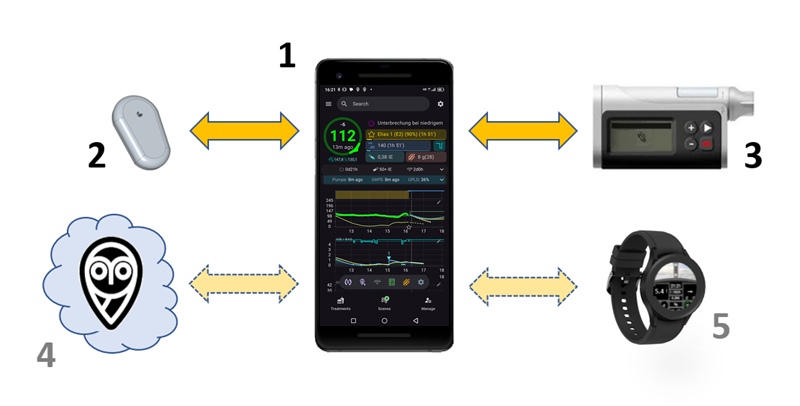
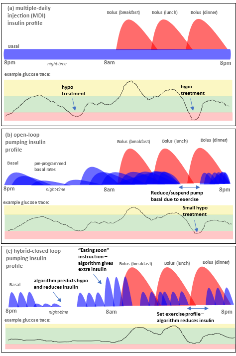
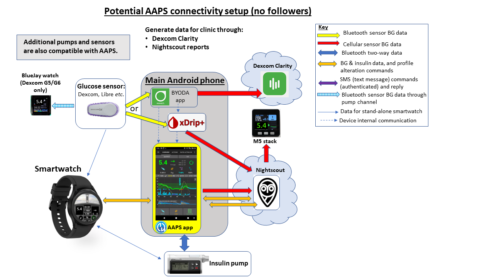
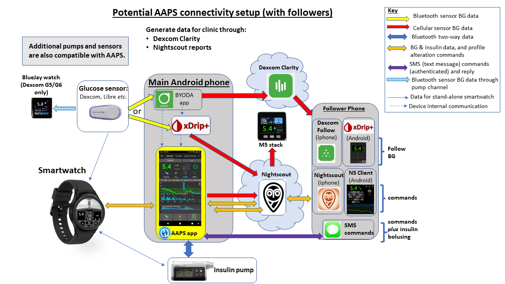

# Introduzione a APS e AAPS

## Che cos'è un "Sistema Pancreas Artificiale"?

Un pancreas umano fa un sacco di cose oltre a regolare lo zucchero nel sangue. Tuttavia, il termine **"Sistema Pancreas Artificiale" (APS)** di solito si riferisce a un sistema che funziona per mantenere automaticamente i livelli di zucchero nel sangue entro limiti sani.

Il modo più semplice per farlo è rilevare la **glicemia**, utilizzando questi valori per fare **calcoli**, e quindi somministrare all'organismo la giusta quantità (prevista) di **insulina**. Ripete il calcolo, ogni pochi minuti, 24/7. Utilizza **allarmi** e **avvisi** per informare l'utente se è necessario un intervento o la sua attenzione. Questo sistema è tipicamente costituito da un **sensore di glucosio**, un **microinfusore di insulina** e un'**app** su un telefono.

Puoi leggere di più sui diversi sistemi di pancreas artificiali attualmente in uso e in sviluppo in questo articolo del 2022:

 [Sviluppi Futuri nella Tecnologia del Circuito Chiuso](https://www.frontiersin.org/articles/10.3389/fendo.2022.919942/full#:~:text=Fully%20closed%2Dloop%20systems%2C%20unlike,user%20input%20for%20mealtime%20boluses).

Nel prossimo futuro, alcuni cosiddetti sistemi "biormonali" avranno anche la capacità di infondere glucagone accanto all'insulina, allo scopo di prevenire grave ipo e consentire un controllo ancora più stretto del glucosio nel sangue.

Un pancreas artificiale può essere pensato come un ["autopilota per il tuo diabete"](https://www.artificialpancreasbook.com/). Che cosa significa?

In un aeromobile, l'autopilota non svolge il lavoro completo del pilota umano, il pilota non può dormire durante l'intero volo. L'autopilota aiuta il lavoro del pilota. Lo solleva dall'onere di monitorare in modo permanente l'aeromobile, consentendo al pilota di concentrarsi su un più largo monitoraggio di volta in volta. L'autopilota riceve segnali da vari sensori, un computer li valuta insieme alle specifiche del pilota e poi apporta le necessarie regolazioni, avvisando il pilota in caso di problemi. Il pilota non deve più preoccuparsi di prendere decisioni costantemente.

(Introduction-what-does-hybrid-closed-loop-mean)=
## Cosa significa un circuito chiuso ibrido?

La soluzione migliore per il diabete di tipo 1 sarebbe una "cura funzionale" (probabilmente un impianto di cellule pancreatiche protette dal sistema immunitario). Mentre la stiamo aspettando, il pancreas artificiale "circuito chiuso completo" è probabilmente la soluzione la più vicina. È un sistema tecnologico che non ha bisogno di alcun contributo utente (come il bolo per i pasti, o annunciare l'esercizio fisico), con una buona regolazione dei livelli di glucosio nel sangue. Al momento, non ci sono sistemi ampiamente disponibili che siano un circuito chiuso "completo", tutti hanno bisogno di un certo contributo da parte dell'utente. I sistemi attualmente disponibili sono chiamati circuiti chiusi "ibridi", perché utilizzano una combinazione di tecnologia automatizzata e contributo utente.

## Come e perché ha avuto inizio il circuito chiuso?

Lo sviluppo della tecnologia commerciale per le persone con diabete di tipo 1 (DT1) è molto lento. Nel 2013 la comunità T1D ha fondato il movimento #WeAreNotWaiting. Loro stessi hanno sviluppato sistemi utilizzando la tecnologia approvata esistente (microinfusori per insulina e sensori) per migliorare il controllo del glucosio nel sangue, la sicurezza e la qualità della vita. Questi sistemi sono noti come OS-AID (sistemi di somministrazione automatica di insulina open-source, precedentemente chiamati DIY), perché non sono formalmente approvati dagli enti sanitari (FDA, NHS ecc.). Esistono quattro principali sistemi DIY disponibili: [OpenAPS](https://openaps.org/what-is-openaps/), **AAPS**, [Loop](https://loopkit.github.io/loopdocs/#what-is-loop) e [Trio](https://triodocs.org).

Un ottimo modo per capire i fondamenti del circuito chiuso fai da te è leggere il libro di Dana Lewis "Automated Insulin Delivery". È possibile accedervi [qui](https://www.artificialpancreasbook.com/) gratuitamente (o acquistare una copia cartacea del libro). Se vuoi saperne di più su [OpenAPS](https://openaps.org/what-is-openaps/), dal quale **AAPS** è stato sviluppato, il sito [OpenAPS](https://openaps.org/what-is-openaps/) è un ottima risorsa.

Sono stati rilasciati diversi sistemi commerciali a circuito chiuso ibrido, i più recenti sono [CamAPS FX](https://camdiab.com/) (UK e UE) e [Omnipod 5](https://www.omnipod.com/en-gb/what-is-omnipod/omnipod-5) (USA e UE). Many people in the OS-AID community have already tried out these commercial systems and compared them with their OS-AID system. You can find out more about how the different systems compare by asking on the dedicated Facebook groups for these systems, on the [AAPS Facebook group](https://www.facebook.com/groups/AndroidAPSUsers/) or on [Discord](https://discord.com/invite/4fQUWHZ4Mw). These are very different to OS-AID systems, mainly because they both include a “learning algorithm” which adjusts how much insulin is delivered according to your insulin needs from previous days.

## Che cos'è Android APS (AAPS)?

**Figura 1**. Schema di base di Android APS (Sistema Pancreas Artificiale), AAPS.

Android APS (**AAPS**) è un sistema a circuito chiuso ibrido, o Sistema Pancreas Artificiale (APS). Fa i suoi calcoli di dosaggio di insulina utilizzando gli algoritmi [OpenAPS](https://openaps.org/) stabiliti (una serie di regole) sviluppati dalla comunità diabete di tipo 1 #WeAreNotWaiting.

Poiché OpenAPS è compatibile solo con alcun microinfusore per insulina più vecchi, Nel 2016 Milos Kozak ha sviluppato **AAPS** (che può essere utilizzato con una gamma più ampia di micro) per un familiare con diabete di tipo 1. Da quei primi giorni, **AAPS** è stato continuamente sviluppato e raffinato da un team di sviluppatori volontari e altri appassionati che hanno una connessione al mondo del diabete di tipo 1. The fundamental components of the current **AAPS** system are outlined in **Figure 1** above. È un sistema altamente personalizzabile e versatile e, poiché è open-source, è facilmente compatibile con molti altri software e piattaforme open-source per il diabete. Today, **AAPS** is used by approximately 20,000 people.

## Quali sono i componenti di base di AAPS?

Il "cervello" di AAPS è una **app** che si costruisce da se. Ci sono istruzioni dettagliate, passo per passo, per questo. Si installa quindi l'**app AAPS** su uno della lista [compatibile](../Getting-Started/Phones.md) di  **smartphone Android ** (**1**). Un certo numero di utenti preferiscono il loro circuito chiuso su un telefono separato al loro telefono principale. Quindi, non devi necessariamente usare un telefono Android per tutto il resto della tua vita, solo per utilizzare il tuo circuito chiuso AAPS.

Lo smartphone **Android** avrà anche bisogno di avere un'altra app installata in più di **AAPS**. Questa [app aggiuntiva](../Getting-Started/CompatiblesCgms.md) riceve i dati di glucosio da un sensore (**2**) tramite bluetooth, e poi li invia internamente al telefono all'**app AAPS**.

L'app **AAPS** utilizza un processo decisionale (**algoritmo**) da OpenAPS. Da principiante, inizierai con l'algoritmo di base **oref0**, ma sarà possibile passare all'algoritmo nuovo **oref1** man mano che progredisci con AAPS. L'algoritmo che utilizzerai (oref0 o oref1), dipenderà da quello che si adatta meglio alle tue necessità.  In entrambi i casi, l'algoritmo tiene conto di molteplici fattori e esegue calcoli rapidi ogni volta che una nuova lettura arriva dal sensore. L'algoritmo invia quindi istruzioni al micro (**3**) sulla quantità di insulina da somministrare, tramite bluetooth. Tutte le informazioni possono essere inviate da dati mobili o wifi a Internet (**4**). Questi dati possono anche essere condivisi con i follower se lo si desideri, e/o raccolti per l'analisi.

## Quali sono i vantaggi del sistema AAPS?

L'algoritmo OpenAPS utilizzato da **AAPS** controlla i livelli di zucchero nel sangue in assenza di contributi dell'utente, secondo i parametri definiti dagli utilizzatori (quelli importanti sono: tassi di basale, fattori di sensibilità insulinica, rapporti insulina-CHO, durata dell'attività insulinica, ecc.), reagendo ogni 5 minuti ai nuovi dati dal sensore. Alcuni dei vantaggi di utilizzare AAPS sono le tante opzioni ottimizzabili, le automazioni e una maggiore trasparenza del sistema per il paziente/assistente. Questo può portare a un migliore controllo del tuo diabete (o quello del tuo assistito) che a sua volta può ottenere una migliore qualità di vita e una maggiore serenità mentale.

### **I vantaggi specifici includono:**

#### 1) Sicurezza integrata
Per leggere le caratteristiche di sicurezza degli algoritmi, noti come oref0 e oref1, [clicca qui](https://openaps.org/reference-design/). L'utente ha il controllo dei propri vincoli di sicurezza.

#### 2) **Flessibilità del materiale**

**AAPS** funziona con un ampia gamma di micro e sensori. Così, ad esempio, se sviluppi un'allergia alla colla del sensore Dexcom, puoi passare a un sensore Libre. Ti offre flessibilità, come cambia la tua vita. Non è necessario ricostruire o reinstallare l'app **AAPS**, basta spuntare una casella diversa nell'app per modificare il materiale. AAPS è indipendente da specifici piloti di micro e contiene anche un "micro virtuale" di modo che gli utenti possono sperimentare in modo sicuro prima di usarlo su se stessi.

#### 3) **Altamente personalizzabile, con ampi parametri**

Gli utenti possono facilmente aggiungere o rimuovere moduli o funzionalità, e **AAPS** può essere utilizzato sia in modalità circuito aperto che chiuso. Ecco alcuni esempi delle possibilità offerte dal sistema **AAPS**:

 a) La possibilità di fissare un target di glicemia inferiore, 30 minuti prima di mangiare; puoi impostare il target fino a 72 mg/dL (4,0 mmol/L).

 b) Se sei insulino-resistente con conseguenti alti livelli di glucosio nel sangue, **AAPS** ti consente (per esempio) di impostare una regola di **automazione** che si attiva quando la glicemia supera 8 mmol/L (144 mg/dL), per passare a un profilo del 120% (determinando un aumento del 20% della basale e un rafforzamento degli altri fattori, rispetto alle impostazioni normale del **profilo**). L'automazione durerà secondo l'orario programmato che hai impostato. Tale automazione potrebbe essere impostata per essere attiva solo in determinati giorni della settimana, in certi momenti del giorno, e perfino in certi luoghi.

 c) Se il tuo bambino va a giocare su un trampolino senza averlo previsto prima, **AAPS** consente la sospensione di insulina per un determinato periodo di tempo, direttamente tramite il telefono.

 d) Dopo aver riconnesso un micro a catetere che è stato scollegato per il nuoto, **AAPS** calcolerà l'insulina basale che hai perso durante la disconnessione e la erogherà con attenzione, in base alla tua glicemia attuale. Qualsiasi insulina non necessaria può essere sovrascritta semplicemente "cancellando" la basale non erogata.

 e) **AAPS** ha la possibilità di impostare profili diversi per situazioni diverse e di passare facilmente da una all'altra. Per esempio, le funzionalità che rendono l'algoritmo più veloce per abbassare la glicemia alta come i super-micoboli («**SMB**»), i pasti non annunciati, ("**UAM**"), possono essere impostate solo durante il giorno, se sei preoccupato delle ipo notturne.

Questi sono solo esempi, la gamma completa di caratteristiche offre una grande flessibilità nella la vita quotidiana per gestire lo sport, la malattia, i cicli ormonali _ecc_. In definitiva, spetta all'utente decidere come utilizzare questa flessibilità, non esiste un'automazione "taglia unica" che va bene per tutti.

#### 4) **Monitoraggio a distanza**
Ci sono più possibili canali di monitoraggio (Sugarmate, Dexcom Follow, xDrip+, Android Auto _ecc._) che sono utili per i genitori/assistenti e gli adulti in certi scenari (durante il sonno/la guida) che hanno bisogno di avvisi personalizzabili. In alcune app (xDrip+) è anche possibile disattivare completamente gli allarmi, il che è ottimo se hai un nuovo sensore in "ammollo" o in fase di stabilizzazione con cui non vuoi ancora fare il loop.

#### 5) **Telecomando**
Un vantaggio significativo di **AAPS** rispetto ai sistemi commerciali è che è possibile per i follower di utilizzare degli SMS autenticati o un'app ([Nightscout](https://nightscout.github.io/) o AAPSClient) per inviare diversi comandi remoti al sistema **AAPS**. Questo è ampiamente utilizzato dai genitori di bambini con diabete di tipo 1 che usano AAPS. È molto utile: per esempio, al parco giochi, se vuoi fare un pre-bolo per uno spuntino dal tuo telefono, mentre tuo figlio è impegnato a giocare. As battery life on watches improves and technology becomes more stable, this last option is likely to become increasingly attractive. It is possible to monitor the system (_e.g._ Fitbit), send basic commands (_e.g._ Samsung Galaxy watch 4), or even run the entire AAPS system from a high-spec smartwatch (**5**) (_e.g._ LEMFO). In this last scenario, you don’t need to use a phone to run AAPS.

#### 6) **Nessun vincolo commerciale, grazie alle interfacce applicative aperte**
Oltre all'approccio open-source, che consente di visualizzare il codice sorgente di **AAPS** in qualsiasi momento, il principio generale di fornire interfacce di programmazione aperte offre anche ad altri sviluppatori l'opportunità di contribuire con nuove idee. **AAPS** è strettamente integrato con Nightscout. Questo accelera lo sviluppo e consente agli utenti di aggiungere funzionalità per rendere la vita con il diabete ancora più comoda. This can also slow innovations which are convenient for the patient (or a small sub-population of patients, who have a very specific requirement) but do not generate any sizable profit. Good examples for such integrations are [Nightscout](https://nightscout.github.io/), [Nightscout Reporter](https://nightscout-reporter.zreptil.de/), xDrip+, [M5 stack](https://github.com/mlukasek/M5_NightscoutMon/wiki) etc. There is ongoing dialogue between open-source developers and those developing commercial systems. Many of the DIY innovations are gradually adopted by commercial systems, where developments are understandably slower, partly because interfaces between systems from different companies (pumps, apps, sensors _etc_) need to be carefully negotiated and licenced.

#### 7) **Interfaccia app dettagliata**
Con **AAPS** è facile tenere traccia di cose come: livelli di insulina del micro, età della cannula, età del sensore, età della batteria del micro, insulina attiva _ecc._. Molte azioni possono essere eseguite tramite l'**app AAPS** (il riempimento del micro, la disconnessione del micro _ecc._), anziché sul micro stesso, il che significa che il micro può rimanere in tasca o nella cintura tua (o del tuo assistito).

#### 8) **Accessibilità e convenienza economica**
**AAPS** offre alle persone che attualmente non possono permettersi di autofinanziarsi, o non dispongono di finanziamenti/assicurazioni, l'accesso a un sistema di loop chiuso ibrido di livello mondiale che è concettualmente anni avanti, in termini di sviluppo, rispetto ai sistemi commerciali. Al momento è necessario avere un account Nightscout per configurare **AAPS**, anche se l'account Nightscout non è necessario per il funzionamento quotidiano del loop **AAPS**. Molte persone continuano a usare Nightscout per raccogliere i propri dati e per il controllo remoto. Sebbene **AAPS** stesso sia gratuito, la configurazione di Nightscout attraverso una delle varie piattaforme potrebbe comportare un costo (€0 - €12), a seconda del livello di supporto desiderato (vedi tabella comparativa) e se si vuole continuare a usare Nightscout dopo la configurazione o meno. Different versions are available for specific locations and languages, and AAPS can also be used by people who are [blind](#accessibility-for-users-aaps-who-are-partially-or-completely-blind). **AAPS** works with a wide range of affordable (starting from approx €150) [Android phones](https://docs.google.com/spreadsheets/u/1/d/e/2PACX-1vScCNaIguEZVTVFAgpv1kXHdsHl3fs6xT6RB2Z1CeVJ561AvvqGwxMhlmSHk4J056gMCAQE02sAWJvT/pubhtml?gid=683363241&single=true).

#### 9) **Supporto**
Nessun sistema di somministrazione automatica di insulina è perfetto. I sistemi commerciali e open-source condividono molti problemi comuni sia nelle comunicazioni che nei guasti temporanei dell'hardware. È disponibile il supporto da parte della comunità di utenti AAPS su Facebook, Discord e GitHub, che hanno progettato, sviluppato e attualmente utilizzano **AAPS** in tutto il mondo. Esistono anche gruppi di supporto su Facebook e aiuto da parte di cliniche/aziende commerciali per i sistemi APS commerciali: vale la pena parlare con gli utenti, o ex utenti, di questi sistemi per avere feedback sui problemi comuni, la qualità del programma di formazione e il livello di supporto continuo fornito.

#### 10) **Prevedibilità, trasparenza e sicurezza**
**AAPS** è totalmente trasparente, logico e prevedibile, il che può rendere più facile capire quando un'impostazione è sbagliata e correggerla di conseguenza. Puoi vedere esattamente cosa sta facendo il sistema, perché lo sta facendo e impostarne i limiti operativi, il che mette il controllo (e la responsabilità) nelle tue mani. Questo può dare all'utente fiducia e un sonno più tranquillo.

#### 11) **Accesso alle funzionalità avanzate tramite le modalità di sviluppo (dev) incluso il circuito chiuso completo**
Questa documentazione di **AAPS** si concentra sul ramo principale **"master"** di **AAPS**. Tuttavia, la ricerca e lo sviluppo sono in corso tutto il tempo. Gli utenti più esperti potrebbero voler esplorare le funzionalità sperimentali nel ramo **development**. Le innovazioni di sviluppo si concentrano sulle strategie per il circuito chiuso completo (senza dover fare il bolo per i pasti _ecc._), e in generale nel tentativo di rendere la vita con il diabete di tipo 1 il più comoda possibile.

#### 12) **Possibilità di contribuire tu stesso a ulteriori miglioramenti**
Il diabete di tipo 1 può essere molto frustrante e isolante. Avere il controllo della propria tecnologia per il diabete, con la possibilità di "restituire" non appena si fanno progressi aiutando gli altri nel loro percorso, può essere davvero gratificante. Puoi formarti, scoprire gli ostacoli e cercare, e persino contribuire, a nuovi sviluppi e alla documentazione. Ci saranno altri nella comunità con la stessa ricerca con cui puoi confrontarti e collaborare. Questa è l'essenza di #WeAreNotWaiting.

## Come si confronta AAPS con MDI e il loop aperto?

Le iniezioni multiple giornaliere (MDI, (a) nella **Figura 2** in basso) di solito comportano la somministrazione di un'insulina a lunga durata d'azione (_ad es._ Tresiba) una volta al giorno, con iniezioni di insulina a rapida azione (_ad es._ Novorapid, Fiasp) ai pasti o per correzioni. Il micro in loop aperto (b) prevede l'utilizzo di un micro per erogare la basale a velocità preprogrammate di insulina ad azione rapida, e poi i boli tramite il micro ai pasti o per le correzioni. Le basi di un sistema in loop sono che l'app di loop utilizza i dati di glucosio del sensore per istruire il micro a interrompere l'erogazione di insulina quando prevede che si stia andando verso un'ipoglicemia, e per fornire insulina extra se i livelli di glucosio stanno aumentando e si prevede che diventino troppo alti (c). Sebbene questa figura sia semplificata rispetto alla realtà, mira a dimostrare le differenze chiave tra i vari approcci. Con ognuno di questi tre approcci è possibile raggiungere un ottimo controllo della glicemia.

**Figura 2**. Panoramica di base di (a) MDI, (b) micro in loop aperto e (c) micro in loop chiuso ibrido.

## Come si confronta AAPS con altri sistemi in loop?

Al 25 giugno 2023, sono disponibili quattro principali sistemi open source a circuito chiuso: [OpenAPS](https://openaps.readthedocs.io/), **AAPS**, [Loop](https://loopkit.github.io/loopdocs/#what-is-loop) e [Trio](https://triodocs.org), (precedentemente FreeAPS X). Le caratteristiche dei diversi sistemi sono mostrate nella tabella seguente:

| Devicestype | Name                                                                | [AAPS](https://wiki.aaps.app)             | [Loop](https://loopkit.github.io/loopdocs/) | [Open APS](https://openaps.readthedocs.io/en/latest/) | [Trio](https://triodocs.org)              |
| ----------- | ------------------------------------------------------------------- | ----------------------------------------- | ------------------------------------------- | ----------------------------------------------------- | ----------------------------------------- |
| Phone       | Android                                                             |      |    |              |  |
| Phone       | iPhone                                                              |  |        |              |      |
| Rig         | tiny computer (1)                                                   |  |    |                  |  |
| PUMP        | [Dana I](../CompatiblePumps/DanaRS-Insulin-Pump.md)                 |      |        |              |      |
| PUMP        | [Dana RS](../CompatiblePumps/DanaRS-Insulin-Pump.md)                |      |        |              |      |
| PUMP        | [Dana R](../CompatiblePumps/DanaR-Insulin-Pump.md)                  |      |    |              |  |
| PUMP        | [Omnipod (Dash)](../CompatiblePumps/OmnipodDASH.md)                 |      |        |              |      |
| PUMP        | [Omnipod (Eros)](../CompatiblePumps/OmnipodEros.md)                 |      |        |              |      |
| PUMP        | [Diaconn G8](../CompatiblePumps/DiaconnG8.md)                       |      |    |              |  |
| PUMP        | [EOPatch 2](../CompatiblePumps/EOPatch2.md)                         |      |    |              |  |
| PUMP        | [Medtrum TouchCare Nano](../CompatiblePumps/MedtrumNano.md)         |      |        |              |      |
| PUMP        | [Medtrum TouchCare 300U](../CompatiblePumps/MedtrumNano.md)         |      |        |              |      |
| PUMP        | [Roche Combo](../CompatiblePumps/Accu-Chek-Combo-Pump-v2.md)        |      |    |              |  |
| PUMP        | [Roche Insight](../CompatiblePumps/Accu-Chek-Insight-Pump.md)       |      |    |              |  |
| PUMP        | [Older Medtronic](../CompatiblePumps/MedtronicPump.md)              |      |        |                  |      |
| PUMP        | [Equil 5.3](../CompatiblePumps/Equil5.3.md)                         |      |    |              |  |
| CGM         | [Dexcom G7/One+/Stelo](../CompatibleCgms/DexcomG7.md)               |      |        |              |      |
| CGM         | [Dexcom One](../CompatibleCgms/DexcomG6.md)                         |      |        |              |      |
| CGM         | [Dexcom G6](../CompatibleCgms/DexcomG6.md)                          |      |        |                  |      |
| CGM         | [Libre 3/3+](../CompatibleCgms/Libre3.md)                           |      |        |              |      |
| CGM         | [Libre 2/2+](../CompatibleCgms/Libre2.md)                           |      |        |              |      |
| CGM         | [Libre 1](../CompatibleCgms/Libre1.md)                              |      |        |              |      |
| CGM         | [Eversense](../CompatibleCgms/Eversense.md)                         |      |        |              |      |
| CGM         | [MM640g/MM630g](../CompatibleCgms/MM640g.md)                        |      |    |              |  |
| CGM         | [PocTech](../CompatibleCgms/PocTech.md)                             |      |    |              |  |
| CGM         | [Ottai](../CompatibleCgms/OttaiM8.md)                               |      |    |              |  |
| CGM         | [Syai Tag](../CompatibleCgms/SyaiTagX1.md)                          |      |    |              |  |
| CGM         | [Nightscout as BG Source](../CompatibleCgms/CgmNightscoutUpload.md) |      |        |                  |      |

_Note della tabella:_
1. Un **rig** è un piccolo computer che porti con te, senza un monitor. Un tipo di dispositivo supportato è Intel Edison + Explorer Board e l'altro Raspberry Pi + Explorer HAT o Adafruit RFM69HCW Bonnet. I primi APS erano basati su questa configurazione, poiché i telefoni cellulari non erano in grado di eseguire gli algoritmi richiesti. L'uso di questi sistemi è diminuito, poiché la configurazione su telefoni cellulari è diventata più semplice e i telefoni hanno uno schermo incluso. Intel ha anche smesso di vendere l'Intel Edison. Gli eccellenti algoritmi OpenAPS **oref0** e **oref1** sono ora incorporati in AAPS e Trio.

Una dichiarazione di consenso internazionale sottoposta a peer review contenente linee guida pratiche sul loop open-source è stata scritta da e per i professionisti sanitari, e pubblicata in una delle principali riviste mediche nel 2022: [_Lancet Diabetes Endocrinol_, 2022; 10: 58–74](https://www.ncbi.nlm.nih.gov/pmc/articles/PMC8720075/)(_1_). Vale assolutamente la pena leggerla (anche per il tuo centro diabetologico) e riassume le principali differenze tecniche tra i diversi sistemi open-source a circuito chiuso ibrido.

È difficile avere la "sensazione" di qualsiasi sistema senza usarlo, o parlare con altri che lo stanno usando, quindi contatta gli altri su Facebook/Discord e chiedi. La maggior parte delle persone trova che **AAPS** è incredibilmente sofisticato rispetto ad altri sistemi a circuito chiuso ibrido (in particolare i sistemi commerciali), con un numero enorme di impostazioni e funzionalità potenzialmente personalizzabili, discusse in precedenza. Alcune persone potrebbero trovarlo un po' travolgente all'inizio, ma non c'è fretta di esaminare tutte le possibilità in una volta sola, puoi avanzare lentamente o velocemente come vuoi, e c'è aiuto disponibile ad ogni passo del cammino.

## AAPS utilizza l'intelligenza artificiale o un algoritmo di apprendimento?

La versione master corrente di **AAPS** (3.4) non dispone di algoritmi di machine learning, modelli di risposta insulinica a parametri multipli o intelligenza artificiale. In quanto tale, il sistema è aperto e trasparente nel suo funzionamento, e ha la capacità di essere compreso non solo dagli esperti, ma anche dai clinici e dai pazienti. Significa anche che se hai un programma molto variabile (magari passando da una settimana stressante al lavoro a una vacanza rilassante) e probabilmente avrai bisogno di una quantità di insulina significativamente diversa, puoi immediatamente passare **AAPS** a un profilo personalizzato più debole/forte. Un 'sistema di apprendimento' farà questo aggiustamento automaticamente per te, ma probabilmente ci vorrà più tempo per regolare l'erogazione di insulina.

## Quale sistema è giusto per me o il mio assistito?

In pratica, la scelta del sistema è spesso limitata dal micro che hai già, o che puoi ottenere dal tuo medico, e dalla scelta del telefono (Apple o Android). Se non hai ancora un micro, hai la più ampia scelta di sistemi. La tecnologia è in continua evoluzione, i micro vengono discontinuati e vengono rilasciati nuovi micro e sensori. La maggior parte dei sistemi open-source funziona con i principali sensori (Libre e Dexcom) o viene rapidamente adattata per funzionare con i nuovi sensori circa un anno dopo il loro rilascio (con un piccolo ritardo per i test di sicurezza e stabilità).

La maggior parte degli utenti **AAPS** riporta più tempo nel range target, riduzioni dell'HbA1c e miglioramenti della qualità della vita grazie a un sistema che può regolare automaticamente le velocità basali durante la notte mentre si dorme, e questo vale per la maggior parte dei sistemi a circuito chiuso ibrido. Alcune persone preferiscono un sistema molto semplice che non è molto personalizzabile (il che significa che potresti preferire un sistema commerciale), e altri trovano questa mancanza di controllo molto frustrante (potresti preferire un sistema open-source). Se tu (o il tuo assistito) siete di nuova diagnosi, un percorso comune è abituarsi prima all'uso di MDI più un sensore di glucosio, poi passare a un micro che abbia il potenziale per il loop, poi passare ad **AAPS**, ma alcune persone (specialmente i bambini piccoli) possono passare direttamente a un micro.

È importante notare che l'utente **AAPS** deve essere proattivo per risolvere i problemi da solo, con l'aiuto della comunità. Questa è una mentalità molto diversa da quella di quando si utilizza un sistema commerciale. Con **AAPS** l'utente ha più controllo, ma anche la responsabilità, e deve essere a proprio agio con questo.

## È sicuro usare sistemi open-source come AAPS?

### Sicurezza del sistema AAPS
Una domanda più accurata è probabilmente "è sicuro **rispetto** al mio attuale sistema di erogazione dell'insulina?" poiché nessun metodo di erogazione dell'insulina è privo di rischi. Ci sono molti controlli e bilanciamenti in atto con **AAPS**. Un recente [studio](https://www.liebertpub.com/doi/epub/10.1089/dia.2019.0375) ha esaminato l'uso di **AAPS** in un ambiente simulato da computer, che è stato un modo efficace per testare obiettivamente quanto il sistema sia sicuro ed efficace. Più in generale, si stima che oltre 30.000 persone in tutto il mondo stiano utilizzando sistemi open-source di erogazione automatica di insulina, e l'adozione continua ad aumentare a livello globale.

Qualsiasi dispositivo che utilizza comunicazioni radio potrebbe essere violato, e questo vale anche per un micro per insulina non in loop. Attualmente, non siamo a conoscenza di nessuno che abbia tentato di arrecare danno a individui violando le loro apparecchiature mediche per il diabete. Tuttavia, esistono diversi modi per proteggersi da tali rischi:

1.  Nelle impostazioni del micro, limitare sia il bolo massimo consentito che le impostazioni basali temporanee massime a valori che si ritengono più sicuri. Questi sono limiti rigidi che non crediamo nessun hacker malintenzionato possa aggirare.

2.  Impostare gli allarmi del CGM abilitati sia per i valori alti che per quelli bassi.

3.  Monitorare l'erogazione di insulina online. Gli utenti di Nightscout possono impostare allarmi aggiuntivi per avvisare di un'ampia varietà di condizioni, incluse condizioni che è molto più probabile che si verifichino rispetto a un attacco doloso. Oltre agli alti e bassi, Nightscout può visualizzare dati diagnostici utili per verificare che il micro stia funzionando come desiderato, inclusi l'IOB corrente, la cronologia della basale temporanea del micro, la cronologia dei boli del micro. Può anche essere configurato per avvisare proattivamente gli utenti di condizioni indesiderate, come alti e bassi previsti, riserva di insulina bassa e batteria del micro scarica.

Se venisse effettuato un attacco doloso al tuo micro per insulina, queste strategie ridurrebbero significativamente il rischio. Ogni potenziale utente **AAPS** deve valutare i rischi associati all'utilizzo di **AAPS** rispetto ai rischi dell'utilizzo di un sistema diverso.

#### Considerazioni sulla sicurezza riguardo al miglioramento troppo rapido del controllo glicemico

Una rapida riduzione dell'HbA1c e un migliorato controllo della glicemia sembra allettante. Tuttavia, ridurre i livelli medi di glicemia _troppo rapidamente_ iniziando qualsiasi sistema a circuito chiuso può causare danni permanenti, anche agli occhi, e una dolorosa neuropatia che non scompare mai. Questo danno può essere evitato semplicemente riducendo i livelli più lentamente. Se attualmente hai un HbA1c elevato e stai passando ad AAPS (o qualsiasi altro sistema a circuito chiuso), si prega di discutere questo potenziale rischio con il tuo team clinico prima di iniziare e concordare con loro un piano temporale. Informazioni più generali su come ridurre i livelli di glucosio in modo sicuro, inclusi i link alla letteratura medica, sono fornite nella sezione di sicurezza [qui](#preparing-safety-first).

#### Sicurezza medica riguardo a dispositivi, forniture consumabili e altri farmaci

Utilizzare un micro per insulina e un CGM testati, completamente funzionanti, approvati FDA o CE per un loop di pancreas artificiale. Le modifiche hardware o software a questi componenti possono causare un dosaggio di insulina imprevisto, causando rischi significativi per l'utente. Se trovi o ti vengono offerti micro per insulina o ricevitori CGM rotti, modificati o fatti in casa, non usarli per creare un sistema AAPS.

Utilizzare materiali originali come inseritori, cannule e contenitori di insulina approvati dal produttore del tuo micro e CGM. L'utilizzo di forniture non testate o modificate può causare imprecisioni del CGM ed errori di dosaggio dell'insulina. L'insulina è molto pericolosa se somministrata in modo errato: non mettere a rischio la tua vita manomettendo le tue forniture.

Non assumere inibitori SGLT-2 (gliflozine) quando si utilizza **AAPS** in quanto abbassano incalcolabilmente i livelli di zucchero nel sangue. Combinare questo effetto con un sistema che abbassa le velocità basali per aumentare la glicemia è pericoloso; ci sono maggiori dettagli a riguardo nella [sezione sicurezza](#preparing-safety-first) principale.

(introduction-how-can-i-approach-discussing-aaps-with-my-clinical-team)=
## Come posso affrontare una discussione su AAPS con il mio team clinico?

Gli utenti sono incoraggiati a parlare con i propri clinici della loro intenzione di usare **AAPS**. Non aver paura di avere una conversazione onesta con il tuo team diabetologico se intendi usare **AAPS** (o qualsiasi altro loop DIY). La trasparenza e la fiducia tra paziente e medico sono fondamentali.

### Approccio suggerito:
Inizia una conversazione con il tuo clinico per determinare la sua familiarità e attitudine verso la tecnologia diabetologica come i CGM, i micro, i loop ibridi e il loop commerciale. Il tuo clinico/endocrinologo dovrebbe essere a conoscenza della tecnologia di base e disposto a discutere con te i recenti progressi con i prodotti loop commerciali disponibili nelle loro regioni.

#### Precedente locale

Ottieni le opinioni dei tuoi clinici/endocrinologi sul loop DIY _vs_ loop commerciale, e valuta la loro conoscenza in quest'area. Hanno familiarità con **AAPS** e possono condividere con te esperienze utili nel lavorare con pazienti con loop DIY?

Chiedi se il tuo team ha pazienti in cura che già utilizzano il loop DIY. A causa della riservatezza del paziente, i medici non possono passarti i dettagli di altri pazienti senza ottenere il consenso del singolo. Tuttavia, se vuoi, **puoi** chiedergli di passare **i tuoi** dati di contatto a un paziente esistente con loop DIY, se c'è qualcuno con cui il clinico pensa che potreste "fare clic", suggerendo che saresti felice che il paziente ti contatti per discutere del loop DIY. I clinici non sono obbligati a farlo, ma alcuni sono felici di farlo, poiché si rendono conto dell'importanza del supporto tra pari nella gestione del diabete di tipo 1. Potrebbe anche essere utile incontrare loopers DIY amichevoli nella tua zona. Ovviamente questo dipende da te e non è assolutamente necessario.

#### Precedente nazionale e internazionale

Se ti senti privo di supporto dal tuo team per fare il loop con **AAPS**, i seguenti punti di discussione potrebbero aiutarti:

a) Il sistema **AAPS** è stato progettato DA pazienti e dai loro assistenti. È stato progettato principalmente per la sicurezza, ma anche attingendo all'esperienza approfondita dei pazienti. There is therefore likely to be other patients using DIY looping in your clinic's patient population (whether they know about it or not). There are currently around **20,000** AAPS users worldwide.

b) Recenti linee guida pubblicate e sottoposte a peer review nella rivista medica internazionale di riferimento [The Lancet](https://www.ncbi.nlm.nih.gov/pmc/articles/PMC8720075/pdf/nihms-1765784.pdf)_(1)_ hanno confermato che i loop DIY sono **sicuri** ed **efficaci nel migliorare il controllo diabetico**, incluso il tempo nel range. Ci sono articoli regolari nelle principali riviste come [Nature](https://doi.org/10.1038/d41586-023-02648-9)_(3)_ che evidenziano i progressi della comunità del loop DIY.

c) Iniziare con **AAPS** comporta una migrazione _graduale_ dal micro in loop "aperto", attraverso la sospensione per basso glucosio, fino al loop "chiuso" ibrido, completando una serie di obiettivi. Esiste quindi un programma strutturato, che richiede all'utente di dimostrare un livello di competenza ad ogni fase e di affinare le impostazioni di base (basale, ISF e ICR) prima di poter chiudere il loop.

d) Il supporto tecnico è disponibile dalla comunità DIY tramite GitHub, Discord e gruppi Facebook chiusi.

e) Sarai in grado di fornire **sia le informazioni CGM che quelle del loop/micro per insulina** come rapporti combinati nelle riunioni cliniche (tramite Nightscout o Tidepool), sia stampati che su schermo (se porti un laptop/tablet). La semplificazione dei dati sia CGM che di insulina consentirà un uso più efficace del tempo del tuo clinico per rivedere i tuoi rapporti e aiutare le loro discussioni nel valutare i tuoi progressi.

f) Se c'è ancora una forte obiezione da parte del tuo team, consegna al tuo clinico le stampe degli articoli di riferimento collegati qui nel testo e dagli il link alla sezione clinici di **AAPS**: [Per i Clinici – Un'Introduzione Generale e Guida ad **AAPS**](../UsefulLinks/ClinicianGuideToAaps.md)

#### Supporto al loop DIY da parte di altri clinici

Il documento pubblicato su [Lancet Diabetes Endocrinology](https://www.ncbi.nlm.nih.gov/pmc/articles/PMC8720075/)(_1_)[ (co-guidato da Kings' e Guy's e St Thomas' NHS Foundation Trust, e co-guidato dal Dr Sufyan Hussain, consulente diabetologo e ricercatore senior onorario del King's di Londra) fornisce:

a) **Garanzia** per i professionisti che i sistemi di pancreas artificiale DIY/open source come "opzione di trattamento sicura ed efficace" per il diabete di tipo 1 e fornisce indicazioni su raccomandazioni, discussioni, supporti, documentazione;

b) **Riconoscimento** che i sistemi open-source di somministrazione automatica di insulina ("AID") possono aumentare il tempo nel range (TIR) riducendo al contempo la variabilità delle concentrazioni di glucosio nel sangue e la quantità di episodi ipo e iperglicemici in vari gruppi di età, generi e comunità;

c) **Raccomandazione** che gli operatori sanitari dovrebbero **supportare** i pazienti di tipo 1 o i loro assistenti che scelgono di gestire il loro diabete con un sistema AID open source;

d) Raccomandazione che gli operatori sanitari dovrebbero cercare di conoscere tutte le opzioni di trattamento che potrebbero beneficiare i pazienti, inclusi i sistemi AID open-source disponibili.  Se gli operatori sanitari non dispongono di risorse per formarsi, o hanno preoccupazioni legali o normative, dovrebbero considerare di **cooperare o collaborare con altri operatori sanitari** che lo fanno;

e) Enfasi che tutti gli utenti di CGM dovrebbero avere accesso in tempo reale e aperto **ai propri dati sanitari** in qualsiasi momento

f) Enfasi sul fatto che questi sistemi open source non hanno subito le stesse valutazioni normative delle tecnologie mediche disponibili in commercio, e non c'è supporto tecnico commerciale. Tuttavia, è disponibile un **ampio supporto della comunità**; e

g) Una raccomandazione che i **framework normativi e legali** dovrebbero essere aggiornati per garantire chiarezza nel permettere il trattamento etico ed efficace di tali sistemi open source.

Un altro documento in [Medical Law International, 2021](http://pure-oai.bham.ac.uk/ws/files/120241375/0968533221997510.pdf)(_4_) evidenzia anche che le "linee guida sul consenso" del General Medical Council del Regno Unito pongono un forte accento sulle decisioni congiunte tra medico e paziente. Il medico dovrebbe spiegare i potenziali benefici, rischi, oneri ed effetti collaterali degli APS DIY e può raccomandare una particolare opzione senza fare pressioni sul paziente.

In definitiva, spetta al paziente valutare questi fattori, insieme a eventuali problemi non clinici rilevanti per lui, e decidere quale opzione di trattamento, se del caso, accettare.

Se un medico scopre in ambulatorio che il suo paziente sta facendo il loop con un sistema DIY, non è esonerato dai suoi obblighi di monitorare il paziente, semplicemente perché non ha prescritto la particolare tecnologia che il paziente sta utilizzando; i clinici devono continuare a monitorare i pazienti.

I medici (almeno nel Regno Unito) non hanno il divieto di prescrivere farmaci non autorizzati e possono usare la loro discrezionalità clinica. Dovrebbero quindi usare il loro giudizio clinico per decidere se un APS DIY è adatto a un paziente specifico e discutere con il paziente quelli che considerano i pro e i contro.

#### Gli articoli citati sopra, e altri link utili e dichiarazioni di posizione sono elencati di seguito:

1. Erogazione automatica di insulina open-source: dichiarazione di consenso internazionale e guida pratica per i professionisti della salute [_Lancet Diabetes Endocrinol_, (2022) _10_, 58–74](https://www.ncbi.nlm.nih.gov/pmc/articles/PMC8720075/)
2. [Studio in Silico di un Pancreas Artificiale basato su Android Open-Source: Un Nuovo Paradigma per Testare la Sicurezza e l'Efficacia dei Sistemi Do-It-Yourself, 2020](https://www.liebertpub.com/doi/epub/10.1089/dia.2019.0375)
3. Un 'pancreas bionico' DIY sta cambiando le cure per il diabete — cosa c'è dopo? [_Nature_ (2023), _620_, 940-941](https://doi.org/10.1038/d41586-023-02648-9)
4. Prescrivere dispositivi medici non approvati? Il caso dei sistemi di pancreas artificiale DIY [_Medical law international_, (2021), _21_, 42-68](http://pure-oai.bham.ac.uk/ws/files/120241375/0968533221997510.pdf)
5. [Dichiarazione di posizione dell'Istituto di Salute di Berlino, 2022](https://www.bihealth.org/en/notices/do-it-yourself-solutions-for-people-with-diabetes-are-safe-and-recommended)
6. Erogazione automatica di insulina fai-da-te: Guida pratica per gli operatori sanitari (posizione e guida di Diabetes Canada) [_Canadian Journal of Diabetes_, (2023)_47_, E8, 389-397](https://www.canadianjournalofdiabetes.com/article/S1499-2671(23)00138-7/fulltext)
7.  Paesi Bassi (EN/NL) - per i clinici - [come aiutare le persone con sistemi open source di somministrazione automatica di insulina](https://www.diabetotech.com/blog/how-to-help-people-on-open-source-automated-insulin-delivery-systems)
8. Primo utilizzo dell'erogazione automatica di insulina open-source AndroidAPS in uno scenario a circuito chiuso completo: Studio pilota randomizzato Pancreas4ALL [_Diabetes Technol. Ther._, 25, _5_, 2023](https://www.liebertpub.com/doi/pdf/10.1089/dia.2022.0562?casa_token=D13eFx5vCwwAAAAA:MYvO8hChbViXVJFgov1T11RXBPx2N_wOMThLHwl3TVUxbCuANegPrIFRC5R5VXx_S71FoQYW-qg)
9. I bambini in età prescolare e scolare beneficiano del passaggio da un micro con aumento basato su sensore a un circuito chiuso ibrido AndroidAPS: Un'analisi retrospettiva [_Pediatr. Diabetes_ 2021, _22_, 594-604. 2021](https://onlinelibrary.wiley.com/doi/epdf/10.1111/pedi.13190)
10. Risultati del progetto OPEN, un progetto finanziato dall'UE sugli Esiti delle Prove dei Pazienti con Tecnologia Nuova, Do-it-Yourself Artificial Pancreas Technology (https://www.open-diabetes.eu/publications)

## Perché non posso semplicemente scaricare AAPS e usarlo subito?

L'app **AAPS** non è disponibile su Google Play: devi costruirla tu stesso dal codice sorgente per ragioni legali. **AAPS** non è autorizzato, il che significa che non ha l'approvazione di alcun organismo normativo in nessun paese. **AAPS** è considerato come lo svolgimento di un esperimento medico su se stessi, ed è eseguito a rischio dell'utente.

La configurazione del sistema richiede pazienza, determinazione e lo sviluppo graduale di conoscenze tecniche. Tutte le informazioni e il supporto si trovano in questi documenti, altrove online, o da altri che lo hanno già fatto. Oltre 10.000 persone hanno costruito con successo e attualmente utilizzano **AAPS** in tutto il mondo.

Gli sviluppatori di **AAPS** prendono la sicurezza incredibilmente sul serio, e vogliono che altri abbiano una buona esperienza nell'uso di **AAPS**. Ecco perché è essenziale che ogni utente (o assistente, se l'utente è un bambino):

- costruisca il sistema AAPS da solo e lavori attraverso gli **obiettivi** in modo da avere impostazioni personalizzate ragionevolmente buone e comprendere le basi di come funziona **AAPS** entro il momento in cui "chiude il loop";

- faccia il backup del suo sistema esportando e salvando file importanti (come il file keystore e settings .json) in un posto sicuro, in modo da poter riconfigurarsi rapidamente se necessario;

- si aggiorni alle versioni master più recenti non appena diventano disponibili; e

- mantenga e monitori il sistema per assicurarsi che funzioni correttamente.

## Qual è la connettività del sistema AAPS?

La **Figura 3 (in basso)** mostra un esempio del sistema **AAPS** per un utente che non richiede follower che interagiscano con il sistema. Possono essere integrati anche ulteriori software e piattaforme open-source non mostrati.

La **Figura 4 (in basso)** mostra il pieno potenziale del sistema **AAPS** per un utente che ha follower e ha bisogno di monitorare e inviare aggiustamenti al sistema da remoto (come un bambino con diabete di tipo 1). Possono essere integrati anche ulteriori software e piattaforme open-source non mostrati.

## Come viene continuamente sviluppato e migliorato AAPS?

La maggior parte degli utenti **AAPS** utilizza la versione **master** completamente testata di AAPS, che è stata verificata per bug e problemi, prima di essere rilasciata alla comunità. Dietro le quinte, gli sviluppatori provano nuovi miglioramenti e li testano nelle versioni "developer" (**dev**) di **AAPS** con una comunità di utenti che è felice di fare aggiornamenti per bug con breve preavviso. Se i miglioramenti funzionano bene, vengono poi rilasciati come una nuova versione "master" di **AAPS**. Qualsiasi nuovo rilascio master viene annunciato nel gruppo Facebook, in modo che gli utenti principali di **AAPS** possano leggere e aggiornare alla nuova versione master.

Alcuni utenti **AAPS** esperti e fiduciosi conducono esperimenti con tecnologie emergenti e con versioni dev dell'app **AAPS**, che possono essere interessanti da leggere per gli utenti meno avventurosi, senza doverlo fare loro stessi! Le persone tendono anche a condividere questi esperimenti nel gruppo Facebook.

Puoi leggere di più su alcuni di questi esperimenti e discussioni sulle tecnologie emergenti qui:

Tim Street [https://www.diabettech.com/](https://www.diabettech.com/)

David Burren [https://bionicwookie.com/](https://bionicwookie.com/)

## Chi può beneficiare di AAPS?

| Tipo di utente                                     |
| -------------------------------------------------- |
| ✔️ diabetico di tipo 1                             |
| ✔️ assistente o genitore di un diabetico di tipo 1 |
| ✔️ utenti non vedenti diabetici di tipo 1          |
| ✔️ *clinici e professionisti sanitari              |

La tabella sopra assume che l'utente abbia accesso sia al monitor continuo del glucosio che al micro per insulina.

*Tutti i dati da **AAPS** possono essere resi disponibili agli operatori sanitari tramite piattaforme di condivisione dei dati, incluso Nightscout che fornisce registrazione e monitoraggio in tempo reale dei dati CGM, erogazione di insulina, immissioni di carboidrati, previsioni e impostazioni. I registri di Nightscout includono rapporti giornalieri e settimanali che possono aiutare le discussioni degli operatori sanitari con i pazienti di tipo 1 con dati più accurati sul controllo glicemico e sulle considerazioni comportamentali.

(accessibility-for-users-aaps-who-are-partially-or-completely-blind)=

### Accessibilità per gli utenti AAPS parzialmente o completamente non vedenti

#### Utilizzo quotidiano di AAPS:
AAPS può essere utilizzato da persone non vedenti. Sui dispositivi Android, il sistema operativo ha un programma chiamato TalkBack. Questo consente l'orientamento dello schermo tramite output vocale come parte del sistema operativo. Usando TalkBack puoi operare sia il tuo smartphone che AAPS senza dover vedere.

#### Costruire l'app AAPS:
Come utente, costruirai l'app AAPS in Android Studio. Molte persone usano Microsoft Windows per questo scopo, dove c'è il lettore di schermo analogo a TalkBack. Poiché Android Studio è un'applicazione Java, il componente "Java Access Bridge" deve essere abilitato nel Pannello di Controllo. Altrimenti, il lettore di schermo del PC non parlerà in Android Studio.

Come farlo dipende dal tuo sistema operativo; di seguito sono illustrati due metodi:

1) Nel menu Start di Windows, inserisci "Pannello di controllo" nel campo di ricerca, apri con Invio. Si apre: "Tutti gli elementi del Pannello di controllo".

Apri il "Centro accessibilità".

Quindi apri "Usa il computer senza schermo" con Invio.

Sotto "Ascolta il testo ad alta voce" seleziona "attiva il narratore" e "attiva la visualizzazione audio", e fai clic su "applica"

oppure:

2) Premi il tasto Windows e inserisci "Pannello di controllo" nel campo di ricerca, apri con Invio. Si apre: "Tutti gli elementi del Pannello di controllo".

Premi la lettera C per arrivare a "Centro accessibilità", apri con Invio.

Quindi apri "Usa il computer senza schermo" con Invio.

Lì, in basso, troverai la casella di controllo "Abilita Java Access Bridge", selezionala.

Fatto, chiudi semplicemente la finestra! Il lettore di schermo dovrebbe funzionare ora.

## Quali benefici posso ottenere da AAPS?

Con un investimento del tuo tempo, **AAPS** può potenzialmente portare a:

- alleviare lo stress e il peso della gestione del diabete di tipo 1;

- ridurre la moltitudine di decisioni banali che derivano dal diabete di tipo 1;

- la fornitura di un dosaggio di insulina personalizzato e dinamico basato su dati in tempo reale che può ridurre la necessità di trattamenti per l'ipoglicemia e ridurre gli episodi di iperglicemia;

- una maggiore conoscenza della gestione dell'insulina e fiducia per ottimizzare meglio le tue impostazioni;

- la possibilità di creare impostazioni automatiche (**automazioni**) adattate al tuo stile di vita;

- miglioramento della qualità del sonno e riduzione complessiva della frequenza degli interventi notturni;

- monitoraggio remoto e somministrazione di insulina per gli assistenti di diabetici di tipo 1; e

- semplificazione di tutte le apparecchiature diabetiche portatili (ricevitore del monitor continuo del glucosio e dispositivi di controllo dell'insulina) utilizzando un telefono Android controllato da **AAPS**.

In definitiva, **AAPS** può dare alle persone la capacità di gestire meglio il loro diabete, con conseguente stabilità della glicemia e migliori risultati sanitari a lungo termine.

Interessato a come iniziare a configurare AAPS? Dai un'occhiata alla sezione [preparazione](../Getting-Started/PreparingForAaps.md).
