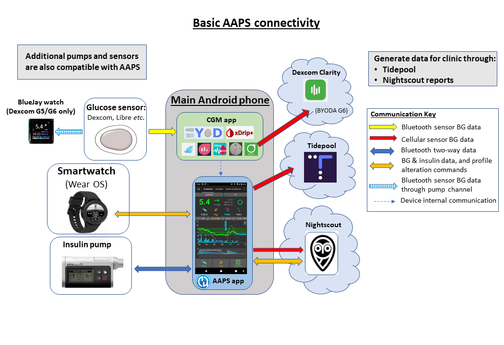
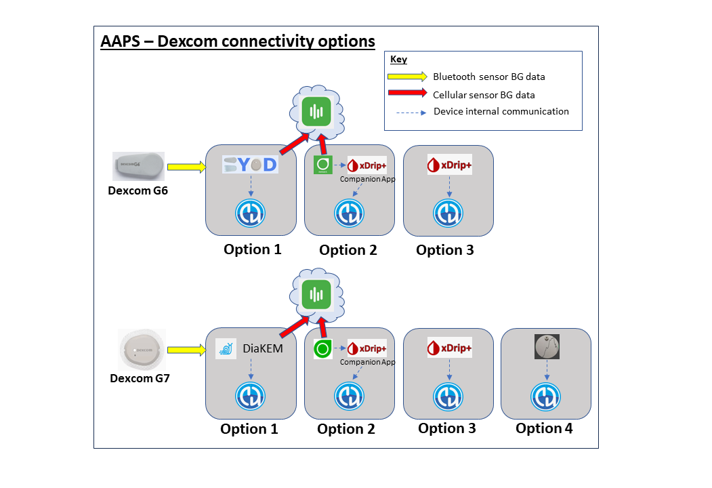
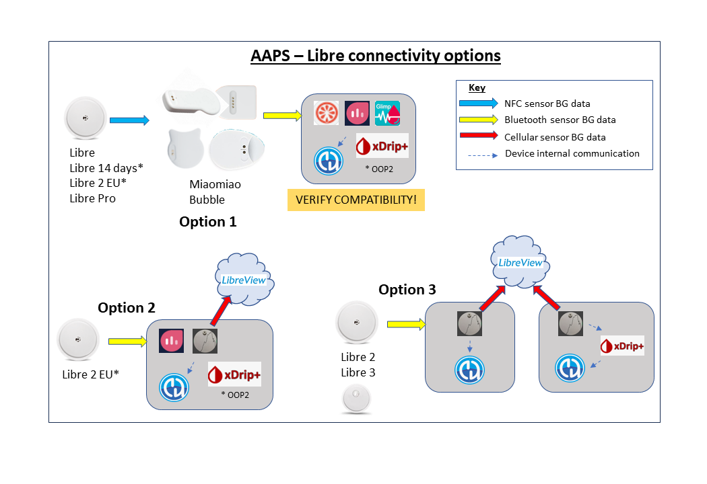
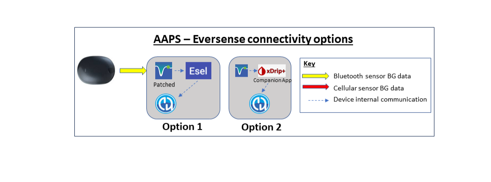

# Preparazione per iniziare con AAPS

Benvenuto. Questa documentazione mira a guidare gli utenti che si stanno preparando a configurare e iniziare a utilizzare il Sistema Pancreas Artificiale Android (**AAPS**).

## Orientarsi nella documentazione

Un **indice** e una spiegazione della struttura della documentazione sono disponibili [qui](../index.md), puoi raggiungerlo anche facendo clic sul simbolo **AAPS** in alto a sinistra della documentazione. Lì troverai una panoramica dello scopo delle diverse sezioni della documentazione. Puoi anche usare i titoli a sinistra di questa pagina per navigare nella documentazione. Infine, c'è un pratico motore di ricerca, direttamente sotto il simbolo **AAPS**.

Miriamo a rendere facile determinare sia le capacità che i limiti di **AAPS**. Può essere deludente scoprire, dopo aver investito tempo nella lettura della documentazione, che potresti non avere un microinfusore o un CGM compatibile, o che **AAPS** offra funzionalità diverse da quelle sperate.

Molti dettagli legati all'esperienza nella documentazione di **AAPS** hanno più senso quando stai effettivamente usando **AAPS** in tempo reale. Proprio come è difficile imparare uno sport solo leggendo le regole, ci vuole una combinazione tra l'apprendimento delle basi delle regole per un uso sicuro di **AAPS** e poi imparare come applicare al meglio quelle regole quando inizi a usare **AAPS**.

(preparing-safety-first)=

## La Sicurezza Prima di Tutto
"Con grande potere viene grande responsabilità…"

### Sicurezza tecnica
**AAPS** dispone di un ampio set di funzionalità di sicurezza. Queste impongono dei vincoli che vengono gradualmente rimossi attraverso il completamento a tappe di una serie di [Obiettivi](../SettingUpAaps/CompletingTheObjectives.md) che comportano il test di parametri specifici e la risposta a domande a scelta multipla. Le funzionalità di **AAPS** vengono sbloccate man mano che gli Obiettivi vengono completati con successo. Questo processo consente all'utente di migrare in modo sicuro per fasi dal Loop Aperto al Loop Chiuso, imparando le diverse funzionalità di **AAPS**.

Gli [Obiettivi](../SettingUpAaps/CompletingTheObjectives.md) sono stati progettati per ottenere la migliore introduzione possibile ad **AAPS**, tenendo conto degli errori tipici e delle tendenze generali che gli sviluppatori di **AAPS** hanno osservato nei nuovi utenti. Possono verificarsi errori perché il principiante è inesperto e troppo desideroso di iniziare con **AAPS**, o ha trascurato punti chiave. Gli [Obiettivi](../SettingUpAaps/CompletingTheObjectives.md) mirano a ridurre al minimo questi problemi.

### Sicurezza medica
```{admonition} Avoid permanent and painful damage to your eyes and nerves
:class: danger
Si consiglia cautela riguardo ai rapidi miglioramenti nel controllo della glicemia e alla riduzione dell'HbA1c 
```

Una considerazione importante sulla sicurezza è che una **rapida riduzione dell'HbA1c e un migliorato controllo della glicemia in coloro che hanno avuto livelli di glucosio elevati per un certo periodo di tempo può causare danni permanenti**. Molte persone con diabete non sono a conoscenza di questo, e non tutti i medici rendono i loro pazienti consapevoli di questo problema.

Questo danno può includere **perdita della vista e neuropatia permanente (dolore)**. È possibile evitare che questo danno si verifichi, riducendo i livelli medi di glucosio più lentamente. Se attualmente hai un HbA1c elevato e stai passando ad **AAPS** (o qualsiasi altro sistema a circuito chiuso), _ti preghiamo_ di discutere questo potenziale rischio con il tuo team clinico prima di iniziare, e di concordare con loro una tempistica con obiettivi di glucosio sicuri gradualmente decrescenti. Puoi facilmente impostare obiettivi di glucosio più elevati in **AAPS** inizialmente (attualmente, l'obiettivo più alto che puoi selezionare è 10,6 mmol/L ma puoi anche mantenere un profilo volutamente debole se necessario), e poi ridurre l'obiettivo con il passare dei mesi.

#### Con quale rapidità posso ridurre il mio HbA1c senza rischiare danni permanenti?

Uno [studio](https://pubmed.ncbi.nlm.nih.gov/1464975/) retrospettivo su 76 pazienti ha riportato che il rischio di progressione della retinopatia aumentava di 1,6 volte, 2,4 volte e 3,8 volte se l'HbA1C scendeva rispettivamente dell'1%, 2% o 3% nell'arco di un periodo di 6 mesi. Hanno suggerito che la **"diminuzione del valore di HbA1c in qualsiasi periodo di 6 mesi dovrebbe essere limitata a meno del 2% per prevenire la progressione della retinopatia....Una diminuzione troppo rapida all'inizio del controllo glicemico potrebbe causare una grave o transitoria esacerbazione della progressione della retinopatia."**

N.B. N.B. N.B. N.B. N.B. N.B. N.B. N.B. N.B. N.B. N.B. N.B. N.B. If you use different HbA1c units (mmol/mol rather than %), click [here](https://www.diabetes.co.uk/hba1c-units-converter.html) for a HbA1c calculator tool.

In un'altra [valutazione](https://academic.oup.com/brain/article/138/1/43/337923) retrospettiva su 954 pazienti, i ricercatori hanno osservato che:

**"Con una diminuzione dell'HbA1c di 2-3 punti percentuali nell'arco di 3 mesi c'era un rischio assoluto del 20% di sviluppare neuropatia indotta dal trattamento nel diabete, con una diminuzione dell'HbA1c di >4 punti percentuali nell'arco di 3 mesi il rischio assoluto di sviluppare neuropatia indotta dal trattamento nel diabete superava l'80%."**

Un [commento](https://academic.oup.com/brain/article/138/1/2/340563) su questo lavoro ha concordato che per evitare complicazioni **l'obiettivo dovrebbe essere quello di ridurre l'A1c di <2% nell'arco di 3 mesi.** Puoi leggere altre revisioni sull'argomento [qui](https://www.ncbi.nlm.nih.gov/pmc/articles/PMC6587545/pdf/DOM-21-454.pdf) e [qui](https://www.mdpi.com/1999-4923/15/7/1791).

È generalmente riconosciuto che i diabetici di tipo 1 _di nuova_ diagnosi (che spesso hanno un HbA1c molto elevato alla diagnosi, prima di iniziare la terapia insulinica) sembrano essere in grado di ridurre rapidamente il loro HbA1c immediatamente dopo la diagnosi senza incontrare questi rischi nella stessa misura, perché non hanno avuto livelli di glucosio nel sangue elevati per un periodo così prolungato. Tuttavia, è ancora una considerazione che dovresti discutere con il tuo medico.

(PreparingForAaps-no-sglt-2-inhibitors)=
### No agli inibitori SGLT-2

```{admonition} NO SGLT-2 inhibitors
:class: danger
Gli inibitori SGLT-2, chiamati anche gliflozine, inibiscono il riassorbimento del glucosio nel rene. Le gliflozine abbassano incalcolabilmente i livelli di zucchero nel sangue, quindi NON DEVI assumerle mentre usi un sistema a circuito chiuso come AAPS! Vi sarebbe un rischio significativo di chetoacidosi e/o ipoglicemia! La combinazione di questo farmaco con un sistema che abbassa la basale per aumentare la glicemia è particolarmente pericolosa. 

In sintesi:
- **Esempio 1: rischio di Ipo**
>Durante il pranzo, usi **AAPS** per fare un bolo basato sul consumo di 45g di glucosio. Il problema è che, a insaputa di AAPS, gli inibitori fanno sì che il corpo elimini alcuni dei carboidrati, con il risultato che il tuo corpo ha troppa insulina rispetto ai Carboidrati assorbiti, causando ipoglicemia.

- **Esempio 2: rischio di Chetoacidosi**
>Gli inibitori eliminano alcuni dei carboidrati in background causando una riduzione della tua glicemia. **AAPS** istruirà automaticamente il micro a ridurre l'assunzione di insulina, inclusa la basale. Nel tempo questo può far sì che la tua glicemia rimanga al di sotto del valore target al punto in cui il corpo non ha abbastanza insulina di fondo per assorbire i carboidrati con conseguente Chetoacidosi. Normalmente, la Chetoacidosi si sviluppa nei pazienti T1D perché il loro micro si guasta, il che attiverebbe avvisi sul telefono e sarebbe evidente a causa di un valore di glicemia elevato. Tuttavia, il pericolo con le Gliflozine è che non ci sarebbero avvisi AAPS poiché il micro rimane operativo e la glicemia rimane potenzialmente entro il target.  

I nomi commerciali comuni degli inibitori SGLT-2 includono: Invokana, Farxiga, Jardiance, Glyxambi, Synjardy, Steglatro, e Xigduo XR, e altri.
```


### Principi chiave del loop con AAPS

I principi e i concetti chiave del loop devono essere compresi prima di usare **AAPS**. Questo si ottiene investendo il tuo tempo personale nella lettura della documentazione di **AAPS**, e nel completamento degli Obiettivi che mirano a fornirti una solida base per un uso sicuro ed efficace di **AAPS**. Il volume della documentazione di **AAPS** può sembrare travolgente all'inizio, ma sii paziente e fidati del processo: con il giusto approccio, ce la farai!

La velocità di progressione dipenderà dall'individuo, ma tieni presente che il completamento di tutti gli obiettivi richiede in genere 6-9 settimane. Molte persone iniziano a costruire, installare e configurare **AAPS** ben prima di iniziare a usarlo. Per aiutare in questo, il sistema ha un "micro virtuale" che può essere usato durante il completamento dei primi obiettivi, in modo da poter familiarizzare con **AAPS** senza effettivamente usarlo per somministrare insulina. Una ripartizione dettagliata della tempistica è fornita di seguito; tieni presente che all'obiettivo 8 di **AAPS** sei in loop chiuso, gli obiettivi successivi aggiungono funzionalità aggiuntive come i **comandi SMS** e le **automazioni** che sono utili ad alcuni utenti, ma non essenziali alla funzione principale di **AAPS**.

Il successo con **AAPS** richiede un approccio proattivo, la disponibilità a riflettere sui dati glicemici e la flessibilità per apportare le necessarie modifiche ad **AAPS** al fine di migliorare i tuoi risultati. Proprio come è quasi impossibile imparare a giocare a uno sport solo leggendo le regole, lo stesso si può dire di **AAPS**.

#### Pianifica ritardi e piccoli problemi nel mettere tutto in funzione

Nelle fasi preliminari di avvio con **AAPS**, potresti riscontrare difficoltà nel far comunicare efficacemente tutti i componenti del loop tra loro (e potenziali follower), e nel perfezionare le impostazioni. Alcuni problemi non possono essere risolti finché **AAPS** non viene usato nella vita quotidiana, ma è disponibile molto aiuto nel gruppo Facebook e su Discord. Pianifica di conseguenza e scegli momenti "buoni", come una tranquilla mattina del fine settimana (ad es. non a tarda notte o quando sei stanco, o prima di un grande incontro o di un viaggio) per risolvere i problemi.

#### Compatibilità tecnologica

**AAPS** è compatibile solo con determinati tipi di microinfusori per insulina, CGM e telefoni, e alcune tecnologie potrebbero non essere disponibili in vari paesi. Per evitare delusioni o frustrazioni, si prega di leggere le sezioni [CGM](../Getting-Started/CompatiblesCgms.md), [micro](../Getting-Started/CompatiblePumps.md) e [telefono](../Getting-Started/Phones.md).

#### Tempo di compilazione dell'app e progressione verso il loop completo

Il tempo per compilare l'app **AAPS** dipende dal tuo livello di competenza e capacità tecnica. Tipicamente per gli utenti inesperti, può richiedere fino a mezza giornata o una giornata intera (con l'aiuto della comunità) per compilare **AAPS**. Il processo si accelererà significativamente per le versioni più recenti di **AAPS**, man mano che diventi più esperto.

Per aiutare nel processo di compilazione ci sono sezioni dedicate:

- Lista di domande e risposte per gli errori frequenti che probabilmente si verificheranno nelle [FAQ](../UsefulLinks/FAQ.md) (Sezione K);

- "[Come installare AAPS](../SettingUpAaps/BuildingAaps.md)? (Sezione D) che include la sottosezione [Risoluzione dei problemi](../GettingHelp/GeneralTroubleshooting.md).

Quanto tempo ci vuole per arrivare al loop chiuso dipende dall'individuo, ma una tempistica approssimativa per arrivare al loop completo con AAPS può essere trovata ([qui](#preparing-how-long-will-it-take))


#### Keystore e file di esportazione delle impostazioni di configurazione

Un "keystore" (file .jks) è un file crittografato con password univoco per la tua copia di **AAPS**. Il tuo telefono Android lo usa per garantire che nessun altro possa aggiornare la tua copia senza il keystore. In breve, come parte della compilazione di **AAPS**, dovresti:

1.  Salvare il tuo file keystore (file .jks usato per firmare la tua app) in un posto sicuro;

2.  Prendere nota della password per il tuo file keystore.


Questo garantirà che tu possa usare quello stesso file keystore ogni volta che viene creata una versione aggiornata di **AAPS**. In media, saranno necessari 2 aggiornamenti di **AAPS** all'anno.

Inoltre, **AAPS** offre la possibilità di [esportare tutte le impostazioni di configurazione](../Maintenance/ExportImportSettings.md). Questo garantisce che tu possa recuperare in modo sicuro il tuo sistema cambiando telefono, aggiornando/reinstallando l'applicazione con minime interruzioni. 

#### Risoluzione dei problemi

Non esitare a contattare la comunità AAPS se c'è qualcosa di cui ti senti incerto: non esistono domande stupide! Tutti gli utenti con vari livelli di esperienza sono incoraggiati a fare domande. I tempi di risposta alle domande sono solitamente rapidi grazie al numero di utenti **AAPS**.

##### [Chiedi nel gruppo Facebook AAPS](https://www.facebook.com/groups/AndroidAPSUsers/)

##### [Chiedi nel canale Discord AAPS](https://discord.gg/4fQUWHZ4Mw)


#### [Dove trovare aiuto](../UsefulLinks/BackgroundReading.md)?

Questa sezione mira a fornire ai nuovi utenti link a risorse per ottenere aiuto, incluso l'accesso al supporto della comunità composto sia da utenti nuovi che esperti che possono chiarire domande e risolvere i soliti problemi che si presentano con AAPS.

#### [Sezione Per i Clinici](../UsefulLinks/ClinicianGuideToAaps.md)

Questa è una [sezione specificamente per i clinici](../UsefulLinks/ClinicianGuideToAaps.md) che vogliono saperne di più su AAPS e sulla tecnologia open source del pancreas artificiale. Nell'Introduzione c'è anche una guida su [come parlare con il tuo team clinico](#introduction-how-can-i-approach-discussing-aaps-with-my-clinical-team).

## Cosa andremo a costruire e installare?

Questo diagramma fornisce una panoramica dei componenti chiave (sia hardware che software) del sistema **AAPS**:




Oltre ai tre componenti hardware di base (telefono, micro, sensore di glucosio), abbiamo anche bisogno di: 1) L'app **AAPS** 2) Un server di rendicontazione e 3) Un'app per il monitor continuo del glucosio (CGM)

### 1) Un'applicazione per telefono Android: **AAPS**

**AAPS** è un'app che gira su smartphone e dispositivi Android. Costruirai l'app **AAPS** (un file apk) tu stesso, usando una guida passo dopo passo, scaricando il codice sorgente di **AAPS** da GitHub, installando i programmi necessari (Android Studio, GitHub desktop) sul tuo computer e costruendo la tua copia dell'app **AAPS**. Trasmetterai quindi l'app **AAPS** al tuo smartphone (via email, cavo USB _ecc._) e la installerai.

### 2) Un server di rendicontazione: NightScout (Tidepool*)

Per sfruttare appieno **AAPS**, devi configurare un server Nightscout. Puoi [farlo tu stesso](https://nightscout.github.io/nightscout/new_user/#free-diy) oppure pagare una piccola tariffa per un [servizio Nightscout gestito](https://nightscout.github.io/#nightscout-as-a-service) che venga configurato per te. Nightscout viene usato per raccogliere i dati da **AAPS** nel tempo e può generare rapporti dettagliati che correlano i modelli CGM e di insulina. È anche possibile per i caregiver usare Nightscout per comunicare da remoto con l'applicazione **AAPS**, per supervisionare la gestione diabetologica del loro bambino. Tali funzionalità di comunicazione remota includono il monitoraggio in tempo reale dei livelli di glucosio e di insulina, il bolo remoto di insulina (tramite SMS) e gli annunci dei pasti. Tentare di analizzare le prestazioni del tuo diabete guardando i dati CGM separatamente dai dati del micro è come guidare una macchina in cui il guidatore è cieco e il passeggero descrive la scena.  Tidepool è anche disponibile come alternativa a Nightscout, per le versioni AAPS 3.2 e successive.

### 3) App per il sensore CGM

A seconda del tuo sensore/CGM di glucosio, avrai bisogno di un'app compatibile per ricevere le letture di glucosio e inviarle ad **AAPS**. Le diverse opzioni sono mostrate di seguito e maggiori informazioni sono fornite nella [sezione CGM compatibili](../Getting-Started/CompatiblesCgms.md):

  

### Manutenzione del sistema **AAPS**

Sia **Nightscout** che **AAPS** devono essere aggiornati circa una volta all'anno, man mano che vengono rilasciate versioni migliorate. In alcuni casi l'aggiornamento può essere ritardato, in altri è fortemente raccomandato o considerato essenziale per la sicurezza. La notifica di questi aggiornamenti sarà fornita sui gruppi Facebook e sui server Discord. Le note di rilascio indicheranno chiaramente quale sia la situazione. Probabilmente ci saranno molte persone che faranno domande simili alle tue al momento dell'aggiornamento, e avrai supporto per eseguire gli aggiornamenti.

(preparing-how-long-will-it-take)=
## Quanto tempo ci vorrà per configurare tutto?

Come accennato in precedenza, l'uso di **AAPS** è più un "percorso" che richiede un investimento del tuo tempo personale. Non è una configurazione una tantum. Le stime attuali per la compilazione di **AAPS**, l'installazione e la configurazione di **AAPS** e del software **CGM** e il passaggio dal loop aperto al loop chiuso ibrido con **AAPS** sono circa 4-6 mesi in totale. Si suggerisce pertanto di dare priorità alla compilazione dell'app **AAPS** e al lavoro attraverso i primi obiettivi il prima possibile, anche se stai ancora usando un sistema di erogazione dell'insulina diverso (puoi usare un micro virtuale fino all'obiettivo 5).

Alcuni degli obiettivi richiedono un determinato numero di giorni affinché tu comprenda la nuova funzionalità. Non è possibile aggirare questi tempi di attesa; questi tempi minimi sono stati impostati per la tua sicurezza.

Ecco una tempistica approssimativa:

| Attività                                                           |       Tempo approssimativo        |
| ------------------------------------------------------------------ |:---------------------------------:|
| Lettura iniziale della documentazione                              |            1-2 giorni             |
| Installazione/configurazione del PC per consentire la compilazione |              2-8 ore              |
| Configurazione di un server di rendicontazione                     |               1 ora               |
| Installazione di un'app CGM (xDrip+, BYODA, ...)                   |               1 ora               |
| Configurazione iniziale CGM → xDrip+ → AAPS                        |               1 ora               |
| Configurazione iniziale AAPS → micro                               |               1 ora               |
| Configurazione AAPS → Nightscout/Tidepool (solo rendicontazione)   |               1 ora               |
| Opzionale: Configurazione NightScout ↔ **AAPS** e NSFollowers      |               1 ora               |
| Obiettivo 1: Impostazione della visualizzazione e del monitoraggio |               1 ora               |
| Obiettivo 2: Imparare a controllare AAPS                           |               2 ore               |
| Obiettivo 3: Dimostrare le proprie conoscenze                      |         Fino a 14 giorni          |
| Obiettivo 4: Iniziare con un loop aperto                           |          Minimo 7 giorni          |
| Obiettivo 5: Comprendere il loop aperto                            |             7 giorni              |
| Obiettivo 6: Iniziare a chiudere il loop (Low Glucose Suspend)     |    Minimo 5, fino a 14 giorni     |
| Obiettivo 7: Messa a punto del loop chiuso                         | Minimo 1 giorno, fino a 7 giorni  |
| Obiettivo 8: Regolare le basali e i rapporti, abilitare Autosens   | Minimo 7 giorni, fino a 14 giorni |
| Obiettivo 9: Abilitazione del Super Micro Bolo (SMB)               |         Minimo 28 giorni          |
| Obiettivo 10: Automazione                                          |         Minimo 28 giorni          |
| Obiettivo 11: ISF Dinamico                                         |         Minimo 28 giorni          |

Una volta che sei completamente operativo su **AAPS**, dovrai ancora regolare regolarmente le tue impostazioni per migliorare la gestione complessiva del tuo diabete.

## Requisiti

### Considerazioni mediche

Oltre alle avvertenze mediche nella [sezione sicurezza](#preparing-safety-first) ci sono anche parametri diversi, a seconda del tipo di insulina che utilizzi nel micro.

#### Scelta dell'insulina

I calcoli di **AAPS** si basano su concentrazioni di insulina di 100U/ml (uguale allo standard del micro). Sono supportati i seguenti tipi di preset del profilo insulinico:

- Rapida Oref: Humalog/NovoRapid/NovoLog
- Ultra-Rapida ORef: Fiasp
- Lyumjev:

Solo per utenti Sperimentali/Avanzati:
- Free-Peak Oref: Consente di definire il picco dell'attività insulinica


### Tecnico

Questa documentazione mira a ridurre al minimo assoluto le competenze tecniche richieste. Dovrai usare il tuo computer per compilare l'applicazione **AAPS** in Android Studio (istruzioni passo passo). Devi anche configurare un server su Internet in un cloud pubblico, configurare diverse app per telefono Android e sviluppare competenze nella gestione del diabete. Questo può essere ottenuto muovendosi passo dopo passo, con pazienza e con l'aiuto della comunità **AAPS**. Se sei già in grado di navigare su Internet, gestire le tue email Gmail e tenere aggiornato il tuo computer, allora è un compito fattibile compilare **AAPS**. Prenditi solo il tuo tempo.

### Smartphone

#### AAPS e versioni Android

La versione corrente di **AAPS** (3.4) richiede uno smartphone Android con Google **Android 12.0 o superiore**. Se stai pensando di acquistare un nuovo telefono, (a partire da gennaio 2026), è preferibile Android 16, Android 15 non è consigliato.<br/> Gli utenti sono fortemente incoraggiati a mantenere aggiornata la propria versione di **AAPS** per motivi di sicurezza. Tuttavia, per gli utenti che non possono usare un dispositivo con Android 12.0 o più recente, le versioni precedenti di **AAPS** compatibili con le versioni Android più vecchie rimangono disponibili, vedi: [Note di rilascio](#maintenance-android-version-aaps-version).

#### Scelta del modello di smartphone
Il modello esatto che acquisti dipende dalle funzioni desiderate. Puoi trovare nella [pagina Telefoni](../Getting-Started/Phones.md) raccomandazioni e feedback degli utenti sulle configurazioni funzionanti.

Gli utenti sono incoraggiati a mantenere aggiornata la versione Android del telefono, inclusi i parametri di sicurezza. Tuttavia, se sei nuovo con **AAPS** o non sei un esperto tecnico, potresti voler ritardare l'aggiornamento del telefono fino a quando altri l'hanno fatto e confermato che è sicuro farlo, sui nostri vari forum.

```{admonition} delaying Samsung phones updates
:class: warning
<<<<<<< Updated upstream
Samsung has an unfortunate track record of forcing updates of their phones which cause bluetooth connectivity issues. Open developer options and scroll to find auto system update and turn it off To disable these forced updates you need to switch the phone to "developer mode" by:
 go to settings and about then software information, then tap build number until it confirms you have unlocked developer mode. Open developer options and scroll to find auto system update and turn it off To disable these forced updates you need to switch the phone to "developer mode" by:
 go to settings and about then software information, then tap build number until it confirms you have unlocked developer mode. To disable these forced updates you need to switch the phone to "developer mode" by:
 go to settings and about then software information, then tap build number until it confirms you have unlocked developer mode.
```

```{admonition} Google Play Protect potential Issue
:class: warning
Ci sono state diverse segnalazioni di **AAPS** che viene chiuso arbitrariamente da Google Play Protect ogni mattina. Se questo accade dovrai andare nelle opzioni di Google Play e disabilitare "Google Play Protect". Non tutti i modelli di telefono o tutte le versioni Android sono interessati.
```

