# Smartwatch e AAPS

Vari smartwatch possono essere utilizzati per visualizzare alcune delle informazioni disponibili in **AAPS** o per eseguire azioni da remoto.

Avere uno smartwatch che controlli direttamente **AAPS** (micro e sensore) si ottiene usando orologi Android completi (che sono considerati come piccoli [smartphone](./Phones.md)).

Alcuni smartwatch possono permetterti di inserire trattamenti, o altro, ma con il telefono stesso che gestisce ancora **AAPS**.

Gli smartwatch vengono sempre più utilizzati con **AAPS** _sia_ per gli adulti con diabete che per i caregiver/genitori di bambini con diabete.

## Vantaggi generali dell'uso degli smartwatch con **AAPS**


Gli smartwatch, a seconda del modello, possono essere utilizzati in molti modi diversi con **AAPS**. Possono essere usati per controllare completamente o parzialmente **AAPS**, o semplicemente per controllare a distanza i livelli di glucosio, l'insulina attiva e altri parametri.

L'integrazione di uno smartwatch con **AAPS** può essere utile in molte situazioni, incluso durante la guida di un'auto o di una moto e durante l'esercizio fisico. Alcune persone ritengono che guardare un orologio (in una riunione, a una festa, a tavola ecc.) sia più discreto che guardare il telefono. Dal punto di vista della sicurezza, uno smartwatch può anche essere utile mentre ci si sposta, consentendo all'utente di tenere il telefono **AAPS** fuori dalla vista (come dentro una borsa), ma con l'aiuto dello smartwatch per il telecomando.

## Vantaggi specifici per genitori/assistenti che usano **AAPS**

Per un bambino, se il loro telefono **AAPS** è nelle vicinanze, un caregiver può usare uno smartwatch per monitorare o apportare modifiche senza dover usare il telefono **AAPS**. Questo può essere utile, per esempio, se il telefono **AAPS** è nascosto in una cintura del micro.

Uno smartwatch può essere usato sia _in aggiunta_, che come _alternativa_ alle opzioni basate sul telefono per il controllo remoto o il [solo monitoraggio](../RemoteFeatures/FollowingOnly.md).

Inoltre, a differenza dei telefoni dei genitori/caregiver follower (che si affidano alla rete mobile o alla connessione Wi-Fi), gli smartwatch connessi tramite Bluetooth possono essere utili in luoghi remoti, come una grotta, su una barca, o a metà strada su una montagna. Se entrambi i dispositivi (telefono **AAPS** e smartwatch) sono sulla stessa rete wifi, possono anche usare il wifi.

## Diversi tipi di interazioni Smartwatch-AAPS

Ci sono attualmente cinque modi principali in cui gli smartwatch vengono utilizzati in combinazione con **AAPS**. Questi sono mostrati nella tabella seguente: 

| Configurazione orologio   | Funzionalità                             | Requisiti                                                                                                                                                                                                                                          |
| ------------------------- | ---------------------------------------- | -------------------------------------------------------------------------------------------------------------------------------------------------------------------------------------------------------------------------------------------------- |
| Standalone                | AAPS senza telefono                      | Smartwatch Android completo (verificare min Android)</br> Esecuzione di **app-fullRelease**                                                                                                                                                        |
| Controllo remoto completo | La maggior parte delle funz. AAPS        | Orologio Android **Wear OS** (verificare Android/API)</br>Esecuzione di **wear-fullRelease**                                                                                                                                                       |
| Controllo remoto          | Funzioni AAPSClient                      | Orologio Android **Wear OS** (verificare Android/API)</br>Esecuzione di **[wear-aapsclientRelease](https://github.com/nightscout/AndroidAPS/releases)**                                                                                            |
| Controllo remoto          | Alcune funzioni AAPSClient               | Alcuni orologi Samsung, Fitbit e Garmin</br>Vedi sotto.                                                                                                                                                                                            |
| Display                   | Visualizza alcune indicazioni AAPSClient | Molti smartwatch (vedi [qui](https://bigdigital.home.blog/))</br>[xDrip+](https://github.com/nightscoutfoundation/xdrip/releases) e [WatchDrip+](https://bigdigital.home.blog/2022/06/16/watchdrip-a-new-application-for-xdrip-watch-integration/) |

## Prima di acquistare uno smartwatch…

Il modello esatto di smartwatch che acquisti dipende dalle funzioni desiderate. Potresti trovare informazioni utili nella [pagina Telefoni](#Phones-list-of-tested-phones), inclusa una lista di telefoni testati che contiene anche alcuni smartwatch.

I marchi di orologi popolari includono Samsung Galaxy, Garmin, Fossil, Mi band e Fitbit. Le diverse opzioni riassunte nella tabella sopra sono spiegate più dettagliatamente di seguito, per aiutarti a decidere quale smartwatch è giusto per la tua situazione.

Se stai integrando uno smartwatch con **AAPS** su un telefono con l'intenzione di interagire da remoto con **AAPS**, devi anche considerare se i due dispositivi sono compatibili tra loro, in particolare se hai un telefono più vecchio o insolito.

In generale, se vuoi solo seguire i numeri del glucosio e non interagire con **AAPS**, c'è una gamma più ampia di orologi economici e semplici che puoi usare.

Il modo migliore per scegliere uno smartwatch è cercare post relativi agli "orologi" nei gruppi Discord o Facebook di **AAPS**. Leggi le esperienze degli altri e pubblica eventuali domande specifiche, se la tua query non ha risposta nei post più vecchi.

## Android Completo

It sounds like an attractive option, right? However, at present, only a few enthusiasts are experimenting with **AAPS**  on a stand-alone watch. There are a limited number of smartwatches with a reasonable interface which also which work well with standalone use of **AAPS** and your CGM app. You will need to load the watch with the **AAPS** "full" apk (the apk which is usually installed on a smartphone) rather than the **AAPS** "wear" apk. Popular models include the LEMFO LEM.

Sebbene non ci sia una specifica chiara che ti aiuti a sapere se un orologio funzionerà bene per l'uso standalone di **AAPS**, i seguenti parametri ti aiuteranno:

1)  Android 12 o più recente. 2)  Essere in grado di portare il quadrante fuori dalla modalità "quadrata" per rendere il testo più grande e più facile da leggere. 3)  Ottima durata della batteria. 4)  Buon range Bluetooth.

La maggior parte delle frustrazioni degli orologi **AAPS** standalone derivano dall'interazione con un piccolo schermo e dal fatto che l'attuale interfaccia completa dell'app AAPS non è stata progettata per un orologio. Potresti preferire usare uno stilo per modificare le impostazioni di **AAPS** sull'orologio, a causa delle dimensioni ridotte dello schermo, e alcuni pulsanti di AAPS potrebbero non essere visibili sullo schermo dell'orologio.

Le sfide aggiuntive sono che è difficile ottenere una durata sufficiente della batteria, e gli orologi con batteria sufficiente sono spesso ingombranti e spessi. Gli utenti riferiscono di lottare con il sistema operativo e le impostazioni di risparmio energetico, la difficoltà nell'avviare i sensori sull'orologio, scarso range Bluetooth (per mantenere la connessione sia con il sensore che con il micro) e resistenza all'acqua discutibile. Esempi sono mostrati nelle foto di seguito.

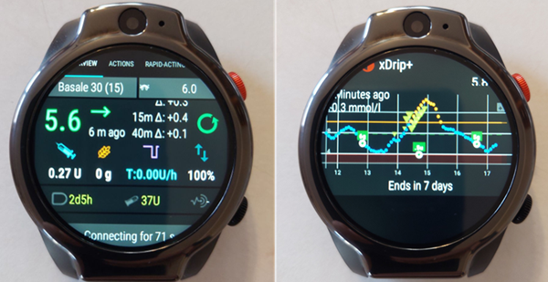

Se sei interessato a configurare un orologio standalone, leggi i post e i commenti nel gruppo Facebook di **AAPS** (buone opzioni di ricerca sono "standalone" e "Lemfo") e Discord per ulteriori informazioni.

## Wear OS

Il codice di **AAPS** contiene un'estensione dell'app che può essere installata su [smartwatch **Wear OS**](https://wearos.google.com/#oem-carousel).

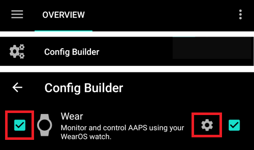

Verifica che il tuo smartwatch soddisfi i [prerequisiti](#maintenance-android-version-aaps-version) di **AAPS**.

### Che cos'_è_ Wear OS?

Le prime tre opzioni di smartwatch richiedono che lo smartwatch abbia **Wear OS** installato.

**Wear OS** è il sistema operativo che gira su alcuni moderni smartwatch Android. Se la descrizione dello smartwatch indica solo la _compatibilità_ con Android e iOS, non significa che stia eseguendo Wear OS. Potrebbe essere un altro tipo di sistema operativo specifico del fornitore che non è compatibile con **AAPS**. Per supportare l'installazione e l'uso di qualsiasi versione di **AAPS** o **AAPSClient**, uno smartwatch dovrà eseguire **Wear OS** ed essere Android 11 o più recente. Come riferimento, a partire da ottobre 2024, l'ultima versione di **Wear OS** è la versione 5.0 (basata su Android 13).

Se installi **AAPS** wear.apk su un orologio **Wear OS**, c'è una gamma di diversi quadranti **AAPS** personalizzati tra cui puoi scegliere. In alternativa, puoi usare un quadrante smartphone standard, con le tue informazioni **AAPS** incluse in piccoli riquadri noti come "complicazioni" sul quadrante. Una complicazione è qualsiasi funzionalità che viene visualizzata su un quadrante oltre all'orario.


### Come potrebbe apparire il mio smartwatch?

Dopo [aver installato **AAPS** sul tuo orologio](../WearOS/WearOsSmartwatch.md), potrai automaticamente selezionare il tuo quadrante preferito tra questi quadranti dedicati ad **AAPS**. Sulla maggior parte degli orologi, devi semplicemente tenere premuto a lungo sulla schermata principale finché lo schermo non si riduce e scorrere a destra per selezionare una schermata alternativa:

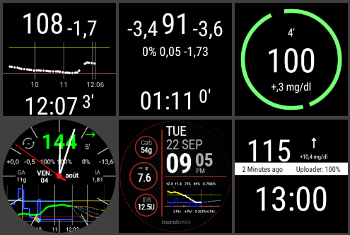

Questi sono gli schermi di base incorporati in **AAPS**, ci sono [altri quadranti](#WearOS_changing-to-AAPS-watchface) e puoi anche usare le [complicazioni](#Watchfaces-complications).

### Come utilizzo un orologio Wear OS quotidianamente?

Ulteriori dettagli sui quadranti e l'uso quotidiano, incluso come creare (e condividere) il tuo quadrante personalizzato, si trovano nella sezione [Operazione di Wear AAPS su uno Smartwatch](../WearOS/WearOsSmartwatch.md).

(Watchfaces-tizen)=

## Samsung Tizen

**AAPS** supporta l'invio di dati all'[app G-Watch](https://play.google.com/store/apps/details?id=sk.trupici.g_watch).

Controlla il [gruppo Facebook](https://www.facebook.com/groups/gwatchapp) dedicato per le ultime notizie.

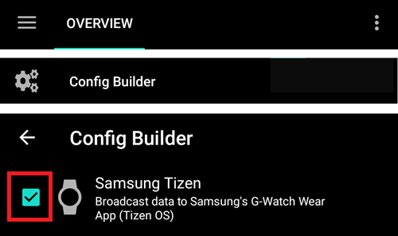

(Watchfaces-garmin)=

## Garmin

Ci sono alcuni quadranti per Garmin che si integrano con [AAPS](https://apps.garmin.com/search?keywords=androidaps), nello store Garmin ConnectIQ.

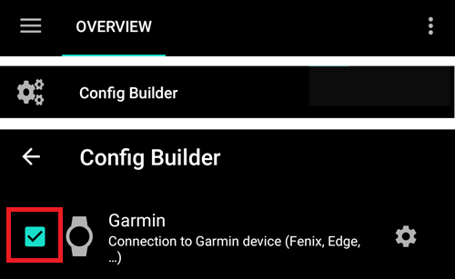

[AAPS Glucose Watch](https://apps.garmin.com/apps/3d163641-8b13-456e-84c3-470ecd781fb1) si integra direttamente con **AAPS**. Mostra i dati sullo stato del loop (insulina attiva, basale temporanea) oltre alle letture del glucosio e invia le letture della frequenza cardiaca ad **AAPS**. È disponibile nello store ConnectIQ, il plugin **AAPS** necessario è disponibile solo da **AAPS** 3.2. 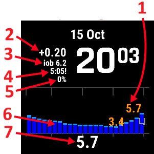


## Fitbit

```{Warning}
Google sta eliminando progressivamente i prodotti Fitbit. I quadranti personalizzati non sono più disponibili in Europa (devi usare una VPN). L'acquisto di un Fitbit ora non è consigliato.
```

**AAPS** supporta l'invio di dati al quadrante [Sentinel](http://ryanwchen.com/sentinel.html).

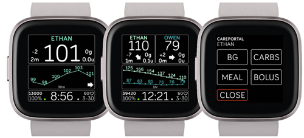


**"Sentinel"** è un quadrante sviluppato da [Ryan Chen](http://ryanwchen.com/sentinel.html) per la sua famiglia e condiviso gratuitamente per gli smartwatch Fitbit: Sense1/2, Versa 2/3/4. Non è compatibile con il FitBit Luxe poiché è solo un fitness tracker. Sentinel può essere scaricato dall'[app mobile FitBit](https://gallery.fitbit.com/details/5f75448f-413d-4ece-a53d-b969c6afea7c).

Consente il monitoraggio dei valori di glucosio nel sangue di 1, 2 o 3 persone utilizzando Dexcom Share, Nightscout o una combinazione dei due come sorgenti dati.

Puoi anche usare xDrip+ o SpikeApp se utilizzato con la modalità server web locale. Gli utenti possono impostare allarmi personalizzati e inviare eventi usando la funzionalità careportal di Nightscout direttamente dall'orologio per aiutare a tracciare l'insulina attiva (IOB), i carboidrati attivi (COB), inserire informazioni sui pasti (conteggio dei carboidrati e quantità del bolo) e i valori di controllo della glicemia.

Tutto apparirà sul grafico della timeline di Nightscout e come valori aggiornati nei campi IOB e COB. Il supporto della comunità può essere trovato nel [gruppo Facebook dedicato, Sentinel.](https://www.facebook.com/groups/3185325128159614)

Ci sono opzioni aggiuntive per gli orologi FitBit che sembrano essere solo per il monitoraggio. Questo include [Glance](https://glancewatchface.com/). Queste opzioni aggiuntive sono descritte nelle [pagine web di Nightscout.](https://nightscout.github.io/nightscout/wearable/#fitbit)

## Following only

Questi smartwatch rifletteranno alcune informazioni di **AAPS**, alcuni richiederanno altre app.

C'è una vasta gamma di smartwatch economici che possono fornire solo visualizzazione. Se stai usando Nightscout, una buona panoramica di tutte le opzioni è [qui](https://nightscout.github.io/nightscout/wearable/#)

Di seguito alcune delle opzioni di orologi per il solo monitoraggio popolari tra gli utenti **AAPS**:

### **Orologi Xiaomi e Amazfit**

[Artem](https://github.com/bigdigital) ha creato un'app di integrazione xDrip+ WatchDrip+ per vari modelli di smartwatch, principalmente per i marchi Xiaomi (_ad es._ Mi band) e Amazfit:

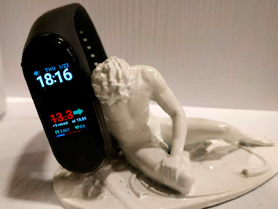


Puoi leggere di più su di loro, incluso come configurarli, sul suo sito web [qui](https://bigdigital.home.blog/). Il vantaggio di questi orologi è che sono piccoli e relativamente economici. Sono un'opzione popolare specialmente per i bambini e coloro con polsi più piccoli.

### Orologio Pebble

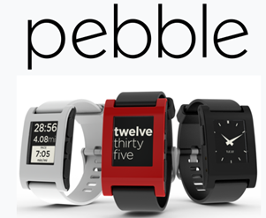

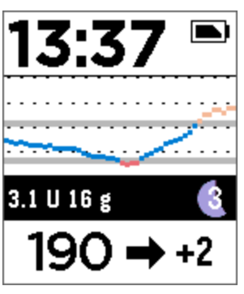


Gli orologi Pebble ([ora discontinuati](https://en.wikipedia.org/wiki/Pebble_(watch))) erano in vendita generale dal 2013 al 2016 e potrebbero ancora essere disponibili di seconda mano. Fitbit ha acquisito le risorse di Pebble. Gli utenti Pebble possono usare il quadrante Urchin per visualizzare i dati di Nightscout. Le opzioni dei dati visualizzati includono IOB, la velocità basale temporanea attualmente attiva e le previsioni. Se si usa il loop aperto, puoi usare IFTTT per creare un'applet che, se viene ricevuta una Notifica da **AAPS**, invii un SMS o una notifica pushover.

### [Orologi Bluejay](https://bluejay.website/)


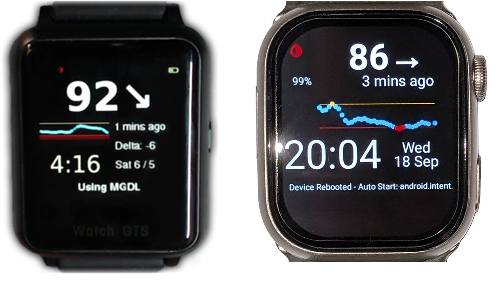


Questi sono pezzi unici di tecnologia che possono ricevere i dati del glucosio **direttamente** dal trasmettitore Dexcom. Non è ampiamente noto che i trasmettitori Dexcom G6/G7 trasmettono effettivamente i dati del glucosio corrente su _due_ canali separati, un canale telefonico e un canale medico. Gli orologi Bluejay possono essere impostati per ricevere i dati del glucosio su entrambi i canali, quindi se **AAPS** sta usando il canale telefonico, gli orologi Bluejay possono usare il canale medico.

Il vantaggio principale è che attualmente è l'unico orologio completamente indipendente sia dal telefono che dal sistema di loop. Quindi, per esempio, se disconnetti il micro e il telefono **AAPS** in spiaggia o a un parco divertimenti, e sei fuori portata dal telefono **AAPS**, puoi comunque ricevere letture dal tuo Dexcom direttamente all'orologio Bluejay.

Gli svantaggi riportati sono che non raccoglie sempre una lettura ogni 5 minuti e la batteria non è sostituibile. L'orologio Bluejay GTS esegue una versione modificata del software xDrip+ mentre il Bluejay U1 esegue xDrip+ completo.

### Apple watch

Controlla [Nightscout sul tuo orologio](https://nightscout.github.io/nightscout/wearable/#).

L'Apple watch ora supporta la connessione diretta G7 e può essere usato simultaneamente con **AAPS**.

