(bluetoothtroubleshooting-bluetooth-related-issues)=

# **Problemi relativi al Bluetooth**

Alcuni utenti hanno riscontrato problemi con l'attivazione di Omnipod DASH, problemi di connettività con Medtrum Nano e altri errori del pod legati al Bluetooth. Molti di questi problemi possono essere ricondotti a uno dei seguenti problemi.

Alcuni di questi problemi si applicano probabilmente anche ad altri microinfusori Bluetooth; il Medtrum Nano ha problemi noti con il permesso per i dispositivi nelle vicinanze, così come l'Omnipod DASH.

---

(bluetoothtroubleshooting-cannot-start-omnipod-with-android-16)=

## Impossibile avviare Omnipod con Android 16
- Android 16 richiede almeno la versione **AAPS** 3.3.2.1 affinché Omnipod DASH funzioni correttamente, poiché questa versione include correzioni specifiche per i problemi noti introdotti da Android 16 per Omnipod.

---

(bluetoothtroubleshooting-bluetooth-battery-optimisation)=

## Ottimizzazione batteria Bluetooth

Le versioni più recenti di Android hanno abilitato l'ottimizzazione della batteria per l'app Bluetooth di sistema. Questo è noto per causare alcuni problemi con i microinfusori e i CGM Bluetooth.

Se hai seguito la [Configurazione guidata](../SettingUpAaps/SetupWizard) e hai seguito le impostazioni di configurazione nella sezione [Ottimizzazione batteria Bluetooth](setup-wizard-bluetooth-battery-optimisation), questa impostazione dovrebbe essere corretta. Tuttavia, se hai seguito una versione precedente di questa guida, è possibile che tu non abbia modificato questa impostazione.

Verifica che sia configurata correttamente se riscontri disconnessioni del microinfusore o del CGM.

---

(bluetoothtroubleshooting-apps-using-nearby-device-permission)=

## Le app che utilizzano il permesso Android "Dispositivi nelle vicinanze" possono causare cadute di connessione e problemi di attivazione del Pod

Android permette di controllare cosa ogni app può fare o accedere sul tuo telefono tramite un modello di permessi. Per ogni app installata puoi scegliere di consentire o negare permessi specifici, ad esempio l'accesso ai file sul dispositivo, l'accesso al Bluetooth, la scansione dei dispositivi nelle vicinanze ecc.

**AAPS** richiede una serie di permessi specifici per funzionare; uno di quelli necessari per il funzionamento dei Pod è il permesso "Dispositivi nelle vicinanze". Molte altre applicazioni richiedono anch'esse questo permesso; la community sta riscontrando che alcune applicazioni, quando viene loro concesso questo permesso, possono causare problemi nell'attivazione di nuovi Pod su alcuni dispositivi.

(bluetoothtroubleshooting-apps-using-nearby-device-permission-known-apps)=

### **App che utilizzano il permesso "Dispositivi nelle vicinanze" e che sono note per aver causato problemi:**

Le app in questo elenco sono state discusse in uno o più luoghi nella community come causa di problemi per i dispositivi Omnipod DASH e in alcuni casi anche per Medtrum Nano.

```{admonition} Updating the list
:class: note
Contatta @XiTatiON sul canale Discord #omnipod-dash per discutere le app da aggiungere a questo elenco.
```

- **myBMW** MyBMW ha interrotto Medtrum Nano e Omnipod DASH. L'app MyBMW chiede il permesso per "trovare dispositivi nelle vicinanze" una sola volta; se non lo concedi, funziona comunque perfettamente.

- **Amazon Alexa** Rimuovere "Dispositivi nelle vicinanze" per l'app Alexa ha risolto il problema per alcune persone, ma interromperà la possibilità di associare dispositivi Matter IOT.

- **App MINI** Sembra che l'app sia basata sull'app myBMW e potrebbe quindi avere lo stesso comportamento.

- **BM2** App per il monitoraggio della batteria solare, usata in alcuni camper e configurazioni solari per campeggio; quando l'app è in esecuzione impediva l'attivazione di un nuovo Pod. Forzare l'arresto dell'app durante l'attivazione di un nuovo Pod è una soluzione alternativa al problema. Eseguire l'app in seguito non sembrava interferire con le funzionalità di Dash (su un Pixel 8 Pro con A16).

(bluetoothtroubleshooting-revoke-nearby-device-permission)=

### **Come revocare i permessi "Dispositivi nelle vicinanze" per altre app:**
Se hai problemi ad attivare un nuovo Pod e stai usando la versione corretta e supportata di **AAPS** per la tua versione di Android, potrebbe essere necessario revocare il permesso ad altre app durante l'attivazione di un nuovo Pod. It may be necessary to revoked the permission for other apps while activating a new Pod.

Segui questa procedura per revocare il permesso "Dispositivi nelle vicinanze" per tutte le app tranne **AAPS**:

```{admonition} Menus and settings
:class: note
Gli screenshot e le istruzioni in questa guida si riferiscono a un'installazione Vanilla Android 16 su Google Pixel 8 Pro. Altri produttori e dispositivi probabilmente non corrisponderanno esattamente a questi menu e descrizioni delle impostazioni; adatta i passaggi al tuo dispositivo e, in caso di difficoltà, consulta la sezione [Dove ottenere aiuto per Dash](#omnipod-dash-where-to-get-help-for-dash) per sapere come contattare la community per supporto.
```

1. Apri le impostazioni Android sul tuo telefono, scorri verso il basso e premi su **Sicurezza e privacy (1)**.

    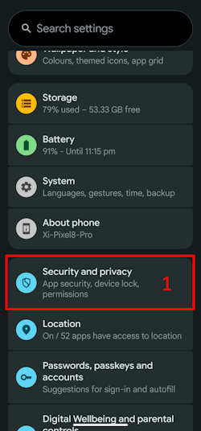

2. Scorri verso il basso e premi su **Controlli privacy (1)**.

   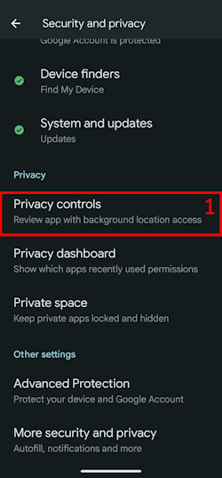

3. Premi su **Gestione autorizzazioni (1)**.

   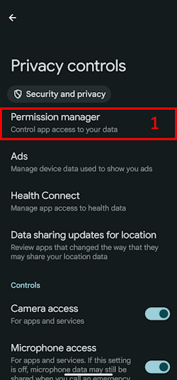

3. Scorri verso il basso e premi su **Dispositivi nelle vicinanze (1)**.

   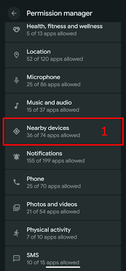

4. Sfoglia l'elenco delle app e premi sull'app per cui vuoi revocare i permessi **Dispositivi nelle vicinanze**.

   In questa guida **Android Auto (1)** è l'app su cui revocheremo il permesso.

   Per evitare di danneggiare altri Pod, consigliamo a tutti di revocare inizialmente il permesso su tutte le app tranne **AAPS**.

```{admonition} Which app to select?
:class: tip
Se non sei sicuro di quale app stia causando il problema, disabilitale tutte (ricorda di controllare anche l'elenco delle app problematiche note e inizia con quelle) e, se puoi permetterti di danneggiare qualche Pod nel processo, abilita il permesso su una nuova app prima di ogni nuova attivazione del Pod, finché non riesci a identificare quale app causa specificamente i problemi al tuo Pod. Se identifichi nuove app problematiche, faccelo sapere sul canale Discord #omnipod-dash.
```

   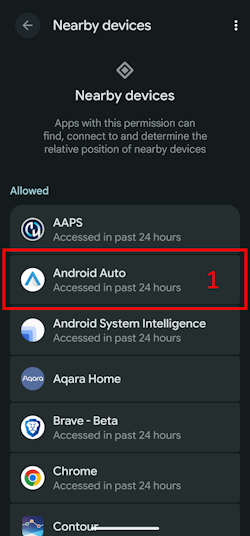

5. Per revocare il permesso premi su **Non consentire (1)**, poi su **Non consentire comunque (2)**. Se fatto correttamente, dovresti vedere **Non consentire (3)** come opzione Toggle selezionata. Ora puoi tornare al menu **Dispositivi nelle vicinanze** premendo la **freccia Indietro (4)** e modificare questa impostazione anche per altre app se necessario.

   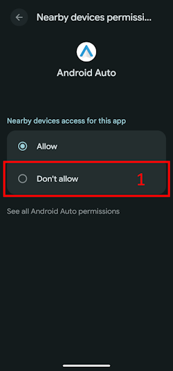 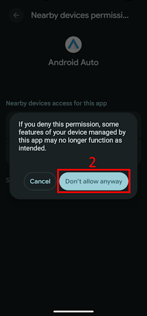  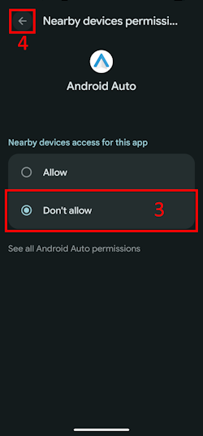

(bluetoothtroubleshooting-re-enable-nearby-device-permission)=

### **Come riabilitare i permessi "Dispositivi nelle vicinanze" per le app di sistema e altre app:**

1. Se necessario, consulta la sezione **"Come revocare i permessi 'Dispositivi nelle vicinanze' per altre app"** per accedere alle impostazioni di privacy dell'app, poi una volta nella configurazione di **Dispositivi nelle vicinanze** procedi al punto 2.

2. Sfoglia l'elenco delle app e premi sull'app per cui vuoi consentire i permessi **Dispositivi nelle vicinanze**.

   In questa guida **Android Auto (1)** è l'app a cui consentiremo il permesso.

   Noterai che **Android Auto (1)** manca nell'elenco delle app dopo che il permesso è stato revocato. Questo perché l'app **Android Auto** è un'**app di sistema** e per impostazione predefinita le app di sistema sono nascoste.

   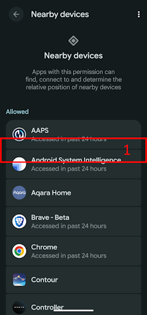

3. Per mostrare le app di sistema nascoste premi sulle **Tre linee puntate (Hamburger) (1)**, poi premi su **"Mostra sistema (1)"**. Ora dovresti essere in grado di vedere l'app di sistema nascosta nell'elenco **Android Auto (3)**.

```{admonition} Find your app
:class: tip
Se un'app è stata revocata, dovrai scorrere verso il basso finché non vedi l'elenco delle app revocate più in basso nell'elenco.
```

   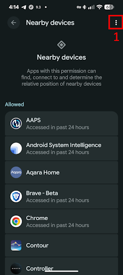 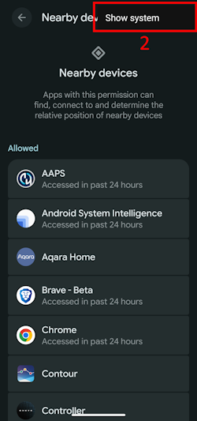 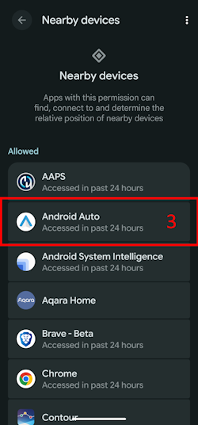

5. Segui le istruzioni in **"Come revocare i permessi 'Dispositivi nelle vicinanze' per altre app"** al contrario per riabilitare i permessi per ogni app.

---

(bluetoothtroubleshooting-android-15-bluetooth-connection-problems)=

## Android 15 - Frequenti problemi di connessione Bluetooth

Dopo aver aggiornato Android o aver cambiato telefono, **AAPS** perde frequentemente la connessione Bluetooth con il microinfusore. Il problema scompare temporaneamente riavviando il telefono. If the phone runs Android 15. Se il telefono usa Android 15, abilitare l'impostazione **Collega dispositivo BT su Android 15+** nelle impostazioni di **AAPS** potrebbe aiutare a migliorare la stabilità delle connessioni Bluetooth; segui la guida di seguito per abilitarla:

```{admonition} Android 16
:class: warning
Abilita l'opzione **Collega dispositivo BT su Android 15+** solo su Android 15 e solo se riscontri problemi di connettività. NON abilitare l'opzione di collegamento su Android 16.
```

1) **Apri le preferenze** cliccando sul menu a tre punti in alto a destra della schermata principale.

   

2. Scorri verso il basso e apri il sottomenu **Segnali acustici di conferma** / **Avanzate**. Abilita **Collega dispositivo BT su Android 15+**.

   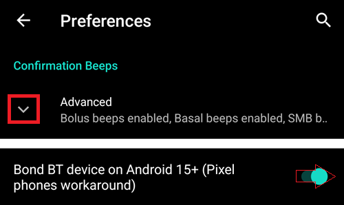


3. If the pump asks for a pairing request, accept it.

4. Riavvia il telefono.
