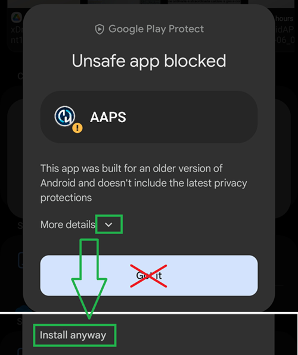
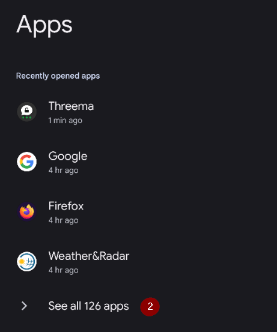
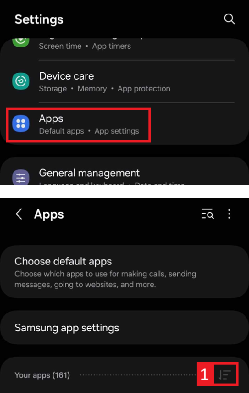
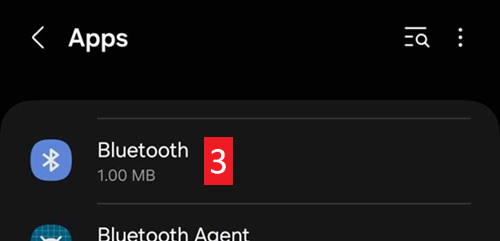
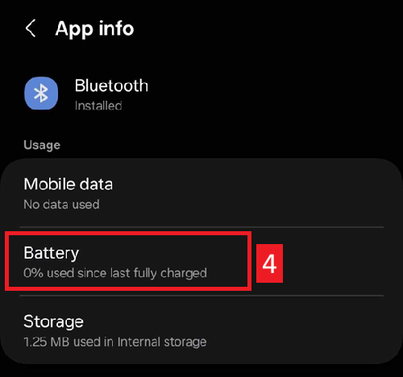
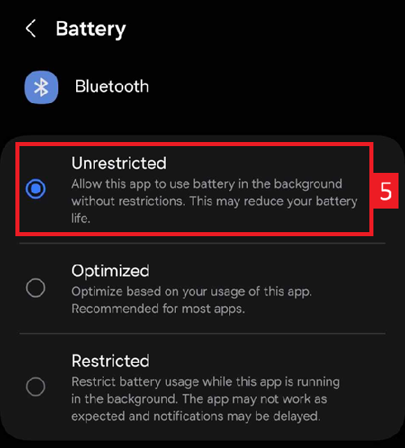

(generaltroubleshooting)=

# **Risoluzione dei problemi**

Puoi trovare informazioni sulla risoluzione dei problemi in molte pagine del wiki. Questa pagina è una raccolta di link per aiutarti a trovare le informazioni per risolvere il tuo problema per vari problemi noti.

Ulteriori informazioni utili potrebbero essere disponibili anche nelle [FAQ](../UsefulLinks/FAQ.md).

---

(generaltroubleshooting-aaps-app)=

## **App AAPS**

### **Compilazione e aggiornamento**

* [Chiave persa](#troubleshooting_androidstudio-lost-keystore)
* [Risoluzione dei problemi di AndroidStudio](TroubleshootingAndroidStudio)

### **Installazione**

Potresti vedere un avviso di Google Play Protect che indica che l'app non è sicura, è stata sviluppata per versioni precedenti di Android e non include le protezioni della privacy più recenti.

Ignoralo: Maggiori dettagli, Installa comunque.

### **Impostazioni**
* Profilo

  

* [Pump - data from different pump](#update30-failure-message-data-from-different-pump)

  

* [Nightscout Client](../GettingHelp/TroubleshootingNsClient.md)

### **Utilizzo**
* [Valori carboidrati errati](#CobCalculation-detection-of-wrong-cob-values)

   

* [Comandi SMS](#SMSCommands-troubleshooting)

---

(generaltroubleshooting-bluetooth-related-issues)=

## **Problemi relativi al Bluetooth**

Per problemi noti con le connessioni Bluetooth, disconnessioni del microinfusore/pod o problemi di attivazione e connessione [Risoluzione dei problemi Bluetooth](../GettingHelp/BluetoothTroubleshooting.md)

---

(generaltroubleshooting-android-related-issues)=

## **Problemi relativi ad Android**

### **Ottimizzazione della batteria**

Android ha implementato impostazioni di risparmio batteria abilitate per impostazione predefinita. Queste impostazioni sospendono/mettono in pausa automaticamente le applicazioni non necessarie per il funzionamento del sistema, per ridurre il consumo della batteria da parte delle app che non devono essere sempre in esecuzione.

Quando è abilitata, ciò causerà molto probabilmente problemi a **AAPS** e ad altre app di supporto come **xDrip+**.

È importante assicurarsi di aver disabilitato l'ottimizzazione della batteria per garantire che **AAPS** e le altre app di supporto rimangano sempre attive.

A seconda del modello e del produttore del tuo telefono, potrebbe esserci più di un'impostazione che deve essere disabilitata.

***NOTA:** Segui i passaggi seguenti per disabilitare l'ottimizzazione della batteria per il servizio Bluetooth se il tuo telefono ha questa opzione; gli stessi passaggi possono essere usati per disabilitarla per **AAPS** e altre app, tuttavia gli screenshot mostrano solo come farlo per il servizio Bluetooth.*

#### **Telefoni Pixel (Android stock)**

* Vai alle impostazioni Android, seleziona "App".

  

* Seleziona "Vedi tutte le app"

  

* Nel menu a destra, seleziona "Mostra le app di sistema".

  

* Ora cerca e seleziona l'app "Bluetooth".

  

* Clicca su "Utilizzo batteria dell'app" e seleziona "Non ottimizzata".

  

#### **Telefoni Samsung**

* Vai alle impostazioni Android, seleziona "App"

* Sull'icona che presumibilmente cambia l'algoritmo di ordinamento (1), seleziona "Mostra app di sistema" (2).

  

  

* Ora cerca l'app Bluetooth e selezionala per vedere le sue impostazioni.

  

* Seleziona "batteria".

  

* Impostala su "Non ottimizzata"

  

#### **Telefoni Huawei**

Consulta questa guida per [Huawei bluetooth e ottimizzazione batteria](../CompatiblePhones/Huawei.md)

---

(generaltroubleshooting-cgm)=

## **Monitor Continuo del Glucosio (CGM)**

Link utili a problemi noti e passaggi per la risoluzione per i CGM.

* [Generale](#general-cgm-troubleshooting)
* [Dexcom G6](#DexcomG6-troubleshooting-g6)
* [Libre 3](#libre3-experiences-and-troubleshooting)
* [xDrip - nessun dato CGM](#xdrip-identify-receiver)
* [xDrip - Risoluzione problemi Dexcom](#xdrip-troubleshooting-dexcom-g5-g6-and-xdrip)

---

(generaltroubleshooting-pumps)=

## **Pumps**

Link utili a problemi noti e passaggi per la risoluzione per i microinfusori

* [DanaRS](#DanaRS-Insulin-Pump-dana-rs-specific-errors)
* [Accu-Chek Combo generale](../CompatiblePumps/Accu-Chek-Combo-Tips-for-Basic-usage.md)
* [Accu-Chek Insight](#Accu-Chek-Insight-Pump-insight-specific-errors)
* [Medtronic + RileyLink](#MedtronicPump-what-to-do-if-i-loose-connection-to-rileylink-and-or-pump)

---

(generaltroubleshooting-phones)=

## **Telefoni**

Link utili a problemi noti e passaggi per la risoluzione per i telefoni

* [Elenco di telefoni e configurazioni di dispositivi testati](https://docs.google.com/spreadsheets/u/1/d/e/2PACX-1vScCNaIguEZVTVFAgpv1kXHdsHl3fs6xT6RB2Z1CeVJ561AvvqGwxMhlmSHk4J056gMCAQE02sAWJvT/pubhtml?gid=683363241&single=true)
* [Jelly](../CompatiblePhones/Jelly.md)
* [Huawei bluetooth e ottimizzazione batteria](../CompatiblePhones/Huawei.md)

(generaltroubleshooting-smartwatches)=

## Smartwatch

Link utili a problemi noti e passaggi per la risoluzione per gli smartwatch

* [Risoluzione problemi app Wear](#Watchfaces-troubleshooting-the-wear-app)
