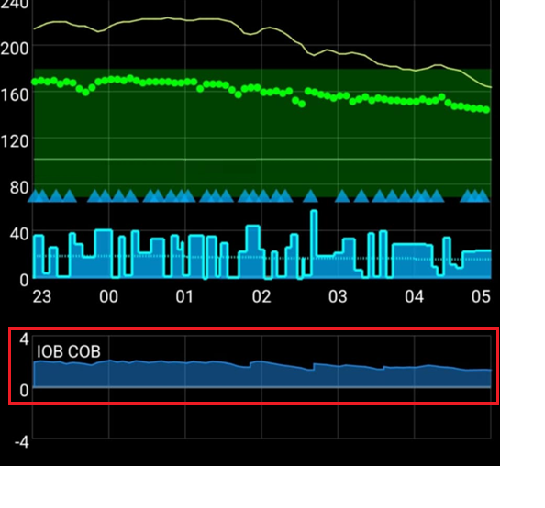
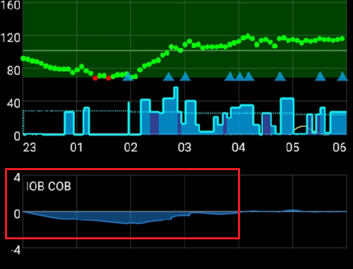
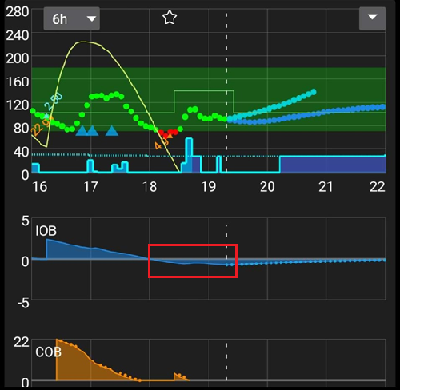
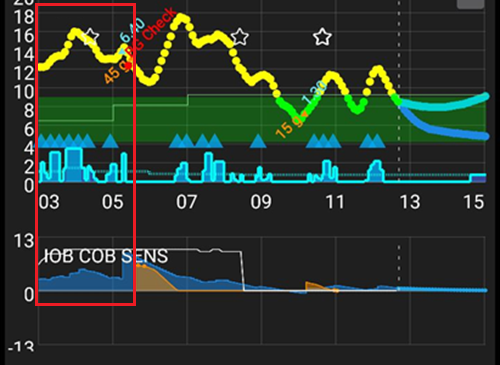
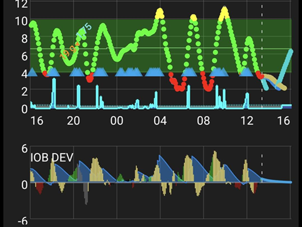
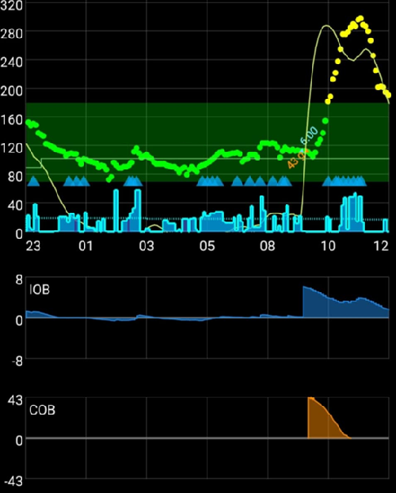

# **Ottimizzare il Profilo di AAPS**

```{admonition} This is NOT a medical advice
:class: warning
Collabora con il tuo team di cura per supporto e consigli sulla gestione del diabete.</br>
Usa questa guida solo dopo aver [configurato correttamente il tuo **Profilo**](https://androidaps.readthedocs.io/en/latest/SettingUpAaps/YourAapsProfile.md), seguendo tutti gli obiettivi di **AAPS**.
```

Questa guida spiega la logica dei risultati dell'algoritmo OpenAPS con un dato __Profilo__ e fornisce informazioni su quali valori regolare quando vengono osservate determinate situazioni. I suggerimenti sul test della basale di seguito potrebbero differire da quelli consigliati dal tuo team di cura.

L'uso del **circuito chiuso** può rendere più facile il test della basale e può ridurre significativamente il rischio di ipoglicemia se la basale del tuo __Profilo__ è troppo forte.

## **Modificare le impostazioni del profilo: come procedere**

1. Assicurati di aver letto e compreso le impostazioni e i consigli raccomandati di __AAPS__ qui sotto. Non seguire questi consigli renderà l'intero processo problematico e meno probabile che tu ottenga un __Profilo__ ben calibrato.
2. Osserva e confronta attentamente, **per diversi giorni**, cosa succede con la tua __glicemia__ e il tuo __IOB__.
3. Tieni d'occhio i modelli che si ripetono quasi ogni giorno alla stessa ora.
4. È importante farlo per diversi giorni. I risultati scadenti tendono a derivare dall'uso di dati osservati in un singolo giorno per prendere decisioni di regolazione del __Profilo__.
5. Dopo aver osservato un modello di comportamento ripetibile, ad esempio all'1:00 PM vedi un picco della __glicemia__ o un valore __IOB__ negativo, solo allora inizia ad apportare piccole modifiche al tuo __Profilo__.
6. È importante limitare le modifiche a una cosa alla volta. E.g. E.g. E.g. E.g. E.g. increase your basal by 10% around 1PM.
7. Dopo ogni modifica, è importante monitorare l'impatto sulla tua __glicemia__ e __IOB__ per i giorni successivi.
8. Ripeti questo schema: osserva, decidi, aggiusta di nuovo se necessario.

Non avere fretta, vai piano!

## **Impostazioni consigliate e consigli durante l'ottimizzazione della basale**

- Fai tutti i test con il [circuito chiuso abilitato](#AapsScreens-loop-status).
- **Disattiva <u>TUTTE</u> le [automazioni](../DailyLifeWithAaps/Automations.md)**
- **Disattiva <u></u> [DynISF](#Open-APS-features-DynamicISF), [AutoISF](../AdvancedOptions/DevBranch.md), [AutoSens](#Open-APS-features-autosens)** in modo che non cerchino di adattare il tuo profilo.
- Non eseguire azioni manuali (bolo manuale, obiettivi temporanei ecc...) durante i test: lascia che il sistema usi solo le impostazioni del **Profilo**.
- Per i [grafici aggiuntivi](#AapsScreens-section-g-additional-graphs): nel grafico 1, usa IOB, COB (e variazione della sensibilità). Nel grafico 2, usa Deviazioni e Impatto della glicemia. Quando chiedi consiglio, includi sempre questi nelle tue screenshot.
- COB=0[*](#profiletuning-cob-zero)
- Nessuna attività fisica.
- Nessuno stress.
- Nessuna malattia.
- Nessuna temperatura estrema (né alta né bassa).
- Se il tuo [profilo basale](#your-aaps-profile-basal-rates) è corretto, quando sei in target con COB=0[*](#profiletuning-cob-zero) e IOB=0, rimarrai costantemente in target indipendentemente dal tuo ISF (l'ISF viene utilizzato solo quando sei sopra il target).
- Devi controllare l'IOB effettivo ma anche il grafico dell'IOB per vedere come era l'IOB nelle ultime ore.

(profiletuning-cob-zero)=

***COB = 0**

Significa che il pasto è stato digerito e non ci sono più carboidrati nel corpo.

AAPS potrebbe indicare [COB=0 mentre hai ancora carboidrati attivi](../DailyLifeWithAaps/CobCalculation.md).

## **Definizioni del [Profilo](../SettingUpAaps/YourAapsProfile.md)**

Un **Profilo troppo aggressivo** indica una combinazione dei seguenti elementi:

- Il valore [ISF](#your-aaps-profile-insulin-sensitivity-factor) è troppo basso
- Il valore [basale](#your-aaps-profile-basal-rates) è troppo alto
- Il valore [I:C](#your-aaps-profile-insulin-to-carbs-ratio) è troppo basso

## **Osservazioni sull'IOB**

*Nota: puoi anche usare il grafico IOB di Loopalyzer nei report di Nightscout per visualizzare l'IOB su più giorni.*

Se osservi i seguenti modelli dopo alcuni giorni, considera le seguenti modifiche.

### **IOB positivo**

- La basale del **Profilo** potrebbe non essere abbastanza forte (questo potrebbe anche essere dovuto a cose come cibo non annunciato, malattia, cattivo assorbimento del sito, ecc.)



### **IOB negativo**

- Basale predefinita troppo forte
- Potrebbe essere l'effetto di esercizio fisico/attività precedente



- Pasto precedente: bolo eccessivo (che ha causato una basale temporanea zero molto lunga)



## **Osservazioni sull'obiettivo glicemico**

### **Stuck High**

- Il valore dell'__ISF__ è alto e non abbastanza forte (l'insulina calcolata è troppo debole)



- La basale del __Profilo__ potrebbe non essere abbastanza forte (gli SMB non hanno abbastanza "riserva basale" da usare)
- Una sicurezza ([MaxIOB](#Open-APS-features-maximum-total-iob-openaps-cant-go-over)?) potrebbe essere intervenuta e sta limitando l'iniezione di insulina. Verifica nella scheda [SMB](#Open-APS-features-super-micro-bolus-smb).
- Problema tecnico: assorbimento del sito, set di infusione, ...

### **Bloccato in basso (Stuck Low)**

- L'__ISF__ è troppo forte e il valore deve essere aumentato
- La basale del __Profilo__ è troppo forte (se anche l'IOB è negativo)

### **Altalenante (Rollercoaster)**

- L'**ISF** è troppo forte? Controlla il tuo [Profilo AAPS](#your-aaps-profile-insulin-sensitivity-factor)



## **Osservazioni sulla glicemia dopo i pasti**

### **Fast rise and BG going high**

- Il cibo contiene carboidrati ad assorbimento rapido
- Considera un pre-bolo
- Il bolo (IC o % iniettata) non è abbastanza forte



### **Fast rise and then BG going low**

- Considera un pre-bolo; il profilo potrebbe essere troppo aggressivo (correzione eccessiva della salita)
- Il bolo è troppo forte


## **[Come calcolare il tuo I:C](#your-aaps-profile-insulin-to-carbs-ratio)**

1. Prima di tutto, hai bisogno delle impostazioni basali predefinite corrette nel tuo **Profilo**.
2. Inizia in target, preferibilmente senza IOB negativo.
3. Registra l'insulina totale somministrata nella scheda microinfusore (o nella cronologia del microinfusore) e chiamala Insulina iniziale C4. Misura con molta precisione una porzione nota di carboidrati e registra l'ora di inizio e l'IOB iniziale. Poi inserisci i carboidrati e le informazioni sul bolo in AAPS usando il wizard (con il CI attualmente configurato). Non dimenticare di mangiare i carboidrati ;)
4. Dopo alcune ore, quando COB=0[*](#profiletuning-cob-zero) e sei tornato in target, registra l'ora di fine e annota l'IOB finale; controlla l'insulina totale somministrata come prima e chiamala Insulina finale. *NOTA: l'arco temporale NON è importante, purché sia più lungo della tua digestione*
5. Dalla differenza tra la quantità di Insulina iniziale e finale, sottrai/aggiungi la differenza IOB finale - IOB iniziale. Poi sottrai l'insulina basale calcolata dalle impostazioni del tuo profilo.
6. Se la __glicemia__ è in target, avrai l'insulina totale usata per "digerire" i tuoi carboidrati. Calcola il tuo **I:C**.

### **Spiegazioni per i calcoli I:C**

- Con un **Profilo** che ha la frequenza basale predefinita corretta, durante qualsiasi arco temporale, dovresti rimanere in target e avere un IOB vicino a 0. Ricevi solo la tua basale del **Profilo**.
- Aggiungi carboidrati e bolo a questo mix. Aspetta che il tuo corpo digerisca tutti i carboidrati e torni al target della **glicemia**. Il tuo consumo di insulina sarà la somma della tua basale + l'insulina necessaria per i carboidrati. Calcoli l'insulina usata per la tua basale (usando il tuo **Profilo**) e il surplus sarà l'insulina usata per digerire i carboidrati.
- Se l'arco temporale è troppo breve, ci saranno carboidrati non digeriti, quindi il tuo "insulina necessaria per i carboidrati" sarà errato.
- Se l'arco temporale è troppo lungo, non succede nulla di grave. Userai tutti i tuoi carboidrati e riceverai più basale. Alla fine, sottrarrai la basale dall'insulina totale usata; l'arco temporale esteso (con più uso di basale) non influirà sul risultato.

Originariamente scritto da @Robby (Discord) su suggerimenti e trucchi per aiutare a ottimizzare il tuo Profilo AAPS, revisionato e modificato dalla community (grazie!).
