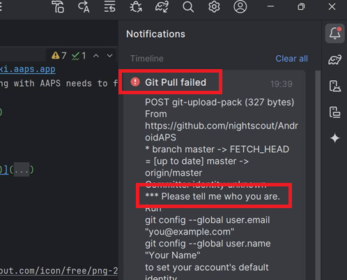
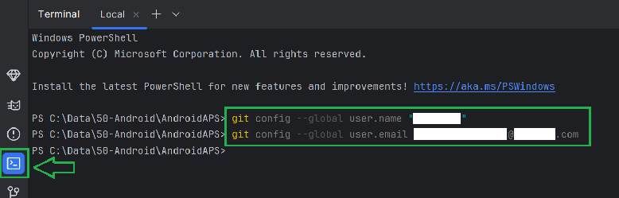

(troubleshooting_androidstudio-troubleshooting-android-studio)=

# Risoluzione dei Problemi Android Studio

```{contents} List of common issues
:depth: 2
:local: true
```

(troubleshooting_androidstudio-lost-keystore)=
## Chiave persa
Se utilizzi la stessa chiave (keystore) durante l'aggiornamento di **AAPS** non è necessario disinstallare la versione precedente sullo smartphone. Ecco perché è consigliato memorizzare la chiave in un luogo sicuro.

Se provi a installare l'apk, firmato con una chiave diversa, avrai un messaggio di errore che spiega che l'installazione è fallita!

Nel caso in cui non sia possibile rintracciare la tua chiave originale o la password, procedi come segue:

1. [Esporta le impostazioni](../Maintenance/ExportImportSettings.md) sul tuo telefono.
2. Copia o carica il file delle impostazioni dal telefono in una postazione esterna (un computer, un servizio di cloud...).
4. Genera una nuova versione dell'apk firmato come descritto nella guida [Aggiornamento ](../Maintenance/UpdateToNewVersion) e trasferiscila sul tuo telefono.
5. Disinstalla la versione **AAPS** precedente sul tuo telefono.
6. Installa la nuova versione **AAPS** sul tuo telefono.
7. [Importa le impostazioni](#ExportImportSettings-restoring-from-your-backups-on-a-new-phone-or-fresh-installation-of-aaps) per ripristinare gli obiettivi e la configurazione.

   Se non riesci a trovarle sul tuo telefono, copiale dalla memoria esterna al tuo telefono.

8. Controlla le opzioni di ottimizzazione della batteria e disabilitale di nuovo.
9. Continua con il tuo circuito chiuso.

## Gradle Sync failed
Gradle Sync può fallire per vari motivi. Se ricevi un messaggio che dice 'gradle sync failed', apri la scheda "Build" (1) nella parte inferiore di Android Studio e controlla quale messaggio di errore (2) viene visualizzato.


```{contents} Likely reasons for gradle sync failures are:
:depth: 1
:local: true
```

*Importante*: Dopo aver seguito le istruzioni per il tuo problema, devi attivare nuovamente la sincronizzazione del [gradle](#gradle-resync).

(troubleshooting_androidstudio-uncommitted-changes)=
### Uncommitted changes

Se ricevi un messaggio di errore come questo:


```
Build file 'C:\Data\50-Android\AndroidAPS\app\build.gradle.kts' line: 243

There are uncommitted changes.
Clone sources again as described in wiki and do not allow gradle update
```

#### Passo 1 - Controlla l'installazione di Git
  * Apri la scheda del terminale (1) nella parte inferiore di Android Studio e copia/incolla (o digita) il testo sotto, nel terminale.
    ```
    git --version
    ```

    

    Nota: C'è uno spazio e due trattini tra git e version!

  * Devi ricevere un messaggio che dica quale versione di Git è installata, come puoi vedere nella schermata sopra. In questo caso, vai al [Passo 2](#troubleshooting-android-studio-check-for-uncommitted-changes).

  * Se ottieni un messaggio che dice
    ```
    Git: command not found
    ```
    la tua installazione Git non è corretta.

  * [Controlla l'installazione di Git](#BuildingAaps-steps-for-installing-git)

  * se hai appena installato Git su Windows, devi riavviare il computer per rendere Git disponibile a livello globale

  * Se Git è installato, il computer è stato riavviato (con Windows), e Git non è ancora stato trovato:

  * Cerca nel tuo computer un file "git.exe".

    Segna per te stesso in quale directory viene salvato.

  * Vai alle Variabili di Ambiente in Windows, seleziona la variabile "PATH" e fai clic su modifica. Aggiungi la cartella in cui hai trovato la tua installazione di Git.

  * Salva e chiudi.

  * Riavvia Android Studio.

(troubleshooting-android-studio-check-for-uncommitted-changes)=
#### Passo 2: Controlla le modifiche senza commit

  * In Android Studio, apri la scheda 'Commit' (1) sul lato sinistro. 
  * Puoi vedere "Default changeset" (2) oppure "Unversioned files" (3):

    * Per "Default changeset", probabilmente hai aggiornato 'Gradle' o cambiato alcuni contenuti del file per errore.

    * Fai clic con il tasto destro su "Default Changeset" e seleziona "Rollback"

      

    * I file vengono recuperati nuovamente dal server Git. Se nella scheda commit non ci sono altre modifiche, vai al [Passo 3](#gradle-resync).

  * Se vedi "Unversioned Files", potresti avere dei file memorizzati nella directory del codice sorgente per errore. Forse sono file importanti: come il tuo file keystore, che dovrebbe essere spostato altrove. Se non sai cosa sono questi file e non li hai creati te, puoi eliminarli.

    * Usa il gestionario di file (explorer) sul tuo computer per spostare o tagliare e incollare quei file in un luogo sicuro.

    * Torna a Android Studio e fai clic sul pulsante Aggiorna (4) all'interno della scheda Commit per assicurarti che il file non sia più memorizzato nella cartella **AAPS**.

      Se non ci sono altre modifiche nella scheda Commit, vai al [Passo 3](#gradle-resync).


#### Passo 3: Risincronizza Gradle (ancora)

Segui le istruzioni di [Risincronizza Gradle](#gradle-resync).

### Git Pull Fallito - Please tell me who you are

Se vedi questo messaggio, Git ha bisogno che ti identifichi te stesso.



Apri il terminale e digita i due comandi seguenti, uno dopo l'altro.

```
git config --global user.name "Il tuo nome qua"
git config --global user.email la-tua.mail@qua.com
```

Il tuo nome deve essere scritto tra virgolette.



(troubleshooting_androidstudio-android-gradle-plugin-requires-java-11-to-run)=

(incompatible-gradle-jvm)=
### Incompatible Gradle JVM


```
Your build is currently configured to use incompatible Java 21.0.3 and Gradle 8.2.
Cannot sync the project.

We recommend upgrading to Gradle version 8.9.

The minimum compatible Gradle version is 8.5.

The maximum compatible Gradle JVM version is 19.
```

Or:

```
Cause: error: invalid source release: 21
```

Se vedi il messaggio di errore sopra, devi scaricare la versione corretta di JVM prima di riprovare a ricostruire:

1.  Controlla nella [tabella dei prerequisiti](#Building-APK-recommended-specification-of-computer-for-building-apk-file) la versione JVM necessaria per la versione **AAPS** che stai costruendo, e prendine nota.

2. Apri la scheda Gradle cliccando sull'elefante (1) sul lato destro di Android Studio, apri le impostazioni (2) e seleziona **Gradle Settings** (3):


3.  In **Gradle JDK** field, check if the appropriate version is selected (1) If not, click on the field, and see if it is already available in the list. L’esempio seguente mostra che JVM 21 è segnato “jbr-21”. Se lo trovi, basta selezionarlo, e hai finito. Se non è disponibile, selezionare 'Scarica JDK'.


4. In Version (1), seleziona il JDK richiesto per la tua versione **AAPS** (quella che ti sei segnata quando hai controllato la tabella dei requisiti). In Vendor (2) select any Vendor. Location (3): non modificare.


5.  Chiudi la finestra di dialogo **Settings** con **OK**.
6. Ora è necessario riavviare la sincronizzazione di Gradle. Segui le istruzioni di [Risincronizza Gradle](#gradle-resync).

(incompatible-version-of-android-gradle-plugin)=
### Versione incompatibile del plugin di Android Gradle

  Se vedi questo messaggio di errore

`The project is using an incompatible version (AGP x.x.x) of the Android Gradle plugin. Latest supported version is AGP x.x.x`

  

  Stai usando una versione obsoleta di Android Studio. Nel menu, vai a Help > Check for updates e installa gli aggiornamenti di Android Studio e di tutti i plugin che vengono trovati.

(troubleshooting_androidstudio-could-not-resolve-no-cached-version)=
### Could not resolve/No cached version

  Potresti ricevere questo messaggio di errore:


  * Sul lato destro, apri la scheda Gradle (1).

    Assicurati che il pulsante visualizzato su (2) *NON* sia selezionato.

    

  * Ora devi attivare [Risincronizza Gradle](#gradle-resync)

(troubleshooting_androidstudio-unable-to-start-daemon-process)=
### Unable to start daemon process

  Se vedi un messaggio di errore come quello sotto, probabilmente stai utilizzando un sistema Windows 10 a 32 bit. Non è supportato da Android Studio 3.5.1 e oltre, e purtroppo non c'è nulla che gli sviluppatori **AAPS** possano fare a riguardo!

  There is information on the internet about how to determine whether you have a 32-bit or 64-bit OS - i.e. [this one](https://support.microsoft.com/en-us/windows/32-bit-and-64-bit-windows-frequently-asked-questions-c6ca9541-8dce-4d48-0415-94a3faa2e13d).

  

(gradle-resync)=
### Gradle Resync

  Se vedi ancora il messaggio che la sincronizzazione del Gradle non è riuscita, seleziona il link "Try again". 


  Se non vedi più il messaggio, puoi comunque attivarlo manualmente:

  * Apri la scheda Gradle (1) sul bordo destro di Android Studio.

    

  * Clicca col tasto destro su AAPS (2)

  * Clicca su "Reload Gradle Project" (3)

## Generate Signed APK generated successfully with 0 build variants

Quando generi l'apk firmata, potresti avere la notifica che è stata creata correttamente ma che '0 varianti di generazione' sono stati generati:


Questo è un falso allarme. Controlla la cartella selezionata come "Destination folder" (passo [Genera APK Firmato](#Building-APK-generate-signed-apk)) e troverai l'apk generato lì!


## L'app è stata creata con dei warning compilatore/kotlin

Se la tua build è completata con successo ma ottieni avvisi compilatore o kotlin (indicati da un punto esclamativo giallo o blu) allora puoi semplicemente ignorare questi avvertimenti.

 

Il tuo apk è stato costruito con successo e può essere trasferito sul tuo telefono!


## Nessun dato sensore CGM è ricevuto da AAPS

* Se stai usando l'app patchata Dexcom G6: questa app è obsoleta. Usa invece l'app [BYODA](#DexcomG6-if-using-g6-with-build-your-own-dexcom-app).

* Se usi xDrip+: identifica il ricevitore come descritto nella pagina delle [impostazioni xDrip+](#xdrip-identify-receiver).


## Apk non installato


* Assicurati di aver trasferito il file “app-full-release.apk” sul tuo telefono.
* Se vedi "App non installata" sul tuo telefono, segui questi passaggi:

1. [Esporta le impostazioni](../Maintenance/ExportImportSettings.md) (nella versione AAPS già installata sul tuo telefono)
2. Disinstalla **AAPS** dal tuo telefono.
3. Abilita la modalità aereo & disattiva il bluetooth.
4. Installa la nuova versione (“app-full-release.apk”)
5. [Importa le impostazioni](../Maintenance/ExportImportSettings.md)
6. Riattiva il bluetooth e disabilita la modalità aereo

## Apk installato ma versione vecchia

Se hai creato l'app con successo, trasferita sul tuo telefono e installata con successo, ma il numero di versione rimane lo stesso allora potresti aver dimenticato di [aggiornare la tua copia locale](#Update-to-new-version-update-your-local-copy)

## Niente di quello suggerito ha funzionato

Se nessuno dei suggerimenti sopra ti ha aiutato, considera ricostruire l'apk da zero:

1. [Esporta le impostazioni](../Maintenance/ExportImportSettings.md) (nella versione AAPS già installata sul tuo telefono)

2. Prepara la password della chiave e la password dell'archivio della chiave (keystore). Se hai dimenticato le password, puoi provare a trovarle nei file del progetto come descritto [qui](https://youtu.be/nS3wxnLgZOo).

    Oppure usa una nuova chiave (nuovo keystore).

3. Costruisci l'apk da zero come descritto [qui](#Building-APK-download-AAPS-code).

4. Dopo aver costruito l'apk, elimina quello esistente dal telefono, trasferisci il nuovo apk sul telefono e installalo.
5. [Importa le impostazioni](../Maintenance/ExportImportSettings.md), di nuovo, per ripristinare gli obiettivi e le impostazioni.
6. Controlla le opzioni di ottimizzazione della batteria e disabilitale di nuovo.

## Scenario peggiore

Niente di quello suggerito sopra risolve il problema di build, puoi provare a disinstallare completamente Android Studio e ricostruire da zero.  Alcuni utenti trovano che questo può risolvere il loro problema di compilazione.  Quando disinstalli Android Studio, non eliminare le impostazioni utente Android e **Assicurati di disinstallare tutti i file associati con Android Studio.** Se non rimuovi completamente Android Studio e tutti i file nascosti, la disinstallazione può causare nuovi problemi invece di risolvere quelli esistenti. I manuali per la disinstallazione completa possono essere trovati online ad es.

[https://stackoverflow.com/questions/39953495/how-to-completely-uninstall-android-studio-from-windowsv10](https://stackoverflow.com/questions/39953495/how-to-completely-uninstall-android-studio-from-windowsv10).

Installa Android Studio da zero come descritto [qui](#Building-APK-install-android-studio).
