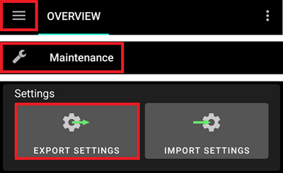
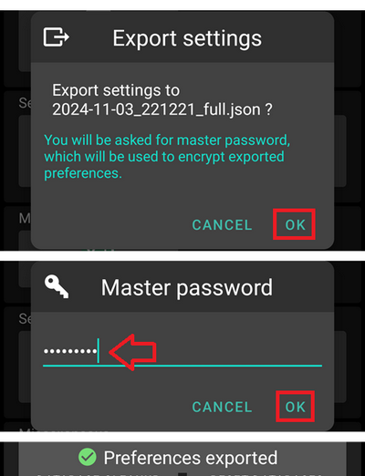
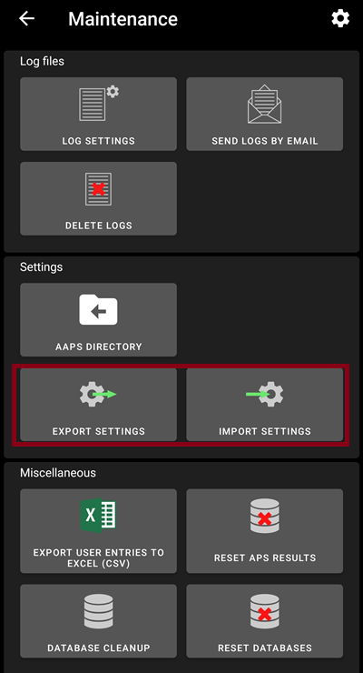
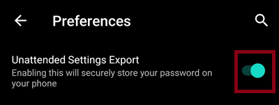
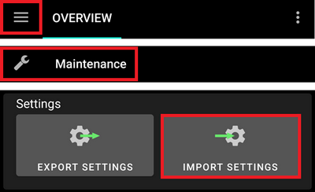
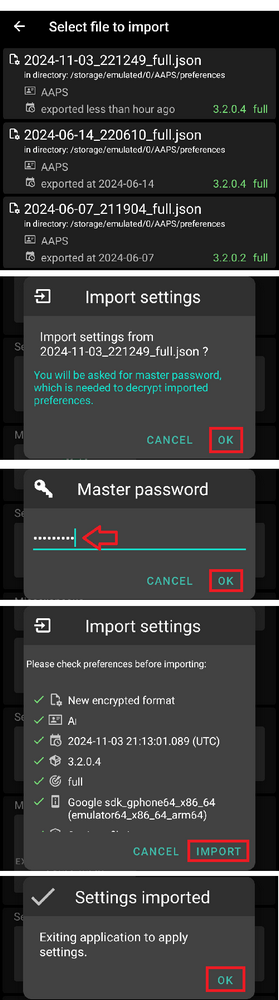

# Creare e ripristinare i backup

Quando installi AAPS sul tuo telefono, diventa un "dispositivo medico" dal quale dipendi ogni giorno. È fortemente raccomandato avere un piano di emergenza per quando il telefono si guasta, viene rubato o smarrito. Pertanto, è essenziale prepararsi chiedendosi: "E se...?

Per ripristinare la configurazione di AAPS su un telefono esistente o nuovo, è importante conservare i seguenti elementi in un luogo sicuro (non sul tuo telefono). La buona pratica è mantenere almeno due backup separati: su un hard disk locale, una chiavetta USB e (preferibilmente) su un archivio cloud come Google Drive o Microsoft 365 OneDrive. Archiviando i backup nel cloud avrai sempre tutto il necessario accessibile dal tuo telefono per ripristinare la configurazione ovunque e in qualsiasi momento.

Prendi in considerazione l'acquisto di un telefono di riserva e pratica il ripristino di AAPS per assicurarti che il telefono di riserva funzioni come previsto. Questo passaggio ti darà la certezza che il tuo piano di emergenza sia efficace e che tu possa continuare a utilizzare AAPS senza interruzioni se il tuo telefono principale non è disponibile.

Per poter eseguire il ripristino, è importante avere a portata di mano i seguenti elementi:

- Il tuo **file keystore di Android Studio** e la relativa **password**: Necessari per (ri)costruire il file di installazione .APK di AAPS.
- Una copia recente del **file di installazione .APK di AAPS**
- Un file di **esportazione delle impostazioni** recente: Per ripristinare le impostazioni importanti (che includono i tuoi obiettivi!).
- La tua **password master di AAPS**
- Backup di utility aggiuntive: Come BYODA e/o xDrip+.
- Note personali sulla tua configurazione.

Di seguito sono elencati gli elementi raccomandati per mantenere i backup.

## Creare i backup

### File keystore dal computer usato per costruire l'APK
Quando costruisci il file di installazione .APK da Android Studio, usa il **file keystore e la password per firmare il file di installazione .APK**. Per aggiornare la tua installazione corrente di AAPS, è necessario firmare il file di installazione .APK aggiornato con lo stesso keystore utilizzato per l'installazione iniziale. In fase di aggiornamento, tutte le impostazioni e il database di AAPS verranno mantenuti. Tieni presente che senza questo, dovrai prima disinstallare l'applicazione corrente e poi reinstallare e riconfigurare AAPS.

Mantenere il keystore e la password associata ridurrà notevolmente la complessità dell'aggiornamento dell'APK in futuro, specialmente se hai bisogno di costruire l'app da un nuovo computer. Consulta la sezione [Aggiornare AAPS](../Maintenance/UpdateToNewVersion.md) per i dettagli sull'uso del keystore durante la costruzione di un nuovo APK.

**Quando eseguire il backup:** Il keystore deve essere salvato dopo aver costruito per la prima volta il file di installazione .APK di **AAPS**.

**Come eseguire il backup:** Individua il percorso del tuo keystore. Se non lo ricordi, puoi trovarlo in Android Studio selezionando **Build > APK > Avanti**. Il percorso sarà elencato in "Key store path". Usando il tuo file explorer, naviga fino a questo percorso e fai una copia del file keystore (con estensione `.jks`). Salvalo in un luogo cloud sicuro nel caso in cui il tuo computer non sia disponibile. Assicurati di annotare anche la password del key store, l'alias della chiave e la password della chiave.

### Copie dell'APK più recente
Nel caso in cui il tuo telefono principale con **AAPS** venga perso o danneggiato, avere una copia dell'APK disponibile ti consentirà di riprendere rapidamente a usare **AAPS** con un nuovo telefono. Nota: avrai bisogno anche del backup delle preferenze come indicato di seguito.

**Quando eseguire il backup:** Dovresti mantenere un backup dell'APK più recente che hai installato sul tuo telefono principale con **AAPS**. Potresti voler mantenere anche una versione precedente nel caso in cui tu abbia bisogno di tornare a quella per qualsiasi motivo.

**Come eseguire il backup:** Mantieni una copia sul computer usato per costruire l'APK con Android Studio. Inoltre, è consigliato usare una piattaforma cloud per archiviare una copia dell'APK di installazione. Assicurati di sapere come individuare entrambi i backup quando necessario. Considera di creare cartelle dedicate per archiviare questi backup.

### File delle impostazioni di AAPS (denominato anche 'Preferenze')

```{admonition} Where are preferences stored on my phone?
:class: tip
Troverai le tue impostazioni nella **Directory AAPS** che hai selezionato durante la [configurazione di AAPS](#SetupWizard-StoragePermission).</br>
Puoi anche modificare la **Directory AAPS** in Preferenze > [Impostazioni di manutenzione](#preferences-maintenance-settings).
```

Con una copia del file di installazione APK (vedi sopra) e il tuo file **Impostazioni**, puoi tornare operativo rapidamente su un telefono esistente o nuovo.

Il file **Impostazioni** viene usato per personalizzare l'applicazione AAPS in base alla tua configurazione specifica. Comprende dettagli come le impostazioni del generatore di configurazione, lo stato degli obiettivi, le impostazioni di comunicazione di terze parti (es. Nightscout, Tidepool), le automazioni e i profili.

L'esportazione delle impostazioni di AAPS su file ti permette di ripristinare la sua configurazione a un punto specifico nel tempo. Come accennato, oltre a tutte le impostazioni di configurazione, il file di esportazione contiene anche lo stato dei tuoi obiettivi, che devi ripristinare quando **(re)installi** AAPS. Senza questo, dovrai ricominciare tutti gli obiettivi dall'inizio per abilitare il circuito chiuso. I file delle impostazioni ti permettono anche di ripristinare le ultime impostazioni "funzionanti" per annullare eventuali modifiche alla configurazione.

**Quando eseguire il backup delle impostazioni di AAPS:**
* Ogni volta che completi un obiettivo per evitare di perdere i progressi. _Senza una copia delle tue **Impostazioni**, dovrai completare tutti gli obiettivi di nuovo nel caso in cui tu debba reinstallare AAPS o sostituire il telefono._

* Ogni volta che prevedi di apportare modifiche significative alla tua configurazione (modifica delle impostazioni SMB, modifica dei tipi di insulina, modifica del microinfusore, modifiche alle automazioni) dovresti fare il backup delle tue **Impostazioni** prima e dopo aver apportato le modifiche. In questo modo avrai le impostazioni più recenti e una copia di quelle precedenti alle modifiche nel caso in cui tu debba ripristinarle.

* Solo per gli utenti di microinfusori tubeless (come Omnipod e Medtrum): il file **Impostazioni** contiene i dettagli di connessione al pod corrente e può essere usato per ripristinare la connessione a quel pod con un nuovo telefono. Se non hai una copia delle preferenze esportata dopo aver avviato il tuo pod corrente, dovrai avviare un nuovo pod nel caso in cui tu debba sostituire il tuo telefono corrente.

**Come eseguire il backup manualmente:**

1. Se è la prima volta che importi o esporti le **Impostazioni**, dovrai impostare una password master in [Preferenze > Generale > Protezione](#Preferences-master-password). Imposta una password e annotala in un posto sicuro. _Non potrai accedere ai backup delle tue **Impostazioni** senza questa password._

2. Dalla schermata principale di **AAPS**, seleziona il menu a tre linee (hamburger) in alto a sinistra > Manutenzione > Esporta impostazioni > digita la password master impostata sopra > Ok

 

3. Usando il file explorer sul tuo telefono (comunemente chiamato "File" o "I miei file") naviga in Archiviazione interna > AAPS > preferenze. Qui vedrai una copia di tutti i file delle preferenze esportati. Il nome del file dovrebbe essere `AAAA-MM-GG_Ora_nomeapp.json`. Carica questo file sulla piattaforma cloud che preferisci. Poi dalla piattaforma cloud, scarica anche una copia sul tuo computer locale.

(ExportImportSettings-Settings-Export)=

## Esportazione delle impostazioni

```{admonition} Where are preferences stored on my phone?
:class: tip
Troverai le tue impostazioni nella **Directory AAPS** che hai selezionato durante la [configurazione di AAPS](#SetupWizard-StoragePermission).</br>
Puoi anche modificare la **Directory AAPS** in Preferenze > [Impostazioni di manutenzione](#preferences-maintenance-settings).
```

Si raccomanda di eseguire esportazioni regolari delle impostazioni, specialmente prima e dopo aver apportato modifiche alla configurazione. Puoi scegliere di eseguire le esportazioni **manualmente o (preferibilmente) tramite automazione**. Assicurati di prendere nota della tua password master di AAPS e di eseguire il backup dei file delle impostazioni copiandoli dal telefono, ad esempio, in un archivio cloud.

**Nota**: _Le impostazioni esportate saranno criptate con la tua password master di AAPS: senza la password master usata per l'esportazione non potrai importare il file delle impostazioni!_

### Esportare o importare le impostazioni
Per esportare o importare le impostazioni, usa i **pulsanti di importazione o esportazione** nel **menu di manutenzione** di AAPS



(ExportImportSettings-Automating-Settings-Export)=
### Automatizzare l'esportazione delle impostazioni

Per automatizzare l'esportazione delle impostazioni [(**vedi Automazione**)](../DailyLifeWithAaps/Automations.md#automating-preference-settings-export), abilita l'opzione "**Esportazioni impostazioni non presidiate**" in [Preferenze > Manutenzione](#preferences-maintenance-settings).

Ora puoi configurare un'[Automazione](../DailyLifeWithAaps/Automations.md#automating-preference-settings-export) per esportare le impostazioni, sia regolarmente (_es._ ogni settimana), sia dopo un cambio di pod.

_**Nota:** All'importazione delle impostazioni l'utente deve sempre inserire la password di AAPS!_



(ExportImportSettings-restoring-from-your-backups-on-a-new-phone-or-fresh-installation-of-aaps)=
## Ripristino dai backup su un nuovo telefono o installazione ex-novo di AAPS

```{admonition} Where are preferences stored on my phone?
:class: tip
Troverai le tue impostazioni nella **Directory AAPS** che hai selezionato durante la [configurazione di AAPS](#SetupWizard-StoragePermission).</br>
Puoi anche modificare la **Directory AAPS** in Preferenze > [Impostazioni di manutenzione](#preferences-maintenance-settings).
```

Usa queste istruzioni se hai un backup del tuo APK e delle **Preferenze** che vuoi caricare su un nuovo telefono o se hai dovuto eliminare e reinstallare l'APK sul tuo telefono esistente per qualsiasi motivo.

_Se stai aggiornando **AAPS** usando un APK costruito con lo stesso keystore, non dovresti aver bisogno di seguire questo processo. Tuttavia, si consiglia comunque di creare un backup prima di applicare l'aggiornamento._

Se stai aggiornando **AAPS** dopo aver perso o sostituito il tuo keystore originale (es. usando un nuovo computer senza trasferire il keystore), assicurati di fare il backup di tutte le impostazioni come indicato sopra e poi disinstalla la versione esistente di **AAPS** dal tuo telefono.

Se necessario, [configura il tuo sensore CGM](../Getting-Started/CompatiblesCgms.md) prima dei passaggi elencati di seguito

```{admonition} Tubeless pumps (Omnipod and Medtrum) users
:class: warning
L'importazione di un file **Preferenze** disattiverà il tuo pod corrente se quelle **Preferenze** sono state esportate durante una sessione di pod attivo diversa. 
```

1. Usando la copia di backup del tuo APK, segui le istruzioni per una [nuova installazione](../SettingUpAaps/TransferringAndInstallingAaps.md)

2. Avvia **AAPS** e consenti le autorizzazioni richieste

3. Esci dalla Procedura guidata di configurazione. Importeremo tutte le impostazioni necessarie dalla copia di backup delle **Preferenze**

4. Dalla schermata principale di **AAPS**, seleziona Richiedi e consenti tutte le autorizzazioni elencate in rosso nella parte superiore

5. Dalla schermata principale di **AAPS**, imposta la password master in [Preferenze > Generale > Protezione](#Preferences-master-password) con la stessa password usata con i tuoi backup.

6. Se non l'hai ancora fatto, [imposta la **Directory AAPS**](#preferences-maintenance-settings): dalla schermata principale di **AAPS**, seleziona il menu a tre linee (hamburger) in alto a sinistra > Manutenzione > DIRECTORY AAPS.

7. Dalla schermata principale di **AAPS**, seleziona il menu a tre linee (hamburger) in alto a sinistra > Manutenzione > Esporta impostazioni > digita la password master impostata sopra > Ok. Questo creerà la cartella delle preferenze se non esiste già sul tuo telefono.

8. Scarica il backup del tuo file **Preferenze** dalla tua piattaforma cloud.

9. Usa il tuo file explorer (comunemente chiamato "File" o "I miei file") per spostare il file dai download in `/internal storage/AAPS/preferences` se la tua **Directory AAPS** è impostata su `/internal storage/AAPS`

10. Dalla schermata principale di **AAPS**, seleziona il menu a tre linee (hamburger) in alto a sinistra > Manutenzione > Importa impostazioni > seleziona il file delle preferenze che vuoi ripristinare > Ok > digita la password master impostata sopra > Ok. Assicurati di selezionare il file delle preferenze corretto, tutti i file .json dalla cartella preferenze saranno mostrati.

 

10. **AAPS** si riavvierà automaticamente e dovrebbe poi avere tutte le tue preferenze importate.

11. Solo per gli utenti di microinfusori tubeless (Omnipod e Medtrum) - se le tue **Preferenze** non sono state salvate dallo stesso pod che stai usando attualmente, dovrai avviare un nuovo pod per iniziare l'erogazione di insulina.

**Risoluzione dei problemi:** se non riesci a ottenere un profilo attivo impostato dalla schermata principale di **AAPS**, seleziona il menu a tre linee (hamburger) in alto a sinistra > generatore di configurazione > Microinfusore > passa a Microinfusore Virtuale > poi torna al tipo di microinfusore

### Nota per gli utenti Dana RS

- Poiché le impostazioni di connessione al microinfusore vengono importate, **AAPS** sul tuo nuovo telefono "conosce" già il microinfusore e quindi non avvierà una scansione Bluetooth.
- Esegui manualmente il pairing del nuovo telefono con il microinfusore.