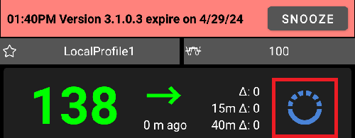
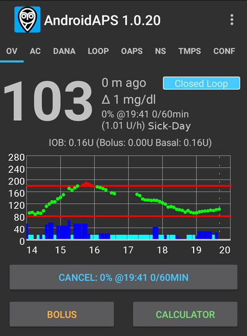

# Note di rilascio

Segui le istruzioni nel [manuale di aggiornamento](UpdateToNewVersion) per aggiornare a una nuova versione. La sezione di risoluzione dei problemi affronta anche le difficoltà più comuni riscontrate durante l'aggiornamento di **AAPS** nella pagina del manuale di aggiornamento.

Riceverai una notifica come questa quando è disponibile un nuovo aggiornamento:



Se non aggiorni entro la data di scadenza **AAPS** passerà al Loop Aperto.

**Non ignorare la notifica.** Le nuove versioni di **AAPS** forniscono importanti correzioni di sicurezza. Pertanto, ogni utente **AAPS** deve aggiornare alla versione più recente il prima possibile. Si tratta di uno sforzo per migliorare la sicurezza di ogni utente **AAPS** e della comunità DIY. Grazie per la comprensione.

(maintenance-android-version-aaps-version)=

## Versione Android e versione AAPS

Se il tuo smartphone utilizza una versione di Android precedente ad Android 12 non potrai usare AAPS v3.4 e successivi poiché richiede almeno Android 12.

Per consentire agli utenti con Android più vecchio di usare versioni precedenti di AAPS sono state pubblicate nuove versioni che modificano solo la verifica della versione. Non sono inclusi altri miglioramenti.

### Android 12 e superiori

- Usa l'ultima versione di AAPS
- Scarica il codice AAPS da <https://github.com/nightscout/AndroidAPS>

### Android 11

- Usa AAPS versione **3.3.2.1**
- Scarica il codice AAPS da <https://github.com/nightscout/AndroidAPS> branch 3.3.2.1

### Android 9, 10

- Usa AAPS versione **3.2.0.4**
- Scarica il codice AAPS da <https://github.com/nightscout/AndroidAPS> branch 3.2.0.4

### Android 8

- Usa AAPS versione **2.8.2.1**
- Scarica il codice AAPS da <https://github.com/nightscout/AndroidAPS> branch 2.8.2.1

### Android 7

- Usa AAPS versione **2.6.2**
- Scarica il codice AAPS da <https://github.com/nightscout/AndroidAPS> branch 2.6.2

## Versione WearOS

- AAPS richiede almeno WearOS API level 30 (Android 11)

```{tip}
WearOS 5, API level 34 (Android 14) ha [limitazioni](#BuildingAapsWearOs-WearOS5).
```

(latestrelease)=

(version3422)=

## Versione 3.4.2.2

- Correzione dei problemi con Equil e Medtronic
- Miglioramento della sicurezza di Medtrum

(version3421)=

## Versione 3.4.2.1

- Equil: correzione del dialogo di abbinamento e progresso @MilosKozak

(version3420)=

## Versione 3.4.2.0

Data di rilascio: 04-02-2026

- Equil: Correzione resistenza per modelli diversi @hhfcvmars
- Tidepool: Correzione sessione @MilosKozak
- Medtrum: Correzione percorso di attivazione prevenendo doppio riempimento @MilosKozak
- COB: Correzione calcolo COB (copre caso limite pericoloso) @MilosKozak

(version3410)=

## Versione 3.4.1.0

Data di rilascio: 03-08-2026

### Core
- Fix DST handling @MilosKozak
- Miglioramento e unificazione dell'identificazione del target normale (mgdl > 99, mmol > 5.5) @MilosKozak
- SMS: protezione RESTART con PIN @MilosKozak
- Manutenzione: avviso se directory sbagliata selezionata @MilosKozak

### Miglioramenti driver microinfusore
- **Omnipod Dash**: refactoring del codice driver BLE nel modulo omnipod/common @jwoglom
- **Omnipod Dash**: tentativo di correzione dello stato di connessione @MilosKozak
- **Omnipod**: validazione del profilo prima dell'attivazione del pod per evitare sprechi di pod (#4534) @brianV
- **Medtronic**: correzione stesso tipo di codifica mostrato nel dialogo delle impostazioni @mifi100
- **Medtronic**: preparazione classi comuni microinfusore (preparazione Tandem) @andy-rozman
- **RileyLink**: correzione codifica (#4519) @mifi100
- **Equil**: espansione compatibilità microinfusore di insulina per prefisso numero seriale (#4510) @hhfcvmars
- **Equil**: aggiunta registrazione @MilosKozak
- **Diaconn G8**: correzione bug sincronizzazione log e aggiunta supporto firmware 3.58+ @miyeongkim
- **Diaconn**: correzione conversione unità durata TBR @miyeongkim
- **Diaconn**: uso commandQueue.loadEvents() per sincronizzazione cronologia @miyeongkim
- Permetti erogazione insulina mentre il loop è sospeso ma il microinfusore è disponibile @cschuijt

### Cloud / Backup
- Aggiunta backup su Google Drive @Angus-repo
- Notifica UI su cambio stato errore storage cloud @Angus-repo
- Permetti sia storage locale che cloud contemporaneamente @Angus-repo

### Tidepool
- Miglioramento migrazione OAuth2 Tidepool @MilosKozak
- Correzione stato BLOCCATO Tidepool indefinito, correzione rifiuto SSID vuoti @michaeln-synapse

### NSClient
- NSCv3: miglioramento riconnessione @MilosKozak

### Wear OS
- Visualizzazione nuovo IOB nel risultato Wizard se IOB è usato nei calcoli @olorinmaia
- Correzione BolusProgress Wear con importo totale @Philoul

### UI
- Miglioramento icona ic_none per rotazione sito @Philoul
- Correzione impostazione gestione microinfusore rotazione sito non utilizzata @samfundev

### Contributori
@MilosKozak @Philoul @olorinmaia @jwoglom @mifi100 @andy-rozman @Angus-repo @brianV @cschuijt @hhfcvmars @miyeongkim @samfundev @michaeln-synapse

(version3400)=

## Versione 3.4.0.0

Data di rilascio: 31-12-2025

### Prima dell'aggiornamento:
* Questa versione richiede Google Android 12.0 o superiore. Controlla la versione del tuo telefono prima di tentare l'aggiornamento.
* Aggiorna all'ultima versione di Android Studio o usa meglio la compilazione tramite browser.

### Nuove funzionalità
* Modalità di esecuzione @MilosKozak
  * Mostra [cronologia stato loop](#AapsScreens-running-mode) nelle schede di trattamento
  * Mostra e permetti di cambiare [stato loop da AAPSClient](#RemoteControl_aapsclient).<br>NB: richiede l'impostazione [NSClient > Sincronizzazione > Ricevi eventi modalità di esecuzione](#Preferences-nsclient-synchronization)
* [Nuovi CGM](../Getting-Started/CompatiblesCgms.md): Glunovo, Intelligo, Sinocare
* Supporto [rotazione sito](#Aapsscreens-site-rotation) @Philoul
* Nuova [azione automazione](#automations-automation-action): abilitare o disabilitare SMB @MilosKozak
* Il CGM Syai è [sorgente affidabile](#GettingStarted-TrustedBGSource) e supporta il filtraggio avanzato @MilosKozak

### Miglioramenti Wear OS
* consumo batteria drasticamente ridotto @MilosKozak
* miglioramenti e correzioni UI @olorinmaia
* codice quasi completamente riscritto per corrispondere al livello attuale delle librerie (WearOS 2 in precedenza) @MilosKozak
* 2 nuove complicazioni per dati estesi @Philoul
* Migrazione al moderno provider di complicazioni con DataStore @MilosKozak

### Correzioni perdite di memoria
* Corrette perdite di memoria nel codice @MilosKozak
* Aggiunta segnalazione perdite di memoria LeakCanary a Firebase Crashlytics @MilosKozak

### Miglioramenti driver microinfusore
* **DanaI**: risolti problemi di disconnessione @MilosKozak
* **RileyLink**: Velocizzazione comunicazione minimizzando i ritardi @mifi100
* **Medtrum**: Aggiunto tempo di attivazione patch e visualizzazione età @vanelsberg, correzione maiuscole password @MilosKozak
* **Combo**: Corrette condizioni di gara del test @MilosKozak @dv1
* **Equil**: Connettività ottimizzata, consumo batteria ridotto @MilosKozak

### Sincronizzazione Nightscout
* Migliorata deduplicazione su errore NS @MilosKozak

### Miglioramenti UI/UX
* vari miglioramenti @MilosKozak @Philoul @olorinmaia

### Automazione
* Nuova azione controllo SMB - abilita/disabilita SMB tramite automazione @MilosKozak

### Test
* Aggiunti test unitari completi per microinfusori Equil, Eopatch, Dana e Medtronic @MilosKozak
* Migliorata stabilità e copertura dei test su più moduli @MilosKozak

### Tidepool
* Tidepool OAUTH2 (Supporto per la nuova autenticazione Tidepool) @MilosKozak

(version3321)=

## Versione 3.3.2.1

Data di rilascio: 13-08-2025

- Corretta connessione Bluetooth Omnipod su Android 16
- Processo CI (compilazione browser)
- Correzione conversione mmol-mgdl
- Correzione selezione ora errata nei dialoghi in alcuni fusi orari
- Correzione lettura chiavi in modalità semplice
- Corrette previsioni mancanti sul wear
- Migliorato ConfigBuilder
- Migliorata sincronizzazione completa NSCv3

(version3300)=

## Versione 3.3.2.0

Data di rilascio: 27-03-2025

### Come aggiornare

* È richiesta la [versione di Android Studio chiamata "Meerkat"](#Building-APK-recommended-specification-of-computer-for-building-apk-file) o superiore per compilare questa versione. Se hai già compilato una versione 3.3.x, devi aggiornare di nuovo Android Studio.

### A partire da questa versione, le notifiche e l'applicazione della versione sono state semplificate e ammorbidite e funzionano nel seguente modo:
*  Nessuna scadenza quando il dispositivo è offline (se non c'è connessione a Internet). Significa nessun periodo di grazia di 60 e 90 giorni.
*  Dopo la scadenza viene applicata la modalità LGS
*  Riceverai avvisi/notifiche meno spesso:
   - 28+ giorni rimanenti: ogni 7 giorni
   - 27-14 giorni rimanenti: ogni 3 giorni
   - poi una volta al giorno
   - La notifica verrà generata dopo mezzogiorno per non disturbarti di notte
* Ci sono solo 2 tipi di notifica
   - Nuova versione disponibile (non ha effetto su AAPS)
   - L'applicazione scade in una data futura (ancora nessun effetto su AAPS) / è scaduta (AAPS passerà alla modalità LGS)

### Novità

* Comando SMS RESTART @MilosKozak
* Parametri cambio profilo Watch @olorinmaia
* Quadrante AAPS V2 modalità scura @olorinmaia
* Miglioramenti scambio dati G7 @olorinmaia
* Configurazione widget @MilosKozak
* Miglioramenti UI pulsanti radio @olorinmaia
* Automazione: scelta posizione dalla mappa @MilosKozak
* Versione visibile nelle schermate principali @MilosKozak
* La compilazione con sistema git esistente è obbligatoria (nessun download zip)
* Mostra versione nella schermata principale @MilosKozak
* Miglioramenti upload Tidepool @ConstantinMatheis

### Correzioni bug

* Correzione disbonding Dash @Andreas
* Correzioni Garmin @robertbuessow @suside
* Correzione visualizzazione IOB nei dialoghi @olorinmaia
* Miglioramenti ortografia e validazione Obiettivi @MilosKozak
* Corretta visualizzazione TBR emulate @MilosKozak
* Corretta vulnerabilità bypass sicurezza @tdrkDev

## Versione 3.3.1.3

Data di rilascio: 21-01-2025

### Correzioni bug

* Dash: il bonding è opzionale (impostazione predefinita disattivata) @MilosKozak
* Equil: corretto bolo 10+U, miglioramenti allarmi @EquilHack
* Garmin: miglioramenti orologio @swissalpine
* Miglioramenti orologio @olorinmaia
* Controllo stato loop dall'orologio @tdrkDev
* Miglioramenti stabilità

*  **Potrebbe essere necessaria una nuova [configurazione dell'Autenticatore](#sms-commands-authenticator-setup).**

## Versione 3.3.1.2

Data di rilascio: 15-01-2025

### Come aggiornare

* È richiesta la [versione di Android Studio chiamata "Ladybug Feature Drop"](#Building-APK-recommended-specification-of-computer-for-building-apk-file) o superiore per compilare questa versione. **Questa non è la stessa cosa della semplice "Ladybug".** Se hai già compilato una versione 3.3.x, devi aggiornare di nuovo Android Studio.

### Correzioni bug

* Dash: usa il bonding su Android 15+
* Ripristinato pulsante Dexcom nella schermata principale
* Equil: permesso rimozione microinfusore non funzionante
* Avviso quando il Fattore di Aggiustamento DynISF è zero
* NSCv3: risoluzione comunicazione websocket su telefoni con orario leggermente diverso
* Comandi SMS: correzione OTP. **Potrebbe essere necessaria una nuova [configurazione dell'Autenticatore](#sms-commands-authenticator-setup).**
* Correzione problema dove alcune preferenze non potevano più essere modificate.
* Correzione reset password master con microinfusore virtuale.
* Corretta importazione di file di backup impostazioni di grandi dimensioni.

## Versione 3.3.1.0

Data di rilascio: 06-01-2025

### Modifiche UI

* [Aggiunti colori per differenziare AAPSClient e AAPSClient2](#RemoteControl_aapsclient) @MilosKozak
* Layout e icone azioni utente migliorate

### Altre funzionalità

* Nuovo trigger automazione: [conteggio passi](#screen-heart-rate-steps) @Roman Rihter
* Permetti di ricevere tutto sulla sincronizzazione completa NSCv3 (inclusi dati precedentemente non sincronizzati come TBR) @MilosKozak
* NSClient v3: fai funzionare gli Annunci (_es._ da AAPSClient a AAPS) @MilosKozak

### Modifiche tecniche e correzioni bug

* Correzione crash Insight @philoul
* Correzione creazione voci deviceStatus in numero eccessivo su Nightscout @MilosKozak
* Correzione assorbimento carboidrati @MilosKozak
* Corretto colore RadioButtons e CheckBoxes @MilosKozak
* Corretto bug nella migrazione percentuale DynISF @MilosKozak
* Risolta notifica DynISF fuori posto @MilosKozak
* Corretto bug nei quadranti @philoul

## Versione 3.3.0.0

Data di rilascio: 29-12-2024

### Funzionalità principali

* La funzionalità **[ISF Dinamico](../DailyLifeWithAaps/DynamicISF.md)** non è più un plugin dedicato, ma è ora inclusa come opzione del plugin [OpenAPS SMB](#Config-Builder-aps), insieme ad alcune modifiche nel suo comportamento:
  * **Cambio Profilo** e **Percentuale Profilo** vengono ora presi in considerazione per **ISF Dinamico** rispetto alla forza della sensibilità dinamica
  * L'**ISF** medio delle ultime 24 ore viene calcolato e questo valore viene usato per il bolo wizard e il calcolo del **COB**. Il valore **ISF del Profilo** non viene usato affatto (eccetto come fallback quando i dati storici non sono disponibili)
  * La pagina di documentazione di DynamicISF è stata riscritta. Leggi la sezione importante [Considerazioni sull'attivazione dell'ISF Dinamico](#dyn-isf-things-to-consider-when-activating-dynamicisf).
* [Abilita "SMB sempre" e "SMB dopo carboidrati"](#Open-APS-features-enable-smb-always) per gli utenti di FreeStyle Libre 2 e Libre 3
  * Nota: Richiede l'ultima versione di xDrip+ o Juggluco.
* Nuovi trigger **Automazione**
* Esportazioni impostazioni non presidiate

### Come aggiornare

* Prima dell'aggiornamento:
  * **<span style="color:red">Questa versione richiede Google Android 11.0 o superiore</span>**. Controlla la versione del tuo telefono prima di tentare l'aggiornamento.
  * Se usi il vecchio driver Combo con il dispositivo ruffy, migra al [driver Combo nativo](../CompatiblePumps/Accu-Chek-Combo-Pump-v2.md) prima dell'aggiornamento
  * Perderai i tuoi [grafici aggiuntivi](#AapsScreens-section-g-additional-graphs) nella schermata principale durante l'aggiornamento: prendi nota manuale della tua configurazione attuale se necessario, in modo da poterli ricreare dopo l'aggiornamento.
  * I [problemi di connettività Bluetooth che alcune persone riscontrano su Android 15](../Getting-Started/Phones.md) **NON** sono risolti da questa versione (questo è un problema di Android, non di **AAPS**). Una correzione è disponibile nella 3.3.1.2.
  * Il pulsante BYODA nella schermata principale non è più disponibile a causa delle limitazioni di Android. Questo viene risolto nella 3.3.1.2.
* Istruzioni di aggiornamento: segui la guida [Aggiorna a una nuova versione](../Maintenance/UpdateToNewVersion.md).
  * È richiesta la [versione di Android Studio chiamata "Ladybug"](#Building-APK-recommended-specification-of-computer-for-building-apk-file) o superiore per compilare questa versione. Se hai già una versione precedente di Android Studio installata, potresti dover <span style="color:red">configurare la versione JVM a 21</span>. Vedi [Risoluzione dei problemi di Android Studio > JVM Gradle incompatibile](#incompatible-gradle-jvm).
  * Suggerimento: se non vuoi perdere la cronologia **AAPS** fai SEMPRE un AGGIORNAMENTO e NON un DISINSTALLA/INSTALLA. Come precauzione, esegui il backup delle impostazioni **AAPS** correnti e del vecchio APK per tornare a una versione precedente in caso di problemi.
* Dopo l'aggiornamento:
  * Imposta la nuova impostazione ["Directory AAPS"](#preferences-maintenance-logdirectory), nella scheda Manutenzione.

### Modifiche dettagliate

#### CGMs and Pumps

* [Abilita "SMB sempre" e "SMB dopo carboidrati"](#Open-APS-features-enable-smb-always) per gli utenti di FreeStyle Libre 2 e Libre 3 @MilosKozak
* Miglioramenti [driver Medtrum](../CompatiblePumps/MedtrumNano.md) @jbr77rr
  * Miglioramenti della comunicazione, inclusa una nuova impostazione per aggirare i problemi su alcuni smartphone
  * Mostra il livello del serbatoio all'inizio dell'attivazione
  * Correzione bug dove l'attivazione tornava all'inizio e l'utente non riusciva a completare l'attivazione
  * Feedback per lo stato di sincronizzazione e altri chiarimenti
* Nuovo microinfusore supportato: [Equil 5.3](../CompatiblePumps/Equil5.3.md) @EquilHack
* Nuovi CGM supportati: [Ottai](../CompatibleCgms/OttaiM8.md) @ottai-developer e [Syai Tag](../CompatibleCgms/SyaiTagX1.md) @syai-dev
* Driver Insight riscritto in kotlin @Philoul
* Rimosso il vecchio driver Combo dipendente da ruffy

#### Modifiche UI

* [Modalità semplice](#preferences-simple-mode) attivata per impostazione predefinita su nuova installazione @MilosKozak
* Nuove opzioni [QuickWizard](#Preferences-quick-wizard) @radicalb
  * Il QuickWizard ora usa la stessa logica per il calcolo e la visualizzazione del bolo del calcolatore. Puoi ora usare il campo "ora carboidrati" nel QuickWizard per il pre-bolo.
* Nuovo [menu scala grafico](#aaps-screens-main-graph); miglioramenti UI [menu grafici aggiuntivi](#AapsScreens-activate-optional-information) @Philoul
* [Miglioramento layout ConfigBuilder](../SettingUpAaps/ConfigBuilder.md) @MilosKozak
  * Le sezioni sono ora compresse per impostazione predefinita. Usa la freccia per espandere.
* Sensibilità variabile visibile in AAPSClient
* Miglioramenti UI BolusWizard @kenzo44
* Correzione visualizzazione testo nelle schede microinfusore con tema chiaro @jbr77rr

#### Altre funzionalità

* [Esportazioni impostazioni non presidiate](#ExportImportSettings-Automating-Settings-Export) @vanelsberg
* Nuovo [trigger Automazione](#automations-automation-triggers) @vanelsberg
  * Attivazione Pod (solo microinfusore patch)
* Nuovi [trigger Automazione](#automations-automation-triggers) @jbr77rr
  * Età cannula, Età insulina, Età batteria, Età sensore, Livello serbatoio, Livello batteria microinfusore
* Permesso inserimento carboidrati negativi @MilosKozak
* Nuovo parametro ["Directory AAPS"](#preferences-maintenance-settings) per scegliere una directory di archiviazione diversa da quella predefinita.
* Permetti [registrazione insulina quando il microinfusore è sospeso](#aaps-screens-buttons-insulin) @jbr77rr
* Aggiornato [Obiettivo 2](#objectives-objective2) @MilosKozak
  * Verifica che la password master sia impostata e nota
* Carboidrati casuali in modalità test @MilosKozak
* Corretto bug nel calcolo TDD @MilosKozak
* Comandi SMS: permetti di [**non** inviare SMS per cambio profilo](#sms-commands-too-many-messages) proveniente da NS @MilosKozak

#### Smartwatch

* miglioramenti wear e quadranti @Philoul @MilosKozak @olorinmaia
* Tile dell'orologio dalle azioni automazione @Philoul
* Quadranti combinati da AAPS, AAPSClient e AAPSClient2 per monitorare più pazienti @Philoul @MilosKozak
* EXTRA: show\_user\_actions\_on\_watch\_only @MilosKozak

#### Modifiche tecniche

* [cambio posizione file di log](#Accessing-logfiles-accessing-logfiles)
* nuova struttura moduli interni @MilosKozak
* separazione del livello di persistenza dal codice principale @MilosKozak
* file build riscritti in kts @MilosKozak
* algoritmi riscritti in kotlin per prestazioni migliori @MilosKozak
* tonnellate di nuovi test unitari @MilosKozak e altri
* più codice convertito in kotlin @MilosKozak
* nuova gestione preferenze, xml \-\> kotlin @MilosKozak
* nuova configurazione CI, esecuzione CI su server propri @MilosKozak
* librerie aggiornate all'ultima versione, toml @MilosKozak
* migrazione a kotlin 2.0, java 21 @MilosKozak

(version3204)=

## [Versione 3.2.0.4](https://github.com/nightscout/AndroidAPS/releases/tag/3.2.0.4)

Data di rilascio: 27-02-2024

Questa versione è l'ultima a supportare Android 10. Se non riesci ad aggiornare ad Android 11, [aggiorna AAPS alla 3.2.0.4](#update-aaps-3204).

### Modifiche

- Supporto xDrip G7
- Correzioni Medtrum
- Correzione icona Automazione
- Correzione superamento Obiettivo 1

(version3200)=

## Versione 3.2.0.0 dedicata a @Philoul

Data di rilascio: 23-10-2023

### Suggerimenti importanti

- NS 15 è richiesto
- Mentre si usano websockets nel plugin NS v3, i trattamenti inseriti tramite l'interfaccia utente NS (pulsante +) e altre applicazioni che usano l'API v1 non vengono inviati ad AAPS. Questo verrà corretto in una futura versione di NS. Usa sempre lo stesso client (v1 o v3) in AAPS e AAPSClient finché NS non passa completamente a v3 internamente. Lo stesso vale per AAPS e AAPSClient stessi.
- I websocket nel plugin v3 funzionano in modo simile al plugin v1. Senza websocket abilitati AAPS pianifica regolarmente i download da NS che dovrebbe portare a un minor consumo di energia poiché NS non è connesso in modo permanente. D'altra parte significa ritardi nello scambio di dati. Leggi [qui](#Important-comments-on-using-v3-versus-v1-API-for-Nightscout-with-AAPS) i commenti importanti del team di sviluppo prima di usarlo!
- Se stai usando xdrip come sorgente CGM devi selezionarlo di nuovo dopo l'aggiornamento a causa di modifiche interne
- Tidepool può essere usato come sostituto di NS per superare il primo obiettivo
- Se invii a xDrip+ devi configurare il plugin di sincronizzazione xDrip. Per ricevere BG da AAPS in xDrip, "xDrip+ Sync Follower" deve essere selezionato come sorgente
- Se vuoi passare al driver ComboV2, Ruffy deve essere disinstallato e il microinfusore abbinato di nuovo ad AAPS
- Per usare il plugin DynISF devi avviare l'Obiettivo 11 (tutti i precedenti devono essere nello stato completato per consentire l'avvio dell'11)


### Modifiche

- Driver microinfusore EOPatch2 / GlucomenDay @jungsomyeonggithub @MilosKozak
- Driver microinfusore ComboV2 (nessun bisogno di Ruffy) @dv1
- Driver Medtrum Nano @jbr7rr
- Supporto Korean DanaI @MilosKozak
- Supporto CGM Glunovo @christinadamianou
- Supporto G7 @MilosKozak @rICTx-T1D @khskekec
- Plugin NSClient v3 @MilosKozak
- Supporto Tidepool @MilosKozak
- Plugin Smoothing @MilosKozak, @justmara, Smoothing esponenziale @nichi (Tsunami), Smoothing medio @jbr7rr
- Plugin DynamicISF @Chris Wilson, @tim2000s
- Supporto quadrante Garmin e frequenza cardiaca @buessow
- Nuovo logo @thiagomsoares
- Nuovo quadrante @Philoul
- corretti numerosi problemi dalla versione 3.1
- permesso aggiunta note in più posti @Sergey Zorchenko
- correzioni UI @MilosKozak @osodebailar @Andries-Smit @yodax @Philoul @dv1 @paravoid
- nuovi comandi SMS LOOP LGS/CLOSED @pzadroga
- traduzioni wear @Andries-Smit
- comunicazione xdrip spostata in modulo separato @MilosKozak
- modifiche interne: versioni librerie aggiornate, migrazione rx3, nuova struttura moduli @MilosKozak
- correzioni driver Diaconn @miyeongkim
- più opzioni manutenzione database @MilosKozak
- AAPSClient fornisce informazioni se il telefono principale è connesso all'alimentazione @MilosKozak
- Modifica nel BolusWizard. Se il CGM non è disponibile la percentuale viene ignorata (cioè viene usato il 100%)
- migrazione al sistema di build kts @MilosKozak
- integrazione CI migliorata @MilosKozak @buessow
- pulizia test @ryanhaining @MilosKozak
- nuove 110k+ righe di codice, modificate 240k righe, 6884 file modificati

(Important-comments-on-using-v3-versus-v1-API-for-Nightscout-with-AAPS)=
### Commenti importanti sull'uso dell'API v3 rispetto alla v1 per Nightscout con AAPS

v1 è il vecchio protocollo usato per lo scambio di dati tra il sito web NS e il server NS. Ha molte limitazioni:
- v1 invia solo 2 giorni di dati
- v1 invia tutti i dati di 2 giorni ad ogni riconnessione
- l'uso di websocket è obbligatorio = connessione permanente, maggior consumo di batteria
- durante frequenti disconnessioni da NS la connessione viene messa in pausa per 15 minuti per evitare un elevato utilizzo dei dati

v3 è un nuovo protocollo. Più sicuro ed efficiente:
- usando i token puoi definire meglio i diritti di accesso
- il protocollo è più efficiente su entrambi i lati (AAPS e NS)
- Può leggere fino a 3 mesi di dati da NS
- puoi scegliere di usare o non usare i websocket su ogni dispositivo (usarli significa aggiornamenti più veloci, non usarli significa minor consumo di energia ma aggiornamenti più lenti, cioè minuti)
- NSClient non viene messo in pausa sulle disconnessioni

LIMITAZIONI
- NS 15 deve essere usato con AAPS 3.2
- v3 non vede gli aggiornamenti effettuati dal protocollo v1 (probabilmente verrà risolto in alcune versioni future di NS)
- al contrario, a causa del vecchio metodo inefficiente di tracciamento delle modifiche, v1 vede le modifiche effettuate da v3
- ricorda che NS usa ancora v1 internamente quindi non è possibile inserire dati tramite l'interfaccia web di NS se stai usando v3. Devi usare AAPSClient su SMS se vuoi inserire dati da remoto

IMPOSTAZIONE CONSIGLIATA
- per tutti i motivi sopra elencati dovresti scegliere un solo metodo e usarlo su tutti i dispositivi (ricorda che tutti gli altri uploader al momento della stesura di questo documento usano v1). Se decidi di passare a v3, seleziona v3 in AAPS e in tutti gli AAPSClient
- v3 è preferito per via dell'efficienza
- l'uso o meno dei websocket con v3 dipende dalle tue preferenze
- è ALTAMENTE consigliato lasciare che AAPS raccolga tutti i dati e poi li carichi su NS come unico uploader. Tutti gli altri dispositivi/applicazioni dovrebbero solo leggere da NS. Facendo questo si evitano conflitti ed errori di sincronizzazione. Questo vale anche per ottenere i dati BG su NS usando il connettore Dexcom Share ecc.

(version3100)=

## Versione 3.1.0

Data di rilascio: 19-07-2022

(Releasenotes-important-hints-3-1-0)=
### Suggerimenti importanti

- dopo l'aggiornamento disinstalla l'app Wear e installa la nuova versione
- Utenti Omnipod: aggiorna al cambio pod!!!

### Modifiche

- risolti problemi dalla versione 3.0
- correzione blocco applicazione @MilosKozak
- corretto driver DASH @avereha
- corretti driver Dana @MilosKozak
- enorme miglioramento UI, pulizia e unificazione, migrazione al material design, stili, tema bianco, nuove icone @Andries-Smit @MilosKozak @osodebailar @Philoul @Andries-Smit @MilosKozak @osodebailar @Philoul @Andries-Smit @MilosKozak @osodebailar @Philoul @Andries-Smit @MilosKozak @osodebailar @Philoul @Andries-Smit @MilosKozak @osodebailar @Philoul @Andries-Smit @MilosKozak @osodebailar @Philoul @Andries-Smit @MilosKozak @osodebailar @Philoul
- widget @MilosKozak
- Supporto CGM Aidex @andyrozman @markvader (solo Pumpcontrol)
- [Tile Wear OS](#WearOsSmartwatch-wear-os-tiles), traduzioni @Andries-Smit
- Codice Wear refactored. Non più retrocompatibile @MilosKozak
- Miglioramenti a11y @Andries-Smit
- Nuova opzione di protezione PIN @Andries-Smit
- Permetti scala grafico dal menu @MilosKozak
- Più statistiche disponibili @MilosKozak
- Plugin MDI rimosso a favore del microinfusore virtuale
- Nuova azione automazione: StopProcessing (regole seguenti)

## Versione 3.0.0

Data di rilascio: 31-01-2022

(Releasenotes-important-hints-3-0-0)=
### Suggerimenti importanti

- **La versione minima di Android è ora 9.0.**
- **I dati non vengono migrati al nuovo database.** Non lamentarti, è un cambiamento così grande che semplicemente non è possibile. Pertanto dopo l'aggiornamento IOB, COB, trattamenti ecc. verranno cancellati. Devi creare un nuovo [cambio profilo](../DailyLifeWithAaps/ProfileSwitch-ProfilePercentage.md) e iniziare con IOB e COB zero. Pianifica l'aggiornamento con attenzione!!! Meglio in una situazione senza insulina attiva e carboidrati
- Usa la stessa versione di AAPS e NSClient

**Assicurati di controllare e regolare le impostazioni dopo l'aggiornamento a 3.0 come descritto** [qui](../Maintenance/Update3_0.md).

### Passi di preparazione

**Almeno due giorni prima dell'aggiornamento:**

- disabilita il bridge Dexcom in Nightscout
- se usi G5/G6 e xDrip come raccoglitore, devi aggiornare xDrip a una versione nightly più recente del 14 gennaio 2022
- se usi G5/G6 è consigliato passare a BYODA come raccoglitore per sfruttare il back-smoothing (puoi ancora usare xDrip per altri scopi, xDrip può ricevere dati da BYODA)

### Modifiche

- 100k righe modificate, 105k nuove righe di codice

- [Supporto Omnipod DASH](../CompatiblePumps/OmnipodDASH.md) @AdrianLxM @avereha @bartsopers @vanelsberg

- [Supporto Dana-i](../CompatiblePumps/DanaRS-Insulin-Pump.md) @MilosKozak

- [Supporto DiaconnG8](../CompatiblePumps/DiaconnG8.md)

- Supporto Glunovo

- Database interno aggiornato a Room @MilosKozak @Tebbe @AdrianLxm @Philoul @andyrozman

- Molto codice riscritto in Kotlin @MilosKozak

- Nuova interfaccia interna per i driver dei microinfusori

- NSClient riscritto per una migliore sincronizzazione e una personalizzazione più dettagliata @MilosKozak

  - L'eliminazione di record da NS non è consentita (solo invalidazione tramite NSClient)
  - La modifica di record da NS non è consentita
  - Impostazione sincronizzazione disponibile senza modalità tecnica (per i genitori)
  - Possibilità di risincronizzare i dati

- Modifica del comportamento del cambio profilo. Ora si distingue tra Cambio Profilo *(qualcosa che l'utente vuole)* e Cambio profilo *(quando il cambio viene eseguito dal microinfusore)* @MilosKozak @Tebbe

- Puoi avviare il target temporaneo di attività durante la creazione di un cambio profilo @MilosKozak

- NSProfile è andato, è possibile usare solo il profilo locale. Il profilo locale può essere [sincronizzato con NS](#Update3_0-nightscout-profile-cannot-be-pushed). @MilosKozak.

- [Procedura dimenticata per il reset della password master](#Update3_0-reset-master-password) @MilosKozak

- Tracciamento azioni utente @Philoul

- Nuovo trigger automazione TempTargetValue @Philoul

- Nuova azione Careportal automazione @Philoul

- Aggiunto promemoria Bolo nel Dialogo Carboidrati @Philoul

- Miglioramento Bolus Wizard

- Miglioramenti UI @MilosKozak

- Nuovi pulsanti utente per automazioni @MilosKozak

- Nuovo layout automazione @MilosKozak

- Browser cronologia aggiornato e corretto @MilosKozak

- Obiettivo 9 rimosso @MilosKozak

- Corretto bug associato a dati CGM instabili @MilosKozak

- Miglioramento comunicazione DanaR e DanaRS @MilosKozak

- Integrazione CircleCI @MilosKozak

- Cambio posizione file:

  - /AAPS/extra (modalità tecnica)
  - /AAPS/logs /AAPS/exports
  - /AAPS/preferences

## Versione 2.8.2

Data di rilascio: 23-01-2021

- Vedi anche [i suggerimenti importanti per la versione 2.8.1.1](#version-2811) di seguito.

### Modifiche

- miglioramenti alla stabilità
- più aggiustamenti per Android 8+
- icone migliorate
- miglioramenti orologio
- correzioni NSClient
- Il consulente bolo ora funziona con Pumpcontrol e NSClient

(version-2811)=

## Versione 2.8.1.1

Data di rilascio: 12-01-2021

(important-hints-2-8-1-1)=
### Suggerimenti importanti

- L'opzione **NS_UPLOAD_ONLY** è stata forzata a ON per tutti gli utenti 2.8.1.
- Se usi NSClient per inserire TT, carboidrati o cambi profilo devi disattivarla in AAPS ma **solo nel caso in cui la tua sincronizzazione funzioni bene** (cioè non vedi modifiche indesiderate ai dati come auto-modifica di TT, TBR ecc.).
- ATTENZIONE: NON farlo se hai qualsiasi altra app che gestisce i trattamenti (come broadcast/upload/sync xDrip...).
- NS_UPLOAD_ONLY può essere disattivato solo se la modalità tecnica è abilitata.

### Modifiche principali

- Miglioramenti e correzioni microinfusore RileyLink, Omnipod e MDT
- NS_UPLOAD_ONLY forzato
- correzione per SMB e app Dexcom
- watchface fixes
- segnalazione crash migliorata
- gradle ripristinato per consentire l'installazione diretta dei quadranti
- correzioni automazione
- miglioramento driver RS
- vari crash corretti
- correzioni e miglioramenti UI
- nuove traduzioni

(Releasenotes-version-2-8-0)=
## Versione 2.8.0

Data di rilascio: 01-01-2021

### Suggerimenti importanti

- **La versione minima di Android è ora 8.0.** Per le versioni Android precedenti puoi ancora usare la 2.6.1.4 dal vecchio repository.
- [Gli obiettivi sono cambiati.](#objectives-objective3) **Completa gli obiettivi non completati prima dell'aggiornamento.**
- La posizione del repository è ancora su <https://github.com/nightscout/AndroidAPS>. Se non hai familiarità con git il modo più semplice per aggiornare è rimuovere la directory con AAPS e fare un [nuovo clone](../SettingUpAaps/BuildingAaps.md).
- Usa [Android Studio 4.1.1](https://developer.android.com/studio/) o più recente per compilare l'apk.

### Principali nuove funzionalità

- [Supporto Omnipod Eros](../CompatiblePumps/OmnipodEros.md) @bartsopers @andyrozman @ktomy @samspycher @TeleRiddler @vanelsberg @eurenda e ringraziamenti speciali a @ps2 @itsmojo, tutti gli altri coinvolti nel driver Loop per Omnipod e @jlucasvt da GetRileyLink.org
- [consulente bolo](#Preferences-quick-wizard) e [promemoria pasto](#AapsScreens-section-j) @MilosKozak
- Nuovo quadrante @rICTx-T1D
- Miglioramenti connessione Dana RS @MilosKozak
- Rimosso comportamento "valori CGM invariati" in SMB per l'app Dexcom nativa
- Nuova [skin a bassa risoluzione](#Preferences-skin)
- Nuovo [tipo di paziente "Incinta"](#Open-APS-features-overview-of-hard-coded-limits) @Brian Quinion
- Nuovo layout tablet NSClient @MilosKozak
- NSClient trasferisce impostazioni insulina, sensibilità e visualizzazione direttamente da AAPS principale @MilosKozak
- [Filtro preferenze](../SettingUpAaps/Preferences.md) @Brian Quinion
- Nuove icone microinfusore @Rig22 @@teleriddler @osodebailar
- Nuovo [tipo insulina Lyumjev](#Config-Builder-lyumjev)
- Miglioramenti SetupWizard @MilosKozak
- Miglioramenti sicurezza @dlvoy
- Vari miglioramenti e correzioni @AdrianLxM @Philoul @swissalpine @MilosKozak @Brian Quinion

(Releasenotes-version-2-7-0)=
## Versione 2.7.0

Data di rilascio: 24-09-2020

**Assicurati di controllare e regolare le impostazioni dopo l'aggiornamento a 2.7 come descritto** [qui](../Maintenance/Update2_7.md).

Devi almeno avviare l'[obiettivo 11 (nelle versioni successive obiettivo 10!)](#objectives-objective10) per continuare a usare la [funzionalità Automazione](../DailyLifeWithAaps/Automations.md) (tutti gli obiettivi precedenti devono essere completati altrimenti l'avvio dell'Obiettivo 11 non è possibile). Se ad esempio non hai ancora completato l'esame nell'[obiettivo 3](#objectives-objective3), dovrai completare l'esame prima di poter avviare l'obiettivo 11. Questo non influirà sugli altri obiettivi già completati. Manterrai tutti gli obiettivi completati!

### Principali nuove funzionalità

- uso interno di dependency injection, aggiornamento librerie, codice riscritto in kotlin @MilosKozak @AdrianLxM
- uso di moduli per le pompe Dana @MilosKozak
- [nuovo layout, selezione layout](../DailyLifeWithAaps/AapsScreens.md) @MilosKozak
- nuovo [layout luci di stato](#Preferences-status-lights) @MilosKozak
- [supporto grafici multipli](#AapsScreens-activate-optional-information) @MilosKozak
- [Assistente profilo](../SettingUpAaps/YourAapsProfile.md) @MilosKozak
- visualizzazione [regolazione target dinamica](#AapsScreens-visualization-of-dynamic-target-adjustment) @Tornado-Tim
- nuovo [layout preferenze](../SettingUpAaps/Preferences.md) @MilosKozak
- aggiornamento algoritmo SMB @Tornado-Tim
- [modalità sospensione per glucosio basso](#KeyAapsFeatures-LGS) @Tornado-Tim
- [notifiche carboidrati richiesti](#key-aaps-features-minimal-carbs-required-for-suggestion) @twain47 @Tornado-Tim
- Careportal rimosso (spostato in Azioni) @MilosKozak
- [nuovo formato di backup crittografato](ExportImportSettings.md) @dlvoy
- [nuova autenticazione SMS TOTP](../RemoteFeatures/SMSCommands.md) @dlvoy
- [nuovi comandi SMS PUMP CONNECT, DISCONNECT](#SMSCommands-commands) @Lexsus
- migliore supporto per basali minuscole sui microinfusori Dana @Mackwe
- piccole correzioni Insight @TebbeUbben @MilosKozak
- opzione ["Lingua predefinita"](#Preferences-general) @MilosKozak
- icone vettoriali @Philoul
- [impostazione temp neutre per microinfusore MDT](#MedtronicPump-configuration-of-the-pump) @Tornado-Tim
- Miglioramenti browser cronologia @MilosKozak
- rimosso algoritmo OpenAPS MA @Tornado-Tim
- rimossa sensibilità Oref0 @Tornado-Tim
- [protezione biometrica o con password](#Preferences-protection) per impostazioni, bolo @MilosKozak
- [nuovo trigger automazione](../DailyLifeWithAaps/Automations.md) @PoweRGbg
- [uploader Open Humans](../SupportingAaps/OpenHumans.md) @TebbeUbben @AdrianLxM
- Nuova documentazione @Achim

(Releasenotes-version-2-6-1-4)=
## Versione 2.6.1.4

Data di rilascio: 04-05-2020

Usa [Android Studio 3.6.1](https://developer.android.com/studio/) o più recente per compilare l'apk.

### Principali nuove funzionalità

- Insight: Disabilita vibrazione al bolo per firmware versione 3 - secondo tentativo
- Altrimenti è uguale a 2.6.1.3. L'aggiornamento è opzionale.

## Versione 2.6.1.3

Data di rilascio: 03-05-2020

Usa [Android Studio 3.6.1](https://developer.android.com/studio/) o più recente per compilare l'apk.

### Principali nuove funzionalità

- Insight: Disabilita vibrazione al bolo per firmware versione 3
- Altrimenti è uguale a 2.6.1.2. L'aggiornamento è opzionale.

## Versione 2.6.1.2

Data di rilascio: 19-04-2020

Usa [Android Studio 3.6.1](https://developer.android.com/studio/) o più recente per compilare l'apk.

### Principali nuove funzionalità

- Correzione crash nel servizio Insight
- Altrimenti è uguale a 2.6.1.1. Se non sei interessato da questo bug non è necessario aggiornare.

## Versione 2.6.1.1

Data di rilascio: 06-04-2020

Usa [Android Studio 3.6.1](https://developer.android.com/studio/) o più recente per compilare l'apk.

### Principali nuove funzionalità

- Risolve il problema del comando SMS CARBS con il microinfusore Combo
- Altrimenti è uguale a 2.6.1. Se non sei interessato da questo bug non è necessario aggiornare.

## Versione 2.6.1

Data di rilascio: 21-03-2020

Usa [Android Studio 3.6.1](https://developer.android.com/studio/) o più recente per compilare l'apk.

### Principali nuove funzionalità

- Permetti di inserire solo `https://` nelle impostazioni NSClient
- Corretto bug di visualizzazione [BGI](../UsefulLinks/Glossary.md) sugli orologi
- Corretti piccoli bug UI
- Corretti crash Insight
- Corretti carboidrati futuri con microinfusore Combo
- Corretta sincronizzazione LocalProfile -> NS
- Miglioramenti avvisi Insight
- Migliorato rilevamento boli dalla cronologia del microinfusore
- Corrette impostazioni connessione NSClient (wifi, ricarica)
- Correcto invio calibrazioni a xDrip

(Releasenotes-version-2-6-0)=
## Versione 2.6.0

Data di rilascio: 29-02-2020

Usa [Android Studio 3.6.1](https://developer.android.com/studio/) o più recente per compilare l'apk.

### Principali nuove funzionalità

- Piccole modifiche di design (schermata iniziale...)

- Scheda/menu Careportal rimossa

- Nuovo plugin Profilo Locale

  - Il profilo locale può contenere più di 1 profilo
  - I profili possono essere clonati e modificati
  - Possibilità di caricare profili su NS
  - I vecchi cambi profilo possono essere clonati nel nuovo profilo in LocalProfile (vengono applicati timeshift e percentuale)
  - Selettore di numeri verticale per i target

- SimpleProfile rimosso

- Funzionalità [bolo esteso](#Extended-Carbs-extended-bolus-and-switch-to-open-loop-dana-and-insight-pump-only) - il loop chiuso verrà disabilitato

- Plugin MDT: Corretto bug con voci duplicate

- Le unità non sono specificate nel profilo ma è un'impostazione globale

- Aggiunte nuove impostazioni alla procedura guidata di avvio

- Diversi miglioramenti UI e interni

- [Complicazioni Wear](../WearOS/WearOsSmartwatch.md)

- Nuovi [comandi SMS](../RemoteFeatures/SMSCommands.md) BOLUS-MEAL, SMS, CARBS, TARGET, HELP

- Corretto supporto lingua

- Obiettivi: [Permetti di tornare indietro](#CompletingTheObjectives-go-back-in-objectives), Dialogo di recupero tempo

- Automazione: [permetti ordinamento](#Automations-the-order-of-the-automations-in-the-list-matters)

- Automazione: corretto bug quando l'automazione era in esecuzione con loop disabilitato

- Nuova riga di stato per Combo

- Miglioramento GlucoseStatus

- Corretta sincronizzazione TempTarget NS

- Nuova attività statistiche

- Permetti bolo esteso in modalità loop aperto

- Supporto allarme Android 10

- Tonnellate di nuove traduzioni

## Versione 2.5.1

Data di rilascio: 31-10-2019

Nota le [note importanti](#Releasenotes-version-2-5-0) e le [limitazioni](#Releasenotes-is-this-update-for-me-currently-is-not-supported) elencate per la [versione 2.5.0](#Releasenotes-version-2-5-0). \* Corretto un bug nel ricevitore di stato della rete che portava a crash con molti (non critico ma spreca molta energia ricalcolando le cose). \* Nuovo versionamento che consentirà di fare aggiornamenti minori senza attivare la notifica di aggiornamento.

(Releasenotes-version-2-5-0)=
## Versione 2.5.0

Data di rilascio: 26-10-2019

(Releasenotes-important-notes-2-5-0)=

### Note importanti

- Usa [Android Studio Versione 3.5.1](https://developer.android.com/studio/) o più recente per [compilare l'apk](../SettingUpAaps/BuildingAaps.md) o [aggiornare](UpdateToNewVersion).
- Se stai usando xDrip deve essere impostato [il ricevitore identificato](#xdrip-identify-receiver).
- Se stai usando Dexcom G6 con l'app Dexcom patchata avrai bisogno della versione dalla [cartella 2.4](https://github.com/dexcomapp/dexcomapp/tree/master/2.4).
- Glimp è supportato dalla versione 4.15.57 e successive.

(Releasenotes-is-this-update-for-me-currently-is-not-supported)=
### Questo aggiornamento è per me? Attualmente NON è supportato

- Android 5 e inferiori
- Poctech
- 600SeriesUploader
- App Dexcom patchata dalla directory 2.3

### Principali nuove funzionalità

- Modifica interna di targetSDK a 28 (Android 9), supporto jetpack
- Supporto RxJava2, Okhttp3, Retrofit
- Supporto per [vecchi microinfusori Medtronic](../CompatiblePumps/MedtronicPump.md) (necessario RileyLink)
- Nuovo [plugin Automazione](../DailyLifeWithAaps/Automations.md)
- Permetti di [somministrare solo una parte](#Preferences-advanced-settings-overview) dal calcolo del bolo wizard
- Visualizzazione attività insulina
- Regolazione delle previsioni IOB per risultato autosens
- Nuovo supporto per apk Dexcom patchati ([cartella 2.4](https://github.com/dexcomapp/dexcomapp/tree/master/2.4))
- Verificatore firma
- Permetti di bypassare gli obiettivi per gli utenti OpenAPS
- Nuovi [obiettivi](../SettingUpAaps/CompletingTheObjectives.md) - esame, gestione applicazione (Se hai iniziato almeno l'obiettivo "Iniziare con un loop aperto" nelle versioni precedenti l'esame è opzionale.)
- Corretto bug nei driver Dana\* dove veniva riportata una falsa differenza di tempo
- Corretto bug nel [comunicatore SMS](../RemoteFeatures/SMSCommands.md)

## Versione 2.3

Data di rilascio: 25-04-2019

### Principali nuove funzionalità

- Importante correzione di sicurezza per Insight (davvero importante se usi Insight!)
- Correzione Browser-Cronologia
- Correzione calcoli delta
- Aggiornamenti lingua
- Controllo per GIT e avviso sull'aggiornamento gradle
- Più test automatici
- Correzione potenziale crash nel servizio AlarmSound (grazie @lee-b!)
- Correzione broadcast dei dati BG (ora funziona indipendentemente dal permesso SMS!)
- Nuovo Controllo Versione

## Versione 2.2.2

Data di rilascio: 07-04-2019

### Principali nuove funzionalità

- Correzione autosens: la disattivazione del TT aumenta/abbassa il target
- Nuove traduzioni
- Correzioni driver Insight
- Correzione plugin SMS

## Versione 2.2

Data di rilascio: 29-03-2019

### Principali nuove funzionalità

- [DST fix](#time-adjustment-daylight-savings-time-dst)
- Aggiornamento Wear
- Aggiornamento [plugin SMS](../RemoteFeatures/SMSCommands.md)
- Torna indietro negli obiettivi.
- Interrompi loop se il disco del telefono è pieno

## Versione 2.1

Data di rilascio: 03-03-2019

### Principali nuove funzionalità

- Supporto [Accu-Chek Insight](../CompatiblePumps/Accu-Chek-Insight-Pump.md) (di Tebbe Ubben e JamOrHam)
- Luci di stato nella schermata principale (Nico Schmitz)
- Assistente ora legale (Roumen Georgiev)
- Correzione elaborazione nomi profilo provenienti da NS (Johannes Mockenhaupt)
- Correzione blocco UI (Johannes Mockenhaupt)
- Supporto per app G5 aggiornata (Tebbe Ubben e Milos Kozak)
- Supporto sorgente BG G6, Poctech, Tomato, Eversense (Tebbe Ubben e Milos Kozak)
- Corretta disabilitazione SMB dalle preferenze (Johannes Mockenhaupt)

### Misc

- Se stai usando un valore `smbmaxminutes` non predefinito devi impostare di nuovo questo valore

## Versione 2.0

Data di rilascio: 03-11-2018

### Principali nuove funzionalità

- Supporto oref1/SMB ([documentazione oref1](https://openaps.readthedocs.io/en/latest/docs/Customize-Iterate/oref1.html)) Assicurati di leggere la documentazione per sapere cosa aspettarsi da SMB, come si comporterà, cosa può raggiungere e come usarlo in modo che possa funzionare senza problemi.
- Supporto microinfusore Accu-Chek Combo
- Procedura guidata di configurazione: ti guida nel processo di configurazione di AAPS

(Releasenotes-settings-to-adjust-when-switching-from-ama-to-smb)=
### Impostazioni da regolare quando si passa da AMA a SMB

- L'Obiettivo 10 deve essere avviato affinché gli SMB siano abilitati (la scheda SMB mostra generalmente le restrizioni applicabili)

- maxIOB ora include \_tutti\_ gli IOB, non solo la basale aggiunta. Cioè, se viene somministrato un bolo di 8 U per un pasto e maxIOB è 7 U, nessun SMB verrà erogato finché IOB non scende sotto 7 U.

- il valore predefinito di min_5m_carbimpact è cambiato da 3 a 8 nel passaggio da AMA a SMB. Se stai aggiornando da AMA a SMB, devi modificarlo manualmente

- Nota quando si compila l'apk AAPS 2.0: La configurazione su richiesta non è supportata dalla versione corrente del plugin Android Gradle! Se la compilazione fallisce con un errore relativo alla "configurazione su richiesta" puoi fare quanto segue:

  - Apri la finestra Preferenze cliccando File > Impostazioni (su Mac, Android Studio > Preferenze).
  - Nel pannello di sinistra, clicca Build, Execution, Deployment > Compiler.
  - Deseleziona la casella di controllo Configure on demand.
  - Clicca Applica o OK.

(Releasenotes-overview-tab)=
### Scheda panoramica

- Il ribbon superiore dà accesso a sospendi/disabilita loop, visualizza/regola profilo e avvia/ferma target temporanei (TT). I TT usano i valori predefiniti impostati nelle preferenze. La nuova opzione Hypo TT è un TT temporaneo alto per prevenire che il loop corregga troppo aggressivamente i carboidrati di recupero.
- Pulsanti trattamento: il vecchio pulsante trattamento è ancora disponibile ma nascosto per impostazione predefinita. La visibilità dei pulsanti ora può essere configurata. Nuovo pulsante insulina, nuovo pulsante carboidrati (inclusi [eCarbs/carboidrati estesi](../DailyLifeWithAaps/ExtendedCarbs.md))
- [Linee di previsione colorate](#aaps-screens-prediction-lines)
- Opzione per mostrare un campo note nei dialoghi insulina/carboidrati/calcolatore/prime+fill, che vengono caricati su NS
- Dialogo prime/fill aggiornato permette il priming e la creazione di voci careportal per cambio sito e cambio cartuccia

### Orologio

- Variante di build separata eliminata, inclusa ora nella build completa regolare. Per usare i controlli bolo dall'orologio, abilita questa impostazione sul telefono
- Il wizard ora chiede solo i carboidrati (e la percentuale se abilitata nelle impostazioni dell'orologio). I parametri inclusi nel calcolo possono essere configurati nelle impostazioni sul telefono
- le finestre di conferma e info ora funzionano anche su wear 2.0
- Aggiunta voce menu eCarbs

### Nuovi plugin

- App PocTech come sorgente BG
- App Dexcom patchata come sorgente BG
- Plugin sensibilità oref1

### Misc

- L'app ora usa un drawer per mostrare tutti i plugin; i plugin selezionati come visibili nel config builder vengono mostrati come schede in cima (preferiti)
- Revisione completa per le schede config builder e obiettivi, con aggiunta di descrizioni
- Nuova icona app
- Molti miglioramenti e correzioni bug
- Avvisi indipendenti da Nightscout se il microinfusore non è raggiungibile per un lungo periodo (es. batteria del microinfusore scarica) e letture BG mancate (vedi *Avvisi locali* nelle impostazioni)
- Opzione per mantenere lo schermo acceso
- Opzione per mostrare la notifica come notifica Android
- Filtraggio avanzato (che permette di abilitare sempre SMB e 6h dopo i pasti) supportato con app Dexcom patchata o xDrip con G5 in modalità nativa come sorgente BG.

## Versione 1.0

```{admonition} First version of **AAPS**
:class: note

La prima versione di test è iniziata nel 2015 e il primo rilascio è stato nel 2016.

La cronologia esatta di questi rilasci non è disponibile al momento, ma poiché questa domanda è stata posta più volte la documentiamo qui.

```

