# **Revisione dei dati**

## **Browser della cronologia di AAPS**

**AAPS** memorizza tutta la cronologia dell'utente (__**glicemia****, trattamenti, basale, obiettivi, **Cambio Profilo**,…) nel proprio database, che non può essere esportato o copiato e potrebbe richiedere una pulizia dopo un po' di tempo. Per effettuare la pulizia, è necessaria una revisione della "cronologia più vecchia" in **AAPS**. Questo può essere fatto caricando su Nightscout.

La cronologia di **AAPS** può essere esaminata utilizzando il browser 'Cronologia', dal menu Panoramica.

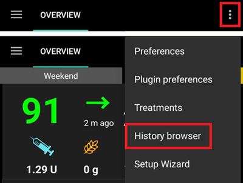

Seleziona la data che vuoi esaminare.

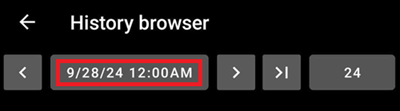

Le opzioni di visualizzazione sono disponibili come nel grafico principale della Panoramica.

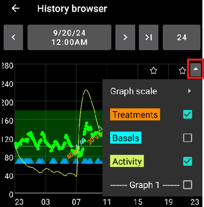

Il menu del 'browser cronologia' consente la selezione dei periodi di tempo da visualizzare nei seguenti intervalli: 6, 12, 18 o 24 ore.

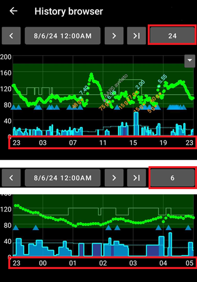

Il 'browser cronologia' può essere spostato avanti e indietro selezionando le frecce di navigazione in base agli intervalli di tempo desiderati (come indicato di seguito).

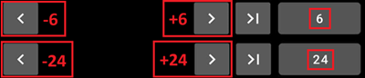

Per tornare al tempo reale seleziona questo pulsante:

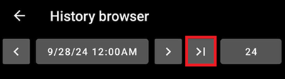

(reviewing-statistics)=
## **Statistiche di AAPS**

**AAPS** fornisce statistiche di monitoraggio di base.

La maggior parte dei valori fa riferimento alle [raccomandazioni](https://diabetesjournals.org/care/article/46/Supplement_1/S97/148053/6-Glycemic-Targets-Standards-of-Care-in-Diabetes) ADA 2023.

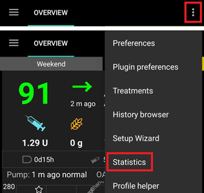

### Dose Totale Giornaliera

**TDD** visualizza le informazioni di una settimana su:

- Σ: la Dose Totale Giornaliera di insulina (**TDD**), la somma di insulina da bolo e basale erogata durante il giorno.
- Bolo: la somma dei trattamenti bolo e degli SMB.
- Basale: solo basale.
- Basale%: la proporzione di insulina basale nella somma (**TDD**).
- Carboidrati: carboidrati dichiarati e trattamenti eCarbs.

La sezione TDD viene calcolata al volo quando si visualizza la pagina e richiede alcuni secondi per essere calcolata.

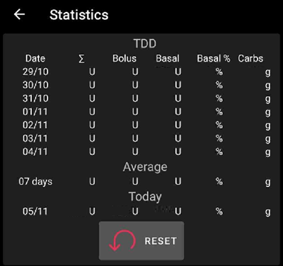

### Tempo nel Range

Tempo nel Range (**TIR**): 70-180 mg/dl o 3.9-10 mmol/l.

Le informazioni sul **TIR** sono disponibili per 7 e 30 giorni, a seconda della quantità di dati disponibili nel database di **AAPS**.

Le statistiche del Tempo nel Range Stretto (TITR) 70-140 mg/dl o 3.9-7.8 mmol/l sono disponibili di seguito.

**Discuti gli obiettivi con il tuo endocrinologo**

Il tuo diabete può variare. Qualsiasi obiettivo suggerito dovrebbe essere discusso con il tuo endocrinologo o team medico di supporto. Se usate correttamente, le statistiche di AAPS possono essere uno strumento efficace per seguire le tendenze della __glicemia__ e monitorare i progressi.

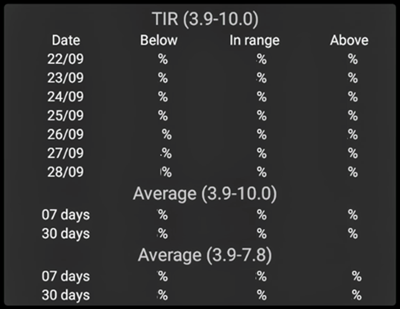

Statistiche dettagliate **TIR** a 14 giorni.

**DS**: Deviazione Standard, un [indicatore](https://www.ncbi.nlm.nih.gov/pmc/articles/PMC3125941/) della variabilità della glicemia (più alta = peggio).

HbA1c: la stima dell'emoglobina glicata risultante, basata sulla media delle misurazioni CGM. Questo è un valore indicativo che potrebbe non corrispondere ai test ematici di HbA1c.

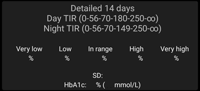

### Monitor attività

Il monitor attività registra il tempo trascorso su ogni attività **AAPS**.

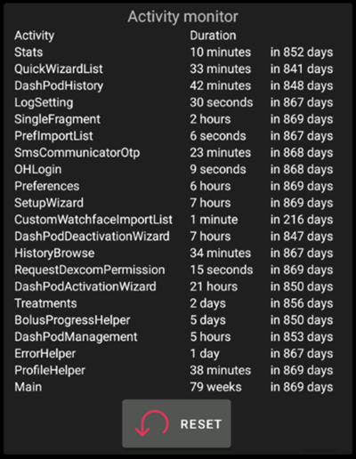

------

## **Qual è la differenza tra Nightscout e Tidepool?**

Nightscout può facilitare l'archiviazione dei dati di **AAPS** dell'utente e offre un'ampia gamma di [strumenti di reportistica](https://nightscout.github.io/nightscout/reports/).

Mentre Tidepool consente all'utente di [esaminare i propri dati](https://www.tidepool.org/viewing-your-data) e fornisce una [semplice condivisione con il team dell'endocrinologo](https://www.tidepool.org/providers/how-it-works#tidepool-data-platform).