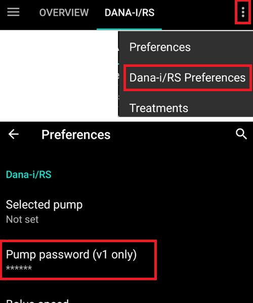

# Controlli necessari dopo l'aggiornamento da AAPS 2.6

- Il codice del programma è stato modificato significativamente passando ad AAPS 2.7.
- È quindi importante apportare alcune modifiche o verificare le impostazioni dopo l'aggiornamento.
- Consulta le [note di rilascio](#Releasenotes-version-2-7-0) per i dettagli sulle funzionalità nuove e ampliate.

## Check BG source

- Controlla se la sorgente glicemia è corretta dopo l'aggiornamento.
- Soprattutto quando si utilizza [xDrip+](../CompatibleCgms/xDrip.md) potrebbe succedere che la sorgente glicemia venga cambiata in app Dexcom (patchata).
- Apri il [Generatore di configurazione](#Config-Builder-bg-source) (menu hamburger in alto a sinistra nella schermata principale)
- Scorri verso il basso fino a "Sorgente BG".
- Seleziona la sorgente BG corretta se sono necessarie modifiche.

## Completa l'esame

- AAPS 2.7 contiene il nuovo obiettivo 11 (nelle versioni successive rinumerato come obiettivo 10!) per le [automazioni](../DailyLifeWithAaps/Automations.md).
- Devi completare l'esame ([obiettivo 3 e 4](#objectives-objective3)) per completare l'obiettivo 11.
- Se ad esempio non hai ancora completato l'esame nell'[obiettivo 3](#objectives-objective3), dovrai completare l'esame prima di poter iniziare l'obiettivo 11.
- Questo non influirà sugli altri obiettivi che hai già completato. Manterrai tutti gli obiettivi completati!

## Set master password

- Necessaria per poter [esportare le impostazioni](ExportImportSettings.md) poiché sono criptate dalla versione 2.7.
- Apri le Preferenze (menu a tre punti in alto a destra della schermata principale)
- Clicca sul triangolo sotto "Generale"
- Clicca su "Password Master"
- Inserisci la password, conferma la password e clicca su OK.

## Esporta le impostazioni

- AAPS 2.7 usa un nuovo formato di backup criptato.
- Devi [esportare le tue impostazioni](ExportImportSettings.md) dopo l'aggiornamento alla versione 2.7.
- I file di impostazioni delle versioni precedenti possono essere importati solo in AAPS 2.7. L'esportazione sarà nel nuovo formato.
- Assicurati di memorizzare le impostazioni esportate non solo sul tuo telefono ma anche in almeno un posto sicuro (il tuo PC, cloud storage...).
- Se compili l'apk di AAPS 2.7 con la stessa chiave delle versioni precedenti, puoi installare la nuova versione senza eliminare la versione precedente.
- Tutte le impostazioni così come gli obiettivi completati rimarranno come erano nella versione precedente.
- Nel caso in cui tu abbia perso la tua chiave, compila la versione 2.7 con una nuova chiave e importa le impostazioni dalla versione precedente come descritto nella [sezione di risoluzione dei problemi](#troubleshooting_androidstudio-lost-keystore).

## Autosens (Suggerimento - nessuna azione necessaria)

- Autosens è stato modificato in un modello di commutazione dinamica che replica il design di riferimento.
- Autosens ora passa tra una finestra di 24 e 8 ore per calcolare la sensibilità. Sceglierà quella più sensibile.
- Se gli utenti vengono da oref1, probabilmente noteranno che il sistema potrebbe essere meno dinamico ai cambiamenti, a causa della variazione di 24 o 8 ore di sensibilità.

## Imposta la password del microinfusore per Dana RS (se si usa Dana RS)

- La password del microinfusore per [Dana RS](../CompatiblePumps/DanaRS-Insulin-Pump.md) non veniva verificata nelle versioni precedenti.
- Apri le Preferenze (menu a tre punti in alto a destra dello schermo)
- Scorri verso il basso e clicca sul triangolo accanto a "Dana RS".
- Clicca su "Password microinfusore (solo v1)"
- Inserisci la password del microinfusore ([La password predefinita](#DanaRS-Insulin-Pump-default-password) è diversa a seconda della versione del firmware) e clicca su OK.

Per cambiare la password su Dana RS segui le istruzioni nella [pagina DanaRS](#DanaRS-Insulin-Pump-change-password-on-pump).
