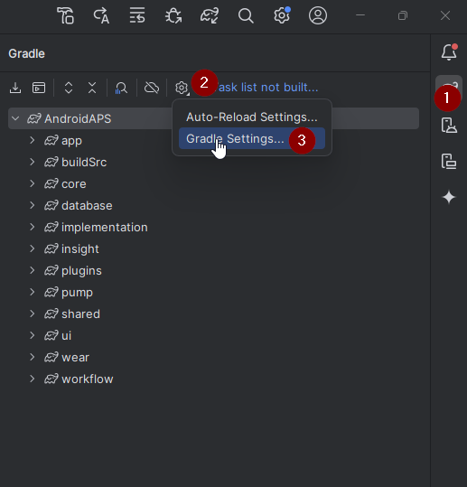
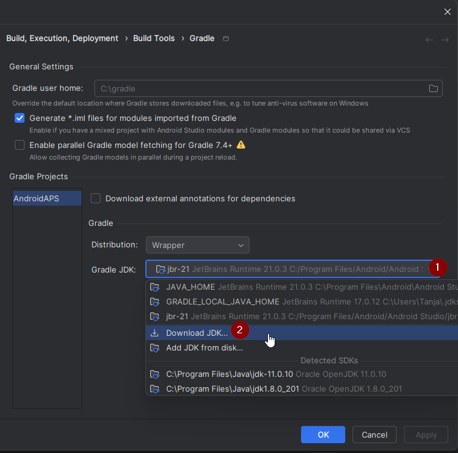
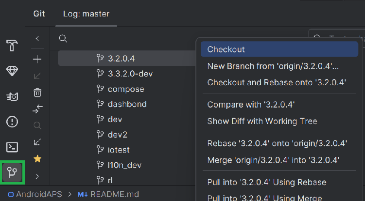
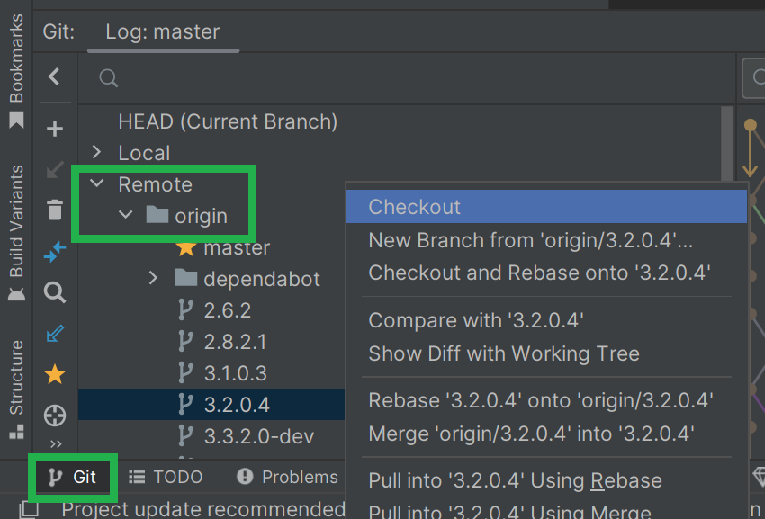
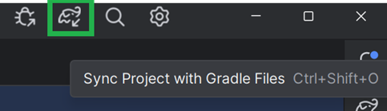
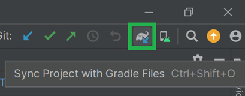

# Aggiornamento ad AAPS 3.2.0.4

(update-aaps-3204)=

## Costruire da soli invece di scaricare

**L'app AAPS (un file apk) non è disponibile per il download, a causa delle normative sui dispositivi medici. È legale costruire l'app per uso personale, ma non devi dare una copia ad altri!**

Consulta la [pagina FAQ](../UsefulLinks/FAQ.md) per i dettagli.

## Specifiche di computer e software per costruire AAPS 3.2.0.4

* Potrebbe essere richiesta una versione specifica di **[Android Studio](https://developer.android.com/studio/)** per costruire l'APK.

| Versione AAPS           | Versione preferita<br/>Android Studio | Versione alternativa<br/>Android Studio | Gradle | JVM |
| ----------------------- | ------------------------------------------- | --------------------------------------------- | ------ |:--- |
| [3.2.0.4](#version3200) | Hedgehog (2023.1.1)                         | fino a Meerkat                                | 8.2    | 17  |

La "versione preferita" è fornita con la versione JVM appropriata. La versione preferita è anche la versione minima che puoi usare per costruire **AAPS**. **NON** potrai costruire con una versione più vecchia di quella "preferita". Se usi una versione diversa, potresti riscontrare problemi relativi alla versione JVM. Consulta la pagina [Risoluzione dei problemi di Android Studio](#troubleshooting_androidstudio-uncommitted-changes) per risolvere questi problemi. Se la tua versione corrente di Android Studio non è elencata nella tabella, devi prima aggiornarla.

La versione di Gradle è collegata al codice sorgente; otterrai sempre la versione corretta di Gradle quando scarichi/aggiorni il codice sorgente. È indicata qui solo come riferimento, non è necessario intervenire.

* I [sistemi Windows a 32 bit](#troubleshooting_androidstudio-unable-to-start-daemon-process) non sono supportati da Android Studio. Tieni presente che sia la **CPU a 64 bit che il sistema operativo a 64 bit sono condizioni obbligatorie.** Se il tuo sistema NON soddisfa questa condizione, devi cambiare l'hardware, il software interessato o l'intero sistema.

<table class="tg">
<tbody>
  <tr>
    <th class="tg-baqh">SO (solo 64 bit)</th>
    <td class="tg-baqh">Windows 8 o superiore</td>
    <td class="tg-baqh">Mac OS 10.14 o superiore</td>
    <td class="tg-baqh">Qualsiasi Linux con supporto Gnome, KDE o Unity DE;&nbsp;&nbsp;GNU C Library 2.31 o successiva</td>
  </tr>
  <tr>
    <th class="tg-baqh"><p align="center">CPU (solo 64 bit)</th>
    <td class="tg-baqh">Architettura CPU x86_64; Intel Core di 2a generazione o più recente, o CPU AMD con supporto per un <br><a href="https://developer.android.com/studio/run/emulator-acceleration#vm-windows" target="_blank" rel="noopener noreferrer"><span style="text-decoration:var(--devsite-link-text-decoration,none)">Windows Hypervisor</span></a></td>
    <td class="tg-baqh">Chip basati su ARM, o Intel Core di 2a generazione o più recente con supporto per <br><a href="https://developer.android.com/studio/run/emulator-acceleration#vm-mac" target="_blank" rel="noopener noreferrer"><span style="text-decoration:var(--devsite-link-text-decoration,none)">Hypervisor.Framework</span></a></td>
    <td class="tg-baqh">Architettura CPU x86_64; Intel Core di 2a generazione o più recente, o processore AMD con supporto per AMD Virtualization (AMD-V) e SSSE3</td>
  </tr>
  <tr>
    <th class="tg-baqh"><p align="center">RAM</th>
    <td class="tg-baqh" colspan="3"><p align="center">8GB o più</td>
  </tr>
  <tr>
    <th class="tg-baqh"><p align="center">Disco</th>
    <td class="tg-baqh" colspan="3"><p align="center">Almeno 30GB di spazio libero. Si consiglia SSD.</td>
  </tr>
  <tr>
    <th class="tg-baqh"><p align="center">Risoluzione</th>
    <td class="tg-baqh" colspan="3"><p align="center">Minimo 1280 x 800 <br></td>
  </tr>
  <tr>
    <th class="tg-baqh"><p align="center">Internet</th>
    <td class="tg-baqh" colspan="3"><p align="center">Banda larga</td>
  </tr>
</tbody>
</table>

**È fortemente raccomandato (non obbligatorio) usare SSD (Solid State Disk) invece di HDD (Hard Disk Drive) perché ci vorrà meno tempo per costruire il file APK di AAPS.** Puoi comunque usare un HDD per costruire il file APK di **AAPS**. In tal caso, il processo di build potrebbe richiedere molto tempo, ma una volta avviato puoi lasciarlo girare senza presidiarlo.

## Aiuto e supporto durante il processo di build 3.2.0.4

In caso di difficoltà nel processo di build dell'app **AAPS**, esiste una sezione dedicata alla [**risoluzione dei problemi di Android Studio**](https://androidaps.readthedocs.io/en/3.2/GettingHelp/TroubleshootingAndroidStudio.html); consultala prima.

Se ritieni che qualcosa nelle istruzioni di build sia errato, mancante o confuso, o hai ancora difficoltà, contatta gli altri utenti di **AAPS** su [Facebook](https://www.facebook.com/groups/AndroidAPSUsers) o [Discord](https://discord.gg/4fQUWHZ4Mw). Se vuoi modificare qualcosa tu stesso (aggiornare gli screenshot _ecc._), invia una [pull request (PR)](../SupportingAaps/HowToEditTheDocs.md).

```{note}
Questa pagina fornisce immagini di esempio sia per la **nuova** interfaccia utente **Classic** di Android Studio.
```

## Panoramica per l'aggiornamento da 3.2.0.x a 3.2.0.4

```{contents} Steps for updating to 3.2.0.4
:depth: 1
:local: true
```

### Esporta le impostazioni correnti

Esporta le tue impostazioni dalla versione esistente di **AAPS** sul tuo telefono. Potrebbe non essere necessario, ma è meglio non rischiare.

Consulta la pagina [Esportare e importare le impostazioni](ExportImportSettings.md) se non ricordi come farlo.

### Aggiorna la tua copia locale di AAPS

* Apri il tuo progetto AAPS esistente con Android Studio. Potrebbe essere necessario selezionare il progetto. Fai (doppio) clic sul progetto AAPS.


<br>


* Nella barra dei menu di Android Studio, seleziona Git -> Fetch


<br>


* Vedrai un messaggio nell'angolo in basso a destra che indica che Fetch è stato eseguito con successo.


<br>


* Nella barra dei menu, seleziona ora Git -> Pull


<br>


* Lascia tutte le opzioni invariate (origin/master) e seleziona Pull


<br>


* Attendi durante il download; lo vedrai come informazione nella barra inferiore. Al termine, verrà visualizzato un messaggio di successo.

  ```{note}
  I file aggiornati potrebbero variare! Questo non è un'indicazione
  ```


<br>


* La sincronizzazione Gradle verrà eseguita per scaricare alcune dipendenze. Attendi che sia terminata.


<br>


### Seleziona la versione JVM 17

- Apri la vista Gradle facendo clic sull'elefante (1) sul lato destro di Android Studio e apri le impostazioni (2) e seleziona **Impostazioni Gradle** (3):



<br>


- Nel campo **Gradle JDK**, verifica se è selezionata la versione appropriata: **jbr-17** (1). In caso contrario, fai clic sul campo e verifica se è già disponibile nell'elenco.




- In Versione (1), seleziona **17**. In Vendor (2) seleziona JetBrains Runtime o qualsiasi Vendor. Posizione (3): non modificare.


- Chiudi la finestra **Impostazioni** con **OK**.

### Seleziona il branch AAPS 3.2.0.4

- In basso a sinistra, seleziona il simbolo Git, fai clic con il tasto destro su 3.2.0.4 e scegli Checkout.



<br>



### Sincronizza il progetto con Gradle

```{admonition} WARNING!
:class: warning
**Non aggiornare mai Gradle.** Sincronizzalo sempre con il progetto.
```

Usa l'icona dell'elefante e Sincronizza progetto con file Gradle (o segui [questo](#gradle-resync)) per la nuova UI.



O ([questo](https://androidaps.readthedocs.io/en/3.2/GettingHelp/TroubleshootingAndroidStudio.html#gradle-resync)) per la UI classica.



### Costruisci l'APK firmato 3.2.0.4

Il codice sorgente è ora la versione rilasciata corrente e tutti i prerequisiti sono stati verificati. È ora di costruire l'APK firmato come descritto nella [sezione build APK firmato](#Building-APK-generate-signed-apk).

### Trasferisci e installa l'APK 3.2.0.4

Devi trasferire l'APK sul tuo telefono per installarlo.

```{note}
Se hai completato la build con lo stesso keystore esistente in Android Studio, non è necessario rimuovere l'app esistente dal telefono. Quando installi l'APK, segui le istruzioni per installare gli aggiornamenti.
Per altri scenari come la creazione di un nuovo keystore in Android Studio per il tuo APK firmato, dovrai eliminare la vecchia app prima di installare l'APK. **Assicurati di esportare le tue impostazioni!**
```

Consulta le istruzioni per [trasferire e installare AAPS](../SettingUpAaps/TransferringAndInstallingAaps.md)

### Verifica la versione AAPS 3.2.0.4 sul telefono

Dopo aver installato il nuovo APK, puoi verificare la versione di AAPS sul tuo telefono cliccando sul menu a tre punti in alto a destra e poi su "Informazioni". Dovresti vedere la versione corrente.

