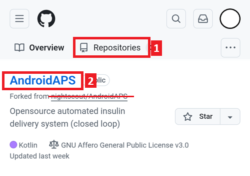
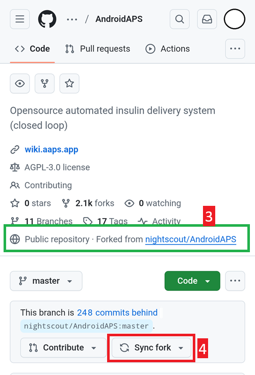
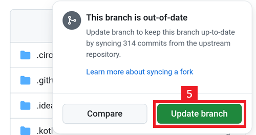
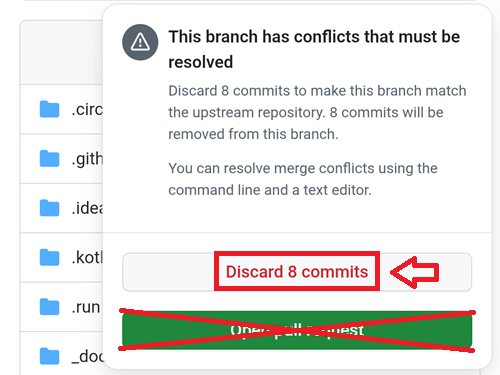
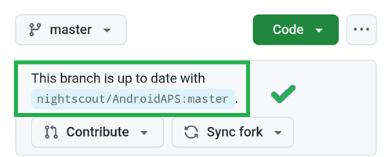

# Aggiornare con un browser

## Costruire da soli invece di scaricare

**AAPS** non è disponibile per il download, a causa delle normative sui dispositivi medici. È legale costruire l'app per uso personale, ma non devi dare una copia ad altri! Consulta la [pagina FAQ](../UsefulLinks/FAQ.md) per i dettagli.

```{note}
Nel caso in cui tu voglia aggiornare **AAPS** con un browser per la prima volta: copia il tuo file keystore di backup su Google Drive. Poi segui la [procedura Browser Build di **AAPS**](../SettingUpAaps/BrowserBuild.md) invece di questa guida. Invece di creare un nuovo keystore, devi selezionare quello che hai copiato dal tuo computer.
Questa operazione sarà obbligatoria solo la prima volta; per gli aggiornamenti successivi potrai seguire questa guida.
```

## Panoramica per l'aggiornamento a una nuova versione di AAPS con un browser

```{contents} Steps for updating to a new version of AAPS
:depth: 1
:local: true
```

In caso di problemi, consulta la pagina separata per la [risoluzione dei problemi di Android Studio](../GettingHelp/TroubleshootingAndroidStudio).

### Esporta le tue impostazioni

Esporta le tue impostazioni dalla versione esistente di **AAPS** sul tuo telefono. Potrebbe non essere necessario, ma è meglio non rischiare.

Consulta la pagina [Esportare e importare le impostazioni](ExportImportSettings.md) se non ricordi come farlo.

(Update-to-new-version-update-your-repo)=
### Aggiorna il tuo repository GitHub

```{admonition} WARNING
:class: warning
Browser Build è disponibile dalla versione AAPS 3.3.2.1.
```

[Accedi a GitHub](https://github.com/login).

1. Seleziona Repository.
2. Scorri verso il basso e seleziona il tuo repository AndroidAPS.



3. Verifica di stare usando la tua copia di AndroidAPS (Forked from nightscout/AndroidAPS)
4. Tocca Sync Fork per aggiornarlo (il numero di commit in ritardo potrebbe essere diverso dall'immagine)




5. Tocca Update Branch



Nota: se hai modificato per errore la tua copia di AndroidAPS, vedrai questa schermata. Scarta tutte le modifiche (commit) per tornare alla versione rilasciata.



Hai ora sincronizzato (aggiornato) la tua copia con l'ultima versione di Android APS. Ottimo lavoro.



### Esegui il Workflow per costruire l'APK firmato

1. Nella tua copia GitHub di AndroidAPS, seleziona Actions.
2. Espandi All Workflows.
3. Seleziona AAPS-CI


4. Scorri verso il basso e tocca Run Workflow.


5. Mantieni il branch impostato su master, seleziona la versione di AAPS che vuoi costruire — l'ultima versione o una versione specifica richiesta — scegli la [variante](variant) (fullRelease), e poi tocca Run workflow.


6. Vedrai il messaggio "Workflow run was successfully requested". Aggiorna la pagina del browser e potrai monitorare il progresso della build. Quando l'azione è completata, l'azione AAPS CI mostrerà un segno di spunta verde. Hai costruito con successo la versione aggiornata di Android APS. Ciò significa che l'APK per telefono e per Wear è ora salvato direttamente nel tuo Google Drive (come indicato di seguito). L'APK di AAPSClient può essere scaricato da Github > nightscout > AndroidAPS [qui](https://github.com/nightscout/AndroidAPS/releases)


### Installa l'APK di AAPS

1. Apri il tuo Google Drive
2. Naviga in AAPS, seleziona la cartella della nuova versione e troverai sia la versione per telefono che quella per Android Wear.


Continua [qui](#Update-to-new-version-check-aaps-version-on-phone)

## Risoluzione dei problemi

Se qualcosa va storto, non farti prendere dal panico.

Fai un respiro!

Poi consulta i [suggerimenti per la risoluzione dei problemi](#aaps-ci-preparation) se il tuo problema è già documentato!

Se hai bisogno di ulteriore aiuto, contatta gli altri utenti di **AAPS** su [Facebook](https://www.facebook.com/groups/AndroidAPSUsers) o [Discord](https://discord.gg/4fQUWHZ4Mw).
