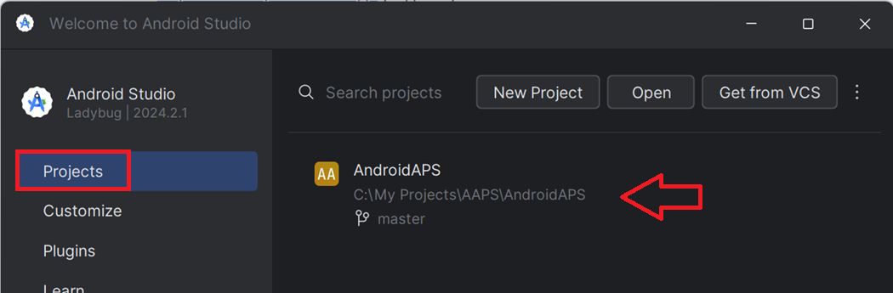
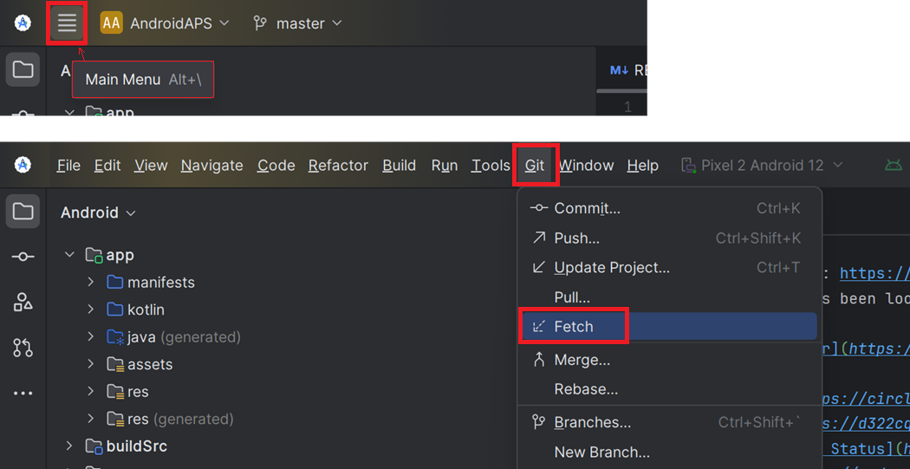
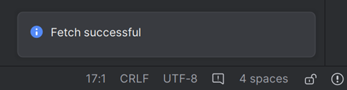
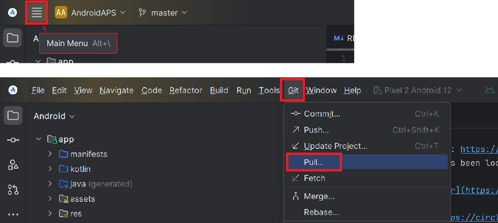
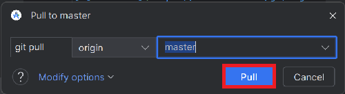
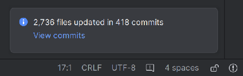
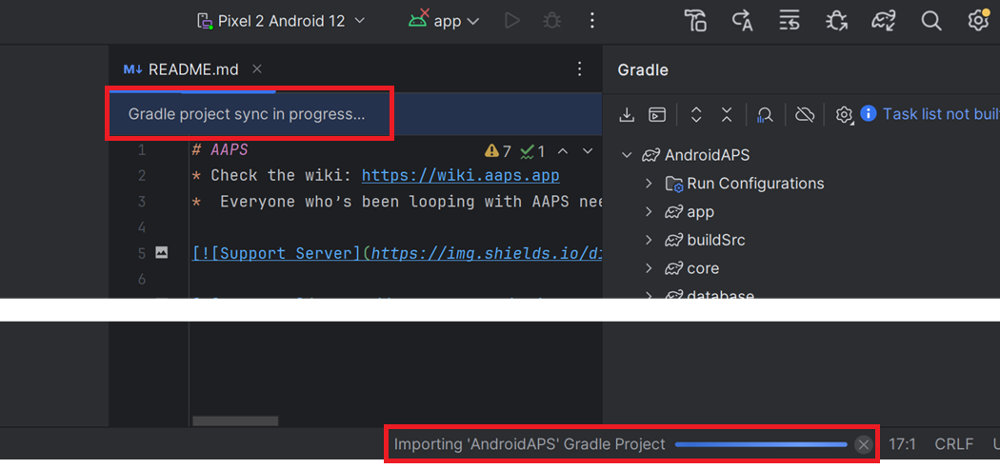

# Aggiornare con Android Studio

## Costruire da soli invece di scaricare

**AAPS** non è disponibile per il download, a causa delle normative sui dispositivi medici. È legale costruire l'app per uso personale, ma non devi dare una copia ad altri! Consulta la [pagina FAQ](../UsefulLinks/FAQ.md) per i dettagli.

```{note}
Nel caso in cui tu voglia costruire **AAPS** su un nuovo computer: copia il tuo file keystore di backup sul nuovo computer. Poi segui la [procedura di build iniziale di **AAPS**](../SettingUpAaps/BuildingAaps.md) invece di questa guida. Con l'unica differenza che invece di creare un nuovo keystore, puoi selezionare quello che hai copiato sul nuovo computer.
```

## Panoramica per l'aggiornamento a una nuova versione di AAPS con Android Studio

```{contents} Steps for updating to a new version of AAPS
:depth: 1
:local: true
```

In caso di problemi, consulta la pagina separata per la [risoluzione dei problemi di Android Studio](../GettingHelp/TroubleshootingAndroidStudio).

### Esporta le tue impostazioni

Esporta le tue impostazioni dalla versione esistente di **AAPS** sul tuo telefono. Potrebbe non essere necessario, ma è meglio non rischiare.

Consulta la pagina [Esportare e importare le impostazioni](ExportImportSettings.md) se non ricordi come farlo.

### Verifica la versione di Android Studio

La versione minima richiesta è descritta nelle [Istruzioni per la build](#Building-APK-recommended-specification-of-computer-for-building-apk-file). Se la tua versione è più vecchia, [aggiorna prima Android Studio](#Building-APK-install-android-studio)!

(Update-to-new-version-update-your-local-copy)=
### Aggiorna la tua copia locale

```{admonition} WARNING
:class: warning
Se stai aggiornando da versioni precedenti alla 2.8.x, segui le istruzioni per fare un [Nuovo clone](../SettingUpAaps/BuildingAaps.md), poiché questa guida non funzionerà per te!
```

* Apri il tuo progetto AAPS esistente con Android Studio. Potrebbe essere necessario selezionare il progetto. Fai (doppio) clic sul progetto AAPS.

  

* Nella barra dei menu di Android Studio, seleziona Git -> Fetch

   

* Vedrai un messaggio nell'angolo in basso a destra che indica che Fetch è stato eseguito con successo.

   

* Nella barra dei menu, seleziona ora Git -> Pull

   

* Lascia tutte le opzioni invariate (origin/master) e seleziona Pull

   

* Attendi durante il download; lo vedrai come informazione nella barra inferiore. Al termine, verrà visualizzato un messaggio di successo.

  ```{note}
  I file aggiornati potrebbero variare! Questo non è un'indicazione
  ```

   

* La sincronizzazione Gradle verrà eseguita per scaricare alcune dipendenze. Attendi che sia terminata.

  

### Verifica la versione JVM

Questo controllo è particolarmente indicato se hai già costruito una versione precedente di **AAPS** sullo stesso computer.

Verifica nelle [Istruzioni per la build](#Building-APK-recommended-specification-of-computer-for-building-apk-file) la versione richiesta per JVM, corrispondente alla versione di **AAPS** che stai costruendo. Poi segui i passaggi descritti in [Gradle JVM incompatibile](#incompatible-gradle-jvm) per assicurarti di usare attualmente la versione corretta.

(Update-to-new-version-build-the-signed-apk)=
### Costruisci l'APK firmato

Il codice sorgente è ora la versione rilasciata corrente e tutti i prerequisiti sono stati verificati. È ora di costruire l'APK firmato come descritto nella [sezione build APK firmato](#Building-APK-generate-signed-apk).

(Update-to-new-version-transfer-and-install)=

### Trasferisci e installa l'APK
Devi trasferire l'APK sul tuo telefono per installarlo.

```{note}
Se hai completato la build con lo stesso keystore esistente in Android Studio, non è necessario rimuovere l'app esistente dal telefono. Quando installi l'APK, segui le istruzioni per installare gli aggiornamenti.
Per altri scenari come la creazione di un nuovo keystore in Android Studio per il tuo APK firmato, dovrai eliminare la vecchia app prima di installare l'APK. **Assicurati di esportare le tue impostazioni!**
```

Consulta le istruzioni per [trasferire e installare AAPS](../SettingUpAaps/TransferringAndInstallingAaps.md)

Continua [qui](#Update-to-new-version-check-aaps-version-on-phone).

## Risoluzione dei problemi

Se qualcosa va storto, non farti prendere dal panico.

Fai un respiro!

Poi consulta la pagina separata [risoluzione dei problemi di Android Studio](../GettingHelp/TroubleshootingAndroidStudio) se il tuo problema è già documentato!

Se hai bisogno di ulteriore aiuto, contatta gli altri utenti di **AAPS** su [Facebook](https://www.facebook.com/groups/AndroidAPSUsers) o [Discord](https://discord.gg/4fQUWHZ4Mw).